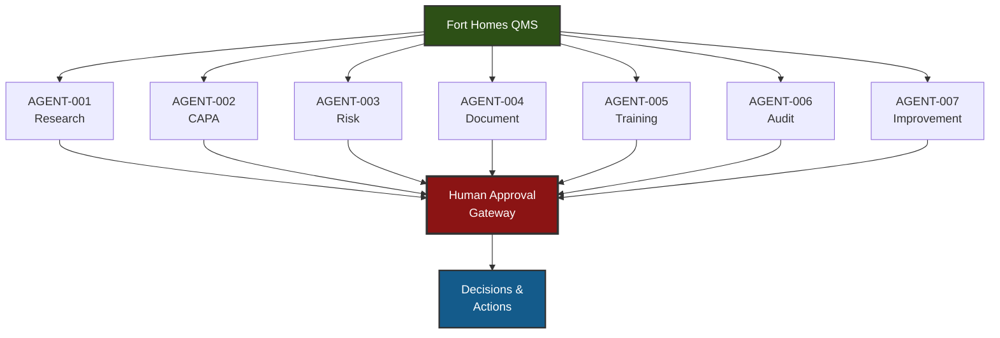

<div class="document-header" style="background: linear-gradient(135deg, #101810 0%, #145B8B 100%); color: white; padding: 40px; text-align: center; border-radius: 8px; margin-bottom: 30px; box-shadow: 0 4px 6px rgba(0,0,0,0.1);">
  <div style="font-size: 48px; font-weight: bold; letter-spacing: 2px; margin-bottom: 10px;">
    🏗️ FORT HOMES
  </div>
  <div style="font-size: 24px; font-weight: 300; letter-spacing: 1px; margin-bottom: 5px;">
    AI AGENT ARCHITECTURE
  </div>
  <div style="font-size: 20px; font-weight: bold; margin-top: 20px; padding-top: 20px; border-top: 2px solid rgba(255,255,255,0.3);">
    Next-Generation QMS Ecosystem
  </div>
  <div style="font-size: 16px; margin-top: 10px; opacity: 0.9;">
    Grand Junction, Colorado
  </div>
</div>

# AI AGENT ARCHITECTURE
## Next-Generation QMS with AI-Powered Automation

---

## 📋 DOCUMENT CONTROL

| **Attribute** | **Details** |
|:---|:---|
| **Document ID** | AI-AGENT-ARCHITECTURE-2026 |
| **Version** | 1.0 |
| **Effective Date** | 2026-01-15 |
| **Process Owner** | Chief Information Officer |
| **Classification** | CONTROLLED |
| **Review Cycle** | Semi-Annual |
| **Next Review Date** | 2026-07-15 |

---

## 🎯 EXECUTIVE SUMMARY

Fort Homes is developing an AI-powered Quality Management System featuring seven specialized agents that automate routine tasks, provide intelligent insights, and enhance decision-making while maintaining human oversight for all critical decisions.

### Vision

**"Human-Centered AI: Augmenting expertise, not replacing it"**

AI agents will:
- ✅ **Automate** - Routine data analysis, document drafting, monitoring
- ✅ **Assist** - Root cause analysis, risk assessment, recommendations
- ✅ **Alert** - Proactive notifications, trend identification, compliance gaps
- ✅ **Advise** - Data-driven insights for management decisions

**All critical decisions require human approval.**

---

## 🤖 AI AGENT ECOSYSTEM OVERVIEW

<div style="background: white; padding: 20px; border: 2px solid #ddd; border-radius: 8px; margin: 20px 0;">

### Seven Specialized Agents



</div>

---

## 🤖 AGENT-001: RESEARCH AGENT

<div style="background: #E7F3FF; padding: 20px; border-left: 4px solid #145B8B; margin: 20px 0;">

### Purpose
Continuously monitor regulatory updates, industry best practices, and compliance requirements related to HUD Code, CCR, NEC, and NTA TPIA.

### Capabilities
- Monitor HUD Code updates (24 CFR 3280/3282/3285)
- Track NEC code cycles and changes
- Monitor Colorado CCR 8 CCR 1302-14 updates
- Research industry best practices
- Analyze competitor compliance approaches
- Summarize regulatory changes for stakeholders

### Inputs
- Federal Register (HUD updates)
- NFPA NEC updates
- Colorado CDOH publications
- NTA TPIA communications
- Industry publications and forums

### Outputs
- Weekly compliance briefing
- Regulation change alerts
- Impact analysis summaries
- Recommended QMS updates

### Human Approval Gate
- **Optional** for research summaries
- **Required** for recommended QMS changes

### Automation Level
🟢 **High** - Fully automated monitoring and summarization

</div>

---

## 🤖 AGENT-002: CAPA AGENT

<div style="background: #F8D7DA; padding: 20px; border-left: 4px solid #8B1414; margin: 20px 0;">

### Purpose
Analyze nonconformances, assist with root cause analysis, recommend corrective actions, and track CAPA effectiveness.

### Capabilities
- Analyze NCR patterns and trends
- Suggest root causes based on historical data
- Recommend corrective actions from knowledge base
- Draft CAPA plans
- Monitor CAPA completion and overdue actions
- Predict CAPA effectiveness based on similar cases
- Generate CAPA performance reports

### Inputs
- NCR database
- NTA TPIA inspection findings
- Historical CAPA records
- Process performance data
- Audit findings

### Outputs
- Root cause analysis suggestions
- Recommended corrective actions
- Draft CAPA plans
- Effectiveness predictions
- CAPA status dashboards
- Trend analysis reports

### Human Approval Gate
- **Required** for all Critical/Major NCRs
- **Required** for CAPA plan approval
- **Optional** for Minor NCRs (human review available)

### Automation Level
🟡 **Medium** - AI recommends, human approves

</div>

---

## 🤖 AGENT-003: RISK AGENT

<div style="background: #FFF3CD; padding: 20px; border-left: 4px solid #8B6914; margin: 20px 0;">

### Purpose
Monitor risks, calculate risk priority numbers (RPN), alert stakeholders to emerging risks, and recommend mitigation actions.

### Capabilities
- Calculate FMEA scores (Severity × Occurrence × Detection)
- Monitor risk indicators in real-time
- Identify emerging risks from process data
- Recommend risk mitigation actions
- Track mitigation effectiveness
- Generate risk dashboard and reports
- Alert management to critical risks

### Inputs
- NCR database
- Production data
- Quality metrics
- NTA TPIA inspection results
- Process performance data
- Historical risk register

### Outputs
- Risk Priority Number (RPN) calculations
- Risk alerts and notifications
- Recommended mitigation actions
- Risk trend analysis
- Risk dashboard updates

### Human Approval Gate
- **Required** for new risk addition to register
- **Required** for critical risk mitigation plans
- **Optional** for risk score updates (human oversight)

### Automation Level
🟢 **High** - Automated monitoring and scoring, human decides mitigation

</div>

---

## 🤖 AGENT-004: DOCUMENT AGENT

<div style="background: #D4EDDA; padding: 20px; border-left: 4px solid #2D5016; margin: 20px 0;">

### Purpose
Manage document lifecycle, identify documentation gaps, draft documents using templates, and ensure compliance with document control requirements.

### Capabilities
- Identify missing or outdated documents
- Draft new SOPs/WIs using templates
- Suggest document updates based on changes
- Check document control compliance
- Generate document revision summaries
- Track document review cycles
- Alert owners of upcoming reviews

### Inputs
- QMS document repository
- Document control policies (QMS-008)
- Process change notifications
- Regulatory updates
- User document requests

### Outputs
- Gap analysis reports
- Draft documents (using templates)
- Document review reminders
- Compliance status reports
- Revision history summaries

### Human Approval Gate
- **Required** for all document releases
- **Required** for major revisions
- **Optional** for draft document review

### Automation Level
🟡 **Medium** - AI drafts, human approves and finalizes

</div>

---

## 🤖 AGENT-005: TRAINING AGENT

<div style="background: #E7F3FF; padding: 20px; border-left: 4px solid #145B8B; margin: 20px 0;">

### Purpose
Monitor training compliance, identify competency gaps, recommend training assignments, and track certification expirations.

### Capabilities
- Monitor training matrix compliance
- Identify overdue training
- Recommend training based on role/incidents
- Track certification expirations
- Analyze competency assessment results
- Generate training compliance reports
- Auto-assign training based on triggers

### Inputs
- Training matrix (comprehensive)
- Employee records and roles
- Training completion data
- Certification databases
- NCR data (incident-based training needs)
- Competency assessment results

### Outputs
- Training compliance dashboards
- Overdue training alerts
- Training assignment recommendations
- Certification expiration warnings
- Competency gap analysis
- Training effectiveness reports

### Human Approval Gate
- **Optional** for routine training assignments
- **Required** for remedial training (incident-based)
- **Required** for training exceptions

### Automation Level
🟢 **High** - Automated monitoring and assignment, human oversight for exceptions

</div>

---

## 🤖 AGENT-006: AUDIT AGENT

<div style="background: #F8D7DA; padding: 20px; border-left: 4px solid #8B1414; margin: 20px 0;">

### Purpose
Assist with audit planning, analyze audit findings, track corrective actions, and identify audit trends.

### Capabilities
- Generate audit schedules
- Suggest audit checklist items based on scope
- Analyze audit findings for patterns
- Track finding closure and effectiveness
- Identify repeat findings
- Generate audit performance metrics
- Recommend focus areas for next audits

### Inputs
- Audit schedule and history
- Audit finding database
- CAPA system
- Process performance data
- Regulatory requirements
- Previous audit reports

### Outputs
- Audit schedule recommendations
- Suggested checklist questions
- Finding trend analysis
- Audit performance dashboards
- Recommended audit focus areas
- Finding closure status reports

### Human Approval Gate
- **Required** for audit schedule approval
- **Required** for critical finding classification
- **Optional** for trend analysis reports

### Automation Level
🟡 **Medium** - AI assists planning and analysis, human conducts audit

</div>

---

## 🤖 AGENT-007: IMPROVEMENT AGENT

<div style="background: #FFF3CD; padding: 20px; border-left: 4px solid #8B6914; margin: 20px 0;">

### Purpose
Identify improvement opportunities, estimate ROI, track improvement initiatives, and recommend priority improvements.

### Capabilities
- Analyze process performance data for inefficiencies
- Identify cost-saving opportunities
- Estimate ROI for improvements
- Track improvement project status
- Recommend prioritization based on impact
- Generate improvement register
- Monitor improvement effectiveness

### Inputs
- Process performance data
- Quality metrics and KPIs
- Cost data (rework, waste, NCRs)
- Employee suggestions
- Benchmark data
- Historical improvement records

### Outputs
- Improvement opportunity reports
- ROI estimates and cost-benefit analysis
- Prioritized improvement recommendations
- Improvement project status dashboards
- Effectiveness measurement reports

### Human Approval Gate
- **Required** for improvement project approval
- **Required** for resource allocation
- **Optional** for opportunity identification

### Automation Level
🟡 **Medium** - AI identifies and recommends, human decides and implements

</div>

---

## 🔐 HUMAN-IN-THE-LOOP GOVERNANCE

<div style="background: #F8D7DA; padding: 20px; border-left: 4px solid #8B1414; margin: 20px 0;">

### Governance Principles

**1. Human Authority**
- Humans make all final decisions
- AI provides recommendations, not mandates
- Override capability for all AI suggestions

**2. Transparency**
- AI reasoning visible and explainable
- Audit trail of all AI actions
- Data sources documented

**3. Accountability**
- Human approver identified for every decision
- Approval timestamps recorded
- Escalation paths defined

**4. Safety**
- Critical decisions require human approval
- Error handling and fail-safes
- Regular AI performance audits

</div>

### Approval Workflow Example

```
AI Agent Recommendation
        ↓
    Risk Assessment
        ↓
   ┌────────────┐
   │ Risk Level │
   └────────────┘
        ↓
   ┌─────┴─────┐
   │           │
Critical    Minor
   │           │
   ↓           ↓
Required    Optional
Approval    Approval
   │           │
   └─────┬─────┘
         ↓
    Implementation
```

### SLA Definitions

<div style="background: white; padding: 20px; border: 2px solid #ddd; border-radius: 8px; margin: 20px 0;">

| Decision Type | SLA | Escalation (if overdue) |
|:---|:---:|:---|
| **Critical** (Safety, HUD compliance) | 4 hours | → Quality Manager → GM |
| **Major** (Significant quality/cost) | 24 hours | → Quality Manager |
| **Routine** (Normal operations) | 48 hours | → Supervisor |
| **Informational** (Reports, trends) | No SLA | N/A |

</div>

---

## 🔒 SECURITY & ACCESS CONTROL

<div style="background: #E7F3FF; padding: 20px; border-left: 4px solid #145B8B; margin: 20px 0;">

### Security Principles

**Data Security:**
- Encrypted data at rest and in transit
- Role-based access control (RBAC)
- Audit logs for all agent actions
- Secure API connections
- Regular security audits

**Privacy:**
- Personnel data protected per HIPAA/privacy laws
- Anonymized data for trend analysis where possible
- Limited access to sensitive information

**AI Model Security:**
- Protected from tampering
- Version control for AI models
- Regular performance validation
- Bias detection and mitigation

</div>

---

## 📊 IMPLEMENTATION PHASES

<div style="background: white; padding: 20px; border: 2px solid #ddd; border-radius: 8px; margin: 20px 0;">

### Phase 1: Foundation (2026 Q1-Q2)
- AI agent architecture design
- Data infrastructure setup
- Initial agent development (Research Agent)
- Human approval workflow implementation
- Pilot testing with one agent

### Phase 2: Core Agents (2026 Q3-Q4)
- Deploy CAPA Agent
- Deploy Risk Agent
- Deploy Training Agent
- User training and adoption
- Performance monitoring

### Phase 3: Advanced Agents (2027 Q1-Q2)
- Deploy Document Agent
- Deploy Audit Agent
- Deploy Improvement Agent
- Integration optimization
- Advanced analytics

### Phase 4: Optimization (2027 Q3+)
- AI model refinement
- Expanded capabilities
- Advanced automation
- Continuous improvement

</div>

---

## 📈 SUCCESS METRICS

<div style="background: #D4EDDA; padding: 20px; border-left: 4px solid #2D5016; margin: 20px 0;">

### AI Agent Performance Metrics

| Metric | Target | Measurement |
|:---|:---|:---|
| **Agent Uptime** | >99% | System availability |
| **Response Time** | <5 seconds | Average query response |
| **Recommendation Acceptance Rate** | >70% | Human approval rate |
| **False Positive Rate** | <10% | Incorrect alerts/recommendations |
| **Time Savings** | >20% | Reduced manual effort |
| **Cost Reduction** | >15% | COPQ reduction |
| **User Satisfaction** | >4.0/5.0 | User surveys |

### Business Impact Metrics

- Reduced NCR resolution time
- Improved NTA TPIA first-pass rate
- Faster CAPA closure
- Better training compliance
- Reduced audit findings
- Increased improvement project completion

</div>

---

## 🔄 CONTINUOUS LEARNING & IMPROVEMENT

AI agents will continuously learn from:
- User feedback and approvals/rejections
- Outcome effectiveness (were recommendations successful?)
- New data and patterns
- Industry best practices
- Regulatory updates

**Human feedback loop:**
- Accept/Reject agent recommendations → Improve future recommendations
- Identify false positives → Refine detection algorithms
- Success/failure of actions → Better ROI predictions

---

## 🔄 REVISION HISTORY

| Version | Date | Description | Author | Approved By |
|:---|:---|:---|:---|:---|
| 1.0 | 2026-01-15 | Initial AI agent architecture | CIO + Quality Manager | Executive Leadership |

---

## ✅ APPROVAL SIGNATURES

| Role | Name | Signature | Date |
|:---|:---|:---|:---|
| **Prepared By** | Chief Information Officer | _________________ | 2026-01-15 |
| **Reviewed By** | Quality Manager | _________________ | 2026-01-15 |
| **Approved By** | General Manager | _________________ | 2026-01-15 |

---

**Document Classification:** CONTROLLED  
**Distribution:** Executive Leadership, IT, Quality  
**Next Review Date:** 2026-07-15

---

**Related Documents:**
- Individual agent specifications (AGENT-001 through AGENT-007)
- HUMAN-APPROVAL-WORKFLOWS.md
- QMS transformation roadmap

---

*This AI agent architecture establishes Fort Homes' vision for an intelligent, human-centered Quality Management System that augments human expertise while maintaining human authority for all critical decisions.*
