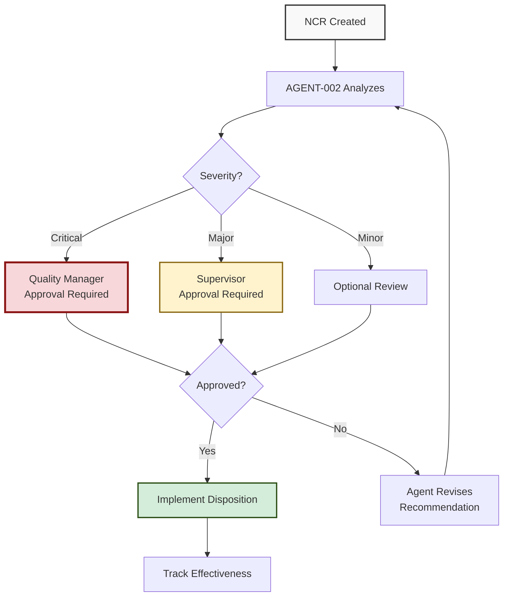
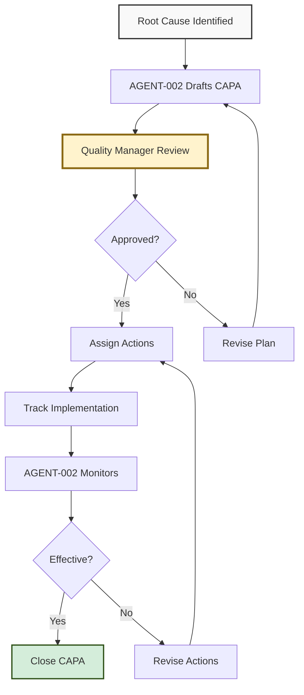
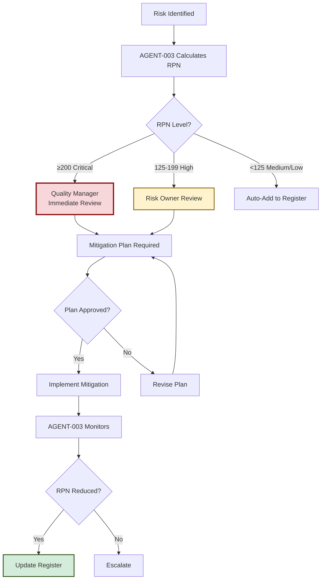
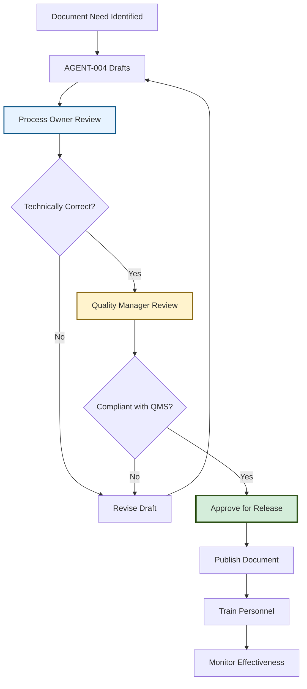
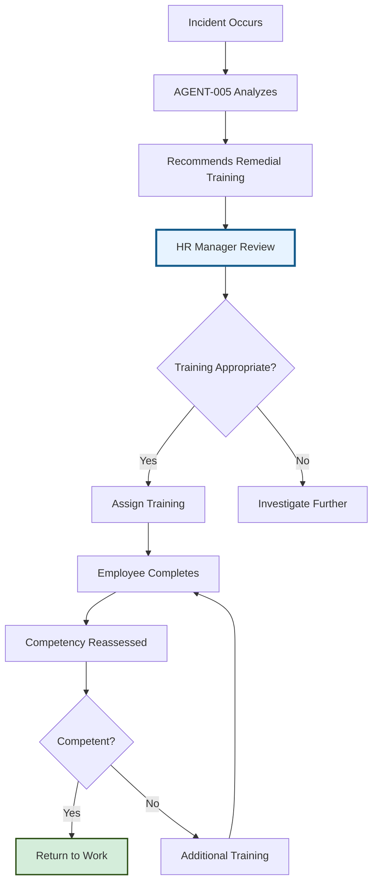
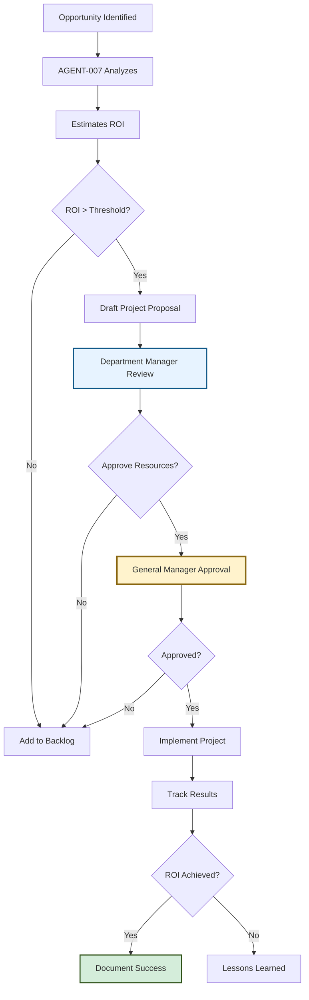

  

    🏗️ FORT HOMES
  

  

    HUMAN APPROVAL WORKFLOWS
  

  

    AI Agent Governance Framework
  

  

    Grand Junction, Colorado
  

# HUMAN APPROVAL WORKFLOWS
## AI Agent Human-in-the-Loop Governance

---

## 📋 DOCUMENT CONTROL

| **Attribute** | **Details** |
|:---|:---|
| **Document ID** | HUMAN-APPROVAL-WORKFLOWS-2026 |
| **Version** | 1.0 |
| **Effective Date** | 2026-01-15 |
| **Process Owner** | Chief Information Officer |
| **Classification** | CONTROLLED |
| **Review Cycle** | Semi-Annual |
| **Next Review Date** | 2026-07-15 |

---

## 🎯 GOVERNANCE PHILOSOPHY

**"AI Recommends, Humans Decide"**

All AI agent recommendations require human oversight and approval for critical decisions. This ensures:
- **Safety** - Human judgment for critical situations
- **Accountability** - Clear decision ownership
- **Transparency** - Visible reasoning and audit trails
- **Control** - Humans retain ultimate authority

---

## 🔐 APPROVAL AUTHORITY MATRIX

| Decision Type | Risk Level | Approval Required | Approver | SLA | Escalation |
|:---|:---:|:---:|:---|:---:|:---|
| **Safety/HUD Compliance** | 🔴 Critical | Required | Quality Manager | 4 hours | → General Manager |
| **Major NCR Disposition** | 🔴 Critical | Required | Quality Manager + NTA TPIA | 8 hours | → General Manager |
| **CAPA Plan (Critical)** | 🔴 Critical | Required | Quality Manager | 24 hours | → General Manager |
| **New Risk to Register** | 🟡 High | Required | Quality Manager | 48 hours | → Operations Mgr |
| **Document Release** | 🟡 High | Required | Process Owner + Quality | 48 hours | → Quality Manager |
| **Training Assignment (Remedial)** | 🟡 High | Required | HR Manager | 48 hours | → Operations Mgr |
| **CAPA Plan (Major)** | 🟡 High | Required | Supervisor | 48 hours | → Quality Manager |
| **Improvement Project** | 🟢 Medium | Required | Department Manager | 5 days | → General Manager |
| **Risk Score Update** | 🟢 Medium | Optional | Risk Owner | 5 days | N/A |
| **Routine Training Assignment** | 🟢 Medium | Optional | Supervisor | 7 days | N/A |
| **Trend Reports/Analytics** | ⚪ Low | Optional | N/A | None | N/A |

---

## 📋 WORKFLOW 1: NCR DISPOSITION APPROVAL

### Trigger
AGENT-002 (CAPA Agent) analyzes NCR and recommends disposition

### Workflow Steps

### Approval Criteria

**Critical NCR (Safety, HUD Compliance):**
- Approver: Quality Manager
- SLA: 4 hours
- Required Information:
  - NCR details and evidence
  - Root cause analysis
  - Recommended disposition
  - AI confidence score
  - Regulatory impact assessment

**Major NCR:**
- Approver: Production Supervisor
- SLA: 24 hours
- May require NTA TPIA approval if impacts inspection

**Minor NCR:**
- Approver: Optional (auto-approve with notification)
- Human can review and override

### Escalation Path

If not approved within SLA:
1. Automated reminder at 50% of SLA
2. Escalate to Quality Manager at 100% of SLA
3. Escalate to General Manager at 150% of SLA

---

## 📋 WORKFLOW 2: CAPA PLAN APPROVAL

### Trigger
AGENT-002 (CAPA Agent) drafts corrective/preventive action plan

### Workflow Steps

### Approval Requirements

**CAPA Owner Reviews:**
- Root cause analysis validity
- Action appropriateness
- Resource feasibility
- Timeline reasonableness
- Expected effectiveness

**Quality Manager Approves:**
- CAPA plan meets QMS standards
- Actions address root cause
- Effectiveness verification defined
- Resources allocated

### Override Authority

Quality Manager can:
- Modify AI-recommended actions
- Adjust priorities and timelines
- Request additional analysis
- Reject plan entirely

---

## 📋 WORKFLOW 3: RISK MITIGATION APPROVAL

### Trigger
AGENT-003 (Risk Agent) identifies high-risk condition (RPN ≥ 200)

### Workflow Steps

### Critical Risk Alert

**Immediate Actions (RPN ≥ 200):**
1. Alert Quality Manager (SMS + Email)
2. Hold production if safety-related
3. Notify General Manager within 1 hour
4. Mitigation plan required within 24 hours

**High Risk (RPN 125-199):**
1. Notify Risk Owner
2. Mitigation plan required within 1 week
3. Monthly review until RPN < 125

---

## 📋 WORKFLOW 4: DOCUMENT RELEASE APPROVAL

### Trigger
AGENT-004 (Document Agent) drafts new/revised document

### Workflow Steps

### Two-Stage Approval

**Stage 1: Process Owner**
- Technical accuracy verified
- Procedural steps correct
- Practical and implementable

**Stage 2: Quality Manager**
- QMS standards compliance
- Regulatory requirements met
- Document control requirements
- Cross-references valid

### Auto-Approval for Minor Revisions

Minor revisions (typos, formatting) may be auto-approved if:
- No content changes
- Process Owner notified
- Quality Manager has visibility

---

## 📋 WORKFLOW 5: TRAINING ASSIGNMENT APPROVAL

### Trigger
AGENT-005 (Training Agent) recommends training assignment

### Workflow Types

**Type A: Routine Auto-Assignment**
- New hire onboarding
- Scheduled retraining
- Certification renewals
- NO approval required (notify supervisor)

**Type B: Incident-Based Training**
- NCR involving operator error
- Safety incident
- NTA TPIA rejection
- REQUIRES HR Manager approval

### Workflow Steps (Type B)

---

## 📋 WORKFLOW 6: IMPROVEMENT PROJECT APPROVAL

### Trigger
AGENT-007 (Improvement Agent) identifies opportunity with estimated ROI

### Workflow Steps

### Approval Thresholds

| Investment | ROI Requirement | Approver |
|---:|---:|:---|
| < $5,000 | > 100% (1 year) | Department Manager |
| $5,000 - $25,000 | > 150% (1 year) | General Manager |
| > $25,000 | > 200% (1 year) | Executive Team |

---

## 🔒 SECURITY & AUDIT CONTROLS

### Audit Trail Requirements

**Every AI agent action must log:**
- Timestamp (ISO 8601)
- Agent ID and version
- Input data and sources
- Recommendation/output
- Confidence score
- Human approver (if required)
- Approval decision and timestamp
- Rationale for approval/rejection

### Override Procedures

**Humans can always:**
- Reject AI recommendations
- Modify recommendations
- Request additional analysis
- Escalate to higher authority
- Pause AI agent temporarily
- Report AI errors/issues

### Emergency Stop

Quality Manager or General Manager can:
- Immediately suspend any AI agent
- Revert to manual processes
- Investigate AI behavior
- Require review before restart

---

## 📊 APPROVAL METRICS & MONITORING

### Key Metrics

| Metric | Target | Alert Threshold |
|:---|---:|---:|
| **Approval Rate** | > 70% | < 50% |
| **SLA Compliance** | > 95% | < 85% |
| **Override Rate** | < 15% | > 30% |
| **Time to Approval** | Within SLA | > 150% of SLA |
| **Escalation Rate** | < 10% | > 20% |

### Monthly Review

Management reviews:
- Approval patterns and trends
- SLA compliance by approver
- Override reasons and frequency
- AI recommendation quality
- Process improvements needed

---

## 🔄 CONTINUOUS IMPROVEMENT

### AI Learning from Approvals

- **Approved recommendations** → Reinforce AI model
- **Modified recommendations** → Learn from human judgment
- **Rejected recommendations** → Identify AI weaknesses
- **Overrides** → Understand human reasoning

### Quarterly Calibration

- Review AI performance metrics
- Adjust confidence thresholds
- Update approval workflows
- Refine SLAs based on data
- Train approvers on new patterns

---

## 🔄 REVISION HISTORY

| Version | Date | Description | Author | Approved By |
|:---|:---|:---|:---|:---|
| 1.0 | 2026-01-15 | Initial human approval workflows | CIO + Quality Manager | Executive Leadership |

---

## ✅ APPROVAL SIGNATURES

| Role | Name | Signature | Date |
|:---|:---|:---|:---|
| **Prepared By** | Chief Information Officer | _________________ | 2026-01-15 |
| **Reviewed By** | Quality Manager | _________________ | 2026-01-15 |
| **Approved By** | General Manager | _________________ | 2026-01-15 |

---

**Document Classification:** CONTROLLED  
**Distribution:** Executive Leadership, IT, Quality  
**Next Review Date:** 2026-07-15

---

*These human approval workflows ensure Fort Homes maintains control and accountability over AI agent decisions while maximizing efficiency and safety.*
