# VISUAL ENHANCEMENT AGENT
## Autonomous QMS Documentation Modernization Workflow

---

<div align="center">

| **Agent ID** | **AGENT-VIS-001** |
|:---|:---|
| **Version** | 1.0 |
| **Created** | January 29, 2026 |
| **Autonomy Level** | <span style="background:#FF9800;color:white;padding:4px 12px;border-radius:12px;font-weight:bold;">⚡ SEMI-AUTONOMOUS</span> |
| **Human Approval** | Required for batch operations |

</div>

---

## 🎯 AGENT MISSION

**Primary Objective:** Systematically transform all 56+ Fort Homes QMS documents from current state to cutting-edge visual standards as defined in QMS-VISUAL-ENHANCEMENT-SPEC.md.

**Success Criteria:**
- ✅ All documents updated with badge systems
- ✅ KPI dashboard cards added where metrics exist
- ✅ Tables enhanced with trends and heatmaps
- ✅ Collapsible sections implemented for complex content
- ✅ Multi-column layouts applied where beneficial
- ✅ Zero regression (no broken formatting)
- ✅ 100% quality checks passed

**Constraints:**
- ⚠️ Preserve all existing content (zero content loss)
- ⚠️ Maintain regulatory traceability
- ⚠️ Keep cross-references functional
- ⚠️ Ensure backward compatibility (Markdown fallback)
- ⚠️ Human approval required before batch changes

---

## 🤖 AGENT ARCHITECTURE

### Decision Tree

```mermaid
flowchart TD
    Start["🚀 Start Agent"] --> Scan["📂 Scan Document"]
    Scan --> Type{"Document Type?"}
    
    Type -->|"QMS Manual"| QMS["🎯 QMS Enhancement Path"]
    Type -->|"SOP"| SOP["⚙️ SOP Enhancement Path"]
    Type -->|"Work Instruction"| WI["🔧 WI Enhancement Path"]
    Type -->|"Form"| Form["📋 Form Enhancement Path"]
    
    QMS --> KPI["Add KPI Dashboard Cards"]
    KPI --> Tables1["Enhance Metrics Tables"]
    Tables1 --> Badges1["Replace Status Text with Badges"]
    Badges1 --> Multi1["Add Sidebar Navigation"]
    Multi1 --> Verify1{"Quality Check Pass?"}
    
    SOP --> Process["Analyze Process Complexity"]
    Process --> Collapse["Add Collapsible Sections"]
    Collapse --> Tables2["Enhance RACI/Metrics Tables"]
    Tables2 --> Badges2["Replace Status with Badges"]
    Badges2 --> HP["Highlight Hold Points"]
    HP --> Verify2{"Quality Check Pass?"}
    
    WI --> Visual["Analyze Visual Content"]
    Visual --> Steps["Enhance Step-by-Step Format"]
    Steps --> Safety["Highlight Safety Callouts"]
    Safety --> Compare["Add Do/Don't Comparison"]
    Compare --> Verify3{"Quality Check Pass?"}
    
    Form --> Check["Analyze Checkboxes/Tables"]
    Check --> Enhance["Add Visual Status Indicators"]
    Enhance --> Heatmap["Apply Heatmap to Risk Tables"]
    Heatmap --> Verify4{"Quality Check Pass?"}
    
    Verify1 -->|"✅ Pass"| Commit1["💾 Commit Changes"]
    Verify2 -->|"✅ Pass"| Commit2["💾 Commit Changes"]
    Verify3 -->|"✅ Pass"| Commit3["💾 Commit Changes"]
    Verify4 -->|"✅ Pass"| Commit4["💾 Commit Changes"]
    
    Verify1 -->|"❌ Fail"| Rollback1["🔄 Rollback"]
    Verify2 -->|"❌ Fail"| Rollback2["🔄 Rollback"]
    Verify3 -->|"❌ Fail"| Rollback3["🔄 Rollback"]
    Verify4 -->|"❌ Fail"| Rollback4["🔄 Rollback"]
    
    Commit1 --> Report["📊 Update Progress Report"]
    Commit2 --> Report
    Commit3 --> Report
    Commit4 --> Report
    
    Rollback1 --> Log["📋 Log Failure"]
    Rollback2 --> Log
    Rollback3 --> Log
    Rollback4 --> Log
    
    Report --> Next{"More Documents?"}
    Log --> Next
    
    Next -->|"Yes"| Scan
    Next -->|"No"| Complete["✅ Mission Complete"]
    
    style Start fill:#4CAF50,stroke:#2E7D32,color:#fff
    style Complete fill:#4CAF50,stroke:#2E7D32,color:#fff
    style Verify1 fill:#FF9800,stroke:#E65100,color:#fff
    style Verify2 fill:#FF9800,stroke:#E65100,color:#fff
    style Verify3 fill:#FF9800,stroke:#E65100,color:#fff
    style Verify4 fill:#FF9800,stroke:#E65100,color:#fff
```



---

## 📋 AGENT RULES & LOGIC

### Rule 1: Document Type Detection

```javascript
function detectDocumentType(filePath, content) {
  // Priority 1: File path
  if (filePath.includes('/manual/QMS-')) return 'QMS_MANUAL';
  if (filePath.includes('/sops/SOP-')) return 'SOP';
  if (filePath.includes('/work-instructions/WI-')) return 'WORK_INSTRUCTION';
  if (filePath.includes('/forms-templates/FORM-')) return 'FORM';
  if (filePath.includes('/traceability/TRACE-')) return 'TRACEABILITY';
  
  // Priority 2: Content analysis
  if (content.includes('## QMS-') && content.includes('Quality Management System')) return 'QMS_MANUAL';
  if (content.includes('Standard Operating Procedure') || content.includes('SOP-')) return 'SOP';
  if (content.includes('Work Instruction') || content.includes('WI-')) return 'WORK_INSTRUCTION';
  if (content.includes('Inspection Form') || content.includes('FORM-')) return 'FORM';
  
  return 'UNKNOWN';
}
```

### Rule 2: Status Badge Replacement

```javascript
function replaceStatusIndicators(content) {
  const statusMap = {
    'Status: Active': '<span style="background:#4CAF50;color:white;padding:4px 12px;border-radius:12px;font-weight:bold;font-size:11px;">✅ ACTIVE</span>',
    'Status: Draft': '<span style="background:#2196F3;color:white;padding:4px 12px;border-radius:12px;font-weight:bold;font-size:11px;">📝 DRAFT</span>',
    'Status: Under Review': '<span style="background:#FF9800;color:white;padding:4px 12px;border-radius:12px;font-weight:bold;font-size:11px;">⚠️ UNDER REVIEW</span>',
    'Status: In Revision': '<span style="background:#9C27B0;color:white;padding:4px 12px;border-radius:12px;font-weight:bold;font-size:11px;">🔄 IN REVISION</span>',
    'Status: Obsolete': '<span style="background:#F44336;color:white;padding:4px 12px;border-radius:12px;font-weight:bold;font-size:11px;">❌ OBSOLETE</span>',
    'Status: Archived': '<span style="background:#607D8B;color:white;padding:4px 12px;border-radius:12px;font-weight:bold;font-size:11px;">📦 ARCHIVED</span>',
    
    // Table cell status
    '| Active |': '| <span style="background:#4CAF50;color:white;padding:2px 8px;border-radius:3px;font-weight:bold;font-size:11px;">✅ ACTIVE</span> |',
    '| Draft |': '| <span style="background:#2196F3;color:white;padding:2px 8px;border-radius:3px;font-weight:bold;font-size:11px;">📝 DRAFT</span> |',
    '| Review |': '| <span style="background:#FF9800;color:white;padding:2px 8px;border-radius:3px;font-weight:bold;font-size:11px;">⚠️ REVIEW</span> |',
  };
  
  let updatedContent = content;
  for (const [oldText, newBadge] of Object.entries(statusMap)) {
    updatedContent = updatedContent.replaceAll(oldText, newBadge);
  }
  
  return updatedContent;
}
```

### Rule 3: KPI Dashboard Injection

```javascript
function injectKPIDashboard(content, documentType) {
  // Only for QMS Manual and SOPs
  if (!['QMS_MANUAL', 'SOP'].includes(documentType)) return content;
  
  // Find metrics section
  const metricsPattern = /## (?:\d+\.?\d*\.)?\s*(?:Performance )?Metrics/i;
  const match = content.match(metricsPattern);
  
  if (!match) return content; // No metrics section
  
  // Extract metric data from tables
  const metrics = extractMetricsFromTables(content);
  
  if (metrics.length === 0) return content; // No data
  
  // Generate KPI dashboard HTML
  const kpiDashboard = generateKPIDashboard(metrics);
  
  // Insert before metrics section
  const insertPosition = match.index;
  return content.slice(0, insertPosition) + kpiDashboard + '\n\n' + content.slice(insertPosition);
}
```

### Rule 4: Table Enhancement

```javascript
function enhanceTable(tableContent, tableType) {
  switch(tableType) {
    case 'STATUS_TABLE':
      return addStatusBadges(tableContent);
    case 'METRICS_TABLE':
      return addTrendIndicators(tableContent);
    case 'RISK_TABLE':
      return convertToHeatmap(tableContent);
    case 'RACI_TABLE':
      return enhanceRACIMatrix(tableContent);
    default:
      return tableContent;
  }
}

function addTrendIndicators(tableContent) {
  // Add ▲▼─ indicators and color coding to numeric columns
  const rows = tableContent.split('\n');
  const dataRows = rows.slice(2); // Skip header and separator
  
  return rows.slice(0, 2).concat(
    dataRows.map(row => {
      // Analyze numeric columns for trends
      const cells = row.split('|').map(c => c.trim());
      return cells.map((cell, idx) => {
        if (idx > 0 && idx < cells.length - 1) {
          const match = cell.match(/^([\d.]+)%?$/);
          if (match) {
            const value = parseFloat(match[1]);
            const trend = determineTrend(value, idx);
            return addTrendSymbol(cell, trend);
          }
        }
        return cell;
      }).join(' | ');
    })
  ).join('\n');
}
```

### Rule 5: Collapsible Section Identification

```javascript
function identifyCollapsibleSections(content) {
  const collapsibleCandidates = [
    { pattern: /### (?:\d+\.?\d*\.?\d*\.)?\s*(?:Detailed )?Material(?:s)? Specifications?/i, theme: 'info' },
    { pattern: /### (?:\d+\.?\d*\.?\d*\.)?\s*(?:Hold Point|HP-\d+)/i, theme: 'hold_point' },
    { pattern: /### (?:\d+\.?\d*\.?\d*\.)?\s*(?:NCR|Nonconformance) (?:Process|Procedure)/i, theme: 'warning' },
    { pattern: /### (?:\d+\.?\d*\.?\d*\.)?\s*(?:Troubleshooting|Common (?:Issues|Problems|Mistakes))/i, theme: 'error' },
    { pattern: /### (?:\d+\.?\d*\.?\d*\.)?\s*(?:Reference|Appendix|Additional Information)/i, theme: 'neutral' },
  ];
  
  return collapsibleCandidates
    .map(candidate => {
      const match = content.match(candidate.pattern);
      if (match) {
        return {
          position: match.index,
          title: match[0].replace(/^###\s*/, '').trim(),
          theme: candidate.theme,
        };
      }
      return null;
    })
    .filter(Boolean);
}
```

### Rule 6: Quality Validation

```javascript
function validateChanges(originalContent, modifiedContent) {
  const checks = [
    { name: 'Content Preservation', test: () => modifiedContent.length >= originalContent.length * 0.95 },
    { name: 'No Broken Links', test: () => !modifiedContent.match(/\]\(\s*\)|\]\(#\s*\)/g) },
    { name: 'Valid HTML', test: () => validateHTMLSyntax(modifiedContent) },
    { name: 'Markdown Compatibility', test: () => validateMarkdownSyntax(modifiedContent) },
    { name: 'Headers Preserved', test: () => countHeaders(originalContent) === countHeaders(modifiedContent) },
    { name: 'Tables Intact', test: () => countTables(originalContent) <= countTables(modifiedContent) },
    { name: 'Cross-references Valid', test: () => validateCrossReferences(modifiedContent) },
    { name: 'No ISO References', test: () => !modifiedContent.match(/ISO\s*9001/i) || modifiedContent.includes('docs/context/02-REGULATORY') },
  ];
  
  const results = checks.map(check => ({
    name: check.name,
    passed: check.test(),
  }));
  
  const allPassed = results.every(r => r.passed);
  
  return {
    passed: allPassed,
    results,
    score: (results.filter(r => r.passed).length / results.length) * 100,
  };
}
```

---

## 🔄 WORKFLOW PHASES

### Phase 1: Preparation (Day 1)

**Agent Actions:**
1. ✅ Scan workspace for all QMS documents
2. ✅ Classify documents by type
3. ✅ Analyze current visual state (baseline metrics)
4. ✅ Generate transformation plan with priorities
5. ✅ Create backup branch (`feature/visual-enhancement-2026`)
6. ✅ Request human approval for batch operation

**Human Decision Point:**
- Review transformation plan
- Approve document priority order
- Confirm backup strategy
- Authorize agent to proceed

**Deliverables:**
- `docs/ai-agents/reports/VISUAL-TRANSFORM-PLAN-2026-01-29.md`
- Git branch: `feature/visual-enhancement-2026`
- Document inventory with classifications

---

### Phase 2: Component Library Creation (Day 1-2)

**Agent Actions:**
1. ✅ Create `docs/style-guide/components/` folder
2. ✅ Generate 6 component library files from specification
3. ✅ Add usage examples to each library
4. ✅ Update QMS-VISUAL-STYLE-GUIDE.md with links
5. ✅ Commit component libraries
6. ✅ Run quality checks

**Automation Level:** <span style="background:#4CAF50;color:white;padding:4px 8px;border-radius:8px;font-size:10px;">FULLY AUTONOMOUS</span>

**Deliverables:**
- `COMPONENT-LIBRARY-BADGES.md`
- `COMPONENT-LIBRARY-KPI-CARDS.md`
- `COMPONENT-LIBRARY-TABLES.md`
- `COMPONENT-LIBRARY-PROGRESS.md`
- `COMPONENT-LIBRARY-COLLAPSIBLE.md`
- `COMPONENT-LIBRARY-LAYOUTS.md`

---

### Phase 3: Template Updates (Day 3)

**Agent Actions:**
1. ✅ Update SOP-TEMPLATE.md with new components
2. ✅ Update WI-TEMPLATE.md with enhanced visuals
3. ✅ Update FORM-TEMPLATE.md with new tables
4. ✅ Update MANUAL-SECTION-TEMPLATE.md with KPI cards
5. ✅ Test template rendering on GitHub
6. ✅ Commit template updates

**Automation Level:** <span style="background:#4CAF50;color:white;padding:4px 8px;border-radius:8px;font-size:10px;">FULLY AUTONOMOUS</span>

**Deliverables:**
- 4 updated templates
- Template usage examples

---

### Phase 4: Document Transformation - Priority 1 (Day 4-8)

**Target: QMS Manual (10 documents)**

**Agent Actions per Document:**
1. ✅ Read current document content
2. ✅ Detect document type and structure
3. ✅ Apply badge replacements (status indicators)
4. ✅ Inject KPI dashboard cards (if metrics exist)
5. ✅ Enhance all tables (badges, trends, heatmaps)
6. ✅ Add collapsible sections (materials, hold points)
7. ✅ Run quality validation (8 checks)
8. ✅ If pass: commit changes with detailed message
9. ✅ If fail: rollback and log for human review
10. ✅ Update progress report

**Automation Level:** <span style="background:#FF9800;color:white;padding:4px 8px;border-radius:8px;font-size:10px;">SEMI-AUTONOMOUS</span> (human approval per batch of 5)

**Quality Gate:** 95% validation score required

**Deliverables:**
- 10 enhanced QMS Manual sections
- Quality validation reports
- Progress dashboard

---

### Phase 5: Document Transformation - Priority 2 (Day 9-15)

**Target: Core SOPs (20 documents)**

**Agent Actions:** Same as Phase 4, adapted for SOP format

**Additional Enhancements:**
- ✅ Enhanced RACI matrices with accountability scores
- ✅ Process timing tables with visual timelines
- ✅ Hold point badges with TPIA indicators
- ✅ Multi-column Do/Don't layouts

**Automation Level:** <span style="background:#FF9800;color:white;padding:4px 8px;border-radius:8px;font-size:10px;">SEMI-AUTONOMOUS</span> (human approval per batch of 10)

**Deliverables:**
- 20 enhanced SOPs
- Quality validation reports

---

### Phase 6: Document Transformation - Priority 3 (Day 16-22)

**Target: Production SOPs (8 documents)**

**Agent Actions:** Same as Phase 4-5

**Deliverables:**
- 8 enhanced production SOPs

---

### Phase 7: Document Transformation - Priority 4 (Day 23-30)

**Target: Work Instructions (16 documents)**

**Agent Actions:** Same as Phase 4-5, WI-specific enhancements:
- ✅ Enhanced step-by-step formatting
- ✅ Safety callout highlighting
- ✅ Visual diagram placeholders
- ✅ Tool/material checklist formatting

**Deliverables:**
- 16 enhanced work instructions

---

### Phase 8: Document Transformation - Priority 5 (Day 31-35)

**Target: Forms (8 documents)**

**Agent Actions:** Form-specific enhancements:
- ✅ Checkbox visual indicators
- ✅ Measurement table enhancements
- ✅ Pass/fail badge systems
- ✅ Inspector signature block styling

**Deliverables:**
- 8 enhanced inspection forms

---

### Phase 9: Validation & Reporting (Day 36-40)

**Agent Actions:**
1. ✅ Run comprehensive quality audit (all 56+ documents)
2. ✅ Generate visual comparison report (before/after screenshots)
3. ✅ Create metrics dashboard (success rates, quality scores)
4. ✅ Identify any failed validations for human review
5. ✅ Generate PR summary with all changes
6. ✅ Request human approval for merge

**Human Decision Point:**
- Review quality audit results
- Inspect visual changes (sample documents)
- Approve merge to main branch
- Schedule team briefing

**Deliverables:**
- `docs/ai-agents/reports/VISUAL-TRANSFORM-AUDIT-2026-02.md`
- Pull request with complete changeset
- Before/after comparison gallery

---

## 📊 PROGRESS TRACKING

### Agent Dashboard (Live Updates)

```markdown
## VISUAL ENHANCEMENT AGENT - PROGRESS REPORT
**Generated:** 2026-01-29 | **Updated:** Real-time

### Overall Progress
<div style="background:#E0E0E0;height:30px;border-radius:15px;overflow:hidden;margin:10px 0;">
  <div id="overall-progress" style="background:linear-gradient(90deg,#4CAF50 0%,#2E7D32 100%);width:0%;height:100%;display:flex;align-items:center;justify-content:flex-end;padding-right:12px;color:white;font-weight:bold;">
    0%
  </div>
</div>

### Phase Status

| Phase | Target | Completed | Status | Quality Score |
|:---|:---:|:---:|:---:|:---:|
| **1: Preparation** | 1 | 0 | ⏳ Pending | — |
| **2: Component Libraries** | 6 | 0 | ⏳ Pending | — |
| **3: Template Updates** | 4 | 0 | ⏳ Pending | — |
| **4: QMS Manual** | 10 | 0 | ⏳ Pending | — |
| **5: Core SOPs** | 20 | 0 | ⏳ Pending | — |
| **6: Production SOPs** | 8 | 0 | ⏳ Pending | — |
| **7: Work Instructions** | 16 | 0 | ⏳ Pending | — |
| **8: Forms** | 8 | 0 | ⏳ Pending | — |
| **9: Validation** | 1 | 0 | ⏳ Pending | — |

**Total Documents:** 56+ | **Completed:** 0 | **Remaining:** 56+

### Quality Metrics

| Metric | Target | Current | Status |
|:---|:---:|:---:|:---:|
| Validation Pass Rate | >95% | — | ⏳ |
| Badge Implementations | 56+ | 0 | ⏳ |
| KPI Cards Added | 30+ | 0 | ⏳ |
| Tables Enhanced | 200+ | 0 | ⏳ |
| Collapsible Sections | 100+ | 0 | ⏳ |
| Quality Check Score | >98% | — | ⏳ |

### Recent Activity Log

| Timestamp | Action | Document | Result |
|:---|:---|:---|:---|
| — | — | — | — |

### Errors & Issues

| Document | Error | Resolution | Status |
|:---|:---|:---|:---|
| — | — | — | — |
```

---

## 🛠️ AGENT CONFIGURATION

### Environment Setup

```bash
# Required tools
npm install -g prettier  # Code formatting
npm install -g markdownlint-cli  # Markdown linting
pip install markdown  # Python Markdown parser

# Optional (for advanced features)
npm install chart.js  # KPI dashboard generation
npm install puppeteer  # Screenshot generation for reports
```

### Configuration File: `agent-config.json`

```json
{
  "agent": {
    "name": "Visual Enhancement Agent",
    "version": "1.0.0",
    "autonomy_level": "semi-autonomous",
    "human_approval_threshold": "batch",
    "batch_size": 5
  },
  "workspace": {
    "root": "vscode-vfs://github/solidzdawg/fort-homes-qms",
    "docs_path": "docs/",
    "backup_branch": "feature/visual-enhancement-2026"
  },
  "targets": {
    "qms_manual": {
      "path": "docs/manual/QMS-*.md",
      "priority": 1,
      "enhancements": ["badges", "kpi_cards", "enhanced_tables", "collapsible"]
    },
    "core_sops": {
      "path": "docs/sops/SOP-0[0-2]*.md",
      "priority": 2,
      "enhancements": ["badges", "raci_enhancement", "timing_tables", "hold_points"]
    },
    "production_sops": {
      "path": "docs/sops/SOP-1*.md",
      "priority": 3,
      "enhancements": ["badges", "process_flows", "hold_points", "multi_column"]
    },
    "work_instructions": {
      "path": "docs/work-instructions/WI-*.md",
      "priority": 4,
      "enhancements": ["safety_highlighting", "step_formatting", "visual_diagrams"]
    },
    "forms": {
      "path": "docs/forms-templates/FORM-*.md",
      "priority": 5,
      "enhancements": ["checkbox_indicators", "signature_blocks", "measurement_tables"]
    }
  },
  "quality": {
    "validation_score_threshold": 95,
    "required_checks": [
      "content_preservation",
      "no_broken_links",
      "valid_html",
      "markdown_compatibility",
      "headers_preserved",
      "tables_intact",
      "cross_references_valid",
      "no_iso_references"
    ]
  },
  "reporting": {
    "progress_update_interval": "5_minutes",
    "report_path": "docs/ai-agents/reports/",
    "screenshot_generation": true,
    "detailed_logging": true
  }
}
```

---

## 🚀 EXECUTION COMMANDS

### Manual Execution (Step-by-Step)

```bash
# Phase 1: Prepare
node scripts/agent-visual-enhance.js --phase prepare --dry-run

# Phase 2: Create Components (auto-approve)
node scripts/agent-visual-enhance.js --phase components --auto-approve

# Phase 3: Update Templates (auto-approve)
node scripts/agent-visual-enhance.js --phase templates --auto-approve

# Phase 4: Transform QMS Manual (batch approval)
node scripts/agent-visual-enhance.js --phase qms-manual --batch-size 5

# Phase 5-8: Continue with SOPs, WIs, Forms
node scripts/agent-visual-enhance.js --phase core-sops --batch-size 10
node scripts/agent-visual-enhance.js --phase production-sops --batch-size 8
node scripts/agent-visual-enhance.js --phase work-instructions --batch-size 16
node scripts/agent-visual-enhance.js --phase forms --batch-size 8

# Phase 9: Validate & Report
node scripts/agent-visual-enhance.js --phase validate --generate-report
```

### Automated Execution (Full Workflow)

```bash
# Run entire workflow with human checkpoints
node scripts/agent-visual-enhance.js --workflow full --human-approval batch

# Dry run (no file changes)
node scripts/agent-visual-enhance.js --workflow full --dry-run --generate-preview
```

### Resume After Failure

```bash
# Resume from last successful checkpoint
node scripts/agent-visual-enhance.js --resume --from-checkpoint last
```

---

## 🔒 SAFETY MECHANISMS

### 1. Backup Strategy

```javascript
// Before any changes
async function createBackup() {
  const timestamp = new Date().toISOString().split('T')[0];
  const branchName = `feature/visual-enhancement-${timestamp}`;
  
  await exec(`git checkout -b ${branchName}`);
  await exec(`git add .`);
  await exec(`git commit -m "Checkpoint: Pre-visual-enhancement backup"`);
  
  console.log(`✅ Backup created: ${branchName}`);
}
```

### 2. Rollback Mechanism

```javascript
async function rollback(documentPath, reason) {
  console.log(`⚠️ Rolling back ${documentPath}: ${reason}`);
  
  // Restore from git
  await exec(`git checkout HEAD -- ${documentPath}`);
  
  // Log failure
  logFailure({
    document: documentPath,
    reason,
    timestamp: new Date().toISOString(),
  });
  
  // Notify human
  notifyHuman(`Rollback required for ${documentPath}. Manual review needed.`);
}
```

### 3. Human Approval Gates

```javascript
async function requestHumanApproval(batchInfo) {
  console.log('\n🚦 HUMAN APPROVAL REQUIRED\n');
  console.log(`Batch: ${batchInfo.name}`);
  console.log(`Documents: ${batchInfo.documents.length}`);
  console.log(`Changes Preview:`);
  batchInfo.documents.forEach(doc => {
    console.log(`  - ${doc.path}: ${doc.changesSummary}`);
  });
  
  const answer = await prompt('Approve this batch? (yes/no): ');
  
  if (answer.toLowerCase() !== 'yes') {
    console.log('❌ Batch rejected by human. Stopping...');
    process.exit(0);
  }
  
  console.log('✅ Batch approved. Proceeding...\n');
}
```

### 4. Quality Gate Enforcement

```javascript
async function enforceQualityGate(document, validationResults) {
  if (validationResults.score < CONFIG.quality.validation_score_threshold) {
    console.error(`❌ Quality gate failed: ${document.path}`);
    console.error(`Score: ${validationResults.score}% (required: ${CONFIG.quality.validation_score_threshold}%)`);
    console.error(`Failed checks:`, validationResults.results.filter(r => !r.passed));
    
    await rollback(document.path, 'Quality gate failure');
    return false;
  }
  
  console.log(`✅ Quality gate passed: ${document.path} (${validationResults.score}%)`);
  return true;
}
```

---

## 📈 SUCCESS CRITERIA

### Definition of Done

A document transformation is considered **complete** when:

1. ✅ All applicable enhancements implemented per document type
2. ✅ Quality validation score ≥ 95%
3. ✅ All 8 quality checks passed
4. ✅ No broken links or cross-references
5. ✅ Markdown renders correctly on GitHub
6. ✅ HTML components display properly
7. ✅ Print preview is clean and professional
8. ✅ Human spot-check approved (sample review)
9. ✅ Changes committed with descriptive message
10. ✅ Progress report updated

### Mission Success Criteria

The overall mission is **successful** when:

1. ✅ All 56+ documents transformed
2. ✅ Overall quality score ≥ 98%
3. ✅ Zero critical errors
4. ✅ Component libraries created (6 files)
5. ✅ Templates updated (4 files)
6. ✅ Visual audit report generated
7. ✅ PR created and approved
8. ✅ Human approval obtained for merge
9. ✅ Documentation updated
10. ✅ Team briefing completed

---

## 🎯 NEXT STEPS TO ACTIVATE AGENT

### Immediate Actions (Human)

1. **Review this agent specification** - Ensure alignment with requirements
2. **Approve agent configuration** - Sign off on autonomy level and safety mechanisms
3. **Create agent script** - Implement `scripts/agent-visual-enhance.js` based on this spec
4. **Test on sample document** - Run Phase 1 on single QMS section
5. **Authorize full workflow** - Give go-ahead for batch processing

### Agent Activation Checklist

- [ ] Agent specification reviewed and approved
- [ ] Configuration file created (`agent-config.json`)
- [ ] Agent script implemented (`scripts/agent-visual-enhance.js`)
- [ ] Component library templates prepared
- [ ] Backup branch created (`feature/visual-enhancement-2026`)
- [ ] Quality validation functions tested
- [ ] Rollback mechanism tested
- [ ] Human approval workflow tested
- [ ] Progress reporting dashboard functional
- [ ] Sample document transformation successful
- [ ] **READY FOR FULL DEPLOYMENT**

---

## 📞 HUMAN CONTACT POINTS

| Checkpoint | When | Who | Action Required |
|:---|:---|:---|:---|
| **Initial Approval** | Before Phase 1 | Document Controller | Approve transformation plan |
| **Component Review** | After Phase 2 | Quality Manager | Review component libraries |
| **Batch Approvals** | Every 5-10 docs | Document Controller | Approve document changes |
| **Quality Gate Failures** | As needed | QMS Lead | Review and resolve failures |
| **Final Review** | After Phase 9 | Management Team | Approve PR merge |

---

## ✅ APPROVAL

| Role | Name | Signature | Date |
|:---|:---|:---|:---|
| **QMS Lead / Architect** | — | — | — |
| **Document Controller** | — | — | — |
| **IT/Systems** | — | — | — |

---

**Agent Status:** <span style="background:#FF9800;color:white;padding:4px 12px;border-radius:12px;font-weight:bold;">⏳ AWAITING ACTIVATION</span>

**Ready to Deploy:** <span style="background:#2196F3;color:white;padding:4px 12px;border-radius:12px;font-weight:bold;">✋ HUMAN APPROVAL REQUIRED</span>

---

**Created:** January 29, 2026  
**Version:** 1.0  
**Classification:** CONTROLLED - AGENT SPECIFICATION
