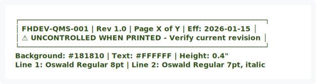

# FORT HOMES QMS - BRAND SYSTEM
## Context Cache File 01 - Load for Document Generation

**Last Updated:** 2026-01-04  
**Token Estimate:** ~400 tokens  
**Source:** fort_home_brand_spec.pdf

---

## TYPOGRAPHY

### Primary Font: Oswald (Google Fonts)

| Usage | Weight | Style | Size | Notes |
|-------|--------|-------|------|-------|
| H1 Section | 700 (Bold) | ALL CAPS | 18pt | +3% letter-spacing |
| H2 Subsection | 600 (SemiBold) | Title Case | 14pt | +2% letter-spacing |
| H3 Sub-subsection | 600 (SemiBold) | Title Case | 12pt | Standard |
| Body | 400 (Regular) | Normal | 10-11pt | Line-height 1.3-1.5em |
| Table Header | 600 (SemiBold) | ALL CAPS | 9pt | +2% letter-spacing |
| Table Body | 400 (Regular) | Normal | 9pt | Standard |
| Footer | 400 (Regular) | Normal | 8pt | Standard |
| Code Reference | 400 (Regular) | Italic | 9pt | For code citations |

**Fallback Stack:** `Oswald, system-ui, -apple-system, Segoe UI, Roboto, Arial, sans-serif`

---

## COLOR PALETTE

### Primary Colors

| Name | Hex | RGB | Usage |
|------|-----|-----|-------|
| **Charcoal Olive** | `#101810` | 16, 24, 16 | Text, headers, primary elements |
| **Secondary Dark** | `#181810` | 24, 24, 16 | Header/footer bars, emphasis blocks |
| **Off-White** | `#F8F8F8` | 248, 248, 248 | Backgrounds, table headers |
| **Neutral Gray** | `#B8B8B8` | 184, 184, 184 | Borders, dividers, secondary UI |

### Accent Colors (For callouts, status)

| Purpose | Hex | Usage |
|---------|-----|-------|
| Success/Pass | `#2D5016` | Approved, compliant indicators |
| Warning/Caution | `#8B6914` | Attention required, pending |
| Error/Fail | `#8B1414` | NCR, non-compliant, stop |
| Info/Reference | `#145B8B` | Code citations, cross-references |

---

## PAGE LAYOUT

### Dimensions
- **Page Size:** 8.5" × 11" (US Letter)
- **Margins:** Top/Bottom: 1.0", Left/Right: 0.75"
- **Header Height:** 0.5"
- **Footer Height:** 0.4"

### Header Bar

<div align="center">
  
</div>

<details>
<summary>View ASCII Source</summary>

```
┌─────────────────────────────────────────────────────────────┐
│ [LOGO] │ QUALITY MANAGEMENT SYSTEM MANUAL │ FHDEV-QMS-001 │
│ (left) │ (center, Oswald Bold 11pt, white)│ (right, 9pt)  │
└─────────────────────────────────────────────────────────────┘
Background: #181810 | Text: #FFFFFF | Height: 0.5"
```
</details>


### Footer Bar

<div align="center">
  
</div>

<details>
<summary>View ASCII Source</summary>

```
┌─────────────────────────────────────────────────────────────┐
│ FHDEV-QMS-001 | Rev 1.0 | Page X of Y | Eff: 2026-01-15   │
│ ⚠ UNCONTROLLED WHEN PRINTED - Verify current revision     │
└─────────────────────────────────────────────────────────────┘
Background: #181810 | Text: #FFFFFF | Height: 0.4"
Line 1: Oswald Regular 8pt | Line 2: Oswald Regular 7pt, italic
```
</details>


---

## ELEMENT SPECIFICATIONS

### Tables

```css
/* Table Styling */
table {
  border-collapse: collapse;
  width: 100%;
}
th {
  background: #F8F8F8;
  color: #101810;
  font: Oswald SemiBold 9pt;
  text-transform: uppercase;
  padding: 8px 12px;
  border: 1pt solid #B8B8B8;
}
td {
  color: #101810;
  font: Oswald Regular 9pt;
  padding: 6px 12px;
  border: 1pt solid #B8B8B8;
}
tr:nth-child(even) {
  background: #FAFAFA;
}
```

### Callout Boxes

**Quality Checkpoint (Blue border)**
```
┌─────────────────────────────────────────────────────────────┐
│ QUALITY CHECKPOINT                                          │
│ ───────────────────────                                     │
│ ■ Checkpoint item 1                                         │
│ ■ Checkpoint item 2                                         │
│ ■ Checkpoint item 3                                         │
└─────────────────────────────────────────────────────────────┘
Border: 2pt solid #145B8B | Background: #F8F8F8 | Padding: 12px
```

**Hold Point (Red border)**
```
┌─────────────────────────────────────────────────────────────┐
│ 🛑 MANDATORY HOLD POINT                                     │
│ ───────────────────────                                     │
│ Production SHALL NOT proceed until QA sign-off received.    │
│ Reference: DOH-QAI-001, IRC 2021 Section R___               │
└─────────────────────────────────────────────────────────────┘
Border: 3pt solid #8B1414 | Background: #FFF5F5 | Padding: 12px
```

**Code Reference (Inline)**
```
Per IRC 2021 Section R502.6...
Font: Oswald Regular 9pt Italic | Color: #145B8B
```

### Paragraph Spacing
- After H1: 18pt
- After H2: 12pt
- After H3: 6pt
- Between paragraphs: 10pt
- List items: 4pt

---

## LOGO USAGE

### QMS Logo (Primary)
- **File:** `fort-home-qms-logo.png`
- **Components:** FH House monogram + "FORT + HOME" wordmark + "Quality Management System" subtitle
- **Usage:** Cover pages, section title pages, document headers
- **Background:** White (#FFFFFF) only
- **Minimum width:** 2.5 inches for print, 200px for digital

### FH House Monogram
- **Design:** Stylized "F" and "H" forming a house silhouette
- **Usage:** Headers, footers, watermarks, small UI elements
- **Minimum size:** 0.5 inch / 48px height
- **Clear space:** 1× height of the house peak on all sides

### Primary Wordmark
- **Text:** FORT + HOME
- **Style:** Thin weight, wide letter-spacing, all caps
- **Spacing:** Generous tracking between letters

### Subtitle Line
- **Text:** Quality Management System
- **Style:** Medium weight, title case
- **Position:** Directly below wordmark

### Restrictions
- Never stretch or distort
- Never recolor (keep #101810 on white backgrounds)
- Never apply drop shadows, gradients, or effects
- Never place on busy or colored backgrounds
- Always maintain proportional scaling

---

## FILE NAMING

```
FHDEV_[TYPE]_[IDENTIFIER]_v[MAJOR].[MINOR].[PATCH].[EXT]

Types:
- QMS    = Quality Manual Sections
- SOP    = Standard Operating Procedure
- WI     = Work Instruction
- FRM    = Form Template
- CHK    = Checklist
- RPT    = Report

Examples:
FHDEV_QMS_Section7_v1.0.docx
FHDEV_SOP_ReceivingInspection_v2.1.docx
FHDEV_WI_Bay4_MEPRoughIn_v1.3.docx
FHDEV_FRM_NCR_v1.0.docx
FHDEV_CHK_Traveler_CC21TE_v1.0.xlsx
```

---

## REVISION BLOCK TEMPLATE

| Rev | Date | Author | Approver | Description |
|-----|------|--------|----------|-------------|
| 1.0 | YYYY-MM-DD | [Name] | [Name] | Initial release |
| 1.1 | YYYY-MM-DD | [Name] | [Name] | [Brief description] |

**Block placement:** Top of document, after title, before TOC

---

*Context File: 01-BRAND-SYSTEM.md*  
*Source of truth for all visual formatting decisions*
