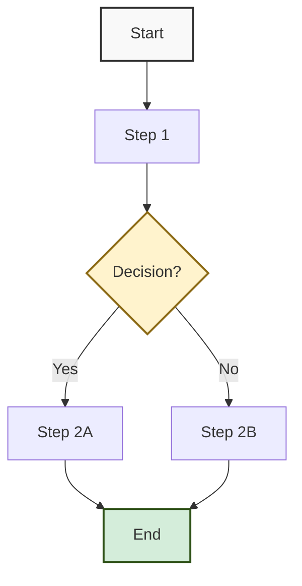

<div class="document-header" style="background: linear-gradient(135deg, #101810 0%, #2D5016 100%); color: white; padding: 40px; text-align: center; border-radius: 8px; margin-bottom: 30px; box-shadow: 0 4px 6px rgba(0,0,0,0.1);">
  <div style="font-size: 48px; font-weight: bold; letter-spacing: 2px; margin-bottom: 10px;">
    🏗️ FORT HOMES
  </div>
  <div style="font-size: 24px; font-weight: 300; letter-spacing: 1px; margin-bottom: 5px;">
    QMS STYLE GUIDE
  </div>
  <div style="font-size: 20px; font-weight: bold; margin-top: 20px; padding-top: 20px; border-top: 2px solid rgba(255,255,255,0.3);">
    Visual Design Standards & Best Practices
  </div>
  <div style="font-size: 16px; margin-top: 10px; opacity: 0.9;">
    Grand Junction, Colorado
  </div>
</div>

# QMS STYLE GUIDE
## Visual Design Standards for Quality Management System Documentation

---

## 📋 DOCUMENT CONTROL

| **Attribute** | **Details** |
|:---|:---|
| **Document ID** | QMS-STYLE-GUIDE-2026 |
| **Version** | 1.0 |
| **Effective Date** | 2026-01-15 |
| **Process Owner** | Document Controller |
| **Classification** | CONTROLLED |
| **Review Cycle** | Annual |
| **Next Review Date** | 2027-01-15 |

---

## 🎨 DESIGN PHILOSOPHY

Fort Homes QMS adopts a **"Billion-Dollar Look"** - professional, modern, and visually striking design that reflects our commitment to quality excellence.

### Core Principles

1. **Professional** - Enterprise-grade visual quality
2. **Modern** - Contemporary HTML/CSS styling (no ASCII art)
3. **Consistent** - Unified look across all documents
4. **Accessible** - Clear hierarchy, readable fonts
5. **Branded** - Fort Homes identity throughout

---

## 🎨 COLOR PALETTE

<div style="background: white; padding: 20px; border: 2px solid #ddd; border-radius: 8px; margin: 20px 0;">

### Primary Colors

| Color | Hex Code | Usage | Example |
|:---|:---|:---|:---|
| **Charcoal Olive** | #101810 | Primary dark, headers | Header Dark |
| **Forest Green** | #2D5016 | Primary brand, success | Brand Green |
| **Gold** | #8B6914 | Warning, attention | Warning Gold |
| **Crimson** | #8B1414 | Critical, error | Critical Red |
| **Ocean Blue** | #145B8B | Information, links | Info Blue |

### Secondary/Accent Colors

| Color | Hex Code | Usage |
|:---|:---|:---|
| **Light Green** | #D4EDDA | Success backgrounds |
| **Light Yellow** | #FFF3CD | Warning backgrounds |
| **Light Red** | #F8D7DA | Error backgrounds |
| **Light Blue** | #E7F3FF | Info backgrounds |
| **Light Gray** | #f9f9f9 | Neutral backgrounds |

</div>

---

## 📐 TYPOGRAPHY STANDARDS

<div style="background: white; padding: 20px; border: 2px solid #ddd; border-radius: 8px; margin: 20px 0;">

### Font Hierarchy

**Headers (HTML styling):**
- Logo/Title: 48px, Bold, Letter-spacing: 2px
- Section Title: 24px, Light (300 weight)
- Document Type: 20px, Bold
- Location: 16px, Regular

**Body Text (Markdown):**
- H1 (`#`): Primary section headers
- H2 (`##`): Subsection headers
- H3 (`###`): Sub-subsection headers
- Body: Standard markdown rendering
- Table text: Consistent with body

### Font Guidelines

- Use system fonts for maximum compatibility
- Bold for emphasis, not overuse
- Italics for references and terminology
- Monospace for code/data fields

</div>

---

## 🏷️ HTML HEADER TEMPLATE

**Standard Header for All QMS Documents:**

```html
<div class="document-header" style="background: linear-gradient(135deg, #101810 0%, #2D5016 100%); 
     color: white; padding: 40px; text-align: center; border-radius: 8px; 
     margin-bottom: 30px; box-shadow: 0 4px 6px rgba(0,0,0,0.1);">
  <div style="font-size: 48px; font-weight: bold; letter-spacing: 2px; margin-bottom: 10px;">
    🏗️ FORT HOMES
  </div>
  <div style="font-size: 24px; font-weight: 300; letter-spacing: 1px; margin-bottom: 5px;">
    [DOCUMENT TYPE]
  </div>
  <div style="font-size: 20px; font-weight: bold; margin-top: 20px; 
       padding-top: 20px; border-top: 2px solid rgba(255,255,255,0.3);">
    [SECTION TITLE]
  </div>
  <div style="font-size: 16px; margin-top: 10px; opacity: 0.9;">
    Grand Junction, Colorado
  </div>
</div>
```

**Variations by Document Type:**

| Document Type | Gradient Colors | Purpose |
|:---|:---|:---|
| **QMS Manual** | #101810 to #2D5016 | Standard green gradient |
| **SOP** | #101810 to #2D5016 | Standard green gradient |
| **Work Instruction** | #101810 to #2D5016 | Standard green gradient |
| **Form/Inspection** | #101810 to #2D5016 | Standard green gradient |
| **NCR** | #101810 to #8B1414 | Red gradient for nonconformance |
| **CAPA** | #101810 to #2D5016 | Standard green gradient |
| **Risk Register** | #101810 to #8B6914 | Gold gradient for caution |
| **Audit Checklist** | #101810 to #145B8B | Blue gradient for assessment |

---

## 📊 TABLE STYLES

<div style="background: white; padding: 20px; border: 2px solid #ddd; border-radius: 8px; margin: 20px 0;">

### Standard Tables

**Markdown format with aligned columns:**

```markdown
| Column 1 | Column 2 | Column 3 |
|:---|:---|:---|
| Left-aligned | Left-aligned | Left-aligned |
| Data | Data | Data |
```

**Alignment:**
- `:---` - Left-aligned (default for text)
- `:---:` - Center-aligned (status, icons)
- `---:` - Right-aligned (numbers, currency)

### Enhanced Tables with Styling

**For critical information:**

```html
<div style="background: white; padding: 20px; border: 2px solid #ddd; 
     border-radius: 8px; margin: 20px 0;">

| Header 1 | Header 2 | Header 3 |
|:---|:---|:---|
| Data | Data | Data |

</div>
```

</div>

---

## 📦 CALLOUT BOX STYLES

<div style="background: white; padding: 20px; border: 2px solid #ddd; border-radius: 8px; margin: 20px 0;">

### Success/Positive (Green)

```html
<div style="background: #D4EDDA; padding: 20px; border-left: 4px solid #2D5016; margin: 20px 0;">
Content here
</div>
```

### Warning/Caution (Yellow/Gold)

```html
<div style="background: #FFF3CD; padding: 20px; border-left: 4px solid #8B6914; margin: 20px 0;">
Content here
</div>
```

### Critical/Error (Red)

```html
<div style="background: #F8D7DA; padding: 20px; border-left: 4px solid #8B1414; margin: 20px 0;">
Content here
</div>
```

### Information (Blue)

```html
<div style="background: #E7F3FF; padding: 20px; border-left: 4px solid #145B8B; margin: 20px 0;">
Content here
</div>
```

### Neutral (Gray)

```html
<div style="background: #f9f9f9; padding: 20px; border: 2px solid #ddd; 
     border-radius: 8px; margin: 20px 0;">
Content here
</div>
```

</div>

---

## 🔘 ICON SYSTEM

<div style="background: white; padding: 20px; border: 2px solid #ddd; border-radius: 8px; margin: 20px 0;">

### Status Indicators

| Icon | Meaning | Usage |
|:---:|:---|:---|
| ✅ | Complete / Approved / Yes | Positive status, completed tasks |
| ☐ | Unchecked / Pending | Checkbox items, pending actions |
| 🟢 | On Track / Low Risk | Status indicators, risk levels |
| 🟡 | At Risk / Medium Risk | Warning status, moderate risk |
| 🔴 | Critical / High Risk | Critical items, high priority |
| ⚪ | Not Started / No Status | Neutral status |
| ⚠️ | Warning / Caution | Important warnings |
| 🔍 | Inspection / Review | Quality checks, audits |
| 📋 | Document / Form | Documentation references |
| 🏗️ | Fort Homes Logo | Company identifier |

### Priority Markers

| Icon | Priority Level |
|:---:|:---|
| 🔴 | Critical - Must have |
| 🟡 | High - Should have |
| 🟢 | Medium - Good to have |
| ⚪ | Low - Optional |

</div>

---

## 📐 PROCESS FLOW DIAGRAMS

### Mermaid Diagram Standards

**Use Mermaid for all process flows:**



**Standard Styling:**
- Start/End: Light gray (#f9f9f9)
- Success: Light green (#D4EDDA)
- Warning/Decision: Light yellow (#FFF3CD)
- Error: Light red (#F8D7DA)
- Hold Points: Light yellow with thick border

---

## 📄 DOCUMENT CONTROL METADATA

**Required on ALL controlled documents:**

```markdown
## 📋 DOCUMENT CONTROL

| **Attribute** | **Details** |
|:---|:---|
| **Document ID** | [ID] |
| **Version** | [X.Y] |
| **Effective Date** | [YYYY-MM-DD] |
| **Process Owner** | [Role/Name] |
| **Classification** | CONTROLLED |
| **Review Cycle** | [Frequency] |
| **Next Review Date** | [YYYY-MM-DD] |
```

---

## 📝 DOCUMENT STRUCTURE TEMPLATE

**Standard structure for all QMS documents:**

1. **HTML Header** (with gradient styling)
2. **Document Title & Subtitle** (Markdown H1, H2)
3. **Document Control Table**
4. **Table of Contents** (for documents >5 pages)
5. **Main Content Sections**
6. **Revision History Table**
7. **Approval Signatures Table**
8. **Footer** (Classification, distribution, next review)

---

## 🖼️ PHOTO/VISUAL STANDARDS

<div style="background: #E7F3FF; padding: 20px; border-left: 4px solid #145B8B; margin: 20px 0;">

### Work Instruction Photos

**Requirements:**
- Resolution: Minimum 1920×1080 (Full HD)
- Format: JPG or PNG
- Lighting: Well-lit, no harsh shadows
- Focus: Clear, sharp focus on subject
- Composition: Subject centered, minimal background clutter
- Labels: Add arrows/text overlays for key features

**Photo Types:**
1. **Overview** - Full workstation/assembly view
2. **Detail** - Close-up of specific operation
3. **Measurement** - Tools in frame showing dimensions
4. **Good vs Bad** - Side-by-side comparison
5. **Step-by-step** - Sequential progression

</div>

---

## ✅ QUALITY CHECKLIST

**Before publishing any QMS document, verify:**

- [ ] HTML header with correct gradient applied
- [ ] Document control metadata complete
- [ ] Consistent use of color palette
- [ ] Tables properly aligned
- [ ] Icons used appropriately
- [ ] Callout boxes styled correctly
- [ ] Photos/diagrams high quality (if included)
- [ ] Revision history updated
- [ ] Approval signatures section included
- [ ] Footer with classification and dates
- [ ] Spell-check and grammar review completed
- [ ] No ISO references (company not certified)
- [ ] HUD Code, CCR, NEC, NTA references correct

---

## 🔄 REVISION HISTORY

| Version | Date | Description | Author | Approved By |
|:---|:---|:---|:---|:---|
| 1.0 | 2026-01-15 | Initial QMS style guide | Document Controller | Quality Manager |

---

## ✅ APPROVAL SIGNATURES

| Role | Name | Signature | Date |
|:---|:---|:---|:---|
| **Prepared By** | Document Controller | _________________ | 2026-01-15 |
| **Reviewed By** | Quality Manager | _________________ | 2026-01-15 |
| **Approved By** | General Manager | _________________ | 2026-01-15 |

---

**Document Classification:** CONTROLLED  
**Distribution:** All Document Authors  
**Next Review Date:** 2027-01-15

---

*This style guide ensures consistent, professional, modern visual design across all Fort Homes QMS documentation.*
