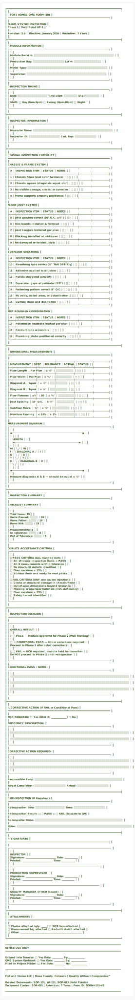

<div align="center">
  
</div>

<details>
<summary>View ASCII Source</summary>

```
╔══════════════════════════════════════════════════════════════════════════════╗
║                                                                              ║
║   🏗️ FORT HOMES QMS                                        FORM-I101       ║
║   ━━━━━━━━━━━━━━━━━━━━━━━━━━━━━━━━━━━━━━━━━━━━━━━━━━━━━━━━━━━━━━━━━━━━━━   ║
║                                                                              ║
║                    FLOOR SYSTEM INSPECTION                                   ║
║                    Phase 1 | Hold Point HP-1                                 ║
║                                                                              ║
║   Revision: 2.0  │  Effective: January 2026  │  Retention: 7 Years          ║
║                                                                              ║
╠══════════════════════════════════════════════════════════════════════════════╣
║                                                                              ║
║   📋 MODULE INFORMATION                                                      ║
║   ┌────────────────────────────────────────────────────────────────────┐    ║
║   │                                                                    │    ║
║   │   Module Serial #:  ░░░░░░░░░░░░░░░░░░░░░░░░░░░░░░░░░░░░░░░░░    │    ║
║   │                                                                    │    ║
║   │   Production Bay:   ░░░░░░░░░░░░░░░░    Lot #: ░░░░░░░░░░░░░░   │    ║
║   │                                                                    │    ║
║   │   Model Type:       ░░░░░░░░░░░░░░░░░░░░░░░░░░░░░░░░░░░░░░░░░    │    ║
║   │                                                                    │    ║
║   │   Supervisor:       ░░░░░░░░░░░░░░░░░░░░░░░░░░░░░░░░░░░░░░░░░    │    ║
║   │                                                                    │    ║
║   └────────────────────────────────────────────────────────────────────┘    ║
║                                                                              ║
║   📅 INSPECTION TIMING                                                       ║
║   ┌────────────────────────────────────────────────────────────────────┐    ║
║   │                                                                    │    ║
║   │   Date: ░░░░░░░░░░░░░░░    Time Start: ░░░░░░░   End: ░░░░░░░   │    ║
║   │                                                                    │    ║
║   │   Shift:  □ Day (6am-2pm)   □ Swing (2pm-10pm)   □ Night         │    ║
║   │                                                                    │    ║
║   └────────────────────────────────────────────────────────────────────┘    ║
║                                                                              ║
╠══════════════════════════════════════════════════════════════════════════════╣
║                                                                              ║
║   👤 INSPECTOR INFORMATION                                                   ║
║   ┌────────────────────────────────────────────────────────────────────┐    ║
║   │                                                                    │    ║
║   │   Inspector Name:   ░░░░░░░░░░░░░░░░░░░░░░░░░░░░░░░░░░░░░░░░░    │    ║
║   │                                                                    │    ║
║   │   Inspector ID:     ░░░░░░░░░░░░░░░░   Cert. Exp: ░░░░░░░░░░░   │    ║
║   │                                                                    │    ║
║   └────────────────────────────────────────────────────────────────────┘    ║
║                                                                              ║
╠══════════════════════════════════════════════════════════════════════════════╣
║                                                                              ║
║   🔍 VISUAL INSPECTION CHECKLIST                                             ║
║   ━━━━━━━━━━━━━━━━━━━━━━━━━━━━━━━━━━━━━━━━━━━━━━━━━━━━━━━━━━━━━━━━━━━━━━   ║
║                                                                              ║
║   CHASSIS & FRAME SYSTEM                                                     ║
║   ┌────┬──────────────────────────────────────────┬────────┬───────────┐    ║
║   │ #  │ INSPECTION ITEM                          │ STATUS │   NOTES   │    ║
║   ├────┼──────────────────────────────────────────┼────────┼───────────┤    ║
║   │ 1  │ Chassis frame level (±¼" tolerance)      │ ✅ ❌  │           │    ║
║   ├────┼──────────────────────────────────────────┼────────┼───────────┤    ║
║   │ 2  │ Chassis square (diagonals equal ±½")     │ ✅ ❌  │           │    ║
║   ├────┼──────────────────────────────────────────┼────────┼───────────┤    ║
║   │ 3  │ No visible damage, cracks, or corrosion  │ ✅ ❌  │           │    ║
║   ├────┼──────────────────────────────────────────┼────────┼───────────┤    ║
║   │ 4  │ Frame supports properly positioned       │ ✅ ❌  │           │    ║
║   └────┴──────────────────────────────────────────┴────────┴───────────┘    ║
║                                                                              ║
║   FLOOR JOIST SYSTEM                                                         ║
║   ┌────┬──────────────────────────────────────────┬────────┬───────────┐    ║
║   │ #  │ INSPECTION ITEM                          │ STATUS │   NOTES   │    ║
║   ├────┼──────────────────────────────────────────┼────────┼───────────┤    ║
║   │ 5  │ Joist spacing correct (16" O.C. ±¼")     │ ✅ ❌  │           │    ║
║   ├────┼──────────────────────────────────────────┼────────┼───────────┤    ║
║   │ 6  │ Rim boards installed & fastened          │ ✅ ❌  │           │    ║
║   ├────┼──────────────────────────────────────────┼────────┼───────────┤    ║
║   │ 7  │ Joist hangers installed per plan         │ ✅ ❌  │           │    ║
║   ├────┼──────────────────────────────────────────┼────────┼───────────┤    ║
║   │ 8  │ Blocking installed at mid-span           │ ✅ ❌  │           │    ║
║   ├────┼──────────────────────────────────────────┼────────┼───────────┤    ║
║   │ 9  │ No damaged or twisted joists             │ ✅ ❌  │           │    ║
║   └────┴──────────────────────────────────────────┴────────┴───────────┘    ║
║                                                                              ║
║   SUBFLOOR SHEATHING                                                         ║
║   ┌────┬──────────────────────────────────────────┬────────┬───────────┐    ║
║   │ #  │ INSPECTION ITEM                          │ STATUS │   NOTES   │    ║
║   ├────┼──────────────────────────────────────────┼────────┼───────────┤    ║
║   │10  │ Sheathing type correct (¾" T&G OSB/Ply)  │ ✅ ❌  │           │    ║
║   ├────┼──────────────────────────────────────────┼────────┼───────────┤    ║
║   │11  │ Adhesive applied to all joists           │ ✅ ❌  │           │    ║
║   ├────┼──────────────────────────────────────────┼────────┼───────────┤    ║
║   │12  │ Panels staggered properly                │ ✅ ❌  │           │    ║
║   ├────┼──────────────────────────────────────────┼────────┼───────────┤    ║
║   │13  │ Expansion gaps at perimeter (1/8")       │ ✅ ❌  │           │    ║
║   ├────┼──────────────────────────────────────────┼────────┼───────────┤    ║
║   │14  │ Fastening pattern correct (8" O.C.)      │ ✅ ❌  │           │    ║
║   ├────┼──────────────────────────────────────────┼────────┼───────────┤    ║
║   │15  │ No voids, raised areas, or delamination  │ ✅ ❌  │           │    ║
║   ├────┼──────────────────────────────────────────┼────────┼───────────┤    ║
║   │16  │ Surface clean and debris-free            │ ✅ ❌  │           │    ║
║   └────┴──────────────────────────────────────────┴────────┴───────────┘    ║
║                                                                              ║
║   MEP ROUGH-IN COORDINATION                                                  ║
║   ┌────┬──────────────────────────────────────────┬────────┬───────────┐    ║
║   │ #  │ INSPECTION ITEM                          │ STATUS │   NOTES   │    ║
║   ├────┼──────────────────────────────────────────┼────────┼───────────┤    ║
║   │17  │ Penetration locations marked per plan    │ ✅ ❌  │           │    ║
║   ├────┼──────────────────────────────────────────┼────────┼───────────┤    ║
║   │18  │ Conduit runs accessible                  │ ✅ ❌  │           │    ║
║   ├────┼──────────────────────────────────────────┼────────┼───────────┤    ║
║   │19  │ Plumbing stubs positioned correctly      │ ✅ ❌  │           │    ║
║   └────┴──────────────────────────────────────────┴────────┴───────────┘    ║
║                                                                              ║
╠══════════════════════════════════════════════════════════════════════════════╣
║                                                                              ║
║   📏 DIMENSIONAL MEASUREMENTS                                                ║
║   ━━━━━━━━━━━━━━━━━━━━━━━━━━━━━━━━━━━━━━━━━━━━━━━━━━━━━━━━━━━━━━━━━━━━━━   ║
║                                                                              ║
║   ┌──────────────────┬────────────┬────────────┬────────────┬──────────┐    ║
║   │   MEASUREMENT    │    SPEC    │  TOLERANCE │   ACTUAL   │  STATUS  │    ║
║   ├──────────────────┼────────────┼────────────┼────────────┼──────────┤    ║
║   │ Floor Length     │ Per Plan   │   ± ¼"     │ ░░░░░░░░░  │  ✅ ❌   │    ║
║   ├──────────────────┼────────────┼────────────┼────────────┼──────────┤    ║
║   │ Floor Width      │ Per Plan   │   ± ¼"     │ ░░░░░░░░░  │  ✅ ❌   │    ║
║   ├──────────────────┼────────────┼────────────┼────────────┼──────────┤    ║
║   │ Diagonal A       │ Equal      │   ± ½"     │ ░░░░░░░░░  │  ✅ ❌   │    ║
║   ├──────────────────┼────────────┼────────────┼────────────┼──────────┤    ║
║   │ Diagonal B       │ Equal      │   ± ½"     │ ░░░░░░░░░  │  ✅ ❌   │    ║
║   ├──────────────────┼────────────┼────────────┼────────────┼──────────┤    ║
║   │ Floor Flatness   │ ≤¼" / 10'  │   ± ⅛"     │ ░░░░░░░░░  │  ✅ ❌   │    ║
║   ├──────────────────┼────────────┼────────────┼────────────┼──────────┤    ║
║   │ Joist Spacing    │ 16" O.C.   │   ± ¼"     │ ░░░░░░░░░  │  ✅ ❌   │    ║
║   ├──────────────────┼────────────┼────────────┼────────────┼──────────┤    ║
║   │ Subfloor Thick.  │ ¾"         │   ± ⅛"     │ ░░░░░░░░░  │  ✅ ❌   │    ║
║   ├──────────────────┼────────────┼────────────┼────────────┼──────────┤    ║
║   │ Moisture Reading │ ≤ 13%      │   ± 1%     │ ░░░░░░░░░  │  ✅ ❌   │    ║
║   └──────────────────┴────────────┴────────────┴────────────┴──────────┘    ║
║                                                                              ║
║   MEASUREMENT DIAGRAM                                                        ║
║   ┌─────────────────────────────────────────────────────────────────────┐   ║
║   │                                                                     │   ║
║   │     ◆────────────────────────────────────────────────◆             │   ║
║   │     │                                                │             │   ║
║   │     │                  LENGTH                        │             │   ║
║   │     │ ◄────────────────────────────────────────────► │             │   ║
║   │     │                                                │             │   ║
║   │   W │    ╲                                    ╱      │ W           │   ║
║   │   I │      ╲  DIAGONAL A              ╱            │ I           │   ║
║   │   D │        ╲                    ╱                  │ D           │   ║
║   │   T │          ╲              ╱                      │ T           │   ║
║   │   H │            ╲        ╱   DIAGONAL B             │ H           │   ║
║   │     │              ╲  ╱                              │             │   ║
║   │     │                                                │             │   ║
║   │     ◆────────────────────────────────────────────────◆             │   ║
║   │                                                                     │   ║
║   │     Measure diagonals A & B — should be equal ± ½"                 │   ║
║   │                                                                     │   ║
║   └─────────────────────────────────────────────────────────────────────┘   ║
║                                                                              ║
╠══════════════════════════════════════════════════════════════════════════════╣
║                                                                              ║
║   📊 INSPECTION SUMMARY                                                      ║
║   ━━━━━━━━━━━━━━━━━━━━━━━━━━━━━━━━━━━━━━━━━━━━━━━━━━━━━━━━━━━━━━━━━━━━━━   ║
║                                                                              ║
║   CHECKLIST SUMMARY                                                          ║
║   ┌─────────────────────────────────────────────────────────────────────┐   ║
║   │                                                                     │   ║
║   │   Total Items:        19                                           │   ║
║   │   Items Passed:       ░░░░ / 19                                    │   ║
║   │   Items Failed:       ░░░░ / 19                                    │   ║
║   │   Items N/A:          ░░░░ / 19                                    │   ║
║   │                                                                     │   ║
║   │   Measurements:       8                                            │   ║
║   │   In Tolerance:       ░░░░ / 8                                     │   ║
║   │   Out of Tolerance:   ░░░░ / 8                                     │   ║
║   │                                                                     │   ║
║   └─────────────────────────────────────────────────────────────────────┘   ║
║                                                                              ║
║   QUALITY ACCEPTANCE CRITERIA                                                ║
║   ┌─────────────────────────────────────────────────────────────────────┐   ║
║   │                                                                     │   ║
║   │   ✅ PASS CRITERIA (ALL must be met):                              │   ║
║   │   □ All 19 visual inspection items = PASS                         │   ║
║   │   □ All 8 measurements within tolerance                           │   ║
║   │   □ No structural defects identified                               │   ║
║   │   □ Floor moisture ≤ 13%                                          │   ║
║   │   □ Surface clean and ready for next phase                        │   ║
║   │                                                                     │   ║
║   │   ❌ FAIL CRITERIA (ANY one causes rejection):                     │   ║
║   │   □ Cracks or structural damage in chassis/frame                  │   ║
║   │   □ Out-of-spec dimensions beyond tolerance                       │   ║
║   │   □ Missing or improper fasteners (>5% deficiency)                │   ║
║   │   □ Floor moisture > 13%                                          │   ║
║   │   □ Safety hazard identified                                       │   ║
║   │                                                                     │   ║
║   └─────────────────────────────────────────────────────────────────────┘   ║
║                                                                              ║
╠══════════════════════════════════════════════════════════════════════════════╣
║                                                                              ║
║   🎯 INSPECTION DECISION                                                     ║
║   ━━━━━━━━━━━━━━━━━━━━━━━━━━━━━━━━━━━━━━━━━━━━━━━━━━━━━━━━━━━━━━━━━━━━━━   ║
║                                                                              ║
║   ┌─────────────────────────────────────────────────────────────────────┐   ║
║   │                                                                     │   ║
║   │   OVERALL RESULT:                                                   │   ║
║   │                                                                     │   ║
║   │   □ ✅ PASS — Module approved for Phase 2 (Wall Framing)           │   ║
║   │                                                                     │   ║
║   │   □ ⚠️ CONDITIONAL PASS — Minor corrections required               │   ║
║   │        Proceed to Phase 2 after noted corrections                  │   ║
║   │                                                                     │   ║
║   │   □ ❌ FAIL — NCR required, module held for correction             │   ║
║   │        Do NOT proceed to Phase 2 until reinspection               │   ║
║   │                                                                     │   ║
║   └─────────────────────────────────────────────────────────────────────┘   ║
║                                                                              ║
║   CONDITIONAL PASS / NOTES:                                                  ║
║   ┌─────────────────────────────────────────────────────────────────────┐   ║
║   │                                                                     │   ║
║   │   ░░░░░░░░░░░░░░░░░░░░░░░░░░░░░░░░░░░░░░░░░░░░░░░░░░░░░░░░░░░░░   │   ║
║   │                                                                     │   ║
║   │   ░░░░░░░░░░░░░░░░░░░░░░░░░░░░░░░░░░░░░░░░░░░░░░░░░░░░░░░░░░░░░   │   ║
║   │                                                                     │   ║
║   │   ░░░░░░░░░░░░░░░░░░░░░░░░░░░░░░░░░░░░░░░░░░░░░░░░░░░░░░░░░░░░░   │   ║
║   │                                                                     │   ║
║   └─────────────────────────────────────────────────────────────────────┘   ║
║                                                                              ║
╠══════════════════════════════════════════════════════════════════════════════╣
║                                                                              ║
║   ⚠️ CORRECTIVE ACTION (If FAIL or Conditional Pass)                        ║
║   ━━━━━━━━━━━━━━━━━━━━━━━━━━━━━━━━━━━━━━━━━━━━━━━━━━━━━━━━━━━━━━━━━━━━━━   ║
║                                                                              ║
║   NCR REQUIRED:  □ Yes (NCR #: ________________)    □ No                    ║
║                                                                              ║
║   DEFICIENCY DESCRIPTION:                                                    ║
║   ┌─────────────────────────────────────────────────────────────────────┐   ║
║   │                                                                     │   ║
║   │   ░░░░░░░░░░░░░░░░░░░░░░░░░░░░░░░░░░░░░░░░░░░░░░░░░░░░░░░░░░░░░   │   ║
║   │                                                                     │   ║
║   │   ░░░░░░░░░░░░░░░░░░░░░░░░░░░░░░░░░░░░░░░░░░░░░░░░░░░░░░░░░░░░░   │   ║
║   │                                                                     │   ║
║   └─────────────────────────────────────────────────────────────────────┘   ║
║                                                                              ║
║   CORRECTIVE ACTION REQUIRED:                                                ║
║   ┌─────────────────────────────────────────────────────────────────────┐   ║
║   │                                                                     │   ║
║   │   ░░░░░░░░░░░░░░░░░░░░░░░░░░░░░░░░░░░░░░░░░░░░░░░░░░░░░░░░░░░░░   │   ║
║   │                                                                     │   ║
║   │   ░░░░░░░░░░░░░░░░░░░░░░░░░░░░░░░░░░░░░░░░░░░░░░░░░░░░░░░░░░░░░   │   ║
║   │                                                                     │   ║
║   └─────────────────────────────────────────────────────────────────────┘   ║
║                                                                              ║
║   Responsible Party: ░░░░░░░░░░░░░░░░░░░░░░░░░░░░░░░░░░░░░░░░░░░░░         ║
║                                                                              ║
║   Target Completion: ░░░░░░░░░░░░░░░░    Actual: ░░░░░░░░░░░░░░░░         ║
║                                                                              ║
╠══════════════════════════════════════════════════════════════════════════════╣
║                                                                              ║
║   🔄 RE-INSPECTION (If Required)                                             ║
║   ━━━━━━━━━━━━━━━━━━━━━━━━━━━━━━━━━━━━━━━━━━━━━━━━━━━━━━━━━━━━━━━━━━━━━━   ║
║                                                                              ║
║   Re-inspection Date: ░░░░░░░░░░░░░░░    Time: ░░░░░░░░░░░░░░░░            ║
║                                                                              ║
║   Re-inspection Result:   □ ✅ PASS     □ ❌ FAIL (Escalate to QM)          ║
║                                                                              ║
║   Re-inspector Name: ░░░░░░░░░░░░░░░░░░░░░░░░░░░░░░░░░░░░░░░░░░░░░         ║
║                                                                              ║
║   Notes: ░░░░░░░░░░░░░░░░░░░░░░░░░░░░░░░░░░░░░░░░░░░░░░░░░░░░░░░░░░░       ║
║                                                                              ║
╠══════════════════════════════════════════════════════════════════════════════╣
║                                                                              ║
║   ✍️ SIGNATURES                                                              ║
║   ━━━━━━━━━━━━━━━━━━━━━━━━━━━━━━━━━━━━━━━━━━━━━━━━━━━━━━━━━━━━━━━━━━━━━━   ║
║                                                                              ║
║   ┌─────────────────────────────────────────────────────────────────────┐   ║
║   │                                                                     │   ║
║   │   INSPECTOR                                                         │   ║
║   │   Signature: _______________________________  Date: _____________   │   ║
║   │   Printed:   _______________________________  Time: _____________   │   ║
║   │                                                                     │   ║
║   │   ─────────────────────────────────────────────────────────────     │   ║
║   │                                                                     │   ║
║   │   PRODUCTION SUPERVISOR                                             │   ║
║   │   Signature: _______________________________  Date: _____________   │   ║
║   │   Printed:   _______________________________  Time: _____________   │   ║
║   │                                                                     │   ║
║   │   ─────────────────────────────────────────────────────────────     │   ║
║   │                                                                     │   ║
║   │   QUALITY MANAGER (if NCR issued)                                   │   ║
║   │   Signature: _______________________________  Date: _____________   │   ║
║   │   Printed:   _______________________________  Time: _____________   │   ║
║   │                                                                     │   ║
║   └─────────────────────────────────────────────────────────────────────┘   ║
║                                                                              ║
╠══════════════════════════════════════════════════════════════════════════════╣
║                                                                              ║
║   📎 ATTACHMENTS                                                             ║
║   ━━━━━━━━━━━━━━━━━━━━━━━━━━━━━━━━━━━━━━━━━━━━━━━━━━━━━━━━━━━━━━━━━━━━━━   ║
║                                                                              ║
║   □ Photos attached (qty: ______)      □ NCR form attached                  ║
║   □ Measurement log attached           □ As-built sketch attached           ║
║   □ Other: _______________________________________________________________  ║
║                                                                              ║
╚══════════════════════════════════════════════════════════════════════════════╝

═══════════════════════════════════════════════════════════════════════════════
                              OFFICE USE ONLY
═══════════════════════════════════════════════════════════════════════════════

   Entered into Traveler:  □ Yes   Date: ___________   By: ________________
   QMS System Updated:     □ Yes   Date: ___________   By: ________________
   Filed in Project Folder: □ Yes  Date: ___________   By: ________________

═══════════════════════════════════════════════════════════════════════════════

   Fort and Homes LLC | Mesa County, Colorado | Quality Without Compromise™
   
   Related Documents: SOP-101, WI-101, SOP-013 (Hold Points)
   Document Control: SOP-001 | Retention: 7 Years | Form ID: FORM-I101-V2

═══════════════════════════════════════════════════════════════════════════════
```
</details>

