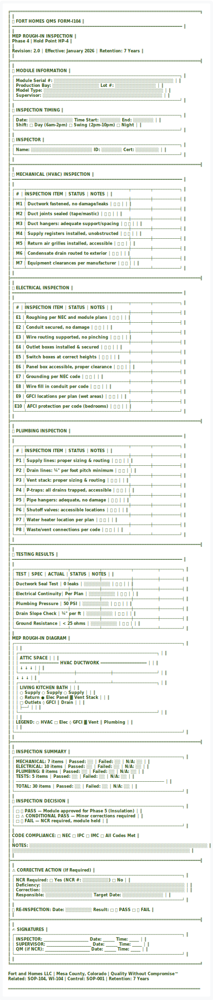

<div align="center">
  
</div>

<details>
<summary>View ASCII Source</summary>

```
╔══════════════════════════════════════════════════════════════════════════════╗
║                                                                              ║
║   🏗️ FORT HOMES QMS                                        FORM-I104       ║
║   ━━━━━━━━━━━━━━━━━━━━━━━━━━━━━━━━━━━━━━━━━━━━━━━━━━━━━━━━━━━━━━━━━━━━━━   ║
║                                                                              ║
║                    MEP ROUGH-IN INSPECTION                                   ║
║                    Phase 4 | Hold Point HP-4                                 ║
║                                                                              ║
║   Revision: 2.0  │  Effective: January 2026  │  Retention: 7 Years          ║
║                                                                              ║
╠══════════════════════════════════════════════════════════════════════════════╣
║                                                                              ║
║   📋 MODULE INFORMATION                                                      ║
║   ┌────────────────────────────────────────────────────────────────────┐    ║
║   │   Module Serial #:  ░░░░░░░░░░░░░░░░░░░░░░░░░░░░░░░░░░░░░░░░░    │    ║
║   │   Production Bay:   ░░░░░░░░░░░░░░░░    Lot #: ░░░░░░░░░░░░░░   │    ║
║   │   Model Type:       ░░░░░░░░░░░░░░░░░░░░░░░░░░░░░░░░░░░░░░░░░    │    ║
║   │   Supervisor:       ░░░░░░░░░░░░░░░░░░░░░░░░░░░░░░░░░░░░░░░░░    │    ║
║   └────────────────────────────────────────────────────────────────────┘    ║
║                                                                              ║
║   📅 INSPECTION TIMING                                                       ║
║   ┌────────────────────────────────────────────────────────────────────┐    ║
║   │   Date: ░░░░░░░░░░░░░░░    Time Start: ░░░░░░░   End: ░░░░░░░   │    ║
║   │   Shift:  □ Day (6am-2pm)   □ Swing (2pm-10pm)   □ Night         │    ║
║   └────────────────────────────────────────────────────────────────────┘    ║
║                                                                              ║
║   👤 INSPECTOR                                                               ║
║   ┌────────────────────────────────────────────────────────────────────┐    ║
║   │   Name: ░░░░░░░░░░░░░░░░░░░░░    ID: ░░░░░░░   Cert: ░░░░░░░░   │    ║
║   └────────────────────────────────────────────────────────────────────┘    ║
║                                                                              ║
╠══════════════════════════════════════════════════════════════════════════════╣
║                                                                              ║
║   🔵 MECHANICAL (HVAC) INSPECTION                                            ║
║   ━━━━━━━━━━━━━━━━━━━━━━━━━━━━━━━━━━━━━━━━━━━━━━━━━━━━━━━━━━━━━━━━━━━━━━   ║
║                                                                              ║
║   ┌────┬──────────────────────────────────────────┬────────┬───────────┐    ║
║   │ #  │ INSPECTION ITEM                          │ STATUS │   NOTES   │    ║
║   ├────┼──────────────────────────────────────────┼────────┼───────────┤    ║
║   │ M1 │ Ductwork fastened, no damage/leaks       │ ✅ ❌  │           │    ║
║   ├────┼──────────────────────────────────────────┼────────┼───────────┤    ║
║   │ M2 │ Duct joints sealed (tape/mastic)         │ ✅ ❌  │           │    ║
║   ├────┼──────────────────────────────────────────┼────────┼───────────┤    ║
║   │ M3 │ Duct hangers: adequate support/spacing   │ ✅ ❌  │           │    ║
║   ├────┼──────────────────────────────────────────┼────────┼───────────┤    ║
║   │ M4 │ Supply registers installed, unobstructed │ ✅ ❌  │           │    ║
║   ├────┼──────────────────────────────────────────┼────────┼───────────┤    ║
║   │ M5 │ Return air grilles installed, accessible │ ✅ ❌  │           │    ║
║   ├────┼──────────────────────────────────────────┼────────┼───────────┤    ║
║   │ M6 │ Condensate drain routed to exterior      │ ✅ ❌  │           │    ║
║   ├────┼──────────────────────────────────────────┼────────┼───────────┤    ║
║   │ M7 │ Equipment clearances per manufacturer    │ ✅ ❌  │           │    ║
║   └────┴──────────────────────────────────────────┴────────┴───────────┘    ║
║                                                                              ║
╠══════════════════════════════════════════════════════════════════════════════╣
║                                                                              ║
║   🟡 ELECTRICAL INSPECTION                                                   ║
║   ━━━━━━━━━━━━━━━━━━━━━━━━━━━━━━━━━━━━━━━━━━━━━━━━━━━━━━━━━━━━━━━━━━━━━━   ║
║                                                                              ║
║   ┌────┬──────────────────────────────────────────┬────────┬───────────┐    ║
║   │ #  │ INSPECTION ITEM                          │ STATUS │   NOTES   │    ║
║   ├────┼──────────────────────────────────────────┼────────┼───────────┤    ║
║   │ E1 │ Roughing per NEC and module plans        │ ✅ ❌  │           │    ║
║   ├────┼──────────────────────────────────────────┼────────┼───────────┤    ║
║   │ E2 │ Conduit secured, no damage               │ ✅ ❌  │           │    ║
║   ├────┼──────────────────────────────────────────┼────────┼───────────┤    ║
║   │ E3 │ Wire routing supported, no pinching      │ ✅ ❌  │           │    ║
║   ├────┼──────────────────────────────────────────┼────────┼───────────┤    ║
║   │ E4 │ Outlet boxes installed & secured         │ ✅ ❌  │           │    ║
║   ├────┼──────────────────────────────────────────┼────────┼───────────┤    ║
║   │ E5 │ Switch boxes at correct heights          │ ✅ ❌  │           │    ║
║   ├────┼──────────────────────────────────────────┼────────┼───────────┤    ║
║   │ E6 │ Panel box accessible, proper clearance   │ ✅ ❌  │           │    ║
║   ├────┼──────────────────────────────────────────┼────────┼───────────┤    ║
║   │ E7 │ Grounding per NEC code                   │ ✅ ❌  │           │    ║
║   ├────┼──────────────────────────────────────────┼────────┼───────────┤    ║
║   │ E8 │ Wire fill in conduit per code            │ ✅ ❌  │           │    ║
║   ├────┼──────────────────────────────────────────┼────────┼───────────┤    ║
║   │ E9 │ GFCI locations per plan (wet areas)      │ ✅ ❌  │           │    ║
║   ├────┼──────────────────────────────────────────┼────────┼───────────┤    ║
║   │E10 │ AFCI protection per code (bedrooms)      │ ✅ ❌  │           │    ║
║   └────┴──────────────────────────────────────────┴────────┴───────────┘    ║
║                                                                              ║
╠══════════════════════════════════════════════════════════════════════════════╣
║                                                                              ║
║   🔵 PLUMBING INSPECTION                                                     ║
║   ━━━━━━━━━━━━━━━━━━━━━━━━━━━━━━━━━━━━━━━━━━━━━━━━━━━━━━━━━━━━━━━━━━━━━━   ║
║                                                                              ║
║   ┌────┬──────────────────────────────────────────┬────────┬───────────┐    ║
║   │ #  │ INSPECTION ITEM                          │ STATUS │   NOTES   │    ║
║   ├────┼──────────────────────────────────────────┼────────┼───────────┤    ║
║   │ P1 │ Supply lines: proper sizing & routing    │ ✅ ❌  │           │    ║
║   ├────┼──────────────────────────────────────────┼────────┼───────────┤    ║
║   │ P2 │ Drain lines: ¼" per foot pitch minimum   │ ✅ ❌  │           │    ║
║   ├────┼──────────────────────────────────────────┼────────┼───────────┤    ║
║   │ P3 │ Vent stack: proper sizing & routing      │ ✅ ❌  │           │    ║
║   ├────┼──────────────────────────────────────────┼────────┼───────────┤    ║
║   │ P4 │ P-traps: all drains trapped, accessible  │ ✅ ❌  │           │    ║
║   ├────┼──────────────────────────────────────────┼────────┼───────────┤    ║
║   │ P5 │ Pipe hangers: adequate, no damage        │ ✅ ❌  │           │    ║
║   ├────┼──────────────────────────────────────────┼────────┼───────────┤    ║
║   │ P6 │ Shutoff valves: accessible locations     │ ✅ ❌  │           │    ║
║   ├────┼──────────────────────────────────────────┼────────┼───────────┤    ║
║   │ P7 │ Water heater location per plan           │ ✅ ❌  │           │    ║
║   ├────┼──────────────────────────────────────────┼────────┼───────────┤    ║
║   │ P8 │ Waste/vent connections per code          │ ✅ ❌  │           │    ║
║   └────┴──────────────────────────────────────────┴────────┴───────────┘    ║
║                                                                              ║
╠══════════════════════════════════════════════════════════════════════════════╣
║                                                                              ║
║   🧪 TESTING RESULTS                                                         ║
║   ━━━━━━━━━━━━━━━━━━━━━━━━━━━━━━━━━━━━━━━━━━━━━━━━━━━━━━━━━━━━━━━━━━━━━━   ║
║                                                                              ║
║   ┌──────────────────────┬────────────┬────────────┬──────────┬─────────┐   ║
║   │       TEST           │    SPEC    │   ACTUAL   │  STATUS  │  NOTES  │   ║
║   ├──────────────────────┼────────────┼────────────┼──────────┼─────────┤   ║
║   │ Ductwork Seal Test   │ 0 leaks    │ ░░░░░░░░░  │  ✅ ❌   │         │   ║
║   ├──────────────────────┼────────────┼────────────┼──────────┼─────────┤   ║
║   │ Electrical Continuity│ Per Plan   │ ░░░░░░░░░  │  ✅ ❌   │         │   ║
║   ├──────────────────────┼────────────┼────────────┼──────────┼─────────┤   ║
║   │ Plumbing Pressure    │ 50 PSI     │ ░░░░░░░░░  │  ✅ ❌   │         │   ║
║   ├──────────────────────┼────────────┼────────────┼──────────┼─────────┤   ║
║   │ Drain Slope Check    │ ¼" per ft  │ ░░░░░░░░░  │  ✅ ❌   │         │   ║
║   ├──────────────────────┼────────────┼────────────┼──────────┼─────────┤   ║
║   │ Ground Resistance    │ < 25 ohms  │ ░░░░░░░░░  │  ✅ ❌   │         │   ║
║   └──────────────────────┴────────────┴────────────┴──────────┴─────────┘   ║
║                                                                              ║
║   MEP ROUGH-IN DIAGRAM                                                       ║
║   ┌─────────────────────────────────────────────────────────────────────┐   ║
║   │                                                                     │   ║
║   │    ┌─────────────────────────────────────────────────────────┐     │   ║
║   │    │                    ATTIC SPACE                          │     │   ║
║   │    │   ════════════════ HVAC DUCTWORK ═══════════════════   │     │   ║
║   │    │        ↓              ↓              ↓                  │     │   ║
║   │    └────────┼──────────────┼──────────────┼──────────────────┘     │   ║
║   │             ↓              ↓              ↓                        │   ║
║   │    ┌────────┴──────────────┴──────────────┴──────────────────┐     │   ║
║   │    │  LIVING                    KITCHEN           BATH       │     │   ║
║   │    │    ○ Supply              ○ Supply         ○ Supply     │     │   ║
║   │    │    ○ Return              ● Elec Panel     ▓ Vent Stack │     │   ║
║   │    │    □ Outlets             ◊ GFCI           ║ Drain      │     │   ║
║   │    │                                           ├──┘         │     │   ║
║   │    └─────────────────────────────────────────────────────────┘     │   ║
║   │                                                                     │   ║
║   │    LEGEND: ○ HVAC  □ Elec  ◊ GFCI  ▓ Vent  ║ Plumbing              │   ║
║   │                                                                     │   ║
║   └─────────────────────────────────────────────────────────────────────┘   ║
║                                                                              ║
╠══════════════════════════════════════════════════════════════════════════════╣
║                                                                              ║
║   📊 INSPECTION SUMMARY                                                      ║
║   ┌─────────────────────────────────────────────────────────────────────┐   ║
║   │   MECHANICAL:    7 items  │  Passed: ░░  │  Failed: ░░  │ N/A: ░░  │   ║
║   │   ELECTRICAL:   10 items  │  Passed: ░░  │  Failed: ░░  │ N/A: ░░  │   ║
║   │   PLUMBING:      8 items  │  Passed: ░░  │  Failed: ░░  │ N/A: ░░  │   ║
║   │   TESTS:         5 items  │  Passed: ░░  │  Failed: ░░  │ N/A: ░░  │   ║
║   │   ─────────────────────────────────────────────────────────────    │   ║
║   │   TOTAL:        30 items  │  Passed: ░░  │  Failed: ░░  │ N/A: ░░  │   ║
║   └─────────────────────────────────────────────────────────────────────┘   ║
║                                                                              ║
║   🎯 INSPECTION DECISION                                                     ║
║   ┌─────────────────────────────────────────────────────────────────────┐   ║
║   │   □ ✅ PASS — Module approved for Phase 5 (Insulation)             │   ║
║   │   □ ⚠️ CONDITIONAL PASS — Minor corrections required               │   ║
║   │   □ ❌ FAIL — NCR required, module held                            │   ║
║   └─────────────────────────────────────────────────────────────────────┘   ║
║                                                                              ║
║   CODE COMPLIANCE:  □ NEC  □ IPC  □ IMC  □ All Codes Met                    ║
║                                                                              ║
║   NOTES: ░░░░░░░░░░░░░░░░░░░░░░░░░░░░░░░░░░░░░░░░░░░░░░░░░░░░░░░░░░░░░     ║
║          ░░░░░░░░░░░░░░░░░░░░░░░░░░░░░░░░░░░░░░░░░░░░░░░░░░░░░░░░░░░░░     ║
║                                                                              ║
╠══════════════════════════════════════════════════════════════════════════════╣
║                                                                              ║
║   ⚠️ CORRECTIVE ACTION (If Required)                                        ║
║   ┌─────────────────────────────────────────────────────────────────────┐   ║
║   │   NCR Required: □ Yes (NCR #: ░░░░░░░░░)    □ No                   │   ║
║   │   Deficiency: ░░░░░░░░░░░░░░░░░░░░░░░░░░░░░░░░░░░░░░░░░░░░░░░░░   │   ║
║   │   Correction: ░░░░░░░░░░░░░░░░░░░░░░░░░░░░░░░░░░░░░░░░░░░░░░░░░   │   ║
║   │   Responsible: ░░░░░░░░░░░░░░░░    Target Date: ░░░░░░░░░░░░░░   │   ║
║   └─────────────────────────────────────────────────────────────────────┘   ║
║                                                                              ║
║   🔄 RE-INSPECTION: Date: ░░░░░░░░░    Result: □ ✅ PASS  □ ❌ FAIL         ║
║                                                                              ║
╠══════════════════════════════════════════════════════════════════════════════╣
║                                                                              ║
║   ✍️ SIGNATURES                                                              ║
║   ┌─────────────────────────────────────────────────────────────────────┐   ║
║   │   INSPECTOR:   _______________________  Date: ______  Time: _____   │   ║
║   │   SUPERVISOR:  _______________________  Date: ______  Time: _____   │   ║
║   │   QM (if NCR): _______________________  Date: ______  Time: _____   │   ║
║   └─────────────────────────────────────────────────────────────────────┘   ║
║                                                                              ║
╚══════════════════════════════════════════════════════════════════════════════╝

   Fort and Homes LLC | Mesa County, Colorado | Quality Without Compromise™
   Related: SOP-104, WI-104 | Control: SOP-001 | Retention: 7 Years

═══════════════════════════════════════════════════════════════════════════════
```
</details>

