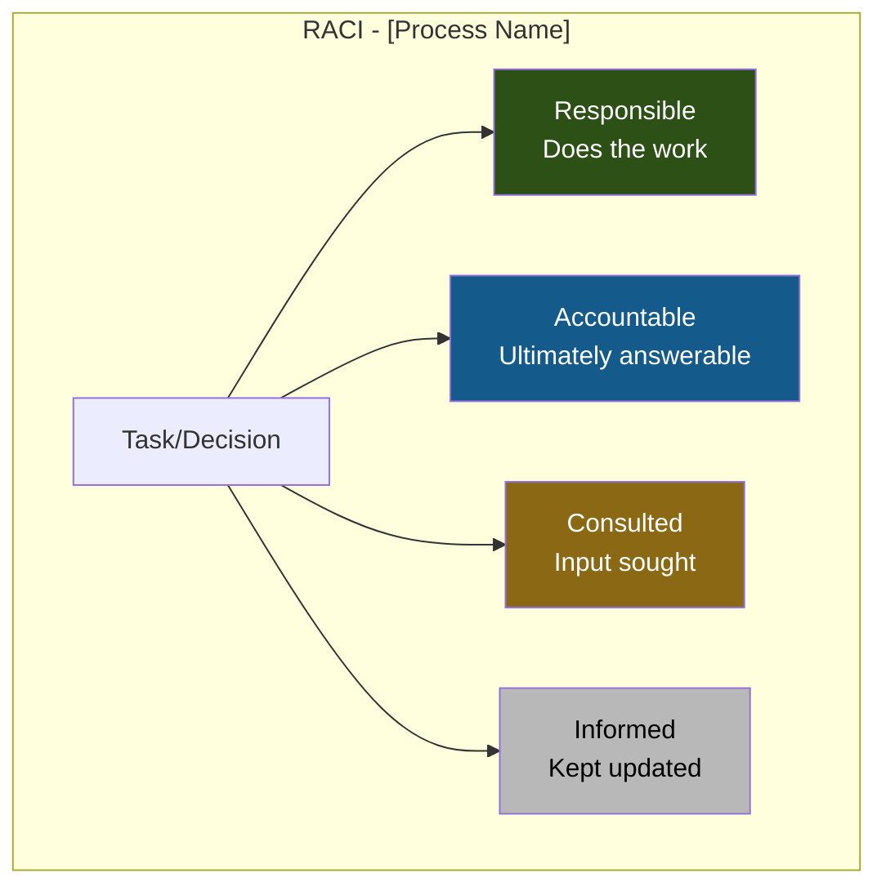

<div class="document-header" style="background: linear-gradient(135deg, #101810 0%, #2D5016 100%); color: white; padding: 40px; text-align: center; border-radius: 8px; margin-bottom: 30px; box-shadow: 0 4px 6px rgba(0,0,0,0.1);">
  <div style="font-size: 48px; font-weight: bold; letter-spacing: 2px; margin-bottom: 10px;">
    🏗️ FORT HOMES
  </div>
  <div style="font-size: 24px; font-weight: 300; letter-spacing: 1px; margin-bottom: 5px;">
    QUALITY MANAGEMENT SYSTEM
  </div>
  <div style="font-size: 20px; font-weight: bold; margin-top: 20px; padding-top: 20px; border-top: 2px solid rgba(255,255,255,0.3);">
    [SOP TITLE]
  </div>
  <div style="font-size: 16px; margin-top: 10px; opacity: 0.9;">
    [One-line description]
  </div>
</div>

# SOP-NNN: [PROCEDURE TITLE]
## [Descriptive Subtitle]

---

## 📋 DOCUMENT CONTROL

| Attribute | Value |
|:---|:---|
| **Document ID** | SOP-NNN |
| **Title** | [Full Procedure Title] |
| **Revision** | 1.0 |
| **Effective Date** | YYYY-MM-DD |
| **Process Owner** | [Role Title] |
| **Approver** | [Role Title] |
| **Classification** | CONTROLLED |
| **Review Cycle** | [Annual/Semi-Annual/Quarterly] |
| **Next Review** | YYYY-MM-DD |
| **Regulatory Basis** | [24 CFR §, 8 CCR §, NEC §, etc.] |
| **Supersedes** | [Previous version, if applicable] |

---

## 📑 TABLE OF CONTENTS

1. [Purpose](#1-purpose)
2. [Scope](#2-scope)
3. [References](#3-references)
4. [Roles & Responsibilities](#4-roles--responsibilities)
5. [Process Overview](#5-process-overview)
6. [Detailed Procedure](#6-detailed-procedure)
7. [Quality Checkpoints](#7-quality-checkpoints)
8. [Records](#8-records)
9. [Training Requirements](#9-training-requirements)
10. [Quality Metrics](#10-quality-metrics)
11. [Appendices](#11-appendices)

---

## 1. PURPOSE

### 1.1 Objective

> **Clearly state** what this procedure accomplishes and why it exists.

[2-3 sentences describing the primary goal of this SOP]

### 1.2 Benefits

- ✅ **Benefit 1:** [How this procedure adds value]
- ✅ **Benefit 2:** [What problem it solves]
- ✅ **Benefit 3:** [What outcome it ensures]

---

## 2. SCOPE

### 2.1 Applicability

**Applies to:**
- [Process/activity 1]
- [Process/activity 2]
- [Process/activity 3]

**Does NOT apply to:**
- [Exclusion 1]
- [Exclusion 2]

### 2.2 Personnel Coverage

| Role | Involvement |
|:---|:---|
| **[Role 1]** | [How they're involved] |
| **[Role 2]** | [How they're involved] |
| **[Role 3]** | [How they're involved] |

---

## 3. REFERENCES

### 3.1 Internal Documents

| Document ID | Title | Type | Relationship |
|:---|:---|:---:|:---|
| QMS-NNN | [QMS Section Name] | Manual | [How it relates] |
| SOP-NNN | [Related SOP Name] | SOP | [How it relates] |
| FORM-XXX-NNN | [Form Name] | Form | [How it's used] |

### 3.2 External Documents

| Reference | Title | Authority | Edition/Date |
|:---|:---|:---|:---|
| 24 CFR § XXX | [Regulation name] | HUD | [Year] |
| 8 CCR 1302-14 § X | [Regulation name] | CDOH | [Year] |
| NEC § XXX | [Code section] | NFPA | 2023 |

---

## 4. ROLES & RESPONSIBILITIES

### 4.1 RACI Matrix



| Activity | [Role 1] | [Role 2] | [Role 3] | [Role 4] |
|:---|:---:|:---:|:---:|:---:|
| **[Activity 1]** | R | A | C | I |
| **[Activity 2]** | C | R | A | I |
| **[Activity 3]** | I | C | R | A |

**Legend:**
- **R (Responsible):** Performs the work
- **A (Accountable):** Ultimate authority and approval
- **C (Consulted):** Input and expertise sought
- **I (Informed):** Kept informed of progress/decisions

### 4.2 Detailed Responsibilities

#### [Role 1 Name]

**Responsibilities:**
- [Specific responsibility 1]
- [Specific responsibility 2]
- [Specific responsibility 3]

**Authority:**
- [Decision-making authority 1]
- [Approval authority 2]

#### [Role 2 Name]

**Responsibilities:**
- [Specific responsibility 1]
- [Specific responsibility 2]

**Authority:**
- [Decision-making authority 1]

---

## 5. PROCESS OVERVIEW

### 5.1 High-Level Flowchart

```mermaid
graph TD
    A[Start:<br/>[Trigger Event]] --> B[Step 1:<br/>[Action]]
    B --> C{Decision<br/>Point?}
    C -->|Yes| D[Step 2A:<br/>[Action]]
    C -->|No| E[Step 2B:<br/>[Action]]
    D --> F[Step 3:<br/>[Action]]
    E --> F
    F --> G{Quality<br/>Check?}
    G -->|Pass| H[Step 4:<br/>[Action]]
    G -->|Fail| I[NCR Process]
    I --> J[Resolve]
    J --> F
    H --> K[End:<br/>[Outcome]]
    
    style A fill:#145B8B,color:#fff
    style K fill:#2D5016,color:#fff
    style G fill:#8B6914,color:#fff
    style I fill:#8B1414,color:#fff
```

### 5.2 Process Inputs & Outputs

| Element | Description | Source/Destination |
|:---|:---|:---|
| **Inputs** | | |
| Input 1 | [Description] | [From where/who] |
| Input 2 | [Description] | [From where/who] |
| **Outputs** | | |
| Output 1 | [Description] | [To where/who] |
| Output 2 | [Description] | [To where/who] |
| **Resources** | | |
| Resource 1 | [Description] | [Required tool/system] |
| Resource 2 | [Description] | [Required tool/system] |

---

## 6. DETAILED PROCEDURE

### 6.1 [Phase/Section Name]

#### Step 1: [Step Title]

**Objective:** [What this step accomplishes]

**Actions:**
1. [Detailed action 1]
2. [Detailed action 2]
3. [Detailed action 3]

**Responsible:** [Role]  
**Reference:** [Related WI, form, or document]

#### Step 2: [Step Title]

**Objective:** [What this step accomplishes]

**Actions:**
1. [Detailed action 1]
2. [Detailed action 2]

**Responsible:** [Role]  
**Reference:** [Related WI, form, or document]

> ⚠️ **ATTENTION:**  
> [Important note, caution, or special consideration]

### 6.2 [Phase/Section Name]

#### Step 3: [Step Title]

**Objective:** [What this step accomplishes]

**Actions:**
1. [Detailed action 1]
2. [Detailed action 2]

**Responsible:** [Role]

> ℹ️ **REFERENCE:**  
> See [related document] for detailed requirements.

### 6.3 [Phase/Section Name]

#### Step 4: [Step Title]

**Objective:** [What this step accomplishes]

**Actions:**
1. [Detailed action 1]
2. [Detailed action 2]

**Responsible:** [Role]

---

## 7. QUALITY CHECKPOINTS

### 7.1 Verification Points

| Checkpoint | What to Verify | Acceptance Criteria | Verification Method | Responsible |
|:---|:---|:---|:---:|:---|
| **Checkpoint 1** | [What to check] | [Pass/fail criteria] | [Measurement/inspection] | [Role] |
| **Checkpoint 2** | [What to check] | [Pass/fail criteria] | [Measurement/inspection] | [Role] |
| **Checkpoint 3** | [What to check] | [Pass/fail criteria] | [Measurement/inspection] | [Role] |

### 7.2 Hold Point (if applicable)

> ✅ **QUALITY HOLD POINT - [HP-N]**  
>
> **Work MUST STOP** until the following are verified:
> - [ ] [Verification item 1]
> - [ ] [Verification item 2]
> - [ ] [Verification item 3]
> - [ ] Hold point form completed: [FORM-I-NNN]
> - [ ] QA Inspector sign-off obtained
>
> **Next phase may not begin until this hold point is released.**

### 7.3 Nonconformance Handling

**If nonconformance is detected:**

1. **Stop work** in affected area immediately
2. **Tag/quarantine** nonconforming item or area
3. **Document** using [FORM-NCR-001](../forms-templates/ncr/FORM-NCR-001-Nonconformance-Report.md)
4. **Notify** Quality Manager within 2 hours
5. **Disposition** per [SOP-004](../sops/core/SOP-004-Nonconformance-CAPA.md)
6. **Rework/repair** as approved
7. **Reinspect** per original acceptance criteria
8. **Close NCR** with evidence

---

## 8. RECORDS

### 8.1 Records Generated

| Record ID | Record Name | Retention | Storage Location | Access |
|:---:|:---|:---:|:---|:---|
| REC-XXX-NNN | [Record name] | [Years] | [Path or system] | [Who can access] |
| REC-XXX-NNN | [Record name] | [Years] | [Path or system] | [Who can access] |
| REC-XXX-NNN | [Record name] | [Years] | [Path or system] | [Who can access] |

### 8.2 Record Completion Requirements

**Minimum required documentation:**
- [Requirement 1]
- [Requirement 2]
- [Requirement 3]

**Record approval/sign-off:**
- [Who signs]
- [When to sign]
- [What signature authorizes]

---

## 9. TRAINING REQUIREMENTS

### 9.1 Required Training

| Role | Training Topic | Method | Duration | Frequency | Competency Assessment |
|:---|:---|:---:|:---:|:---:|:---|
| **[Role 1]** | [Training topic] | [Classroom/OJT/Self-study] | [Hours] | [Initial/Annual/etc.] | [How competency is verified] |
| **[Role 2]** | [Training topic] | [Classroom/OJT/Self-study] | [Hours] | [Initial/Annual/etc.] | [How competency is verified] |

### 9.2 Competency Requirements

**Personnel performing this procedure must demonstrate:**
- [Competency requirement 1]
- [Competency requirement 2]
- [Competency requirement 3]

**Competency verified by:**
- [Verification method 1]
- [Verification method 2]

---

## 10. QUALITY METRICS

### 10.1 Key Performance Indicators (KPIs)

| Metric | Definition | Target | Data Source | Review Frequency |
|:---|:---|:---:|:---|:---:|
| **[Metric 1]** | [How it's calculated] | [Target value] | [Where data comes from] | [Monthly/Quarterly] |
| **[Metric 2]** | [How it's calculated] | [Target value] | [Where data comes from] | [Monthly/Quarterly] |
| **[Metric 3]** | [How it's calculated] | [Target value] | [Where data comes from] | [Monthly/Quarterly] |

### 10.2 Continuous Improvement

**This procedure is reviewed for improvement opportunities when:**
- NCRs related to this process reach [threshold]
- Metrics fall below target for [time period]
- Regulatory requirements change
- Annual scheduled review occurs
- Process inefficiencies are identified

**Improvement suggestions should be submitted to:** [Role]

---

## 11. APPENDICES

### Appendix A: [Title]

[Content - e.g., sample forms, checklists, reference tables]

### Appendix B: [Title]

[Content]

### Appendix C: Definitions

| Term | Definition |
|:---|:---|
| **[Term 1]** | [Definition] |
| **[Term 2]** | [Definition] |
| **[Term 3]** | [Definition] |

---

## ✅ APPROVAL SIGNATURES

| Role | Name | Signature | Date |
|:---|:---|:---|:---|
| **Prepared By** | [Name/Role] | _________________ | YYYY-MM-DD |
| **Technical Review** | [Name/Role] | _________________ | YYYY-MM-DD |
| **Approved By** | [Name/Role] | _________________ | YYYY-MM-DD |

---

## 📅 REVISION HISTORY

| Revision | Date | Author | Description | Approved By |
|:---:|:---|:---|:---|:---|
| 1.0 | YYYY-MM-DD | [Author] | Initial release | [Approver] |

---

**Document Classification:** CONTROLLED  
**Distribution:** [List of roles/departments]  
**Next Review Date:** YYYY-MM-DD  

> ⚠️ **UNCONTROLLED WHEN PRINTED** - Verify current revision before use.
