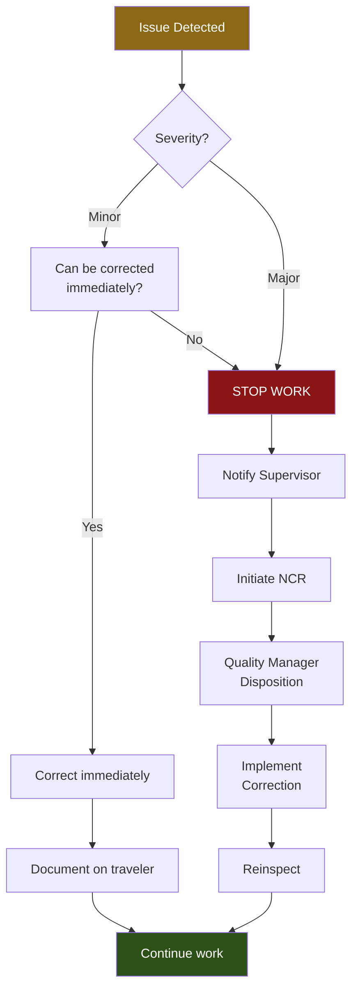

<div class="document-header" style="background: linear-gradient(135deg, #101810 0%, #2D5016 100%); color: white; padding: 40px; text-align: center; border-radius: 8px; margin-bottom: 30px; box-shadow: 0 4px 6px rgba(0,0,0,0.1);">
  <div style="font-size: 48px; font-weight: bold; letter-spacing: 2px; margin-bottom: 10px;">
    🏗️ FORT HOMES
  </div>
  <div style="font-size: 24px; font-weight: 300; letter-spacing: 1px; margin-bottom: 5px;">
    QUALITY MANAGEMENT SYSTEM
  </div>
  <div style="font-size: 20px; font-weight: bold; margin-top: 20px; padding-top: 20px; border-top: 2px solid rgba(255,255,255,0.3);">
    WORK INSTRUCTION - [TASK NAME]
  </div>
  <div style="font-size: 16px; margin-top: 10px; opacity: 0.9;">
    Phase [N] of 8 | Hold Point [HP-N]
  </div>
</div>

# WI-NNN: [TASK TITLE]
## Step-by-Step Task Procedure

---

## 📋 WORK INSTRUCTION CONTROL

| Attribute | Value |
|:---|:---|
| **Document ID** | WI-NNN |
| **Title** | [Full Task Title] |
| **Revision** | 1.0 |
| **Effective Date** | YYYY-MM-DD |
| **Process Owner** | [Role Title] |
| **Classification** | CONTROLLED |
| **Review Cycle** | Annual |
| **Next Review** | YYYY-MM-DD |
| **Parent SOP** | [SOP-NNN](../sops/production/SOP-NNN-Title.md) |
| **Phase** | [N] of 8 |
| **Duration** | [X hours/days] |
| **Crew Size** | [N] technicians |
| **Hold Point** | [HP-N] |

---

## 📑 QUICK REFERENCE

### At-a-Glance Information

| Item | Details |
|:---|:---|
| **Phase** | [Phase N: Phase Name] |
| **Estimated Duration** | [X hours/days per module] |
| **Crew** | [Team name] ([N] technicians) |
| **Hold Point** | [HP-N] (TPIA witness: [Yes/No]) |
| **Inspection Form** | [FORM-I-NNN](../forms-templates/inspection/FORM-I-NNN-Title.md) |
| **Safety Level** | ⚠️ [Low/Medium/High] |

---

## 🛡️ SAFETY REQUIREMENTS

> ⚠️ **MANDATORY PERSONAL PROTECTIVE EQUIPMENT (PPE)**

- [ ] Hard hat (ANSI Z89.1)
- [ ] Safety glasses with side shields (ANSI Z87.1)
- [ ] High-visibility vest
- [ ] Steel-toe boots (ASTM F2413)
- [ ] Hearing protection (if noise >85 dBA)
- [ ] Work gloves (cut-resistant for sharp materials)
- [ ] [Additional PPE as needed]

### Critical Safety Callouts

> 🚫 **STOP - Critical Hazards**
>
> - **[Hazard 1]:** [Description and prevention]
> - **[Hazard 2]:** [Description and prevention]
> - **[Hazard 3]:** [Description and prevention]

### Safety Procedures

1. **Fall Protection:** Required when working >6 ft elevation. Use proper harness, lanyard, and anchor points.
2. **Tool Safety:** [Specific tool safety requirements for this task]
3. **Material Handling:** [Lifting limits, team lift requirements]
4. **Lockout/Tagout:** [If applicable - powered equipment]
5. **Fire Prevention:** [If applicable - hot work, flammable materials]

### Emergency Contacts

| Emergency | Contact | Phone |
|:---|:---|:---|
| **Medical Emergency** | 911 | 911 |
| **Site Supervisor** | [Name] | [Extension] |
| **Safety Officer** | [Name] | [Extension] |

---

## 🔧 TOOLS & EQUIPMENT

### Required Tools

| Tool/Equipment | Specification | Calibration Required | Notes |
|:---|:---|:---:|:---|
| [Tool 1] | [Spec/model] | [ ] Yes / [x] No | [Usage notes] |
| [Tool 2] | [Spec/model] | [ ] Yes / [x] No | [Usage notes] |
| [Tool 3] | [Spec/model] | [x] Yes / [ ] No | [Cal due date location] |
| [Tool 4] | [Spec/model] | [ ] Yes / [x] No | [Usage notes] |

### Required Materials

| Material | Specification | Quantity | Storage Location |
|:---|:---|:---|:---|
| [Material 1] | [Spec/grade] | [Qty per module] | [Rack/bin number] |
| [Material 2] | [Spec/grade] | [Qty per module] | [Rack/bin number] |
| [Material 3] | [Spec/grade] | [Qty per module] | [Rack/bin number] |

> ℹ️ **MATERIAL VERIFICATION:**  
> All materials must have valid material certifications and lot numbers. Verify before use per [SOP-012](../sops/core/SOP-012-Material-Receiving.md).

---

## 📝 PRE-TASK CHECKLIST

**Before starting work, verify:**

- [ ] Module traveler available and previous phase signed off
- [ ] Previous hold point (HP-[N-1]) released
- [ ] All required materials on-hand with valid lot numbers
- [ ] All tools calibrated/functional
- [ ] Work area clean and organized
- [ ] PPE inspected and worn
- [ ] Safety briefing completed
- [ ] Weather conditions acceptable (if outdoor work)
- [ ] [Task-specific prerequisite]
- [ ] [Task-specific prerequisite]

> 🚫 **DO NOT PROCEED** if any checklist item is incomplete. Contact supervisor.

---

## 🔨 STEP-BY-STEP PROCEDURE

### Step 1: [Step Title]

**Objective:** [What this step accomplishes in 1 sentence]

**Duration:** [Approx. time]

**Technician:** [Role/specialty]

#### Visual Reference

```
┌─────────────────────────────────────────────────┐
│                                                 │
│    [ASCII diagram or placeholder for photo]     │
│                                                 │
│    Include:                                     │
│    - Key dimensions                             │
│    - Measurement points                         │
│    - Critical details                           │
│                                                 │
└─────────────────────────────────────────────────┘
```

**📷 Photo Reference:** `[filename].jpg` (see photo folder)

#### Actions

1️⃣ **[Action 1]**
   - **What:** [Detailed description]
   - **How:** [Method/technique]
   - **Verify:** [What to check]

2️⃣ **[Action 2]**
   - **What:** [Detailed description]
   - **How:** [Method/technique]
   - **Verify:** [What to check]

3️⃣ **[Action 3]**
   - **What:** [Detailed description]
   - **How:** [Method/technique]
   - **Verify:** [What to check]

#### Measurements/Tolerances

| Measurement | Location | Target Value | Tolerance | Tool |
|:---|:---|:---|:---|:---|
| [Dimension 1] | [Where to measure] | [Spec] | ± [tolerance] | [Tape/level/etc.] |
| [Dimension 2] | [Where to measure] | [Spec] | ± [tolerance] | [Tape/level/etc.] |

#### Quality Check ✅

- [ ] [Verification item 1]
- [ ] [Verification item 2]
- [ ] [Verification item 3]
- [ ] Measurements recorded on traveler
- [ ] Photos taken for documentation

> ⚠️ **COMMON MISTAKES:**
> - [Common error 1 and how to avoid it]
> - [Common error 2 and how to avoid it]

---

### Step 2: [Step Title]

**Objective:** [What this step accomplishes]

**Duration:** [Approx. time]

**Technician:** [Role/specialty]

#### Visual Reference

```
┌─────────────────────────────────────────────────┐
│                                                 │
│    [Diagram showing this step's outcome]        │
│                                                 │
└─────────────────────────────────────────────────┘
```

**📷 Photo Reference:** `[filename].jpg`

#### Actions

1️⃣ **[Action 1]**
   - **What:** [Description]
   - **How:** [Method]
   - **Verify:** [Check]

2️⃣ **[Action 2]**
   - **What:** [Description]
   - **How:** [Method]
   - **Verify:** [Check]

#### Quality Check ✅

- [ ] [Verification item 1]
- [ ] [Verification item 2]

---

### Step 3: [Step Title]

**Objective:** [What this step accomplishes]

**Duration:** [Approx. time]

**Technician:** [Role/specialty]

#### Visual Reference

```
┌─────────────────────────────────────────────────┐
│    EXAMPLE: Fastener Pattern                    │
│                                                 │
│    •  6" O.C. along edges                       │
│    •  12" O.C. in field                         │
│    •  Stagger rows                              │
│                                                 │
│    [Show pattern diagram]                       │
└─────────────────────────────────────────────────┘
```

**📷 Photo Reference:** `[filename].jpg`

#### Actions

1️⃣ **[Action 1]**
   - **What:** [Description]
   - **How:** [Method]
   - **Verify:** [Check]

2️⃣ **[Action 2]**
   - **What:** [Description]
   - **How:** [Method]
   - **Verify:** [Check]

#### Quality Check ✅

- [ ] [Verification item 1]
- [ ] [Verification item 2]

---

### Step 4: [Step Title]

**Objective:** [What this step accomplishes]

**Duration:** [Approx. time]

**Technician:** [Role/specialty]

#### Visual Reference

```
┌─────────────────────────────────────────────────┐
│                                                 │
│    [Final inspection points diagram]            │
│                                                 │
└─────────────────────────────────────────────────┘
```

#### Actions

1️⃣ **[Action 1]**
   - **What:** [Description]
   - **How:** [Method]
   - **Verify:** [Check]

2️⃣ **[Action 2]**
   - **What:** [Description]
   - **How:** [Method]
   - **Verify:** [Check]

#### Quality Check ✅

- [ ] [Verification item 1]
- [ ] [Verification item 2]

---

## 📊 INSPECTION & DOCUMENTATION

### Self-Inspection Checklist

**Production Supervisor completes before requesting QA inspection:**

- [ ] All work steps completed per this WI
- [ ] All measurements within tolerance
- [ ] No visible defects or damage
- [ ] Work area clean and organized
- [ ] Module traveler updated with:
  - [ ] Crew names and signatures
  - [ ] Start/end times
  - [ ] Material lot numbers
  - [ ] Any deviations or NCRs
- [ ] Photos taken and filed:
  - [ ] [Photo requirement 1]
  - [ ] [Photo requirement 2]
  - [ ] [Photo requirement 3]

### Hold Point [HP-N] Preparation

> ✅ **QUALITY HOLD POINT - HP-[N]**
>
> **Work MUST STOP** until QA inspection is complete.
>
> **Required for QA inspection:**
> 1. Module traveler with self-inspection complete
> 2. All photos/documentation assembled
> 3. Material certifications on file
> 4. Work area accessible for inspection
> 5. Good lighting for visual inspection
>
> **QA Inspector will verify using [FORM-I-NNN](../forms-templates/inspection/FORM-I-NNN-Title.md)**

### TPIA Witness (if required)

**For [HP-N], TPIA witness is: [REQUIRED / NOT REQUIRED]**

If TPIA required:
1. Coordinate inspection at least 24 hours in advance per [SOP-015](../sops/core/SOP-015-TPIA-Coordination.md)
2. Ensure all documentation is complete
3. TPIA inspector will witness QA inspection
4. TPIA report will be filed in module documentation packet

---

## 🔄 NONCONFORMANCE HANDLING

### If Issues Arise During Work



**Severity Definitions:**
- **Minor:** Does not affect function, safety, or code compliance. Examples: cosmetic blemish, minor overspray
- **Major:** Affects function, safety, code compliance, or customer requirement. Examples: missing fasteners, incorrect dimension, code violation

**NCR Process:**
1. Tag/mark nonconforming area clearly
2. Complete [FORM-NCR-001](../forms-templates/ncr/FORM-NCR-001-Nonconformance-Report.md)
3. Photograph nonconformance
4. Notify Quality Manager immediately
5. Await disposition decision (Use-As-Is, Rework, Repair, Scrap)
6. Implement disposition as approved
7. Reinspect per original acceptance criteria
8. Document resolution in traveler

---

## 📚 REFERENCES

### Related Documents

| Document ID | Title | Link |
|:---|:---|:---|
| **SOP-NNN** | [Parent SOP name] | [Link](../sops/production/SOP-NNN-Title.md) |
| **FORM-I-NNN** | [Inspection form name] | [Link](../forms-templates/inspection/FORM-I-NNN-Title.md) |
| **WI-[N-1]** | [Previous phase WI] | [Link](./WI-[N-1]-Title.md) |
| **WI-[N+1]** | [Next phase WI] | [Link](./WI-[N+1]-Title.md) |

### Regulatory Basis

| Regulation | Section | Requirement |
|:---|:---|:---|
| 24 CFR § [XXX] | [Section name] | [Brief requirement] |
| 8 CCR 1302-14 § [X] | [Section name] | [Brief requirement] |
| NEC § [XXX] | [Section name] | [Brief requirement] |

---

## 🎓 TRAINING REQUIREMENTS

### Required Training

**Personnel performing this work must complete:**
- [ ] New hire orientation (general safety)
- [ ] Tool-specific training ([list specific tools])
- [ ] On-the-job training (OJT) with qualified trainer
- [ ] Competency evaluation using [FORM-TR-002](../forms-templates/training/FORM-TR-002-Competency-Evaluation.md)
- [ ] This WI reviewed and acknowledged

**Competency verified by:** [Role]  
**Retraining required:** [Annually / Upon procedure change / etc.]

### Trainer Qualification

**Qualified trainers must:**
- Have 6+ months experience performing this task
- Have completed this task on ≥10 modules successfully
- Be designated as qualified by Production Supervisor

---

## 📋 RECORDS GENERATED

| Record | Format | Storage | Retention |
|:---|:---:|:---|:---:|
| Module Traveler (HP-[N] section) | Paper + PDF | Module folder | 20 years |
| Hold Point Inspection Form | FORM-I-NNN (PDF) | Module folder | 20 years |
| Photos (minimum [N]) | JPG files | Module photo folder | 20 years |
| Material lot numbers | Traveler section | Module folder | 20 years |
| NCR (if any) | FORM-NCR-001 | NCR database + module folder | 20 years |

---

## 💡 TIPS & BEST PRACTICES

### Pro Tips

✅ **Tip 1:** [Helpful tip for efficiency or quality]

✅ **Tip 2:** [Common shortcut or technique]

✅ **Tip 3:** [How to avoid common problems]

### Common Mistakes to Avoid

❌ **Mistake 1:** [What not to do and why]

❌ **Mistake 2:** [What not to do and why]

❌ **Mistake 3:** [What not to do and why]

### Time-Savers

- [Efficiency tip 1]
- [Efficiency tip 2]
- [Preparation tip]

---

## 📞 CONTACTS & SUPPORT

| Need | Contact | Extension | Location |
|:---|:---|:---:|:---|
| **Technical Questions** | Production Supervisor | [XXX] | [Bay/Office] |
| **Material Issues** | Materials Manager | [XXX] | [Warehouse] |
| **QA Inspection** | QA Inspector | [XXX] | [QA Office] |
| **Safety Concerns** | Safety Officer | [XXX] | [Office] |
| **Equipment Problems** | Maintenance | [XXX] | [Shop] |

---

## ✅ APPROVAL SIGNATURES

| Role | Name | Signature | Date |
|:---|:---|:---|:---|
| **Prepared By** | [Production Supervisor] | _________________ | YYYY-MM-DD |
| **Technical Review** | [Quality Manager] | _________________ | YYYY-MM-DD |
| **Approved By** | [Operations Manager] | _________________ | YYYY-MM-DD |

---

## 📅 REVISION HISTORY

| Revision | Date | Author | Description | Approved By |
|:---:|:---|:---|:---|:---|
| 1.0 | YYYY-MM-DD | [Author] | Initial release | [Approver] |

---

**Document Classification:** CONTROLLED  
**Distribution:** Production Team, QA Inspectors, Training Department  
**Next Review Date:** YYYY-MM-DD  

> ⚠️ **UNCONTROLLED WHEN PRINTED** - Verify current revision before use.  
> 📱 **Mobile Access:** View this WI on tablets at workstations for real-time reference.
