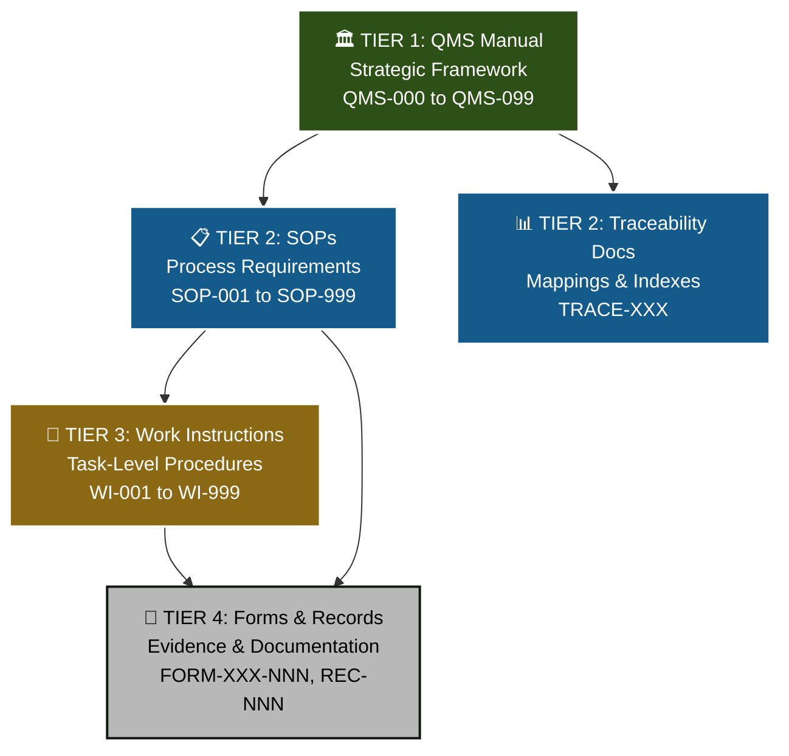
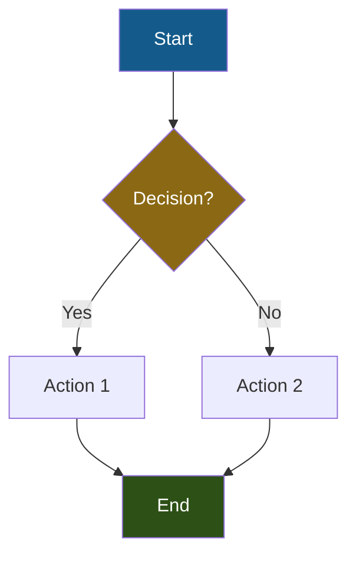
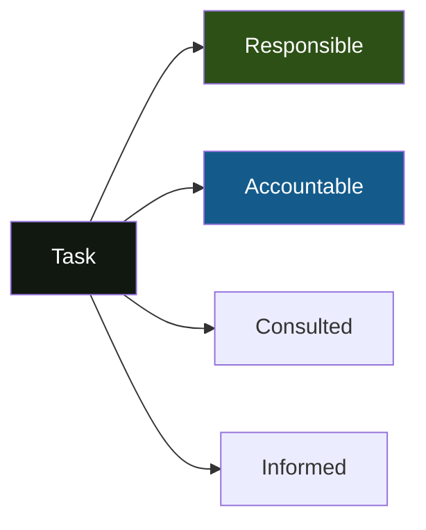
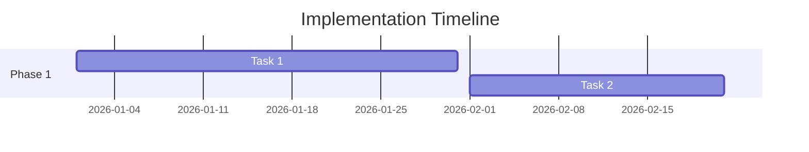
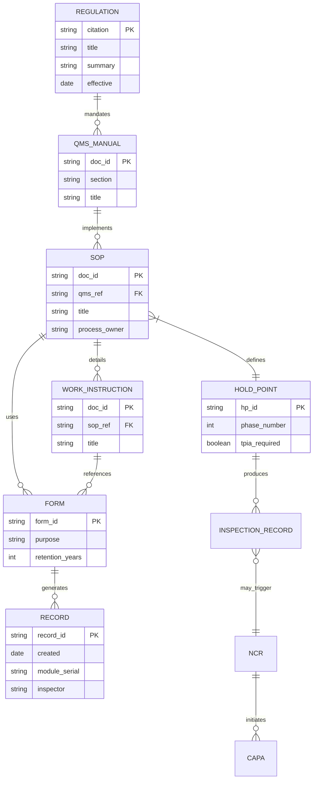
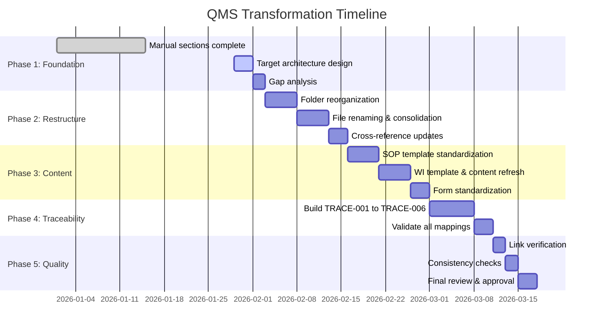

<div class="document-header" style="background: linear-gradient(135deg, #101810 0%, #2D5016 100%); color: white; padding: 40px; text-align: center; border-radius: 8px; margin-bottom: 30px; box-shadow: 0 4px 6px rgba(0,0,0,0.1);">
  <div style="font-size: 48px; font-weight: bold; letter-spacing: 2px; margin-bottom: 10px;">
    🏗️ FORT HOMES
  </div>
  <div style="font-size: 24px; font-weight: 300; letter-spacing: 1px; margin-bottom: 5px;">
    QUALITY MANAGEMENT SYSTEM
  </div>
  <div style="font-size: 20px; font-weight-bold; margin-top: 20px; padding-top: 20px; border-top: 2px solid rgba(255,255,255,0.3);">
    TARGET STATE INFORMATION ARCHITECTURE
  </div>
  <div style="font-size: 16px; margin-top: 10px; opacity: 0.9;">
    QMS Transformation Design Specification
  </div>
</div>

# TARGET STATE ARCHITECTURE
## Modern, Cutting-Edge QMS Information Architecture

---

## 📋 DOCUMENT CONTROL

| Attribute | Value |
|:---|:---|
| **Document ID** | QMS-TARGET-ARCH-2026 |
| **Revision** | 1.0 |
| **Effective Date** | 2026-01-29 |
| **Process Owner** | Quality Manager |
| **Approver** | General Manager |
| **Classification** | CONTROLLED |
| **Review Cycle** | Quarterly |
| **Next Review** | 2026-04-29 |

---

## 📑 TABLE OF CONTENTS

1. [Executive Summary](#1-executive-summary)
2. [Document Hierarchy & Numbering](#2-document-hierarchy--numbering)
3. [Folder Structure](#3-folder-structure)
4. [Revision Control System](#4-revision-control-system)
5. [Visual Design Standards](#5-visual-design-standards)
6. [Terminology & Nomenclature](#6-terminology--nomenclature)
7. [Cross-Reference Framework](#7-cross-reference-framework)
8. [Traceability System](#8-traceability-system)
9. [Implementation Roadmap](#9-implementation-roadmap)

---

## 1. EXECUTIVE SUMMARY

### 1.1 Vision Statement

Fort Homes QMS will embody a **cutting-edge, modern quality management system** that:
- ✅ Fully complies with HUD Code (24 CFR 3280/3282/3285), Colorado 8 CCR 1302-14, and NEC 2023
- ✅ Leverages AI-powered workflows for efficiency and consistency
- ✅ Provides complete traceability from regulatory requirements through execution records
- ✅ Maintains professional "billion-dollar" visual quality across all documentation
- ✅ Supports rapid compliance audits and regulatory inspections
- ✅ Enables data-driven continuous improvement

### 1.2 Design Principles

| Principle | Description | Implementation |
|:---|:---|:---|
| **Simplicity** | Minimize cognitive load | Clear hierarchy, consistent structure, plain language |
| **Traceability** | Full audit trail capability | Every requirement mapped to procedure to record |
| **Modularity** | Reusable, composable components | Template-driven, standardized sections |
| **Compliance-First** | Regulatory requirements drive structure | HUD/CCR/NEC citations throughout |
| **Visual Excellence** | Professional, modern appearance | Consistent branding, diagrams, white space |
| **Role-Based** | Right information for right person | RACI clarity, targeted distribution |
| **Digital-Native** | Optimized for screens and search | Markdown, hyperlinks, metadata |
| **AI-Ready** | Structured for machine processing | Consistent schemas, semantic markup |

---

## 2. DOCUMENT HIERARCHY & NUMBERING

### 2.1 Four-Tier Pyramid Structure



### 2.2 Numbering Conventions

| Document Type | Prefix | Range | Example | Purpose |
|:---|:---:|:---:|:---|:---|
| **Quality Manual** | `QMS` | 000-099 | QMS-001 | Strategic framework, policy, context |
| **Core SOPs** | `SOP` | 001-099 | SOP-001 | Management system procedures |
| **Production SOPs** | `SOP` | 100-199 | SOP-101 | Technical manufacturing procedures |
| **Support SOPs** | `SOP` | 200-299 | SOP-201 | Facilities, IT, safety (future) |
| **Work Instructions** | `WI` | 001-999 | WI-101 | Step-by-step task procedures |
| **Inspection Forms** | `FORM-I` | 001-999 | FORM-I-101 | Hold point inspection checklists |
| **NCR Forms** | `FORM-NCR` | 001-999 | FORM-NCR-001 | Nonconformance documentation |
| **Training Forms** | `FORM-TR` | 001-999 | FORM-TR-001 | Training records & evaluations |
| **CAPA Forms** | `FORM-CA` | 001-999 | FORM-CA-001 | Corrective action documentation |
| **Traceability Docs** | `TRACE` | 001-099 | TRACE-001 | Mapping & cross-reference documents |
| **Record Types** | `REC` | 001-999 | REC-101 | Record classification (for index) |

### 2.3 File Naming Standards

**Pattern:** `[PREFIX]-[NUMBER]-[DESCRIPTIVE-TITLE].md`

**Examples:**
- ✅ `QMS-001-Context-Stakeholders.md`
- ✅ `SOP-013-Hold-Point-Inspections.md`
- ✅ `WI-105-Insulation-Air-Sealing.md`
- ✅ `FORM-I-104-MEP-Rough-Inspection.md`
- ✅ `TRACE-001-Regulatory-Requirements-Matrix.md`

**Rules:**
- Use hyphens for separation (Markdown/URL friendly)
- Descriptive title (3-5 words maximum)
- No version numbers in filename (use internal metadata)
- No dates in filename (use Git/metadata)
- No special characters except hyphens

---

## 3. FOLDER STRUCTURE

### 3.1 Target Directory Tree

```
vscode-vfs://github/solidzdawg/fort-homes-qms/
├── README.md
├── CLAUDE.MD
├── GETTING-STARTED.md
├── package.json
├── tsconfig.json
│
├── data/                                    # Source data (JSON)
│   ├── company-info.json
│   ├── hold-points.json
│   ├── itps.json
│   ├── phases.json
│   └── cc21te/                              # Project-specific data
│
├── docs/                                    # ALL DOCUMENTATION
│   ├── manual/                              # TIER 1: QMS Manual
│   │   ├── QMS-000-Master-Index.md          # 📌 Navigation hub
│   │   ├── QMS-001-Context-Stakeholders.md
│   │   ├── QMS-002-Leadership-Policy.md
│   │   ├── QMS-003-Planning-Risk.md
│   │   ├── QMS-004-Support-Resources.md
│   │   ├── QMS-005-Operations.md
│   │   ├── QMS-006-Performance-Evaluation.md
│   │   ├── QMS-007-Improvement.md
│   │   ├── QMS-008-Document-Records.md
│   │   └── QMS-009-Regulatory-Compliance.md
│   │
│   ├── sops/                                # TIER 2: SOPs
│   │   ├── core/                            # SOP-001 to SOP-099
│   │   │   ├── SOP-001-Document-Control.md
│   │   │   ├── SOP-002-Training-Competency.md
│   │   │   ├── SOP-003-Internal-Audits.md
│   │   │   ├── SOP-004-Nonconformance-CAPA.md
│   │   │   ├── SOP-005-Change-Management.md
│   │   │   ├── SOP-006-Design-Control.md
│   │   │   ├── SOP-007-Procurement-Supplier.md
│   │   │   ├── SOP-008-Equipment-Calibration.md
│   │   │   ├── SOP-009-CDOH-Regulatory-Compliance.md
│   │   │   ├── SOP-010-Module-Identification.md
│   │   │   ├── SOP-011-Production-Planning.md
│   │   │   ├── SOP-012-Material-Receiving.md
│   │   │   ├── SOP-013-Hold-Point-Inspections.md
│   │   │   ├── SOP-014-Module-Traveler.md
│   │   │   ├── SOP-015-TPIA-Coordination.md
│   │   │   ├── SOP-016-Quality-Metrics.md
│   │   │   ├── SOP-017-Customer-Service.md
│   │   │   ├── SOP-018-Recalls-Field-Actions.md
│   │   │   ├── SOP-019-Packaging-Delivery.md
│   │   │   └── SOP-020-Continuous-Improvement.md
│   │   │
│   │   └── production/                      # SOP-100 to SOP-199
│   │       ├── SOP-101-Chassis-Floor.md
│   │       ├── SOP-102-Wall-Framing.md
│   │       ├── SOP-103-Roof-Ceiling.md
│   │       ├── SOP-104-MEP-Rough-In.md
│   │       ├── SOP-105-Insulation-Air-Sealing.md
│   │       ├── SOP-106-Drywall-Interior.md
│   │       ├── SOP-107-Interior-Trim.md
│   │       └── SOP-108-Final-Inspection.md
│   │
│   ├── work-instructions/                   # TIER 3: WIs
│   │   ├── WI-101-Chassis-Floor-Deck.md
│   │   ├── WI-102-Wall-Framing-Sheathing.md
│   │   ├── WI-103-Roof-Framing.md
│   │   ├── WI-104-MEP-Rough-In.md
│   │   ├── WI-105-Insulation-Air-Sealing.md
│   │   ├── WI-106-Drywall-Installation.md
│   │   ├── WI-107-Interior-Trim-Finish.md
│   │   ├── WI-108-Final-Inspection-Testing.md
│   │   └── WORK-INSTRUCTIONS-INDEX.md
│   │
│   ├── forms-templates/                     # TIER 4: Forms
│   │   ├── inspection/                      # FORM-I-NNN
│   │   │   ├── FORM-I-101-Floor-Inspection.md
│   │   │   ├── FORM-I-102-Wall-Inspection.md
│   │   │   ├── FORM-I-103-Roof-Inspection.md
│   │   │   ├── FORM-I-104-MEP-Rough-Inspection.md
│   │   │   ├── FORM-I-105-Insulation-Inspection.md
│   │   │   ├── FORM-I-106-Drywall-Inspection.md
│   │   │   ├── FORM-I-107-Interior-Trim-Inspection.md
│   │   │   └── FORM-I-108-Final-Inspection.md
│   │   │
│   │   ├── ncr/                             # FORM-NCR-NNN
│   │   │   ├── FORM-NCR-001-Nonconformance-Report.md
│   │   │   └── FORM-NCR-002-Supplier-NCR.md
│   │   │
│   │   ├── training/                        # FORM-TR-NNN
│   │   │   ├── FORM-TR-001-Training-Record.md
│   │   │   ├── FORM-TR-002-Competency-Evaluation.md
│   │   │   └── FORM-TR-003-Training-Acknowledgment.md
│   │   │
│   │   ├── capa/                            # FORM-CA-NNN
│   │   │   ├── FORM-CA-001-CAPA-Request.md
│   │   │   └── FORM-CA-002-CAPA-Effectiveness.md
│   │   │
│   │   └── templates/                       # Master templates
│   │       ├── SOP-TEMPLATE.md
│   │       ├── WI-TEMPLATE.md
│   │       ├── FORM-TEMPLATE.md
│   │       └── README-TEMPLATES.md
│   │
│   ├── traceability/                        # ⭐ NEW: Mapping docs
│   │   ├── TRACE-001-Regulatory-Requirements-Matrix.md
│   │   ├── TRACE-002-Document-Traceability-Matrix.md
│   │   ├── TRACE-003-Records-Index.md
│   │   ├── TRACE-004-Hold-Points-Matrix.md
│   │   ├── TRACE-005-Training-Requirements-Matrix.md
│   │   └── TRACE-006-Risk-Register.md
│   │
│   ├── training/                            # Training system
│   │   ├── TRAINING-MATRIX-COMPREHENSIVE.md
│   │   ├── Training-Record-Checklist.md
│   │   └── Competency-Evaluation-Form.md
│   │
│   ├── style-guide/                         # Design standards
│   │   ├── QMS-VISUAL-STYLE-GUIDE.md
│   │   ├── COLOR-PALETTE.md
│   │   ├── TYPOGRAPHY-REFERENCE.md
│   │   ├── ICON-EMOJI-REFERENCE.md
│   │   ├── MERMAID-DIAGRAM-LIBRARY.md
│   │   └── DOCUMENT-TEMPLATES/
│   │       ├── MANUAL-SECTION-TEMPLATE.md
│   │       ├── SOP-TEMPLATE.md
│   │       ├── WI-TEMPLATE.md
│   │       └── FORM-TEMPLATE.md
│   │
│   ├── context/                             # Background info
│   │   ├── 01-BRAND-SYSTEM.md
│   │   ├── 02-REGULATORY-REQUIREMENTS.md
│   │   └── README.md
│   │
│   ├── ai-agents/                           # Agent specifications
│   │   ├── AI-AGENT-ARCHITECTURE.md
│   │   └── HUMAN-APPROVAL-WORKFLOWS.md
│   │
│   ├── implementation/                      # Transformation tracking
│   │   ├── TRANSFORMATION-ROADMAP.md
│   │   ├── PHASE-1A-COMPLETION-SUMMARY.md
│   │   ├── TARGET-STATE-ARCHITECTURE.md    # THIS DOCUMENT
│   │   └── GAP-ANALYSIS.md
│   │
│   └── qc-tools/                            # Quality control utilities
│
├── assets/                                  # Visual assets
│   ├── css/
│   ├── fonts/
│   ├── img/
│   └── svg/
│
├── scripts/                                 # Automation scripts
│   ├── generate-pdf.js
│   ├── generate-docs.js
│   └── ...
│
├── src/                                     # TypeScript source
│   ├── agents/
│   ├── generators/
│   ├── lib/
│   └── database/
│
└── prisma/                                  # Database schema
    └── schema.prisma
```

### 3.2 Migration Plan

**Phase 1: Organize SOPs**
- Move all SOP-001 to SOP-099 → `docs/sops/core/`
- Move all SOP-100 to SOP-199 → `docs/sops/production/`
- Remove duplicate/old versions (keep -V2 versions, rename without suffix)

**Phase 2: Consolidate Forms**
- Create subdirectories: `inspection/`, `ncr/`, `training/`, `capa/`, `templates/`
- Rename forms to standard convention
- Update all cross-references

**Phase 3: Create Traceability Folder**
- Build all TRACE documents (new)
- Consolidate existing mapping attempts

**Phase 4: Update Cross-References**
- Update all relative paths in documents
- Fix broken links
- Verify navigation flows

---

## 4. REVISION CONTROL SYSTEM

### 4.1 Version Numbering Scheme

**Format:** `Major.Minor` (e.g., 2.3)

| Version Change | Increment | Examples |
|:---|:---:|:---|
| **Major (X.0)** | First digit | • Regulatory requirement change<br/>• Scope expansion<br/>• Process redesign<br/>• Compliance mandate |
| **Minor (X.Y)** | Second digit | • Editorial corrections<br/>• Formatting updates<br/>• Clarifications<br/>• Cross-reference fixes |

**Examples:**
- `1.0` → Initial release
- `1.1` → Minor corrections, typo fixes
- `1.2` → Added clarifying examples
- `2.0` → New regulatory requirement added
- `2.1` → Updated forms reference
- `3.0` → Process scope expanded

### 4.2 Document Metadata Block (Standard)

**Every document MUST include:**

```markdown
## 📋 DOCUMENT CONTROL

| Attribute | Value |
|:---|:---|
| **Document ID** | [PREFIX-NNN] |
| **Title** | [Full Descriptive Title] |
| **Revision** | [X.Y] |
| **Effective Date** | YYYY-MM-DD |
| **Process Owner** | [Role Title] |
| **Approver** | [Role Title] |
| **Classification** | CONTROLLED |
| **Review Cycle** | [Annual/Semi-Annual/Quarterly] |
| **Next Review** | YYYY-MM-DD |
| **Regulatory Basis** | [24 CFR §, 8 CCR §, etc.] |
| **Supersedes** | [Previous version ID, if applicable] |
```

### 4.3 Revision History Table (Standard)

**Location:** Bottom of every controlled document

```markdown
## 📅 REVISION HISTORY

| Revision | Date | Author | Description | Approved By |
|:---:|:---|:---|:---|:---|
| 1.0 | 2026-01-15 | J. Smith | Initial release | Quality Manager |
| 1.1 | 2026-02-10 | J. Smith | Corrected Section 5.3 typo | Quality Manager |
| 2.0 | 2026-03-01 | J. Smith | Added new hold point per CDOH | General Manager |
```

### 4.4 Approval Signatures Block

```markdown
## ✅ APPROVAL SIGNATURES

| Role | Name | Signature | Date |
|:---|:---|:---|:---|
| **Prepared By** | [Role/Person] | _________________ | YYYY-MM-DD |
| **Technical Review** | [Role/Person] | _________________ | YYYY-MM-DD |
| **Approved By** | [Role/Person] | _________________ | YYYY-MM-DD |
```

### 4.5 Change Management Process


---

## 5. VISUAL DESIGN STANDARDS

### 5.1 Document Header (HTML Gradient)

**Standard header for ALL documents:**

```html
<div class="document-header" style="background: linear-gradient(135deg, #101810 0%, #2D5016 100%); color: white; padding: 40px; text-align: center; border-radius: 8px; margin-bottom: 30px; box-shadow: 0 4px 6px rgba(0,0,0,0.1);">
  <div style="font-size: 48px; font-weight: bold; letter-spacing: 2px; margin-bottom: 10px;">
    🏗️ FORT HOMES
  </div>
  <div style="font-size: 24px; font-weight: 300; letter-spacing: 1px; margin-bottom: 5px;">
    QUALITY MANAGEMENT SYSTEM
  </div>
  <div style="font-size: 20px; font-weight: bold; margin-top: 20px; padding-top: 20px; border-top: 2px solid rgba(255,255,255,0.3);">
    [DOCUMENT TYPE AND TITLE]
  </div>
  <div style="font-size: 16px; margin-top: 10px; opacity: 0.9;">
    [Subtitle or Location]
  </div>
</div>
```

### 5.2 Typography Hierarchy

| Element | Markdown | Visual Effect | Usage |
|:---|:---:|:---|:---|
| **Document Title** | `# Title` | 48px, Bold, Charcoal | Once per document only |
| **Major Section** | `## Section` | 32px, SemiBold, Charcoal | Top-level sections (1, 2, 3...) |
| **Subsection** | `### Subsection` | 24px, SemiBold, Charcoal | Second-level (2.1, 2.2...) |
| **Detail Heading** | `#### Detail` | 18px, SemiBold, Charcoal | Third-level (2.1.1, 2.1.2...) |
| **Body Text** | Plain text | 11pt, Regular | Paragraphs, descriptions |
| **Emphasis** | `**bold**` | Bold | Key terms, roles |
| **Code/IDs** | `` `code` `` | Monospace | Document IDs, codes |

### 5.3 Color Palette Application

| Color | Hex | Usage Examples |
|:---|:---:|:---|
| **Charcoal Olive** | `#101810` | Primary text, headers, critical content |
| **Success Green** | `#2D5016` | Approved status, compliant, pass indicators |
| **Info Blue** | `#145B8B` | Cross-references, regulatory citations, info callouts |
| **Warning Gold** | `#8B6914` | Attention required, pending, review needed |
| **Error Red** | `#8B1414` | NCR, failed inspections, non-compliant |
| **Neutral Gray** | `#B8B8B8` | Borders, dividers, secondary UI elements |
| **Off-White** | `#F8F8F8` | Table headers, background highlights |

### 5.4 Callout Boxes (Standardized)

**Success/Compliant:**
```markdown
> ✅ **QUALITY CHECKPOINT**  
> All criteria met. Proceed to next phase.
```

**Warning/Attention:**
```markdown
> ⚠️ **ATTENTION REQUIRED**  
> Verify certifications before proceeding.
```

**Information/Reference:**
```markdown
> ℹ️ **REFERENCE**  
> See 24 CFR § 3280.305 for ventilation requirements.
```

**Critical/Error:**
```markdown
> 🚫 **STOP - NON-COMPLIANT**  
> Work must not proceed until NCR is resolved.
```

### 5.5 Table Formatting Standards

**Standard table:**
```markdown
| Column 1 | Column 2 | Column 3 |
|:---|:---:|---:|
| Left-aligned | Centered | Right-aligned |
| Text | Status | Numbers |
```

**Best practices:**
- Use `:---` for left-align (default for text)
- Use `:---:` for center-align (status, checkboxes)
- Use `---:` for right-align (numbers, dates)
- Bold headers automatically via Markdown
- Keep cell content concise
- Use line breaks sparingly in cells

### 5.6 Diagram Standards (Mermaid)

**Process Flowchart:**


**RACI Matrix (Responsibility):**


**Timeline/Gantt:**


---

## 6. TERMINOLOGY & NOMENCLATURE

### 6.1 Prohibited Terms

**NEVER USE:**
- ❌ ISO 9001 (company not certified)
- ❌ ISO-based clause numbers (e.g., "per ISO 9001:2015 clause 8.5")
- ❌ Any ISO-specific terminology implying certification

**REPLACE WITH:**
- ✅ "Quality management principles"
- ✅ "Industry best practices"
- ✅ "Quality system requirements"

### 6.2 Standard Role Titles

Use these **exact titles** for consistency:

| Role Title | Abbreviation | Typical Responsibilities |
|:---|:---:|:---|
| **General Manager** | GM | Overall QMS approval, strategic direction |
| **Quality Manager** | QM | QMS ownership, compliance, audits |
| **Operations Manager** | OM | Production oversight, resource allocation |
| **Production Supervisor** | PS | Day-to-day production, hold point prep |
| **QA Inspector** | QAI | Hold point inspections, measurements |
| **Document Controller** | DC | Document lifecycle, distribution, records |
| **Compliance Officer** | CO | Regulatory monitoring, CDOH/TPIA liaison |
| **Training Coordinator** | TC | Training programs, competency tracking |
| **Purchasing Manager** | PM | Supplier management, procurement |

### 6.3 Standard Terms & Definitions

| Term | Definition | Usage Context |
|:---|:---|:---|
| **Hold Point (HP)** | Mandatory inspection gate that blocks next phase | HP-1 through HP-8 per CDOH |
| **Module** | Single transportable housing unit | Production tracking unit |
| **Traveler** | Physical/digital document packet following module | Module-specific quality record |
| **TPIA** | Third-Party Inspection Agency (ICC NTA) | External regulatory oversight |
| **CDOH** | Colorado Division of Housing | State regulatory authority |
| **HUD Code** | Federal manufactured housing regulations (24 CFR 3280/3282/3285) | Primary compliance basis |
| **NCR** | Nonconformance Report | Defect documentation |
| **CAPA** | Corrective and Preventive Action | Improvement initiative |
| **ITP** | Inspection and Test Plan | Detailed inspection specification |
| **DOH Insignia** | Red label applied to compliant modules | Final approval marker |

### 6.4 Document Type Definitions

| Type | Definition | Lifecycle |
|:---|:---|:---|
| **Controlled Document** | Subject to formal change control, version management, approval workflow | Active, superseded, archived |
| **Uncontrolled Document** | Informational, no change control (printouts, copies) | Reference only, not auditable |
| **Quality Record** | Evidence of activities performed or results achieved | Created once, retained per schedule |
| **External Document** | Regulations, codes, standards from external authorities | Monitor for updates, reference current version |

---

## 7. CROSS-REFERENCE FRAMEWORK

### 7.1 Internal Document Linking

**Relative path standard:**
```markdown
[SOP-001](../sops/core/SOP-001-Document-Control.md)
[QMS-005](../manual/QMS-005-Operations.md)
[FORM-I-104](../forms-templates/inspection/FORM-I-104-MEP-Rough-Inspection.md)
```

**Section anchor linking:**
```markdown
[Section 5.2](#52-document-approval-workflow)
[Hold Point Requirements](#3-hold-point-requirements)
```

**Best practices:**
- Use descriptive link text (not "click here")
- Verify links work in GitHub/VS Code preview
- Update links when files move
- Maintain link integrity during reorganization

### 7.2 Regulatory Citation Format

**HUD Code (24 CFR):**
```markdown
24 CFR § 3280.305 (Ventilation)
24 CFR Part 3282, Subpart A (General)
```

**Colorado CCR:**
```markdown
8 CCR 1302-14 § 3.5 (Quality Control Manual)
8 CCR 1302-14 § 5.2 (Third-Party Inspection)
```

**NEC 2023:**
```markdown
NEC Article 550 (Mobile Homes, Manufactured Homes, and Mobile Home Parks)
NEC § 550.10 (Power Supply)
```

**IRC/IBC:**
```markdown
IRC § R602.3 (Design and construction)
IBC Chapter 17 (Special Inspections and Tests)
```

### 7.3 Cross-Reference Table Standard

**Include in every SOP/WI:**

```markdown
## 📚 REFERENCES

| Document ID | Title | Type | Location |
|:---|:---|:---:|:---|
| QMS-005 | Operations | Manual | [Link](../manual/QMS-005-Operations.md) |
| SOP-001 | Document Control | SOP | [Link](../sops/core/SOP-001-Document-Control.md) |
| FORM-I-104 | MEP Rough Inspection | Form | [Link](../forms-templates/inspection/FORM-I-104-MEP-Rough-Inspection.md) |

## ⚖️ REGULATORY BASIS

| Regulation | Section | Title | Requirement |
|:---|:---|:---|:---|
| 24 CFR § 3280.806 | Part 3280 | Electrical Systems | Wiring methods and materials |
| NEC Article 550 | 2023 | Mobile Homes | Complete electrical requirements |
| 8 CCR 1302-14 § 4.1 | Colorado | Quality Control | Inspection documentation |
```

---

## 8. TRACEABILITY SYSTEM

### 8.1 Traceability Objectives

1. **Regulatory Compliance:** Map every HUD/CCR/NEC requirement to implementing procedure
2. **Audit Readiness:** Quickly demonstrate compliance during inspections
3. **Gap Analysis:** Identify missing procedures or records
4. **Change Impact:** Understand downstream effects of regulatory changes
5. **Training Planning:** Link requirements to competency needs
6. **Record Management:** Catalog all quality records with retention rules

### 8.2 Traceability Documents (NEW)

| Document ID | Title | Purpose |
|:---|:---|:---|
| **TRACE-001** | Regulatory Requirements Matrix | CFR/CCR/NEC → QMS/SOP mapping |
| **TRACE-002** | Document Traceability Matrix | Hierarchical document relationships |
| **TRACE-003** | Records Index | Complete catalog of quality records |
| **TRACE-004** | Hold Points Matrix | HP gates mapped to SOPs, ITPs, forms |
| **TRACE-005** | Training Requirements Matrix | Role → required training → records |
| **TRACE-006** | Risk Register | Identified risks → mitigation procedures |

### 8.3 Traceability Matrix Structure (Example)

**TRACE-001: Regulatory Requirements Matrix**

| Reg Citation | Requirement Summary | QMS Section | Implementing SOP(s) | Evidence/Record | Responsible |
|:---|:---|:---|:---|:---|:---|
| 24 CFR § 3280.305 | Ventilation systems | QMS-005 § 4.5 | SOP-104 MEP Rough-In | FORM-I-104, Traveler HP-4 | QA Inspector |
| 8 CCR 1302-14 § 3.5 | Quality control manual required | QMS-000 | SOP-001 Document Control | QMS Manual (this document) | Quality Manager |
| NEC § 550.10(A) | Power supply rated 50A min | QMS-009 § 5.2 | SOP-104 MEP Rough-In | Electrical plans, FORM-I-104 | QA Inspector |

### 8.4 Document Relationship Diagram



---

## 9. IMPLEMENTATION ROADMAP

### 9.1 Transformation Phases



### 9.2 Phase 2 Deliverables (Immediate Next)

**2.1 Folder Reorganization**
- Create `docs/sops/core/` and `docs/sops/production/`
- Create `docs/forms-templates/` subdirectories
- Create `docs/traceability/` directory
- Move files per target structure
- Update `.gitignore` if needed

**2.2 File Consolidation**
- Remove old versions (keep latest -V2, rename without suffix)
- Delete duplicate/superseded documents
- Standardize all filenames
- Archive obsolete content

**2.3 Metadata Standardization**
- Update all document control blocks
- Add missing regulatory basis citations
- Ensure consistent revision numbering
- Add supersedes references where applicable

**2.4 Cross-Reference Audit**
- Inventory all internal links
- Update paths for reorganized files
- Verify all links resolve
- Fix broken anchors

### 9.3 Phase 3 Deliverables (Content Transformation)

**3.1 SOP Standardization**
- Apply SOP-TEMPLATE to all SOPs
- Ensure all have: Purpose, Scope, References, Roles, Procedure, Metrics, Training
- Add RACI matrices where needed
- Incorporate Mermaid flowcharts
- Remove any ISO 9001 references (found in QMS-005, templates)

**3.2 Work Instruction Enhancement**
- Apply WI-TEMPLATE (60% visual emphasis)
- Add step-by-step numbered procedures
- Include safety callouts prominently
- Add photos/diagrams placeholders
- Link to parent SOPs and forms

**3.3 Form Modernization**
- Standardize form headers
- Add digital-friendly checkboxes/fields
- Include clear instructions
- Link to implementing SOPs
- Add approval signature blocks

**3.4 Manual Section Review**
- QMS-000 through QMS-009 final polish
- Remove ISO references from QMS-005 § 3 (document control table)
- Update cross-references
- Add missing Mermaid diagrams
- Ensure complete regulatory citations

### 9.4 Phase 4 Deliverables (Traceability)

**4.1 Create TRACE-001: Regulatory Requirements Matrix**
- Map every 24 CFR § 3280/3282/3285 requirement
- Map every 8 CCR 1302-14 § requirement
- Map critical NEC Article 550 requirements
- Link to implementing QMS/SOP
- Identify gaps (requirements with no procedure)

**4.2 Create TRACE-002: Document Traceability Matrix**
- QMS Manual → SOP → WI → Forms hierarchy
- Show parent-child relationships
- Identify orphaned documents
- Cross-reference validation

**4.3 Create TRACE-003: Records Index**
- Catalog all quality record types (REC-NNN classification)
- Define retention periods (20 years for product records per CDOH)
- Identify record owner
- Specify storage location/system
- Link to generating procedure

**4.4 Create TRACE-004: Hold Points Matrix**
- HP-1 through HP-8 detailed specifications
- Link to phase SOPs (SOP-101 to SOP-108)
- Link to inspection forms (FORM-I-101 to FORM-I-108)
- Link to ITPs (ITP-CS-01, etc.)
- TPIA witness requirements

**4.5 Create TRACE-005: Training Requirements Matrix**
- Role → Required training topic → Training method → Frequency → Record type
- HUD Code training requirements
- NEC 2023 training requirements
- Competency assessment criteria
- Link to FORM-TR-NNN

**4.6 Create TRACE-006: Risk Register**
- Identified risks from QMS-003
- Risk assessment (likelihood × impact)
- Mitigation procedures (link to SOPs)
- Monitoring metrics
- Review frequency

### 9.5 Phase 5 Deliverables (Quality Assurance)

**5.1 Link Verification**
- Automated link checker (script or tool)
- Manual spot-checks of critical paths
- Fix all broken links
- Update outdated URLs

**5.2 Consistency Checks**
- Document ID uniqueness
- Version numbering consistency
- Terminology alignment (use standard terms)
- Formatting consistency (headers, tables, callouts)
- Metadata completeness

**5.3 Content Quality Review**
- Grammar/spelling check
- Technical accuracy review
- Regulatory citation validation
- Completeness assessment
- Stakeholder review (Quality Manager, Operations Manager, General Manager)

**5.4 Final Approval**
- Management review of full transformed QMS
- Sign-off on traceability matrices
- Approval of new templates
- Authorization for implementation

### 9.6 Success Metrics

| Metric | Target | Validation Method |
|:---|:---:|:---|
| **Document Structure** | 100% compliance | Folder audit, naming check |
| **ISO References** | 0 found | Text search across all .md files |
| **Broken Links** | 0 found | Link checker tool |
| **Missing Metadata** | 0 documents | Metadata audit script |
| **Traceability Coverage** | ≥95% requirements | TRACE-001 gap analysis |
| **Records Cataloged** | 100% types | TRACE-003 completeness |
| **Template Compliance** | 100% SOPs/WIs | Manual review sample |
| **Regulatory Citations** | ≥90% with citation | Citation audit |

---

## 10. CONCLUSION

This Target State Architecture defines a **cutting-edge, modern QMS** that:

✅ Fully complies with HUD Code, Colorado CCR, and NEC requirements  
✅ Provides complete traceability from regulation to record  
✅ Maintains professional visual quality throughout  
✅ Supports AI-powered workflows and automation  
✅ Enables rapid compliance audits and regulatory inspections  
✅ Facilitates continuous improvement through data-driven decisions  

**Implementation will proceed systematically through 5 phases, with each phase building on the previous foundation.**

---

## ✅ APPROVAL SIGNATURES

| Role | Name | Signature | Date |
|:---|:---|:---|:---|
| **Prepared By** | Quality Manager | _________________ | 2026-01-29 |
| **Technical Review** | Compliance Officer | _________________ | 2026-01-29 |
| **Approved By** | General Manager | _________________ | 2026-01-29 |

---

## 📅 REVISION HISTORY

| Revision | Date | Author | Description | Approved By |
|:---:|:---|:---|:---|:---|
| 1.0 | 2026-01-29 | AI Documentation Architect | Initial target state specification | Quality Manager |

---

**Document Classification:** CONTROLLED  
**Distribution:** Management Team, Document Controller  
**Next Review Date:** 2026-04-29
