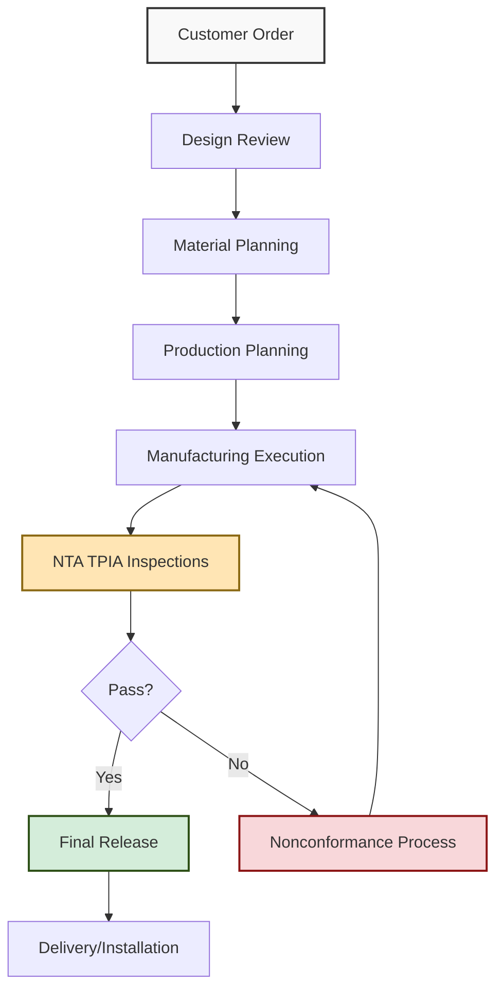

<div class="document-header" style="background: linear-gradient(135deg, #101810 0%, #2D5016 100%); color: white; padding: 40px; text-align: center; border-radius: 8px; margin-bottom: 30px; box-shadow: 0 4px 6px rgba(0,0,0,0.1);">
  <div style="font-size: 48px; font-weight: bold; letter-spacing: 2px; margin-bottom: 10px;">
    🏗️ FORT HOMES
  </div>
  <div style="font-size: 24px; font-weight: 300; letter-spacing: 1px; margin-bottom: 5px;">
    QUALITY MANAGEMENT SYSTEM
  </div>
  <div style="font-size: 20px; font-weight: bold; margin-top: 20px; padding-top: 20px; border-top: 2px solid rgba(255,255,255,0.3);">
    OPERATIONS CONTROL
  </div>
  <div style="font-size: 16px; margin-top: 10px; opacity: 0.9;">
    Grand Junction, Colorado
  </div>
</div>

# QMS-005 OPERATIONS
## Operations Control and Product Realization

---

## 📋 DOCUMENT CONTROL

| **Attribute** | **Details** |
|:---|:---|
| **Document ID** | QMS-005-OPERATIONS |
| **Version** | 1.0 |
| **Effective Date** | 2026-01-15 |
| **Process Owner** | Operations Manager |
| **Classification** | CONTROLLED |
| **Review Cycle** | Annual |
| **Next Review Date** | 2027-01-15 |

---

## 📑 TABLE OF CONTENTS

1. [Operations Control Overview](#1-operations-control-overview)
2. [Process Map and SOPs](#2-process-map-and-sops)
3. [Design Control Requirements](#3-design-control-requirements)
4. [External Provider Control](#4-external-provider-control)
5. [Production and Service Provision](#5-production-and-service-provision)
6. [Release of Products and Services](#6-release-of-products-and-services)
7. [Control of Nonconforming Outputs](#7-control-of-nonconforming-outputs)

---

## 1. OPERATIONS CONTROL OVERVIEW

### 1.1 Operations Framework

Fort Homes operates a controlled manufacturing environment for modular residential structures under:
- **HUD Code** 24 CFR 3280/3282 (Manufactured Housing Construction and Safety Standards)
- **Colorado Code of Regulations (CCR)** 8 CCR 1302-14 (Manufactured Housing)
- **National Electrical Code (NEC)** 2023 for all electrical installations
- **NTA, Inc.** as Third-Party Inspection Agency (TPIA)

<div style="background: #f8f8f8; padding: 20px; border-left: 4px solid #2D5016; margin: 20px 0;">

### 🎯 Operations Control Objectives

- Ensure all manufacturing meets HUD Code requirements
- Maintain NTA TPIA approval and inspection coordination
- Comply with CCR 8 CCR 1302-14 state regulations
- Implement NEC 2023 electrical standards
- Control production quality and consistency
- Manage external suppliers and materials
- Enable product traceability and accountability

</div>

### 1.2 Operations Control Process Flow



---

## 2. PROCESS MAP AND SOPs

### 2.1 Core Process Map

<div style="background: white; padding: 20px; border: 2px solid #ddd; border-radius: 8px; margin: 20px 0;">

| Process Category | Process Name | SOP Reference | TPIA Hold Points |
|:---|:---|:---|:---|
| **🔧 Pre-Production** | Document Control & Records | [SOP-001](../sops/SOP-001-Document-Control-Records-Management-V2.md) | - |
| | Training & Competency | [SOP-002](../sops/SOP-002-Training-Competency-Management.md) | - |
| | Procurement & Supplier Mgmt | [SOP-007](../sops/SOP-007-Procurement-Supplier-Management.md) | Material Verification |
| | Equipment Calibration | [SOP-008](../sops/SOP-008-Equipment-Calibration-Maintenance.md) | - |
| **📋 Planning** | Production Planning | [SOP-011](../sops/SOP-011-Production-Planning-Scheduling.md) | - |
| | Material Receiving & Traceability | [SOP-012](../sops/SOP-012-Material-Receiving-Lot-Traceability.md) | Material Hold Point |
| **🏭 Production** | Module Traveler Management | [SOP-014](../sops/SOP-014-Module-Traveler-Work-Package-Management.md) | - |
| | Hold Point Inspections | [SOP-013](../sops/SOP-013-Hold-Point-Inspections-Gate-Controls.md) | Multiple TPIA gates |
| | Wall Framing & Sheathing | [SOP-102](../sops/SOP-102-Wall-Framing-Sheathing.md) | Wall Framing Hold |
| | Roof & Ceiling Framing | [SOP-103](../sops/SOP-103-Roof-Ceiling-Framing.md) | Roof Framing Hold |
| | Drywall & Interior Shell | [SOP-106](../sops/SOP-106-Drywall-Interior-Shell.md) | - |
| **✅ Quality Control** | TPIA Coordination | [SOP-015](../sops/SOP-015-TPIA-Third-Party-Inspector-Coordination.md) | All Hold Points |
| | Module ID & Data Plate | [SOP-010](../sops/SOP-010-Module-Identification-Data-Plate.md) | Data Plate Verification |
| | CDOH Regulatory Compliance | [SOP-009](../sops/SOP-009-CDOH-Regulatory-Compliance.md) | State Inspection |
| **📊 Monitoring** | Quality Metrics & Reporting | [SOP-016](../sops/SOP-016-Quality-Metrics-Performance-Reporting.md) | - |
| | Nonconformance & CAPA | [SOP-004](../sops/SOP-004-Nonconformance-CAPA.md) | - |
| | Internal Audits | [SOP-003](../sops/SOP-003-Internal-Audits.md) | - |
| **🔄 Management** | Change Management | [SOP-005](../sops/SOP-005-Change-Management-Process-Control.md) | Design Change Approval |
| | Management Review | [SOP-006](../sops/SOP-006-Management-Review.md) | - |
| **🚨 Post-Production** | Recalls & Field Actions | [SOP-018](../sops/SOP-018-Recalls-Field-Actions.md) | - |

</div>

### 2.2 NTA TPIA Hold Points

<div style="background: #FFF3CD; padding: 20px; border-left: 4px solid #8B6914; margin: 20px 0;">

#### 🔍 Critical TPIA Inspection Points

Fort Homes manufacturing is subject to NTA third-party inspection at these mandatory hold points:

1. **Material Receiving** - Verify approved materials (SOP-012)
2. **Floor System** - Before walls erected (SOP-102)
3. **Wall Framing** - Before sheathing/insulation (SOP-102)
4. **Roof Framing** - Before covering (SOP-103)
5. **Electrical Rough-In** - Per NEC 2023 requirements
6. **Plumbing Rough-In** - Before concealment
7. **Final Inspection** - Before data plate affixing (SOP-010)

**No work may proceed past a hold point without NTA TPIA approval.**

</div>

---

## 3. DESIGN CONTROL REQUIREMENTS

### 3.1 Design Input Requirements

All modular home designs must meet:

- **HUD Code 24 CFR 3280** - Construction and safety standards
- **NEC 2023** - Electrical system design and installation
- **CCR 8 CCR 1302-14** - Colorado-specific requirements
- **IRC 2021** - International Residential Code (where applicable)
- **IPC 2021** - International Plumbing Code
- **IECC 2021** - International Energy Conservation Code

### 3.2 Design Review and Validation

<div style="background: white; padding: 20px; border: 2px solid #ddd; border-radius: 8px; margin: 20px 0;">

| Design Stage | Review Requirements | Approval Authority | Documentation |
|:---|:---|:---|:---|
| **Concept Design** | Customer requirements, code applicability | Design Manager | Design Brief |
| **Preliminary Design** | Code compliance check, material specifications | Engineering, Quality | Design Plans |
| **Detailed Design** | Full HUD/NEC/CCR compliance verification | Engineering, NTA Review | Approved Plans |
| **Design Changes** | Impact assessment, re-approval if required | Change Control Board | Change Order |

</div>

### 3.3 Design Outputs

Design outputs include:
- Architectural floor plans and elevations
- Structural engineering calculations
- Electrical plans (NEC 2023 compliant)
- Plumbing plans
- HVAC specifications
- Material specifications and cut lists
- Assembly sequences and work instructions

---

## 4. EXTERNAL PROVIDER CONTROL

### 4.1 Supplier Management

All external providers (suppliers, subcontractors) must meet Fort Homes quality requirements per [SOP-007](../sops/SOP-007-Procurement-Supplier-Management.md).

<div style="background: #f8f8f8; padding: 20px; border-left: 4px solid #2D5016; margin: 20px 0;">

#### 📋 Supplier Requirements

**Category A (Critical Materials)**
- Structural lumber, engineered wood products
- Windows and exterior doors
- Electrical components and panels
- Plumbing fixtures and piping
- HVAC equipment

**Requirements:**
✅ HUD-approved materials with certifications
✅ Material test reports and compliance documentation
✅ Traceability and lot identification
✅ On-time delivery performance
✅ Quality audit by Fort Homes (annual)

</div>

### 4.2 Material Verification

All received materials are verified per [SOP-012](../sops/SOP-012-Material-Receiving-Lot-Traceability.md):
- Visual inspection for damage
- Certification/documentation review
- Dimensional/specification verification
- Lot traceability assignment
- NTA TPIA material hold point inspection

---

## 5. PRODUCTION AND SERVICE PROVISION

### 5.1 Production Environment

Fort Homes maintains a controlled 30,000 sq ft manufacturing facility:
- Climate-controlled environment
- Organized production stations (floor, wall, roof, finishing)
- Material storage areas with environmental protection
- Quality inspection areas
- Equipment maintenance program

### 5.2 Production Execution

Manufacturing follows the Module Traveler system ([SOP-014](../sops/SOP-014-Module-Traveler-Work-Package-Management.md)):

<div style="background: white; padding: 20px; border: 2px solid #ddd; border-radius: 8px; margin: 20px 0;">

#### 🏭 Production Workflow

```
┌─────────────────────────────────────────────────────────────────┐
│  PRODUCTION SEQUENCE                                            │
├─────────────────────────────────────────────────────────────────┤
│                                                                 │
│  1️⃣ FLOOR SYSTEM                                               │
│     • Floor frame assembly                                      │
│     • Insulation installation                                   │
│     • Floor sheathing                                           │
│     ✅ NTA TPIA Hold Point #1                                   │
│                                                                 │
│  2️⃣ WALL SYSTEMS                                               │
│     • Wall frame assembly (exterior & interior)                 │
│     • Sheathing and vapor barriers                              │
│     • Window/door installation                                  │
│     ✅ NTA TPIA Hold Point #2                                   │
│                                                                 │
│  3️⃣ ROOF SYSTEM                                                │
│     • Roof truss installation                                   │
│     • Roof sheathing                                            │
│     • Roofing material application                              │
│     ✅ NTA TPIA Hold Point #3                                   │
│                                                                 │
│  4️⃣ ELECTRICAL ROUGH-IN (NEC 2023)                             │
│     • Electrical panel installation                             │
│     • Branch circuit wiring                                     │
│     • Receptacle/switch installation                            │
│     ✅ NTA TPIA Hold Point #4 - NEC Compliance                  │
│                                                                 │
│  5️⃣ PLUMBING ROUGH-IN                                          │
│     • Supply and drain piping                                   │
│     • Fixture connections                                       │
│     • Pressure testing                                          │
│     ✅ NTA TPIA Hold Point #5                                   │
│                                                                 │
│  6️⃣ INSULATION & DRYWALL                                       │
│     • Wall and ceiling insulation                               │
│     • Drywall installation and finishing                        │
│     • Interior paint                                            │
│                                                                 │
│  7️⃣ FINISH TRADES                                              │
│     • Flooring installation                                     │
│     • Trim and millwork                                         │
│     • Fixture installation                                      │
│     • Final electrical and plumbing connections                 │
│                                                                 │
│  8️⃣ FINAL INSPECTION                                           │
│     • Quality final walkthrough                                 │
│     • NTA TPIA final inspection                                 │
│     • Data plate affixing (per SOP-010)                         │
│     ✅ NTA TPIA Final Hold Point                                │
│                                                                 │
│  9️⃣ SHIPPING PREPARATION                                       │
│     • Protection and securing                                   │
│     • Documentation package                                     │
│     • Transport coordination                                    │
│                                                                 │
└─────────────────────────────────────────────────────────────────┘
```

</div>

### 5.3 NEC 2023 Electrical Compliance

All electrical work complies with **National Electrical Code 2023**:

<div style="background: #E7F3FF; padding: 20px; border-left: 4px solid #145B8B; margin: 20px 0;">

#### ⚡ NEC 2023 Key Requirements

- **Article 550** - Mobile Homes, Manufactured Homes, and Mobile Home Parks
- **Branch Circuit Protection** - AFCI/GFCI per NEC requirements
- **Service Equipment** - Main disconnect, overcurrent protection
- **Grounding and Bonding** - Per NEC Article 250
- **Wiring Methods** - NM cable or approved alternatives
- **Box Fill Calculations** - NEC Article 314
- **Receptacle Spacing** - Per NEC 210.52

**NTA TPIA verifies NEC compliance at electrical hold point.**

</div>

---

## 6. RELEASE OF PRODUCTS AND SERVICES

### 6.1 Release Criteria

Modules may only be released when:

✅ All NTA TPIA hold points passed
✅ Final NTA inspection completed and approved
✅ HUD Data Plate affixed per [SOP-010](../sops/SOP-010-Module-Identification-Data-Plate.md)
✅ CCR 8 CCR 1302-14 compliance verified
✅ All nonconformances closed or dispositioned
✅ Quality documentation complete in module traveler
✅ Customer acceptance (if applicable)
✅ CDOH notification completed per [SOP-009](../sops/SOP-009-CDOH-Regulatory-Compliance.md)

### 6.2 Release Authority

| Release Type | Authority | Documentation |
|:---|:---|:---|
| **Production Release to Next Station** | Production Supervisor | Module Traveler Sign-off |
| **NTA TPIA Hold Point Release** | NTA Inspector | NTA Inspection Report |
| **Final Product Release** | Quality Manager + NTA Final | Certificate of Compliance, Data Plate |
| **Shipment Authorization** | Operations Manager | Shipping Authorization |

---

## 7. CONTROL OF NONCONFORMING OUTPUTS

### 7.1 Nonconformance Identification

Nonconformances are identified through:
- NTA TPIA inspections
- Internal quality inspections
- Production team identification
- Customer complaints
- Final walkthrough findings

### 7.2 Nonconformance Handling

All nonconformances follow [SOP-004](../sops/SOP-004-Nonconformance-CAPA.md):

<div style="background: #F8D7DA; padding: 20px; border-left: 4px solid #8B1414; margin: 20px 0;">

#### ⚠️ Nonconformance Disposition Options

1. **Rework** - Correct to meet requirements (most common)
2. **Repair** - Make acceptable (with approval)
3. **Accept with Concession** - Customer/NTA approval required
4. **Scrap** - Dispose if cannot be corrected
5. **Re-grade** - Use for different purpose (rare)

**NTA TPIA must approve any nonconformance disposition affecting HUD Code compliance.**

</div>

### 7.3 Segregation and Identification

Nonconforming products are:
- 🔴 Tagged with red "HOLD" tag
- Physically segregated from conforming products
- Documented in Nonconformance Report (NCR)
- Not allowed to proceed until disposition approved

---

## 8. OPERATIONS PERFORMANCE METRICS

<div style="background: white; padding: 20px; border: 2px solid #ddd; border-radius: 8px; margin: 20px 0;">

| Metric | Target | Measurement Frequency | Owner |
|:---|:---|:---|:---|
| **On-Time Delivery** | >95% | Weekly | Operations Manager |
| **First-Pass NTA TPIA Inspection Rate** | >90% | Per inspection | Quality Manager |
| **Rework Rate** | <5% | Weekly | Production Manager |
| **Material Conformance Rate** | >98% | Per receiving | Procurement Manager |
| **NTA Hold Point Closure Time** | <24 hours | Per hold point | Quality Manager |
| **Customer Satisfaction** | >4.5/5.0 | Per delivery | General Manager |

</div>

---

## 🔄 REVISION HISTORY

| Version | Date | Description | Author | Approved By |
|:---|:---|:---|:---|:---|
| 1.0 | 2026-01-15 | Initial creation of Operations document | Operations Manager | Executive Leadership |

---

## ✅ APPROVAL SIGNATURES

| Role | Name | Signature | Date |
|:---|:---|:---|:---|
| **Prepared By** | Operations Manager | _________________ | 2026-01-15 |
| **Reviewed By** | Quality Manager | _________________ | 2026-01-15 |
| **Approved By** | General Manager | _________________ | 2026-01-15 |

---

**Document Classification:** CONTROLLED  
**Distribution:** All Fort Homes LLC Personnel  
**Next Review Date:** 2027-01-15

---

*This document is part of the Fort Homes LLC Quality Management System. Unauthorized distribution is prohibited.*
