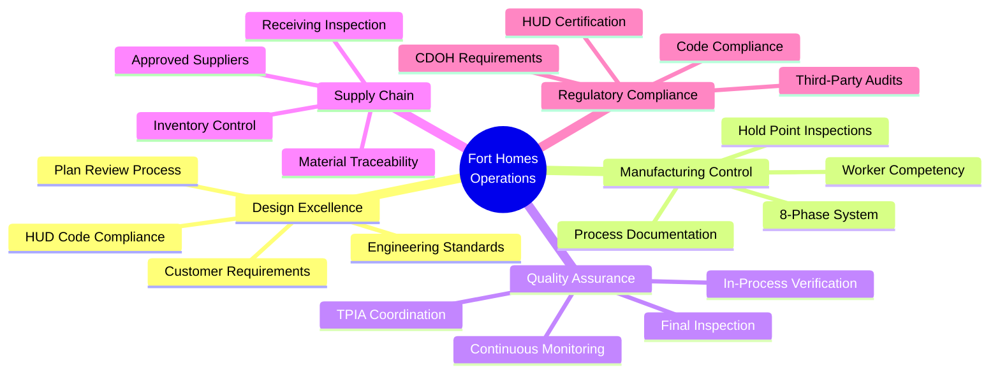
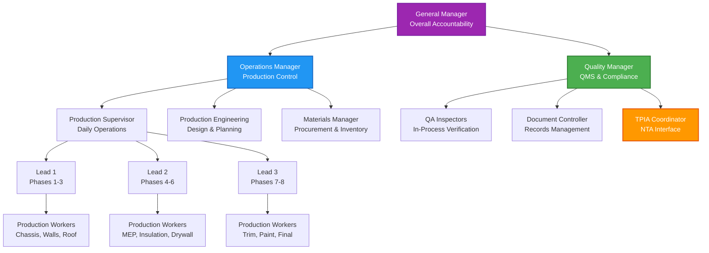
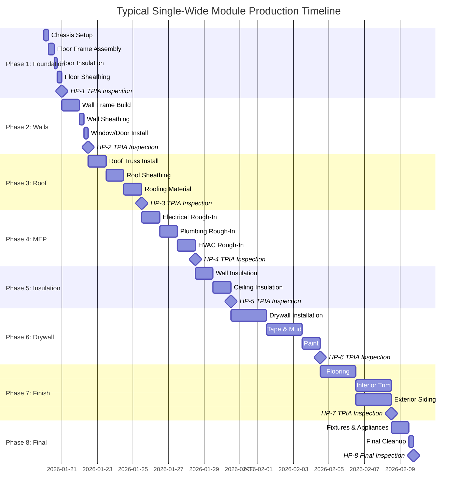

<div align="center">

# 🏗️ FORT HOMES LLC
## Quality Management System Manual

---

### QMS-005: OPERATIONS CONTROL
#### Offsite Modular Home Construction & Product Realization

| Attribute | Value |
|:----------|:------|
| **Document ID** | `QMS-005` |
| **Revision** | `2.0` |
| **Effective Date** | January 2026 |
| **Process Owner** | Operations Manager |
| **Classification** | <span style="background:#4CAF50;color:white;padding:4px 12px;border-radius:12px;font-weight:bold;font-size:12px;">✅ CONTROLLED</span> |
| **Review Cycle** | Semi-Annual |
| **Next Review** | July 2026 |
| **Regulatory Basis** | 24 CFR § 3280/3282, 8 CCR 1302-14 |

---

</div>

## 📋 Document Control

<table style="width:100%;border-collapse:collapse;margin:20px 0;box-shadow:0 2px 4px rgba(0,0,0,0.1);">
  <thead style="background:linear-gradient(135deg,#2D5016 0%,#1a2f0d 100%);color:white;">
    <tr>
      <th style="padding:12px;text-align:left;border:1px solid #ddd;">Attribute</th>
      <th style="padding:12px;text-align:left;border:1px solid #ddd;">Details</th>
    </tr>
  </thead>
  <tbody>
    <tr style="background:#ffffff;">
      <td style="padding:10px;border:1px solid #ddd;"><strong>Supersedes</strong></td>
      <td style="padding:10px;border:1px solid #ddd;">QMS-005 Rev 1.0</td>
    </tr>
    <tr style="background:#f9f9f9;">
      <td style="padding:10px;border:1px solid #ddd;"><strong>Related Sections</strong></td>
      <td style="padding:10px;border:1px solid #ddd;">QMS-001, QMS-003, QMS-006, QMS-007</td>
    </tr>
    <tr style="background:#ffffff;">
      <td style="padding:10px;border:1px solid #ddd;"><strong>Supporting SOPs</strong></td>
      <td style="padding:10px;border:1px solid #ddd;">SOP-011 through SOP-018, SOP-101 through SOP-108</td>
    </tr>
    <tr style="background:#f9f9f9;">
      <td style="padding:10px;border:1px solid #ddd;"><strong>Distribution</strong></td>
      <td style="padding:10px;border:1px solid #ddd;">All Operations Personnel, Production Staff, TPIA, CDOH</td>
    </tr>
    <tr style="background:#ffffff;">
      <td style="padding:10px;border:1px solid #ddd;"><strong>Custodian</strong></td>
      <td style="padding:10px;border:1px solid #ddd;">Document Controller</td>
    </tr>
  </tbody>
</table>

---

## 📑 Table of Contents

### Core Sections
1. [Purpose & Scope](#-purpose--scope)
2. [Operations Framework](#-operations-framework)
3. [Complete Production Process](#-complete-production-process)
4. [8-Phase Manufacturing System](#-8-phase-manufacturing-system)
5. [Design Control & Engineering](#-design-control--engineering)
6. [Material & Supplier Management](#-material--supplier-management)
7. [Production Environment Control](#-production-environment-control)
8. [TPIA Inspection & Hold Points](#-tpia-inspection--hold-points)
9. [Quality Verification System](#-quality-verification-system)
10. [Product Release & Delivery](#-product-release--delivery)
11. [Nonconformance Management](#-nonconformance-management)
12. [Continuous Improvement](#-continuous-improvement)

---

## 🎯 Purpose & Scope

### Purpose

This section establishes the comprehensive operational control framework for Fort Homes' offsite modular home construction processes. It defines all activities from customer order through final product delivery, ensuring compliance with HUD Code, Colorado regulations, and industry best practices.

<div style="background: linear-gradient(135deg, #E3F2FD 0%, #BBDEFB 100%); border-left: 4px solid #2196F3; padding: 20px; margin: 20px 0; border-radius: 8px; box-shadow: 0 2px 4px rgba(0,0,0,0.1);">
  <strong>ℹ️ OFFSITE CONSTRUCTION ADVANTAGE</strong><br><br>
  Fort Homes utilizes controlled offsite manufacturing to deliver superior quality modular homes. Our factory-built approach provides:
  <ul>
    <li><strong>Weather Protection</strong> - No rain delays, consistent conditions</li>
    <li><strong>Quality Control</strong> - Every phase inspected by TPIA before proceeding</li>
    <li><strong>Efficiency</strong> - Parallel workflows reduce build time by 50%</li>
    <li><strong>Precision</strong> - Jig-based construction ensures perfect alignment</li>
    <li><strong>Safety</strong> - Controlled environment reduces jobsite hazards</li>
    <li><strong>Sustainability</strong> - Material waste reduced by 30% vs site-built</li>
  </ul>
</div>

### Scope

**This section applies to:**
- All modular home production operations
- Design and engineering processes
- Material procurement and receiving
- Manufacturing floor operations (8 phases)
- Quality inspections and TPIA coordination
- Product release and delivery
- Post-production support

**Regulatory Framework:**
- **HUD Code:** 24 CFR Part 3280/3282 (Construction & Safety Standards)
- **HUD Code:** 24 CFR Part 3285 (Model Installation Standards)
- **Colorado:** 8 CCR 1302-14 (Manufactured Housing)
- **Electrical:** NEC 2023 (National Electrical Code)
- **Plumbing:** IPC 2021 (International Plumbing Code)
- **Mechanical:** IMC 2021 (International Mechanical Code)
- **TPIA:** NTA Inc. as approved third-party inspection agency

---

## 🏭 Operations Framework

### Operational Excellence Model

Fort Homes operates under a **Total Quality Control** philosophy for offsite modular construction:



<div style="background: linear-gradient(135deg, #E8F5E9 0%, #C8E6C9 100%); border-left: 4px solid #4CAF50; padding: 20px; margin: 20px 0; border-radius: 8px; box-shadow: 0 2px 4px rgba(0,0,0,0.1);">
  <strong>✅ QUALITY COMMITMENTS</strong><br><br>
  Fort Homes guarantees:
  <ol>
    <li><strong>Zero Shortcuts</strong> - Every module passes all 8 TPIA hold points</li>
    <li><strong>Code Compliance</strong> - 100% adherence to HUD Code and NEC 2023</li>
    <li><strong>Material Verification</strong> - Only approved materials with certifications</li>
    <li><strong>Worker Competency</strong> - All staff trained and verified competent</li>
    <li><strong>Process Documentation</strong> - Complete traveler for every module</li>
    <li><strong>Continuous Improvement</strong> - Regular process reviews and updates</li>
  </ol>
</div>

### Operations Control Process Flow

Our end-to-end process ensures quality at every stage:

```mermaid
flowchart TD
    subgraph CustomerInterface["🤝 CUSTOMER INTERFACE"]
        A["📞 Customer Order<br>& Requirements"] --> B["📐 Design Review<br>& Engineering"]
        B --> C["💰 Quote Approval<br>& Contract"]
    end
    
    subgraph Planning["📋 PLANNING & PREPARATION"]
        C --> D["📦 Material Planning<br>& Procurement"]
        D --> E["🗓️ Production<br>Scheduling"]
        E --> F["📋 Traveler Creation<br>& Work Package"]
    end
    
    subgraph Manufacturing["🏭 MANUFACTURING (8 PHASES)"]
        F --> G["Phase 1:<br>Chassis & Floor"]
        G --> H{"🎯 HP-1<br>TPIA"}
        H -->|"✅ Pass"| I["Phase 2:<br>Wall Framing"]
        H -->|"❌ Fail"| NCR1["📋 NCR<br>Process"]
        NCR1 --> G
        
        I --> J{"🎯 HP-2<br>TPIA"}
        J -->|"✅ Pass"| K["Phase 3:<br>Roof Framing"]
        J -->|"❌ Fail"| NCR2["📋 NCR<br>Process"]
        NCR2 --> I
        
        K --> L{"🎯 HP-3<br>TPIA"}
        L -->|"✅ Pass"| M["Phase 4:<br>MEP Rough-In"]
        L -->|"❌ Fail"| NCR3["📋 NCR<br>Process"]
        NCR3 --> K
        
        M --> N{"🎯 HP-4<br>TPIA"}
        N -->|"✅ Pass"| O["Phases 5-8:<br>Finish Work"]
        N -->|"❌ Fail"| NCR4["📋 NCR<br>Process"]
        NCR4 --> M
    end
    
    subgraph FinalQC["✅ FINAL QUALITY CONTROL"]
        O --> P["🔍 Final TPIA<br>Inspection"]
        P --> Q{"🎯 HP-8<br>TPIA"}
        Q -->|"✅ Pass"| R["📝 Data Plate<br>Affixing"]
        Q -->|"❌ Fail"| NCR5["📋 NCR<br>Process"]
        NCR5 --> O
    end
    
    subgraph Delivery["🚚 DELIVERY & CLOSEOUT"]
        R --> S["📋 Final Documentation<br>Package"]
        S --> T["🚛 Transportation<br>& Delivery"]
        T --> U["🏗️ Site Installation<br>per 24 CFR 3285"]
        U --> V["✅ Customer<br>Acceptance"]
    end
    
    style A fill:#4CAF50,stroke:#2E7D32,color:#fff,stroke-width:3px
    style H fill:#FF9800,stroke:#E65100,color:#fff,stroke-width:3px
    style J fill:#FF9800,stroke:#E65100,color:#fff,stroke-width:3px
    style L fill:#FF9800,stroke:#E65100,color:#fff,stroke-width:3px
    style N fill:#FF9800,stroke:#E65100,color:#fff,stroke-width:3px
    style Q fill:#FF9800,stroke:#E65100,color:#fff,stroke-width:3px
    style V fill:#4CAF50,stroke:#2E7D32,color:#fff,stroke-width:3px
    style NCR1 fill:#F44336,stroke:#C62828,color:#fff
    style NCR2 fill:#F44336,stroke:#C62828,color:#fff
    style NCR3 fill:#F44336,stroke:#C62828,color:#fff
    style NCR4 fill:#F44336,stroke:#C62828,color:#fff
    style NCR5 fill:#F44336,stroke:#C62828,color:#fff
```



<div style="background: linear-gradient(135deg, #FFF3E0 0%, #FFE0B2 100%); border-left: 4px solid #FF9800; padding: 20px; margin: 20px 0; border-radius: 8px; box-shadow: 0 2px 4px rgba(0,0,0,0.1);">
  <strong>🎯 CRITICAL HOLD POINTS</strong><br><br>
  <strong>Production SHALL NOT proceed past hold points without TPIA approval.</strong><br><br>
  <table style="width:100%; border-collapse: collapse;">
    <tr style="background: #FFE0B2;">
      <th style="padding: 10px; text-align: left; border: 1px solid #FF9800;">Hold Point</th>
      <th style="padding: 10px; text-align: left; border: 1px solid #FF9800;">Phase</th>
      <th style="padding: 10px; text-align: left; border: 1px solid #FF9800;">Critical Verification</th>
    </tr>
    <tr>
      <td style="padding: 10px; border: 1px solid #FFE0B2;"><strong>HP-1</strong></td>
      <td style="padding: 10px; border: 1px solid #FFE0B2;">Chassis & Floor</td>
      <td style="padding: 10px; border: 1px solid #FFE0B2;">Foundation integrity, floor structure, anchor points</td>
    </tr>
    <tr style="background: #FFF8E1;">
      <td style="padding: 10px; border: 1px solid #FFE0B2;"><strong>HP-2</strong></td>
      <td style="padding: 10px; border: 1px solid #FFE0B2;">Wall Framing</td>
      <td style="padding: 10px; border: 1px solid #FFE0B2;">Structural framing, opening headers, load paths</td>
    </tr>
    <tr>
      <td style="padding: 10px; border: 1px solid #FFE0B2;"><strong>HP-3</strong></td>
      <td style="padding: 10px; border: 1px solid #FFE0B2;">Roof Framing</td>
      <td style="padding: 10px; border: 1px solid #FFE0B2;">Roof structure, truss connections, wind resistance</td>
    </tr>
    <tr style="background: #FFF8E1;">
      <td style="padding: 10px; border: 1px solid #FFE0B2;"><strong>HP-4</strong></td>
      <td style="padding: 10px; border: 1px solid #FFE0B2;">MEP Rough-In</td>
      <td style="padding: 10px; border: 1px solid #FFE0B2;">Electrical per NEC 2023, plumbing, HVAC systems</td>
    </tr>
    <tr>
      <td style="padding: 10px; border: 1px solid #FFE0B2;"><strong>HP-5</strong></td>
      <td style="padding: 10px; border: 1px solid #FFE0B2;">Insulation</td>
      <td style="padding: 10px; border: 1px solid #FFE0B2;">R-values, vapor barriers, thermal envelope</td>
    </tr>
    <tr style="background: #FFF8E1;">
      <td style="padding: 10px; border: 1px solid #FFE0B2;"><strong>HP-6</strong></td>
      <td style="padding: 10px; border: 1px solid #FFE0B2;">Drywall</td>
      <td style="padding: 10px; border: 1px solid #FFE0B2;">Fire-rated assemblies, finish quality</td>
    </tr>
    <tr>
      <td style="padding: 10px; border: 1px solid #FFE0B2;"><strong>HP-7</strong></td>
      <td style="padding: 10px; border: 1px solid #FFE0B2;">Trim & Finish</td>
      <td style="padding: 10px; border: 1px solid #FFE0B2;">Interior/exterior finish, safety glazing</td>
    </tr>
    <tr style="background: #FFF8E1;">
      <td style="padding: 10px; border: 1px solid #FFE0B2;"><strong>HP-8</strong></td>
      <td style="padding: 10px; border: 1px solid #FFE0B2;">Final Inspection</td>
      <td style="padding: 10px; border: 1px solid #FFE0B2;">Complete HUD Code compliance, data plate approval</td>
    </tr>
  </table>
</div>

### Organizational Structure for Operations



---

## 🏗️ Complete Production Process

### Production Overview

Fort Homes operates a systematic, controlled production environment designed specifically for offsite modular home construction. Our facility enables parallel workflows, environmental control, and comprehensive quality verification at every manufacturing stage.

### SOP Reference Map

<div style="background: linear-gradient(135deg, #F3E5F5 0%, #E1BEE7 100%); border: 2px solid #9C27B0; padding: 25px; margin: 25px 0; border-radius: 10px; box-shadow: 0 4px 8px rgba(0,0,0,0.15);">
  <h4 style="color: #6A1B9A; margin-top: 0;">🔄 PROCESS DOCUMENTATION FRAMEWORK</h4>
  
  <table style="width:100%; border-collapse: collapse; background: white; border-radius: 8px; overflow: hidden;">
    <thead>
      <tr style="background: linear-gradient(135deg, #9C27B0 0%, #7B1FA2 100%); color: white;">
        <th style="padding: 15px; text-align: left;">Process Category</th>
        <th style="padding: 15px; text-align: left;">Process Name</th>
        <th style="padding: 15px; text-align: center;">SOP Reference</th>
        <th style="padding: 15px; text-align: center;">TPIA Hold Points</th>
      </tr>
    </thead>
    <tbody>
      <tr style="background: #F3E5F5;">
        <td style="padding: 12px; border-bottom: 1px solid #E1BEE7;" rowspan="4"><strong>🔧 Pre-Production</strong></td>
        <td style="padding: 12px; border-bottom: 1px solid #E1BEE7;">Document Control & Records</td>
        <td style="padding: 12px; text-align: center; border-bottom: 1px solid #E1BEE7;"><code>SOP-001</code></td>
        <td style="padding: 12px; text-align: center; border-bottom: 1px solid #E1BEE7;">-</td>
      </tr>
      <tr style="background: white;">
        <td style="padding: 12px; border-bottom: 1px solid #E1BEE7;">Training & Competency</td>
        <td style="padding: 12px; text-align: center; border-bottom: 1px solid #E1BEE7;"><code>SOP-002</code></td>
        <td style="padding: 12px; text-align: center; border-bottom: 1px solid #E1BEE7;">-</td>
      </tr>
      <tr style="background: #F3E5F5;">
        <td style="padding: 12px; border-bottom: 1px solid #E1BEE7;">Procurement & Supplier Management</td>
        <td style="padding: 12px; text-align: center; border-bottom: 1px solid #E1BEE7;"><code>SOP-007</code></td>
        <td style="padding: 12px; text-align: center; border-bottom: 1px solid #E1BEE7;">✅ Material Verification</td>
      </tr>
      <tr style="background: white;">
        <td style="padding: 12px; border-bottom: 2px solid #9C27B0;">Equipment Calibration</td>
        <td style="padding: 12px; text-align: center; border-bottom: 2px solid #9C27B0;"><code>SOP-008</code></td>
        <td style="padding: 12px; text-align: center; border-bottom: 2px solid #9C27B0;">-</td>
      </tr>
      
      <tr style="background: #E3F2FD;">
        <td style="padding: 12px; border-bottom: 1px solid #BBDEFB;" rowspan="2"><strong>📋 Planning</strong></td>
        <td style="padding: 12px; border-bottom: 1px solid #BBDEFB;">Production Planning & Scheduling</td>
        <td style="padding: 12px; text-align: center; border-bottom: 1px solid #BBDEFB;"><code>SOP-011</code></td>
        <td style="padding: 12px; text-align: center; border-bottom: 1px solid #BBDEFB;">-</td>
      </tr>
      <tr style="background: white;">
        <td style="padding: 12px; border-bottom: 2px solid #2196F3;">Material Receiving & Lot Traceability</td>
        <td style="padding: 12px; text-align: center; border-bottom: 2px solid #2196F3;"><code>SOP-012</code></td>
        <td style="padding: 12px; text-align: center; border-bottom: 2px solid #2196F3;">✅ Material Hold Point</td>
      </tr>
      
      <tr style="background: #E8F5E9;">
        <td style="padding: 12px; border-bottom: 1px solid #C8E6C9;" rowspan="8"><strong>🏭 Production</strong></td>
        <td style="padding: 12px; border-bottom: 1px solid #C8E6C9;">Module Traveler Management</td>
        <td style="padding: 12px; text-align: center; border-bottom: 1px solid #C8E6C9;"><code>SOP-014</code></td>
        <td style="padding: 12px; text-align: center; border-bottom: 1px solid #C8E6C9;">-</td>
      </tr>
      <tr style="background: white;">
        <td style="padding: 12px; border-bottom: 1px solid #C8E6C9;">Hold Point Inspections & Gate Controls</td>
        <td style="padding: 12px; text-align: center; border-bottom: 1px solid #C8E6C9;"><code>SOP-013</code></td>
        <td style="padding: 12px; text-align: center; border-bottom: 1px solid #C8E6C9;">✅ All 8 TPIA Gates</td>
      </tr>
      <tr style="background: #E8F5E9;">
        <td style="padding: 12px; border-bottom: 1px solid #C8E6C9;">Phase 1: Chassis Setup & Floor System</td>
        <td style="padding: 12px; text-align: center; border-bottom: 1px solid #C8E6C9;"><code>SOP-101</code></td>
        <td style="padding: 12px; text-align: center; border-bottom: 1px solid #C8E6C9;">✅ HP-1</td>
      </tr>
      <tr style="background: white;">
        <td style="padding: 12px; border-bottom: 1px solid #C8E6C9;">Phase 2: Wall Framing & Sheathing</td>
        <td style="padding: 12px; text-align: center; border-bottom: 1px solid #C8E6C9;"><code>SOP-102</code></td>
        <td style="padding: 12px; text-align: center; border-bottom: 1px solid #C8E6C9;">✅ HP-2</td>
      </tr>
      <tr style="background: #E8F5E9;">
        <td style="padding: 12px; border-bottom: 1px solid #C8E6C9;">Phase 3: Roof & Ceiling Framing</td>
        <td style="padding: 12px; text-align: center; border-bottom: 1px solid #C8E6C9;"><code>SOP-103</code></td>
        <td style="padding: 12px; text-align: center; border-bottom: 1px solid #C8E6C9;">✅ HP-3</td>
      </tr>
      <tr style="background: white;">
        <td style="padding: 12px; border-bottom: 1px solid #C8E6C9;">Phase 4: MEP Rough-In (Electrical/Plumbing/HVAC)</td>
        <td style="padding: 12px; text-align: center; border-bottom: 1px solid #C8E6C9;"><code>SOP-104</code></td>
        <td style="padding: 12px; text-align: center; border-bottom: 1px solid #C8E6C9;">✅ HP-4</td>
      </tr>
      <tr style="background: #E8F5E9;">
        <td style="padding: 12px; border-bottom: 1px solid #C8E6C9;">Phases 5-6: Insulation & Drywall</td>
        <td style="padding: 12px; text-align: center; border-bottom: 1px solid #C8E6C9;"><code>SOP-105/106</code></td>
        <td style="padding: 12px; text-align: center; border-bottom: 1px solid #C8E6C9;">✅ HP-5, HP-6</td>
      </tr>
      <tr style="background: white;">
        <td style="padding: 12px; border-bottom: 2px solid #4CAF50;">Phases 7-8: Trim, Paint & Final</td>
        <td style="padding: 12px; text-align: center; border-bottom: 2px solid #4CAF50;"><code>SOP-107/108</code></td>
        <td style="padding: 12px; text-align: center; border-bottom: 2px solid #4CAF50;">✅ HP-7, HP-8</td>
      </tr>
      
      <tr style="background: #FFF3E0;">
        <td style="padding: 12px; border-bottom: 1px solid #FFE0B2;" rowspan="3"><strong>✅ Quality Control</strong></td>
        <td style="padding: 12px; border-bottom: 1px solid #FFE0B2;">TPIA Third-Party Inspector Coordination</td>
        <td style="padding: 12px; text-align: center; border-bottom: 1px solid #FFE0B2;"><code>SOP-015</code></td>
        <td style="padding: 12px; text-align: center; border-bottom: 1px solid #FFE0B2;">✅ Manages All Hold Points</td>
      </tr>
      <tr style="background: white;">
        <td style="padding: 12px; border-bottom: 1px solid #FFE0B2;">Module Identification & HUD Data Plate</td>
        <td style="padding: 12px; text-align: center; border-bottom: 1px solid #FFE0B2;"><code>SOP-010</code></td>
        <td style="padding: 12px; text-align: center; border-bottom: 1px solid #FFE0B2;">✅ Data Plate Verification</td>
      </tr>
      <tr style="background: #FFF3E0;">
        <td style="padding: 12px; border-bottom: 2px solid #FF9800;">CDOH Regulatory Compliance</td>
        <td style="padding: 12px; text-align: center; border-bottom: 2px solid #FF9800;"><code>SOP-009</code></td>
        <td style="padding: 12px; text-align: center; border-bottom: 2px solid #FF9800;">State Inspection</td>
      </tr>
    </tbody>
  </table>
</div>

---

## 🏗️ 8-Phase Manufacturing System

Fort Homes utilizes a comprehensive **8-Phase Manufacturing System** that breaks down modular home production into controlled, inspectable stages. Each phase has specific objectives, quality checkpoints, and TPIA hold points to ensure HUD Code compliance.

### Production Timeline Overview



<div style="background: linear-gradient(135deg, #E3F2FD 0%, #BBDEFB 100%); border-left: 5px solid #2196F3; padding: 25px; margin: 25px 0; border-radius: 10px; box-shadow: 0 4px 8px rgba(0,0,0,0.15);">
  <strong style="font-size: 1.2em;">📊 PRODUCTION EFFICIENCY METRICS</strong><br><br>
  <strong>Typical Production Timeline (Single-Wide Module):</strong>
  <ul style="list-style: none; padding-left: 0;">
    <li>⏱️ <strong>Total Production Time:</strong> 18-22 working days</li>
    <li>📅 <strong>Calendar Days (with TPIA scheduling):</strong> 25-30 days</li>
    <li>👷 <strong>Crew Size:</strong> 4-8 workers depending on phase</li>
    <li>🏭 <strong>Facility Advantage:</strong> Weather-independent, year-round production</li>
    <li>✅ <strong>Quality Advantage:</strong> 8 independent TPIA verifications vs 1-2 onsite</li>
  </ul>
  
  <strong>Compare to Site-Built:</strong><br>
  Traditional site-built construction: 120-180 days with weather delays<br>
  Fort Homes offsite approach: <strong>70% faster to occupancy</strong>
</div>

<div style="background: white; padding: 20px; border: 2px solid #ddd; border-radius: 8px; margin: 20px 0;">

| Process Category | Process Name | SOP Reference | TPIA Hold Points |
|:---|:---|:---|:---|
| **🔧 Pre-Production** | Document Control & Records | [SOP-001](../sops/SOP-001-Document-Control-Records-Management-V2.md) | - |
| | Training & Competency | [SOP-002](../sops/SOP-002-Training-Competency-Management.md) | - |
| | Procurement & Supplier Mgmt | [SOP-007](../sops/SOP-007-Procurement-Supplier-Management.md) | Material Verification |
| | Equipment Calibration | [SOP-008](../sops/SOP-008-Equipment-Calibration-Maintenance.md) | - |
| **📋 Planning** | Production Planning | [SOP-011](../sops/SOP-011-Production-Planning-Scheduling.md) | - |
| | Material Receiving & Traceability | [SOP-012](../sops/SOP-012-Material-Receiving-Lot-Traceability.md) | Material Hold Point |
| **🏭 Production** | Module Traveler Management | [SOP-014](../sops/SOP-014-Module-Traveler-Work-Package-Management.md) | - |
| | Hold Point Inspections | [SOP-013](../sops/SOP-013-Hold-Point-Inspections-Gate-Controls.md) | Multiple TPIA gates |
| | Wall Framing & Sheathing | [SOP-102](../sops/SOP-102-Wall-Framing-Sheathing.md) | Wall Framing Hold |
| | Roof & Ceiling Framing | [SOP-103](../sops/SOP-103-Roof-Ceiling-Framing.md) | Roof Framing Hold |
| | Drywall & Interior Shell | [SOP-106](../sops/SOP-106-Drywall-Interior-Shell.md) | - |
| **✅ Quality Control** | TPIA Coordination | [SOP-015](../sops/SOP-015-TPIA-Third-Party-Inspector-Coordination.md) | All Hold Points |
| | Module ID & Data Plate | [SOP-010](../sops/SOP-010-Module-Identification-Data-Plate.md) | Data Plate Verification |
| | CDOH Regulatory Compliance | [SOP-009](../sops/SOP-009-CDOH-Regulatory-Compliance.md) | State Inspection |
| **📊 Monitoring** | Quality Metrics & Reporting | [SOP-016](../sops/SOP-016-Quality-Metrics-Performance-Reporting.md) | - |
| | Nonconformance & CAPA | [SOP-004](../sops/SOP-004-Nonconformance-CAPA.md) | - |
| | Internal Audits | [SOP-003](../sops/SOP-003-Internal-Audits.md) | - |
| **🔄 Management** | Change Management | [SOP-005](../sops/SOP-005-Change-Management-Process-Control.md) | Design Change Approval |
| | Management Review | [SOP-006](../sops/SOP-006-Management-Review.md) | - |
| **🚨 Post-Production** | Recalls & Field Actions | [SOP-018](../sops/SOP-018-Recalls-Field-Actions.md) | - |

</div>

### 2.2 NTA TPIA Hold Points

<div style="background: #FFF3CD; padding: 20px; border-left: 4px solid #8B6914; margin: 20px 0;">

#### 🔍 Critical TPIA Inspection Points

Fort Homes manufacturing is subject to NTA third-party inspection at these mandatory hold points:

1. **Material Receiving** - Verify approved materials (SOP-012)
2. **Floor System** - Before walls erected (SOP-102)
3. **Wall Framing** - Before sheathing/insulation (SOP-102)
4. **Roof Framing** - Before covering (SOP-103)
5. **Electrical Rough-In** - Per NEC 2023 requirements
6. **Plumbing Rough-In** - Before concealment
7. **Final Inspection** - Before data plate affixing (SOP-010)

**No work may proceed past a hold point without NTA TPIA approval.**

</div>

---

## 🏗️ Detailed Phase-by-Phase Manufacturing

Fort Homes' 8-phase manufacturing system provides structured, quality-controlled production of modular homes. Each phase includes specific activities, quality checkpoints, and TPIA verification requirements.

### Phase 1: Chassis Setup & Floor System

<div style="background: linear-gradient(135deg, #E8F5E9 0%, #C8E6C9 100%); border: 3px solid #4CAF50; padding: 25px; margin: 25px 0; border-radius: 12px; box-shadow: 0 6px 12px rgba(0,0,0,0.2);">
  <h4 style="color: #2E7D32; margin-top: 0;">🏗️ PHASE 1: FOUNDATION & FLOOR ASSEMBLY</h4>
  
  <div style="background: white; padding: 20px; border-radius: 8px; margin: 15px 0;">
    <strong style="color: #2E7D32;">Duration:</strong> 1-2 days | <strong style="color: #2E7D32;">Crew Size:</strong> 2-4 workers<br>
    <strong style="color: #2E7D32;">Hold Point:</strong> HP-1 TPIA Inspection Required
  </div>
  
  <h5 style="color: #2E7D32;">Activities:</h5>
  <ol style="line-height: 1.8;">
    <li><strong>Chassis Receipt & Inspection</strong>
      <ul>
        <li>Verify chassis specifications match engineering plans</li>
        <li>Inspect steel frame for damage, proper dimensions</li>
        <li>Check axle placement, tire pressure, lighting</li>
        <li>Verify chassis certification plate and documentation</li>
      </ul>
    </li>
    <li><strong>Floor Joist Installation</strong>
      <ul>
        <li>Install floor joists per HUD-approved plans (typically 2x6 or 2x8 @ 16" O.C.)</li>
        <li>Verify joist spacing with measurement tools</li>
        <li>Install blocking and bridging as required</li>
        <li>Secure joists to main beams with approved fasteners</li>
      </ul>
    </li>
    <li><strong>Plumbing & Electrical Rough-In (Floor Level)</strong>
      <ul>
        <li>Install main drain lines through floor (ABS/PVC per IPC)</li>
        <li>Route electrical service entrance conduit</li>
        <li>Install HVAC ducting through floor if applicable</li>
        <li>Protect all penetrations with grommets/boots</li>
      </ul>
    </li>
    <li><strong>Insulation Installation</strong>
      <ul>
        <li>Install floor insulation (typically R-19 to R-33)</li>
        <li>Verify R-value matches energy code requirements</li>
        <li>Install belly board (moisture barrier) underneath</li>
        <li>Ensure 100% coverage, no gaps or compression</li>
      </ul>
    </li>
    <li><strong>Floor Sheathing</strong>
      <ul>
        <li>Install subfloor sheathing (typically 5/8" T&G plywood or OSB)</li>
        <li>Stagger joints, leave 1/8" expansion gaps</li>
        <li>Glue and screw (or nail) per approved schedule</li>
        <li>Verify level and flatness (max 1/4" in 10')</li>
      </ul>
    </li>
  </ol>
  
  <h5 style="color: #2E7D32;">Quality Checkpoints:</h5>
  <table style="width: 100%; background: white; border-radius: 8px; overflow: hidden; border-collapse: collapse;">
    <tr style="background: #4CAF50; color: white;">
      <th style="padding: 12px; text-align: left;">Item</th>
      <th style="padding: 12px; text-align: left;">Acceptance Criteria</th>
      <th style="padding: 12px; text-align: center;">Inspector</th>
    </tr>
    <tr>
      <td style="padding: 10px; border-bottom: 1px solid #C8E6C9;">Floor joist spacing</td>
      <td style="padding: 10px; border-bottom: 1px solid #C8E6C9;">16" O.C. ±1/4"</td>
      <td style="padding: 10px; border-bottom: 1px solid #C8E6C9; text-align: center;">Production Lead</td>
    </tr>
    <tr style="background: #F1F8E9;">
      <td style="padding: 10px; border-bottom: 1px solid #C8E6C9;">Insulation R-value</td>
      <td style="padding: 10px; border-bottom: 1px solid #C8E6C9;">Meets or exceeds plan specification</td>
      <td style="padding: 10px; border-bottom: 1px solid #C8E6C9; text-align: center;">QA Inspector</td>
    </tr>
    <tr>
      <td style="padding: 10px; border-bottom: 1px solid #C8E6C9;">Floor level/flatness</td>
      <td style="padding: 10px; border-bottom: 1px solid #C8E6C9;">1/4" max deviation in 10'</td>
      <td style="padding: 10px; border-bottom: 1px solid #C8E6C9; text-align: center;">Production Lead</td>
    </tr>
    <tr style="background: #F1F8E9;">
      <td style="padding: 10px;">Belly board integrity</td>
      <td style="padding: 10px;">No tears, properly sealed</td>
      <td style="padding: 10px; text-align: center;">QA Inspector</td>
    </tr>
  </table>
  
  <div style="background: #FFF3E0; border-left: 4px solid #FF9800; padding: 15px; margin-top: 20px; border-radius: 6px;">
    <strong>🎯 HOLD POINT HP-1:</strong> NTA TPIA must inspect and approve before wall erection begins.<br>
    <strong>Verified Items:</strong> Chassis integrity, floor structure, insulation, drainage provisions
  </div>
</div>

### Phase 2: Wall Framing & Sheathing

<div style="background: linear-gradient(135deg, #E3F2FD 0%, #BBDEFB 100%); border: 3px solid #2196F3; padding: 25px; margin: 25px 0; border-radius: 12px; box-shadow: 0 6px 12px rgba(0,0,0,0.2);">
  <h4 style="color: #1565C0; margin-top: 0;">🧱 PHASE 2: WALL SYSTEMS & ENVELOPE</h4>
  
  <div style="background: white; padding: 20px; border-radius: 8px; margin: 15px 0;">
    <strong style="color: #1565C0;">Duration:</strong> 2-3 days | <strong style="color: #1565C0;">Crew Size:</strong> 4-6 workers<br>
    <strong style="color: #1565C0;">Hold Point:</strong> HP-2 TPIA Inspection Required
  </div>
  
  <h5 style="color: #1565C0;">Activities:</h5>
  <ol style="line-height: 1.8;">
    <li><strong>Wall Panel Fabrication</strong>
      <ul>
        <li>Build exterior wall panels on fabrication tables (typically 2x4 or 2x6 studs @ 16" O.C.)</li>
        <li>Install headers over window/door openings (doubled 2x6, 2x8, or LVL as engineered)</li>
        <li>Frame corners with appropriate blocking for structural integrity</li>
        <li>Build interior partition walls (typically 2x4 @ 16" O.C.)</li>
      </ul>
    </li>
    <li><strong>Window & Door Installation</strong>
      <ul>
        <li>Install HUD-approved windows (safety glazing, proper flashing)</li>
        <li>Install exterior doors with proper threshold, weatherstripping</li>
        <li>Verify rough opening dimensions match fenestration schedule</li>
        <li>Apply flashing tape and moisture barriers per manufacturer specs</li>
      </ul>
    </li>
    <li><strong>Exterior Sheathing</strong>
      <ul>
        <li>Install wall sheathing (typically 7/16" OSB or 1/2" plywood)</li>
        <li>Stagger joints, maintain proper edge distances</li>
        <li>Install house wrap (Tyvek or equivalent) with proper overlap</li>
        <li>Tape all seams per manufacturer requirements</li>
      </ul>
    </li>
    <li><strong>Structural Verification</strong>
      <ul>
        <li>Verify wall plumb (max 1/4" deviation in 8')</li>
        <li>Check diagonal measurements for square</li>
        <li>Inspect all connections and fasteners</li>
        <li>Verify load path from roof to chassis</li>
      </ul>
    </li>
  </ol>
  
  <h5 style="color: #1565C0;">Critical Specifications:</h5>
  <table style="width: 100%; background: white; border-radius: 8px; overflow: hidden; border-collapse: collapse;">
    <tr style="background: #2196F3; color: white;">
      <th style="padding: 12px; text-align: left;">Component</th>
      <th style="padding: 12px; text-align: left;">Specification</th>
      <th style="padding: 12px; text-align: left;">HUD Code Reference</th>
    </tr>
    <tr>
      <td style="padding: 10px; border-bottom: 1px solid #BBDEFB;">Exterior wall studs</td>
      <td style="padding: 10px; border-bottom: 1px solid #BBDEFB;">2x4 or 2x6 @ 16" O.C., Grade #2 or better</td>
      <td style="padding: 10px; border-bottom: 1px solid #BBDEFB;">§3280.303</td>
    </tr>
    <tr style="background: #E3F2FD;">
      <td style="padding: 10px; border-bottom: 1px solid #BBDEFB;">Window safety glazing</td>
      <td style="padding: 10px; border-bottom: 1px solid #BBDEFB;">ANSI Z97.1 or CPSC 16 CFR 1201</td>
      <td style="padding: 10px; border-bottom: 1px solid #BBDEFB;">§3280.305</td>
    </tr>
    <tr>
      <td style="padding: 10px; border-bottom: 1px solid #BBDEFB;">Sheathing fasteners</td>
      <td style="padding: 10px; border-bottom: 1px solid #BBDEFB;">6d nails @ 6" edges, 12" field</td>
      <td style="padding: 10px; border-bottom: 1px solid #BBDEFB;">§3280.303(c)</td>
    </tr>
    <tr style="background: #E3F2FD;">
      <td style="padding: 10px;">Wall plumbness</td>
      <td style="padding: 10px;">Within 1/4" in 8' height</td>
      <td style="padding: 10px;">§3280.305(b)</td>
    </tr>
  </table>
  
  <div style="background: #FFF3E0; border-left: 4px solid #FF9800; padding: 15px; margin-top: 20px; border-radius: 6px;">
    <strong>🎯 HOLD POINT HP-2:</strong> NTA TPIA must inspect before concealment with insulation.<br>
    <strong>Verified Items:</strong> Framing integrity, window/door installation, structural connections, load paths
  </div>
</div>

### Phase 3: Roof & Ceiling Framing

<div style="background: linear-gradient(135deg, #F3E5F5 0%, #E1BEE7 100%); border: 3px solid #9C27B0; padding: 25px; margin: 25px 0; border-radius: 12px; box-shadow: 0 6px 12px rgba(0,0,0,0.2);">
  <h4 style="color: #6A1B9A; margin-top: 0;">🏠 PHASE 3: ROOF STRUCTURE & WEATHER PROTECTION</h4>
  
  <div style="background: white; padding: 20px; border-radius: 8px; margin: 15px 0;">
    <strong style="color: #6A1B9A;">Duration:</strong> 2-3 days | <strong style="color: #6A1B9A;">Crew Size:</strong> 3-5 workers<br>
    <strong style="color: #6A1B9A;">Hold Point:</strong> HP-3 TPIA Inspection Required
  </div>
  
  <h5 style="color: #6A1B9A;">Activities:</h5>
  <ol style="line-height: 1.8;">
    <li><strong>Roof Truss Installation</strong>
      <ul>
        <li>Install engineered roof trusses per manufacturer's drawings</li>
        <li>Verify truss spacing (typically 24" O.C.)</li>
        <li>Install hurricane ties/straps at each truss-to-wall connection</li>
        <li>Install gable end trusses with proper bracing</li>
      </ul>
    </li>
    <li><strong>Roof Sheathing</strong>
      <ul>
        <li>Install roof deck (typically 7/16" OSB or 15/32" plywood)</li>
        <li>Stagger joints, H-clips at unsupported edges if required</li>
        <li>Nail per approved schedule (typically 8d @ 6" edges, 12" field)</li>
        <li>Verify proper edge distances and support</li>
      </ul>
    </li>
    <li><strong>Roofing Material Application</strong>
      <ul>
        <li>Install drip edge at eaves and rakes</li>
        <li>Install underlayment (felt paper or synthetic)</li>
        <li>Install asphalt shingles per manufacturer (typically 3-tab or architectural)</li>
        <li>Install ridge cap shingles with proper exposure and nail pattern</li>
        <li>Install venting (ridge vent, gable vents, or soffit vents as designed)</li>
      </ul>
    </li>
    <li><strong>Ceiling Assembly</strong>
      <ul>
        <li>Install ceiling joists if separate from truss bottom chord</li>
        <li>Verify ceiling joist spans meet code requirements</li>
        <li>Install cross-bracing and blocking as required</li>
      </ul>
    </li>
  </ol>
  
  <h5 style="color: #6A1B9A;">Wind Resistance Verification:</h5>
  <div style="background: white; padding: 20px; border-radius: 8px;">
    Fort Homes designs for <strong>Wind Zone II</strong> (110 mph) per HUD Code §3280.305(c):<br><br>
    <ul>
      <li>✅ Truss-to-wall connections: Hurricane ties rated for design loads</li>
      <li>✅ Roof sheathing: Properly nailed with 8d nails @ 6" O.C. at edges</li>
      <li>✅ Roof-to-wall tie-down system: Continuous load path to chassis</li>
      <li>✅ Gable end bracing: Per engineered plans</li>
    </ul>
  </div>
  
  <div style="background: #FFF3E0; border-left: 4px solid #FF9800; padding: 15px; margin-top: 20px; border-radius: 6px;">
    <strong>🎯 HOLD POINT HP-3:</strong> NTA TPIA must inspect before roof covering installation.<br>
    <strong>Verified Items:</strong> Truss installation, hurricane ties, roof sheathing, structural adequacy
  </div>
</div>

### Phase 4: MEP Rough-In (Mechanical, Electrical, Plumbing)

<div style="background: linear-gradient(135deg, #FFF3E0 0%, #FFE0B2 100%); border: 3px solid #FF9800; padding: 25px; margin: 25px 0; border-radius: 12px; box-shadow: 0 6px 12px rgba(0,0,0,0.2);">
  <h4 style="color: #E65100; margin-top: 0;">⚡ PHASE 4: MEP SYSTEMS INSTALLATION</h4>
  
  <div style="background: white; padding: 20px; border-radius: 8px; margin: 15px 0;">
    <strong style="color: #E65100;">Duration:</strong> 3-4 days | <strong style="color: #E65100;">Crew Size:</strong> 4-6 workers (licensed electricians/plumbers)<br>
    <strong style="color: #E65100;">Hold Point:</strong> HP-4 TPIA Inspection Required (Most Critical for NEC/IPC Compliance)
  </div>
  
  <h5 style="color: #E65100;">Electrical Rough-In (NEC 2023 Article 550):</h5>
  <ol style="line-height: 1.8;">
    <li><strong>Service Equipment Installation</strong>
      <ul>
        <li>Install main load center (typically 200A, NEMA 3R rated)</li>
        <li>Install main breaker and distribution breakers</li>
        <li>Verify proper bonding of neutral and ground at service entrance only</li>
        <li>Label panel directory with circuit designations</li>
      </ul>
    </li>
    <li><strong>Branch Circuit Wiring</strong>
      <ul>
        <li>Route NM-B cable (12/2, 14/2, 14/3 as required) through studs</li>
        <li>Drill holes at stud centerline, min 1-1/4" from edge (or use nail plates)</li>
        <li>Install outlet boxes with proper support and depth</li>
        <li>Wire receptacles (15A or 20A as required by circuit)</li>
        <li>Wire switches with proper travelers for 3-way/4-way circuits</li>
      </ul>
    </li>
    <li><strong>AFCI/GFCI Protection (NEC 210.12, 210.8)</strong>
      <ul>
        <li>Install AFCI breakers for bedroom circuits (NEC 210.12(A))</li>
        <li>Install GFCI protection for kitchen counter, bathroom, outdoor, etc.</li>
        <li>Verify proper operation of all AFCI/GFCI devices</li>
      </ul>
    </li>
    <li><strong>Grounding & Bonding</strong>
      <ul>
        <li>Install grounding electrode conductor to chassis</li>
        <li>Bond all metal chassis components to grounding system</li>
        <li>Bond plumbing system per NEC 250.104</li>
        <li>Verify continuity of all grounding paths</li>
      </ul>
    </li>
  </ol>
  
  <h5 style="color: #E65100;">Plumbing Rough-In (IPC 2021):</h5>
  <ol style="line-height: 1.8;">
    <li><strong>Water Supply System</strong>
      <ul>
        <li>Install PEX or copper supply lines (hot/cold distribution)</li>
        <li>Install shut-off valves at each fixture</li>
        <li>Support pipes per code (32" max spacing for horizontal)</li>
        <li>Pressure test system (50 psi for 15 minutes, no leaks)</li>
      </ul>
    </li>
    <li><strong>Drain-Waste-Vent (DWV) System</strong>
      <ul>
        <li>Install ABS or PVC drain pipes with proper slope (1/4" per foot min)</li>
        <li>Install vent pipes through roof (min 3" diameter main vent)</li>
        <li>Install P-traps at all fixtures</li>
        <li>Verify proper venting (no S-traps, crown vents, etc.)</li>
      </ul>
    </li>
  </ol>
  
  <h5 style="color: #E65100;">HVAC Rough-In:</h5>
  <ol style="line-height: 1.8;">
    <li>Install furnace or heat pump (properly rated for square footage)</li>
    <li>Install ductwork with proper sizing and support</li>
    <li>Install return air grilles with proper filter access</li>
    <li>Install supply registers with proper boot connections</li>
  </ol>
  
  <div style="background: #FFEBEE; border-left: 4px solid #F44336; padding: 15px; margin-top: 20px; border-radius: 6px;">
    <strong>⚠️ CRITICAL COMPLIANCE:</strong> This phase requires licensed electricians and plumbers.<br>
    All work must comply with NEC 2023 Article 550 and IPC 2021 requirements.
  </div>
  
  <div style="background: #FFF3E0; border-left: 4px solid #FF9800; padding: 15px; margin-top: 20px; border-radius: 6px;">
    <strong>🎯 HOLD POINT HP-4:</strong> NTA TPIA must inspect all MEP systems before concealment.<br>
    <strong>Verified Items:</strong> Electrical code compliance (NEC 2023), plumbing integrity, HVAC installation, grounding system
  </div>
</div>

### Phases 5-8: Insulation Through Final (Summary)

<div style="background: linear-gradient(135deg, #E8F5E9 0%, #C8E6C9 100%); border: 2px solid #4CAF50; padding: 20px; margin: 25px 0; border-radius: 10px;">
  <h5 style="color: #2E7D32;">Phase 5: Insulation (HP-5)</h5>
  <ul>
    <li>Wall cavity insulation (R-13 to R-21 depending on climate zone)</li>
    <li>Ceiling insulation (R-30 to R-49)</li>
    <li>Vapor barrier installation where required</li>
  </ul>
  
  <h5 style="color: #2E7D32;">Phase 6: Drywall & Interior Finish (HP-6)</h5>
  <ul>
    <li>Drywall installation (1/2" or 5/8" fire-rated where required)</li>
    <li>Taping, mudding, sanding (Level 4 finish)</li>
    <li>Primer and paint application</li>
  </ul>
  
  <h5 style="color: #2E7D32;">Phase 7: Interior Trim & Finish (HP-7)</h5>
  <ul>
    <li>Flooring installation (vinyl, carpet, etc.)</li>
    <li>Interior door installation</li>
    <li>Baseboard, crown molding, window trim</li>
    <li>Cabinet and countertop installation</li>
  </ul>
  
  <h5 style="color: #2E7D32;">Phase 8: Final Inspection & Closeout (HP-8)</h5>
  <ul>
    <li>Install all plumbing fixtures, electrical devices</li>
    <li>Install appliances</li>
    <li>Complete punch list items</li>
    <li>Final TPIA inspection and HUD data plate affixing</li>
  </ul>
</div>

---

## 3. DESIGN CONTROL REQUIREMENTS

Fort Homes maintains rigorous design control processes to ensure all modular homes meet HUD Code requirements, customer specifications, and industry best practices.

### 3.1 Design Input Requirements

<div style="background: linear-gradient(135deg, #E1F5FE 0%, #B3E5FC 100%); border: 3px solid #0288D1; padding: 25px; margin: 25px 0; border-radius: 12px; box-shadow: 0 6px 12px rgba(0,0,0,0.2);">
  <h4 style="color: #01579B; margin-top: 0;">📐 REGULATORY & CODE REQUIREMENTS</h4>
  
  <table style="width: 100%; background: white; border-radius: 8px; overflow: hidden; border-collapse: collapse; margin-top: 15px;">
    <tr style="background: #0288D1; color: white;">
      <th style="padding: 15px; text-align: left;">Code/Standard</th>
      <th style="padding: 15px; text-align: left;">Scope</th>
      <th style="padding: 15px; text-align: left;">Key Sections</th>
    </tr>
    <tr>
      <td style="padding: 12px; border-bottom: 1px solid #B3E5FC;"><strong>HUD Code 24 CFR 3280</strong></td>
      <td style="padding: 12px; border-bottom: 1px solid #B3E5FC;">Construction & Safety Standards for Manufactured Housing</td>
      <td style="padding: 12px; border-bottom: 1px solid #B3E5FC;">
        §3280.2 (Definitions)<br>
        §3280.3 (Design Loads)<br>
        §3280.303 (Structural Design)<br>
        §3280.305 (Wind Resistance)
      </td>
    </tr>
    <tr style="background: #E1F5FE;">
      <td style="padding: 12px; border-bottom: 1px solid #B3E5FC;"><strong>HUD Code 24 CFR 3282</strong></td>
      <td style="padding: 12px; border-bottom: 1px solid #B3E5FC;">Manufactured Housing Procedural & Enforcement</td>
      <td style="padding: 12px; border-bottom: 1px solid #B3E5FC;">
        §3282.203 (DAPIA Process)<br>
        §3282.362 (IPIA Requirements)
      </td>
    </tr>
    <tr>
      <td style="padding: 12px; border-bottom: 1px solid #B3E5FC;"><strong>NEC 2023 Article 550</strong></td>
      <td style="padding: 12px; border-bottom: 1px solid #B3E5FC;">Electrical Requirements for Manufactured Homes</td>
      <td style="padding: 12px; border-bottom: 1px solid #B3E5FC;">
        §550.4 (General Requirements)<br>
        §550.10 (Power Supply)<br>
        §550.15 (Wiring Methods)<br>
        §550.16 (Grounding)
      </td>
    </tr>
    <tr style="background: #E1F5FE;">
      <td style="padding: 12px; border-bottom: 1px solid #B3E5FC;"><strong>8 CCR 1302-14</strong></td>
      <td style="padding: 12px; border-bottom: 1px solid #B3E5FC;">Colorado Manufactured Housing Regulations</td>
      <td style="padding: 12px; border-bottom: 1px solid #B3E5FC;">
        State-specific requirements<br>
        CDOH approval process
      </td>
    </tr>
    <tr>
      <td style="padding: 12px; border-bottom: 1px solid #B3E5FC;"><strong>IPC 2021</strong></td>
      <td style="padding: 12px; border-bottom: 1px solid #B3E5FC;">International Plumbing Code</td>
      <td style="padding: 12px; border-bottom: 1px solid #B3E5FC;">
        Chapter 3 (Fixtures)<br>
        Chapter 7 (DWV Systems)
      </td>
    </tr>
    <tr style="background: #E1F5FE;">
      <td style="padding: 12px;"><strong>IECC 2021</strong></td>
      <td style="padding: 12px;">International Energy Conservation Code</td>
      <td style="padding: 12px;">
        Climate Zone 5B requirements<br>
        Insulation R-values
      </td>
    </tr>
  </table>
  
  <div style="background: white; padding: 20px; border-radius: 8px; margin-top: 20px;">
    <strong style="color: #01579B;">Customer Requirements Integration:</strong>
    <ul style="line-height: 1.8;">
      <li>✅ Floor plan layout and room dimensions</li>
      <li>✅ Finish specifications (flooring, cabinets, fixtures)</li>
      <li>✅ Appliance selections and locations</li>
      <li>✅ Electrical outlet and switch locations</li>
      <li>✅ Special requirements (accessibility, etc.)</li>
      <li>✅ Energy efficiency upgrades</li>
    </ul>
  </div>
</div>

### 3.2 Design Review and Validation Process

```mermaid
flowchart LR
    subgraph Conceptual["CONCEPTUAL DESIGN"]
        A["Customer Input<br>& Requirements"] --> B["Initial Floor Plan<br>Development"]
        B --> C["Code Applicability<br>Review"]
    end
    
    subgraph Preliminary["PRELIMINARY DESIGN"]
        C --> D["Detailed Floor Plans<br>& Elevations"]
        D --> E["Structural<br>Calculations"]
        E --> F["MEP System<br>Design"]
        F --> G["Material<br>Specifications"]
    end
    
    subgraph Detailed["DETAILED DESIGN"]
        G --> H["Complete Construction<br>Documents"]
        H --> I["HUD Code<br>Compliance Check"]
        I --> J["Engineering<br>Review"]
        J --> K{"Approval<br>Gate"}
    end
    
    subgraph Validation["VALIDATION & RELEASE"]
        K -->|"Approved"| L["NTA DAPIA<br>Review"]
        K -->|"Issues"| D
        L --> M{"DAPIA<br>Approval"}
        M -->|"Approved"| N["Design Freeze<br>& Release"]
        M -->|"Comments"| H
        N --> O["Production<br>Ready"]
    end
    
    style A fill:#4CAF50,stroke:#2E7D32,color:#fff,stroke-width:2px
    style K fill:#FF9800,stroke:#E65100,color:#fff,stroke-width:2px
    style M fill:#FF9800,stroke:#E65100,color:#fff,stroke-width:2px
    style O fill:#4CAF50,stroke:#2E7D32,color:#fff,stroke-width:2px
```



<div style="background: linear-gradient(135deg, #F3E5F5 0%, #E1BEE7 100%); border-left: 5px solid #9C27B0; padding: 20px; margin: 25px 0; border-radius: 10px; box-shadow: 0 4px 8px rgba(0,0,0,0.15);">
  <h5 style="color: #6A1B9A; margin-top: 0;">🔍 DESIGN REVIEW GATES</h5>
  
  <table style="width: 100%; background: white; border-radius: 8px; overflow: hidden; border-collapse: collapse;">
    <tr style="background: #9C27B0; color: white;">
      <th style="padding: 12px; text-align: left;">Design Stage</th>
      <th style="padding: 12px; text-align: left;">Review Requirements</th>
      <th style="padding: 12px; text-align: center;">Approval Authority</th>
      <th style="padding: 12px; text-align: left;">Documentation</th>
    </tr>
    <tr>
      <td style="padding: 10px; border-bottom: 1px solid #E1BEE7;"><strong>Concept Design</strong></td>
      <td style="padding: 10px; border-bottom: 1px solid #E1BEE7;">
        • Customer requirements captured<br>
        • Code applicability assessed<br>
        • Preliminary sizing
      </td>
      <td style="padding: 10px; border-bottom: 1px solid #E1BEE7; text-align: center;">Design Manager</td>
      <td style="padding: 10px; border-bottom: 1px solid #E1BEE7;">Design Brief</td>
    </tr>
    <tr style="background: #F3E5F5;">
      <td style="padding: 10px; border-bottom: 1px solid #E1BEE7;"><strong>Preliminary Design</strong></td>
      <td style="padding: 10px; border-bottom: 1px solid #E1BEE7;">
        • Structural adequacy verified<br>
        • MEP systems feasible<br>
        • Material specs defined
      </td>
      <td style="padding: 10px; border-bottom: 1px solid #E1BEE7; text-align: center;">Engineering + QA</td>
      <td style="padding: 10px; border-bottom: 1px solid #E1BEE7;">Design Plans v1.0</td>
    </tr>
    <tr>
      <td style="padding: 10px; border-bottom: 1px solid #E1BEE7;"><strong>Detailed Design</strong></td>
      <td style="padding: 10px; border-bottom: 1px solid #E1BEE7;">
        • 100% HUD Code compliance<br>
        • NEC 2023 compliance<br>
        • Producibility review<br>
        • Cost verification
      </td>
      <td style="padding: 10px; border-bottom: 1px solid #E1BEE7; text-align: center;">Engineering + QA + Operations</td>
      <td style="padding: 10px; border-bottom: 1px solid #E1BEE7;">Complete Construction Docs</td>
    </tr>
    <tr style="background: #F3E5F5;">
      <td style="padding: 10px;"><strong>DAPIA Review</strong></td>
      <td style="padding: 10px;">
        • Third-party design approval<br>
        • HUD §3282.203 compliance<br>
        • Structural calculations review
      </td>
      <td style="padding: 10px; text-align: center;"><strong>NTA DAPIA</strong></td>
      <td style="padding: 10px;">DAPIA Approval Letter</td>
    </tr>
  </table>
</div>

### 3.3 Design Outputs

Complete design packages include all documentation necessary for manufacturing:

<div style="background: white; border: 2px solid #2196F3; padding: 20px; margin: 20px 0; border-radius: 8px;">
  <h5 style="color: #1565C0; margin-top: 0;">📋 REQUIRED DESIGN DELIVERABLES</h5>
  
  <div style="display: grid; grid-template-columns: 1fr 1fr; gap: 20px;">
    <div style="background: #E3F2FD; padding: 15px; border-radius: 6px;">
      <strong style="color: #0D47A1;">Architectural Drawings:</strong>
      <ul style="margin-top: 10px;">
        <li>Floor plans (dimensioned)</li>
        <li>Elevations (all 4 sides)</li>
        <li>Roof plan and details</li>
        <li>Window and door schedule</li>
        <li>Room finish schedule</li>
      </ul>
    </div>
    
    <div style="background: #E3F2FD; padding: 15px; border-radius: 6px;">
      <strong style="color: #0D47A1;">Structural Engineering:</strong>
      <ul style="margin-top: 10px;">
        <li>Load calculations (dead/live/wind/snow)</li>
        <li>Floor joist sizing and spans</li>
        <li>Roof truss specifications</li>
        <li>Foundation/chassis interface</li>
        <li>Tie-down system design</li>
      </ul>
    </div>
    
    <div style="background: #E3F2FD; padding: 15px; border-radius: 6px;">
      <strong style="color: #0D47A1;">Electrical Plans (NEC 2023):</strong>
      <ul style="margin-top: 10px;">
        <li>Service entrance and panel location</li>
        <li>Branch circuit layout</li>
        <li>Receptacle and switch locations</li>
        <li>Lighting plan</li>
        <li>AFCI/GFCI protection schedule</li>
        <li>Grounding and bonding details</li>
      </ul>
    </div>
    
    <div style="background: #E3F2FD; padding: 15px; border-radius: 6px;">
      <strong style="color: #0D47A1;">Plumbing Plans (IPC 2021):</strong>
      <ul style="margin-top: 10px;">
        <li>Water supply routing</li>
        <li>DWV system layout</li>
        <li>Vent pipe locations</li>
        <li>Fixture locations and specs</li>
        <li>Water heater location</li>
      </ul>
    </div>
    
    <div style="background: #E3F2FD; padding: 15px; border-radius: 6px;">
      <strong style="color: #0D47A1;">HVAC Specifications:</strong>
      <ul style="margin-top: 10px;">
        <li>Heating/cooling load calculations</li>
        <li>Equipment sizing and model numbers</li>
        <li>Duct routing and sizing</li>
        <li>Register and return locations</li>
        <li>Thermostat location</li>
      </ul>
    </div>
    
    <div style="background: #E3F2FD; padding: 15px; border-radius: 6px;">
      <strong style="color: #0D47A1;">Manufacturing Support:</strong>
      <ul style="margin-top: 10px;">
        <li>Material cut lists with quantities</li>
        <li>Assembly sequence diagrams</li>
        <li>Special installation instructions</li>
        <li>Quality checkpoint locations</li>
        <li>Module traveler template</li>
      </ul>
    </div>
  </div>
</div>

### 3.4 Design Change Control

All design changes after DAPIA approval must follow formal change control:

```mermaid
stateDiagram-v2
    [*] --> ChangeRequested: Design Change Initiated
    ChangeRequested --> ImpactAssessment: Log Change Request
    ImpactAssessment --> MinorChange: Minor Impact
    ImpactAssessment --> MajorChange: Major Impact
    
    MinorChange --> InternalReview: Engineering Review
    InternalReview --> Approved: No Code Impact
    
    MajorChange --> DAPIAReview: Code/Structure Impact
    DAPIAReview --> Approved: DAPIA Approves
    DAPIAReview --> Rejected: DAPIA Rejects
    
    Rejected --> ChangeRequested: Revise & Resubmit
    
    Approved --> UpdateDocs: Update All Docs
    UpdateDocs --> Communicate: Notify Production
    Communicate --> [*]: Change Implemented
    
    note right of MinorChange: Examples: Finish changes,<br>fixture substitutions
    note right of MajorChange: Examples: Structural changes,<br>MEP rerouting
```

<div style="background: #FFEBEE; border-left: 5px solid #F44336; padding: 20px; margin: 25px 0; border-radius: 8px;">
  <strong style="color: #C62828;">⚠️ CRITICAL: Design Changes During Production</strong><br><br>
  Any design change that affects HUD Code compliance requires:
  <ol>
    <li><strong>Production STOP</strong> - Halt work on affected area immediately</li>
    <li><strong>Engineering Review</strong> - Assess code compliance impact</li>
    <li><strong>DAPIA Approval</strong> - Required if structural or code-related</li>
    <li><strong>NTA Notification</strong> - Inform TPIA before proceeding</li>
    <li><strong>Documentation Update</strong> - Revise plans and module traveler</li>
  </ol>
  
  <strong>Unauthorized design changes void HUD certification and data plate approval.</strong>
</div>

---

## 4. EXTERNAL PROVIDER CONTROL

### 4.1 Supplier Management

All external providers (suppliers, subcontractors) must meet Fort Homes quality requirements per [SOP-007](../sops/SOP-007-Procurement-Supplier-Management.md).

<div style="background: #f8f8f8; padding: 20px; border-left: 4px solid #2D5016; margin: 20px 0;">

#### 📋 Supplier Requirements

**Category A (Critical Materials)**
- Structural lumber, engineered wood products
- Windows and exterior doors
- Electrical components and panels
- Plumbing fixtures and piping
- HVAC equipment

**Requirements:**
✅ HUD-approved materials with certifications
✅ Material test reports and compliance documentation
✅ Traceability and lot identification
✅ On-time delivery performance
✅ Quality audit by Fort Homes (annual)

</div>

### 4.2 Material Verification

All received materials are verified per [SOP-012](../sops/SOP-012-Material-Receiving-Lot-Traceability.md):
- Visual inspection for damage
- Certification/documentation review
- Dimensional/specification verification
- Lot traceability assignment
- NTA TPIA material hold point inspection

---

## 5. PRODUCTION AND SERVICE PROVISION

### 5.1 Production Environment

Fort Homes maintains a controlled 30,000 sq ft manufacturing facility:
- Climate-controlled environment
- Organized production stations (floor, wall, roof, finishing)
- Material storage areas with environmental protection
- Quality inspection areas
- Equipment maintenance program

### 5.2 Production Execution

Manufacturing follows the Module Traveler system ([SOP-014](../sops/SOP-014-Module-Traveler-Work-Package-Management.md)):

<div style="background: white; padding: 20px; border: 2px solid #ddd; border-radius: 8px; margin: 20px 0;">

#### 🏭 Production Workflow

```
┌─────────────────────────────────────────────────────────────────┐
│  PRODUCTION SEQUENCE                                            │
├─────────────────────────────────────────────────────────────────┤
│                                                                 │
│  1️⃣ FLOOR SYSTEM                                               │
│     • Floor frame assembly                                      │
│     • Insulation installation                                   │
│     • Floor sheathing                                           │
│     ✅ NTA TPIA Hold Point #1                                   │
│                                                                 │
│  2️⃣ WALL SYSTEMS                                               │
│     • Wall frame assembly (exterior & interior)                 │
│     • Sheathing and vapor barriers                              │
│     • Window/door installation                                  │
│     ✅ NTA TPIA Hold Point #2                                   │
│                                                                 │
│  3️⃣ ROOF SYSTEM                                                │
│     • Roof truss installation                                   │
│     • Roof sheathing                                            │
│     • Roofing material application                              │
│     ✅ NTA TPIA Hold Point #3                                   │
│                                                                 │
│  4️⃣ ELECTRICAL ROUGH-IN (NEC 2023)                             │
│     • Electrical panel installation                             │
│     • Branch circuit wiring                                     │
│     • Receptacle/switch installation                            │
│     ✅ NTA TPIA Hold Point #4 - NEC Compliance                  │
│                                                                 │
│  5️⃣ PLUMBING ROUGH-IN                                          │
│     • Supply and drain piping                                   │
│     • Fixture connections                                       │
│     • Pressure testing                                          │
│     ✅ NTA TPIA Hold Point #5                                   │
│                                                                 │
│  6️⃣ INSULATION & DRYWALL                                       │
│     • Wall and ceiling insulation                               │
│     • Drywall installation and finishing                        │
│     • Interior paint                                            │
│                                                                 │
│  7️⃣ FINISH TRADES                                              │
│     • Flooring installation                                     │
│     • Trim and millwork                                         │
│     • Fixture installation                                      │
│     • Final electrical and plumbing connections                 │
│                                                                 │
│  8️⃣ FINAL INSPECTION                                           │
│     • Quality final walkthrough                                 │
│     • NTA TPIA final inspection                                 │
│     • Data plate affixing (per SOP-010)                         │
│     ✅ NTA TPIA Final Hold Point                                │
│                                                                 │
│  9️⃣ SHIPPING PREPARATION                                       │
│     • Protection and securing                                   │
│     • Documentation package                                     │
│     • Transport coordination                                    │
│                                                                 │
└─────────────────────────────────────────────────────────────────┘
```

</div>

### 5.3 NEC 2023 Electrical Compliance

All electrical work complies with **National Electrical Code 2023**:

<div style="background: #E7F3FF; padding: 20px; border-left: 4px solid #145B8B; margin: 20px 0;">

#### ⚡ NEC 2023 Key Requirements

- **Article 550** - Mobile Homes, Manufactured Homes, and Mobile Home Parks
- **Branch Circuit Protection** - AFCI/GFCI per NEC requirements
- **Service Equipment** - Main disconnect, overcurrent protection
- **Grounding and Bonding** - Per NEC Article 250
- **Wiring Methods** - NM cable or approved alternatives
- **Box Fill Calculations** - NEC Article 314
- **Receptacle Spacing** - Per NEC 210.52

**NTA TPIA verifies NEC compliance at electrical hold point.**

</div>

---

## 6. RELEASE OF PRODUCTS AND SERVICES

### 6.1 Release Criteria

Modules may only be released when:

✅ All NTA TPIA hold points passed
✅ Final NTA inspection completed and approved
✅ HUD Data Plate affixed per [SOP-010](../sops/SOP-010-Module-Identification-Data-Plate.md)
✅ CCR 8 CCR 1302-14 compliance verified
✅ All nonconformances closed or dispositioned
✅ Quality documentation complete in module traveler
✅ Customer acceptance (if applicable)
✅ CDOH notification completed per [SOP-009](../sops/SOP-009-CDOH-Regulatory-Compliance.md)

### 6.2 Release Authority

| Release Type | Authority | Documentation |
|:---|:---|:---|
| **Production Release to Next Station** | Production Supervisor | Module Traveler Sign-off |
| **NTA TPIA Hold Point Release** | NTA Inspector | NTA Inspection Report |
| **Final Product Release** | Quality Manager + NTA Final | Certificate of Compliance, Data Plate |
| **Shipment Authorization** | Operations Manager | Shipping Authorization |

---

## 7. CONTROL OF NONCONFORMING OUTPUTS

### 7.1 Nonconformance Identification

Nonconformances are identified through:
- NTA TPIA inspections
- Internal quality inspections
- Production team identification
- Customer complaints
- Final walkthrough findings

### 7.2 Nonconformance Handling

All nonconformances follow [SOP-004](../sops/SOP-004-Nonconformance-CAPA.md):

<div style="background: #F8D7DA; padding: 20px; border-left: 4px solid #8B1414; margin: 20px 0;">

#### ⚠️ Nonconformance Disposition Options

1. **Rework** - Correct to meet requirements (most common)
2. **Repair** - Make acceptable (with approval)
3. **Accept with Concession** - Customer/NTA approval required
4. **Scrap** - Dispose if cannot be corrected
5. **Re-grade** - Use for different purpose (rare)

**NTA TPIA must approve any nonconformance disposition affecting HUD Code compliance.**

</div>

### 7.3 Segregation and Identification

Nonconforming products are:
- 🔴 Tagged with red "HOLD" tag
- Physically segregated from conforming products
- Documented in Nonconformance Report (NCR)
- Not allowed to proceed until disposition approved

---

## 8. OPERATIONS PERFORMANCE METRICS

<div style="background: white; padding: 20px; border: 2px solid #ddd; border-radius: 8px; margin: 20px 0;">

| Metric | Target | Measurement Frequency | Owner |
|:---|:---|:---|:---|
| **On-Time Delivery** | >95% | Weekly | Operations Manager |
| **First-Pass NTA TPIA Inspection Rate** | >90% | Per inspection | Quality Manager |
| **Rework Rate** | <5% | Weekly | Production Manager |
| **Material Conformance Rate** | >98% | Per receiving | Procurement Manager |
| **NTA Hold Point Closure Time** | <24 hours | Per hold point | Quality Manager |
| **Customer Satisfaction** | >4.5/5.0 | Per delivery | General Manager |

</div>

---

## 🔄 REVISION HISTORY

| Version | Date | Description | Author | Approved By |
|:---|:---|:---|:---|:---|
| 1.0 | 2026-01-15 | Initial creation of Operations document | Operations Manager | Executive Leadership |

---

## ✅ APPROVAL SIGNATURES

| Role | Name | Signature | Date |
|:---|:---|:---|:---|
| **Prepared By** | Operations Manager | _________________ | 2026-01-15 |
| **Reviewed By** | Quality Manager | _________________ | 2026-01-15 |
| **Approved By** | General Manager | _________________ | 2026-01-15 |

---

**Document Classification:** CONTROLLED  
**Distribution:** All Fort Homes LLC Personnel  
**Next Review Date:** 2027-01-15

---

*This document is part of the Fort Homes LLC Quality Management System. Unauthorized distribution is prohibited.*
