<div align="center">

# 🏗️ FORT HOMES LLC
## Quality Management System Manual

---

### QMS-005: OPERATIONS CONTROL
#### Offsite Modular Home Construction & Product Realization

| Attribute | Value |
|:----------|:------|
| **Document ID** | `QMS-005` |
| **Revision** | `2.0` |
| **Effective Date** | January 2026 |
| **Process Owner** | Operations Manager |
| **Classification** | CONTROLLED |
| **Review Cycle** | Semi-Annual |
| **Next Review** | July 2026 |
| **ISO 9001:2015 Clause** | 8.1-8.7 |
| **HUD Code Reference** | 24 CFR 3280/3282 |

---

</div>

## 📋 Document Control

| **Attribute** | **Details** |
|:--------------|:------------|
| **Supersedes** | QMS-005 Rev 1.0 |
| **Related Sections** | QMS-001, QMS-003, QMS-006, QMS-007 |
| **Supporting SOPs** | SOP-011 through SOP-018, SOP-101 through SOP-108 |
| **Distribution** | All Operations Personnel, Production Staff, TPIA, CDOH |
| **Custodian** | Document Controller |

---

## 📑 Table of Contents

### Core Sections
1. [Purpose & Scope](#-purpose--scope)
2. [Operations Framework](#-operations-framework)
3. [Complete Production Process](#-complete-production-process)
4. [8-Phase Manufacturing System](#-8-phase-manufacturing-system)
5. [Design Control & Engineering](#-design-control--engineering)
6. [Material & Supplier Management](#-material--supplier-management)
7. [Production Environment Control](#-production-environment-control)
8. [TPIA Inspection & Hold Points](#-tpia-inspection--hold-points)
9. [Quality Verification System](#-quality-verification-system)
10. [Product Release & Delivery](#-product-release--delivery)
11. [Nonconformance Management](#-nonconformance-management)
12. [Continuous Improvement](#-continuous-improvement)

---

## 🎯 Purpose & Scope

### Purpose

This section establishes the comprehensive operational control framework for Fort Homes' offsite modular home construction processes. It defines all activities from customer order through final product delivery, ensuring compliance with HUD Code, Colorado regulations, and industry best practices.

<div style="background: linear-gradient(135deg, #E3F2FD 0%, #BBDEFB 100%); border-left: 4px solid #2196F3; padding: 20px; margin: 20px 0; border-radius: 8px; box-shadow: 0 2px 4px rgba(0,0,0,0.1);">
  <strong>ℹ️ OFFSITE CONSTRUCTION ADVANTAGE</strong><br><br>
  Fort Homes utilizes controlled offsite manufacturing to deliver superior quality modular homes. Our factory-built approach provides:
  <ul>
    <li><strong>Weather Protection</strong> - No rain delays, consistent conditions</li>
    <li><strong>Quality Control</strong> - Every phase inspected by TPIA before proceeding</li>
    <li><strong>Efficiency</strong> - Parallel workflows reduce build time by 50%</li>
    <li><strong>Precision</strong> - Jig-based construction ensures perfect alignment</li>
    <li><strong>Safety</strong> - Controlled environment reduces jobsite hazards</li>
    <li><strong>Sustainability</strong> - Material waste reduced by 30% vs site-built</li>
  </ul>
</div>

### Scope

**This section applies to:**
- All modular home production operations
- Design and engineering processes
- Material procurement and receiving
- Manufacturing floor operations (8 phases)
- Quality inspections and TPIA coordination
- Product release and delivery
- Post-production support

**Regulatory Framework:**
- **HUD Code:** 24 CFR Part 3280/3282 (Construction & Safety Standards)
- **HUD Code:** 24 CFR Part 3285 (Model Installation Standards)
- **Colorado:** 8 CCR 1302-14 (Manufactured Housing)
- **Electrical:** NEC 2023 (National Electrical Code)
- **Plumbing:** IPC 2021 (International Plumbing Code)
- **Mechanical:** IMC 2021 (International Mechanical Code)
- **TPIA:** NTA Inc. as approved third-party inspection agency

---

## 🏭 Operations Framework

### Operational Excellence Model

Fort Homes operates under a **Total Quality Control** philosophy for offsite modular construction:


<div style="background: linear-gradient(135deg, #E8F5E9 0%, #C8E6C9 100%); border-left: 4px solid #4CAF50; padding: 20px; margin: 20px 0; border-radius: 8px; box-shadow: 0 2px 4px rgba(0,0,0,0.1);">
  <strong>✅ QUALITY COMMITMENTS</strong><br><br>
  Fort Homes guarantees:
  <ol>
    <li><strong>Zero Shortcuts</strong> - Every module passes all 8 TPIA hold points</li>
    <li><strong>Code Compliance</strong> - 100% adherence to HUD Code and NEC 2023</li>
    <li><strong>Material Verification</strong> - Only approved materials with certifications</li>
    <li><strong>Worker Competency</strong> - All staff trained and verified competent</li>
    <li><strong>Process Documentation</strong> - Complete traveler for every module</li>
    <li><strong>Continuous Improvement</strong> - Regular process reviews and updates</li>
  </ol>
</div>

### Operations Control Process Flow

Our end-to-end process ensures quality at every stage:

```mermaid
flowchart TD
    subgraph CustomerInterface["🤝 CUSTOMER INTERFACE"]
        A["📞 Customer Order<br>& Requirements"] --> B["📐 Design Review<br>& Engineering"]
        B --> C["💰 Quote Approval<br>& Contract"]
    end
    
    subgraph Planning["📋 PLANNING & PREPARATION"]
        C --> D["📦 Material Planning<br>& Procurement"]
        D --> E["🗓️ Production<br>Scheduling"]
        E --> F["📋 Traveler Creation<br>& Work Package"]
    end
    
    subgraph Manufacturing["🏭 MANUFACTURING (8 PHASES)"]
        F --> G["Phase 1:<br>Chassis & Floor"]
        G --> H{"🎯 HP-1<br>TPIA"}
        H -->|"✅ Pass"| I["Phase 2:<br>Wall Framing"]
        H -->|"❌ Fail"| NCR1["📋 NCR<br>Process"]
        NCR1 --> G
        
        I --> J{"🎯 HP-2<br>TPIA"}
        J -->|"✅ Pass"| K["Phase 3:<br>Roof Framing"]
        J -->|"❌ Fail"| NCR2["📋 NCR<br>Process"]
        NCR2 --> I
        
        K --> L{"🎯 HP-3<br>TPIA"}
        L -->|"✅ Pass"| M["Phase 4:<br>MEP Rough-In"]
        L -->|"❌ Fail"| NCR3["📋 NCR<br>Process"]
        NCR3 --> K
        
        M --> N{"🎯 HP-4<br>TPIA"}
        N -->|"✅ Pass"| O["Phases 5-8:<br>Finish Work"]
        N -->|"❌ Fail"| NCR4["📋 NCR<br>Process"]
        NCR4 --> M
    end
    
    subgraph FinalQC["✅ FINAL QUALITY CONTROL"]
        O --> P["🔍 Final TPIA<br>Inspection"]
        P --> Q{"🎯 HP-8<br>TPIA"}
        Q -->|"✅ Pass"| R["📝 Data Plate<br>Affixing"]
        Q -->|"❌ Fail"| NCR5["📋 NCR<br>Process"]
        NCR5 --> O
    end
    
    subgraph Delivery["🚚 DELIVERY & CLOSEOUT"]
        R --> S["📋 Final Documentation<br>Package"]
        S --> T["🚛 Transportation<br>& Delivery"]
        T --> U["🏗️ Site Installation<br>per 24 CFR 3285"]
        U --> V["✅ Customer<br>Acceptance"]
    end
    
    style A fill:#4CAF50,stroke:#2E7D32,color:#fff,stroke-width:3px
    style H fill:#FF9800,stroke:#E65100,color:#fff,stroke-width:3px
    style J fill:#FF9800,stroke:#E65100,color:#fff,stroke-width:3px
    style L fill:#FF9800,stroke:#E65100,color:#fff,stroke-width:3px
    style N fill:#FF9800,stroke:#E65100,color:#fff,stroke-width:3px
    style Q fill:#FF9800,stroke:#E65100,color:#fff,stroke-width:3px
    style V fill:#4CAF50,stroke:#2E7D32,color:#fff,stroke-width:3px
    style NCR1 fill:#F44336,stroke:#C62828,color:#fff
    style NCR2 fill:#F44336,stroke:#C62828,color:#fff
    style NCR3 fill:#F44336,stroke:#C62828,color:#fff
    style NCR4 fill:#F44336,stroke:#C62828,color:#fff
    style NCR5 fill:#F44336,stroke:#C62828,color:#fff
```



<div style="background: linear-gradient(135deg, #FFF3E0 0%, #FFE0B2 100%); border-left: 4px solid #FF9800; padding: 20px; margin: 20px 0; border-radius: 8px; box-shadow: 0 2px 4px rgba(0,0,0,0.1);">
  <strong>🎯 CRITICAL HOLD POINTS</strong><br><br>
  <strong>Production SHALL NOT proceed past hold points without TPIA approval.</strong><br><br>
  <table style="width:100%; border-collapse: collapse;">
    <tr style="background: #FFE0B2;">
      <th style="padding: 10px; text-align: left; border: 1px solid #FF9800;">Hold Point</th>
      <th style="padding: 10px; text-align: left; border: 1px solid #FF9800;">Phase</th>
      <th style="padding: 10px; text-align: left; border: 1px solid #FF9800;">Critical Verification</th>
    </tr>
    <tr>
      <td style="padding: 10px; border: 1px solid #FFE0B2;"><strong>HP-1</strong></td>
      <td style="padding: 10px; border: 1px solid #FFE0B2;">Chassis & Floor</td>
      <td style="padding: 10px; border: 1px solid #FFE0B2;">Foundation integrity, floor structure, anchor points</td>
    </tr>
    <tr style="background: #FFF8E1;">
      <td style="padding: 10px; border: 1px solid #FFE0B2;"><strong>HP-2</strong></td>
      <td style="padding: 10px; border: 1px solid #FFE0B2;">Wall Framing</td>
      <td style="padding: 10px; border: 1px solid #FFE0B2;">Structural framing, opening headers, load paths</td>
    </tr>
    <tr>
      <td style="padding: 10px; border: 1px solid #FFE0B2;"><strong>HP-3</strong></td>
      <td style="padding: 10px; border: 1px solid #FFE0B2;">Roof Framing</td>
      <td style="padding: 10px; border: 1px solid #FFE0B2;">Roof structure, truss connections, wind resistance</td>
    </tr>
    <tr style="background: #FFF8E1;">
      <td style="padding: 10px; border: 1px solid #FFE0B2;"><strong>HP-4</strong></td>
      <td style="padding: 10px; border: 1px solid #FFE0B2;">MEP Rough-In</td>
      <td style="padding: 10px; border: 1px solid #FFE0B2;">Electrical per NEC 2023, plumbing, HVAC systems</td>
    </tr>
    <tr>
      <td style="padding: 10px; border: 1px solid #FFE0B2;"><strong>HP-5</strong></td>
      <td style="padding: 10px; border: 1px solid #FFE0B2;">Insulation</td>
      <td style="padding: 10px; border: 1px solid #FFE0B2;">R-values, vapor barriers, thermal envelope</td>
    </tr>
    <tr style="background: #FFF8E1;">
      <td style="padding: 10px; border: 1px solid #FFE0B2;"><strong>HP-6</strong></td>
      <td style="padding: 10px; border: 1px solid #FFE0B2;">Drywall</td>
      <td style="padding: 10px; border: 1px solid #FFE0B2;">Fire-rated assemblies, finish quality</td>
    </tr>
    <tr>
      <td style="padding: 10px; border: 1px solid #FFE0B2;"><strong>HP-7</strong></td>
      <td style="padding: 10px; border: 1px solid #FFE0B2;">Trim & Finish</td>
      <td style="padding: 10px; border: 1px solid #FFE0B2;">Interior/exterior finish, safety glazing</td>
    </tr>
    <tr style="background: #FFF8E1;">
      <td style="padding: 10px; border: 1px solid #FFE0B2;"><strong>HP-8</strong></td>
      <td style="padding: 10px; border: 1px solid #FFE0B2;">Final Inspection</td>
      <td style="padding: 10px; border: 1px solid #FFE0B2;">Complete HUD Code compliance, data plate approval</td>
    </tr>
  </table>
</div>

### Organizational Structure for Operations


---

## 🏗️ Complete Production Process

### Overview

<div style="background: white; padding: 20px; border: 2px solid #ddd; border-radius: 8px; margin: 20px 0;">

| Process Category | Process Name | SOP Reference | TPIA Hold Points |
|:---|:---|:---|:---|
| **🔧 Pre-Production** | Document Control & Records | [SOP-001](../sops/SOP-001-Document-Control-Records-Management-V2.md) | - |
| | Training & Competency | [SOP-002](../sops/SOP-002-Training-Competency-Management.md) | - |
| | Procurement & Supplier Mgmt | [SOP-007](../sops/SOP-007-Procurement-Supplier-Management.md) | Material Verification |
| | Equipment Calibration | [SOP-008](../sops/SOP-008-Equipment-Calibration-Maintenance.md) | - |
| **📋 Planning** | Production Planning | [SOP-011](../sops/SOP-011-Production-Planning-Scheduling.md) | - |
| | Material Receiving & Traceability | [SOP-012](../sops/SOP-012-Material-Receiving-Lot-Traceability.md) | Material Hold Point |
| **🏭 Production** | Module Traveler Management | [SOP-014](../sops/SOP-014-Module-Traveler-Work-Package-Management.md) | - |
| | Hold Point Inspections | [SOP-013](../sops/SOP-013-Hold-Point-Inspections-Gate-Controls.md) | Multiple TPIA gates |
| | Wall Framing & Sheathing | [SOP-102](../sops/SOP-102-Wall-Framing-Sheathing.md) | Wall Framing Hold |
| | Roof & Ceiling Framing | [SOP-103](../sops/SOP-103-Roof-Ceiling-Framing.md) | Roof Framing Hold |
| | Drywall & Interior Shell | [SOP-106](../sops/SOP-106-Drywall-Interior-Shell.md) | - |
| **✅ Quality Control** | TPIA Coordination | [SOP-015](../sops/SOP-015-TPIA-Third-Party-Inspector-Coordination.md) | All Hold Points |
| | Module ID & Data Plate | [SOP-010](../sops/SOP-010-Module-Identification-Data-Plate.md) | Data Plate Verification |
| | CDOH Regulatory Compliance | [SOP-009](../sops/SOP-009-CDOH-Regulatory-Compliance.md) | State Inspection |
| **📊 Monitoring** | Quality Metrics & Reporting | [SOP-016](../sops/SOP-016-Quality-Metrics-Performance-Reporting.md) | - |
| | Nonconformance & CAPA | [SOP-004](../sops/SOP-004-Nonconformance-CAPA.md) | - |
| | Internal Audits | [SOP-003](../sops/SOP-003-Internal-Audits.md) | - |
| **🔄 Management** | Change Management | [SOP-005](../sops/SOP-005-Change-Management-Process-Control.md) | Design Change Approval |
| | Management Review | [SOP-006](../sops/SOP-006-Management-Review.md) | - |
| **🚨 Post-Production** | Recalls & Field Actions | [SOP-018](../sops/SOP-018-Recalls-Field-Actions.md) | - |

</div>

### 2.2 NTA TPIA Hold Points

<div style="background: #FFF3CD; padding: 20px; border-left: 4px solid #8B6914; margin: 20px 0;">

#### 🔍 Critical TPIA Inspection Points

Fort Homes manufacturing is subject to NTA third-party inspection at these mandatory hold points:

1. **Material Receiving** - Verify approved materials (SOP-012)
2. **Floor System** - Before walls erected (SOP-102)
3. **Wall Framing** - Before sheathing/insulation (SOP-102)
4. **Roof Framing** - Before covering (SOP-103)
5. **Electrical Rough-In** - Per NEC 2023 requirements
6. **Plumbing Rough-In** - Before concealment
7. **Final Inspection** - Before data plate affixing (SOP-010)

**No work may proceed past a hold point without NTA TPIA approval.**

</div>

---

## 3. DESIGN CONTROL REQUIREMENTS

### 3.1 Design Input Requirements

All modular home designs must meet:

- **HUD Code 24 CFR 3280** - Construction and safety standards
- **NEC 2023** - Electrical system design and installation
- **CCR 8 CCR 1302-14** - Colorado-specific requirements
- **IRC 2021** - International Residential Code (where applicable)
- **IPC 2021** - International Plumbing Code
- **IECC 2021** - International Energy Conservation Code

### 3.2 Design Review and Validation

<div style="background: white; padding: 20px; border: 2px solid #ddd; border-radius: 8px; margin: 20px 0;">

| Design Stage | Review Requirements | Approval Authority | Documentation |
|:---|:---|:---|:---|
| **Concept Design** | Customer requirements, code applicability | Design Manager | Design Brief |
| **Preliminary Design** | Code compliance check, material specifications | Engineering, Quality | Design Plans |
| **Detailed Design** | Full HUD/NEC/CCR compliance verification | Engineering, NTA Review | Approved Plans |
| **Design Changes** | Impact assessment, re-approval if required | Change Control Board | Change Order |

</div>

### 3.3 Design Outputs

Design outputs include:
- Architectural floor plans and elevations
- Structural engineering calculations
- Electrical plans (NEC 2023 compliant)
- Plumbing plans
- HVAC specifications
- Material specifications and cut lists
- Assembly sequences and work instructions

---

## 4. EXTERNAL PROVIDER CONTROL

### 4.1 Supplier Management

All external providers (suppliers, subcontractors) must meet Fort Homes quality requirements per [SOP-007](../sops/SOP-007-Procurement-Supplier-Management.md).

<div style="background: #f8f8f8; padding: 20px; border-left: 4px solid #2D5016; margin: 20px 0;">

#### 📋 Supplier Requirements

**Category A (Critical Materials)**
- Structural lumber, engineered wood products
- Windows and exterior doors
- Electrical components and panels
- Plumbing fixtures and piping
- HVAC equipment

**Requirements:**
✅ HUD-approved materials with certifications
✅ Material test reports and compliance documentation
✅ Traceability and lot identification
✅ On-time delivery performance
✅ Quality audit by Fort Homes (annual)

</div>

### 4.2 Material Verification

All received materials are verified per [SOP-012](../sops/SOP-012-Material-Receiving-Lot-Traceability.md):
- Visual inspection for damage
- Certification/documentation review
- Dimensional/specification verification
- Lot traceability assignment
- NTA TPIA material hold point inspection

---

## 5. PRODUCTION AND SERVICE PROVISION

### 5.1 Production Environment

Fort Homes maintains a controlled 30,000 sq ft manufacturing facility:
- Climate-controlled environment
- Organized production stations (floor, wall, roof, finishing)
- Material storage areas with environmental protection
- Quality inspection areas
- Equipment maintenance program

### 5.2 Production Execution

Manufacturing follows the Module Traveler system ([SOP-014](../sops/SOP-014-Module-Traveler-Work-Package-Management.md)):

<div style="background: white; padding: 20px; border: 2px solid #ddd; border-radius: 8px; margin: 20px 0;">

#### 🏭 Production Workflow

```
┌─────────────────────────────────────────────────────────────────┐
│  PRODUCTION SEQUENCE                                            │
├─────────────────────────────────────────────────────────────────┤
│                                                                 │
│  1️⃣ FLOOR SYSTEM                                               │
│     • Floor frame assembly                                      │
│     • Insulation installation                                   │
│     • Floor sheathing                                           │
│     ✅ NTA TPIA Hold Point #1                                   │
│                                                                 │
│  2️⃣ WALL SYSTEMS                                               │
│     • Wall frame assembly (exterior & interior)                 │
│     • Sheathing and vapor barriers                              │
│     • Window/door installation                                  │
│     ✅ NTA TPIA Hold Point #2                                   │
│                                                                 │
│  3️⃣ ROOF SYSTEM                                                │
│     • Roof truss installation                                   │
│     • Roof sheathing                                            │
│     • Roofing material application                              │
│     ✅ NTA TPIA Hold Point #3                                   │
│                                                                 │
│  4️⃣ ELECTRICAL ROUGH-IN (NEC 2023)                             │
│     • Electrical panel installation                             │
│     • Branch circuit wiring                                     │
│     • Receptacle/switch installation                            │
│     ✅ NTA TPIA Hold Point #4 - NEC Compliance                  │
│                                                                 │
│  5️⃣ PLUMBING ROUGH-IN                                          │
│     • Supply and drain piping                                   │
│     • Fixture connections                                       │
│     • Pressure testing                                          │
│     ✅ NTA TPIA Hold Point #5                                   │
│                                                                 │
│  6️⃣ INSULATION & DRYWALL                                       │
│     • Wall and ceiling insulation                               │
│     • Drywall installation and finishing                        │
│     • Interior paint                                            │
│                                                                 │
│  7️⃣ FINISH TRADES                                              │
│     • Flooring installation                                     │
│     • Trim and millwork                                         │
│     • Fixture installation                                      │
│     • Final electrical and plumbing connections                 │
│                                                                 │
│  8️⃣ FINAL INSPECTION                                           │
│     • Quality final walkthrough                                 │
│     • NTA TPIA final inspection                                 │
│     • Data plate affixing (per SOP-010)                         │
│     ✅ NTA TPIA Final Hold Point                                │
│                                                                 │
│  9️⃣ SHIPPING PREPARATION                                       │
│     • Protection and securing                                   │
│     • Documentation package                                     │
│     • Transport coordination                                    │
│                                                                 │
└─────────────────────────────────────────────────────────────────┘
```

</div>

### 5.3 NEC 2023 Electrical Compliance

All electrical work complies with **National Electrical Code 2023**:

<div style="background: #E7F3FF; padding: 20px; border-left: 4px solid #145B8B; margin: 20px 0;">

#### ⚡ NEC 2023 Key Requirements

- **Article 550** - Mobile Homes, Manufactured Homes, and Mobile Home Parks
- **Branch Circuit Protection** - AFCI/GFCI per NEC requirements
- **Service Equipment** - Main disconnect, overcurrent protection
- **Grounding and Bonding** - Per NEC Article 250
- **Wiring Methods** - NM cable or approved alternatives
- **Box Fill Calculations** - NEC Article 314
- **Receptacle Spacing** - Per NEC 210.52

**NTA TPIA verifies NEC compliance at electrical hold point.**

</div>

---

## 6. RELEASE OF PRODUCTS AND SERVICES

### 6.1 Release Criteria

Modules may only be released when:

✅ All NTA TPIA hold points passed
✅ Final NTA inspection completed and approved
✅ HUD Data Plate affixed per [SOP-010](../sops/SOP-010-Module-Identification-Data-Plate.md)
✅ CCR 8 CCR 1302-14 compliance verified
✅ All nonconformances closed or dispositioned
✅ Quality documentation complete in module traveler
✅ Customer acceptance (if applicable)
✅ CDOH notification completed per [SOP-009](../sops/SOP-009-CDOH-Regulatory-Compliance.md)

### 6.2 Release Authority

| Release Type | Authority | Documentation |
|:---|:---|:---|
| **Production Release to Next Station** | Production Supervisor | Module Traveler Sign-off |
| **NTA TPIA Hold Point Release** | NTA Inspector | NTA Inspection Report |
| **Final Product Release** | Quality Manager + NTA Final | Certificate of Compliance, Data Plate |
| **Shipment Authorization** | Operations Manager | Shipping Authorization |

---

## 7. CONTROL OF NONCONFORMING OUTPUTS

### 7.1 Nonconformance Identification

Nonconformances are identified through:
- NTA TPIA inspections
- Internal quality inspections
- Production team identification
- Customer complaints
- Final walkthrough findings

### 7.2 Nonconformance Handling

All nonconformances follow [SOP-004](../sops/SOP-004-Nonconformance-CAPA.md):

<div style="background: #F8D7DA; padding: 20px; border-left: 4px solid #8B1414; margin: 20px 0;">

#### ⚠️ Nonconformance Disposition Options

1. **Rework** - Correct to meet requirements (most common)
2. **Repair** - Make acceptable (with approval)
3. **Accept with Concession** - Customer/NTA approval required
4. **Scrap** - Dispose if cannot be corrected
5. **Re-grade** - Use for different purpose (rare)

**NTA TPIA must approve any nonconformance disposition affecting HUD Code compliance.**

</div>

### 7.3 Segregation and Identification

Nonconforming products are:
- 🔴 Tagged with red "HOLD" tag
- Physically segregated from conforming products
- Documented in Nonconformance Report (NCR)
- Not allowed to proceed until disposition approved

---

## 8. OPERATIONS PERFORMANCE METRICS

<div style="background: white; padding: 20px; border: 2px solid #ddd; border-radius: 8px; margin: 20px 0;">

| Metric | Target | Measurement Frequency | Owner |
|:---|:---|:---|:---|
| **On-Time Delivery** | >95% | Weekly | Operations Manager |
| **First-Pass NTA TPIA Inspection Rate** | >90% | Per inspection | Quality Manager |
| **Rework Rate** | <5% | Weekly | Production Manager |
| **Material Conformance Rate** | >98% | Per receiving | Procurement Manager |
| **NTA Hold Point Closure Time** | <24 hours | Per hold point | Quality Manager |
| **Customer Satisfaction** | >4.5/5.0 | Per delivery | General Manager |

</div>

---

## 🔄 REVISION HISTORY

| Version | Date | Description | Author | Approved By |
|:---|:---|:---|:---|:---|
| 1.0 | 2026-01-15 | Initial creation of Operations document | Operations Manager | Executive Leadership |

---

## ✅ APPROVAL SIGNATURES

| Role | Name | Signature | Date |
|:---|:---|:---|:---|
| **Prepared By** | Operations Manager | _________________ | 2026-01-15 |
| **Reviewed By** | Quality Manager | _________________ | 2026-01-15 |
| **Approved By** | General Manager | _________________ | 2026-01-15 |

---

**Document Classification:** CONTROLLED  
**Distribution:** All Fort Homes LLC Personnel  
**Next Review Date:** 2027-01-15

---

*This document is part of the Fort Homes LLC Quality Management System. Unauthorized distribution is prohibited.*
