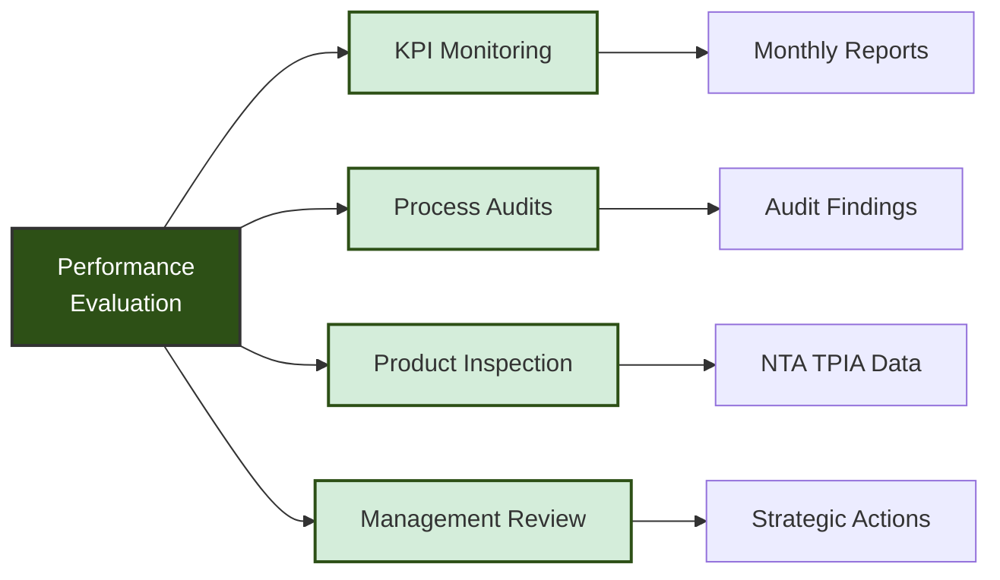

<div class="document-header" style="background: linear-gradient(135deg, #101810 0%, #2D5016 100%); color: white; padding: 40px; text-align: center; border-radius: 8px; margin-bottom: 30px; box-shadow: 0 4px 6px rgba(0,0,0,0.1);">
  <div style="font-size: 48px; font-weight: bold; letter-spacing: 2px; margin-bottom: 10px;">
    🏗️ FORT HOMES
  </div>
  <div style="font-size: 24px; font-weight: 300; letter-spacing: 1px; margin-bottom: 5px;">
    QUALITY MANAGEMENT SYSTEM
  </div>
  <div style="font-size: 20px; font-weight: bold; margin-top: 20px; padding-top: 20px; border-top: 2px solid rgba(255,255,255,0.3);">
    PERFORMANCE EVALUATION
  </div>
  <div style="font-size: 16px; margin-top: 10px; opacity: 0.9;">
    Grand Junction, Colorado
  </div>
</div>

# QMS-006 PERFORMANCE EVALUATION
## Monitoring, Measurement, Analysis and Evaluation

---

## 📋 DOCUMENT CONTROL

<table style="width:100%;border-collapse:collapse;margin:20px 0;box-shadow:0 2px 4px rgba(0,0,0,0.1);">
  <thead style="background:linear-gradient(135deg,#2D5016 0%,#1a2f0d 100%);color:white;">
    <tr>
      <th style="padding:12px;text-align:left;border:1px solid #ddd;">Attribute</th>
      <th style="padding:12px;text-align:left;border:1px solid #ddd;">Details</th>
    </tr>
  </thead>
  <tbody>
    <tr style="background:#ffffff;">
      <td style="padding:10px;border:1px solid #ddd;"><strong>Document ID</strong></td>
      <td style="padding:10px;border:1px solid #ddd;">QMS-006-PERFORMANCE-EVALUATION</td>
    </tr>
    <tr style="background:#f9f9f9;">
      <td style="padding:10px;border:1px solid #ddd;"><strong>Version</strong></td>
      <td style="padding:10px;border:1px solid #ddd;">1.0</td>
    </tr>
    <tr style="background:#ffffff;">
      <td style="padding:10px;border:1px solid #ddd;"><strong>Effective Date</strong></td>
      <td style="padding:10px;border:1px solid #ddd;">2026-01-15</td>
    </tr>
    <tr style="background:#f9f9f9;">
      <td style="padding:10px;border:1px solid #ddd;"><strong>Process Owner</strong></td>
      <td style="padding:10px;border:1px solid #ddd;">Quality Manager</td>
    </tr>
    <tr style="background:#ffffff;">
      <td style="padding:10px;border:1px solid #ddd;"><strong>Classification</strong></td>
      <td style="padding:10px;border:1px solid #ddd;">
        <span style="background:#4CAF50;color:white;padding:4px 12px;border-radius:12px;font-weight:bold;font-size:12px;">✅ CONTROLLED</span>
      </td>
    </tr>
    <tr style="background:#f9f9f9;">
      <td style="padding:10px;border:1px solid #ddd;"><strong>Review Cycle</strong></td>
      <td style="padding:10px;border:1px solid #ddd;">Semi-Annual</td>
    </tr>
    <tr style="background:#ffffff;">
      <td style="padding:10px;border:1px solid #ddd;"><strong>Next Review Date</strong></td>
      <td style="padding:10px;border:1px solid #ddd;">2026-07-15</td>
    </tr>
  </tbody>
</table>

---

## 📑 TABLE OF CONTENTS

1. [Performance Evaluation Framework](#1-performance-evaluation-framework)
2. [KPI Dashboard and Metrics](#2-kpi-dashboard-and-metrics)
3. [Monitoring and Measurement](#3-monitoring-and-measurement)
4. [Internal Audit Program](#4-internal-audit-program)
5. [Management Review Process](#5-management-review-process)
6. [Data Analysis and Reporting](#6-data-analysis-and-reporting)

---

## 1. PERFORMANCE EVALUATION FRAMEWORK

### 1.1 Evaluation Objectives

<div style="background: #f8f8f8; padding: 20px; border-left: 4px solid #2D5016; margin: 20px 0;">

Fort Homes evaluates performance to:
- **Demonstrate compliance** with HUD Code, CCR 8 CCR 1302-14, and NEC 2023
- **Monitor NTA TPIA inspection performance** and closure rates
- **Track quality** of products and processes
- **Measure customer satisfaction** and delivery performance
- **Identify improvement opportunities** through data analysis
- **Support management decisions** with factual information

</div>

### 1.2 Performance Evaluation Components



---

## 2. KPI DASHBOARD AND METRICS

### 2.1 Key Performance Indicators

<table style="width:100%;border-collapse:collapse;margin:20px 0;box-shadow:0 2px 4px rgba(0,0,0,0.1);">
  <thead style="background:linear-gradient(135deg,#2D5016 0%,#1a2f0d 100%);color:white;">
    <tr>
      <th style="padding:12px;text-align:left;border:1px solid #ddd;width:15%;">KPI Category</th>
      <th style="padding:12px;text-align:left;border:1px solid #ddd;width:25%;">Metric</th>
      <th style="padding:12px;text-align:center;border:1px solid #ddd;width:10%;">Target</th>
      <th style="padding:12px;text-align:center;border:1px solid #ddd;width:12%;">Frequency</th>
      <th style="padding:12px;text-align:left;border:1px solid #ddd;width:18%;">Data Source</th>
      <th style="padding:12px;text-align:left;border:1px solid #ddd;width:20%;">Owner</th>
    </tr>
  </thead>
  <tbody>
    <tr style="background:#E8F5E9;">
      <td colspan="6" style="padding:10px;border:1px solid #ddd;font-weight:bold;">🎯 Quality</td>
    </tr>
    <tr style="background:#ffffff;">
      <td style="padding:10px;border:1px solid #ddd;"></td>
      <td style="padding:10px;border:1px solid #ddd;">NTA TPIA First-Pass Rate</td>
      <td style="padding:10px;border:1px solid #ddd;text-align:center;">≥90%</td>
      <td style="padding:10px;border:1px solid #ddd;text-align:center;">Per Inspection</td>
      <td style="padding:10px;border:1px solid #ddd;">NTA Reports</td>
      <td style="padding:10px;border:1px solid #ddd;">Quality Mgr</td>
    </tr>
    <tr style="background:#f9f9f9;">
      <td style="padding:10px;border:1px solid #ddd;"></td>
      <td style="padding:10px;border:1px solid #ddd;">Internal Inspection Pass Rate</td>
      <td style="padding:10px;border:1px solid #ddd;text-align:center;">≥95%</td>
      <td style="padding:10px;border:1px solid #ddd;text-align:center;">Weekly</td>
      <td style="padding:10px;border:1px solid #ddd;">QC Records</td>
      <td style="padding:10px;border:1px solid #ddd;">Quality Mgr</td>
    </tr>
    <tr style="background:#ffffff;">
      <td style="padding:10px;border:1px solid #ddd;"></td>
      <td style="padding:10px;border:1px solid #ddd;">Rework Rate (% of labor hours)</td>
      <td style="padding:10px;border:1px solid #ddd;text-align:center;">≤5%</td>
      <td style="padding:10px;border:1px solid #ddd;text-align:center;">Weekly</td>
      <td style="padding:10px;border:1px solid #ddd;">Traveler Data</td>
      <td style="padding:10px;border:1px solid #ddd;">Production Mgr</td>
    </tr>
    <tr style="background:#f9f9f9;">
      <td style="padding:10px;border:1px solid #ddd;"></td>
      <td style="padding:10px;border:1px solid #ddd;">NCR Count (per module)</td>
      <td style="padding:10px;border:1px solid #ddd;text-align:center;">≤2</td>
      <td style="padding:10px;border:1px solid #ddd;text-align:center;">Weekly</td>
      <td style="padding:10px;border:1px solid #ddd;">NCR System</td>
      <td style="padding:10px;border:1px solid #ddd;">Quality Mgr</td>
    </tr>
    <tr style="background:#ffffff;">
      <td style="padding:10px;border:1px solid #ddd;"></td>
      <td style="padding:10px;border:1px solid #ddd;">Customer Complaints</td>
      <td style="padding:10px;border:1px solid #ddd;text-align:center;">≤1 per quarter</td>
      <td style="padding:10px;border:1px solid #ddd;text-align:center;">Monthly</td>
      <td style="padding:10px;border:1px solid #ddd;">Customer Service</td>
      <td style="padding:10px;border:1px solid #ddd;">GM</td>
    </tr>
    <tr style="background:#E3F2FD;">
      <td colspan="6" style="padding:10px;border:1px solid #ddd;font-weight:bold;">⚡ Production</td>
    </tr>
    <tr style="background:#ffffff;">
      <td style="padding:10px;border:1px solid #ddd;"></td>
      <td style="padding:10px;border:1px solid #ddd;">On-Time Delivery</td>
      <td style="padding:10px;border:1px solid #ddd;text-align:center;">≥95%</td>
      <td style="padding:10px;border:1px solid #ddd;text-align:center;">Weekly</td>
      <td style="padding:10px;border:1px solid #ddd;">Schedule System</td>
      <td style="padding:10px;border:1px solid #ddd;">Operations Mgr</td>
    </tr>
    <tr style="background:#f9f9f9;">
      <td style="padding:10px;border:1px solid #ddd;"></td>
      <td style="padding:10px;border:1px solid #ddd;">Production Throughput (modules/week)</td>
      <td style="padding:10px;border:1px solid #ddd;text-align:center;">2-4</td>
      <td style="padding:10px;border:1px solid #ddd;text-align:center;">Weekly</td>
      <td style="padding:10px;border:1px solid #ddd;">Production Log</td>
      <td style="padding:10px;border:1px solid #ddd;">Operations Mgr</td>
    </tr>
    <tr style="background:#ffffff;">
      <td style="padding:10px;border:1px solid #ddd;"></td>
      <td style="padding:10px;border:1px solid #ddd;">Schedule Adherence</td>
      <td style="padding:10px;border:1px solid #ddd;text-align:center;">≥90%</td>
      <td style="padding:10px;border:1px solid #ddd;text-align:center;">Daily</td>
      <td style="padding:10px;border:1px solid #ddd;">Planning System</td>
      <td style="padding:10px;border:1px solid #ddd;">Production Mgr</td>
    </tr>
    <tr style="background:#f9f9f9;">
      <td style="padding:10px;border:1px solid #ddd;"></td>
      <td style="padding:10px;border:1px solid #ddd;">NTA Hold Point Closure Time</td>
      <td style="padding:10px;border:1px solid #ddd;text-align:center;">≤24 hrs</td>
      <td style="padding:10px;border:1px solid #ddd;text-align:center;">Per Hold</td>
      <td style="padding:10px;border:1px solid #ddd;">NTA Tracking</td>
      <td style="padding:10px;border:1px solid #ddd;">Quality Mgr</td>
    </tr>
    <tr style="background:#FFF3E0;">
      <td colspan="6" style="padding:10px;border:1px solid #ddd;font-weight:bold;">⚖️ Compliance</td>
    </tr>
    <tr style="background:#ffffff;">
      <td style="padding:10px;border:1px solid #ddd;"></td>
      <td style="padding:10px;border:1px solid #ddd;">HUD Code Compliance Rate</td>
      <td style="padding:10px;border:1px solid #ddd;text-align:center;">100%</td>
      <td style="padding:10px;border:1px solid #ddd;text-align:center;">Per Module</td>
      <td style="padding:10px;border:1px solid #ddd;">NTA Final Report</td>
      <td style="padding:10px;border:1px solid #ddd;">Compliance Officer</td>
    </tr>
    <tr style="background:#f9f9f9;">
      <td style="padding:10px;border:1px solid #ddd;"></td>
      <td style="padding:10px;border:1px solid #ddd;">CCR 8 CCR 1302-14 Compliance</td>
      <td style="padding:10px;border:1px solid #ddd;text-align:center;">100%</td>
      <td style="padding:10px;border:1px solid #ddd;text-align:center;">Per Module</td>
      <td style="padding:10px;border:1px solid #ddd;">CDOH Records</td>
      <td style="padding:10px;border:1px solid #ddd;">Compliance Officer</td>
    </tr>
    <tr style="background:#ffffff;">
      <td style="padding:10px;border:1px solid #ddd;"></td>
      <td style="padding:10px;border:1px solid #ddd;">NEC 2023 Electrical Compliance</td>
      <td style="padding:10px;border:1px solid #ddd;text-align:center;">100%</td>
      <td style="padding:10px;border:1px solid #ddd;text-align:center;">Per Module</td>
      <td style="padding:10px;border:1px solid #ddd;">NTA Electrical Report</td>
      <td style="padding:10px;border:1px solid #ddd;">Electrical Lead</td>
    </tr>
    <tr style="background:#f9f9f9;">
      <td style="padding:10px;border:1px solid #ddd;"></td>
      <td style="padding:10px;border:1px solid #ddd;">Audit Findings (Critical/Major)</td>
      <td style="padding:10px;border:1px solid #ddd;text-align:center;">0</td>
      <td style="padding:10px;border:1px solid #ddd;text-align:center;">Per Audit</td>
      <td style="padding:10px;border:1px solid #ddd;">Audit Reports</td>
      <td style="padding:10px;border:1px solid #ddd;">Quality Mgr</td>
    </tr>
    <tr style="background:#F3E5F5;">
      <td colspan="6" style="padding:10px;border:1px solid #ddd;font-weight:bold;">📦 Supply Chain</td>
    </tr>
    <tr style="background:#ffffff;">
      <td style="padding:10px;border:1px solid #ddd;"></td>
      <td style="padding:10px;border:1px solid #ddd;">Supplier On-Time Delivery</td>
      <td style="padding:10px;border:1px solid #ddd;text-align:center;">≥95%</td>
      <td style="padding:10px;border:1px solid #ddd;text-align:center;">Monthly</td>
      <td style="padding:10px;border:1px solid #ddd;">Receiving Log</td>
      <td style="padding:10px;border:1px solid #ddd;">Procurement Mgr</td>
    </tr>
    <tr style="background:#f9f9f9;">
      <td style="padding:10px;border:1px solid #ddd;"></td>
      <td style="padding:10px;border:1px solid #ddd;">Material Conformance Rate</td>
      <td style="padding:10px;border:1px solid #ddd;text-align:center;">≥98%</td>
      <td style="padding:10px;border:1px solid #ddd;text-align:center;">Monthly</td>
      <td style="padding:10px;border:1px solid #ddd;">Receiving Inspection</td>
      <td style="padding:10px;border:1px solid #ddd;">QC Inspector</td>
    </tr>
    <tr style="background:#ffffff;">
      <td style="padding:10px;border:1px solid #ddd;"></td>
      <td style="padding:10px;border:1px solid #ddd;">Supplier Quality Score</td>
      <td style="padding:10px;border:1px solid #ddd;text-align:center;">≥85/100</td>
      <td style="padding:10px;border:1px solid #ddd;text-align:center;">Quarterly</td>
      <td style="padding:10px;border:1px solid #ddd;">Supplier Evaluation</td>
      <td style="padding:10px;border:1px solid #ddd;">Procurement Mgr</td>
    </tr>
    <tr style="background:#E8F5E9;">
      <td colspan="6" style="padding:10px;border:1px solid #ddd;font-weight:bold;">👥 People</td>
    </tr>
    <tr style="background:#ffffff;">
      <td style="padding:10px;border:1px solid #ddd;"></td>
      <td style="padding:10px;border:1px solid #ddd;">Training Compliance Rate</td>
      <td style="padding:10px;border:1px solid #ddd;text-align:center;">100%</td>
      <td style="padding:10px;border:1px solid #ddd;text-align:center;">Monthly</td>
      <td style="padding:10px;border:1px solid #ddd;">Training Records</td>
      <td style="padding:10px;border:1px solid #ddd;">HR Manager</td>
    </tr>
    <tr style="background:#f9f9f9;">
      <td style="padding:10px;border:1px solid #ddd;"></td>
      <td style="padding:10px;border:1px solid #ddd;">Competency Assessment Pass Rate</td>
      <td style="padding:10px;border:1px solid #ddd;text-align:center;">≥90%</td>
      <td style="padding:10px;border:1px solid #ddd;text-align:center;">Quarterly</td>
      <td style="padding:10px;border:1px solid #ddd;">Competency Tests</td>
      <td style="padding:10px;border:1px solid #ddd;">HR Manager</td>
    </tr>
    <tr style="background:#ffffff;">
      <td style="padding:10px;border:1px solid #ddd;"></td>
      <td style="padding:10px;border:1px solid #ddd;">Safety Incident Rate</td>
      <td style="padding:10px;border:1px solid #ddd;text-align:center;">0</td>
      <td style="padding:10px;border:1px solid #ddd;text-align:center;">Monthly</td>
      <td style="padding:10px;border:1px solid #ddd;">Safety Log</td>
      <td style="padding:10px;border:1px solid #ddd;">Safety Officer</td>
    </tr>
    <tr style="background:#FFF3E0;">
      <td colspan="6" style="padding:10px;border:1px solid #ddd;font-weight:bold;">💰 Financial</td>
    </tr>
    <tr style="background:#ffffff;">
      <td style="padding:10px;border:1px solid #ddd;"></td>
      <td style="padding:10px;border:1px solid #ddd;">Cost of Poor Quality (COPQ)</td>
      <td style="padding:10px;border:1px solid #ddd;text-align:center;">≤3% revenue</td>
      <td style="padding:10px;border:1px solid #ddd;text-align:center;">Monthly</td>
      <td style="padding:10px;border:1px solid #ddd;">Financial System</td>
      <td style="padding:10px;border:1px solid #ddd;">Finance Mgr</td>
    </tr>
    <tr style="background:#f9f9f9;">
      <td style="padding:10px;border:1px solid #ddd;"></td>
      <td style="padding:10px;border:1px solid #ddd;">Warranty Claims Cost</td>
      <td style="padding:10px;border:1px solid #ddd;text-align:center;">≤1% revenue</td>
      <td style="padding:10px;border:1px solid #ddd;text-align:center;">Quarterly</td>
      <td style="padding:10px;border:1px solid #ddd;">Warranty System</td>
      <td style="padding:10px;border:1px solid #ddd;">Finance Mgr</td>
    </tr>
  </tbody>
</table>

### 2.2 KPI Dashboard Template

<div style="background: #f8f8f8; padding: 20px; border: 2px solid #333; border-radius: 8px; margin: 20px 0;">

#### 📊 MONTHLY KPI DASHBOARD - [Month Year]

**Quality Performance**
```
NTA TPIA First-Pass Rate:  [██████████████░░░░] 85% 🔴 Below Target (90%)
Internal Pass Rate:        [████████████████░░] 95% ✅ On Target
Rework Rate:               [███░░░░░░░░░░░░░░░] 3% ✅ Below Target (<5%)
NCR Count:                 1.5 per module ✅ Below Target (<2)
```

**Production Performance**
```
On-Time Delivery:          [███████████████░░░] 92% 🟡 Near Target (95%)
Throughput:                3.2 modules/week ✅ Within Range (2-4)
Schedule Adherence:        [██████████████████] 94% ✅ On Target
Hold Point Closure:        18 hours avg ✅ Below Target (<24h)
```

**Compliance Status**
```
HUD Code Compliance:       [████████████████████] 100% ✅ Perfect
CCR Compliance:            [████████████████████] 100% ✅ Perfect
NEC 2023 Compliance:       [████████████████████] 100% ✅ Perfect
```

**🔴 Critical Action Items:**
- Improve NTA TPIA first-pass rate from 85% to 90% target
- Address root causes of NTA inspection failures

</div>

---

## 3. MONITORING AND MEASUREMENT

### 3.1 Process Monitoring

<div style="background: white; padding: 20px; border: 2px solid #ddd; border-radius: 8px; margin: 20px 0;">

| Process | Monitoring Method | Frequency | Acceptance Criteria |
|:---|:---|:---|:---|
| **Material Receiving** | Receiving inspection per SOP-012 | Each delivery | 100% conforming materials |
| **Production Stations** | Workstation inspections | Per module | Per work instruction specs |
| **NTA TPIA Hold Points** | Third-party inspection | Per hold point | NTA approval required |
| **Electrical Installation** | NEC 2023 compliance check | Per electrical rough-in | 100% NEC compliant |
| **Final Inspection** | Quality final walkthrough | Per module | Zero defects target |

</div>

### 3.2 Product Measurement

All modules undergo measurement and verification:
- **Dimensional accuracy** - Floor plan dimensions, ceiling heights
- **Structural integrity** - Per HUD Code 24 CFR 3280 Subpart D
- **Electrical systems** - NEC 2023 compliance verification
- **Plumbing systems** - Pressure testing, fixture operation
- **HVAC performance** - Airflow, temperature control
- **Finish quality** - Visual inspection, workmanship standards

### 3.3 Customer Satisfaction Monitoring

<div style="background: #E7F3FF; padding: 20px; border-left: 4px solid #145B8B; margin: 20px 0;">

#### 📋 Customer Satisfaction Survey

**Surveyed After:**
- Module delivery and installation
- 30-day post-occupancy
- 12-month warranty review

**Key Satisfaction Areas:**
- Quality of construction
- On-time delivery
- Communication and responsiveness
- Installation process (if FHD)
- Resolution of issues
- Overall satisfaction

**Target:** ≥4.5/5.0 average rating

</div>

---

## 4. INTERNAL AUDIT PROGRAM

### 4.1 Audit Objectives

Internal audits per [SOP-003](../sops/SOP-003-Internal-Audits.md) evaluate:
- Conformity to QMS requirements
- Effectiveness of processes
- Compliance with HUD Code, CCR, and NEC 2023
- NTA TPIA coordination effectiveness
- Corrective action effectiveness

### 4.2 Audit Schedule

<div style="background: white; padding: 20px; border: 2px solid #ddd; border-radius: 8px; margin: 20px 0;">

| Audit Area | Frequency | Typical Month | Lead Auditor |
|:---|:---|:---|:---|
| **Document Control** | Annual | February | Quality Manager |
| **Training & Competency** | Annual | March | HR Manager |
| **Production Processes** | Semi-Annual | April, October | Operations Manager |
| **NTA TPIA Coordination** | Semi-Annual | May, November | Quality Manager |
| **Regulatory Compliance (HUD/CCR/NEC)** | Annual | June | Compliance Officer |
| **Supplier Management** | Annual | July | Procurement Manager |
| **Nonconformance & CAPA** | Annual | August | Quality Manager |
| **Equipment Calibration** | Annual | September | Maintenance Manager |
| **Management System Review** | Annual | December | Quality Manager |

</div>

### 4.3 Audit Process

```
┌─────────────────────────────────────────────────────────────────┐
│  INTERNAL AUDIT PROCESS FLOW                                    │
├─────────────────────────────────────────────────────────────────┤
│                                                                 │
│  1️⃣ PLAN AUDIT                                                 │
│     • Schedule and notify auditee                               │
│     • Prepare audit checklist                                   │
│     • Review previous audit findings                            │
│                                                                 │
│  2️⃣ CONDUCT AUDIT                                              │
│     • Opening meeting                                           │
│     • Document/record review                                    │
│     • Interviews and observations                               │
│     • Evidence collection                                       │
│                                                                 │
│  3️⃣ REPORT FINDINGS                                            │
│     • Closing meeting                                           │
│     • Audit report preparation                                  │
│     • Finding classification:                                   │
│       🔴 Critical - Immediate action required                   │
│       🟡 Major - Corrective action required                     │
│       🟢 Minor - Opportunity for improvement                    │
│       ✅ Observation - Positive practice                        │
│                                                                 │
│  4️⃣ CORRECTIVE ACTIONS                                         │
│     • CAPA initiation (if needed)                               │
│     • Root cause analysis                                       │
│     • Action implementation                                     │
│                                                                 │
│  5️⃣ FOLLOW-UP                                                  │
│     • Verify action effectiveness                               │
│     • Close audit findings                                      │
│     • Update audit program                                      │
│                                                                 │
└─────────────────────────────────────────────────────────────────┘
```

### 4.4 Audit Finding Management

All audit findings are tracked in the CAPA system per [SOP-004](../sops/SOP-004-Nonconformance-CAPA.md).

---

## 5. MANAGEMENT REVIEW PROCESS

### 5.1 Management Review Objectives

Management review per [SOP-006](../sops/SOP-006-Management-Review.md) ensures the QMS remains:
- **Suitable** - Appropriate for Fort Homes operations
- **Adequate** - Sufficient to meet requirements
- **Effective** - Achieving intended results
- **Aligned** - Supporting strategic direction

### 5.2 Management Review Schedule

<div style="background: #FFF3CD; padding: 20px; border-left: 4px solid #8B6914; margin: 20px 0;">

#### 📅 Management Review Calendar

**Quarterly Reviews** (2-3 hours)
- Q1 (January): Performance review and planning
- Q2 (April): Mid-year assessment
- Q3 (July): Strategy adjustment
- Q4 (October): Annual performance and budget planning

**Annual Strategic Review** (Full day, December)
- Comprehensive QMS evaluation
- Strategic goal setting for next year
- Resource allocation decisions

</div>

### 5.3 Management Review Inputs

<div style="background: white; padding: 20px; border: 2px solid #ddd; border-radius: 8px; margin: 20px 0;">

| Input Category | Information Source | Presenter |
|:---|:---|:---|
| **Previous Actions** | Previous review minutes, action tracker | Quality Manager |
| **Changes (External)** | Market conditions, regulations, technology | General Manager |
| **Changes (Internal)** | Organizational changes, capacity | Operations Manager |
| **Performance** | KPI dashboard, metrics analysis | Quality Manager |
| **Customer Feedback** | Complaints, satisfaction surveys | Customer Service |
| **Process Performance** | Production efficiency, quality data | Operations Manager |
| **Nonconformities & CAPA** | NCR trends, CAPA effectiveness | Quality Manager |
| **Audit Results** | Internal/external audit findings | Quality Manager |
| **NTA TPIA Performance** | Inspection results, hold point metrics | Quality Manager |
| **Supplier Performance** | Supplier scorecards, issues | Procurement Manager |
| **Resource Needs** | Personnel, equipment, training | HR Manager |
| **Improvement Opportunities** | Identified improvements, ROI analysis | Quality Manager |
| **Risk Register** | Risk assessment updates | Quality Manager |

</div>

### 5.4 Management Review Outputs

Management review results in:
- **Improvement decisions** - Actions to enhance QMS effectiveness
- **Resource decisions** - Allocation of personnel, equipment, budget
- **Change decisions** - Modifications to QMS, processes, objectives

All decisions are documented with assigned ownership and target dates.

---

## 6. DATA ANALYSIS AND REPORTING

### 6.1 Data Collection and Analysis

Fort Homes collects and analyzes data to identify:
- Quality trends and patterns
- Root causes of problems
- Improvement opportunities
- Compliance status
- Customer satisfaction trends

### 6.2 Reporting Structure

<div style="background: white; padding: 20px; border: 2px solid #ddd; border-radius: 8px; margin: 20px 0;">

| Report | Frequency | Recipients | Content |
|:---|:---|:---|:---|
| **Daily Production Report** | Daily | Operations team, Management | Production status, issues, hold points |
| **Weekly Quality Report** | Weekly | Quality team, Management | NCRs, NTA inspections, rework |
| **Monthly KPI Dashboard** | Monthly | All managers, Executives | All KPIs, trends, commentary |
| **Quarterly Performance Review** | Quarterly | Management team | Comprehensive analysis, strategic insights |
| **Annual QMS Report** | Annual | Executive leadership | Full year performance, achievements, plans |

</div>

### 6.3 Performance Trends

<div style="background: #f8f8f8; padding: 20px; border: 2px solid #333; border-radius: 8px; margin: 20px 0;">

#### 📈 Trend Analysis Example

**NTA TPIA First-Pass Rate (6-Month Trend)**
```
Month      Rate    Trend
────────────────────────────────────────
Jul 2025   82%    ▬▬▬▬▬▬▬▬░░ 🔴
Aug 2025   85%    ▬▬▬▬▬▬▬▬▬░ 🔴
Sep 2025   88%    ▬▬▬▬▬▬▬▬▬▬ 🟡
Oct 2025   91%    ▬▬▬▬▬▬▬▬▬▬ ✅
Nov 2025   93%    ▬▬▬▬▬▬▬▬▬▬ ✅
Dec 2025   92%    ▬▬▬▬▬▬▬▬▬▬ ✅

📊 Trend: Improving ↗️
🎯 Target: 90% (Achieved)
✅ Action: Sustain improvements through continued training
```

</div>

---

## 🔄 REVISION HISTORY

| Version | Date | Description | Author | Approved By |
|:---|:---|:---|:---|:---|
| 1.0 | 2026-01-15 | Initial creation of Performance Evaluation document | Quality Manager | Executive Leadership |

---

## ✅ APPROVAL SIGNATURES

| Role | Name | Signature | Date |
|:---|:---|:---|:---|
| **Prepared By** | Quality Manager | _________________ | 2026-01-15 |
| **Reviewed By** | Operations Manager | _________________ | 2026-01-15 |
| **Approved By** | General Manager | _________________ | 2026-01-15 |

---

**Document Classification:** CONTROLLED  
**Distribution:** Management Team  
**Next Review Date:** 2026-07-15

---

*This document is part of the Fort Homes LLC Quality Management System. Unauthorized distribution is prohibited.*
