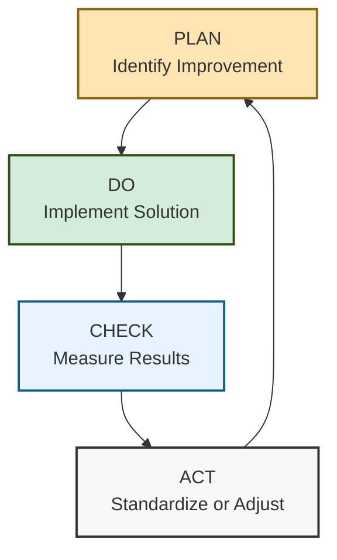

<div class="document-header" style="background: linear-gradient(135deg, #101810 0%, #2D5016 100%); color: white; padding: 40px; text-align: center; border-radius: 8px; margin-bottom: 30px; box-shadow: 0 4px 6px rgba(0,0,0,0.1);">
  <div style="font-size: 48px; font-weight: bold; letter-spacing: 2px; margin-bottom: 10px;">
    🏗️ FORT HOMES
  </div>
  <div style="font-size: 24px; font-weight: 300; letter-spacing: 1px; margin-bottom: 5px;">
    QUALITY MANAGEMENT SYSTEM
  </div>
  <div style="font-size: 20px; font-weight: bold; margin-top: 20px; padding-top: 20px; border-top: 2px solid rgba(255,255,255,0.3);">
    IMPROVEMENT & CAPA
  </div>
  <div style="font-size: 16px; margin-top: 10px; opacity: 0.9;">
    Grand Junction, Colorado
  </div>
</div>

# QMS-007 IMPROVEMENT
## Continual Improvement and Corrective/Preventive Action

---

## 📋 DOCUMENT CONTROL

| **Attribute** | **Details** |
|:---|:---|
| **Document ID** | QMS-007-IMPROVEMENT |
| **Version** | 1.0 |
| **Effective Date** | 2026-01-15 |
| **Process Owner** | Quality Manager |
| **Classification** | CONTROLLED |
| **Review Cycle** | Annual |
| **Next Review Date** | 2027-01-15 |

---

## 📑 TABLE OF CONTENTS

1. [Continual Improvement Framework](#1-continual-improvement-framework)
2. [Nonconformity and CAPA Process](#2-nonconformity-and-capa-process)
3. [Root Cause Analysis Methods](#3-root-cause-analysis-methods)
4. [Improvement Register](#4-improvement-register)
5. [Lessons Learned Database](#5-lessons-learned-database)

---

## 1. CONTINUAL IMPROVEMENT FRAMEWORK

### 1.1 Improvement Philosophy

<div style="background: #f8f8f8; padding: 20px; border-left: 4px solid #2D5016; margin: 20px 0;">

Fort Homes is committed to continual improvement of:
- **Product quality** - Enhancing manufactured home quality
- **Process efficiency** - Reducing waste, improving flow
- **Regulatory compliance** - Exceeding HUD Code, CCR, NEC requirements
- **NTA TPIA performance** - Improving first-pass inspection rates
- **Customer satisfaction** - Delivering exceptional value
- **Safety** - Eliminating hazards and risks

</div>

### 1.2 Improvement Cycle (PDCA)



---

## 2. NONCONFORMITY AND CAPA PROCESS

### 2.1 Nonconformity Management

All nonconformities are managed per [SOP-004](../sops/SOP-004-Nonconformance-CAPA.md).

<div style="background: #F8D7DA; padding: 20px; border-left: 4px solid #8B1414; margin: 20px 0;">

#### ⚠️ Nonconformity Sources

- NTA TPIA inspection failures
- Internal quality inspections
- Customer complaints
- Audit findings
- Process deviations
- Material defects
- Workmanship issues

</div>

### 2.2 CAPA Process Flow

```
┌─────────────────────────────────────────────────────────────────┐
│  CAPA PROCESS                                                   │
├─────────────────────────────────────────────────────────────────┤
│                                                                 │
│  1️⃣ IDENTIFY NONCONFORMITY                                     │
│     • Document issue in NCR                                     │
│     • Classify severity (Critical/Major/Minor)                  │
│     • Assign NCR owner                                          │
│                                                                 │
│  2️⃣ IMMEDIATE CONTAINMENT                                      │
│     • Segregate nonconforming product                           │
│     • Apply HOLD tag                                            │
│     • Prevent further processing                                │
│                                                                 │
│  3️⃣ DISPOSITION                                                │
│     • Determine disposition (rework/repair/scrap/concession)    │
│     • Obtain NTA TPIA approval if HUD Code affected             │
│     • Execute disposition                                       │
│                                                                 │
│  4️⃣ ROOT CAUSE ANALYSIS                                        │
│     • Apply 5-Why method                                        │
│     • Use Fishbone diagram for complex issues                   │
│     • Identify contributing factors                             │
│                                                                 │
│  5️⃣ CORRECTIVE ACTION                                          │
│     • Develop corrective action plan                            │
│     • Address root cause                                        │
│     • Assign owner and due date                                 │
│     • Implement actions                                         │
│                                                                 │
│  6️⃣ PREVENTIVE ACTION                                          │
│     • Assess similar processes for same risk                    │
│     • Implement preventive measures                             │
│     • Update procedures/work instructions                       │
│                                                                 │
│  7️⃣ EFFECTIVENESS VERIFICATION                                 │
│     • Monitor for recurrence                                    │
│     • Verify action effectiveness                               │
│     • Close CAPA when effective                                 │
│                                                                 │
└─────────────────────────────────────────────────────────────────┘
```

### 2.3 CAPA Tracking Metrics

<div style="background: white; padding: 20px; border: 2px solid #ddd; border-radius: 8px; margin: 20px 0;">

| Metric | Target | Measurement | Purpose |
|:---|:---|:---|:---|
| **CAPA Closure Rate** | 100% on time | Monthly | Track completion |
| **Recurrence Rate** | <5% | Per CAPA | Measure effectiveness |
| **Average Closure Time** | <30 days | Per CAPA | Monitor responsiveness |
| **Overdue CAPAs** | 0 | Weekly | Escalation trigger |

</div>

---

## 3. ROOT CAUSE ANALYSIS METHODS

### 3.1 5-Why Method

<div style="background: #E7F3FF; padding: 20px; border-left: 4px solid #145B8B; margin: 20px 0;">

#### 🔍 5-Why Template

**Problem Statement:** [Describe the nonconformity]

**Why 1:** Why did the problem occur?  
→ Answer:

**Why 2:** Why did that happen?  
→ Answer:

**Why 3:** Why did that happen?  
→ Answer:

**Why 4:** Why did that happen?  
→ Answer:

**Why 5:** Why did that happen?  
→ Answer: **[ROOT CAUSE]**

**Corrective Action:** [Action to address root cause]

</div>

### 3.2 Fishbone (Ishikawa) Diagram

For complex nonconformities affecting HUD Code compliance or NTA TPIA inspections:

```
┌─────────────────────────────────────────────────────────────────┐
│  FISHBONE DIAGRAM TEMPLATE                                      │
├─────────────────────────────────────────────────────────────────┤
│                                                                 │
│  PEOPLE            METHODS                                      │
│    │                 │                                          │
│    │                 │                                          │
│    └─────────────────┴──────────────────► PROBLEM              │
│    ┌─────────────────┬──────────────────►                      │
│    │                 │                                          │
│    │                 │                                          │
│  MATERIALS       EQUIPMENT                                      │
│                                                                 │
│  Categories:                                                    │
│  • People - Training, competency, communication                 │
│  • Methods - Procedures, work instructions, processes           │
│  • Materials - Supplier quality, specifications, storage        │
│  • Equipment - Calibration, maintenance, capability             │
│  • Environment - Temperature, humidity, workspace               │
│  • Measurement - Inspection methods, tools, criteria            │
│                                                                 │
└─────────────────────────────────────────────────────────────────┘
```

### 3.3 Root Cause Verification

All identified root causes must be:
✅ Verified through data/evidence
✅ Specific and actionable
✅ Within Fort Homes control
✅ Addressing the true cause (not symptoms)

---

## 4. IMPROVEMENT REGISTER

### 4.1 Improvement Opportunity Sources

<div style="background: white; padding: 20px; border: 2px solid #ddd; border-radius: 8px; margin: 20px 0;">

| Source | Examples | Collection Method |
|:---|:---|:---|
| **Employee Suggestions** | Process improvements, tool ideas | Suggestion box, team meetings |
| **Audit Findings** | Opportunities for improvement | Audit reports |
| **Management Review** | Strategic improvements | Management decisions |
| **Customer Feedback** | Product/service enhancements | Surveys, complaints |
| **Benchmarking** | Industry best practices | Research, site visits |
| **Data Analysis** | Trend analysis, patterns | KPI reviews, reports |
| **NTA TPIA Feedback** | Inspection process improvements | NTA coordinator meetings |

</div>

### 4.2 Improvement Register Template

<div style="background: #f8f8f8; padding: 20px; border: 2px solid #333; border-radius: 8px; margin: 20px 0;">

#### 📋 IMPROVEMENT REGISTER

| ID | Title | Category | Priority | Status | Owner | Target Date | ROI Estimate |
|:---|:---|:---|:---|:---|:---|:---|:---|
| IMP-001 | Improve NTA hold point turnaround | Quality | 🔴 High | In Progress | Quality Mgr | 2026-03-01 | Medium |
| IMP-002 | Automate material receiving inspection | Efficiency | 🟡 Medium | Planning | Procurement | 2026-06-01 | High |
| IMP-003 | Enhance employee training program | People | 🟡 Medium | Open | HR Mgr | 2026-04-15 | Medium |
| IMP-004 | Implement digital traveler system | Technology | 🔴 High | In Progress | IT/Operations | 2026-05-01 | High |

**Priority Levels:**
- 🔴 High - Significant impact on quality, compliance, or efficiency
- 🟡 Medium - Moderate improvement potential
- 🟢 Low - Nice-to-have enhancement

</div>

### 4.3 Improvement Evaluation Criteria

All improvement opportunities evaluated on:
- **Impact** - Effect on quality, efficiency, compliance
- **Feasibility** - Technical and resource requirements
- **Cost** - Implementation investment
- **ROI** - Return on investment timeline
- **Risk** - Potential downsides or complications

---

## 5. LESSONS LEARNED DATABASE

### 5.1 Lessons Learned Capture

Fort Homes captures lessons learned from:
- Completed CAPAs
- Project post-mortems
- Audit findings
- NTA TPIA inspection patterns
- Customer complaints and feedback
- Near-miss incidents

### 5.2 Lessons Learned Template

<div style="background: #FFF3CD; padding: 20px; border-left: 4px solid #8B6914; margin: 20px 0;">

#### 📚 LESSON LEARNED TEMPLATE

**LL-ID:** [Unique identifier]  
**Date:** [Date captured]  
**Category:** [Quality/Production/Compliance/Safety/Other]

**Situation:**  
[Brief description of what happened]

**Root Cause:**  
[Why it happened]

**Impact:**  
[What was the effect - time, cost, quality]

**Action Taken:**  
[How it was resolved]

**Lesson:**  
[Key takeaway - what should be done differently]

**Application:**  
[Where else this lesson applies]

**Shared With:**  
[Teams/individuals who need to know]

**Status:** [Active / Archived]

</div>

### 5.3 Lessons Learned Examples

<div style="background: white; padding: 20px; border: 2px solid #ddd; border-radius: 8px; margin: 20px 0;">

| LL-ID | Category | Lesson | Application |
|:---|:---|:---|:---|
| LL-001 | NTA TPIA | Schedule NTA inspector 48hrs in advance for hold points to avoid delays | Production planning |
| LL-002 | NEC 2023 | Double-check AFCI breaker installation before drywall to prevent rework | Electrical rough-in |
| LL-003 | Material | Verify lumber moisture content at receiving to prevent warping issues | Material receiving |
| LL-004 | CCR Compliance | Include CDOH notification in pre-shipment checklist | Compliance process |

</div>

---

## 6. IMPROVEMENT METHODOLOGY

### 6.1 Kaizen (Continuous Small Improvements)

Fort Homes encourages small, incremental improvements:
- Daily problem-solving at team level
- Quick wins that don't require capital investment
- Employee-driven improvements
- Focus on eliminating waste (time, materials, effort)

### 6.2 Breakthrough Improvements

For significant improvements:
- Project-based approach with dedicated resources
- Cross-functional teams
- Formal project management
- ROI analysis and approval process

---

## 🔄 REVISION HISTORY

| Version | Date | Description | Author | Approved By |
|:---|:---|:---|:---|:---|
| 1.0 | 2026-01-15 | Initial creation of Improvement document | Quality Manager | Executive Leadership |

---

## ✅ APPROVAL SIGNATURES

| Role | Name | Signature | Date |
|:---|:---|:---|:---|
| **Prepared By** | Quality Manager | _________________ | 2026-01-15 |
| **Reviewed By** | Operations Manager | _________________ | 2026-01-15 |
| **Approved By** | General Manager | _________________ | 2026-01-15 |

---

**Document Classification:** CONTROLLED  
**Distribution:** All Fort Homes LLC Personnel  
**Next Review Date:** 2027-01-15

---

*This document is part of the Fort Homes LLC Quality Management System. Unauthorized distribution is prohibited.*
