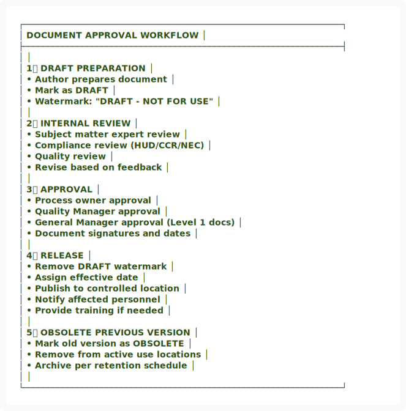

<div class="document-header" style="background: linear-gradient(135deg, #101810 0%, #2D5016 100%); color: white; padding: 40px; text-align: center; border-radius: 8px; margin-bottom: 30px; box-shadow: 0 4px 6px rgba(0,0,0,0.1);">
  <div style="font-size: 48px; font-weight: bold; letter-spacing: 2px; margin-bottom: 10px;">
    🏗️ FORT HOMES
  </div>
  <div style="font-size: 24px; font-weight: 300; letter-spacing: 1px; margin-bottom: 5px;">
    QUALITY MANAGEMENT SYSTEM
  </div>
  <div style="font-size: 20px; font-weight: bold; margin-top: 20px; padding-top: 20px; border-top: 2px solid rgba(255,255,255,0.3);">
    DOCUMENT & RECORDS CONTROL
  </div>
  <div style="font-size: 16px; margin-top: 10px; opacity: 0.9;">
    Grand Junction, Colorado
  </div>
</div>

# QMS-008 DOCUMENT & RECORDS
## Document Control and Records Management Policy

---

## 📋 DOCUMENT CONTROL

| **Attribute** | **Details** |
|:---|:---|
| **Document ID** | QMS-008-DOCUMENT-RECORDS |
| **Version** | 1.0 |
| **Effective Date** | 2026-01-15 |
| **Process Owner** | Document Controller |
| **Classification** | CONTROLLED |
| **Review Cycle** | Annual |
| **Next Review Date** | 2027-01-15 |

---

## 📑 TABLE OF CONTENTS

1. [Document Control Policy](#1-document-control-policy)
2. [Document Naming Conventions](#2-document-naming-conventions)
3. [Approval Workflows](#3-approval-workflows)
4. [Records Management](#4-records-management)
5. [Record Retention Schedule](#5-record-retention-schedule)

---

## 1. DOCUMENT CONTROL POLICY

### 1.1 Policy Statement

Fort Homes maintains a controlled documentation system to ensure:
- Only current, approved documents are in use
- Documents are available where needed
- Changes are controlled and traceable
- Obsolete documents are prevented from use
- Compliance with HUD Code, CCR, and NEC requirements

Full document control procedures are defined in [SOP-001](../sops/SOP-001-Document-Control-Records-Management-V2.md).

### 1.2 Document Types

<div style="background: white; padding: 20px; border: 2px solid #ddd; border-radius: 8px; margin: 20px 0;">

| Document Level | Document Type | Prefix | Control Level | Examples |
|:---|:---|:---|:---|:---|
| **Level 1** | Quality Manual | QMS- | CONTROLLED | QMS-001, QMS-002, QMS-003 |
| **Level 2** | Standard Operating Procedures | SOP- | CONTROLLED | SOP-001, SOP-011, SOP-102 |
| **Level 3** | Work Instructions | WI- | CONTROLLED | WI-F-001, WI-W-002, WI-E-001 |
| **Level 4** | Forms & Templates | FORM- | CONTROLLED | FORM-001, FORM-INSPECTION-001 |
| **Level 4** | Records | Various | RETAINED | NCR-2026-001, TRAVELER-12345 |
| **Reference** | External Documents | REF- | REFERENCE ONLY | HUD Code, NEC 2023, CCR |

</div>

### 1.3 Document Control Metadata

All controlled documents must include:

<div style="background: #f8f8f8; padding: 20px; border-left: 4px solid #2D5016; margin: 20px 0;">

✅ **Document ID** - Unique identifier  
✅ **Version/Revision** - Current revision number  
✅ **Effective Date** - When document becomes active  
✅ **Process Owner** - Responsible authority  
✅ **Classification** - CONTROLLED / UNCONTROLLED / REFERENCE  
✅ **Review Cycle** - How often reviewed  
✅ **Next Review Date** - Scheduled review date  
✅ **Revision History** - Change log with dates and descriptions  
✅ **Approval Signatures** - Prepared, reviewed, approved by

</div>

---

## 2. DOCUMENT NAMING CONVENTIONS

### 2.1 Naming Structure

**Format:** `[PREFIX]-[NUMBER]-[TITLE]-[VERSION].extension`

**Examples:**
- `QMS-001-Context-Stakeholders.md`
- `SOP-011-Production-Planning-Scheduling.md`
- `WI-F-001-Floor-System-Assembly-v2.pdf`
- `FORM-INSPECTION-WALL-FRAMING.xlsx`

### 2.2 Prefix Definitions

<div style="background: white; padding: 20px; border: 2px solid #ddd; border-radius: 8px; margin: 20px 0;">

| Prefix | Document Type | Numbering | Owner |
|:---|:---|:---|:---|
| **QMS-** | Quality Manual Sections | 000-999 | Quality Manager |
| **SOP-** | Standard Operating Procedures | 001-999 | Process Owner |
| **WI-** | Work Instructions | Station-### | Operations |
| **FORM-** | Forms and Templates | Sequential | Document Controller |
| **NCR-** | Nonconformance Reports | YYYY-### | Quality Manager |
| **CAPA-** | Corrective/Preventive Actions | YYYY-### | Quality Manager |
| **AUDIT-** | Audit Reports | YYYY-### | Quality Manager |
| **TRAIN-** | Training Records | EMP-### | HR Manager |

</div>

### 2.3 Version Control

- **Major revisions** (1.0, 2.0, 3.0) - Significant changes requiring re-approval
- **Minor revisions** (1.1, 1.2, 1.3) - Editorial changes, clarifications
- **Draft versions** (1.0-DRAFT) - Under development, not approved

---

## 3. APPROVAL WORKFLOWS

### 3.1 Document Approval Process


<div align="center">
  
</div>

<details>
<summary>View ASCII Source</summary>

```
┌─────────────────────────────────────────────────────────────────┐
│  DOCUMENT APPROVAL WORKFLOW                                     │
├─────────────────────────────────────────────────────────────────┤
│                                                                 │
│  1️⃣ DRAFT PREPARATION                                          │
│     • Author prepares document                                  │
│     • Mark as DRAFT                                             │
│     • Watermark: "DRAFT - NOT FOR USE"                          │
│                                                                 │
│  2️⃣ INTERNAL REVIEW                                            │
│     • Subject matter expert review                              │
│     • Compliance review (HUD/CCR/NEC)                           │
│     • Quality review                                            │
│     • Revise based on feedback                                  │
│                                                                 │
│  3️⃣ APPROVAL                                                   │
│     • Process owner approval                                    │
│     • Quality Manager approval                                  │
│     • General Manager approval (Level 1 docs)                   │
│     • Document signatures and dates                             │
│                                                                 │
│  4️⃣ RELEASE                                                    │
│     • Remove DRAFT watermark                                    │
│     • Assign effective date                                     │
│     • Publish to controlled location                            │
│     • Notify affected personnel                                 │
│     • Provide training if needed                                │
│                                                                 │
│  5️⃣ OBSOLETE PREVIOUS VERSION                                  │
│     • Mark old version as OBSOLETE                              │
│     • Remove from active use locations                          │
│     • Archive per retention schedule                            │
│                                                                 │
└─────────────────────────────────────────────────────────────────┘
```
</details>


### 3.2 Change Control

All document changes must:
- Be requested through change request form
- Include justification for change
- Undergo same approval as original
- Be communicated to affected users
- Include training if significant

---

## 4. RECORDS MANAGEMENT

### 4.1 Record Requirements

Records provide evidence of:
- **Conformity** to HUD Code, CCR 8 CCR 1302-14, NEC 2023
- **QMS effectiveness** - Process performance
- **Product quality** - Inspection results, NTA TPIA reports
- **Competency** - Training and qualification records
- **Traceability** - Material lots, production sequence
- **Compliance** - Regulatory submissions, approvals

### 4.2 Record Characteristics

All quality records must be:

<div style="background: #E7F3FF; padding: 20px; border-left: 4px solid #145B8B; margin: 20px 0;">

✅ **Legible** - Clear, readable, scannable  
✅ **Identifiable** - Linked to specific product/process  
✅ **Retrievable** - Organized system for access  
✅ **Protected** - From loss, damage, deterioration  
✅ **Retained** - Per retention schedule  
✅ **Traceable** - Connected to relevant activities/products

</div>

### 4.3 Record Storage

- **Physical records** - Locked filing cabinets, climate-controlled
- **Electronic records** - Secure server with backup, access controls
- **Offsite backup** - Cloud storage with encryption
- **Access control** - Role-based permissions

---

## 5. RECORD RETENTION SCHEDULE

### 5.1 Retention Requirements

<div style="background: white; padding: 20px; border: 2px solid #ddd; border-radius: 8px; margin: 20px 0;">

| Record Type | Retention Period | Storage Location | Disposal Method | Regulatory Basis |
|:---|:---|:---|:---|:---|
| **🏠 Product Records** | | | | |
| Module Traveler (complete) | 20 years | Electronic archive | Secure deletion | HUD Code requirement |
| NTA TPIA Inspection Reports | 20 years | Electronic archive | Secure deletion | HUD Code/CDOH |
| HUD Data Plate Records | Permanent | Electronic archive | N/A | HUD Code 24 CFR 3280 |
| Design/Engineering Records | Life of design + 10 years | Electronic archive | Secure deletion | HUD Code |
| Material Certifications | 10 years | Electronic archive | Secure deletion | HUD Code traceability |
| **✅ Quality Records** | | | | |
| NCRs and CAPAs | 7 years | Electronic QMS | Secure deletion | Best practice |
| Internal Audit Reports | 7 years | Electronic QMS | Secure deletion | Best practice |
| Management Review Records | 7 years | Electronic QMS | Secure deletion | Best practice |
| Calibration Records | Life of equipment + 2 years | Maintenance system | Secure deletion | Equipment traceability |
| **⚖️ Compliance Records** | | | | |
| CDOH Submittals/Approvals | Permanent | Electronic archive | N/A | CCR 8 CCR 1302-14 |
| Regulatory Correspondence | 10 years | Electronic archive | Secure deletion | Legal requirement |
| Recall/Field Action Records | Permanent | Electronic archive | N/A | HUD Code 24 CFR 3282 |
| **👥 Personnel Records** | | | | |
| Training Records | 5 years post-employment | HR system | Confidential shred | Labor law |
| Competency Assessments | 5 years post-employment | HR system | Confidential shred | Labor law |
| Safety Training | 5 years post-employment | HR system | Confidential shred | OSHA |
| **💰 Financial Records** | | | | |
| Warranty Claims | 7 years | Financial system | Secure deletion | Tax/accounting |
| Supplier Invoices | 7 years | Financial system | Secure deletion | Tax/accounting |
| **📦 Supply Chain** | | | | |
| Supplier Evaluations | 5 years | Procurement system | Secure deletion | Best practice |
| Purchase Orders | 7 years | Procurement system | Secure deletion | Accounting |
| Material Test Reports | 10 years | Electronic archive | Secure deletion | Material traceability |

</div>

### 5.2 Retention Period Triggers

Retention periods begin from:
- **Product records** - Date of manufacture/shipment
- **Quality records** - Date of creation or activity
- **Personnel records** - Date of termination
- **Financial records** - End of fiscal year

### 5.3 Record Disposal

At end of retention period:
- Review for continued value
- Obtain disposal authorization
- Document disposal (date, method, authorizer)
- Use secure methods:
  - **Paper** - Confidential shredding
  - **Electronic** - Secure deletion with verification
  - **Media** - Physical destruction

---

## 6. EXTERNAL DOCUMENTS

### 6.1 Reference Documents

Fort Homes maintains current copies of:

<div style="background: #FFF3CD; padding: 20px; border-left: 4px solid #8B6914; margin: 20px 0;">

#### 📚 External Reference Library

**Federal Regulations:**
- 24 CFR Part 3280 - Manufactured Home Construction and Safety Standards (HUD Code)
- 24 CFR Part 3282 - Manufactured Home Procedural and Enforcement Regulations
- 24 CFR Part 3285 - Model Manufactured Home Installation Standards

**National Codes:**
- NEC 2023 - National Electrical Code
- IRC 2021 - International Residential Code
- IPC 2021 - International Plumbing Code
- IECC 2021 - International Energy Conservation Code

**State Regulations:**
- CCR 8 CCR 1302-14 - Colorado Manufactured Housing Regulations

**Industry Standards:**
- NTA Third-Party Inspection Agency standards and procedures
- ANSI standards (as applicable)

</div>

### 6.2 External Document Control

- Maintained in reference library (electronic and physical)
- Reviewed for currency (annually)
- Updated when new versions released
- Changes communicated to affected personnel

---

## 🔄 REVISION HISTORY

| Version | Date | Description | Author | Approved By |
|:---|:---|:---|:---|:---|
| 1.0 | 2026-01-15 | Initial creation of Document & Records document | Document Controller | Executive Leadership |

---

## ✅ APPROVAL SIGNATURES

| Role | Name | Signature | Date |
|:---|:---|:---|:---|
| **Prepared By** | Document Controller | _________________ | 2026-01-15 |
| **Reviewed By** | Quality Manager | _________________ | 2026-01-15 |
| **Approved By** | General Manager | _________________ | 2026-01-15 |

---

**Document Classification:** CONTROLLED  
**Distribution:** All Fort Homes LLC Personnel  
**Next Review Date:** 2027-01-15

---

*This document is part of the Fort Homes LLC Quality Management System. Unauthorized distribution is prohibited.*
