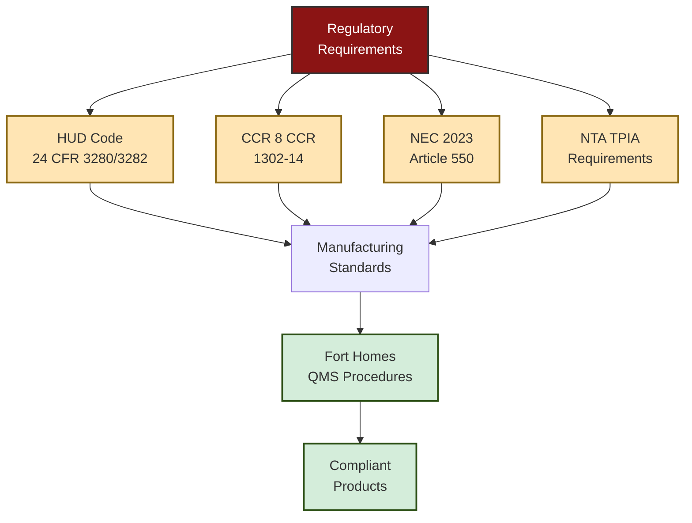

<div class="document-header" style="background: linear-gradient(135deg, #101810 0%, #2D5016 100%); color: white; padding: 40px; text-align: center; border-radius: 8px; margin-bottom: 30px; box-shadow: 0 4px 6px rgba(0,0,0,0.1);">
  <div style="font-size: 48px; font-weight: bold; letter-spacing: 2px; margin-bottom: 10px;">
    🏗️ FORT HOMES
  </div>
  <div style="font-size: 24px; font-weight: 300; letter-spacing: 1px; margin-bottom: 5px;">
    QUALITY MANAGEMENT SYSTEM
  </div>
  <div style="font-size: 20px; font-weight: bold; margin-top: 20px; padding-top: 20px; border-top: 2px solid rgba(255,255,255,0.3);">
    REGULATORY COMPLIANCE
  </div>
  <div style="font-size: 16px; margin-top: 10px; opacity: 0.9;">
    Grand Junction, Colorado
  </div>
</div>

# QMS-009 REGULATORY COMPLIANCE
## HUD Code, CCR, NEC, and TPIA Requirements Matrix

---

## 📋 DOCUMENT CONTROL

| **Attribute** | **Details** |
|:---|:---|
| **Document ID** | QMS-009-REGULATORY-COMPLIANCE |
| **Version** | 1.0 |
| **Effective Date** | 2026-01-15 |
| **Process Owner** | Compliance Officer |
| **Classification** | CONTROLLED |
| **Review Cycle** | Annual (or upon regulatory change) |
| **Next Review Date** | 2027-01-15 |

---

## 📑 TABLE OF CONTENTS

1. [Regulatory Framework Overview](#1-regulatory-framework-overview)
2. [HUD Code Requirements (24 CFR 3280/3282)](#2-hud-code-requirements-24-cfr-32803282)
3. [24 CFR 3285 Installation Standards](#3-24-cfr-3285-installation-standards)
4. [Colorado CCR 8 CCR 1302-14 Requirements](#4-colorado-ccr-8-ccr-1302-14-requirements)
5. [National Electrical Code (NEC) 2023](#5-national-electrical-code-nec-2023)
6. [NTA Third-Party Inspection Agency (TPIA)](#6-nta-third-party-inspection-agency-tpia)
7. [Compliance Monitoring Schedule](#7-compliance-monitoring-schedule)

---

## 1. REGULATORY FRAMEWORK OVERVIEW

### 1.1 Regulatory Hierarchy

<div style="background: #f8f8f8; padding: 20px; border-left: 4px solid #2D5016; margin: 20px 0;">

Fort Homes LLC modular home manufacturing is governed by:

**🏛️ Federal Level**
- **HUD Code** (24 CFR Parts 3280, 3282, 3285) - Primary authority
- **NEC 2023** (Article 550) - Electrical requirements

**🏛️ State Level**
- **CCR 8 CCR 1302-14** - Colorado Division of Housing regulations

**🏛️ Third-Party Oversight**
- **NTA, Inc.** - Third-Party Inspection Agency (TPIA) per HUD approval

**🏛️ Local Level**
- **Mesa County** - Local building/zoning requirements (installation phase)

</div>

### 1.2 Compliance Strategy



---

## 2. HUD CODE REQUIREMENTS (24 CFR 3280/3282)

### 2.1 HUD Code Overview

**Title:** Manufactured Home Construction and Safety Standards  
**Authority:** U.S. Department of Housing and Urban Development  
**Applicability:** All manufactured homes built for sale in the United States

<div style="background: white; padding: 20px; border: 2px solid #ddd; border-radius: 8px; margin: 20px 0;">

### 📋 24 CFR 3280 Key Subparts

| Subpart | Title | Fort Homes Implementation |
|:---|:---|:---|
| **A** | General | Data plate requirements (SOP-010) |
| **B** | Planning Considerations | Design standards, room dimensions |
| **C** | Fire Safety | Fire-rated materials, egress windows, smoke alarms |
| **D** | Structural Design | Wind/snow loads, floor/wall/roof design |
| **E** | Testing | Structural testing as required |
| **F** | Thermal Protection | Insulation, vapor barriers, ventilation |
| **G** | Plumbing Systems | Water supply, drainage, fixtures |
| **H** | Heat, Ventilating, Air Conditioning | HVAC sizing, installation, combustion air |
| **I** | Electrical Systems | **See NEC 2023 requirements below** |
| **J** | Transportation | Structural adequacy for transport |
| **K** | Sound Transmission | Acoustic performance (multi-section) |

</div>

### 2.2 24 CFR 3282 - Procedural and Enforcement

<div style="background: #FFF3CD; padding: 20px; border-left: 4px solid #8B6914; margin: 20px 0;">

#### Key Requirements:

**🏭 Manufacturing Approval**
- Fort Homes operates under HUD-approved manufacturing location
- Design approval process followed per SOP-005
- Quality assurance manual maintained (this QMS)

**🔍 IPIA Inspections**
- NTA, Inc. serves as approved Third-Party Inspection Agency
- Inspections at designated hold points
- Manufacturer cooperation required

**🏷️ HUD Certification Label**
- Red certification label affixed to each transportable section
- Label applied only after final NTA approval
- Label information recorded per SOP-010

**📊 Reporting Requirements**
- Production reports to HUD/State as required
- Nonconformance reporting
- Recall procedures (SOP-018)

</div>

### 2.3 HUD Code Compliance Verification

Fort Homes verifies HUD Code compliance through:
- Design review and approval process
- NTA TPIA inspections at hold points
- Internal quality inspections
- Material certifications and approvals
- Production documentation (Module Traveler)
- Final inspection before data plate affixing

---

## 3. 24 CFR 3285 INSTALLATION STANDARDS

### 3.1 Model Installation Standards

**Applicability:** Installation of manufactured homes on permanent foundations

<div style="background: #E7F3FF; padding: 20px; border-left: 4px solid #145B8B; margin: 20px 0;">

#### 🏗️ Installation Requirements

While Fort Homes manufactures modules, installation may be performed by:
- Fort and Homes Development (FHD) - Field installation division
- Third-party installers (customer-arranged)

**Key Installation Standards:**
- Site preparation and foundation requirements
- Transportation and placement
- Support and anchoring systems
- Service connections (utilities)
- Completion of on-site assembly (multi-section units)

**Fort Homes Responsibility:**
- Provide installation manual with each home
- Coordinate multi-section assembly if Fort Homes-installed
- Verify installer qualifications

</div>

---

## 4. COLORADO CCR 8 CCR 1302-14 REQUIREMENTS

### 4.1 Colorado Manufactured Housing Regulations

**Authority:** Colorado Division of Housing (CDOH)  
**Applicability:** All manufactured homes intended for use in Colorado

<div style="background: white; padding: 20px; border: 2px solid #ddd; border-radius: 8px; margin: 20px 0;">

### Colorado-Specific Requirements

| Requirement | Description | Fort Homes Implementation |
|:---|:---|:---|
| **State Approval** | Manufacturer registration with CDOH | Annual renewal by Compliance Officer |
| **Production Notification** | Notify CDOH of homes intended for Colorado sale | Per-unit notification (SOP-009) |
| **Label Requirements** | HUD label + Colorado insignia | Applied during final inspection |
| **Inspection Coordination** | CDOH may conduct inspections in addition to TPIA | Full cooperation and access provided |
| **Installation Standards** | Colorado-specific installation requirements | Installation manual includes CO requirements |
| **Consumer Protection** | Warranty and consumer notification requirements | Sales and delivery process |
| **Dealer Licensing** | If Fort Homes sells direct to consumer | License maintained if applicable |

</div>

### 4.2 CDOH Compliance Process

Per [SOP-009](../sops/SOP-009-CDOH-Regulatory-Compliance.md):

```
┌─────────────────────────────────────────────────────────────────┐
│  CDOH COMPLIANCE WORKFLOW                                       │
├─────────────────────────────────────────────────────────────────┤
│                                                                 │
│  1️⃣ Production Planning                                        │
│     • Determine if unit intended for Colorado                   │
│     • Flag in production system                                 │
│                                                                 │
│  2️⃣ CDOH Notification                                          │
│     • Submit production notification to CDOH                    │
│     • Include serial number, model, destination                 │
│                                                                 │
│  3️⃣ Manufacturing                                              │
│     • Follow all HUD Code + Colorado requirements               │
│     • NTA TPIA inspections as required                          │
│                                                                 │
│  4️⃣ Final Inspection                                           │
│     • Complete Fort Homes final inspection                      │
│     • NTA TPIA final approval                                   │
│     • Affix HUD label + Colorado insignia                       │
│                                                                 │
│  5️⃣ Documentation                                              │
│     • Complete all required paperwork                           │
│     • Provide to customer/dealer                                │
│     • File copies per retention schedule                        │
│                                                                 │
└─────────────────────────────────────────────────────────────────┘
```

---

## 5. NATIONAL ELECTRICAL CODE (NEC) 2023

### 5.1 NEC 2023 - Article 550

**Title:** Mobile Homes, Manufactured Homes, and Mobile Home Parks  
**Applicability:** All electrical systems in manufactured homes

<div style="background: #F8D7DA; padding: 20px; border-left: 4px solid #8B1414; margin: 20px 0;">

#### ⚡ Critical NEC 2023 Requirements

**Mandatory Compliance Items:**

**550.10 - Power Supply**
- Minimum service rating: 100A for homes >600 sq ft
- Service equipment disconnect requirements
- Grounding and bonding per Article 250

**550.11 - Branch Circuits**
- Branch circuit protection requirements
- AFCI protection (Article 210.12) - **All 120V, 15A/20A branch circuits**
- GFCI protection (Article 210.8) - Bathrooms, kitchens, outdoors, etc.

**550.12 - Branch Circuit Protection**
- Overcurrent device sizing
- Multi-wire branch circuit requirements

**550.15 - Wiring Methods**
- NM cable (Romex) or approved alternatives
- Cable routing and support
- Box fill calculations (Article 314)

**550.16 - Receptacle Outlets**
- Spacing per NEC 210.52
- GFCI protection as required
- Grounding-type receptacles only

**550.17 - Lighting Fixtures**
- Bathroom fixture requirements
- Clearances from combustible materials

**550.23 - Grounding**
- Equipment grounding conductor requirements
- Bonding of metallic systems

</div>

### 5.2 NEC 2023 Compliance Verification

<div style="background: white; padding: 20px; border: 2px solid #ddd; border-radius: 8px; margin: 20px 0;">

| NEC Requirement | Verification Method | Responsible Party | Hold Point |
|:---|:---|:---|:---|
| **Service Equipment** | Visual inspection, documentation review | NTA TPIA Inspector | Electrical Rough-In |
| **Branch Circuit Protection** | Panel inspection, AFCI/GFCI verification | NTA TPIA Inspector | Electrical Rough-In |
| **Wiring Methods** | Visual inspection before concealment | Fort Homes QC + NTA | Electrical Rough-In |
| **Receptacle Placement** | Measurement, spacing verification | Fort Homes QC | Rough-In + Final |
| **GFCI Testing** | GFCI test button function | Fort Homes QC + NTA | Final Inspection |
| **Grounding/Bonding** | Continuity testing, visual inspection | NTA TPIA Inspector | Electrical Rough-In |
| **Box Fill** | Calculation review, visual verification | Fort Homes Electrician | During Installation |

</div>

### 5.3 NEC 2023 Updates (from NEC 2020)

Fort Homes stays current with NEC code cycles:
- Review code changes when new edition released
- Update procedures and work instructions
- Train electrical personnel on changes
- Coordinate with NTA TPIA on interpretations

---

## 6. NTA THIRD-PARTY INSPECTION AGENCY (TPIA)

### 6.1 NTA Role and Authority

**NTA, Inc.** is HUD-approved Third-Party Inspection Agency (IPIA) providing:
- In-plant inspection services
- HUD Code compliance verification
- Quality assurance oversight
- Manufacturer certification

<div style="background: #FFF3CD; padding: 20px; border-left: 4px solid #8B6914; margin: 20px 0;">

#### 🔍 NTA TPIA Inspection Authority

NTA inspectors have authority to:
✅ Access all manufacturing areas
✅ Review designs, drawings, and specifications
✅ Inspect materials and work in progress
✅ Issue stop-work orders for non-compliance
✅ Approve hold point releases
✅ Withhold HUD label for nonconformities
✅ Report findings to HUD and CDOH

**Fort Homes must cooperate fully with NTA TPIA inspections.**

</div>

### 6.2 NTA TPIA Hold Points

Detailed in [SOP-015](../sops/SOP-015-TPIA-Third-Party-Inspector-Coordination.md):

<div style="background: white; padding: 20px; border: 2px solid #ddd; border-radius: 8px; margin: 20px 0;">

| Hold Point | Inspection Focus | Typical Duration | Fort Homes Preparation |
|:---|:---|:---|:---|
| **Material Receiving** | Material certifications, approved materials list | 15-30 min | Have certs ready, materials organized |
| **Floor System** | Structural framing, insulation, vapor barrier | 30-45 min | Complete floor, ready for inspection |
| **Wall Framing** | Framing compliance, sheathing before closure | 45-60 min | All walls framed, ready to sheathe |
| **Roof Framing** | Truss installation, structural integrity | 30-45 min | Roof complete, before covering |
| **Electrical Rough-In** | NEC 2023 compliance, panel, wiring, boxes | 60-90 min | All electrical complete, areas accessible |
| **Plumbing Rough-In** | Water supply, drain/waste, fixtures | 45-60 min | All rough plumbing complete, tested |
| **Final Inspection** | Overall compliance, finish quality, systems | 90-120 min | 100% complete, cleaned, ready for label |

</div>

### 6.3 NTA TPIA Coordination

Fort Homes coordinates with NTA per SOP-015:
- Schedule inspections 48 hours in advance
- Provide access and documentation
- Respond promptly to findings
- Close nonconformities before release
- Maintain positive working relationship

---

## 7. COMPLIANCE MONITORING SCHEDULE

### 7.1 Ongoing Compliance Activities

<div style="background: white; padding: 20px; border: 2px solid #ddd; border-radius: 8px; margin: 20px 0;">

| Activity | Frequency | Responsible | Purpose |
|:---|:---|:---|:---|
| **Regulatory Updates Monitoring** | Continuous | Compliance Officer | Identify new/changed requirements |
| **Code Change Review** | Upon release | Engineering + Quality | Assess impact on designs/processes |
| **NTA TPIA Coordination Meeting** | Monthly | Quality Manager | Review performance, issues, improvements |
| **CDOH Reporting** | As required | Compliance Officer | Production notifications, compliance reports |
| **Internal Compliance Audit** | Annual | Quality Manager | Verify regulatory compliance |
| **Procedure Updates** | As needed | Process Owners | Incorporate regulatory changes |
| **Training on Regulations** | Annual + changes | HR Manager | Ensure personnel awareness |

</div>

### 7.2 Compliance Performance Metrics

| Metric | Target | Measurement |
|:---|:---|:---|
| **HUD Code Compliance Rate** | 100% | Per NTA final inspection |
| **CCR 8 CCR 1302-14 Compliance** | 100% | Per CDOH requirements |
| **NEC 2023 Compliance Rate** | 100% | Per NTA electrical inspection |
| **NTA First-Pass Rate** | ≥90% | Per hold point inspection |
| **Regulatory Finding Closure** | 100% before shipment | Per NCR system |

---

## 8. REGULATORY REFERENCE SUMMARY

<div style="background: #f8f8f8; padding: 20px; border: 2px solid #333; border-radius: 8px; margin: 20px 0;">

### 📚 Quick Reference

**Federal Regulations:**
- **24 CFR 3280** - Manufactured Home Construction and Safety Standards
- **24 CFR 3282** - Manufactured Home Procedural and Enforcement Regulations
- **24 CFR 3285** - Model Manufactured Home Installation Standards

**National Codes:**
- **NEC 2023** - National Electrical Code (NFPA 70), Article 550
- **IRC 2021** - International Residential Code (reference)
- **IPC 2021** - International Plumbing Code (reference)

**State Regulations:**
- **CCR 8 CCR 1302-14** - Colorado Manufactured Housing Rules

**Third-Party Oversight:**
- **NTA, Inc.** - Third-Party Inspection Agency (HUD-approved IPIA)

**Useful Links:**
- HUD MH Program: https://www.hud.gov/program_offices/housing/rmra/mhs/mhshome
- Colorado Division of Housing: https://cdola.colorado.gov/
- NTA, Inc.: [Contact information from SOP-015]

</div>

---

## 🔄 REVISION HISTORY

| Version | Date | Description | Author | Approved By |
|:---|:---|:---|:---|:---|
| 1.0 | 2026-01-15 | Initial creation of Regulatory Compliance document | Compliance Officer | Executive Leadership |

---

## ✅ APPROVAL SIGNATURES

| Role | Name | Signature | Date |
|:---|:---|:---|:---|
| **Prepared By** | Compliance Officer | _________________ | 2026-01-15 |
| **Reviewed By** | Quality Manager | _________________ | 2026-01-15 |
| **Approved By** | General Manager | _________________ | 2026-01-15 |

---

**Document Classification:** CONTROLLED  
**Distribution:** All Fort Homes LLC Personnel  
**Next Review Date:** 2027-01-15

---

*This document is part of the Fort Homes LLC Quality Management System. Unauthorized distribution is prohibited.*
