<div align="center">


<div align="center">
  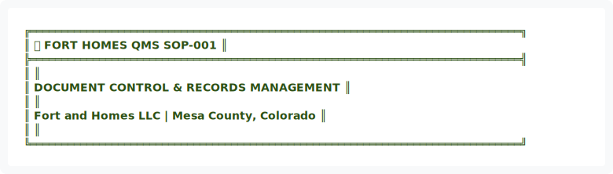
</div>

<details>
<summary>View ASCII Source</summary>

```
╔══════════════════════════════════════════════════════════════════════════════╗
║  🏗️ FORT HOMES QMS                                           SOP-001        ║
╠══════════════════════════════════════════════════════════════════════════════╣
║                                                                              ║
║              DOCUMENT CONTROL & RECORDS MANAGEMENT                           ║
║                                                                              ║
║               Fort and Homes LLC | Mesa County, Colorado                     ║
║                                                                              ║
╚══════════════════════════════════════════════════════════════════════════════╝
```
</details>


| 📄 Document ID | 📋 Revision | 📅 Effective | 👤 Process Owner | 🔍 Next Review |
|:---:|:---:|:---:|:---:|:---:|
| `SOP-001` | `2.0` | `January 2026` | `Quality Manager` | `July 2026` |

━━━━━━━━━━━━━━━━━━━━━━━━━━━━━━━━━━━━━━━━━━━━━━━━━━━━━━━━━━━━━━━━━━━━━━━━━━━━━━

</div>

---

## 📋 TABLE OF CONTENTS

1. [Purpose](#1-purpose)
2. [Scope](#2-scope)
3. [References](#3-references)
4. [Roles & Responsibilities](#4-roles--responsibilities)
5. [Document Classification](#5-document-classification)
6. [Process Flowcharts](#6-process-flowcharts)
7. [Document Development](#7-document-development)
8. [Document Update Process](#8-document-update-process)
9. [Record Management](#9-record-management)
10. [Distribution & Access](#10-distribution--access)
11. [Quality Metrics](#11-quality-metrics)
12. [Training Requirements](#12-training-requirements)
13. [Appendices](#13-appendices)

---

## 1. PURPOSE

<div align="center">


<div align="center">
  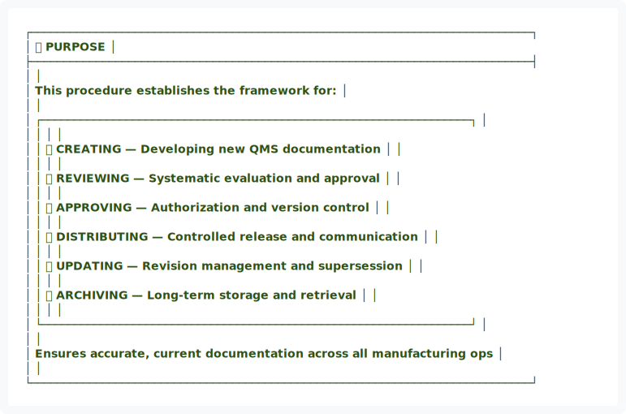
</div>

<details>
<summary>View ASCII Source</summary>

```
┌─────────────────────────────────────────────────────────────────────────────┐
│                              🎯 PURPOSE                                     │
├─────────────────────────────────────────────────────────────────────────────┤
│                                                                             │
│   This procedure establishes the framework for:                             │
│                                                                             │
│   ┌──────────────────────────────────────────────────────────────────┐     │
│   │                                                                  │     │
│   │   📝 CREATING — Developing new QMS documentation                 │     │
│   │                                                                  │     │
│   │   🔍 REVIEWING — Systematic evaluation and approval              │     │
│   │                                                                  │     │
│   │   ✅ APPROVING — Authorization and version control               │     │
│   │                                                                  │     │
│   │   📤 DISTRIBUTING — Controlled release and communication         │     │
│   │                                                                  │     │
│   │   🔄 UPDATING — Revision management and supersession             │     │
│   │                                                                  │     │
│   │   📁 ARCHIVING — Long-term storage and retrieval                 │     │
│   │                                                                  │     │
│   └──────────────────────────────────────────────────────────────────┘     │
│                                                                             │
│   Ensures accurate, current documentation across all manufacturing ops     │
│                                                                             │
└─────────────────────────────────────────────────────────────────────────────┘
```
</details>


</div>

---

## 2. SCOPE

### 2.1 Applicability

This procedure applies to **all QMS documents** including:

| Document Type | Prefix | Example |
|:---|:---:|:---|
| Standard Operating Procedures | `SOP` | SOP-001, SOP-101 |
| Work Instructions | `WI` | WI-101, WI-102 |
| Inspection Forms | `FORM-I` | FORM-I101, FORM-I102 |
| Nonconformance Reports | `NCR` | NCR-2024-001 |
| Module Travelers | `TRAVELER` | TRAVELER-M2024-047 |
| Quality Manual | `QMS-MANUAL` | QMS-MANUAL-001 |
| Training Records | `TRAINING` | TRAINING-EMP-001 |

### 2.2 Personnel Coverage


<div align="center">
  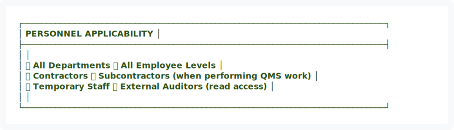
</div>

<details>
<summary>View ASCII Source</summary>

```
┌─────────────────────────────────────────────────────────────────────────────┐
│                         PERSONNEL APPLICABILITY                             │
├─────────────────────────────────────────────────────────────────────────────┤
│                                                                             │
│   ✅ All Departments          ✅ All Employee Levels                        │
│   ✅ Contractors              ✅ Subcontractors (when performing QMS work)  │
│   ✅ Temporary Staff          ✅ External Auditors (read access)            │
│                                                                             │
└─────────────────────────────────────────────────────────────────────────────┘
```
</details>


---

## 3. REFERENCES

| Reference | Description | Authority |
|:---|:---|:---|
| HUD Code 24 CFR 3280 | Manufactured Home Construction Standards | Federal |
| HUD Code 24 CFR 3282 | Procedural & Enforcement Regulations | Federal |
| CDOH Regulations | Colorado Division of Housing Standards | State |
| QMS-MANUAL-001 | Fort Homes Quality Management Manual | Internal |
| GitHub Repository | `fort-homes-qms` Version Control | Internal |

---

## 4. ROLES & RESPONSIBILITIES

<div align="center">


<div align="center">
  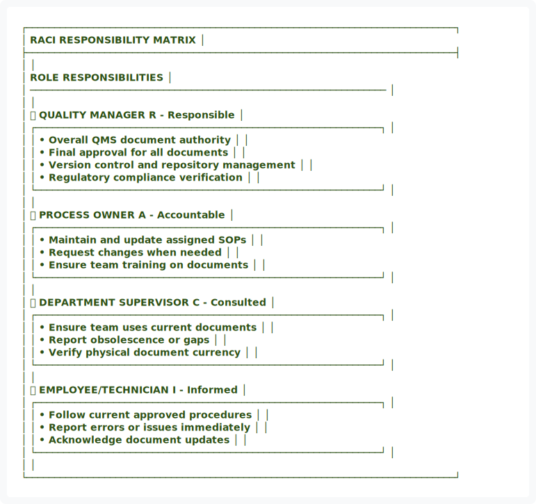
</div>

<details>
<summary>View ASCII Source</summary>

```
┌─────────────────────────────────────────────────────────────────────────────┐
│                        RACI RESPONSIBILITY MATRIX                           │
├─────────────────────────────────────────────────────────────────────────────┤
│                                                                             │
│   ROLE                           RESPONSIBILITIES                           │
│   ────────────────────────────────────────────────────────────────          │
│                                                                             │
│   👤 QUALITY MANAGER             R - Responsible                            │
│   ┌──────────────────────────────────────────────────────────────┐         │
│   │ • Overall QMS document authority                             │         │
│   │ • Final approval for all documents                          │         │
│   │ • Version control and repository management                 │         │
│   │ • Regulatory compliance verification                        │         │
│   └──────────────────────────────────────────────────────────────┘         │
│                                                                             │
│   👤 PROCESS OWNER               A - Accountable                            │
│   ┌──────────────────────────────────────────────────────────────┐         │
│   │ • Maintain and update assigned SOPs                         │         │
│   │ • Request changes when needed                               │         │
│   │ • Ensure team training on documents                         │         │
│   └──────────────────────────────────────────────────────────────┘         │
│                                                                             │
│   👤 DEPARTMENT SUPERVISOR       C - Consulted                              │
│   ┌──────────────────────────────────────────────────────────────┐         │
│   │ • Ensure team uses current documents                        │         │
│   │ • Report obsolescence or gaps                               │         │
│   │ • Verify physical document currency                         │         │
│   └──────────────────────────────────────────────────────────────┘         │
│                                                                             │
│   👤 EMPLOYEE/TECHNICIAN         I - Informed                               │
│   ┌──────────────────────────────────────────────────────────────┐         │
│   │ • Follow current approved procedures                        │         │
│   │ • Report errors or issues immediately                       │         │
│   │ • Acknowledge document updates                              │         │
│   └──────────────────────────────────────────────────────────────┘         │
│                                                                             │
└─────────────────────────────────────────────────────────────────────────────┘
```
</details>


</div>

---

## 5. DOCUMENT CLASSIFICATION

### 5.1 Document Hierarchy

<div align="center">


<div align="center">
  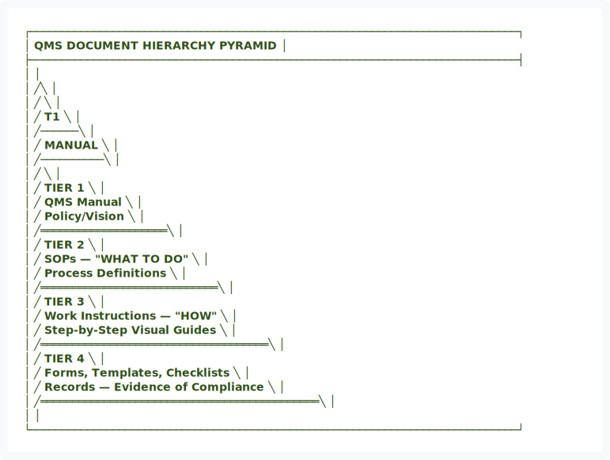
</div>

<details>
<summary>View ASCII Source</summary>

```
┌─────────────────────────────────────────────────────────────────────────────┐
│                      QMS DOCUMENT HIERARCHY PYRAMID                         │
├─────────────────────────────────────────────────────────────────────────────┤
│                                                                             │
│                           ╱╲                                                │
│                          ╱  ╲                                               │
│                         ╱ T1 ╲                                              │
│                        ╱──────╲                                             │
│                       ╱ MANUAL ╲                                            │
│                      ╱──────────╲                                           │
│                     ╱            ╲                                          │
│                    ╱    TIER 1    ╲                                         │
│                   ╱   QMS Manual   ╲                                        │
│                  ╱   Policy/Vision  ╲                                       │
│                 ╱════════════════════╲                                      │
│                ╱       TIER 2         ╲                                     │
│               ╱   SOPs — "WHAT TO DO"  ╲                                    │
│              ╱   Process Definitions    ╲                                   │
│             ╱════════════════════════════╲                                  │
│            ╱          TIER 3              ╲                                 │
│           ╱   Work Instructions — "HOW"    ╲                                │
│          ╱   Step-by-Step Visual Guides     ╲                               │
│         ╱════════════════════════════════════╲                              │
│        ╱             TIER 4                   ╲                             │
│       ╱   Forms, Templates, Checklists         ╲                            │
│      ╱   Records — Evidence of Compliance       ╲                           │
│     ╱════════════════════════════════════════════╲                          │
│                                                                             │
└─────────────────────────────────────────────────────────────────────────────┘
```
</details>


</div>

### 5.2 Document Classification Matrix

| Type | Prefix | Retention | Authority | Purpose |
|:---|:---:|:---:|:---|:---|
| Quality Manual | `QMS-MANUAL` | Indefinite | Executive | System overview & policy |
| Standard Operating Procedure | `SOP` | 7 years | Quality Manager | Process definitions |
| Work Instruction | `WI` | 7 years | Process Owner | Step-by-step guides |
| Inspection Form | `FORM-I` | 7 years | Quality Manager | Inspection records |
| NCR Report | `NCR` | 7 years | Quality Manager | Defect documentation |
| Module Traveler | `TRAVELER` | 7 years | Production Manager | Module lifecycle record |

### 5.3 Naming Convention


<div align="center">
  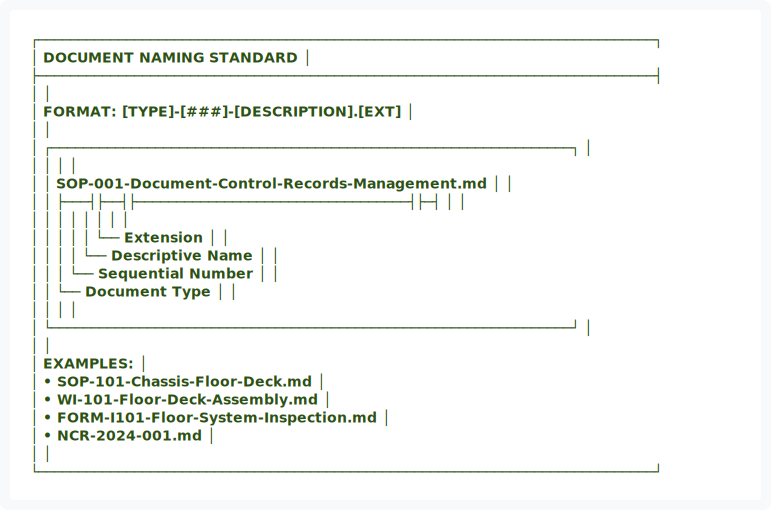
</div>

<details>
<summary>View ASCII Source</summary>

```
┌─────────────────────────────────────────────────────────────────────────────┐
│                        DOCUMENT NAMING STANDARD                             │
├─────────────────────────────────────────────────────────────────────────────┤
│                                                                             │
│   FORMAT: [TYPE]-[###]-[DESCRIPTION].[EXT]                                  │
│                                                                             │
│   ┌─────────────────────────────────────────────────────────────────┐      │
│   │                                                                 │      │
│   │   SOP-001-Document-Control-Records-Management.md               │      │
│   │   ├───┤├──┤├──────────────────────────────────┤├─┤             │      │
│   │     │    │              │                        │              │      │
│   │     │    │              │                        └── Extension  │      │
│   │     │    │              └── Descriptive Name                    │      │
│   │     │    └── Sequential Number                                  │      │
│   │     └── Document Type                                           │      │
│   │                                                                 │      │
│   └─────────────────────────────────────────────────────────────────┘      │
│                                                                             │
│   EXAMPLES:                                                                 │
│   • SOP-101-Chassis-Floor-Deck.md                                          │
│   • WI-101-Floor-Deck-Assembly.md                                          │
│   • FORM-I101-Floor-System-Inspection.md                                   │
│   • NCR-2024-001.md                                                        │
│                                                                             │
└─────────────────────────────────────────────────────────────────────────────┘
```
</details>


---

## 6. PROCESS FLOWCHARTS

### 6.1 New Document Creation Process

<div align="center">


<div align="center">
  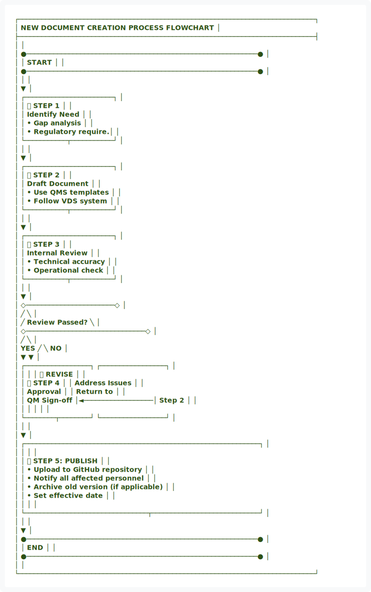
</div>

<details>
<summary>View ASCII Source</summary>

```
┌─────────────────────────────────────────────────────────────────────────────┐
│              NEW DOCUMENT CREATION PROCESS FLOWCHART                        │
├─────────────────────────────────────────────────────────────────────────────┤
│                                                                             │
│   ●────────────────────────────────────────────────────────────●           │
│   │                         START                              │           │
│   ●────────────────────────────────────────────────────────────●           │
│                                │                                            │
│                                ▼                                            │
│                    ┌───────────────────────┐                               │
│                    │  📋 STEP 1            │                               │
│                    │  Identify Need        │                               │
│                    │  • Gap analysis       │                               │
│                    │  • Regulatory require.│                               │
│                    └───────────┬───────────┘                               │
│                                │                                            │
│                                ▼                                            │
│                    ┌───────────────────────┐                               │
│                    │  📝 STEP 2            │                               │
│                    │  Draft Document       │                               │
│                    │  • Use QMS templates  │                               │
│                    │  • Follow VDS system  │                               │
│                    └───────────┬───────────┘                               │
│                                │                                            │
│                                ▼                                            │
│                    ┌───────────────────────┐                               │
│                    │  🔍 STEP 3            │                               │
│                    │  Internal Review      │                               │
│                    │  • Technical accuracy │                               │
│                    │  • Operational check  │                               │
│                    └───────────┬───────────┘                               │
│                                │                                            │
│                                ▼                                            │
│                    ◇───────────────────────◇                               │
│                   ╱                         ╲                              │
│                  ╱   Review Passed?          ╲                             │
│                 ◇───────────────────────────────◇                          │
│               ╱                                 ╲                          │
│        YES   ╱                                   ╲   NO                    │
│             ▼                                     ▼                        │
│   ┌─────────────────┐                   ┌─────────────────┐               │
│   │                 │                   │  🔄 REVISE      │               │
│   │  ✅ STEP 4      │                   │  Address Issues │               │
│   │  Approval       │                   │  Return to      │               │
│   │  QM Sign-off    │◄──────────────────│  Step 2         │               │
│   │                 │                   │                 │               │
│   └────────┬────────┘                   └─────────────────┘               │
│            │                                                               │
│            ▼                                                               │
│   ┌─────────────────────────────────────────────────────────────┐         │
│   │                                                             │         │
│   │  📤 STEP 5: PUBLISH                                         │         │
│   │  • Upload to GitHub repository                              │         │
│   │  • Notify all affected personnel                            │         │
│   │  • Archive old version (if applicable)                      │         │
│   │  • Set effective date                                       │         │
│   │                                                             │         │
│   └────────────────────────────────┬────────────────────────────┘         │
│                                    │                                       │
│                                    ▼                                       │
│   ●────────────────────────────────────────────────────────────●          │
│   │                          END                               │          │
│   ●────────────────────────────────────────────────────────────●          │
│                                                                             │
└─────────────────────────────────────────────────────────────────────────────┘
```
</details>


</div>

### 6.2 Document Change Request Process

<div align="center">


<div align="center">
  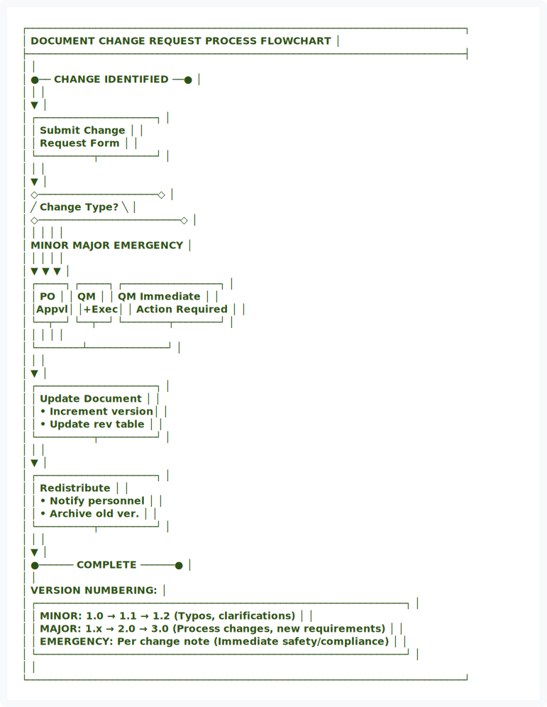
</div>

<details>
<summary>View ASCII Source</summary>

```
┌─────────────────────────────────────────────────────────────────────────────┐
│               DOCUMENT CHANGE REQUEST PROCESS FLOWCHART                     │
├─────────────────────────────────────────────────────────────────────────────┤
│                                                                             │
│   ●── CHANGE IDENTIFIED ──●                                                │
│              │                                                              │
│              ▼                                                              │
│   ┌─────────────────────┐                                                  │
│   │ Submit Change       │                                                  │
│   │ Request Form        │                                                  │
│   └──────────┬──────────┘                                                  │
│              │                                                              │
│              ▼                                                              │
│   ◇─────────────────────◇                                                  │
│  ╱  Change Type?         ╲                                                 │
│ ◇─────────────────────────◇                                                │
│   │         │         │                                                    │
│ MINOR    MAJOR    EMERGENCY                                                │
│   │         │         │                                                    │
│   ▼         ▼         ▼                                                    │
│ ┌─────┐  ┌─────┐  ┌─────────────────┐                                      │
│ │ PO  │  │ QM  │  │ QM Immediate    │                                      │
│ │Appvl│  │+Exec│  │ Action Required │                                      │
│ └──┬──┘  └──┬──┘  └────────┬────────┘                                      │
│    │        │              │                                                │
│    └────────┴──────────────┘                                                │
│              │                                                              │
│              ▼                                                              │
│   ┌─────────────────────┐                                                  │
│   │  Update Document    │                                                  │
│   │  • Increment version│                                                  │
│   │  • Update rev table │                                                  │
│   └──────────┬──────────┘                                                  │
│              │                                                              │
│              ▼                                                              │
│   ┌─────────────────────┐                                                  │
│   │  Redistribute       │                                                  │
│   │  • Notify personnel │                                                  │
│   │  • Archive old ver. │                                                  │
│   └──────────┬──────────┘                                                  │
│              │                                                              │
│              ▼                                                              │
│   ●────── COMPLETE ──────●                                                 │
│                                                                             │
│   VERSION NUMBERING:                                                        │
│   ┌─────────────────────────────────────────────────────────────────┐      │
│   │ MINOR: 1.0 → 1.1 → 1.2    (Typos, clarifications)              │      │
│   │ MAJOR: 1.x → 2.0 → 3.0    (Process changes, new requirements)   │      │
│   │ EMERGENCY: Per change note (Immediate safety/compliance)        │      │
│   └─────────────────────────────────────────────────────────────────┘      │
│                                                                             │
└─────────────────────────────────────────────────────────────────────────────┘
```
</details>


</div>

---

## 7. DOCUMENT DEVELOPMENT

### 7.1 Creation Checklist


<div align="center">
  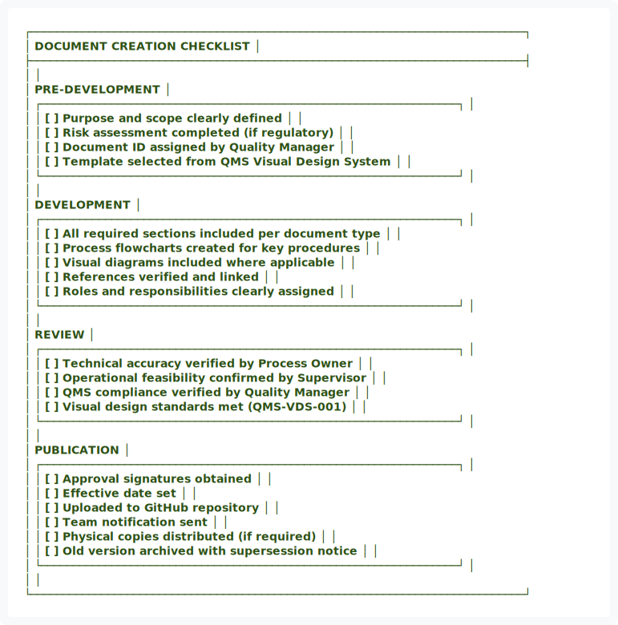
</div>

<details>
<summary>View ASCII Source</summary>

```
┌─────────────────────────────────────────────────────────────────────────────┐
│                    DOCUMENT CREATION CHECKLIST                              │
├─────────────────────────────────────────────────────────────────────────────┤
│                                                                             │
│   PRE-DEVELOPMENT                                                           │
│   ┌─────────────────────────────────────────────────────────────────┐      │
│   │ [ ] Purpose and scope clearly defined                          │      │
│   │ [ ] Risk assessment completed (if regulatory)                   │      │
│   │ [ ] Document ID assigned by Quality Manager                     │      │
│   │ [ ] Template selected from QMS Visual Design System             │      │
│   └─────────────────────────────────────────────────────────────────┘      │
│                                                                             │
│   DEVELOPMENT                                                               │
│   ┌─────────────────────────────────────────────────────────────────┐      │
│   │ [ ] All required sections included per document type            │      │
│   │ [ ] Process flowcharts created for key procedures               │      │
│   │ [ ] Visual diagrams included where applicable                   │      │
│   │ [ ] References verified and linked                              │      │
│   │ [ ] Roles and responsibilities clearly assigned                 │      │
│   └─────────────────────────────────────────────────────────────────┘      │
│                                                                             │
│   REVIEW                                                                    │
│   ┌─────────────────────────────────────────────────────────────────┐      │
│   │ [ ] Technical accuracy verified by Process Owner                │      │
│   │ [ ] Operational feasibility confirmed by Supervisor             │      │
│   │ [ ] QMS compliance verified by Quality Manager                  │      │
│   │ [ ] Visual design standards met (QMS-VDS-001)                   │      │
│   └─────────────────────────────────────────────────────────────────┘      │
│                                                                             │
│   PUBLICATION                                                               │
│   ┌─────────────────────────────────────────────────────────────────┐      │
│   │ [ ] Approval signatures obtained                                │      │
│   │ [ ] Effective date set                                          │      │
│   │ [ ] Uploaded to GitHub repository                               │      │
│   │ [ ] Team notification sent                                      │      │
│   │ [ ] Physical copies distributed (if required)                   │      │
│   │ [ ] Old version archived with supersession notice               │      │
│   └─────────────────────────────────────────────────────────────────┘      │
│                                                                             │
└─────────────────────────────────────────────────────────────────────────────┘
```
</details>


---

## 8. DOCUMENT UPDATE PROCESS

### 8.1 Revision Types

| Type | Examples | Authority | Version Change |
|:---|:---|:---|:---|
| **Minor** | Typo fixes, clarifications, formatting | Process Owner | 1.0 → 1.1 |
| **Major** | Procedure changes, new requirements | QM + Executive | 1.x → 2.0 |
| **Emergency** | Safety issues, regulatory mandates | Quality Manager | Per change note |

### 8.2 Change Request Requirements

All changes must include:
1. ✅ Specific change with justification
2. ✅ Impact assessment on related procedures
3. ✅ Training requirements identified
4. ✅ Process Owner and Quality Manager approval
5. ✅ Updated revision history table
6. ✅ Incremented version number

---

## 9. RECORD MANAGEMENT

### 9.1 Retention Schedule

<div align="center">


<div align="center">
  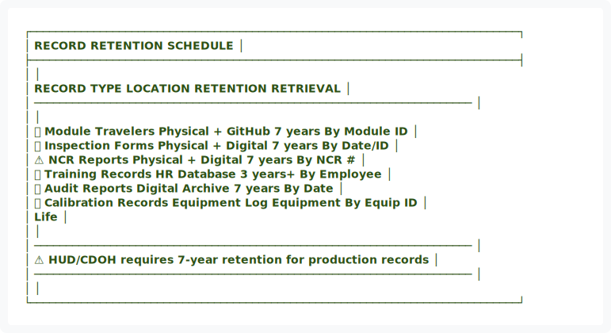
</div>

<details>
<summary>View ASCII Source</summary>

```
┌─────────────────────────────────────────────────────────────────────────────┐
│                       RECORD RETENTION SCHEDULE                             │
├─────────────────────────────────────────────────────────────────────────────┤
│                                                                             │
│   RECORD TYPE              LOCATION           RETENTION      RETRIEVAL     │
│   ─────────────────────────────────────────────────────────────────────     │
│                                                                             │
│   📄 Module Travelers      Physical + GitHub     7 years     By Module ID  │
│   📋 Inspection Forms      Physical + Digital    7 years     By Date/ID    │
│   ⚠️ NCR Reports           Physical + Digital    7 years     By NCR #      │
│   👤 Training Records      HR Database           3 years+    By Employee   │
│   📊 Audit Reports         Digital Archive       7 years     By Date       │
│   🔧 Calibration Records   Equipment Log         Equipment   By Equip ID   │
│                                                  Life                       │
│                                                                             │
│   ─────────────────────────────────────────────────────────────────────     │
│   ⚠️ HUD/CDOH requires 7-year retention for production records             │
│   ─────────────────────────────────────────────────────────────────────     │
│                                                                             │
└─────────────────────────────────────────────────────────────────────────────┘
```
</details>


</div>

### 9.2 Storage Standards

| Storage Type | Requirements |
|:---|:---|
| **Physical Records** | Locked cabinets, climate controlled, organized by date/type |
| **Digital Records** | GitHub repository, weekly backup, role-based access |
| **Confidential Records** | Additional security, limited access, audit trail |

---

## 10. DISTRIBUTION & ACCESS

### 10.1 Access Control Matrix

<div align="center">


<div align="center">
  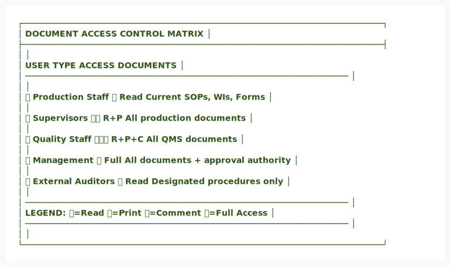
</div>

<details>
<summary>View ASCII Source</summary>

```
┌─────────────────────────────────────────────────────────────────────────────┐
│                       DOCUMENT ACCESS CONTROL MATRIX                        │
├─────────────────────────────────────────────────────────────────────────────┤
│                                                                             │
│   USER TYPE             ACCESS      DOCUMENTS                               │
│   ─────────────────────────────────────────────────────────────────────     │
│                                                                             │
│   👷 Production Staff    📖 Read     Current SOPs, WIs, Forms               │
│                                                                             │
│   👔 Supervisors         📖📄 R+P    All production documents               │
│                                                                             │
│   🔍 Quality Staff       📖📄💬 R+P+C All QMS documents                     │
│                                                                             │
│   👤 Management          🔓 Full    All documents + approval authority      │
│                                                                             │
│   🔎 External Auditors   📖 Read    Designated procedures only              │
│                                                                             │
│   ─────────────────────────────────────────────────────────────────────     │
│   LEGEND: 📖=Read  📄=Print  💬=Comment  🔓=Full Access                     │
│   ─────────────────────────────────────────────────────────────────────     │
│                                                                             │
└─────────────────────────────────────────────────────────────────────────────┘
```
</details>


</div>

---

## 11. QUALITY METRICS

### 11.1 Document Control KPIs

| Metric | Target | Frequency | Owner |
|:---|:---:|:---|:---|
| Document Review Turnaround | ≤ 5 business days | Per submission | Quality Manager |
| Approval Turnaround | ≤ 2 business days | Per submission | Quality Manager |
| Supersession Implementation | 100% within 1 week | Per update | Process Owner |
| Record Retention Compliance | 100% | Quarterly audit | Quality Manager |
| Unauthorized Document Usage | 0 incidents | Monthly audit | All Supervisors |

### 11.2 Dashboard Metrics


<div align="center">
  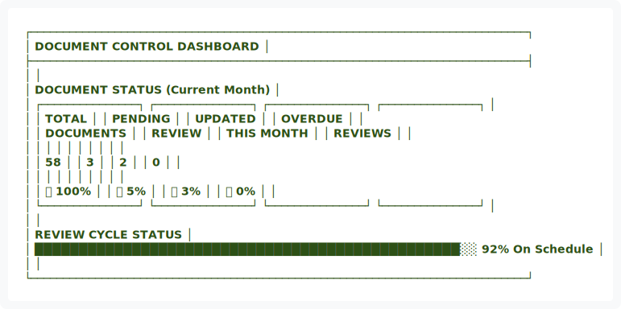
</div>

<details>
<summary>View ASCII Source</summary>

```
┌─────────────────────────────────────────────────────────────────────────────┐
│                    DOCUMENT CONTROL DASHBOARD                               │
├─────────────────────────────────────────────────────────────────────────────┤
│                                                                             │
│   DOCUMENT STATUS (Current Month)                                           │
│   ┌───────────────┐ ┌───────────────┐ ┌───────────────┐ ┌───────────────┐  │
│   │   TOTAL       │ │   PENDING     │ │   UPDATED     │ │   OVERDUE     │  │
│   │   DOCUMENTS   │ │   REVIEW      │ │   THIS MONTH  │ │   REVIEWS     │  │
│   │               │ │               │ │               │ │               │  │
│   │     58        │ │      3        │ │      2        │ │      0        │  │
│   │               │ │               │ │               │ │               │  │
│   │   ✅ 100%     │ │   🟡 5%       │ │   ✅ 3%       │ │   ✅ 0%       │  │
│   └───────────────┘ └───────────────┘ └───────────────┘ └───────────────┘  │
│                                                                             │
│   REVIEW CYCLE STATUS                                                       │
│   ████████████████████████████████████████████████░░  92% On Schedule      │
│                                                                             │
└─────────────────────────────────────────────────────────────────────────────┘
```
</details>


---

## 12. TRAINING REQUIREMENTS

### 12.1 Training Matrix

| Role | Required Training | Frequency |
|:---|:---|:---|
| New Employees | QMS Overview + Document Navigation | On hire |
| Supervisors | Document Control Procedures | Annually |
| Quality Staff | Full SOP-001 + Records Management | On hire + Annually |
| Process Owners | Document Development & Revision | On assignment |

### 12.2 Competency Verification

- [ ] Quiz on document usage procedures (80% pass rate)
- [ ] Practical demonstration of record filing
- [ ] Acknowledgment form signed for document updates

---

## 13. APPENDICES

### Appendix A: Document Change Request Form


<div align="center">
  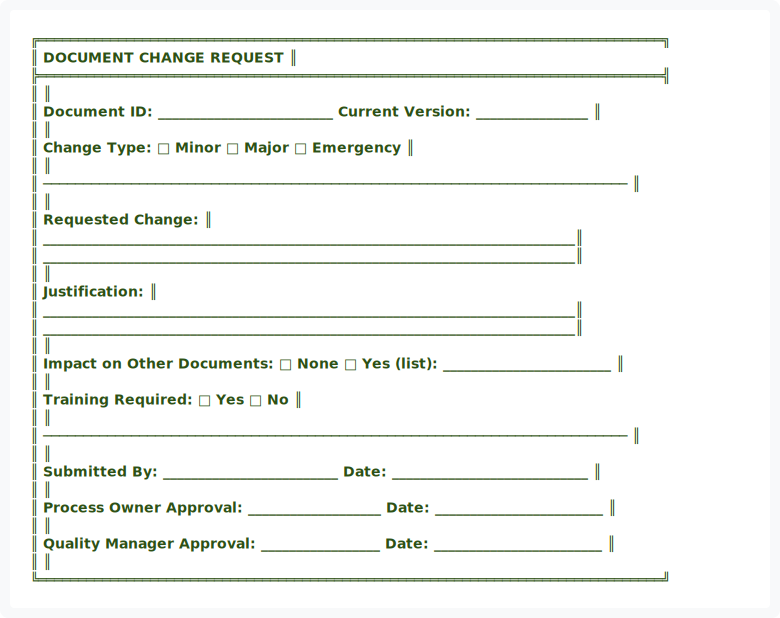
</div>

<details>
<summary>View ASCII Source</summary>

```
╔══════════════════════════════════════════════════════════════════════════════╗
║                        DOCUMENT CHANGE REQUEST                               ║
╠══════════════════════════════════════════════════════════════════════════════╣
║                                                                              ║
║  Document ID: _________________________  Current Version: ________________  ║
║                                                                              ║
║  Change Type:  □ Minor  □ Major  □ Emergency                                ║
║                                                                              ║
║  ─────────────────────────────────────────────────────────────────────────  ║
║                                                                              ║
║  Requested Change:                                                           ║
║  ____________________________________________________________________________║
║  ____________________________________________________________________________║
║                                                                              ║
║  Justification:                                                              ║
║  ____________________________________________________________________________║
║  ____________________________________________________________________________║
║                                                                              ║
║  Impact on Other Documents:  □ None  □ Yes (list): ________________________ ║
║                                                                              ║
║  Training Required:  □ Yes  □ No                                            ║
║                                                                              ║
║  ─────────────────────────────────────────────────────────────────────────  ║
║                                                                              ║
║  Submitted By: _________________________ Date: ____________________________  ║
║                                                                              ║
║  Process Owner Approval: ___________________ Date: ________________________  ║
║                                                                              ║
║  Quality Manager Approval: _________________ Date: ________________________  ║
║                                                                              ║
╚══════════════════════════════════════════════════════════════════════════════╝
```
</details>


### Appendix B: Revision History

| Version | Date | Author | Changes | Approved By |
|:---:|:---|:---|:---|:---|
| 1.0 | 01/14/2026 | QMS Team | Initial document | Quality Manager |
| 2.0 | 01/2026 | QMS Team | Applied Visual Design System, added flowcharts | Quality Manager |

---

## ✍️ APPROVAL & AUTHORITY

<div align="center">


<div align="center">
  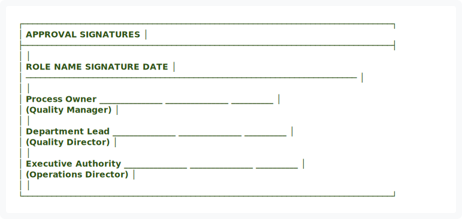
</div>

<details>
<summary>View ASCII Source</summary>

```
┌─────────────────────────────────────────────────────────────────────────────┐
│                          APPROVAL SIGNATURES                                │
├─────────────────────────────────────────────────────────────────────────────┤
│                                                                             │
│   ROLE                    NAME              SIGNATURE          DATE         │
│   ─────────────────────────────────────────────────────────────────────     │
│                                                                             │
│   Process Owner           _______________   _______________   __________   │
│   (Quality Manager)                                                         │
│                                                                             │
│   Department Lead         _______________   _______________   __________   │
│   (Quality Director)                                                        │
│                                                                             │
│   Executive Authority     _______________   _______________   __________   │
│   (Operations Director)                                                     │
│                                                                             │
└─────────────────────────────────────────────────────────────────────────────┘
```
</details>


</div>

---

<div align="center">


<div align="center">
  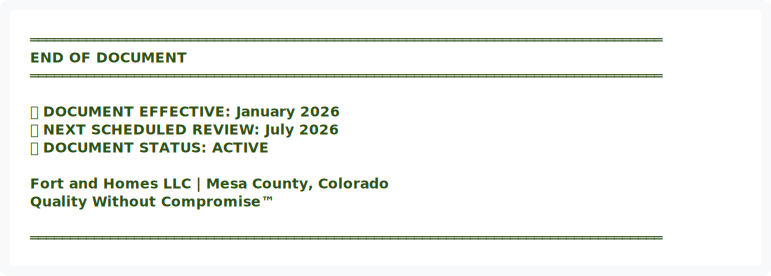
</div>

<details>
<summary>View ASCII Source</summary>

```
═══════════════════════════════════════════════════════════════════════════════
                            END OF DOCUMENT
═══════════════════════════════════════════════════════════════════════════════

   📅 DOCUMENT EFFECTIVE: January 2026
   🔄 NEXT SCHEDULED REVIEW: July 2026
   ✅ DOCUMENT STATUS: ACTIVE

                    Fort and Homes LLC | Mesa County, Colorado
                           Quality Without Compromise™

═══════════════════════════════════════════════════════════════════════════════
```
</details>


</div>
