<div align="center">


<div align="center">
  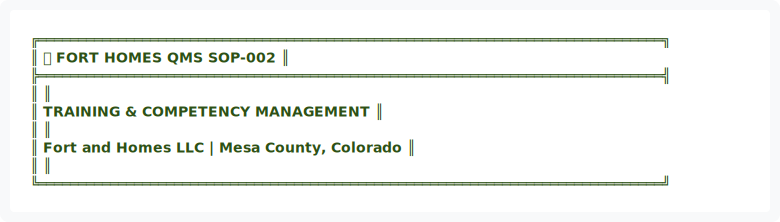
</div>

<details>
<summary>View ASCII Source</summary>

```
╔══════════════════════════════════════════════════════════════════════════════╗
║  🏗️ FORT HOMES QMS                                           SOP-002        ║
╠══════════════════════════════════════════════════════════════════════════════╣
║                                                                              ║
║              TRAINING & COMPETENCY MANAGEMENT                                ║
║                                                                              ║
║               Fort and Homes LLC | Mesa County, Colorado                     ║
║                                                                              ║
╚══════════════════════════════════════════════════════════════════════════════╝
```
</details>


| 📄 Document ID | 📋 Revision | 📅 Effective | 👤 Process Owner | 🔍 Next Review |
|:---:|:---:|:---:|:---:|:---:|
| `SOP-002` | `2.0` | `January 2026` | `HR Manager` | `July 2026` |

━━━━━━━━━━━━━━━━━━━━━━━━━━━━━━━━━━━━━━━━━━━━━━━━━━━━━━━━━━━━━━━━━━━━━━━━━━━━━━

</div>

---

## 📊 EXECUTIVE SUMMARY


<div align="center">
  
</div>

<details>
<summary>View ASCII Source</summary>

```
┌────────────────────────────────────────────────────────────────────────────┐
│                         📊 EXECUTIVE DASHBOARD                             │
├────────────────────────────────────────────────────────────────────────────┤
│                                                                            │
│   KEY METRICS                                                              │
│   ───────────────────────────────────────────────────────────             │
│   📈 Target: 40+ training hours/employee/year                             │
│   ✅ KPI: 95%+ competency assessment pass rate                            │
│   📅 Review: Annual refresher 100% completion                             │
│   🔍 Audit: Quarterly training records review                             │
│                                                                            │
│   CRITICAL SUCCESS FACTORS                                                 │
│   ───────────────────────────────────────────────────────────             │
│   • New hire competency within 30 days                                     │
│   • All personnel trained on current SOPs/WIs                              │
│   • Training records maintained for 3+ years                               │
│   • <5% NCRs attributed to training gaps                                   │
│                                                                            │
└────────────────────────────────────────────────────────────────────────────┘
```
</details>


---

## 🎯 1. PURPOSE

To establish a systematic approach for identifying training needs, delivering competency-based training, verifying employee competence, and maintaining training records. This ensures all personnel performing QMS-related work possess the knowledge, skills, and awareness to perform their jobs effectively and in compliance with quality standards and regulatory requirements.

---

## 📋 2. SCOPE

### 2.1 Training Categories

| 🎓 Training Type | Description | Applicability |
|:---|:---|:---|
| **New Employee Orientation** | Company overview, QMS introduction | All new hires |
| **Job-Specific Technical** | Role-based skills, procedures | Position-dependent |
| **Quality System Awareness** | QMS structure, document navigation | All personnel |
| **Regulatory Compliance** | CDOH, HUD Code, IRC requirements | QMS-related roles |
| **Safety Training** | OSHA, hazard awareness, PPE | All personnel |
| **Equipment Operation** | Tools, machinery, calibration | Equipment operators |
| **Annual Refresher** | Skills maintenance, updates | All active personnel |
| **Records Management** | Training documentation | HR, supervisors |

### 2.2 Personnel Coverage


<div align="center">
  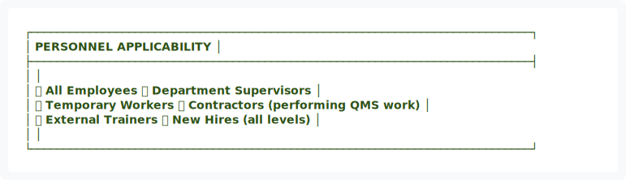
</div>

<details>
<summary>View ASCII Source</summary>

```
┌─────────────────────────────────────────────────────────────────────────────┐
│                         PERSONNEL APPLICABILITY                             │
├─────────────────────────────────────────────────────────────────────────────┤
│                                                                             │
│   ✅ All Employees            ✅ Department Supervisors                     │
│   ✅ Temporary Workers        ✅ Contractors (performing QMS work)          │
│   ✅ External Trainers        ✅ New Hires (all levels)                     │
│                                                                             │
└─────────────────────────────────────────────────────────────────────────────┘
```
</details>


---

## 📚 3. REFERENCES & STANDARDS

| Reference | Description | Authority |
|:---|:---|:---|
| CDOH Training Requirements | Colorado Division of Housing | State |
| HUD Code 24 CFR 3280 | Manufacturing Requirements | Federal |
| Fort and Homes LLC Quality Policy | Company quality objectives | Internal |
| SOP-001 | Document Control - Training Records | Internal |

---

## 👥 4. ROLES & RESPONSIBILITIES


<div align="center">
  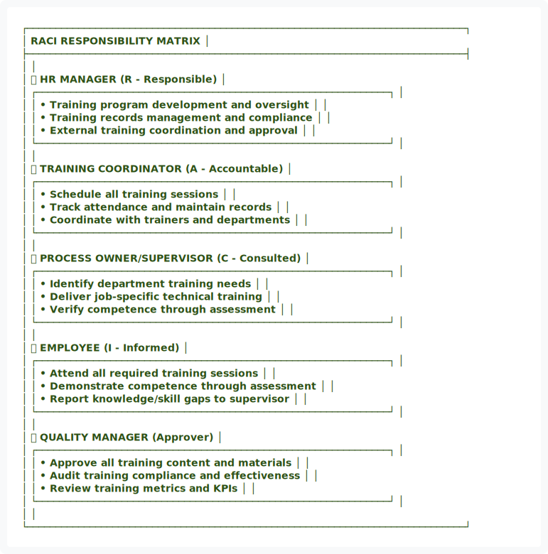
</div>

<details>
<summary>View ASCII Source</summary>

```
┌─────────────────────────────────────────────────────────────────────────────┐
│                        RACI RESPONSIBILITY MATRIX                           │
├─────────────────────────────────────────────────────────────────────────────┤
│                                                                             │
│   👤 HR MANAGER                  (R - Responsible)                          │
│   ┌──────────────────────────────────────────────────────────────┐         │
│   │ • Training program development and oversight                 │         │
│   │ • Training records management and compliance                 │         │
│   │ • External training coordination and approval                │         │
│   └──────────────────────────────────────────────────────────────┘         │
│                                                                             │
│   👤 TRAINING COORDINATOR        (A - Accountable)                          │
│   ┌──────────────────────────────────────────────────────────────┐         │
│   │ • Schedule all training sessions                             │         │
│   │ • Track attendance and maintain records                      │         │
│   │ • Coordinate with trainers and departments                   │         │
│   └──────────────────────────────────────────────────────────────┘         │
│                                                                             │
│   👤 PROCESS OWNER/SUPERVISOR    (C - Consulted)                            │
│   ┌──────────────────────────────────────────────────────────────┐         │
│   │ • Identify department training needs                         │         │
│   │ • Deliver job-specific technical training                    │         │
│   │ • Verify competence through assessment                       │         │
│   └──────────────────────────────────────────────────────────────┘         │
│                                                                             │
│   👤 EMPLOYEE                    (I - Informed)                             │
│   ┌──────────────────────────────────────────────────────────────┐         │
│   │ • Attend all required training sessions                      │         │
│   │ • Demonstrate competence through assessment                  │         │
│   │ • Report knowledge/skill gaps to supervisor                  │         │
│   └──────────────────────────────────────────────────────────────┘         │
│                                                                             │
│   👤 QUALITY MANAGER             (Approver)                                 │
│   ┌──────────────────────────────────────────────────────────────┐         │
│   │ • Approve all training content and materials                 │         │
│   │ • Audit training compliance and effectiveness                │         │
│   │ • Review training metrics and KPIs                           │         │
│   └──────────────────────────────────────────────────────────────┘         │
│                                                                             │
└─────────────────────────────────────────────────────────────────────────────┘
```
</details>


---

## 🔄 5. TRAINING PROCESS FLOWCHART


<div align="center">
  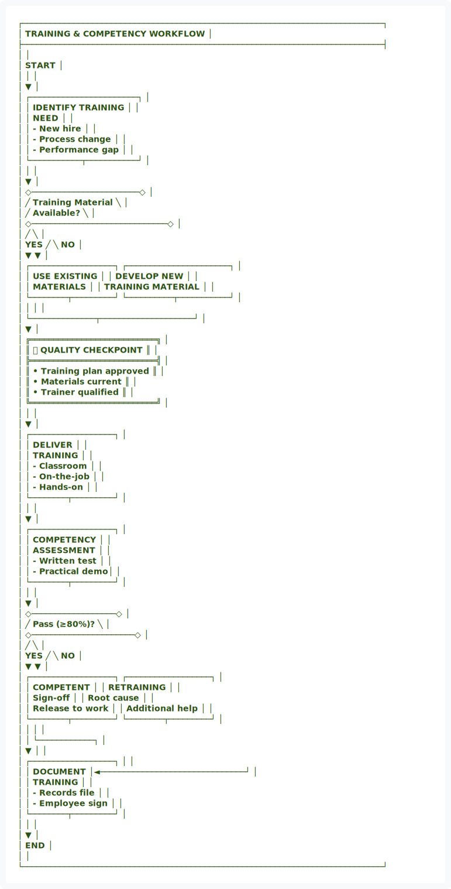
</div>

<details>
<summary>View ASCII Source</summary>

```
┌─────────────────────────────────────────────────────────────────────────────┐
│                    TRAINING & COMPETENCY WORKFLOW                           │
├─────────────────────────────────────────────────────────────────────────────┤
│                                                                             │
│                              START                                          │
│                                │                                            │
│                                ▼                                            │
│                    ┌───────────────────────┐                               │
│                    │  IDENTIFY TRAINING    │                               │
│                    │  NEED                 │                               │
│                    │  - New hire           │                               │
│                    │  - Process change     │                               │
│                    │  - Performance gap    │                               │
│                    └───────────┬───────────┘                               │
│                                │                                            │
│                                ▼                                            │
│                    ◇───────────────────────◇                               │
│                   ╱  Training Material      ╲                              │
│                  ╱   Available?              ╲                             │
│                 ◇─────────────────────────────◇                            │
│                ╱                               ╲                           │
│          YES  ╱                                 ╲  NO                      │
│              ▼                                   ▼                          │
│   ┌──────────────────┐              ┌──────────────────────┐               │
│   │  USE EXISTING    │              │  DEVELOP NEW         │               │
│   │  MATERIALS       │              │  TRAINING MATERIAL   │               │
│   └────────┬─────────┘              └──────────┬───────────┘               │
│            │                                   │                            │
│            └──────────────┬────────────────────┘                            │
│                           ▼                                                │
│            ╔═══════════════════════════╗                                   │
│            ║   ✅ QUALITY CHECKPOINT   ║                                   │
│            ╠═══════════════════════════╣                                   │
│            ║ • Training plan approved  ║                                   │
│            ║ • Materials current       ║                                   │
│            ║ • Trainer qualified       ║                                   │
│            ╚═══════════════════════════╝                                   │
│                           │                                                │
│                           ▼                                                │
│                    ┌──────────────────┐                                    │
│                    │  DELIVER         │                                    │
│                    │  TRAINING        │                                    │
│                    │  - Classroom     │                                    │
│                    │  - On-the-job    │                                    │
│                    │  - Hands-on      │                                    │
│                    └────────┬─────────┘                                    │
│                             │                                              │
│                             ▼                                              │
│                    ┌──────────────────┐                                    │
│                    │  COMPETENCY      │                                    │
│                    │  ASSESSMENT      │                                    │
│                    │  - Written test  │                                    │
│                    │  - Practical demo│                                    │
│                    └────────┬─────────┘                                    │
│                             │                                              │
│                             ▼                                              │
│                    ◇──────────────────◇                                    │
│                   ╱   Pass (≥80%)?     ╲                                   │
│                  ◇──────────────────────◇                                  │
│                 ╱                        ╲                                 │
│           YES  ╱                          ╲  NO                            │
│               ▼                            ▼                               │
│   ┌──────────────────┐          ┌──────────────────┐                      │
│   │  COMPETENT       │          │  RETRAINING      │                      │
│   │  Sign-off        │          │  Root cause      │                      │
│   │  Release to work │          │  Additional help │                      │
│   └────────┬─────────┘          └────────┬─────────┘                      │
│            │                              │                                │
│            │                              └────────────┐                   │
│            ▼                                           │                   │
│   ┌──────────────────┐                                │                   │
│   │  DOCUMENT        │◄───────────────────────────────┘                   │
│   │  TRAINING        │                                                    │
│   │  - Records file  │                                                    │
│   │  - Employee sign │                                                    │
│   └────────┬─────────┘                                                    │
│            │                                                              │
│            ▼                                                              │
│          END                                                              │
│                                                                             │
└─────────────────────────────────────────────────────────────────────────────┘
```
</details>


━━━━━━━━━━━━━━━━━━━━━━━━━━━━━━━━━━━━━━━━━━━━━━━━━━━━━━━━━━━━━━━━━━━━━━━━━━━━━━

## 🎯 6. TRAINING NEEDS ASSESSMENT

### 6.1 Identification Triggers


<div align="center">
  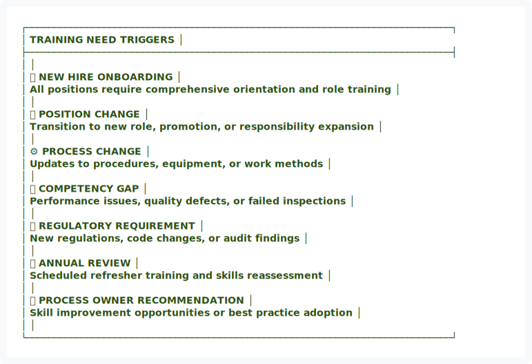
</div>

<details>
<summary>View ASCII Source</summary>

```
┌─────────────────────────────────────────────────────────────────────────────┐
│                       TRAINING NEED TRIGGERS                                │
├─────────────────────────────────────────────────────────────────────────────┤
│                                                                             │
│   🆕 NEW HIRE ONBOARDING                                                    │
│   All positions require comprehensive orientation and role training        │
│                                                                             │
│   🔄 POSITION CHANGE                                                        │
│   Transition to new role, promotion, or responsibility expansion           │
│                                                                             │
│   ⚙️ PROCESS CHANGE                                                         │
│   Updates to procedures, equipment, or work methods                        │
│                                                                             │
│   📉 COMPETENCY GAP                                                         │
│   Performance issues, quality defects, or failed inspections               │
│                                                                             │
│   📋 REGULATORY REQUIREMENT                                                 │
│   New regulations, code changes, or audit findings                         │
│                                                                             │
│   📅 ANNUAL REVIEW                                                          │
│   Scheduled refresher training and skills reassessment                     │
│                                                                             │
│   💡 PROCESS OWNER RECOMMENDATION                                           │
│   Skill improvement opportunities or best practice adoption                │
│                                                                             │
└─────────────────────────────────────────────────────────────────────────────┘
```
</details>


### 6.2 Training Needs Matrix

| Position | Required Training | Frequency | Delivery Method |
|:---|:---|:---:|:---|
| 🔧 Production Technician | QMS Orientation, Phase SOPs, Safety | Annual + New Hire | Classroom + On-job |
| 👷 Bay Supervisor | All above + Inspection, Leadership | Annual + New Hire | Classroom + Online |
| 🔍 Quality Inspector | All above + Advanced Inspection | Annual + New Hire | Advanced course |
| 👤 Manager/Lead | All above + Auditing, Regulatory | Annual + New Hire | Advanced course |


<div align="center">
  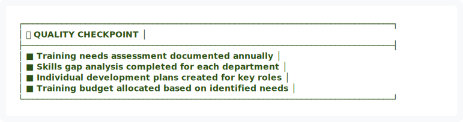
</div>

<details>
<summary>View ASCII Source</summary>

```
┌─────────────────────────────────────────────────────────────────────────────┐
│ ✅ QUALITY CHECKPOINT                                                       │
├─────────────────────────────────────────────────────────────────────────────┤
│ ■ Training needs assessment documented annually                            │
│ ■ Skills gap analysis completed for each department                        │
│ ■ Individual development plans created for key roles                       │
│ ■ Training budget allocated based on identified needs                      │
└─────────────────────────────────────────────────────────────────────────────┘
```
</details>


━━━━━━━━━━━━━━━━━━━━━━━━━━━━━━━━━━━━━━━━━━━━━━━━━━━━━━━━━━━━━━━━━━━━━━━━━━━━━━

## 📚 7. TRAINING PROGRAM DEVELOPMENT

### 7.1 Training Content Requirements

All training materials must include:

| Component | Requirement | Purpose |
|:---|:---|:---|
| 🎯 **Objectives** | Clear, measurable learning outcomes | Define success criteria |
| 📝 **Content** | Aligned with current SOPs/WIs | Ensure accuracy |
| 🖼️ **Visual Aids** | Diagrams, photographs, videos | Support learning styles |
| 💼 **Examples** | Real-world production scenarios | Practical application |
| ✅ **Assessment** | Knowledge check or practical demo | Verify competence |
| ⏱️ **Duration** | Realistic time allocation | Proper coverage |
| ♿ **Accessibility** | Multiple learning styles supported | Inclusive training |

### 7.2 Training Delivery Methods

| Method | Best For | Duration |
|:---|:---|:---:|
| 🏫 **Classroom Lecture** | Large groups, theory, awareness | 1-4 hours |
| 🔧 **On-the-Job Training** | Technical skills, procedures, hands-on | 1-3 days |
| 💻 **Online/Video** | Self-paced, distributed locations | Variable |
| 🛠️ **Workshop/Hands-on Lab** | Equipment operation, inspection | 4-8 hours |
| 👥 **One-on-One Coaching** | Skill refinement, challenges | 1-2 hours |
| 🎓 **External Course** | Specialized training, certifications | Variable |

━━━━━━━━━━━━━━━━━━━━━━━━━━━━━━━━━━━━━━━━━━━━━━━━━━━━━━━━━━━━━━━━━━━━━━━━━━━━━━

## 🆕 8. NEW EMPLOYEE ONBOARDING

### 8.1 Onboarding Timeline


<div align="center">
  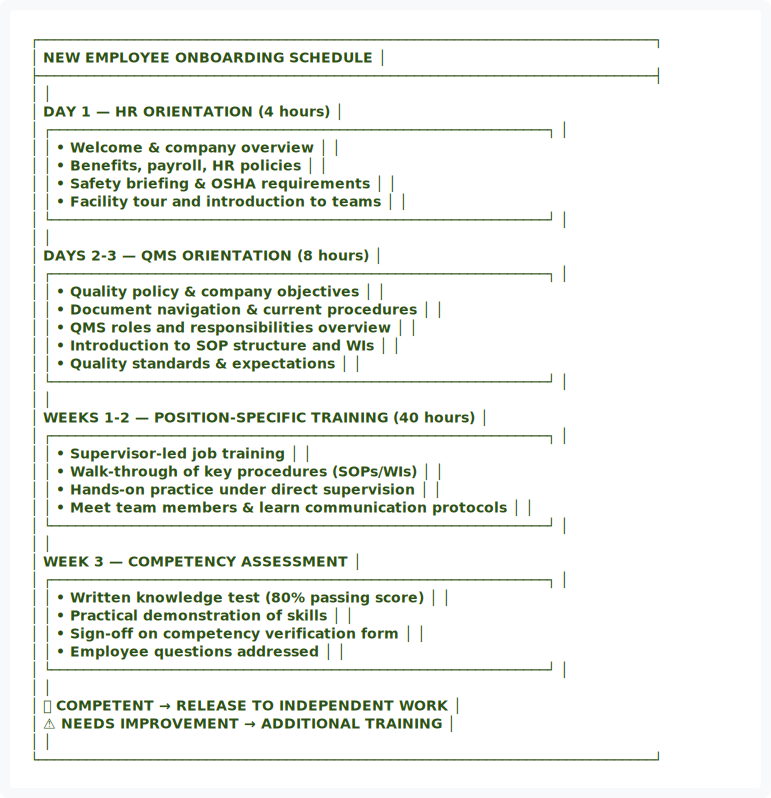
</div>

<details>
<summary>View ASCII Source</summary>

```
┌─────────────────────────────────────────────────────────────────────────────┐
│                    NEW EMPLOYEE ONBOARDING SCHEDULE                         │
├─────────────────────────────────────────────────────────────────────────────┤
│                                                                             │
│   DAY 1 — HR ORIENTATION (4 hours)                                         │
│   ┌──────────────────────────────────────────────────────────────┐         │
│   │ • Welcome & company overview                                 │         │
│   │ • Benefits, payroll, HR policies                             │         │
│   │ • Safety briefing & OSHA requirements                        │         │
│   │ • Facility tour and introduction to teams                    │         │
│   └──────────────────────────────────────────────────────────────┘         │
│                                                                             │
│   DAYS 2-3 — QMS ORIENTATION (8 hours)                                     │
│   ┌──────────────────────────────────────────────────────────────┐         │
│   │ • Quality policy & company objectives                        │         │
│   │ • Document navigation & current procedures                   │         │
│   │ • QMS roles and responsibilities overview                    │         │
│   │ • Introduction to SOP structure and WIs                      │         │
│   │ • Quality standards & expectations                           │         │
│   └──────────────────────────────────────────────────────────────┘         │
│                                                                             │
│   WEEKS 1-2 — POSITION-SPECIFIC TRAINING (40 hours)                        │
│   ┌──────────────────────────────────────────────────────────────┐         │
│   │ • Supervisor-led job training                                │         │
│   │ • Walk-through of key procedures (SOPs/WIs)                  │         │
│   │ • Hands-on practice under direct supervision                 │         │
│   │ • Meet team members & learn communication protocols          │         │
│   └──────────────────────────────────────────────────────────────┘         │
│                                                                             │
│   WEEK 3 — COMPETENCY ASSESSMENT                                           │
│   ┌──────────────────────────────────────────────────────────────┐         │
│   │ • Written knowledge test (80% passing score)                 │         │
│   │ • Practical demonstration of skills                          │         │
│   │ • Sign-off on competency verification form                   │         │
│   │ • Employee questions addressed                               │         │
│   └──────────────────────────────────────────────────────────────┘         │
│                                                                             │
│              ✅ COMPETENT → RELEASE TO INDEPENDENT WORK                     │
│              ⚠️ NEEDS IMPROVEMENT → ADDITIONAL TRAINING                     │
│                                                                             │
└─────────────────────────────────────────────────────────────────────────────┘
```
</details>


### 8.2 Onboarding Checklist

| Item | Date | Trainer | Status |
|:---|:---:|:---|:---:|
| HR Orientation completed | _____ | HR | ☐ |
| Safety training completed | _____ | Safety Manager | ☐ |
| QMS Orientation completed | _____ | Quality Manager | ☐ |
| Position-specific training started | _____ | Supervisor | ☐ |
| SOP review completed | _____ | Supervisor | ☐ |
| Hands-on practice completed | _____ | Supervisor | ☐ |
| Competency assessment passed | _____ | Supervisor | ☐ |


<div align="center">
  
</div>

<details>
<summary>View ASCII Source</summary>

```
┌─────────────────────────────────────────────────────────────────────────────┐
│ ✅ QUALITY CHECKPOINT — NEW HIRE ONBOARDING                                 │
├─────────────────────────────────────────────────────────────────────────────┤
│ ■ All onboarding checklist items completed and signed                      │
│ ■ Competency assessment passed (≥80% on written, practical demo approved)  │
│ ■ Training records filed in employee personnel file                        │
│ ■ Employee released to independent work with supervisor approval           │
└─────────────────────────────────────────────────────────────────────────────┘
```
</details>


━━━━━━━━━━━━━━━━━━━━━━━━━━━━━━━━━━━━━━━━━━━━━━━━━━━━━━━━━━━━━━━━━━━━━━━━━━━━━━

## 🏭 9. JOB-SPECIFIC TRAINING DELIVERY

### 9.1 Production Phase Training Structure

For each production phase (Phases 1-8):


<div align="center">
  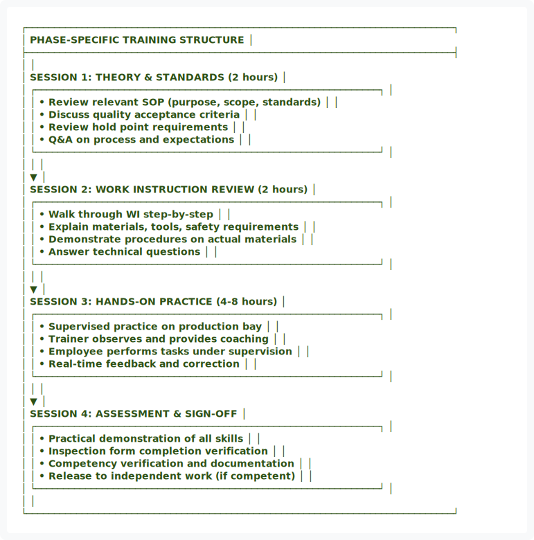
</div>

<details>
<summary>View ASCII Source</summary>

```
┌─────────────────────────────────────────────────────────────────────────────┐
│                  PHASE-SPECIFIC TRAINING STRUCTURE                          │
├─────────────────────────────────────────────────────────────────────────────┤
│                                                                             │
│   SESSION 1: THEORY & STANDARDS (2 hours)                                  │
│   ┌──────────────────────────────────────────────────────────────┐         │
│   │ • Review relevant SOP (purpose, scope, standards)            │         │
│   │ • Discuss quality acceptance criteria                        │         │
│   │ • Review hold point requirements                             │         │
│   │ • Q&A on process and expectations                            │         │
│   └──────────────────────────────────────────────────────────────┘         │
│                          │                                                  │
│                          ▼                                                  │
│   SESSION 2: WORK INSTRUCTION REVIEW (2 hours)                             │
│   ┌──────────────────────────────────────────────────────────────┐         │
│   │ • Walk through WI step-by-step                               │         │
│   │ • Explain materials, tools, safety requirements              │         │
│   │ • Demonstrate procedures on actual materials                 │         │
│   │ • Answer technical questions                                 │         │
│   └──────────────────────────────────────────────────────────────┘         │
│                          │                                                  │
│                          ▼                                                  │
│   SESSION 3: HANDS-ON PRACTICE (4-8 hours)                                 │
│   ┌──────────────────────────────────────────────────────────────┐         │
│   │ • Supervised practice on production bay                      │         │
│   │ • Trainer observes and provides coaching                     │         │
│   │ • Employee performs tasks under supervision                  │         │
│   │ • Real-time feedback and correction                          │         │
│   └──────────────────────────────────────────────────────────────┘         │
│                          │                                                  │
│                          ▼                                                  │
│   SESSION 4: ASSESSMENT & SIGN-OFF                                         │
│   ┌──────────────────────────────────────────────────────────────┐         │
│   │ • Practical demonstration of all skills                      │         │
│   │ • Inspection form completion verification                    │         │
│   │ • Competency verification and documentation                  │         │
│   │ • Release to independent work (if competent)                 │         │
│   └──────────────────────────────────────────────────────────────┘         │
│                                                                             │
└─────────────────────────────────────────────────────────────────────────────┘
```
</details>


━━━━━━━━━━━━━━━━━━━━━━━━━━━━━━━━━━━━━━━━━━━━━━━━━━━━━━━━━━━━━━━━━━━━━━━━━━━━━━

## ✅ 10. COMPETENCY VERIFICATION & ASSESSMENT

### 10.1 Assessment Methods

| Method | Assessment Type | Scoring Criteria |
|:---|:---|:---|
| ✍️ **Written Test** | Knowledge verification | ≥80% passing score |
| 🔧 **Practical Demo** | Skills demonstration | Supervisor sign-off required |
| 👀 **On-Job Observation** | Application in real work | Meets standard or needs retraining |
| 📊 **Inspection Results** | Performance quality | Metrics within specification |
| 📋 **Supervisor Evaluation** | Overall competence | Meets all competency requirements |

### 10.2 Competency Verification Form


<div align="center">
  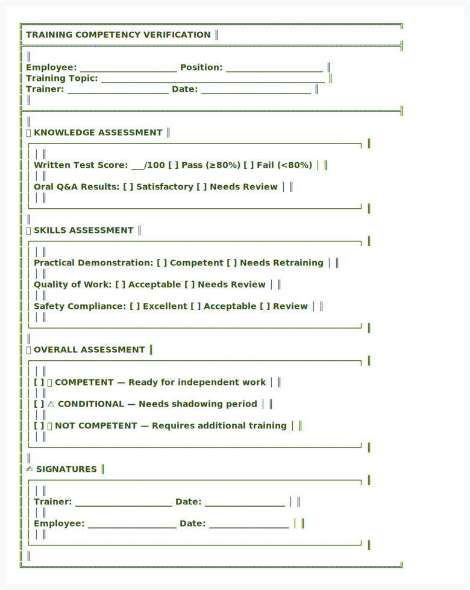
</div>

<details>
<summary>View ASCII Source</summary>

```
╔══════════════════════════════════════════════════════════════════════════════╗
║                   TRAINING COMPETENCY VERIFICATION                           ║
╠══════════════════════════════════════════════════════════════════════════════╣
║                                                                              ║
║   Employee: _______________________    Position: _______________________    ║
║   Training Topic: _____________________________________________________     ║
║   Trainer: ________________________    Date: __________________________     ║
║                                                                              ║
╠══════════════════════════════════════════════════════════════════════════════╣
║                                                                              ║
║   📝 KNOWLEDGE ASSESSMENT                                                    ║
║   ┌────────────────────────────────────────────────────────────────────┐    ║
║   │                                                                    │    ║
║   │   Written Test Score: ___/100    [ ] Pass (≥80%)  [ ] Fail (<80%) │    ║
║   │                                                                    │    ║
║   │   Oral Q&A Results:    [ ] Satisfactory    [ ] Needs Review       │    ║
║   │                                                                    │    ║
║   └────────────────────────────────────────────────────────────────────┘    ║
║                                                                              ║
║   🔧 SKILLS ASSESSMENT                                                       ║
║   ┌────────────────────────────────────────────────────────────────────┐    ║
║   │                                                                    │    ║
║   │   Practical Demonstration:  [ ] Competent  [ ] Needs Retraining   │    ║
║   │                                                                    │    ║
║   │   Quality of Work:   [ ] Acceptable  [ ] Needs Review              │    ║
║   │                                                                    │    ║
║   │   Safety Compliance: [ ] Excellent  [ ] Acceptable  [ ] Review     │    ║
║   │                                                                    │    ║
║   └────────────────────────────────────────────────────────────────────┘    ║
║                                                                              ║
║   📊 OVERALL ASSESSMENT                                                      ║
║   ┌────────────────────────────────────────────────────────────────────┐    ║
║   │                                                                    │    ║
║   │   [ ] ✅ COMPETENT — Ready for independent work                    │    ║
║   │                                                                    │    ║
║   │   [ ] ⚠️ CONDITIONAL — Needs shadowing period                      │    ║
║   │                                                                    │    ║
║   │   [ ] ❌ NOT COMPETENT — Requires additional training              │    ║
║   │                                                                    │    ║
║   └────────────────────────────────────────────────────────────────────┘    ║
║                                                                              ║
║   ✍️ SIGNATURES                                                              ║
║   ┌────────────────────────────────────────────────────────────────────┐    ║
║   │                                                                    │    ║
║   │   Trainer: _______________________   Date: ___________________    │    ║
║   │                                                                    │    ║
║   │   Employee: _____________________    Date: ___________________    │    ║
║   │                                                                    │    ║
║   └────────────────────────────────────────────────────────────────────┘    ║
║                                                                              ║
╚══════════════════════════════════════════════════════════════════════════════╝
```
</details>


━━━━━━━━━━━━━━━━━━━━━━━━━━━━━━━━━━━━━━━━━━━━━━━━━━━━━━━━━━━━━━━━━━━━━━━━━━━━━━

## 🔄 11. ANNUAL REFRESHER & COMPETENCY MAINTENANCE

### 11.1 Annual Requirements


<div align="center">
  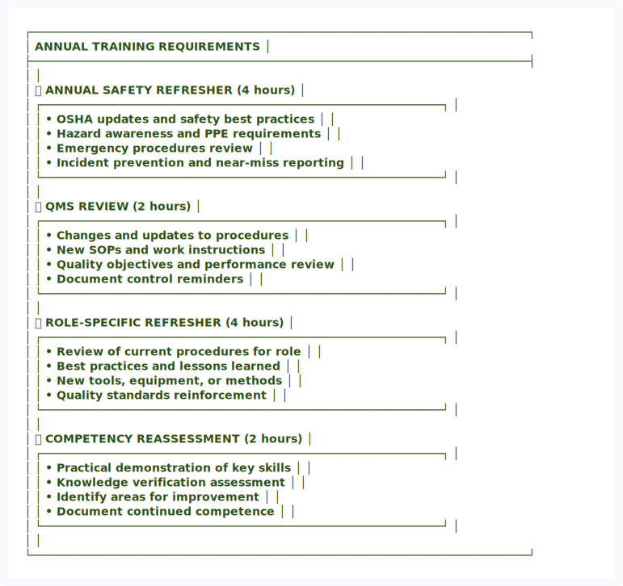
</div>

<details>
<summary>View ASCII Source</summary>

```
┌─────────────────────────────────────────────────────────────────────────────┐
│                     ANNUAL TRAINING REQUIREMENTS                            │
├─────────────────────────────────────────────────────────────────────────────┤
│                                                                             │
│   🔒 ANNUAL SAFETY REFRESHER                                (4 hours)      │
│   ┌──────────────────────────────────────────────────────────────┐         │
│   │ • OSHA updates and safety best practices                     │         │
│   │ • Hazard awareness and PPE requirements                      │         │
│   │ • Emergency procedures review                                │         │
│   │ • Incident prevention and near-miss reporting                │         │
│   └──────────────────────────────────────────────────────────────┘         │
│                                                                             │
│   📋 QMS REVIEW                                             (2 hours)      │
│   ┌──────────────────────────────────────────────────────────────┐         │
│   │ • Changes and updates to procedures                          │         │
│   │ • New SOPs and work instructions                             │         │
│   │ • Quality objectives and performance review                  │         │
│   │ • Document control reminders                                 │         │
│   └──────────────────────────────────────────────────────────────┘         │
│                                                                             │
│   🔧 ROLE-SPECIFIC REFRESHER                               (4 hours)      │
│   ┌──────────────────────────────────────────────────────────────┐         │
│   │ • Review of current procedures for role                      │         │
│   │ • Best practices and lessons learned                         │         │
│   │ • New tools, equipment, or methods                           │         │
│   │ • Quality standards reinforcement                            │         │
│   └──────────────────────────────────────────────────────────────┘         │
│                                                                             │
│   ✅ COMPETENCY REASSESSMENT                               (2 hours)      │
│   ┌──────────────────────────────────────────────────────────────┐         │
│   │ • Practical demonstration of key skills                      │         │
│   │ • Knowledge verification assessment                          │         │
│   │ • Identify areas for improvement                             │         │
│   │ • Document continued competence                              │         │
│   └──────────────────────────────────────────────────────────────┘         │
│                                                                             │
└─────────────────────────────────────────────────────────────────────────────┘
```
</details>


### 11.2 Performance-Based Retraining

If employee shows performance gaps:

| Step | Action | Responsible |
|:---:|:---|:---|
| 1️⃣ | Document specific performance issue | Supervisor |
| 2️⃣ | Root cause analysis (skill vs. other factors) | Supervisor + HR |
| 3️⃣ | Provide targeted retraining | Trainer |
| 4️⃣ | Competency reassessment | Supervisor |
| 5️⃣ | Performance improvement plan (if needed) | HR Manager |

━━━━━━━━━━━━━━━━━━━━━━━━━━━━━━━━━━━━━━━━━━━━━━━━━━━━━━━━━━━━━━━━━━━━━━━━━━━━━━

## 📁 12. TRAINING RECORDS & DOCUMENTATION

### 12.1 Required Records

For each training event, maintain:

| Record Type | Content | Format |
|:---|:---|:---|
| 📋 **Training Attendance Sheet** | Names, dates, hours completed | Paper/Digital |
| 📝 **Training Material/Agenda** | Content covered, objectives | Digital copy |
| ✅ **Competency Assessment Form** | Test results, practical demo | Original signed |
| 📊 **Test or Evaluation Results** | Scores, performance data | Digital record |
| ✍️ **Employee Signature** | Acknowledgment of completion | Original signed |
| 👤 **Trainer Information** | Name, qualifications, credentials | Personnel file |

### 12.2 Record Storage & Retention


<div align="center">
  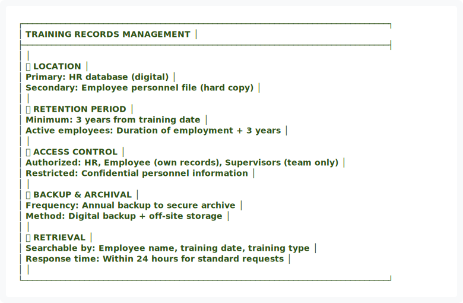
</div>

<details>
<summary>View ASCII Source</summary>

```
┌─────────────────────────────────────────────────────────────────────────────┐
│                      TRAINING RECORDS MANAGEMENT                            │
├─────────────────────────────────────────────────────────────────────────────┤
│                                                                             │
│   📍 LOCATION                                                               │
│   Primary: HR database (digital)                                            │
│   Secondary: Employee personnel file (hard copy)                            │
│                                                                             │
│   ⏱️ RETENTION PERIOD                                                        │
│   Minimum: 3 years from training date                                       │
│   Active employees: Duration of employment + 3 years                        │
│                                                                             │
│   🔐 ACCESS CONTROL                                                         │
│   Authorized: HR, Employee (own records), Supervisors (team only)           │
│   Restricted: Confidential personnel information                            │
│                                                                             │
│   💾 BACKUP & ARCHIVAL                                                      │
│   Frequency: Annual backup to secure archive                                │
│   Method: Digital backup + off-site storage                                 │
│                                                                             │
│   🔍 RETRIEVAL                                                              │
│   Searchable by: Employee name, training date, training type                │
│   Response time: Within 24 hours for standard requests                      │
│                                                                             │
└─────────────────────────────────────────────────────────────────────────────┘
```
</details>


<div align="center">
  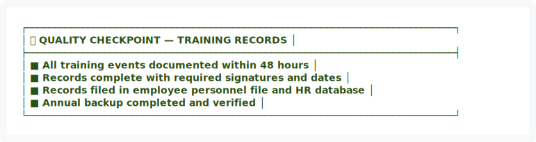
</div>

<details>
<summary>View ASCII Source</summary>

```
┌─────────────────────────────────────────────────────────────────────────────┐
│ ✅ QUALITY CHECKPOINT — TRAINING RECORDS                                    │
├─────────────────────────────────────────────────────────────────────────────┤
│ ■ All training events documented within 48 hours                           │
│ ■ Records complete with required signatures and dates                      │
│ ■ Records filed in employee personnel file and HR database                 │
│ ■ Annual backup completed and verified                                     │
└─────────────────────────────────────────────────────────────────────────────┘
```
</details>


━━━━━━━━━━━━━━━━━━━━━━━━━━━━━━━━━━━━━━━━━━━━━━━━━━━━━━━━━━━━━━━━━━━━━━━━━━━━━━

## 🎓 13. EXTERNAL TRAINING & CERTIFICATIONS

### 13.1 Approved External Training

| Training Category | Examples | Purpose |
|:---|:---|:---|
| 🏭 **CDOH-Approved Training** | Manufacturer certification | Regulatory compliance |
| 📋 **HUD Code Workshops** | Code compliance seminars | Standards knowledge |
| 🔧 **Equipment Certifications** | Welding, forklift, crane | Safe equipment operation |
| 🔍 **Quality Auditor Training** | Internal/external auditing | Audit competence |
| 🔒 **Safety Certifications** | OSHA 30, First Aid, CPR | Safety compliance |

### 13.2 External Training Process


<div align="center">
  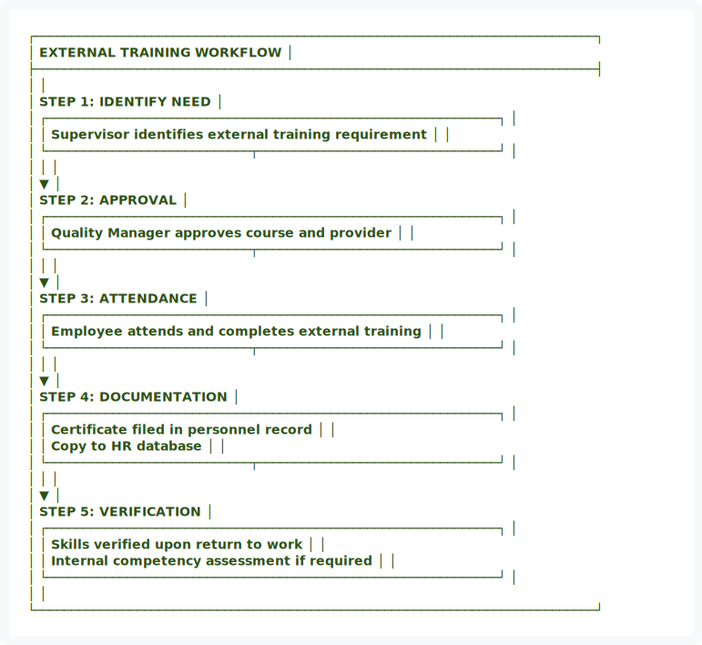
</div>

<details>
<summary>View ASCII Source</summary>

```
┌─────────────────────────────────────────────────────────────────────────────┐
│                    EXTERNAL TRAINING WORKFLOW                               │
├─────────────────────────────────────────────────────────────────────────────┤
│                                                                             │
│   STEP 1: IDENTIFY NEED                                                    │
│   ┌──────────────────────────────────────────────────────────────┐         │
│   │ Supervisor identifies external training requirement          │         │
│   └────────────────────────────┬─────────────────────────────────┘         │
│                                │                                            │
│                                ▼                                            │
│   STEP 2: APPROVAL                                                         │
│   ┌──────────────────────────────────────────────────────────────┐         │
│   │ Quality Manager approves course and provider                 │         │
│   └────────────────────────────┬─────────────────────────────────┘         │
│                                │                                            │
│                                ▼                                            │
│   STEP 3: ATTENDANCE                                                       │
│   ┌──────────────────────────────────────────────────────────────┐         │
│   │ Employee attends and completes external training             │         │
│   └────────────────────────────┬─────────────────────────────────┘         │
│                                │                                            │
│                                ▼                                            │
│   STEP 4: DOCUMENTATION                                                    │
│   ┌──────────────────────────────────────────────────────────────┐         │
│   │ Certificate filed in personnel record                        │         │
│   │ Copy to HR database                                          │         │
│   └────────────────────────────┬─────────────────────────────────┘         │
│                                │                                            │
│                                ▼                                            │
│   STEP 5: VERIFICATION                                                     │
│   ┌──────────────────────────────────────────────────────────────┐         │
│   │ Skills verified upon return to work                          │         │
│   │ Internal competency assessment if required                   │         │
│   └──────────────────────────────────────────────────────────────┘         │
│                                                                             │
└─────────────────────────────────────────────────────────────────────────────┘
```
</details>


━━━━━━━━━━━━━━━━━━━━━━━━━━━━━━━━━━━━━━━━━━━━━━━━━━━━━━━━━━━━━━━━━━━━━━━━━━━━━━

## 📊 14. TRAINING METRICS & PERFORMANCE INDICATORS


<div align="center">
  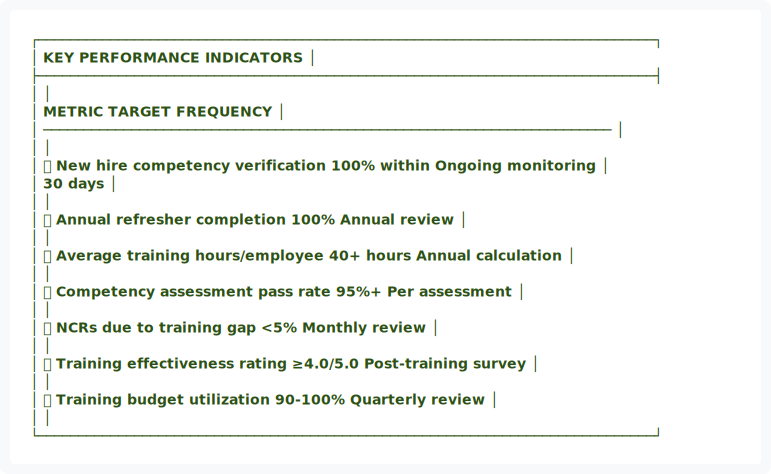
</div>

<details>
<summary>View ASCII Source</summary>

```
┌─────────────────────────────────────────────────────────────────────────────┐
│                          KEY PERFORMANCE INDICATORS                         │
├─────────────────────────────────────────────────────────────────────────────┤
│                                                                             │
│   METRIC                              TARGET         FREQUENCY              │
│   ───────────────────────────────────────────────────────────────────────  │
│                                                                             │
│   📈 New hire competency verification  100% within    Ongoing monitoring   │
│                                        30 days                              │
│                                                                             │
│   📅 Annual refresher completion       100%           Annual review         │
│                                                                             │
│   ⏱️ Average training hours/employee   40+ hours      Annual calculation   │
│                                                                             │
│   ✅ Competency assessment pass rate   95%+           Per assessment        │
│                                                                             │
│   🔴 NCRs due to training gap          <5%            Monthly review        │
│                                                                             │
│   📊 Training effectiveness rating     ≥4.0/5.0       Post-training survey │
│                                                                             │
│   🎯 Training budget utilization       90-100%        Quarterly review      │
│                                                                             │
└─────────────────────────────────────────────────────────────────────────────┘
```
</details>


<div align="center">
  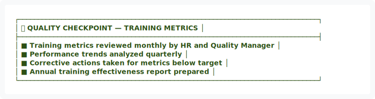
</div>

<details>
<summary>View ASCII Source</summary>

```
┌─────────────────────────────────────────────────────────────────────────────┐
│ ✅ QUALITY CHECKPOINT — TRAINING METRICS                                    │
├─────────────────────────────────────────────────────────────────────────────┤
│ ■ Training metrics reviewed monthly by HR and Quality Manager               │
│ ■ Performance trends analyzed quarterly                                    │
│ ■ Corrective actions taken for metrics below target                        │
│ ■ Annual training effectiveness report prepared                            │
└─────────────────────────────────────────────────────────────────────────────┘
```
</details>


━━━━━━━━━━━━━━━━━━━━━━━━━━━━━━━━━━━━━━━━━━━━━━━━━━━━━━━━━━━━━━━━━━━━━━━━━━━━━━

## 🔒 15. SAFETY & HEALTH CONSIDERATIONS

Training must address all relevant safety and health topics:

| Hazard Category | Training Content | Frequency |
|:---|:---|:---:|
| ⚠️ **Physical Hazards** | Tools, equipment, materials handling | Initial + Annual |
| 🧪 **Chemical Hazards** | Adhesives, sealants, paints, SDS review | Initial + Annual |
| 🏋️ **Ergonomic Hazards** | Lifting techniques, repetitive motion | Initial + Ongoing |
| 🌡️ **Environmental** | Noise, temperature, ventilation | Initial + Annual |
| 🚨 **Emergency Procedures** | Fire, injury response, spills | Initial + Semi-annual |

━━━━━━━━━━━━━━━━━━━━━━━━━━━━━━━━━━━━━━━━━━━━━━━━━━━━━━━━━━━━━━━━━━━━━━━━━━━━━━

## 📎 16. APPENDICES

### Appendix A: Training Schedule Template
**Location:** `docs/training/Training-Schedule-Template.md`

### Appendix B: Competency Matrix by Position
**Location:** `docs/training/Competency-Matrix-Template.md`

### Appendix C: Training Material Checklist
**Location:** `docs/training/Training-Material-Checklist.md`

---

## ✍️ APPROVAL & AUTHORITY

| Role | Name | Signature | Date |
|:---|:---|:---:|:---:|
| **Process Owner** | HR Manager | _________________ | _________ |
| **Quality Manager** | Quality Manager | _________________ | _________ |
| **Executive Authority** | Operations Director | _________________ | _________ |

---

## 📅 REVISION HISTORY

| Version | Date | Changes | Approved By |
|:---:|:---|:---|:---|
| 1.0 | 01/14/2026 | Initial training and competency procedure | HR Manager |
| 2.0 | 01/15/2026 | Applied visual design system upgrade | Quality Manager |

---

<div align="center">


<div align="center">
  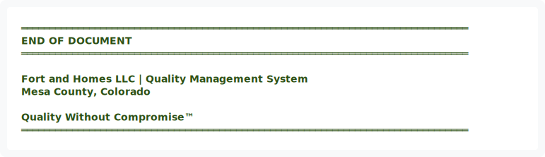
</div>

<details>
<summary>View ASCII Source</summary>

```
═══════════════════════════════════════════════════════════════════════════════
                              END OF DOCUMENT
═══════════════════════════════════════════════════════════════════════════════

              Fort and Homes LLC | Quality Management System
                        Mesa County, Colorado

                      Quality Without Compromise™
═══════════════════════════════════════════════════════════════════════════════
```
</details>


**DOCUMENT STATUS:** ✅ ACTIVE  
**EFFECTIVE DATE:** January 2026  
**NEXT REVIEW:** July 2026

</div>
