<div align="center">


<div align="center">
  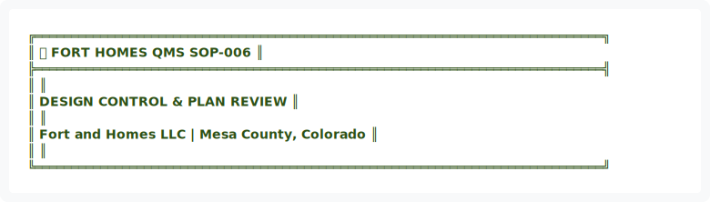
</div>

<details>
<summary>View ASCII Source</summary>

```
╔══════════════════════════════════════════════════════════════════════════════╗
║  🏗️ FORT HOMES QMS                                           SOP-006        ║
╠══════════════════════════════════════════════════════════════════════════════╣
║                                                                              ║
║              DESIGN CONTROL & PLAN REVIEW                                    ║
║                                                                              ║
║               Fort and Homes LLC | Mesa County, Colorado                     ║
║                                                                              ║
╚══════════════════════════════════════════════════════════════════════════════╝
```
</details>


| 📄 Document ID | 📋 Revision | 📅 Effective | 👤 Process Owner | 🔍 Next Review |
|:---:|:---:|:---:|:---:|:---:|
| `SOP-006` | `2.0` | `January 2026` | `Engineering Manager` | `July 2026` |

━━━━━━━━━━━━━━━━━━━━━━━━━━━━━━━━━━━━━━━━━━━━━━━━━━━━━━━━━━━━━━━━━━━━━━━━━━━━━━

</div>

---

## 📊 EXECUTIVE SUMMARY


<div align="center">
  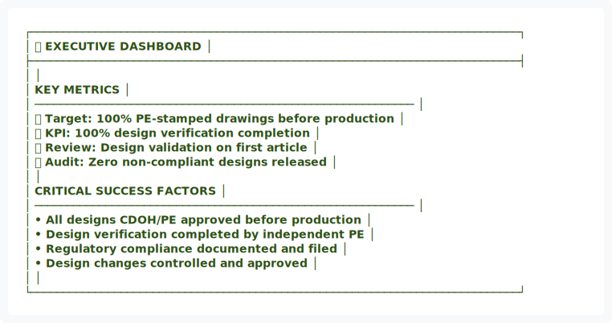
</div>

<details>
<summary>View ASCII Source</summary>

```
┌────────────────────────────────────────────────────────────────────────────┐
│                         📊 EXECUTIVE DASHBOARD                             │
├────────────────────────────────────────────────────────────────────────────┤
│                                                                            │
│   KEY METRICS                                                              │
│   ───────────────────────────────────────────────────────────             │
│   📐 Target: 100% PE-stamped drawings before production                   │
│   ✅ KPI: 100% design verification completion                             │
│   📅 Review: Design validation on first article                           │
│   🔍 Audit: Zero non-compliant designs released                           │
│                                                                            │
│   CRITICAL SUCCESS FACTORS                                                 │
│   ───────────────────────────────────────────────────────────             │
│   • All designs CDOH/PE approved before production                         │
│   • Design verification completed by independent PE                        │
│   • Regulatory compliance documented and filed                             │
│   • Design changes controlled and approved                                 │
│                                                                            │
└────────────────────────────────────────────────────────────────────────────┘
```
</details>


---

## 🎯 1. PURPOSE

To establish procedures for controlling the design and development of new modules and product variations, ensuring designs meet regulatory requirements (CDOH, HUD Code, IRC), customer needs, and company standards before release to production.

---

## 📋 2. SCOPE

### 2.1 Design Activities

Applies to:

| 🎨 Design Type | Description | Requirements |
|:---|:---|:---|
| **New module designs** | Completely new models | Full design process + regulatory approval |
| **Product variations** | Options and feature changes | Verification + compliance check |
| **Structural modifications** | Load-bearing changes | PE stamp + CDOH approval |
| **Layout changes** | Floor plan modifications | Code compliance + customer approval |
| **Component substitutions** | Material/system alternatives | Equivalency verification |

---

## 📚 3. REFERENCES & STANDARDS

| Reference | Description | Authority |
|:---|:---|:---|
| CDOH HUD Code Section 3280 | Manufactured housing standards | State/Federal |
| IRC Chapter 5-6 | Building code requirements | State |
| SOP-001 | Document Control | Internal |
| SOP-004 | Nonconformance & CAPA | Internal |

---

## 👥 4. ROLES & RESPONSIBILITIES


<div align="center">
  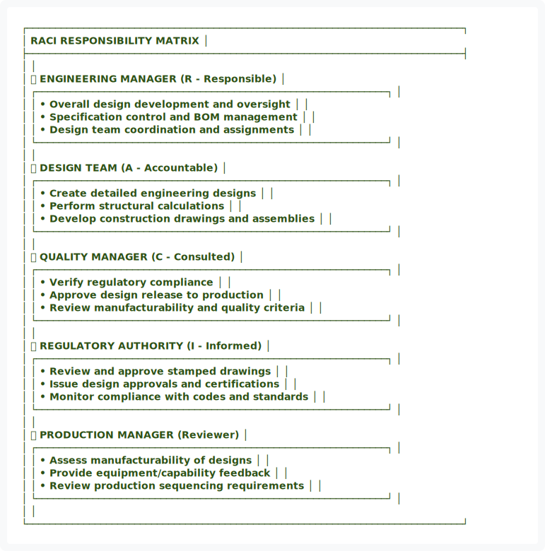
</div>

<details>
<summary>View ASCII Source</summary>

```
┌─────────────────────────────────────────────────────────────────────────────┐
│                        RACI RESPONSIBILITY MATRIX                           │
├─────────────────────────────────────────────────────────────────────────────┤
│                                                                             │
│   👤 ENGINEERING MANAGER         (R - Responsible)                          │
│   ┌──────────────────────────────────────────────────────────────┐         │
│   │ • Overall design development and oversight                   │         │
│   │ • Specification control and BOM management                   │         │
│   │ • Design team coordination and assignments                   │         │
│   └──────────────────────────────────────────────────────────────┘         │
│                                                                             │
│   👤 DESIGN TEAM                 (A - Accountable)                          │
│   ┌──────────────────────────────────────────────────────────────┐         │
│   │ • Create detailed engineering designs                        │         │
│   │ • Perform structural calculations                            │         │
│   │ • Develop construction drawings and assemblies               │         │
│   └──────────────────────────────────────────────────────────────┘         │
│                                                                             │
│   👤 QUALITY MANAGER             (C - Consulted)                            │
│   ┌──────────────────────────────────────────────────────────────┐         │
│   │ • Verify regulatory compliance                               │         │
│   │ • Approve design release to production                       │         │
│   │ • Review manufacturability and quality criteria              │         │
│   └──────────────────────────────────────────────────────────────┘         │
│                                                                             │
│   👤 REGULATORY AUTHORITY        (I - Informed)                             │
│   ┌──────────────────────────────────────────────────────────────┐         │
│   │ • Review and approve stamped drawings                        │         │
│   │ • Issue design approvals and certifications                  │         │
│   │ • Monitor compliance with codes and standards                │         │
│   └──────────────────────────────────────────────────────────────┘         │
│                                                                             │
│   👤 PRODUCTION MANAGER          (Reviewer)                                 │
│   ┌──────────────────────────────────────────────────────────────┐         │
│   │ • Assess manufacturability of designs                        │         │
│   │ • Provide equipment/capability feedback                      │         │
│   │ • Review production sequencing requirements                  │         │
│   └──────────────────────────────────────────────────────────────┘         │
│                                                                             │
└─────────────────────────────────────────────────────────────────────────────┘
```
</details>


---

## 🔄 5. DESIGN PROCESS FLOWCHART


<div align="center">
  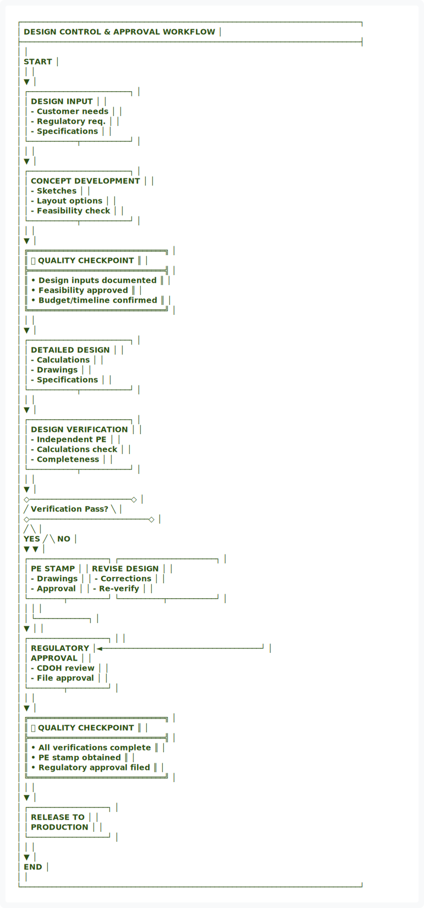
</div>

<details>
<summary>View ASCII Source</summary>

```
┌─────────────────────────────────────────────────────────────────────────────┐
│                    DESIGN CONTROL & APPROVAL WORKFLOW                       │
├─────────────────────────────────────────────────────────────────────────────┤
│                                                                             │
│                              START                                          │
│                                │                                            │
│                                ▼                                            │
│                    ┌───────────────────────┐                               │
│                    │  DESIGN INPUT         │                               │
│                    │  - Customer needs     │                               │
│                    │  - Regulatory req.    │                               │
│                    │  - Specifications     │                               │
│                    └───────────┬───────────┘                               │
│                                │                                            │
│                                ▼                                            │
│                    ┌───────────────────────┐                               │
│                    │  CONCEPT DEVELOPMENT  │                               │
│                    │  - Sketches           │                               │
│                    │  - Layout options     │                               │
│                    │  - Feasibility check  │                               │
│                    └───────────┬───────────┘                               │
│                                │                                            │
│                                ▼                                            │
│            ╔═══════════════════════════════╗                               │
│            ║   ✅ QUALITY CHECKPOINT       ║                               │
│            ╠═══════════════════════════════╣                               │
│            ║ • Design inputs documented    ║                               │
│            ║ • Feasibility approved        ║                               │
│            ║ • Budget/timeline confirmed   ║                               │
│            ╚═══════════════════════════════╝                               │
│                                │                                            │
│                                ▼                                            │
│                    ┌───────────────────────┐                               │
│                    │  DETAILED DESIGN      │                               │
│                    │  - Calculations       │                               │
│                    │  - Drawings           │                               │
│                    │  - Specifications     │                               │
│                    └───────────┬───────────┘                               │
│                                │                                            │
│                                ▼                                            │
│                    ┌───────────────────────┐                               │
│                    │  DESIGN VERIFICATION  │                               │
│                    │  - Independent PE     │                               │
│                    │  - Calculations check │                               │
│                    │  - Completeness       │                               │
│                    └───────────┬───────────┘                               │
│                                │                                            │
│                                ▼                                            │
│                    ◇───────────────────────◇                               │
│                   ╱  Verification Pass?     ╲                              │
│                  ◇───────────────────────────◇                             │
│                 ╱                             ╲                            │
│           YES  ╱                               ╲  NO                       │
│               ▼                                 ▼                          │
│   ┌──────────────────┐              ┌──────────────────────┐              │
│   │  PE STAMP        │              │  REVISE DESIGN       │              │
│   │  - Drawings      │              │  - Corrections       │              │
│   │  - Approval      │              │  - Re-verify         │              │
│   └────────┬─────────┘              └──────────┬───────────┘              │
│            │                                   │                           │
│            │                                   └────────────┐              │
│            ▼                                                │              │
│   ┌──────────────────┐                                     │              │
│   │  REGULATORY      │◄────────────────────────────────────┘              │
│   │  APPROVAL        │                                                    │
│   │  - CDOH review   │                                                    │
│   │  - File approval │                                                    │
│   └────────┬─────────┘                                                    │
│            │                                                              │
│            ▼                                                              │
│            ╔═══════════════════════════════╗                             │
│            ║   ✅ QUALITY CHECKPOINT       ║                             │
│            ╠═══════════════════════════════╣                             │
│            ║ • All verifications complete  ║                             │
│            ║ • PE stamp obtained           ║                             │
│            ║ • Regulatory approval filed   ║                             │
│            ╚═══════════════════════════════╝                             │
│                            │                                              │
│                            ▼                                              │
│                    ┌──────────────────┐                                   │
│                    │  RELEASE TO      │                                   │
│                    │  PRODUCTION      │                                   │
│                    └──────────────────┘                                   │
│                            │                                              │
│                            ▼                                              │
│                          END                                              │
│                                                                             │
└─────────────────────────────────────────────────────────────────────────────┘
```
</details>


━━━━━━━━━━━━━━━━━━━━━━━━━━━━━━━━━━━━━━━━━━━━━━━━━━━━━━━━━━━━━━━━━━━━━━━━━━━━━━

## 🎯 5. DESIGN INPUT

### 5.1 Requirements Documentation


<div align="center">
  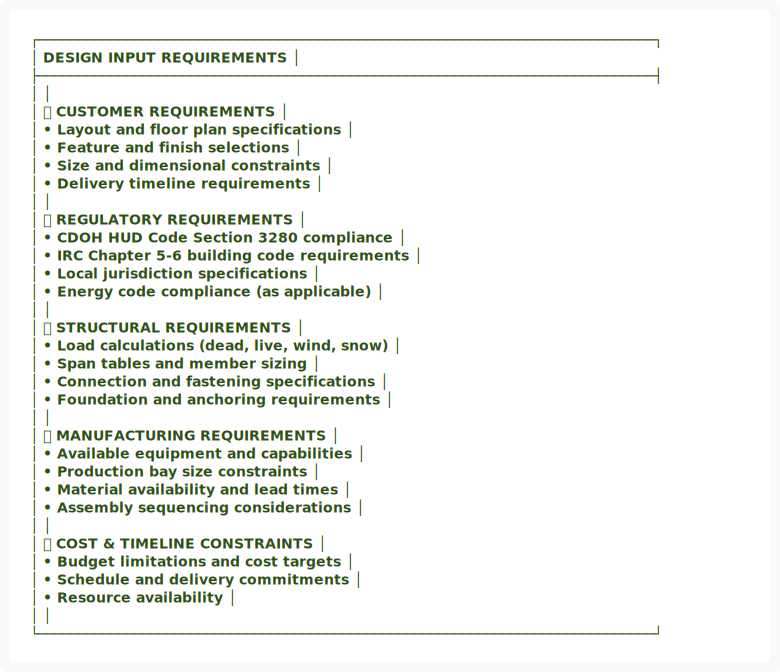
</div>

<details>
<summary>View ASCII Source</summary>

```
┌─────────────────────────────────────────────────────────────────────────────┐
│                       DESIGN INPUT REQUIREMENTS                             │
├─────────────────────────────────────────────────────────────────────────────┤
│                                                                             │
│   📝 CUSTOMER REQUIREMENTS                                                  │
│   • Layout and floor plan specifications                                    │
│   • Feature and finish selections                                           │
│   • Size and dimensional constraints                                        │
│   • Delivery timeline requirements                                          │
│                                                                             │
│   📋 REGULATORY REQUIREMENTS                                                │
│   • CDOH HUD Code Section 3280 compliance                                  │
│   • IRC Chapter 5-6 building code requirements                             │
│   • Local jurisdiction specifications                                       │
│   • Energy code compliance (as applicable)                                  │
│                                                                             │
│   🏗️ STRUCTURAL REQUIREMENTS                                                │
│   • Load calculations (dead, live, wind, snow)                             │
│   • Span tables and member sizing                                          │
│   • Connection and fastening specifications                                 │
│   • Foundation and anchoring requirements                                   │
│                                                                             │
│   🏭 MANUFACTURING REQUIREMENTS                                             │
│   • Available equipment and capabilities                                    │
│   • Production bay size constraints                                         │
│   • Material availability and lead times                                    │
│   • Assembly sequencing considerations                                      │
│                                                                             │
│   💰 COST & TIMELINE CONSTRAINTS                                            │
│   • Budget limitations and cost targets                                     │
│   • Schedule and delivery commitments                                       │
│   • Resource availability                                                   │
│                                                                             │
└─────────────────────────────────────────────────────────────────────────────┘
```
</details>


<div align="center">
  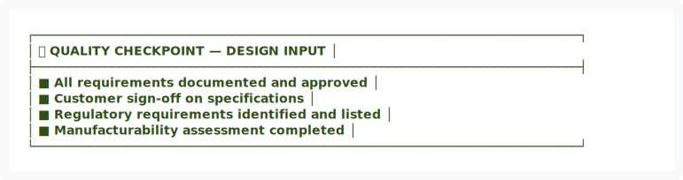
</div>

<details>
<summary>View ASCII Source</summary>

```
┌─────────────────────────────────────────────────────────────────────────────┐
│ ✅ QUALITY CHECKPOINT — DESIGN INPUT                                        │
├─────────────────────────────────────────────────────────────────────────────┤
│ ■ All requirements documented and approved                                 │
│ ■ Customer sign-off on specifications                                      │
│ ■ Regulatory requirements identified and listed                            │
│ ■ Manufacturability assessment completed                                   │
└─────────────────────────────────────────────────────────────────────────────┘
```
</details>


━━━━━━━━━━━━━━━━━━━━━━━━━━━━━━━━━━━━━━━━━━━━━━━━━━━━━━━━━━━━━━━━━━━━━━━━━━━━━━

## 🔧 6. DESIGN DEVELOPMENT

### 6.1 Design Process

| Phase | Activities | Deliverables |
|:---|:---|:---|
| **1️⃣ Concept Development** | Preliminary sketches, layout alternatives, feasibility assessment | Concept drawings, feasibility report |
| **2️⃣ Detailed Design** | Engineering calculations, material specifications, construction drawings, assembly sequencing | Stamped drawings, specifications, BOM |
| **3️⃣ Design Review** | Engineering review, production feasibility review, compliance verification | Review sign-off, approval documentation |


<div align="center">
  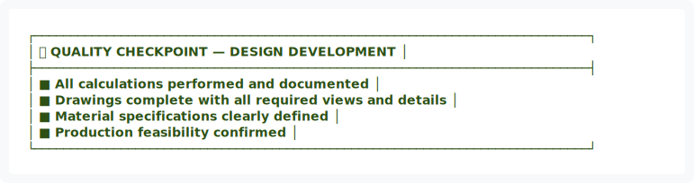
</div>

<details>
<summary>View ASCII Source</summary>

```
┌─────────────────────────────────────────────────────────────────────────────┐
│ ✅ QUALITY CHECKPOINT — DESIGN DEVELOPMENT                                  │
├─────────────────────────────────────────────────────────────────────────────┤
│ ■ All calculations performed and documented                                │
│ ■ Drawings complete with all required views and details                    │
│ ■ Material specifications clearly defined                                  │
│ ■ Production feasibility confirmed                                         │
└─────────────────────────────────────────────────────────────────────────────┘
```
</details>


━━━━━━━━━━━━━━━━━━━━━━━━━━━━━━━━━━━━━━━━━━━━━━━━━━━━━━━━━━━━━━━━━━━━━━━━━━━━━━

## 📐 7. DESIGN OUTPUT & DOCUMENTATION

### 7.1 Required Deliverables

| 📋 Deliverable | Description | Approval Required |
|:---|:---|:---|
| **Stamped engineering drawings** | PE-stamped construction drawings | Professional Engineer |
| **Bill of materials (BOM)** | Complete material list with specs | Engineering Manager |
| **Material specifications** | Detailed material requirements | Engineering Manager |
| **Assembly drawings** | Step-by-step construction sequence | Engineering Manager |
| **Installation instructions** | Site installation procedures | Engineering Manager |
| **Compliance certification** | Regulatory compliance documentation | Quality Manager |

━━━━━━━━━━━━━━━━━━━━━━━━━━━━━━━━━━━━━━━━━━━━━━━━━━━━━━━━━━━━━━━━━━━━━━━━━━━━━━

## ✅ 8. DESIGN VERIFICATION & VALIDATION

### 8.1 Verification Activities

| Activity | Method | Responsible |
|:---|:---|:---|
| ✅ **Calculations verified** | Independent PE review | Professional Engineer |
| ✅ **Drawings reviewed** | Completeness check | Engineering Manager |
| ✅ **Material specs confirmed** | Availability verification | Procurement Manager |
| ✅ **Manufacturing feasibility** | Production review | Production Manager |

### 8.2 Validation Activities

| Activity | Method | Success Criteria |
|:---|:---|:---|
| ✅ **First article build** | Prototype module construction | Buildable per design |
| ✅ **Structural testing** | Load testing (if new design) | Meets calculated capacity |
| ✅ **Code compliance** | Regulatory inspection | Passes all inspections |
| ✅ **Customer acceptance** | Customer review and approval | Customer sign-off |


<div align="center">
  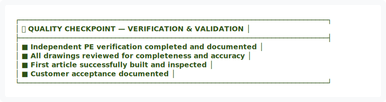
</div>

<details>
<summary>View ASCII Source</summary>

```
┌─────────────────────────────────────────────────────────────────────────────┐
│ ✅ QUALITY CHECKPOINT — VERIFICATION & VALIDATION                           │
├─────────────────────────────────────────────────────────────────────────────┤
│ ■ Independent PE verification completed and documented                     │
│ ■ All drawings reviewed for completeness and accuracy                      │
│ ■ First article successfully built and inspected                           │
│ ■ Customer acceptance documented                                           │
└─────────────────────────────────────────────────────────────────────────────┘
```
</details>


━━━━━━━━━━━━━━━━━━━━━━━━━━━━━━━━━━━━━━━━━━━━━━━━━━━━━━━━━━━━━━━━━━━━━━━━━━━━━━

## 🏛️ 9. REGULATORY APPROVAL

### 9.1 Pre-Production Requirements


<div align="center">
  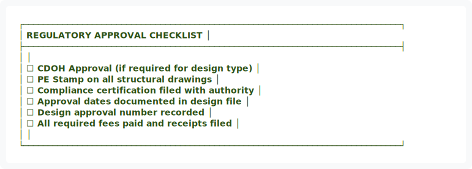
</div>

<details>
<summary>View ASCII Source</summary>

```
┌─────────────────────────────────────────────────────────────────────────────┐
│                      REGULATORY APPROVAL CHECKLIST                          │
├─────────────────────────────────────────────────────────────────────────────┤
│                                                                             │
│   ☐  CDOH Approval (if required for design type)                           │
│   ☐  PE Stamp on all structural drawings                                   │
│   ☐  Compliance certification filed with authority                         │
│   ☐  Approval dates documented in design file                              │
│   ☐  Design approval number recorded                                       │
│   ☐  All required fees paid and receipts filed                             │
│                                                                             │
└─────────────────────────────────────────────────────────────────────────────┘
```
</details>


━━━━━━━━━━━━━━━━━━━━━━━━━━━━━━━━━━━━━━━━━━━━━━━━━━━━━━━━━━━━━━━━━━━━━━━━━━━━━━

## 🔄 10. DESIGN CHANGES

### 10.1 Change Control Process

| Step | Action | Reference |
|:---:|:---|:---|
| 1️⃣ | Follow SOP-005 (Change Management) | Change control procedure |
| 2️⃣ | Notify regulatory authority (if applicable) | CDOH notification |
| 3️⃣ | Verify continued compliance | Code compliance check |
| 4️⃣ | Update all documentation | Drawing revisions, BOM updates |
| 5️⃣ | Re-verify and re-validate (if needed) | PE review, testing |
| 6️⃣ | Re-approve before implementation | Quality Manager sign-off |

━━━━━━━━━━━━━━━━━━━━━━━━━━━━━━━━━━━━━━━━━━━━━━━━━━━━━━━━━━━━━━━━━━━━━━━━━━━━━━

## 📁 11. DESIGN RECORDS

### 11.1 Required Documentation

| Record Type | Retention Period | Location |
|:---|:---:|:---|
| 📝 **Design requirements document** | 7 years | Engineering files |
| 🔢 **Design calculations** | 7 years | Engineering files |
| 📐 **Engineering drawings** | 7 years | Document control |
| ✅ **Approval records** | 7 years | Quality files |
| 🏛️ **Regulatory certifications** | 7 years | Compliance files |
| 📋 **Design change history** | 7 years | Change control system |


<div align="center">
  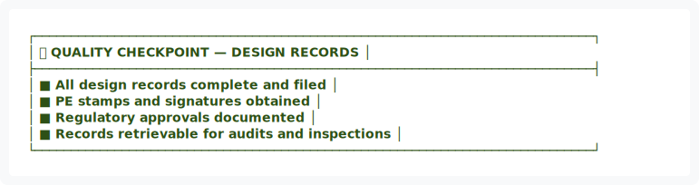
</div>

<details>
<summary>View ASCII Source</summary>

```
┌─────────────────────────────────────────────────────────────────────────────┐
│ ✅ QUALITY CHECKPOINT — DESIGN RECORDS                                      │
├─────────────────────────────────────────────────────────────────────────────┤
│ ■ All design records complete and filed                                    │
│ ■ PE stamps and signatures obtained                                        │
│ ■ Regulatory approvals documented                                          │
│ ■ Records retrievable for audits and inspections                           │
└─────────────────────────────────────────────────────────────────────────────┘
```
</details>


---

## ✍️ APPROVAL & AUTHORITY

| Role | Name | Signature | Date |
|:---|:---|:---:|:---:|
| **Process Owner** | Engineering Manager | _________________ | _________ |
| **Quality Manager** | Quality Manager | _________________ | _________ |
| **Executive Authority** | Operations Director | _________________ | _________ |

---

## 📅 REVISION HISTORY

| Version | Date | Changes | Approved By |
|:---:|:---|:---|:---|
| 1.0 | 01/14/2026 | Initial design control procedure | Engineering Manager |
| 2.0 | 01/15/2026 | Applied visual design system upgrade | Quality Manager |

---

<div align="center">


<div align="center">
  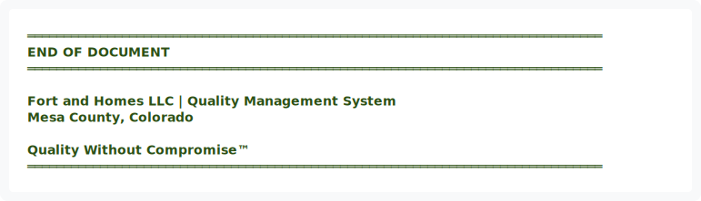
</div>

<details>
<summary>View ASCII Source</summary>

```
═══════════════════════════════════════════════════════════════════════════════
                              END OF DOCUMENT
═══════════════════════════════════════════════════════════════════════════════

              Fort and Homes LLC | Quality Management System
                        Mesa County, Colorado

                      Quality Without Compromise™
═══════════════════════════════════════════════════════════════════════════════
```
</details>


**DOCUMENT STATUS:** ✅ ACTIVE  
**EFFECTIVE DATE:** January 2026  
**NEXT REVIEW:** July 2026

</div>

