<div align="center">


<div align="center">
  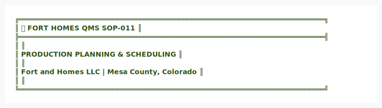
</div>

<details>
<summary>View ASCII Source</summary>

```
╔══════════════════════════════════════════════════════════════════════════════╗
║  🏗️ FORT HOMES QMS                                           SOP-011        ║
╠══════════════════════════════════════════════════════════════════════════════╣
║                                                                              ║
║              PRODUCTION PLANNING & SCHEDULING                                ║
║                                                                              ║
║               Fort and Homes LLC | Mesa County, Colorado                     ║
║                                                                              ║
╚══════════════════════════════════════════════════════════════════════════════╝
```
</details>


| 📄 Document ID | 📋 Revision | 📅 Effective | 👤 Process Owner | 🔍 Next Review |
|:---:|:---:|:---:|:---:|:---:|
| `SOP-011` | `2.0` | `January 2026` | `Production Manager` | `July 2026` |

━━━━━━━━━━━━━━━━━━━━━━━━━━━━━━━━━━━━━━━━━━━━━━━━━━━━━━━━━━━━━━━━━━━━━━━━━━━━━━

</div>

---

## 📊 EXECUTIVE SUMMARY


<div align="center">
  
</div>

<details>
<summary>View ASCII Source</summary>

```
┌────────────────────────────────────────────────────────────────────────────┐
│                         📊 EXECUTIVE DASHBOARD                             │
├────────────────────────────────────────────────────────────────────────────┤
│                                                                            │
│   KEY METRICS                                                              │
│   ───────────────────────────────────────────────────────────             │
│   📈 Schedule Adherence: 95%+ target                                      │
│   ⚡ Bay Utilization: 85%+ capacity target                                │
│   📅 Average Lead Time: Within planned timelines                          │
│   🔄 Schedule Changes: <5% per month                                      │
│                                                                            │
│   CRITICAL SUCCESS FACTORS                                                 │
│   ───────────────────────────────────────────────────────────             │
│   • Efficient bay assignment and resource allocation                       │
│   • Timely hold point inspection scheduling                                │
│   • Proactive bottleneck identification and resolution                     │
│   • Clear communication of schedules across all teams                      │
│                                                                            │
└────────────────────────────────────────────────────────────────────────────┘
```
</details>


---

## 🎯 1. PURPOSE

To establish procedures for module scheduling, bay assignment, and production timelines. This SOP ensures efficient production flow, optimal resource utilization, and on-time module delivery while maintaining quality standards.

---

## 📋 2. SCOPE

### 2.1 Planning Activities

| 🎯 Activity Area | Description | Applicability |
|:---|:---|:---|
| **Order Reception** | Module specifications and initial analysis | All orders |
| **Schedule Development** | Master timeline and bay allocation | All modules |
| **Resource Allocation** | Labor, equipment, and materials planning | All phases |
| **Timeline Tracking** | Progress monitoring and adjustment | Ongoing |
| **Bottleneck Resolution** | Issue identification and mitigation | As needed |

### 2.2 Personnel Coverage


<div align="center">
  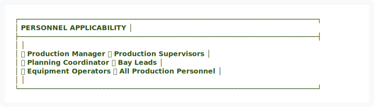
</div>

<details>
<summary>View ASCII Source</summary>

```
┌─────────────────────────────────────────────────────────────────────────────┐
│                         PERSONNEL APPLICABILITY                             │
├─────────────────────────────────────────────────────────────────────────────┤
│                                                                             │
│   ✅ Production Manager           ✅ Production Supervisors                 │
│   ✅ Planning Coordinator         ✅ Bay Leads                              │
│   ✅ Equipment Operators          ✅ All Production Personnel               │
│                                                                             │
└─────────────────────────────────────────────────────────────────────────────┘
```
</details>


---

## 📚 3. REFERENCES & STANDARDS

| Reference | Description | Authority |
|:---|:---|:---|
| Hold Point Schedule | hold-points.json | Internal |
| Module Specifications | Customer order documentation | Customer/Sales |
| Phases & Gate Schedule | phases.json | Internal |
| SOP-013 | Hold Point Inspections & Gate Controls | Internal |

---

## 👥 4. ROLES & RESPONSIBILITIES


<div align="center">
  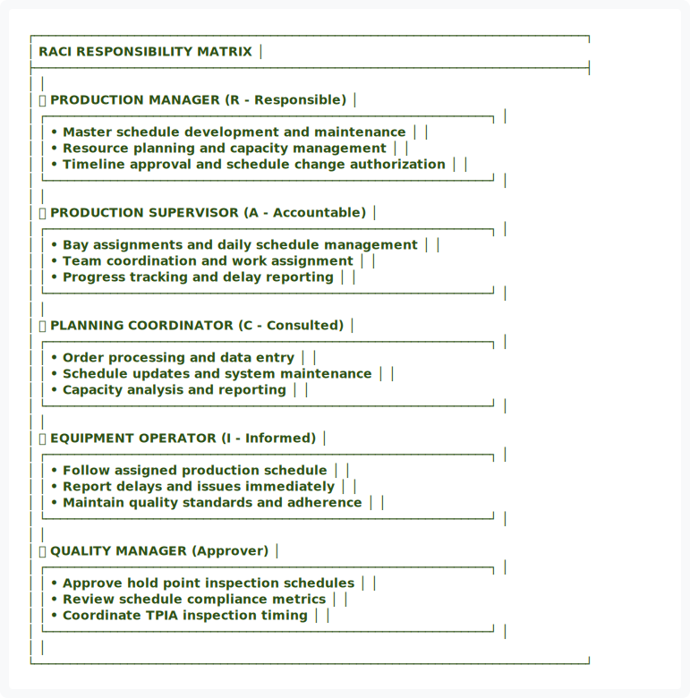
</div>

<details>
<summary>View ASCII Source</summary>

```
┌─────────────────────────────────────────────────────────────────────────────┐
│                        RACI RESPONSIBILITY MATRIX                           │
├─────────────────────────────────────────────────────────────────────────────┤
│                                                                             │
│   👤 PRODUCTION MANAGER          (R - Responsible)                          │
│   ┌──────────────────────────────────────────────────────────────┐         │
│   │ • Master schedule development and maintenance                │         │
│   │ • Resource planning and capacity management                  │         │
│   │ • Timeline approval and schedule change authorization        │         │
│   └──────────────────────────────────────────────────────────────┘         │
│                                                                             │
│   👤 PRODUCTION SUPERVISOR       (A - Accountable)                          │
│   ┌──────────────────────────────────────────────────────────────┐         │
│   │ • Bay assignments and daily schedule management              │         │
│   │ • Team coordination and work assignment                      │         │
│   │ • Progress tracking and delay reporting                      │         │
│   └──────────────────────────────────────────────────────────────┘         │
│                                                                             │
│   👤 PLANNING COORDINATOR        (C - Consulted)                            │
│   ┌──────────────────────────────────────────────────────────────┐         │
│   │ • Order processing and data entry                            │         │
│   │ • Schedule updates and system maintenance                    │         │
│   │ • Capacity analysis and reporting                            │         │
│   └──────────────────────────────────────────────────────────────┘         │
│                                                                             │
│   👤 EQUIPMENT OPERATOR          (I - Informed)                             │
│   ┌──────────────────────────────────────────────────────────────┐         │
│   │ • Follow assigned production schedule                        │         │
│   │ • Report delays and issues immediately                       │         │
│   │ • Maintain quality standards and adherence                   │         │
│   └──────────────────────────────────────────────────────────────┘         │
│                                                                             │
│   👤 QUALITY MANAGER             (Approver)                                 │
│   ┌──────────────────────────────────────────────────────────────┐         │
│   │ • Approve hold point inspection schedules                    │         │
│   │ • Review schedule compliance metrics                         │         │
│   │ • Coordinate TPIA inspection timing                          │         │
│   └──────────────────────────────────────────────────────────────┘         │
│                                                                             │
└─────────────────────────────────────────────────────────────────────────────┘
```
</details>


---

## 🔄 5. PRODUCTION PLANNING FLOWCHART


<div align="center">
  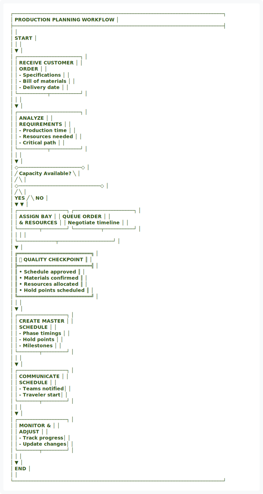
</div>

<details>
<summary>View ASCII Source</summary>

```
┌─────────────────────────────────────────────────────────────────────────────┐
│                    PRODUCTION PLANNING WORKFLOW                             │
├─────────────────────────────────────────────────────────────────────────────┤
│                                                                             │
│                              START                                          │
│                                │                                            │
│                                ▼                                            │
│                    ┌───────────────────────┐                               │
│                    │  RECEIVE CUSTOMER     │                               │
│                    │  ORDER                │                               │
│                    │  - Specifications     │                               │
│                    │  - Bill of materials  │                               │
│                    │  - Delivery date      │                               │
│                    └───────────┬───────────┘                               │
│                                │                                            │
│                                ▼                                            │
│                    ┌───────────────────────┐                               │
│                    │  ANALYZE              │                               │
│                    │  REQUIREMENTS         │                               │
│                    │  - Production time    │                               │
│                    │  - Resources needed   │                               │
│                    │  - Critical path      │                               │
│                    └───────────┬───────────┘                               │
│                                │                                            │
│                                ▼                                            │
│                    ◇───────────────────────◇                               │
│                   ╱  Capacity Available?    ╲                              │
│                  ╱                            ╲                             │
│                 ◇──────────────────────────────◇                            │
│                ╱                               ╲                           │
│          YES  ╱                                 ╲  NO                      │
│              ▼                                   ▼                          │
│   ┌──────────────────┐              ┌──────────────────────┐               │
│   │  ASSIGN BAY      │              │  QUEUE ORDER         │               │
│   │  & RESOURCES     │              │  Negotiate timeline  │               │
│   └────────┬─────────┘              └──────────┬───────────┘               │
│            │                                   │                            │
│            └──────────────┬────────────────────┘                            │
│                           ▼                                                │
│            ╔═══════════════════════════╗                                   │
│            ║   ✅ QUALITY CHECKPOINT   ║                                   │
│            ╠═══════════════════════════╣                                   │
│            ║ • Schedule approved       ║                                   │
│            ║ • Materials confirmed     ║                                   │
│            ║ • Resources allocated     ║                                   │
│            ║ • Hold points scheduled   ║                                   │
│            ╚═══════════════════════════╝                                   │
│                           │                                                │
│                           ▼                                                │
│                    ┌──────────────────┐                                    │
│                    │  CREATE MASTER   │                                    │
│                    │  SCHEDULE        │                                    │
│                    │  - Phase timings │                                    │
│                    │  - Hold points   │                                    │
│                    │  - Milestones    │                                    │
│                    └────────┬─────────┘                                    │
│                             │                                              │
│                             ▼                                              │
│                    ┌──────────────────┐                                    │
│                    │  COMMUNICATE     │                                    │
│                    │  SCHEDULE        │                                    │
│                    │  - Teams notified│                                    │
│                    │  - Traveler start│                                    │
│                    └────────┬─────────┘                                    │
│                             │                                              │
│                             ▼                                              │
│                    ┌──────────────────┐                                    │
│                    │  MONITOR &       │                                    │
│                    │  ADJUST          │                                    │
│                    │  - Track progress│                                    │
│                    │  - Update changes│                                    │
│                    └────────┬─────────┘                                    │
│                             │                                              │
│                             ▼                                              │
│                           END                                              │
│                                                                             │
└─────────────────────────────────────────────────────────────────────────────┘
```
</details>


━━━━━━━━━━━━━━━━━━━━━━━━━━━━━━━━━━━━━━━━━━━━━━━━━━━━━━━━━━━━━━━━━━━━━━━━━━━━━━

## 📅 6. SCHEDULE DEVELOPMENT & PLANNING

### 6.1 Initial Planning


<div align="center">
  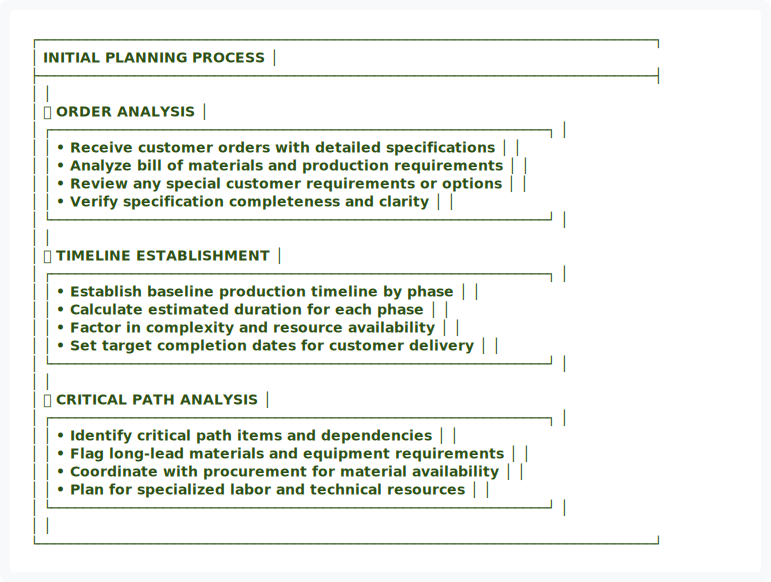
</div>

<details>
<summary>View ASCII Source</summary>

```
┌─────────────────────────────────────────────────────────────────────────────┐
│                         INITIAL PLANNING PROCESS                            │
├─────────────────────────────────────────────────────────────────────────────┤
│                                                                             │
│   📋 ORDER ANALYSIS                                                         │
│   ┌──────────────────────────────────────────────────────────────┐         │
│   │ • Receive customer orders with detailed specifications       │         │
│   │ • Analyze bill of materials and production requirements      │         │
│   │ • Review any special customer requirements or options        │         │
│   │ • Verify specification completeness and clarity              │         │
│   └──────────────────────────────────────────────────────────────┘         │
│                                                                             │
│   📊 TIMELINE ESTABLISHMENT                                                 │
│   ┌──────────────────────────────────────────────────────────────┐         │
│   │ • Establish baseline production timeline by phase            │         │
│   │ • Calculate estimated duration for each phase                │         │
│   │ • Factor in complexity and resource availability             │         │
│   │ • Set target completion dates for customer delivery          │         │
│   └──────────────────────────────────────────────────────────────┘         │
│                                                                             │
│   🔍 CRITICAL PATH ANALYSIS                                                 │
│   ┌──────────────────────────────────────────────────────────────┐         │
│   │ • Identify critical path items and dependencies              │         │
│   │ • Flag long-lead materials and equipment requirements        │         │
│   │ • Coordinate with procurement for material availability      │         │
│   │ • Plan for specialized labor and technical resources         │         │
│   └──────────────────────────────────────────────────────────────┘         │
│                                                                             │
└─────────────────────────────────────────────────────────────────────────────┘
```
</details>


### 6.2 Master Schedule Creation

| Component | Details | Responsibility |
|:---|:---|:---|
| 🏭 **Bay Allocation** | Assign production bay based on module size and complexity | Production Manager |
| 📅 **Phase Timelines** | Set target completion dates for each production phase | Planning Coordinator |
| 🔍 **Hold Point Scheduling** | Schedule all HP-1 through HP-8 inspections | Quality Manager |
| 👥 **Labor Assignment** | Reserve specialized labor and equipment operators | Production Supervisor |


<div align="center">
  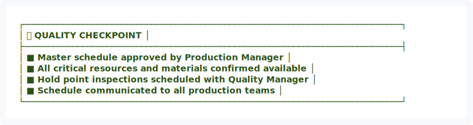
</div>

<details>
<summary>View ASCII Source</summary>

```
┌─────────────────────────────────────────────────────────────────────────────┐
│ ✅ QUALITY CHECKPOINT                                                       │
├─────────────────────────────────────────────────────────────────────────────┤
│ ■ Master schedule approved by Production Manager                           │
│ ■ All critical resources and materials confirmed available                 │
│ ■ Hold point inspections scheduled with Quality Manager                    │
│ ■ Schedule communicated to all production teams                            │
└─────────────────────────────────────────────────────────────────────────────┘
```
</details>


━━━━━━━━━━━━━━━━━━━━━━━━━━━━━━━━━━━━━━━━━━━━━━━━━━━━━━━━━━━━━━━━━━━━━━━━━━━━━━

## 🏭 7. BAY ASSIGNMENT & RESOURCE ALLOCATION

### 7.1 Bay Assignment Criteria

| Criteria | Considerations | Impact |
|:---|:---|:---|
| 📏 **Module Size** | Length, width, height specifications | Bay capacity and clearance |
| 🔧 **Complexity** | Custom features, special equipment needs | Technical resources required |
| ⚙️ **Equipment** | Crane access, specialized tools | Equipment availability and setup |
| 👥 **Labor Skills** | Specialized trades, certifications | Team assignment and scheduling |
| 🔍 **Inspection Access** | Hold point scheduling conflicts | TPIA coordination timing |

### 7.2 Timeline Adjustments


<div align="center">
  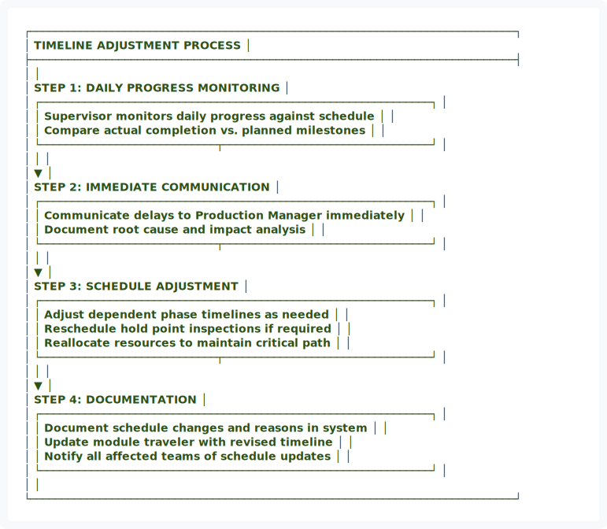
</div>

<details>
<summary>View ASCII Source</summary>

```
┌─────────────────────────────────────────────────────────────────────────────┐
│                      TIMELINE ADJUSTMENT PROCESS                            │
├─────────────────────────────────────────────────────────────────────────────┤
│                                                                             │
│   STEP 1: DAILY PROGRESS MONITORING                                        │
│   ┌──────────────────────────────────────────────────────────────┐         │
│   │ Supervisor monitors daily progress against schedule          │         │
│   │ Compare actual completion vs. planned milestones             │         │
│   └────────────────────────────┬─────────────────────────────────┘         │
│                                │                                            │
│                                ▼                                            │
│   STEP 2: IMMEDIATE COMMUNICATION                                          │
│   ┌──────────────────────────────────────────────────────────────┐         │
│   │ Communicate delays to Production Manager immediately         │         │
│   │ Document root cause and impact analysis                      │         │
│   └────────────────────────────┬─────────────────────────────────┘         │
│                                │                                            │
│                                ▼                                            │
│   STEP 3: SCHEDULE ADJUSTMENT                                              │
│   ┌──────────────────────────────────────────────────────────────┐         │
│   │ Adjust dependent phase timelines as needed                   │         │
│   │ Reschedule hold point inspections if required                │         │
│   │ Reallocate resources to maintain critical path               │         │
│   └────────────────────────────┬─────────────────────────────────┘         │
│                                │                                            │
│                                ▼                                            │
│   STEP 4: DOCUMENTATION                                                    │
│   ┌──────────────────────────────────────────────────────────────┐         │
│   │ Document schedule changes and reasons in system              │         │
│   │ Update module traveler with revised timeline                 │         │
│   │ Notify all affected teams of schedule updates                │         │
│   └──────────────────────────────────────────────────────────────┘         │
│                                                                             │
└─────────────────────────────────────────────────────────────────────────────┘
```
</details>


━━━━━━━━━━━━━━━━━━━━━━━━━━━━━━━━━━━━━━━━━━━━━━━━━━━━━━━━━━━━━━━━━━━━━━━━━━━━━━

## 📣 8. PRODUCTION TIMELINE COMMUNICATION

### 8.1 Communication Channels


<div align="center">
  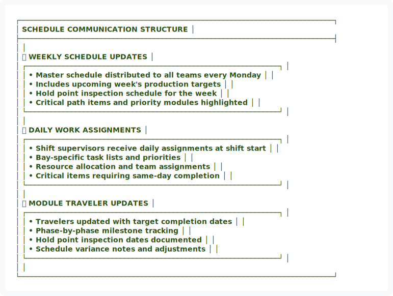
</div>

<details>
<summary>View ASCII Source</summary>

```
┌─────────────────────────────────────────────────────────────────────────────┐
│                    SCHEDULE COMMUNICATION STRUCTURE                         │
├─────────────────────────────────────────────────────────────────────────────┤
│                                                                             │
│   📅 WEEKLY SCHEDULE UPDATES                                                │
│   ┌──────────────────────────────────────────────────────────────┐         │
│   │ • Master schedule distributed to all teams every Monday      │         │
│   │ • Includes upcoming week's production targets                │         │
│   │ • Hold point inspection schedule for the week                │         │
│   │ • Critical path items and priority modules highlighted       │         │
│   └──────────────────────────────────────────────────────────────┘         │
│                                                                             │
│   📋 DAILY WORK ASSIGNMENTS                                                 │
│   ┌──────────────────────────────────────────────────────────────┐         │
│   │ • Shift supervisors receive daily assignments at shift start │         │
│   │ • Bay-specific task lists and priorities                     │         │
│   │ • Resource allocation and team assignments                   │         │
│   │ • Critical items requiring same-day completion               │         │
│   └──────────────────────────────────────────────────────────────┘         │
│                                                                             │
│   📝 MODULE TRAVELER UPDATES                                                │
│   ┌──────────────────────────────────────────────────────────────┐         │
│   │ • Travelers updated with target completion dates             │         │
│   │ • Phase-by-phase milestone tracking                          │         │
│   │ • Hold point inspection dates documented                     │         │
│   │ • Schedule variance notes and adjustments                    │         │
│   └──────────────────────────────────────────────────────────────┘         │
│                                                                             │
└─────────────────────────────────────────────────────────────────────────────┘
```
</details>


<div align="center">
  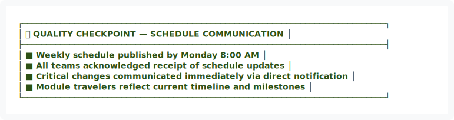
</div>

<details>
<summary>View ASCII Source</summary>

```
┌─────────────────────────────────────────────────────────────────────────────┐
│ ✅ QUALITY CHECKPOINT — SCHEDULE COMMUNICATION                              │
├─────────────────────────────────────────────────────────────────────────────┤
│ ■ Weekly schedule published by Monday 8:00 AM                              │
│ ■ All teams acknowledged receipt of schedule updates                       │
│ ■ Critical changes communicated immediately via direct notification        │
│ ■ Module travelers reflect current timeline and milestones                 │
└─────────────────────────────────────────────────────────────────────────────┘
```
</details>


━━━━━━━━━━━━━━━━━━━━━━━━━━━━━━━━━━━━━━━━━━━━━━━━━━━━━━━━━━━━━━━━━━━━━━━━━━━━━━

## 📊 9. METRICS & PERFORMANCE INDICATORS


<div align="center">
  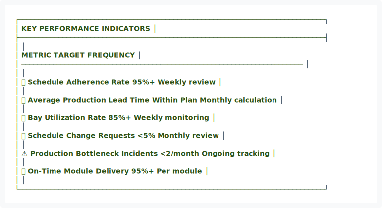
</div>

<details>
<summary>View ASCII Source</summary>

```
┌─────────────────────────────────────────────────────────────────────────────┐
│                          KEY PERFORMANCE INDICATORS                         │
├─────────────────────────────────────────────────────────────────────────────┤
│                                                                             │
│   METRIC                              TARGET         FREQUENCY              │
│   ───────────────────────────────────────────────────────────────────────  │
│                                                                             │
│   📈 Schedule Adherence Rate          95%+           Weekly review          │
│                                                                             │
│   ⏱️ Average Production Lead Time     Within Plan    Monthly calculation   │
│                                                                             │
│   🏭 Bay Utilization Rate             85%+           Weekly monitoring      │
│                                                                             │
│   🔄 Schedule Change Requests         <5%            Monthly review         │
│                                                                             │
│   ⚠️ Production Bottleneck Incidents  <2/month       Ongoing tracking       │
│                                                                             │
│   ✅ On-Time Module Delivery          95%+           Per module             │
│                                                                             │
└─────────────────────────────────────────────────────────────────────────────┘
```
</details>


<div align="center">
  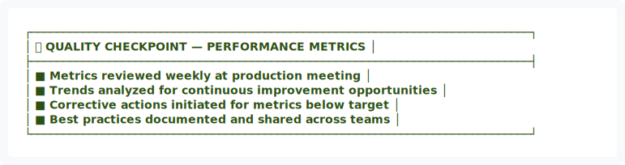
</div>

<details>
<summary>View ASCII Source</summary>

```
┌─────────────────────────────────────────────────────────────────────────────┐
│ ✅ QUALITY CHECKPOINT — PERFORMANCE METRICS                                 │
├─────────────────────────────────────────────────────────────────────────────┤
│ ■ Metrics reviewed weekly at production meeting                            │
│ ■ Trends analyzed for continuous improvement opportunities                 │
│ ■ Corrective actions initiated for metrics below target                    │
│ ■ Best practices documented and shared across teams                        │
└─────────────────────────────────────────────────────────────────────────────┘
```
</details>


━━━━━━━━━━━━━━━━━━━━━━━━━━━━━━━━━━━━━━━━━━━━━━━━━━━━━━━━━━━━━━━━━━━━━━━━━━━━━━

## 📎 10. APPENDICES

### Appendix A: Master Schedule Template
**Location:** `templates/production/Master-Schedule-Template.xlsx`

### Appendix B: Bay Assignment Checklist
**Location:** `docs/production/Bay-Assignment-Checklist.md`

### Appendix C: Timeline Adjustment Form
**Location:** `forms/production/Timeline-Adjustment-Form.pdf`

---

## ✍️ APPROVAL & AUTHORITY

| Role | Name | Signature | Date |
|:---|:---|:---:|:---:|
| **Process Owner** | Production Manager | _________________ | _________ |
| **Quality Manager** | Quality Manager | _________________ | _________ |
| **Executive Authority** | Plant Manager | _________________ | _________ |

---

## 📅 REVISION HISTORY

| Version | Date | Changes | Approved By |
|:---:|:---|:---|:---|
| 1.0 | 01/14/2026 | Initial creation | Quality Manager |
| 2.0 | 01/15/2026 | Applied visual design system upgrade | Quality Manager |

---

<div align="center">


<div align="center">
  
</div>

<details>
<summary>View ASCII Source</summary>

```
═══════════════════════════════════════════════════════════════════════════════
                              END OF DOCUMENT
═══════════════════════════════════════════════════════════════════════════════

              Fort and Homes LLC | Quality Management System
                        Mesa County, Colorado

                      Quality Without Compromise™
═══════════════════════════════════════════════════════════════════════════════
```
</details>


**DOCUMENT STATUS:** ✅ ACTIVE  
**EFFECTIVE DATE:** January 2026  
**NEXT REVIEW:** July 2026

</div>

