<div align="center">


<div align="center">
  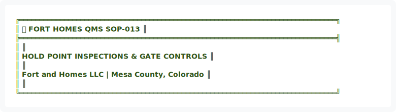
</div>

<details>
<summary>View ASCII Source</summary>

```
╔══════════════════════════════════════════════════════════════════════════════╗
║  🏗️ FORT HOMES QMS                                           SOP-013        ║
╠══════════════════════════════════════════════════════════════════════════════╣
║                                                                              ║
║                 HOLD POINT INSPECTIONS & GATE CONTROLS                       ║
║                                                                              ║
║               Fort and Homes LLC | Mesa County, Colorado                     ║
║                                                                              ║
╚══════════════════════════════════════════════════════════════════════════════╝
```
</details>


| 📄 Document ID | 📋 Revision | 📅 Effective | 👤 Process Owner | 🔍 Next Review |
|:---:|:---:|:---:|:---:|:---:|
| `SOP-013` | `2.0` | `January 2026` | `Quality Manager` | `July 2026` |

━━━━━━━━━━━━━━━━━━━━━━━━━━━━━━━━━━━━━━━━━━━━━━━━━━━━━━━━━━━━━━━━━━━━━━━━━━━━━━

</div>

---

## 📊 EXECUTIVE SUMMARY


<div align="center">
  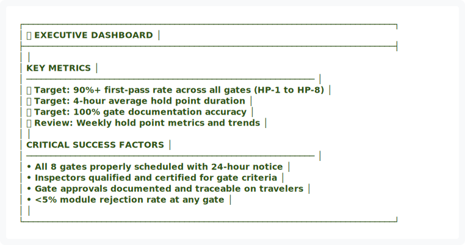
</div>

<details>
<summary>View ASCII Source</summary>

```
┌────────────────────────────────────────────────────────────────────────────┐
│                         📊 EXECUTIVE DASHBOARD                             │
├────────────────────────────────────────────────────────────────────────────┤
│                                                                            │
│   KEY METRICS                                                              │
│   ───────────────────────────────────────────────────────────             │
│   🎯 Target: 90%+ first-pass rate across all gates (HP-1 to HP-8)         │
│   ⏱️ Target: 4-hour average hold point duration                           │
│   ✅ Target: 100% gate documentation accuracy                             │
│   🔍 Review: Weekly hold point metrics and trends                         │
│                                                                            │
│   CRITICAL SUCCESS FACTORS                                                 │
│   ───────────────────────────────────────────────────────────             │
│   • All 8 gates properly scheduled with 24-hour notice                     │
│   • Inspectors qualified and certified for gate criteria                   │
│   • Gate approvals documented and traceable on travelers                   │
│   • <5% module rejection rate at any gate                                  │
│                                                                            │
└────────────────────────────────────────────────────────────────────────────┘
```
</details>


---

## 🎯 1. PURPOSE

To establish procedures for managing hold point inspections and gate controls throughout the production process. This SOP defines eight critical inspection gates (HP-1 through HP-8), inspection criteria, authority requirements, and disposition procedures to ensure quality standards are maintained at each production phase.


---

## 📋 2. SCOPE

This procedure applies to:
- Eight hold point inspection gates (HP-1 through HP-8)
- Module production phases and phase transitions
- Hold point inspection scheduling and tracking
- Gate approval authority and sign-off requirements
- Non-conforming module disposition

**Applies to:** Quality Inspectors, Production Supervisors, Module Production Team, Quality Manager


<div align="center">
  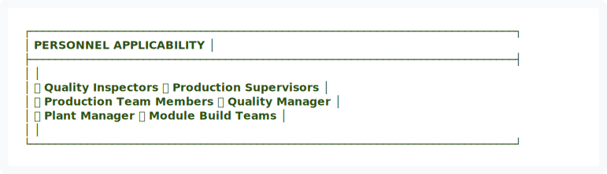
</div>

<details>
<summary>View ASCII Source</summary>

```
┌─────────────────────────────────────────────────────────────────────────────┐
│                         PERSONNEL APPLICABILITY                             │
├─────────────────────────────────────────────────────────────────────────────┤
│                                                                             │
│   ✅ Quality Inspectors         ✅ Production Supervisors                   │
│   ✅ Production Team Members    ✅ Quality Manager                          │
│   ✅ Plant Manager              ✅ Module Build Teams                       │
│                                                                             │
└─────────────────────────────────────────────────────────────────────────────┘
```
</details>


---

## 📚 3. REFERENCES & STANDARDS

| Reference | Description | Authority |
|:---|:---|:---|
| Hold Points Master Schedule | Inspection gate timeline | Internal |
| Phase Documentation | phases.json | Internal |
| FORM-I002 | Floor Inspection Template | Internal |
| SOP-004 | Nonconformance & CAPA | Internal |
| HUD Code 24 CFR 3280 | Manufacturing Requirements | Federal |

---

## 👥 4. ROLES & RESPONSIBILITIES


<div align="center">
  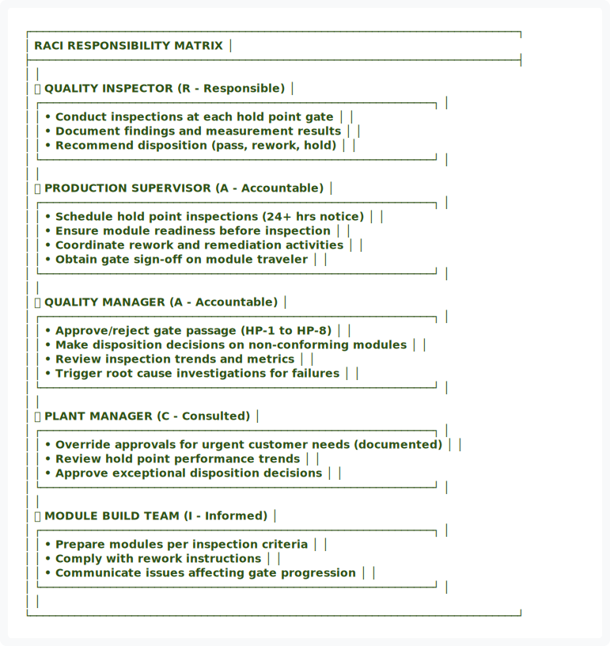
</div>

<details>
<summary>View ASCII Source</summary>

```
┌─────────────────────────────────────────────────────────────────────────────┐
│                        RACI RESPONSIBILITY MATRIX                           │
├─────────────────────────────────────────────────────────────────────────────┤
│                                                                             │
│   👤 QUALITY INSPECTOR              (R - Responsible)                       │
│   ┌──────────────────────────────────────────────────────────────┐         │
│   │ • Conduct inspections at each hold point gate               │         │
│   │ • Document findings and measurement results                 │         │
│   │ • Recommend disposition (pass, rework, hold)                │         │
│   └──────────────────────────────────────────────────────────────┘         │
│                                                                             │
│   👤 PRODUCTION SUPERVISOR          (A - Accountable)                       │
│   ┌──────────────────────────────────────────────────────────────┐         │
│   │ • Schedule hold point inspections (24+ hrs notice)           │         │
│   │ • Ensure module readiness before inspection                  │         │
│   │ • Coordinate rework and remediation activities              │         │
│   │ • Obtain gate sign-off on module traveler                    │         │
│   └──────────────────────────────────────────────────────────────┘         │
│                                                                             │
│   👤 QUALITY MANAGER                (A - Accountable)                       │
│   ┌──────────────────────────────────────────────────────────────┐         │
│   │ • Approve/reject gate passage (HP-1 to HP-8)                │         │
│   │ • Make disposition decisions on non-conforming modules       │         │
│   │ • Review inspection trends and metrics                       │         │
│   │ • Trigger root cause investigations for failures             │         │
│   └──────────────────────────────────────────────────────────────┘         │
│                                                                             │
│   👤 PLANT MANAGER                  (C - Consulted)                         │
│   ┌──────────────────────────────────────────────────────────────┐         │
│   │ • Override approvals for urgent customer needs (documented)  │         │
│   │ • Review hold point performance trends                       │         │
│   │ • Approve exceptional disposition decisions                  │         │
│   └──────────────────────────────────────────────────────────────┘         │
│                                                                             │
│   👤 MODULE BUILD TEAM              (I - Informed)                          │
│   ┌──────────────────────────────────────────────────────────────┐         │
│   │ • Prepare modules per inspection criteria                    │         │
│   │ • Comply with rework instructions                            │         │
│   │ • Communicate issues affecting gate progression              │         │
│   └──────────────────────────────────────────────────────────────┘         │
│                                                                             │
└─────────────────────────────────────────────────────────────────────────────┘
```
</details>


---

## 🔄 5. HOLD POINT GATE STRUCTURE

### 5.1 Gate Definitions & Inspection Criteria

| Gate | Phase Focus | Key Inspection Points | Approval Authority |
|:---|:---|:---|:---|
| 🔵 **HP-1** | Material Receipt | Material lot verification, floor deck prep, documentation | Production Supervisor |
| 🟢 **HP-2** | Floor Assembly | Deck assembly, fasteners, dimensional accuracy | Inspector + Supervisor |
| 🟡 **HP-3** | Wall Framing | Frame square, plumb, sheathing, structural integrity | Inspector + Supervisor |
| 🟠 **HP-4** | Electrical Rough-in | Wire routing, boxes, panel placement, safety compliance | Quality Manager |
| 🔴 **HP-5** | Plumbing/HVAC | Rough-in, connections, pressure tests, integration | Quality Manager |
| 🟣 **HP-6** | Insulation/Seal | R-value verification, air seal, weatherproofing | Inspector + Supervisor |
| 🟤 **HP-7** | Interior Finish | Drywall, trim, appliances, final interior | Inspector + Supervisor |
| ⚫ **HP-8** | Final Inspection | Complete module quality sign-off, documentation | Quality Manager |

### 5.2 Inspection Scheduling & Timing


<div align="center">
  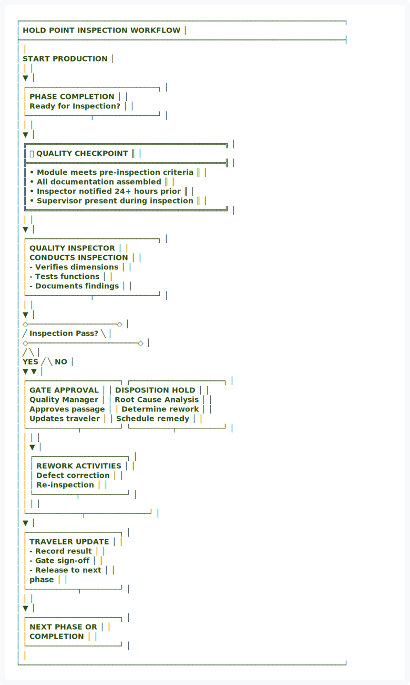
</div>

<details>
<summary>View ASCII Source</summary>

```
┌─────────────────────────────────────────────────────────────────────────────┐
│                   HOLD POINT INSPECTION WORKFLOW                            │
├─────────────────────────────────────────────────────────────────────────────┤
│                                                                             │
│                         START PRODUCTION                                    │
│                                │                                            │
│                                ▼                                            │
│                ┌───────────────────────────────┐                           │
│                │   PHASE COMPLETION            │                           │
│                │   Ready for Inspection?       │                           │
│                └───────────────┬───────────────┘                           │
│                                │                                            │
│                                ▼                                            │
│    ╔═══════════════════════════════════════════════╗                       │
│    ║     ✅ QUALITY CHECKPOINT                     ║                       │
│    ╠═══════════════════════════════════════════════╣                       │
│    ║  • Module meets pre-inspection criteria        ║                       │
│    ║  • All documentation assembled                 ║                       │
│    ║  • Inspector notified 24+ hours prior          ║                       │
│    ║  • Supervisor present during inspection        ║                       │
│    ╚═══════════════════════════════════════════════╝                       │
│                                │                                            │
│                                ▼                                            │
│                ┌───────────────────────────────┐                           │
│                │  QUALITY INSPECTOR            │                           │
│                │  CONDUCTS INSPECTION          │                           │
│                │  - Verifies dimensions        │                           │
│                │  - Tests functions            │                           │
│                │  - Documents findings         │                           │
│                └───────────────┬───────────────┘                           │
│                                │                                            │
│                                ▼                                            │
│                    ◇─────────────────────◇                                 │
│                   ╱    Inspection Pass?    ╲                               │
│                  ◇──────────────────────────◇                              │
│                 ╱                            ╲                             │
│             YES ╱                              ╲ NO                        │
│                ▼                                ▼                           │
│    ┌──────────────────────┐       ┌──────────────────────┐                 │
│    │  GATE APPROVAL       │       │  DISPOSITION HOLD    │                 │
│    │  Quality Manager     │       │  Root Cause Analysis │                 │
│    │  Approves passage    │       │  Determine rework    │                 │
│    │  Updates traveler    │       │  Schedule remedy     │                 │
│    └────────────┬─────────┘       └──────────┬───────────┘                 │
│                 │                             │                             │
│                 │                             ▼                             │
│                 │                  ┌──────────────────────┐                 │
│                 │                  │   REWORK ACTIVITIES  │                 │
│                 │                  │   Defect correction  │                 │
│                 │                  │   Re-inspection      │                 │
│                 │                  └──────────┬───────────┘                 │
│                 │                             │                             │
│                 └─────────────┬───────────────┘                             │
│                               ▼                                             │
│                    ┌──────────────────────┐                                 │
│                    │  TRAVELER UPDATE     │                                 │
│                    │  - Record result     │                                 │
│                    │  - Gate sign-off     │                                 │
│                    │  - Release to next   │                                 │
│                    │    phase             │                                 │
│                    └────────────┬─────────┘                                 │
│                                 │                                            │
│                                 ▼                                            │
│                    ┌──────────────────────┐                                 │
│                    │  NEXT PHASE OR       │                                 │
│                    │  COMPLETION          │                                 │
│                    └──────────────────────┘                                 │
│                                                                             │
└─────────────────────────────────────────────────────────────────────────────┘
```
</details>


### 5.3 Inspection Notification & Timing

- Quality Inspector notified **minimum 24 hours** before scheduled inspection
- Module positioned in designated inspection area
- All required documentation ready for review
- Inspection conducted during shift with supervisor present
- Inspection findings documented within 2 hours of completion

---

## 🔐 6. GATE APPROVAL AUTHORITY


<div align="center">
  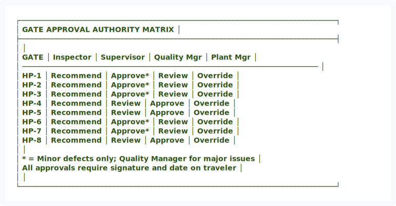
</div>

<details>
<summary>View ASCII Source</summary>

```
┌─────────────────────────────────────────────────────────────────────────────┐
│                     GATE APPROVAL AUTHORITY MATRIX                          │
├─────────────────────────────────────────────────────────────────────────────┤
│                                                                             │
│   GATE      │ Inspector    │ Supervisor   │ Quality Mgr   │ Plant Mgr       │
│   ────────────────────────────────────────────────────────────────────────  │
│   HP-1      │ Recommend    │ Approve*     │ Review        │ Override        │
│   HP-2      │ Recommend    │ Approve*     │ Review        │ Override        │
│   HP-3      │ Recommend    │ Approve*     │ Review        │ Override        │
│   HP-4      │ Recommend    │ Review       │ Approve       │ Override        │
│   HP-5      │ Recommend    │ Review       │ Approve       │ Override        │
│   HP-6      │ Recommend    │ Approve*     │ Review        │ Override        │
│   HP-7      │ Recommend    │ Approve*     │ Review        │ Override        │
│   HP-8      │ Recommend    │ Review       │ Approve       │ Override        │
│                                                                             │
│   * = Minor defects only; Quality Manager for major issues                 │
│   All approvals require signature and date on traveler                     │
│                                                                             │
└─────────────────────────────────────────────────────────────────────────────┘
```
</details>


<div align="center">
  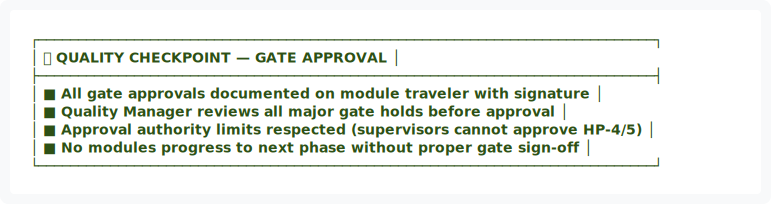
</div>

<details>
<summary>View ASCII Source</summary>

```
┌─────────────────────────────────────────────────────────────────────────────┐
│ ✅ QUALITY CHECKPOINT — GATE APPROVAL                                       │
├─────────────────────────────────────────────────────────────────────────────┤
│ ■ All gate approvals documented on module traveler with signature          │
│ ■ Quality Manager reviews all major gate holds before approval             │
│ ■ Approval authority limits respected (supervisors cannot approve HP-4/5) │
│ ■ No modules progress to next phase without proper gate sign-off           │
└─────────────────────────────────────────────────────────────────────────────┘
```
</details>


---

## ⚠️ 7. NON-CONFORMANCE & GATE HOLDS

### 7.1 Non-Conformance Documentation

When a module fails inspection at any gate:

| Step | Action | Responsible | Documentation |
|:---:|:---|:---|:---|
| 1️⃣ | Document all defects found during inspection | Quality Inspector | Hold Point Report (FORM-I003) |
| 2️⃣ | Assess root cause and severity | Quality Inspector + Supervisor | Root cause field on report |
| 3️⃣ | Classify as Minor, Major, or Critical | Quality Manager | Severity classification |
| 4️⃣ | Create rework plan with timeline | Production Supervisor | Work order with milestones |
| 5️⃣ | Execute rework activities | Build Team | Labor hours and materials logged |
| 6️⃣ | Schedule re-inspection | Quality Manager | New inspection appointment |

### 7.2 Disposition Options


<div align="center">
  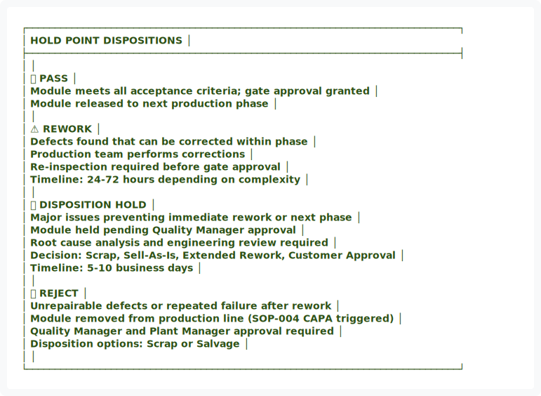
</div>

<details>
<summary>View ASCII Source</summary>

```
┌─────────────────────────────────────────────────────────────────────────────┐
│                        HOLD POINT DISPOSITIONS                              │
├─────────────────────────────────────────────────────────────────────────────┤
│                                                                             │
│   ✅ PASS                                                                   │
│   Module meets all acceptance criteria; gate approval granted               │
│   Module released to next production phase                                  │
│                                                                             │
│   ⚠️ REWORK                                                                 │
│   Defects found that can be corrected within phase                          │
│   Production team performs corrections                                      │
│   Re-inspection required before gate approval                               │
│   Timeline: 24-72 hours depending on complexity                             │
│                                                                             │
│   🔴 DISPOSITION HOLD                                                       │
│   Major issues preventing immediate rework or next phase                    │
│   Module held pending Quality Manager approval                              │
│   Root cause analysis and engineering review required                       │
│   Decision: Scrap, Sell-As-Is, Extended Rework, Customer Approval           │
│   Timeline: 5-10 business days                                              │
│                                                                             │
│   ❌ REJECT                                                                 │
│   Unrepairable defects or repeated failure after rework                     │
│   Module removed from production line (SOP-004 CAPA triggered)              │
│   Quality Manager and Plant Manager approval required                       │
│   Disposition options: Scrap or Salvage                                     │
│                                                                             │
└─────────────────────────────────────────────────────────────────────────────┘
```
</details>


### 7.3 Repeated Failures & Escalation

If a module fails the same gate twice:
- Quality Manager initiates root cause investigation (SOP-004)
- Analysis of process, materials, tooling, or skills
- Corrective action plan developed and implemented
- Trend tracking to identify systemic issues

If a gate shows >10% failure rate across all modules:
- Management review required
- Process adjustment or additional training triggered
- Engineering evaluation of acceptance criteria

---

## 📊 8. METRICS & PERFORMANCE INDICATORS


<div align="center">
  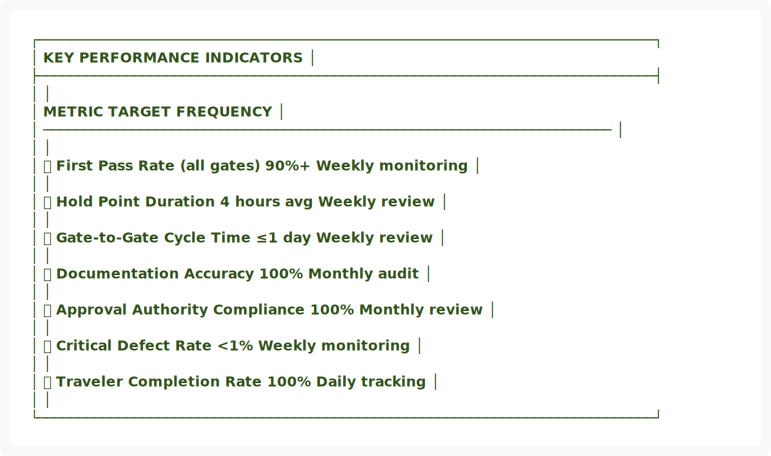
</div>

<details>
<summary>View ASCII Source</summary>

```
┌─────────────────────────────────────────────────────────────────────────────┐
│                          KEY PERFORMANCE INDICATORS                         │
├─────────────────────────────────────────────────────────────────────────────┤
│                                                                             │
│   METRIC                              TARGET         FREQUENCY              │
│   ───────────────────────────────────────────────────────────────────────  │
│                                                                             │
│   📈 First Pass Rate (all gates)       90%+           Weekly monitoring    │
│                                                                             │
│   ⏱️ Hold Point Duration               4 hours avg    Weekly review        │
│                                                                             │
│   🔄 Gate-to-Gate Cycle Time           ≤1 day         Weekly review        │
│                                                                             │
│   ✅ Documentation Accuracy            100%           Monthly audit        │
│                                                                             │
│   🎯 Approval Authority Compliance     100%           Monthly review       │
│                                                                             │
│   🔴 Critical Defect Rate              <1%            Weekly monitoring    │
│                                                                             │
│   📋 Traveler Completion Rate          100%           Daily tracking       │
│                                                                             │
└─────────────────────────────────────────────────────────────────────────────┘
```
</details>


<div align="center">
  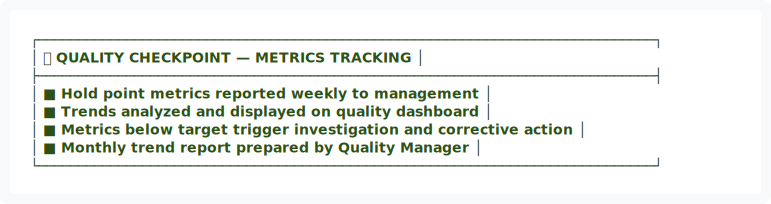
</div>

<details>
<summary>View ASCII Source</summary>

```
┌─────────────────────────────────────────────────────────────────────────────┐
│ ✅ QUALITY CHECKPOINT — METRICS TRACKING                                    │
├─────────────────────────────────────────────────────────────────────────────┤
│ ■ Hold point metrics reported weekly to management                         │
│ ■ Trends analyzed and displayed on quality dashboard                      │
│ ■ Metrics below target trigger investigation and corrective action         │
│ ■ Monthly trend report prepared by Quality Manager                         │
└─────────────────────────────────────────────────────────────────────────────┘
```
</details>


━━━━━━━━━━━━━━━━━━━━━━━━━━━━━━━━━━━━━━━━━━━━━━━━━━━━━━━━━━━━━━━━━━━━━━━━━━━━━━

## 📎 9. APPENDICES

### Appendix A: Hold Point Report Form (FORM-I003)
**Location:** `docs/forms/FORM-I003-Hold-Point-Report.md`

### Appendix B: Gate-Specific Inspection Checklists
**Location:** `docs/inspection/Gate-Inspection-Checklists.md`

### Appendix C: Module Traveler Gate Sign-off Section
**Location:** `docs/templates/traveler-template.json`

---

## ✍️ APPROVAL & AUTHORITY

| Role | Name | Signature | Date |
|:---|:---|:---:|:---:|
| **Quality Manager** | Quality Manager | _________________ | _________ |
| **Production Manager** | Production Manager | _________________ | _________ |
| **Plant Manager** | Plant Manager | _________________ | _________ |

---

## 📅 REVISION HISTORY

| Version | Date | Changes | Approved By |
|:---:|:---|:---|:---|
| 1.0 | 01/14/2026 | Initial hold point inspection procedure | Quality Manager |
| 2.0 | 01/15/2026 | Applied visual design system upgrade | Quality Manager |

---

<div align="center">


<div align="center">
  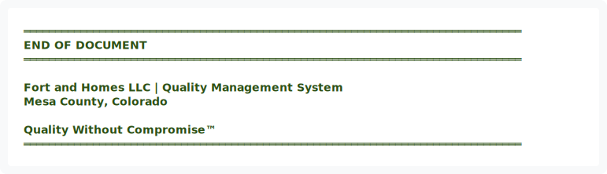
</div>

<details>
<summary>View ASCII Source</summary>

```
═══════════════════════════════════════════════════════════════════════════════
                               END OF DOCUMENT
═══════════════════════════════════════════════════════════════════════════════

               Fort and Homes LLC | Quality Management System
                         Mesa County, Colorado

                       Quality Without Compromise™
═══════════════════════════════════════════════════════════════════════════════
```
</details>


**DOCUMENT STATUS:** ✅ ACTIVE  
**EFFECTIVE DATE:** January 2026  
**NEXT REVIEW:** July 2026

</div>

