<div align="center">


<div align="center">
  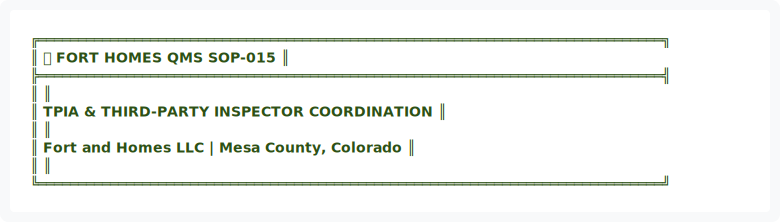
</div>

<details>
<summary>View ASCII Source</summary>

```
╔══════════════════════════════════════════════════════════════════════════════╗
║  🏗️ FORT HOMES QMS                                           SOP-015        ║
╠══════════════════════════════════════════════════════════════════════════════╣
║                                                                              ║
║          TPIA & THIRD-PARTY INSPECTOR COORDINATION                           ║
║                                                                              ║
║               Fort and Homes LLC | Mesa County, Colorado                     ║
║                                                                              ║
╚══════════════════════════════════════════════════════════════════════════════╝
```
</details>


| 📄 Document ID | 📋 Revision | 📅 Effective | 👤 Process Owner | 🔍 Next Review |
|:---:|:---:|:---:|:---:|:---:|
| `SOP-015` | `2.0` | `January 2026` | `Quality Manager` | `July 2026` |

━━━━━━━━━━━━━━━━━━━━━━━━━━━━━━━━━━━━━━━━━━━━━━━━━━━━━━━━━━━━━━━━━━━━━━━━━━━━━━

</div>

---

## 📊 EXECUTIVE SUMMARY


<div align="center">
  
</div>

<details>
<summary>View ASCII Source</summary>

```
┌────────────────────────────────────────────────────────────────────────────┐
│                         📊 EXECUTIVE DASHBOARD                             │
├────────────────────────────────────────────────────────────────────────────┤
│                                                                            │
│   KEY METRICS                                                              │
│   ───────────────────────────────────────────────────────────             │
│   ✅ Target: 95%+ TPIA inspection pass rate                                │
│   📅 Target: 100% scheduling timeliness (7+ days notice)                   │
│   🔄 Target: 100% corrective action closure rate                           │
│   📋 Target: <5% re-inspection incidents                                   │
│                                                                            │
│   CRITICAL SUCCESS FACTORS                                                 │
│   ───────────────────────────────────────────────────────────             │
│   • TPIA inspectors notified minimum 7 days in advance                     │
│   • Modules fully prepared per inspection criteria                         │
│   • Quality Manager witnesses all inspections                              │
│   • Findings documented and communicated immediately                       │
│   • Corrective actions tracked to closure                                  │
│                                                                            │
└────────────────────────────────────────────────────────────────────────────┘
```
</details>


---

## 🎯 1. PURPOSE

To establish procedures for Third-Party Inspector Agency (TPIA) coordination, inspector scheduling, and inspection result documentation. This SOP ensures timely regulatory inspections, compliance with CDOH requirements, and proper documentation of third-party inspection findings throughout the production lifecycle.


---

## 📋 2. SCOPE

This procedure applies to:
- TPIA inspection scheduling and notification
- Third-party inspector arrival and module preparation
- Inspection result documentation and findings
- Corrective action tracking per inspection reports
- Regulatory compliance verification

**Applies to:** Quality Manager, Production Supervisor, Third-Party Inspectors, Plant Management


<div align="center">
  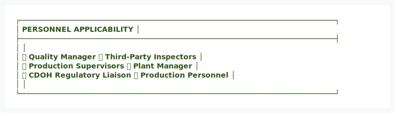
</div>

<details>
<summary>View ASCII Source</summary>

```
┌─────────────────────────────────────────────────────────────────────────────┐
│                         PERSONNEL APPLICABILITY                             │
├─────────────────────────────────────────────────────────────────────────────┤
│                                                                             │
│   ✅ Quality Manager              ✅ Third-Party Inspectors                │
│   ✅ Production Supervisors       ✅ Plant Manager                         │
│   ✅ CDOH Regulatory Liaison      ✅ Production Personnel                  │
│                                                                             │
└─────────────────────────────────────────────────────────────────────────────┘
```
</details>


---

## 📚 3. REFERENCES & STANDARDS

| Reference | Description | Authority |
|:---|:---|:---|
| CDOH HUD Code Requirements | Inspection standards and frequency | Colorado State |
| TPIA Agency Agreements | Contractual inspection obligations | Contractual |
| SOP-004 | Nonconformance & CAPA procedures | Internal |
| SOP-009 | CDOH Regulatory Compliance | Internal |
| 24 CFR 3280 | HUD Code Manufacturing Requirements | Federal |

---

## 👥 4. ROLES & RESPONSIBILITIES


<div align="center">
  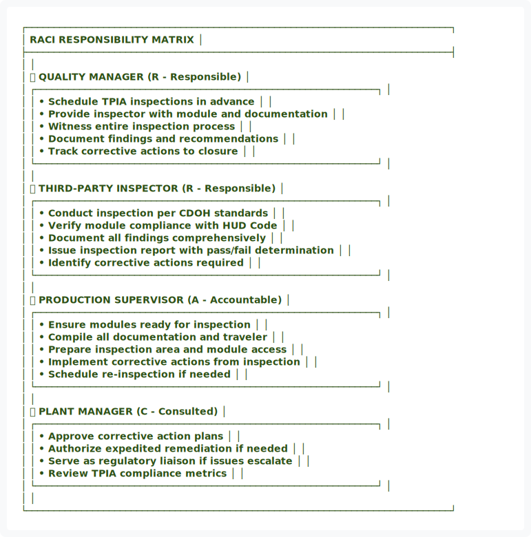
</div>

<details>
<summary>View ASCII Source</summary>

```
┌─────────────────────────────────────────────────────────────────────────────┐
│                        RACI RESPONSIBILITY MATRIX                           │
├─────────────────────────────────────────────────────────────────────────────┤
│                                                                             │
│   👤 QUALITY MANAGER                (R - Responsible)                       │
│   ┌──────────────────────────────────────────────────────────────┐         │
│   │ • Schedule TPIA inspections in advance                       │         │
│   │ • Provide inspector with module and documentation            │         │
│   │ • Witness entire inspection process                          │         │
│   │ • Document findings and recommendations                      │         │
│   │ • Track corrective actions to closure                        │         │
│   └──────────────────────────────────────────────────────────────┘         │
│                                                                             │
│   👤 THIRD-PARTY INSPECTOR          (R - Responsible)                       │
│   ┌──────────────────────────────────────────────────────────────┐         │
│   │ • Conduct inspection per CDOH standards                      │         │
│   │ • Verify module compliance with HUD Code                     │         │
│   │ • Document all findings comprehensively                      │         │
│   │ • Issue inspection report with pass/fail determination       │         │
│   │ • Identify corrective actions required                       │         │
│   └──────────────────────────────────────────────────────────────┘         │
│                                                                             │
│   👤 PRODUCTION SUPERVISOR          (A - Accountable)                       │
│   ┌──────────────────────────────────────────────────────────────┐         │
│   │ • Ensure modules ready for inspection                        │         │
│   │ • Compile all documentation and traveler                     │         │
│   │ • Prepare inspection area and module access                  │         │
│   │ • Implement corrective actions from inspection               │         │
│   │ • Schedule re-inspection if needed                           │         │
│   └──────────────────────────────────────────────────────────────┘         │
│                                                                             │
│   👤 PLANT MANAGER                  (C - Consulted)                         │
│   ┌──────────────────────────────────────────────────────────────┐         │
│   │ • Approve corrective action plans                            │         │
│   │ • Authorize expedited remediation if needed                  │         │
│   │ • Serve as regulatory liaison if issues escalate             │         │
│   │ • Review TPIA compliance metrics                             │         │
│   └──────────────────────────────────────────────────────────────┘         │
│                                                                             │
└─────────────────────────────────────────────────────────────────────────────┘
```
</details>


---

## 🔄 5. TPIA INSPECTION SCHEDULING

### 5.1 Inspection Scheduling Process


<div align="center">
  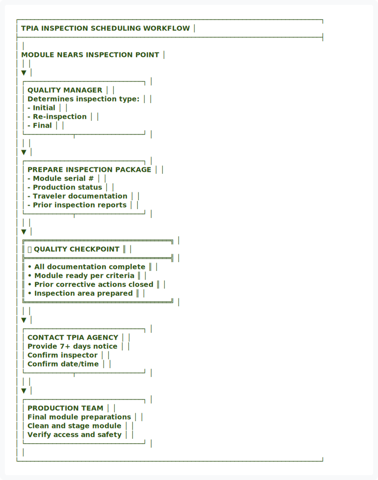
</div>

<details>
<summary>View ASCII Source</summary>

```
┌─────────────────────────────────────────────────────────────────────────────┐
│                   TPIA INSPECTION SCHEDULING WORKFLOW                       │
├─────────────────────────────────────────────────────────────────────────────┤
│                                                                             │
│                     MODULE NEARS INSPECTION POINT                          │
│                              │                                              │
│                              ▼                                              │
│            ┌──────────────────────────────┐                                 │
│            │  QUALITY MANAGER             │                                 │
│            │  Determines inspection type: │                                 │
│            │  - Initial                   │                                 │
│            │  - Re-inspection             │                                 │
│            │  - Final                     │                                 │
│            └────────────┬─────────────────┘                                 │
│                         │                                                   │
│                         ▼                                                   │
│            ┌──────────────────────────────┐                                 │
│            │  PREPARE INSPECTION PACKAGE  │                                 │
│            │  - Module serial #           │                                 │
│            │  - Production status         │                                 │
│            │  - Traveler documentation    │                                 │
│            │  - Prior inspection reports  │                                 │
│            └────────────┬─────────────────┘                                 │
│                         │                                                   │
│                         ▼                                                   │
│    ╔═════════════════════════════════════╗                                 │
│    ║  ✅ QUALITY CHECKPOINT              ║                                 │
│    ╠═════════════════════════════════════╣                                 │
│    ║  • All documentation complete       ║                                 │
│    ║  • Module ready per criteria        ║                                 │
│    ║  • Prior corrective actions closed  ║                                 │
│    ║  • Inspection area prepared         ║                                 │
│    ╚═════════════════════════════════════╝                                 │
│                         │                                                   │
│                         ▼                                                   │
│            ┌──────────────────────────────┐                                 │
│            │  CONTACT TPIA AGENCY         │                                 │
│            │  Provide 7+ days notice      │                                 │
│            │  Confirm inspector           │                                 │
│            │  Confirm date/time           │                                 │
│            └────────────┬─────────────────┘                                 │
│                         │                                                   │
│                         ▼                                                   │
│            ┌──────────────────────────────┐                                 │
│            │  PRODUCTION TEAM             │                                 │
│            │  Final module preparations   │                                 │
│            │  Clean and stage module      │                                 │
│            │  Verify access and safety    │                                 │
│            └──────────────────────────────┘                                 │
│                                                                             │
└─────────────────────────────────────────────────────────────────────────────┘
```
</details>


### 5.2 Advance Notification Requirements

When scheduling TPIA inspection, Quality Manager must provide:

| Data | Requirement | Reason |
|:---|:---|:---|
| **Module Identification** | Serial number, build date | Unique identification |
| **Inspection Type** | Initial, Re-inspection, Final | Scope determination |
| **Production Status** | Current phase, completion %, outstanding items | Readiness assessment |
| **Inspection Scope** | Which phases/systems to inspect | Inspector preparation |
| **Prior Findings** | Any previous reports from same module | Context for follow-up |
| **Documentation** | Traveler, inspection reports, certifications | Inspector reference |
| **Proposed Dates** | Available windows (minimum 7 days out) | Scheduling coordination |
| **Module Location** | Facility location, building, bay number | Access directions |
| **Contact Person** | Quality Manager, phone, email | Communication point |

**Timeline:** Notification must occur **minimum 7 days** before desired inspection date


<div align="center">
  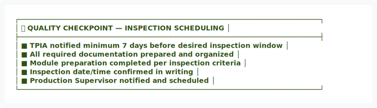
</div>

<details>
<summary>View ASCII Source</summary>

```
┌─────────────────────────────────────────────────────────────────────────────┐
│ ✅ QUALITY CHECKPOINT — INSPECTION SCHEDULING                               │
├─────────────────────────────────────────────────────────────────────────────┤
│ ■ TPIA notified minimum 7 days before desired inspection window             │
│ ■ All required documentation prepared and organized                         │
│ ■ Module preparation completed per inspection criteria                      │
│ ■ Inspection date/time confirmed in writing                                 │
│ ■ Production Supervisor notified and scheduled                              │
└─────────────────────────────────────────────────────────────────────────────┘
```
</details>


---

## 🔍 6. THIRD-PARTY INSPECTION PROCESS

### 6.1 Inspector Arrival & Documentation

When TPIA inspector arrives:


<div align="center">
  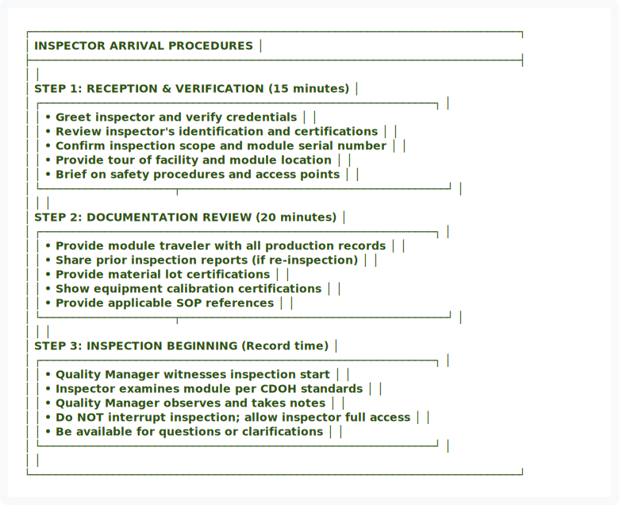
</div>

<details>
<summary>View ASCII Source</summary>

```
┌─────────────────────────────────────────────────────────────────────────────┐
│                      INSPECTOR ARRIVAL PROCEDURES                           │
├─────────────────────────────────────────────────────────────────────────────┤
│                                                                             │
│   STEP 1: RECEPTION & VERIFICATION (15 minutes)                            │
│   ┌──────────────────────────────────────────────────────────────┐         │
│   │ • Greet inspector and verify credentials                     │         │
│   │ • Review inspector's identification and certifications       │         │
│   │ • Confirm inspection scope and module serial number          │         │
│   │ • Provide tour of facility and module location               │         │
│   │ • Brief on safety procedures and access points               │         │
│   └─────────────────────┬──────────────────────────────────────────┘         │
│                         │                                                    │
│   STEP 2: DOCUMENTATION REVIEW (20 minutes)                                │
│   ┌──────────────────────────────────────────────────────────────┐         │
│   │ • Provide module traveler with all production records        │         │
│   │ • Share prior inspection reports (if re-inspection)          │         │
│   │ • Provide material lot certifications                        │         │
│   │ • Show equipment calibration certifications                  │         │
│   │ • Provide applicable SOP references                          │         │
│   └─────────────────────┬──────────────────────────────────────────┘         │
│                         │                                                    │
│   STEP 3: INSPECTION BEGINNING (Record time)                               │
│   ┌──────────────────────────────────────────────────────────────┐         │
│   │ • Quality Manager witnesses inspection start                 │         │
│   │ • Inspector examines module per CDOH standards               │         │
│   │ • Quality Manager observes and takes notes                   │         │
│   │ • Do NOT interrupt inspection; allow inspector full access   │         │
│   │ • Be available for questions or clarifications               │         │
│   └──────────────────────────────────────────────────────────────┘         │
│                                                                             │
└─────────────────────────────────────────────────────────────────────────────┘
```
</details>


### 6.2 Inspection Findings Documentation

Upon completion of inspection:

| Finding Category | Documentation Required | Format |
|:---|:---|:---|
| **Pass/Fail Determination** | Overall module disposition | Clear yes/no statement |
| **Inspection Scope Covered** | What was inspected | Checklist or narrative |
| **Deficiencies Found** | All non-conformances identified | Detailed description |
| **Severity Classification** | Major, Minor, or Critical | Standard classification |
| **Corrective Actions** | Required remediation steps | Specific action items |
| **Re-inspection Requirement** | If needed; when; scope | Yes/No with timeline |
| **Inspector Notes** | Observations and context | Professional documentation |
| **Photos/Evidence** | Any supporting documentation | File references |


<div align="center">
  
</div>

<details>
<summary>View ASCII Source</summary>

```
┌─────────────────────────────────────────────────────────────────────────────┐
│                     INSPECTION REPORT STRUCTURE                             │
├─────────────────────────────────────────────────────────────────────────────┤
│                                                                             │
│   ╔════════════════════════════════════════════════════════════╗            │
│   ║        THIRD-PARTY INSPECTION REPORT FORM                  ║            │
│   ╠════════════════════════════════════════════════════════════╣            │
│   ║                                                            ║            │
│   ║  Module Serial: ____________________                      ║            │
│   ║  Inspection Date: __________________                      ║            │
│   ║  Inspector Name: ___________________                      ║            │
│   ║  Inspection Type: [ ] Initial [ ] Re-insp [ ] Final       ║            │
│   ║                                                            ║            │
│   ╠════════════════════════════════════════════════════════════╣            │
│   ║  OVERALL DETERMINATION                                    ║            │
│   ║  [ ] ✅ PASS - Module complies with all HUD Code          ║            │
│   ║      requirements                                         ║            │
│   ║                                                            ║            │
│   ║  [ ] ⚠️  CONDITIONAL - Minor corrective actions required  ║            │
│   ║      Module may proceed with follow-up inspection          ║            │
│   ║                                                            ║            │
│   ║  [ ] ❌ FAIL - Major non-conformances found               ║            │
│   ║      Module cannot be delivered; rework required          ║            │
│   ║                                                            ║            │
│   ╠════════════════════════════════════════════════════════════╣            │
│   ║  FINDINGS & DEFICIENCIES                                  ║            │
│   ║  ───────────────────────────────────────────────────────  ║            │
│   ║  [Use separate attachment if more space needed]           ║            │
│   ║                                                            ║            │
│   ║  Finding #1: _________________________________             ║            │
│   ║  Severity: [ ] Major [ ] Minor    Category: ______        ║            │
│   ║  Required Action: ____________________________             ║            │
│   ║                                                            ║            │
│   ║  Finding #2: _________________________________             ║            │
│   ║  Severity: [ ] Major [ ] Minor    Category: ______        ║            │
│   ║  Required Action: ____________________________             ║            │
│   ║                                                            ║            │
│   ╠════════════════════════════════════════════════════════════╣            │
│   ║  RE-INSPECTION REQUIREMENTS                               ║            │
│   ║  [ ] Not Required - All findings minor, correctable        ║            │
│   ║  [ ] Required - After corrective actions completed        ║            │
│   ║      Timeline: ________________________                    ║            │
│   ║      Scope: ____________________________                  ║            │
│   ║                                                            ║            │
│   ╠════════════════════════════════════════════════════════════╣            │
│   ║  SIGNATURES & AUTHORIZATION                               ║            │
│   ║  Inspector: ________________________ Date: ___________    ║            │
│   ║  Company: _____________________ Credentials: __________   ║            │
│   ║  Quality Manager: ________________ Date: ___________    ║            │
│   ║                                                            ║            │
│   ╚════════════════════════════════════════════════════════════╝            │
│                                                                             │
└─────────────────────────────────────────────────────────────────────────────┘
```
</details>


---

## 📋 7. POST-INSPECTION FOLLOW-UP

### 7.1 Immediate Follow-Up Actions


<div align="center">
  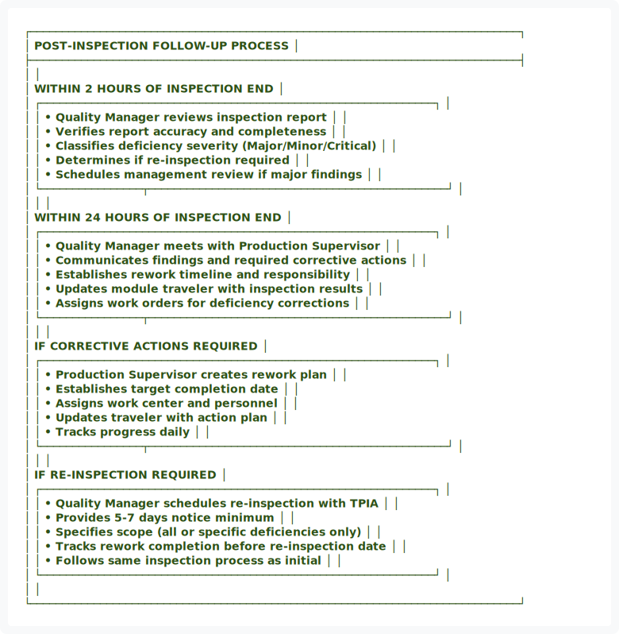
</div>

<details>
<summary>View ASCII Source</summary>

```
┌─────────────────────────────────────────────────────────────────────────────┐
│                    POST-INSPECTION FOLLOW-UP PROCESS                        │
├─────────────────────────────────────────────────────────────────────────────┤
│                                                                             │
│   WITHIN 2 HOURS OF INSPECTION END                                          │
│   ┌──────────────────────────────────────────────────────────────┐         │
│   │ • Quality Manager reviews inspection report                  │         │
│   │ • Verifies report accuracy and completeness                  │         │
│   │ • Classifies deficiency severity (Major/Minor/Critical)      │         │
│   │ • Determines if re-inspection required                       │         │
│   │ • Schedules management review if major findings              │         │
│   └────────────────┬───────────────────────────────────────────────┘         │
│                    │                                                         │
│   WITHIN 24 HOURS OF INSPECTION END                                         │
│   ┌──────────────────────────────────────────────────────────────┐         │
│   │ • Quality Manager meets with Production Supervisor           │         │
│   │ • Communicates findings and required corrective actions      │         │
│   │ • Establishes rework timeline and responsibility             │         │
│   │ • Updates module traveler with inspection results            │         │
│   │ • Assigns work orders for deficiency corrections             │         │
│   └────────────────┬───────────────────────────────────────────────┘         │
│                    │                                                         │
│   IF CORRECTIVE ACTIONS REQUIRED                                            │
│   ┌──────────────────────────────────────────────────────────────┐         │
│   │ • Production Supervisor creates rework plan                  │         │
│   │ • Establishes target completion date                         │         │
│   │ • Assigns work center and personnel                          │         │
│   │ • Updates traveler with action plan                          │         │
│   │ • Tracks progress daily                                      │         │
│   └────────────────┬───────────────────────────────────────────────┘         │
│                    │                                                         │
│   IF RE-INSPECTION REQUIRED                                                 │
│   ┌──────────────────────────────────────────────────────────────┐         │
│   │ • Quality Manager schedules re-inspection with TPIA           │         │
│   │ • Provides 5-7 days notice minimum                            │         │
│   │ • Specifies scope (all or specific deficiencies only)        │         │
│   │ • Tracks rework completion before re-inspection date         │         │
│   │ • Follows same inspection process as initial                 │         │
│   └──────────────────────────────────────────────────────────────┘         │
│                                                                             │
└─────────────────────────────────────────────────────────────────────────────┘
```
</details>


### 7.2 Corrective Action Tracking

All inspection findings requiring corrective action must be tracked:

| Data Field | Requirement | Purpose |
|:---|:---|:---|
| **Finding Description** | Exact reference from inspection report | Traceability |
| **Severity** | Major, Minor, or Critical | Priority setting |
| **Responsible Party** | Specific supervisor or team | Accountability |
| **Target Completion** | Specific date and time | Schedule management |
| **Action Plan** | Specific steps to remediate | Implementation detail |
| **Completion Evidence** | Photos, test results, documentation | Verification |
| **Inspector Sign-Off** | Re-inspection confirmation | Closure validation |
| **Closure Date** | When corrective action verified complete | Historical record |


<div align="center">
  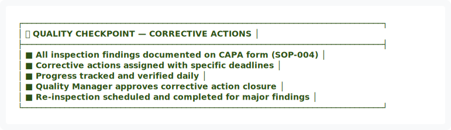
</div>

<details>
<summary>View ASCII Source</summary>

```
┌─────────────────────────────────────────────────────────────────────────────┐
│ ✅ QUALITY CHECKPOINT — CORRECTIVE ACTIONS                                  │
├─────────────────────────────────────────────────────────────────────────────┤
│ ■ All inspection findings documented on CAPA form (SOP-004)                 │
│ ■ Corrective actions assigned with specific deadlines                      │
│ ■ Progress tracked and verified daily                                      │
│ ■ Quality Manager approves corrective action closure                        │
│ ■ Re-inspection scheduled and completed for major findings                  │
└─────────────────────────────────────────────────────────────────────────────┘
```
</details>


### 7.3 Inspection Results Archival

All inspection documents must be properly archived:


<div align="center">
  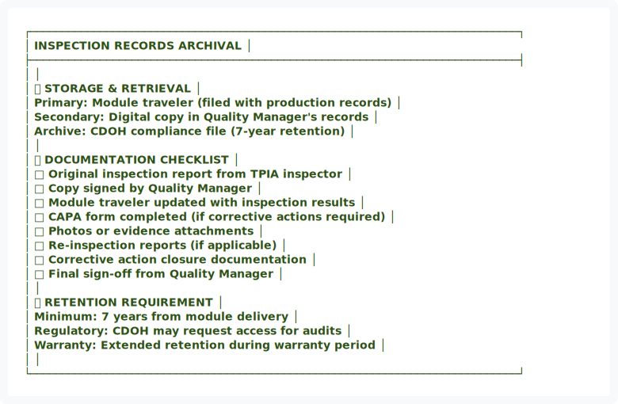
</div>

<details>
<summary>View ASCII Source</summary>

```
┌─────────────────────────────────────────────────────────────────────────────┐
│                     INSPECTION RECORDS ARCHIVAL                             │
├─────────────────────────────────────────────────────────────────────────────┤
│                                                                             │
│   📍 STORAGE & RETRIEVAL                                                    │
│   Primary: Module traveler (filed with production records)                   │
│   Secondary: Digital copy in Quality Manager's records                      │
│   Archive: CDOH compliance file (7-year retention)                          │
│                                                                             │
│   📋 DOCUMENTATION CHECKLIST                                                │
│   □ Original inspection report from TPIA inspector                          │
│   □ Copy signed by Quality Manager                                          │
│   □ Module traveler updated with inspection results                         │
│   □ CAPA form completed (if corrective actions required)                    │
│   □ Photos or evidence attachments                                          │
│   □ Re-inspection reports (if applicable)                                   │
│   □ Corrective action closure documentation                                 │
│   □ Final sign-off from Quality Manager                                     │
│                                                                             │
│   ⏱️ RETENTION REQUIREMENT                                                   │
│   Minimum: 7 years from module delivery                                     │
│   Regulatory: CDOH may request access for audits                            │
│   Warranty: Extended retention during warranty period                       │
│                                                                             │
└─────────────────────────────────────────────────────────────────────────────┘
```
</details>


---

## 📊 8. METRICS & PERFORMANCE INDICATORS


<div align="center">
  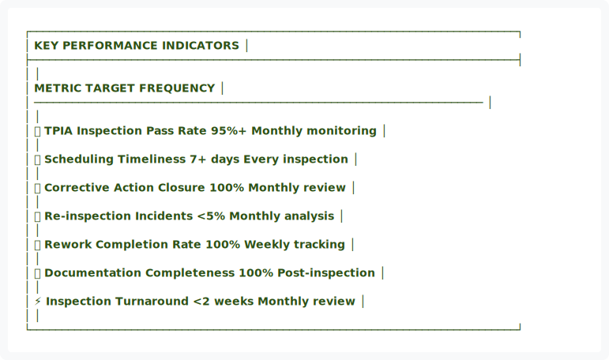
</div>

<details>
<summary>View ASCII Source</summary>

```
┌─────────────────────────────────────────────────────────────────────────────┐
│                          KEY PERFORMANCE INDICATORS                         │
├─────────────────────────────────────────────────────────────────────────────┤
│                                                                             │
│   METRIC                              TARGET         FREQUENCY              │
│   ───────────────────────────────────────────────────────────────────────  │
│                                                                             │
│   ✅ TPIA Inspection Pass Rate        95%+           Monthly monitoring    │
│                                                                             │
│   📅 Scheduling Timeliness            7+ days        Every inspection      │
│                                                                             │
│   🔄 Corrective Action Closure        100%           Monthly review        │
│                                                                             │
│   📊 Re-inspection Incidents          <5%            Monthly analysis      │
│                                                                             │
│   ⏰ Rework Completion Rate            100%           Weekly tracking       │
│                                                                             │
│   📋 Documentation Completeness       100%           Post-inspection       │
│                                                                             │
│   ⚡ Inspection Turnaround            <2 weeks       Monthly review        │
│                                                                             │
└─────────────────────────────────────────────────────────────────────────────┘
```
</details>


<div align="center">
  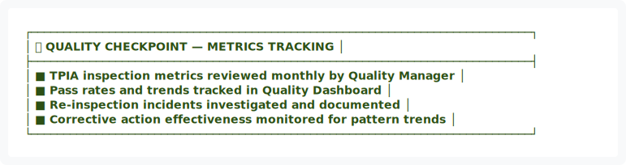
</div>

<details>
<summary>View ASCII Source</summary>

```
┌─────────────────────────────────────────────────────────────────────────────┐
│ ✅ QUALITY CHECKPOINT — METRICS TRACKING                                    │
├─────────────────────────────────────────────────────────────────────────────┤
│ ■ TPIA inspection metrics reviewed monthly by Quality Manager               │
│ ■ Pass rates and trends tracked in Quality Dashboard                        │
│ ■ Re-inspection incidents investigated and documented                       │
│ ■ Corrective action effectiveness monitored for pattern trends              │
└─────────────────────────────────────────────────────────────────────────────┘
```
</details>


━━━━━━━━━━━━━━━━━━━━━━━━━━━━━━━━━━━━━━━━━━━━━━━━━━━━━━━━━━━━━━━━━━━━━━━━━━━━━━

## 📎 9. APPENDICES

### Appendix A: TPIA Inspection Report Template
**Location:** `docs/forms/FORM-I004-TPIA-Inspection-Report.md`

### Appendix B: TPIA Agency Contact Information
**Location:** `docs/compliance/TPIA-Agency-Contacts.md`

### Appendix C: Corrective Action Follow-Up Template
**Location:** `docs/forms/FORM-CA-001-Corrective-Action-Form.md`

### Appendix D: CDOH Inspection Requirements Matrix
**Location:** `docs/compliance/CDOH-Requirements.md`

---

## ✍️ APPROVAL & AUTHORITY

| Role | Name | Signature | Date |
|:---|:---|:---:|:---:|
| **Quality Manager** | Quality Manager | _________________ | _________ |
| **Production Manager** | Production Manager | _________________ | _________ |
| **Plant Manager** | Plant Manager | _________________ | _________ |

---

## 📅 REVISION HISTORY

| Version | Date | Changes | Approved By |
|:---:|:---|:---|:---|
| 1.0 | 01/14/2026 | Initial TPIA coordination procedure | Quality Manager |
| 2.0 | 01/15/2026 | Applied visual design system upgrade | Quality Manager |

---

<div align="center">


<div align="center">
  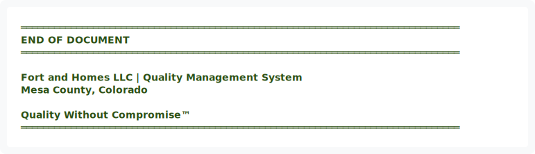
</div>

<details>
<summary>View ASCII Source</summary>

```
═══════════════════════════════════════════════════════════════════════════════
                               END OF DOCUMENT
═══════════════════════════════════════════════════════════════════════════════

               Fort and Homes LLC | Quality Management System
                         Mesa County, Colorado

                       Quality Without Compromise™
═══════════════════════════════════════════════════════════════════════════════
```
</details>


**DOCUMENT STATUS:** ✅ ACTIVE  
**EFFECTIVE DATE:** January 2026  
**NEXT REVIEW:** July 2026

</div>

