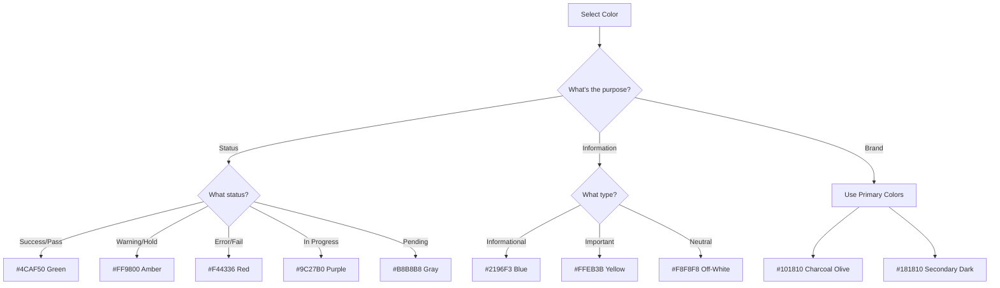

<div align="center">

# 🏗️ FORT HOMES LLC
## Quality Management System

---

### COLOR PALETTE REFERENCE

| Attribute | Value |
|:----------|:------|
| **Document ID** | `QMS-COLOR-2026` |
| **Revision** | `2.0` |
| **Effective Date** | January 2026 |
| **Process Owner** | Document Controller |
| **Classification** | CONTROLLED |
| **Review Cycle** | Semi-Annual |
| **Next Review** | July 2026 |

---

</div>

## 📋 Purpose

This document defines the complete color system for Fort Homes QMS documentation, including primary brand colors and extended accent colors for diagrams, visualizations, and interactive elements.

---

## 🎨 Color Philosophy

Fort Homes QMS uses a **professional, purposeful color system** that:
- Maintains strong brand identity
- Communicates status and urgency effectively
- Ensures accessibility and readability
- Provides visual hierarchy and clarity
- Works across print, screen, and PDF formats

---

## 🏢 Primary Brand Colors

### Charcoal Olive `#101810`

<div style="background: #101810; color: white; padding: 20px; border-radius: 4px; margin: 10px 0;">
  <strong>Charcoal Olive - #101810</strong><br>
  RGB: (16, 24, 16) | CMYK: (33%, 0%, 33%, 91%)
</div>

**Usage:**
- Primary headers and titles
- Primary text content
- Dark backgrounds for headers
- Document classification text
- Footer text

**Accessibility:**
- Contrast ratio with white: 18.2:1 (AAA)
- Excellent for body text on light backgrounds
- Use white text when using as background

**Example:**
```markdown
# Primary Header (uses #101810 in styled output)
```

---

### Secondary Dark `#181810`

<div style="background: #181810; color: white; padding: 20px; border-radius: 4px; margin: 10px 0;">
  <strong>Secondary Dark - #181810</strong><br>
  RGB: (24, 24, 16) | CMYK: (0%, 0%, 33%, 91%)
</div>

**Usage:**
- Subtle backgrounds
- Border colors for tables
- Shadow elements
- Secondary headers
- Divider lines

**Accessibility:**
- Contrast ratio with white: 17.8:1 (AAA)
- Suitable for borders and dividers

**Example:**
```html
<div style="border: 2px solid #181810;">
```

---

### Off-White `#F8F8F8`

<div style="background: #F8F8F8; color: #101810; padding: 20px; border-radius: 4px; margin: 10px 0; border: 1px solid #ddd;">
  <strong>Off-White - #F8F8F8</strong><br>
  RGB: (248, 248, 248) | CMYK: (0%, 0%, 0%, 3%)
</div>

**Usage:**
- Page backgrounds
- Light surfaces for cards
- Neutral container backgrounds
- Table alternating rows
- Document backgrounds

**Accessibility:**
- Very light - use dark text for contrast
- Provides subtle depth without distraction

**Example:**
```html
<div style="background: #F8F8F8;">
```

---

### Neutral Gray `#B8B8B8`

<div style="background: #B8B8B8; color: #101810; padding: 20px; border-radius: 4px; margin: 10px 0;">
  <strong>Neutral Gray - #B8B8B8</strong><br>
  RGB: (184, 184, 184) | CMYK: (0%, 0%, 0%, 28%)
</div>

**Usage:**
- Secondary text
- Border colors
- Divider lines
- Disabled states
- Placeholder text

**Accessibility:**
- Contrast ratio with white: 2.3:1
- Use for borders and non-critical text only
- Not suitable for primary content

**Example:**
```markdown
| Column 1 | Column 2 |
|:---------|:---------|
```

---

## ✨ Accent Colors (Extended Palette)

### Success Green `#4CAF50`

<div style="background: #4CAF50; color: white; padding: 20px; border-radius: 4px; margin: 10px 0;">
  <strong>Success Green - #4CAF50</strong><br>
  RGB: (76, 175, 80) | CMYK: (57%, 0%, 54%, 31%)
</div>

**Background Tint:** `#E8F5E9` (light green)

**Usage:**
- ✅ Approved status indicators
- Passed inspections
- Completed phases
- Quality checkpoints (passed)
- Success messages
- Positive metrics

**Accessibility:**
- Contrast ratio with white: 3.2:1
- Use white text on green background
- Background tint suitable for callout boxes

**Example:**
```html
<div style="background: linear-gradient(135deg, #E8F5E9 0%, #C8E6C9 100%); border-left: 4px solid #4CAF50;">
  <strong>✅ QUALITY CHECKPOINT</strong><br>
  Verification complete - proceed to next phase.
</div>
```

**Mermaid Usage:**
```
style NodeName fill:#4CAF50,stroke:#2E7D32,color:#fff
```

---

### Warning Amber `#FF9800`

<div style="background: #FF9800; color: white; padding: 20px; border-radius: 4px; margin: 10px 0;">
  <strong>Warning Amber - #FF9800</strong><br>
  RGB: (255, 152, 0) | CMYK: (0%, 40%, 100%, 0%)
</div>

**Background Tint:** `#FFF3E0` (light orange)

**Usage:**
- 🎯 Hold points (mandatory stops)
- ⚠️ Caution states
- Pending reviews
- Items requiring attention
- Warning messages
- Moderate priority items

**Accessibility:**
- Contrast ratio with white: 2.2:1
- Use white or dark text depending on context
- Background tint excellent for callout boxes

**Example:**
```html
<div style="background: linear-gradient(135deg, #FFF3E0 0%, #FFE0B2 100%); border-left: 4px solid #FF9800;">
  <strong>🎯 MANDATORY HOLD POINT</strong><br>
  Production SHALL NOT proceed until TPIA sign-off received.
</div>
```

**Mermaid Usage:**
```
style HoldPoint fill:#FF9800,stroke:#E65100,color:#fff
```

---

### Error Red `#F44336`

<div style="background: #F44336; color: white; padding: 20px; border-radius: 4px; margin: 10px 0;">
  <strong>Error Red - #F44336</strong><br>
  RGB: (244, 67, 54) | CMYK: (0%, 73%, 78%, 4%)
</div>

**Background Tint:** `#FFEBEE` (light red)

**Usage:**
- ❌ Failed inspections
- NCR (Nonconformance Reports)
- Critical safety warnings
- Error messages
- High priority issues
- Stop conditions

**Accessibility:**
- Contrast ratio with white: 3.6:1
- Always use white text on red background
- Background tint suitable for critical callouts

**Example:**
```html
<div style="background: linear-gradient(135deg, #FFEBEE 0%, #FFCDD2 100%); border-left: 4px solid #F44336;">
  <strong>⚠️ CRITICAL SAFETY</strong><br>
  Safety equipment required. PPE must be worn at all times.
</div>
```

**Mermaid Usage:**
```
style ErrorNode fill:#F44336,stroke:#C62828,color:#fff
```

---

### Info Blue `#2196F3`

<div style="background: #2196F3; color: white; padding: 20px; border-radius: 4px; margin: 10px 0;">
  <strong>Info Blue - #2196F3</strong><br>
  RGB: (33, 150, 243) | CMYK: (86%, 38%, 0%, 5%)
</div>

**Background Tint:** `#E3F2FD` (light blue)

**Usage:**
- ℹ️ Information notes
- Reference materials
- Documentation links
- Informational callouts
- Help text
- Secondary information

**Accessibility:**
- Contrast ratio with white: 3.1:1
- Use white text on blue background
- Background tint excellent for information boxes

**Example:**
```html
<div style="background: linear-gradient(135deg, #E3F2FD 0%, #BBDEFB 100%); border-left: 4px solid #2196F3;">
  <strong>ℹ️ NOTE</strong><br>
  Reference additional documentation for detailed specifications.
</div>
```

**Mermaid Usage:**
```
style InfoNode fill:#2196F3,stroke:#1565C0,color:#fff
```

---

### Process Purple `#9C27B0`

<div style="background: #9C27B0; color: white; padding: 20px; border-radius: 4px; margin: 10px 0;">
  <strong>Process Purple - #9C27B0</strong><br>
  RGB: (156, 39, 176) | CMYK: (11%, 78%, 0%, 31%)
</div>

**Background Tint:** `#F3E5F5` (light purple)

**Usage:**
- 🔄 In-progress states
- Active workflow indicators
- Review states
- Processing status
- Intermediate steps
- Workflow transitions

**Accessibility:**
- Contrast ratio with white: 4.9:1 (AA)
- Use white text on purple background
- Background tint suitable for progress indicators

**Example:**
```html
<div style="background: linear-gradient(135deg, #F3E5F5 0%, #E1BEE7 100%); border-left: 4px solid #9C27B0;">
  <strong>🔄 IN PROGRESS</strong><br>
  Work in progress - awaiting completion.
</div>
```

**Mermaid Usage:**
```
style InProgress fill:#9C27B0,stroke:#7B1FA2,color:#fff
```

---

### Highlight Yellow `#FFEB3B`

<div style="background: #FFEB3B; color: #101810; padding: 20px; border-radius: 4px; margin: 10px 0;">
  <strong>Highlight Yellow - #FFEB3B</strong><br>
  RGB: (255, 235, 59) | CMYK: (0%, 8%, 77%, 0%)
</div>

**Background Tint:** `#FFFDE7` (very light yellow)

**Usage:**
- ⭐ Important highlights
- Attention items
- Key findings
- Emphasized content
- Search results
- Temporary markers

**Accessibility:**
- Contrast ratio with white: 1.1:1
- **Always use dark text (#101810) on yellow**
- Very bright - use sparingly

**Example:**
```html
<div style="background: #FFFDE7; border-left: 4px solid #FFEB3B; color: #101810;">
  <strong>⭐ IMPORTANT</strong><br>
  This item requires immediate attention.
</div>
```

**Mermaid Usage:**
```
style HighlightNode fill:#FFEB3B,stroke:#F9A825,color:#101810
```

---

## 📊 Color Usage Matrix

### By Document State

| State | Primary Color | Background | Border | Text Color |
|:------|:-------------|:-----------|:-------|:-----------|
| **Approved** | #4CAF50 | #E8F5E9 | #4CAF50 | #101810 |
| **Pending** | #FF9800 | #FFF3E0 | #FF9800 | #101810 |
| **Rejected** | #F44336 | #FFEBEE | #F44336 | #101810 |
| **Draft** | #B8B8B8 | #F8F8F8 | #B8B8B8 | #101810 |
| **In Progress** | #9C27B0 | #F3E5F5 | #9C27B0 | #101810 |
| **Informational** | #2196F3 | #E3F2FD | #2196F3 | #101810 |

### By Inspection Result

| Result | Status Icon | Color | Background | Use Case |
|:-------|:-----------|:------|:-----------|:---------|
| **Pass** | ✅ | #4CAF50 | #E8F5E9 | Successful inspection |
| **Fail** | ❌ | #F44336 | #FFEBEE | Failed inspection, NCR |
| **Hold** | 🎯 | #FF9800 | #FFF3E0 | Hold point, awaiting approval |
| **Pending** | ⏳ | #B8B8B8 | #F8F8F8 | Not yet inspected |
| **In Progress** | 🔄 | #9C27B0 | #F3E5F5 | Currently being inspected |
| **Info** | ℹ️ | #2196F3 | #E3F2FD | Additional information |

### By Priority Level

| Priority | Icon | Color | Background | Use Case |
|:---------|:-----|:------|:-----------|:---------|
| **Critical** | 🔴 | #F44336 | #FFEBEE | Immediate action required |
| **High** | 🟡 | #FF9800 | #FFF3E0 | Important, time-sensitive |
| **Medium** | 🟢 | #4CAF50 | #E8F5E9 | Standard priority |
| **Low** | ⚪ | #B8B8B8 | #F8F8F8 | Nice to have |

---

## 🎨 Gradient Combinations

### Brand Gradients

**Primary Header Gradient:**
```css
background: linear-gradient(135deg, #101810 0%, #2D5016 100%);
```
- Dark charcoal to forest green
- Professional, branded appearance
- Use for document headers

**Success Gradient:**
```css
background: linear-gradient(135deg, #E8F5E9 0%, #C8E6C9 100%);
```
- Light green to medium green
- Use for success callout boxes

**Warning Gradient:**
```css
background: linear-gradient(135deg, #FFF3E0 0%, #FFE0B2 100%);
```
- Light orange to medium orange
- Use for hold point callout boxes

**Error Gradient:**
```css
background: linear-gradient(135deg, #FFEBEE 0%, #FFCDD2 100%);
```
- Light red to medium red
- Use for critical safety callouts

**Info Gradient:**
```css
background: linear-gradient(135deg, #E3F2FD 0%, #BBDEFB 100%);
```
- Light blue to medium blue
- Use for information callout boxes

**Progress Gradient:**
```css
background: linear-gradient(135deg, #F3E5F5 0%, #E1BEE7 100%);
```
- Light purple to medium purple
- Use for in-progress indicators

---

## 🔧 Implementation Guide

### Markdown Tables

Use natural markdown - colors applied in styled output:

```markdown
| Phase | Status | Result |
|:------|:------:|:-------|
| Phase 1 | ✅ | Pass |
| Phase 2 | 🔄 | In Progress |
| Phase 3 | ⏳ | Pending |
```

### HTML Callout Boxes

Copy-paste template with color variables:

```html
<!-- Replace COLOR with appropriate hex code -->
<div style="background: linear-gradient(135deg, LIGHT_COLOR 0%, MID_COLOR 100%); 
     border-left: 4px solid PRIMARY_COLOR; 
     padding: 16px; margin: 16px 0; border-radius: 4px;">
  <strong>ICON HEADING</strong><br>
  Body content here.
</div>
```

### Mermaid Diagrams

Apply color styling to nodes:

```
style NodeName fill:BACKGROUND_COLOR,stroke:BORDER_COLOR,color:TEXT_COLOR
```

**Examples:**
```
style Success fill:#4CAF50,stroke:#2E7D32,color:#fff
style Warning fill:#FF9800,stroke:#E65100,color:#fff
style Error fill:#F44336,stroke:#C62828,color:#fff
style Info fill:#2196F3,stroke:#1565C0,color:#fff
```

---

## ♿ Accessibility Standards

### WCAG 2.1 Compliance

All colors must meet minimum contrast ratios:

| Level | Contrast Ratio | Use Case |
|:------|:---------------|:---------|
| **AA** | 4.5:1 | Normal text (11pt+) |
| **AA** | 3:1 | Large text (14pt+ bold, 18pt+ regular) |
| **AAA** | 7:1 | Normal text (preferred) |
| **AAA** | 4.5:1 | Large text (preferred) |

### Color Contrast Ratios

| Color Combination | Ratio | Level | Pass/Fail |
|:------------------|:------|:------|:----------|
| **#101810 on #F8F8F8** | 18.2:1 | AAA | ✅ Pass |
| **#4CAF50 on white** | 3.2:1 | AA (large) | ✅ Pass |
| **#FF9800 on white** | 2.2:1 | - | ⚠️ Large text only |
| **#F44336 on white** | 3.6:1 | AA (large) | ✅ Pass |
| **#2196F3 on white** | 3.1:1 | AA (large) | ✅ Pass |
| **#9C27B0 on white** | 4.9:1 | AA | ✅ Pass |
| **White on #4CAF50** | 3.2:1 | AA (large) | ✅ Pass |
| **White on #FF9800** | 2.2:1 | - | ⚠️ Use dark text |
| **White on #F44336** | 3.6:1 | AA (large) | ✅ Pass |
| **White on #2196F3** | 3.1:1 | AA (large) | ✅ Pass |
| **White on #9C27B0** | 4.9:1 | AA | ✅ Pass |

### Color Blindness Considerations

Fort Homes palette accommodates common color vision deficiencies:

**Deuteranopia (Red-Green):**
- Use icons in addition to color
- Sufficient brightness contrast
- Purple/blue distinguishable from red/green

**Protanopia (Red-Green):**
- Similar to deuteranopia
- Icons essential for status indication

**Tritanopia (Blue-Yellow):**
- Red and green remain distinguishable
- Yellow used minimally, always with icons

**Best Practice:**
- Never rely on color alone
- Always include icons (✅❌🎯⏳🔄ℹ️)
- Use text labels in addition to color

---

## 📋 Color Selection Decision Tree



---

## ✅ Color Usage Checklist

Before publishing, verify:

- [ ] All colors from approved palette
- [ ] Contrast ratios meet WCAG AA minimum
- [ ] Icons used in addition to color for status
- [ ] Gradients use approved combinations
- [ ] Mermaid diagrams use brand colors
- [ ] Background colors paired with appropriate text colors
- [ ] No reliance on color alone for critical information
- [ ] Callout boxes use correct color for purpose
- [ ] Print/PDF output tested for color accuracy

---

## 📚 Related Documents

- **QMS-VISUAL-STYLE-GUIDE.md** - Master style guide
- **TYPOGRAPHY-REFERENCE.md** - Font standards
- **ICON-EMOJI-REFERENCE.md** - Icon usage
- **MERMAID-DIAGRAM-LIBRARY.md** - Diagram templates

---

## 🔄 Revision History

| Version | Date | Description | Author | Approved By |
|:--------|:-----|:------------|:-------|:------------|
| 1.0 | 2025-06-01 | Initial color palette | Document Controller | Quality Manager |
| 2.0 | 2026-01-15 | Extended accent colors, accessibility standards | Document Controller | Quality Manager |

---

## ✅ Approval Signatures

| Role | Name | Signature | Date |
|:-----|:-----|:----------|:-----|
| **Prepared By** | Document Controller | _________________ | 2026-01-15 |
| **Reviewed By** | Quality Manager | _________________ | 2026-01-15 |
| **Approved By** | General Manager | _________________ | 2026-01-15 |

---

**Document Classification:** CONTROLLED  
**Distribution:** All Document Authors  
**Next Review Date:** 2026-07-15  
**Custodian:** Document Controller

---

*Fort Homes LLC - Quality Management System*  
*Grand Junction, Colorado*
