<div align="center">

# 🏗️ FORT HOMES LLC
## Quality Management System Manual

---

### QMS-00X: [SECTION TITLE]

| Attribute | Value |
|:----------|:------|
| **Document ID** | `QMS-00X` |
| **Revision** | `2.0` |
| **Effective Date** | January 2026 |
| **Process Owner** | Quality Manager |
| **Classification** | CONTROLLED |
| **Review Cycle** | Semi-Annual |
| **Next Review** | July 2026 |
| **ISO 9001:2015 Clause** | [Clause Number - if applicable] |
| **HUD Code Reference** | [Reference - if applicable] |

---

</div>

## 📋 Document Control

| **Attribute** | **Details** |
|:--------------|:------------|
| **Supersedes** | QMS-00X Rev 1.0 |
| **Related Sections** | QMS-00X, QMS-00X |
| **Supporting SOPs** | SOP-XXX, SOP-XXX |
| **Distribution** | All personnel, TPIA, CDOH (on request) |
| **Custodian** | Document Controller |

---

## 🎯 Purpose & Scope

### Purpose

[Clear statement of what this section accomplishes and why it exists. 2-3 sentences.]

**Example:**
*This section of the Fort Homes Quality Management System defines the [specific topic/process/requirement]. It establishes the framework for [key objective] while ensuring compliance with HUD Code, Colorado Department of Housing regulations, and industry best practices.*

### Scope

**This section applies to:**
- [Scope item 1]
- [Scope item 2]
- [Scope item 3]

**This section does not apply to:**
- [Exclusion 1]
- [Exclusion 2]

---

## 📖 Overview

### Context

[Brief overview of why this section is important, how it fits into the overall QMS, and its relationship to Fort Homes' quality objectives.]

### Key Principles

1. **[Principle 1]** - [Description]
2. **[Principle 2]** - [Description]
3. **[Principle 3]** - [Description]
4. **[Principle 4]** - [Description]

---

## 🔗 References

### External Standards & Regulations

| Standard/Code | Section | Requirement |
|:-------------|:--------|:------------|
| **HUD Code** | [Reference] | [Specific requirement] |
| **CCR Title 24** | [Part] | [Specific requirement] |
| **NEC** | [Article] | [Specific requirement] |
| **CDOH Requirements** | [Section] | [Specific requirement] |
| **[Other]** | [Section] | [Specific requirement] |

### Internal Documents

| Document ID | Title | Purpose |
|:------------|:------|:--------|
| QMS-00X | [Related QMS Section] | [How it relates] |
| SOP-XXX | [Standard Operating Procedure] | [How it implements this section] |
| FORM-XXX | [Form/Template] | [How it documents compliance] |

---

## 📚 Definitions

| Term | Definition |
|:-----|:-----------|
| **[Term 1]** | [Clear, concise definition] |
| **[Term 2]** | [Clear, concise definition] |
| **[Term 3]** | [Clear, concise definition] |
| **Quality Management System (QMS)** | The complete set of policies, processes, procedures, and records used to achieve quality objectives |
| **Third-Party Inspection Agency (TPIA)** | NTA Inc - Independent inspection agency authorized by CDOH |
| **Nonconformance (NCR)** | Failure to meet a specified requirement |
| **Hold Point** | Mandatory inspection point where work cannot proceed without approval |

---

## 👥 Roles & Responsibilities

### Organization Structure


### Responsibility Matrix

| Role | Responsibilities | Authority |
|:-----|:----------------|:----------|
| **General Manager** | • Overall QMS accountability<br>• Resource allocation<br>• Management review | Approve QMS changes |
| **Quality Manager** | • QMS maintenance and improvement<br>• Internal audits<br>• CAPA management | Stop production for quality |
| **Production Manager** | • Production execution per QMS<br>• Team training<br>• Process compliance | Approve production changes |
| **Production Supervisors** | • Daily quality oversight<br>• Staff training<br>• Issue resolution | Stop work for defects |
| **QA Inspectors** | • Inspection and verification<br>• NCR documentation<br>• Hold point approval | Issue NCRs |
| **Document Controller** | • Document control system<br>• Version control<br>• Distribution | Release controlled documents |

### RACI Matrix - [Process Name]


**Legend:**
- **Responsible (R):** Does the work
- **Accountable (A):** Ultimately answerable
- **Consulted (C):** Input sought
- **Informed (I):** Kept in the loop

---

## ⚙️ Process & Procedures

### Process Overview

[High-level description of the process covered by this section]

```mermaid
flowchart TD
    subgraph Process["[PROCESS NAME]"]
        direction TB
        A["📦 Input"] --> B["⚙️ Process Step 1"]
        B --> C{"🔍 Decision Point?"}
        C -->|"Path A"| D["⚙️ Process Step 2A"]
        C -->|"Path B"| E["⚙️ Process Step 2B"]
        D --> F["📐 Quality Check"]
        E --> F
        F --> G{"✅ Pass?"}
        G -->|"Yes"| H["➡️ Output"]
        G -->|"No"| I["🔄 Corrective Action"]
        I --> B
    end
    
    style A fill:#4CAF50,stroke:#2E7D32,color:#fff
    style H fill:#2196F3,stroke:#1565C0,color:#fff
    style I fill:#FF9800,stroke:#E65100,color:#fff
```



---

### [Main Topic 1]

#### Requirements

[Detailed requirements for this topic]

**Fort Homes commits to:**
1. **[Requirement 1]**
   - [Specific implementation detail]
   - [How it's achieved]
   - [Who is responsible]

2. **[Requirement 2]**
   - [Specific implementation detail]
   - [How it's achieved]
   - [Who is responsible]

3. **[Requirement 3]**
   - [Specific implementation detail]
   - [How it's achieved]
   - [Who is responsible]

#### Implementation

**How we implement this:**

| Activity | Method | Frequency | Responsibility | Record |
|:---------|:-------|:----------|:--------------|:-------|
| [Activity 1] | [Method] | [Frequency] | [Role] | FORM-XXX |
| [Activity 2] | [Method] | [Frequency] | [Role] | FORM-XXX |
| [Activity 3] | [Method] | [Frequency] | [Role] | FORM-XXX |

**Supporting Procedures:**
- SOP-XXX: [Title and brief description]
- SOP-XXX: [Title and brief description]
- WI-XXX: [Title and brief description]

<div style="background: linear-gradient(135deg, #E3F2FD 0%, #BBDEFB 100%); border-left: 4px solid #2196F3; padding: 16px; margin: 16px 0; border-radius: 4px;">
  <strong>ℹ️ NOTE</strong><br>
  [Important information, clarification, or context for this topic]
</div>

---

### [Main Topic 2]

#### Requirements

[Detailed requirements for this topic]

#### Process Flow


#### Performance Monitoring

**Key Performance Indicators:**

| KPI | Target | Measurement | Frequency | Responsibility |
|:----|:-------|:------------|:----------|:--------------|
| [KPI 1] | [Target value] | [How measured] | [Frequency] | [Role] |
| [KPI 2] | [Target value] | [How measured] | [Frequency] | [Role] |
| [KPI 3] | [Target value] | [How measured] | [Frequency] | [Role] |

**Monitoring Method:**
- [Description of how monitoring is performed]
- [Data collection methods]
- [Reporting structure]

---

### [Main Topic 3]

#### Requirements

[Detailed requirements for this topic]

#### Risk Management

**Identified Risks:**

| Risk | Likelihood | Impact | Risk Level | Mitigation Strategy |
|:-----|:-----------|:-------|:-----------|:-------------------|
| [Risk 1] | H/M/L | H/M/L | 🔴/🟡/🟢 | [Strategy] |
| [Risk 2] | H/M/L | H/M/L | 🔴/🟡/🟢 | [Strategy] |
| [Risk 3] | H/M/L | H/M/L | 🔴/🟡/🟢 | [Strategy] |

**Risk Assessment Criteria:**
- **High (🔴):** Immediate action required
- **Medium (🟡):** Monitor and manage
- **Low (🟢):** Accept with awareness

---

### [Main Topic 4]

#### Requirements

[Detailed requirements for this topic]

#### Document Traceability


---

## 📊 Metrics & Measurement

### Quality Objectives

| Objective | Target | Current Status | Trend | Action |
|:----------|:-------|:--------------|:------|:-------|
| [Objective 1] | [Target] | [Current] | ↗️/➡️/↘️ | [Action if needed] |
| [Objective 2] | [Target] | [Current] | ↗️/➡️/↘️ | [Action if needed] |
| [Objective 3] | [Target] | [Current] | ↗️/➡️/↘️ | [Action if needed] |

### Performance Dashboard


### Reporting & Review

**Review Schedule:**


**Review Meetings:**
- **Daily:** Production metrics review
- **Weekly:** Quality trends and issues
- **Monthly:** KPI review and analysis
- **Quarterly:** Management review
- **Annual:** Complete QMS audit

---

## 🔄 Continuous Improvement

### Improvement Process

```mermaid
flowchart TD
    A["💡 Identify Opportunity"] --> B["📊 Analyze Data"]
    B --> C["🎯 Define Objective"]
    C --> D["📋 Plan Improvement"]
    D --> E["⚙️ Implement Change"]
    E --> F["📐 Measure Results"]
    F --> G{"✅ Improved?"}
    G -->|"Yes"| H["📝 Standardize"]
    G -->|"No"| I["🔄 Adjust Approach"]
    I --> D
    H --> J["🎓 Train & Communicate"]
    J --> K["🔍 Monitor Sustainability"]
    
    style A fill:#FFEB3B,stroke:#F9A825,color:#101810
    style H fill:#4CAF50,stroke:#2E7D32,color:#fff
    style G fill:#FF9800,stroke:#E65100,color:#fff
```



### Sources of Improvement Ideas

- 💡 Employee suggestions
- 📊 Data analysis and trends
- 🔍 Internal audits
- 📋 Customer feedback
- 🎯 Management review
- ⚠️ Nonconformances and CAPAs
- 🏆 Industry best practices
- 📚 Regulatory changes

### Improvement Tracking

| ID | Improvement Opportunity | Status | Responsible | Target Date | Impact |
|:---|:----------------------|:------:|:-----------|:------------|:-------|
| IMP-001 | [Description] | 🔄 | [Role] | YYYY-MM-DD | H/M/L |
| IMP-002 | [Description] | ✅ | [Role] | YYYY-MM-DD | H/M/L |
| IMP-003 | [Description] | ⏳ | [Role] | YYYY-MM-DD | H/M/L |

---

## 📋 Records & Documentation

### Required Records

| Record Type | Form/Document | Retention Period | Storage Location | Responsible |
|:-----------|:--------------|:-----------------|:-----------------|:-----------|
| [Record 1] | FORM-XXX | [X] years | [Location] | [Role] |
| [Record 2] | FORM-XXX | [X] years | [Location] | [Role] |
| [Record 3] | FORM-XXX | [X] years | [Location] | [Role] |

### Record Requirements

**All records shall:**
- ✅ Be legible and identifiable
- ✅ Be protected from damage and loss
- ✅ Be retrievable within [X] hours
- ✅ Have defined retention periods
- ✅ Be disposed of per retention schedule
- ✅ Maintain confidentiality as required

### Document Control

**This section is controlled through:**
- Version control managed by Document Controller
- Changes require Quality Manager approval
- Distribution tracked and verified
- Annual review scheduled
- Obsolete versions removed from use

<div style="background: linear-gradient(135deg, #FFF3E0 0%, #FFE0B2 100%); border-left: 4px solid #FF9800; padding: 16px; margin: 16px 0; border-radius: 4px;">
  <strong>⚠️ IMPORTANT</strong><br>
  Uncontrolled copies are for reference only. Always verify you are using the current revision from the QMS database.
</div>

---

## 🎓 Training & Competency

### Training Requirements

| Role | Required Training | Frequency | Verification Method |
|:-----|:-----------------|:----------|:-------------------|
| [Role 1] | This QMS section + [other] | Initial + Annual | Written test ≥80% |
| [Role 2] | This QMS section | Initial only | Training attendance |
| [Role 3] | [Specific training] | [Frequency] | [Method] |

### Competency Criteria

Personnel are considered competent when:
1. ✅ Required training completed
2. ✅ Assessment passed (if applicable)
3. ✅ Practical demonstration successful
4. ✅ Training record signed by trainer and trainee

**Training Records Maintained by:** HR Department / Training Coordinator  
**Retention:** Duration of employment + 7 years

---

## 🔍 Audit & Compliance

### Internal Audit Schedule

**This section shall be audited:**
- **Frequency:** [Frequency]
- **Audit Type:** [Type]
- **Auditor:** [Role/Department]
- **Criteria:** [Standards/requirements]

### Compliance Verification

**Compliance is verified through:**
- Internal audits
- Management reviews
- TPIA inspections
- CDOH inspections (when applicable)
- Customer audits (when applicable)

### External Inspections

| Agency | Type | Frequency | Requirements |
|:-------|:-----|:----------|:------------|
| **CDOH** | [Type] | [Frequency] | [Requirements] |
| **TPIA (NTA Inc)** | Hold point verification | Per production schedule | HUD Code compliance |
| **[Other]** | [Type] | [Frequency] | [Requirements] |

---

## ⚠️ Nonconformance Management

### When Nonconformances Occur

**If this section's requirements are not met:**

1. **Identify & Document**
   - Create NCR using FORM-NCR
   - Document specifics of nonconformance
   - Tag or segregate affected items (if applicable)

2. **Evaluate & Contain**
   - Assess impact and severity
   - Implement containment actions
   - Prevent further nonconforming output

3. **Investigate Root Cause**
   - Use 5 Why analysis
   - Identify contributing factors
   - Document findings

4. **Implement Correction**
   - Define corrective action
   - Assign responsibility
   - Set target completion date

5. **Verify Effectiveness**
   - QA verifies correction
   - Monitor for recurrence
   - Close NCR when verified

6. **Preventive Action** (if needed)
   - Create CAPA if systemic issue
   - Update procedures if needed
   - Train personnel on changes

**NCR Process Flow:**


---

## 📚 Supporting Procedures

### Detailed Implementation

This manual section is implemented through:

| Document ID | Title | Purpose |
|:------------|:------|:--------|
| SOP-XXX | [SOP Title] | [How it implements this section] |
| SOP-XXX | [SOP Title] | [How it implements this section] |
| WI-XXX | [WI Title] | [Specific task procedures] |
| FORM-XXX | [Form Title] | [Documentation/records] |

<div style="background: linear-gradient(135deg, #E3F2FD 0%, #BBDEFB 100%); border-left: 4px solid #2196F3; padding: 16px; margin: 16px 0; border-radius: 4px;">
  <strong>ℹ️ NOTE</strong><br>
  Refer to the individual SOPs and Work Instructions for detailed, step-by-step procedures. This manual section provides the overall framework and requirements.
</div>

---

## 🔗 Integration with Other QMS Sections

### Process Interaction Map

```mermaid
mindmap
  root((QMS-00X<br>[This Section]))
    QMS-001
      Context
      Stakeholders
    QMS-002
      Leadership
      Quality Policy
    QMS-003
      Risk Management
      Planning
    QMS-004
      Resources
      Competence
    QMS-005
      Operations
      Production
    QMS-006
      Monitoring
      Measurement
    QMS-007
      Improvement
      CAPA
```

### Interfaces

| Related Section | Interaction | Key Linkage |
|:---------------|:-----------|:-----------|
| QMS-00X | [How they interact] | [Specific connection] |
| QMS-00X | [How they interact] | [Specific connection] |
| QMS-00X | [How they interact] | [Specific connection] |

---

## 📊 Management Review Input

### Data Provided to Management

For management review, this section provides:

1. **Performance Metrics**
   - [Metric 1] current status and trend
   - [Metric 2] current status and trend
   - [Metric 3] current status and trend

2. **Issues & Concerns**
   - Summary of nonconformances
   - Recurring problems
   - Resource needs

3. **Improvement Opportunities**
   - Suggested improvements
   - Cost-benefit analysis
   - Implementation recommendations

4. **Compliance Status**
   - Audit findings
   - Regulatory compliance
   - Customer satisfaction

---

## ✅ Compliance Checklist

**This section is compliant when:**

- [ ] All requirements defined and documented
- [ ] Roles and responsibilities clearly assigned
- [ ] Procedures implemented and followed
- [ ] Personnel trained and competent
- [ ] Records maintained per requirements
- [ ] KPIs monitored and reported
- [ ] Nonconformances managed properly
- [ ] Continuous improvement active
- [ ] Audits conducted on schedule
- [ ] Management review completed
- [ ] External compliance verified
- [ ] Documentation current and controlled

---

## 🔄 Revision History

| Version | Date | Description | Author | Approved By |
|:--------|:-----|:------------|:-------|:------------|
| 1.0 | YYYY-MM-DD | Initial release | Quality Manager | General Manager |
| 2.0 | 2026-01-15 | Major revision per visual style guide, enhanced content | Quality Manager | General Manager |

**Summary of Changes (Rev 2.0):**
- Enhanced visual formatting per QMS-VISUAL-STYLE-GUIDE
- Added Mermaid diagrams for process flows
- Expanded performance monitoring section
- Added risk management details
- Enhanced compliance verification section
- Updated for current regulatory requirements

---

## ✅ Approval Signatures

| Role | Name | Signature | Date |
|:-----|:-----|:----------|:-----|
| **Prepared By** | Quality Manager | _________________ | YYYY-MM-DD |
| **Reviewed By** | [Department Head] | _________________ | YYYY-MM-DD |
| **Reviewed By** | [Department Head] | _________________ | YYYY-MM-DD |
| **Approved By** | General Manager | _________________ | YYYY-MM-DD |

---

**Document Classification:** CONTROLLED  
**Distribution:** All Personnel, Management, TPIA, CDOH (on request)  
**Next Review Date:** 2026-07-15  
**Custodian:** Document Controller

---

*Fort Homes LLC - Quality Management System Manual*  
*This document is part of the complete QMS and should be read in conjunction with all related sections.*  
*Grand Junction, Colorado*
