# 🏗️ FORT HOMES LLC
## Quality Management System

---

### [STANDARD OPERATING PROCEDURE TITLE]

| Attribute | Value |
|:----------|:------|
| **Document ID** | `SOP-XXX` |
| **Revision** | `2.0` |
| **Effective Date** | January 2026 |
| **Process Owner** | [Role/Name] |
| **Classification** | CONTROLLED |
| **Review Cycle** | Semi-Annual |
| **Next Review** | July 2026 |
| **Process Category** | [System/Support/Production] |
| **Related Phase** | [Phase 1-8 if applicable] |

---

## 📋 Document Control

| **Attribute** | **Details** |
|:--------------|:------------|
| **Supersedes** | SOP-XXX Rev 1.0 |
| **Related Documents** | QMS-00X, WI-XXX, FORM-XXX |
| **Distribution** | [List of recipients] |
| **Custodian** | Document Controller |

---

## 🎯 Purpose

[Brief statement of the procedure's purpose and objectives. 2-3 sentences maximum.]

**Example:**
*This Standard Operating Procedure (SOP) establishes the requirements and methodology for [specific process]. It ensures consistent execution of [process name] across all Fort Homes manufacturing operations while maintaining compliance with HUD Code, Colorado building codes, and company quality standards.*

---

## 📖 Scope

### Applies To

- **Departments:** [List applicable departments]
- **Personnel:** [List roles who must follow this SOP]
- **Products:** [Modules, components, or products affected]
- **Locations:** [Manufacturing facility, field operations, etc.]

### Does Not Apply To

- [List any exclusions]
- [Specify what is out of scope]

---

## 🔗 References

### Regulatory Requirements

| Code/Standard | Section | Requirement |
|:--------------|:--------|:------------|
| HUD Code | [Section] | [Requirement description] |
| CCR Title 24 | [Part] | [Requirement description] |
| NEC | [Article] | [Requirement description] |
| [Other] | [Section] | [Requirement description] |

### Internal Documents

| Document ID | Title | Revision |
|:------------|:------|:---------|
| QMS-00X | [Quality Manual Section] | 2.0 |
| WI-XXX | [Work Instruction] | 2.0 |
| FORM-XXX | [Related Form] | 2.0 |
| SOP-XXX | [Related SOP] | 2.0 |

---

## 📚 Definitions & Acronyms

| Term/Acronym | Definition |
|:-------------|:-----------|
| **TPIA** | Third-Party Inspection Agency (NTA Inc) |
| **CDOH** | Colorado Department of Housing |
| **NCR** | Nonconformance Report |
| **CAPA** | Corrective and Preventive Action |
| **Hold Point** | Mandatory inspection point where work cannot proceed without approval |
| **[Term]** | [Definition specific to this SOP] |

---

## 👥 Roles & Responsibilities

### RACI Matrix

### Responsibility Details

| Role | Responsibility | Authority |
|:-----|:---------------|:----------|
| **Process Owner** | Accountable for process execution and compliance | Approve process changes |
| **Production Supervisor** | Ensure team follows procedure | Stop work for quality issues |
| **Production Staff** | Execute procedure as written | Report nonconformances |
| **QA Inspector** | Verify compliance with procedure | Issue NCRs |
| **TPIA Inspector** | Third-party verification | Approve/reject hold points |
| **Quality Manager** | Audit procedure compliance | Approve procedure revisions |

---

## ⚙️ Procedure

### Process Overview

```mermaid
flowchart TD
    subgraph Process["🔄 [PROCESS NAME]"]
        direction TB
        A["📦 Input: [Input Description]"] --> B{"🔍 Initial Inspection"}
        B -->|"✅ Pass"| C["⚙️ Step 1: [Action]"]
        B -->|"❌ Fail"| D["📋 NCR Process"]
        D --> E["🔧 Corrective Action"]
        E --> B
        C --> F["⚙️ Step 2: [Action]"]
        F --> G["📐 Quality Verification"]
        G --> H{"🎯 HOLD POINT HP-X"}
        H -->|"✅ TPIA Approved"| I["➡️ Output/Next Process"]
        H -->|"❌ Reject"| J["🔄 Rework"]
        J --> F
    end
    
    style A fill:#4CAF50,stroke:#2E7D32,color:#fff
    style H fill:#FF9800,stroke:#E65100,color:#fff
    style I fill:#2196F3,stroke:#1565C0,color:#fff
    style D fill:#F44336,stroke:#C62828,color:#fff
```

---

### Step-by-Step Instructions

#### Step 1: [Action Name]

**Objective:** [What this step accomplishes]

**Prerequisites:**
- [ ] [Prerequisite 1]
- [ ] [Prerequisite 2]
- [ ] [Prerequisite 3]

**Instructions:**

1. **[Sub-step 1]**
   - Detailed instruction for sub-step
   - Include specific measurements, tolerances, or parameters
   - Reference any tools or equipment required

2. **[Sub-step 2]**
   - Additional detailed instructions
   - Include any safety considerations
   - Note any common mistakes to avoid

3. **[Sub-step 3]**
   - Continue with detailed instructions
   - Include verification criteria
   - Document any data to be recorded

**Quality Checkpoints:**
- ✅ [Verification item 1]
- ✅ [Verification item 2]
- ✅ [Verification item 3]

**Documentation:**
- Complete Form: `FORM-XXX` - [Form Name]
- Record: [Specific data to record]

  <strong>ℹ️ NOTE</strong> 
  [Any important notes, tips, or additional information for this step]

---

#### Step 2: [Action Name]

**Objective:** [What this step accomplishes]

**Prerequisites:**
- [ ] Step 1 completed successfully
- [ ] [Additional prerequisite]

**Instructions:**

1. **[Sub-step 1]**
   - [Detailed instruction]

2. **[Sub-step 2]**
   - [Detailed instruction]

**Quality Checkpoints:**
- ✅ [Verification item 1]
- ✅ [Verification item 2]

**Documentation:**
- Record: [Specific data to record]

  <strong>⚠️ CRITICAL SAFETY</strong> 
  [Any safety warnings or critical considerations for this step]

---

#### Step 3: Quality Verification

**Objective:** Verify all work meets quality standards before hold point

**Inspection Criteria:**

| Item | Specification | Measurement Method | Accept/Reject Criteria |
|:-----|:-------------|:-------------------|:-----------------------|
| [Item 1] | [Spec] | [Method] | Accept: [criteria] / Reject: [criteria] |
| [Item 2] | [Spec] | [Method] | Accept: [criteria] / Reject: [criteria] |
| [Item 3] | [Spec] | [Method] | Accept: [criteria] / Reject: [criteria] |

**Instructions:**

1. **Visual Inspection**
   - Inspect for [specific defects]
   - Check for [specific conditions]
   - Verify [specific requirements]

2. **Dimensional Verification**
   - Measure [specific dimensions]
   - Verify tolerances: [specifications]
   - Record measurements on `FORM-XXX`

3. **Functional Testing** (if applicable)
   - Test [specific functions]
   - Verify [specific performance]
   - Document results

**Documentation:**
- Complete: `FORM-XXX` - Quality Inspection Form
- Photo documentation required: Yes/No
- Inspector signature required: Yes

---

#### Step 4: Hold Point HP-X

  <strong>🎯 MANDATORY HOLD POINT HP-X</strong> 
  Production SHALL NOT proceed beyond this point until TPIA inspection is complete and sign-off is received.

**Hold Point Requirements:**

| Requirement | Details |
|:------------|:--------|
| **TPIA Required** | Yes / No |
| **Notification Lead Time** | [X] hours/days |
| **Inspection Duration** | Approximately [X] hours |
| **Required Documentation** | [List specific documents] |
| **Prerequisites** | All prior quality checks passed |

**TPIA Inspection Process:**

1. **Preparation**
   - Notify TPIA [X] hours/days in advance
   - Contact: [TPIA contact information]
   - Ensure all documentation is complete
   - Prepare work area for inspection access

2. **During Inspection**
   - Production supervisor must be present
   - Provide access to all areas
   - Have all records available
   - Answer inspector questions

3. **Post-Inspection**
   - Receive inspection report
   - If **APPROVED**: Proceed to next step
   - If **REJECTED**: Initiate NCR process (See Section: Nonconformances)

**Documentation:**
- `FORM-XXX` - TPIA Inspection Report
- TPIA signature and stamp required
- Photo evidence retained

---

#### Step 5: [Final Steps]

**Objective:** [What this step accomplishes]

**Instructions:**

1. **[Final sub-step]**
   - [Detailed instruction]

2. **Final Verification**
   - Verify all documentation complete
   - Ensure all signatures obtained
   - Confirm readiness for next phase

**Output:**
- ➡️ [Description of output or next process]
- Documentation package complete
- Authorization to proceed

---

## 📊 Quality Standards & Acceptance Criteria

### Acceptance Criteria

| Category | Criteria | Measurement | Target | Reject If |
|:---------|:---------|:------------|:-------|:----------|
| **Dimensional** | [Dimension] | [Method] | [Target ± tolerance] | Outside tolerance |
| **Visual** | [Appearance] | Visual inspection | [Standard] | Defects present |
| **Functional** | [Function] | [Test method] | [Performance standard] | Does not meet spec |
| **Documentation** | [Records] | Review | 100% complete | Any missing items |

### Quality Metrics

Track and report monthly:

**Target Performance:**
- First-time pass rate: ≥90%
- Rework rate: ≤10%
- NCR rate: ≤2%

---

## ⚠️ Nonconformances & Corrective Actions

### When to Issue NCR

Issue NCR when:
- ❌ Work does not meet acceptance criteria
- ❌ Process not followed as written
- ❌ Hold point failed inspection
- ❌ Safety violation occurred
- ❌ Documentation incomplete or incorrect

### NCR Process

**NCR Documentation:**
1. Complete `FORM-NCR` - Nonconformance Report
2. Conduct root cause analysis (5 Why)
3. Document corrective actions
4. Verify effectiveness
5. Close NCR with QA Manager approval

---

## 🛡️ Safety Requirements

### Personal Protective Equipment (PPE)

| Activity | Required PPE |
|:---------|:-------------|
| [Activity 1] | Safety glasses, gloves, [other] |
| [Activity 2] | Hard hat, steel-toed boots, [other] |
| [Activity 3] | [Specific PPE] |

### Safety Precautions

  <strong>⚠️ CRITICAL SAFETY</strong> 
  <ul>
    <li>[Safety requirement 1]</li>
    <li>[Safety requirement 2]</li>
    <li>[Safety requirement 3]</li>
  </ul>

### Emergency Procedures

| Emergency | Response Action |
|:----------|:---------------|
| **Injury** | Stop work, provide first aid, notify supervisor, call 911 if serious |
| **Fire** | Evacuate, activate alarm, call 911, use extinguisher only if safe |
| **Equipment Failure** | Stop work, lockout/tagout, notify maintenance |
| **Chemical Spill** | Evacuate area, contain if safe, notify supervisor, call emergency response |

**Emergency Contacts:**
- 🚨 Emergency: **911**
- 📞 Production Supervisor: [Phone]
- 📞 QA Manager: [Phone]
- 📞 Safety Officer: [Phone]

---

## 🔧 Tools, Equipment & Materials

### Required Tools

| Tool/Equipment | Specification | Calibration Required |
|:---------------|:--------------|:---------------------|
| [Tool 1] | [Spec/Model] | Yes/No - [Frequency] |
| [Tool 2] | [Spec/Model] | Yes/No - [Frequency] |
| [Tool 3] | [Spec/Model] | Yes/No - [Frequency] |

### Required Materials

| Material | Specification | Supplier |
|:---------|:-------------|:---------|
| [Material 1] | [Spec/Grade] | [Supplier name] |
| [Material 2] | [Spec/Grade] | [Supplier name] |
| [Material 3] | [Spec/Grade] | [Supplier name] |

### Material Verification

- Verify material certificates match specifications
- Check material condition (no damage, proper storage)
- Confirm quantity sufficient for job
- Document material lot/batch numbers on `FORM-XXX`

---

## 📋 Records & Documentation

### Required Records

| Document | Form ID | Retention Period | Storage Location |
|:---------|:--------|:-----------------|:-----------------|
| [Record 1] | FORM-XXX | [X] years | [Location/System] |
| [Record 2] | FORM-XXX | [X] years | [Location/System] |
| [Record 3] | FORM-XXX | [X] years | [Location/System] |

### Documentation Requirements

**During Process:**
- ✅ Record all measurements and observations
- ✅ Document any deviations or nonconformances
- ✅ Obtain required signatures
- ✅ Take photos if required

**Upon Completion:**
- ✅ Verify all forms complete
- ✅ Submit to QA for review
- ✅ Upload to QMS database within [X] hours
- ✅ Retain hard copies per retention schedule

---

## 🎓 Training & Competency

### Training Requirements

| Role | Required Training | Competency Verification |
|:-----|:-----------------|:------------------------|
| [Role 1] | This SOP + WI-XXX | Practical demonstration |
| [Role 2] | This SOP only | Written test ≥80% |
| [Role 3] | This SOP + [Other] | Supervised execution |

### Competency Criteria

Personnel are considered competent when:
1. ✅ Training completed and documented
2. ✅ Written test passed (if applicable)
3. ✅ Practical demonstration successful
4. ✅ Supervised execution completed
5. ✅ Trainer signature obtained

**Training Records:**
- Document ID: `FORM-TRAIN`
- Retention: Duration of employment + 7 years
- Annual refresher required: Yes/No

---

## 🔄 Related Work Instructions

Detailed step-by-step work instructions for this process:

| Document ID | Title | Purpose |
|:------------|:------|:--------|
| WI-XXX | [Work Instruction Title] | Detailed execution steps for [specific task] |
| WI-XXX | [Work Instruction Title] | Detailed execution steps for [specific task] |

  <strong>ℹ️ NOTE</strong> 
  Refer to work instructions for detailed, step-by-step procedures with photos and specific techniques.

---

## 📊 Process Metrics & KPIs

### Key Performance Indicators

| KPI | Target | Measurement Frequency | Responsibility |
|:----|:-------|:---------------------|:---------------|
| First-time pass rate | ≥90% | Monthly | QA Manager |
| Average cycle time | [X] hours | Monthly | Process Owner |
| NCR rate | ≤2% | Monthly | QA Manager |
| TPIA rejection rate | ≤5% | Monthly | QA Manager |

### Monitoring & Reporting

**Review Meetings:**
- **Daily:** Production supervisor reviews metrics
- **Weekly:** QA reviews trends and issues
- **Monthly:** Management reviews KPIs
- **Quarterly:** Process improvement review

---

## 🔄 Continuous Improvement

### Process Improvement Opportunities

Encourage all personnel to identify:
- 💡 Time-saving improvements
- 💡 Quality enhancements
- 💡 Safety improvements
- 💡 Cost reduction ideas

**Submit suggestions to:** [Process Owner contact]

### Change Management

Changes to this SOP require:
1. Change request submission
2. Impact assessment
3. QA Manager review
4. Management approval
5. Training on changes
6. Document revision

---

## 📚 Appendices

### Appendix A: Inspection Checklist

| Item | Requirement | Pass/Fail | Notes |
|:-----|:-----------|:---------:|:------|
| [Item 1] | [Specification] | ☐ | |
| [Item 2] | [Specification] | ☐ | |
| [Item 3] | [Specification] | ☐ | |

### Appendix B: Troubleshooting Guide

| Problem | Possible Cause | Solution |
|:--------|:--------------|:---------|
| [Problem 1] | [Cause] | [Solution steps] |
| [Problem 2] | [Cause] | [Solution steps] |
| [Problem 3] | [Cause] | [Solution steps] |

### Appendix C: Reference Photos

*Include reference photos showing:*
- Correct execution examples
- Common defects to avoid
- Proper tool/equipment setup
- Measurement techniques

---

## 🔄 Revision History

| Version | Date | Description | Author | Approved By |
|:--------|:-----|:------------|:-------|:------------|
| 1.0 | YYYY-MM-DD | Initial release | [Author] | [Approver] |
| 2.0 | 2026-01-15 | Major revision per new style guide | [Author] | Quality Manager |

**Summary of Changes (Rev 2.0):**
- Enhanced visual formatting per QMS-VISUAL-STYLE-GUIDE
- Added Mermaid diagrams for process flows
- Expanded safety requirements section
- Added troubleshooting guide
- Updated quality metrics and KPIs

---

## ✅ Approval Signatures

| Role | Name | Signature | Date |
|:-----|:-----|:----------|:-----|
| **Prepared By** | [Author Name] | _________________ | YYYY-MM-DD |
| **Technical Review** | [Process Owner] | _________________ | YYYY-MM-DD |
| **QA Review** | Quality Manager | _________________ | YYYY-MM-DD |
| **Approved By** | General Manager | _________________ | YYYY-MM-DD |

---

**Document Classification:** CONTROLLED  
**Distribution:** Production Supervisors, Production Staff, QA Team, TPIA Inspectors  
**Next Review Date:** 2026-07-15  
**Custodian:** Document Controller

---

*Fort Homes LLC - Quality Management System*  
*Grand Junction, Colorado*
