# 🏗️ FORT HOMES LLC
## Quality Management System

---

### [WORK INSTRUCTION TITLE]

| Attribute | Value |
|:----------|:------|
| **Document ID** | `WI-XXX` |
| **Revision** | `2.0` |
| **Effective Date** | January 2026 |
| **Process Owner** | [Role/Name] |
| **Classification** | CONTROLLED |
| **Review Cycle** | Semi-Annual |
| **Next Review** | July 2026 |
| **Parent SOP** | `SOP-XXX` - [SOP Title] |
| **Skill Level** | [Basic/Intermediate/Advanced] |
| **Estimated Time** | [X] minutes/hours |

---

## 📋 Document Control

| **Attribute** | **Details** |
|:--------------|:------------|
| **Supersedes** | WI-XXX Rev 1.0 |
| **Parent SOP** | SOP-XXX - [SOP Title] |
| **Related Documents** | FORM-XXX, WI-XXX |
| **Distribution** | Production staff, supervisors |
| **Custodian** | Document Controller |

---

## 🎯 Purpose

[Brief, clear statement of what this work instruction teaches. One sentence ideal.]

**Example:**
*This work instruction provides step-by-step guidance for [specific task], ensuring consistent quality and compliance with Fort Homes standards.*

---

## 📖 Scope

**This instruction covers:**
- [Specific task 1]
- [Specific task 2]
- [Specific task 3]

**This instruction does NOT cover:**
- [Out of scope item 1]
- [Out of scope item 2]

---

## ⚠️ Safety First

  <strong>⚠️ CRITICAL SAFETY</strong> 
  <strong>Required PPE:</strong>
  <ul>
    <li>[PPE item 1] - [Why it's needed]</li>
    <li>[PPE item 2] - [Why it's needed]</li>
    <li>[PPE item 3] - [Why it's needed]</li>
  </ul>
  <strong>Hazards:</strong>
  <ul>
    <li>⚠️ [Hazard 1] - [Precaution]</li>
    <li>⚠️ [Hazard 2] - [Precaution]</li>
    <li>⚠️ [Hazard 3] - [Precaution]</li>
  </ul>

### Emergency Stop Conditions

🛑 **STOP WORK IMMEDIATELY if:**
- [ ] [Safety condition 1]
- [ ] [Safety condition 2]
- [ ] [Safety condition 3]
- [ ] Anyone is injured
- [ ] Equipment malfunctions

**Notify:** Production Supervisor immediately  
**Emergency:** Call 911 for serious injuries

---

## 🔧 Tools & Materials

### Tools Required

| Tool | Specification | Purpose | Calibration |
|:-----|:-------------|:--------|:------------|
| [Tool 1] | [Model/Size] | [What it's used for] | Yes/No |
| [Tool 2] | [Model/Size] | [What it's used for] | Yes/No |
| [Tool 3] | [Model/Size] | [What it's used for] | Yes/No |

### Materials Required

| Material | Specification | Quantity | Location |
|:---------|:-------------|:---------|:---------|
| [Material 1] | [Spec/Grade] | [Qty per unit] | [Where stored] |
| [Material 2] | [Spec/Grade] | [Qty per unit] | [Where stored] |
| [Material 3] | [Spec/Grade] | [Qty per unit] | [Where stored] |

### Equipment Setup

**Before starting, verify:**
- ✅ All tools are in good condition
- ✅ Materials meet specifications
- ✅ Work area is clean and organized
- ✅ Safety equipment is available
- ✅ Adequate lighting
- ✅ All measurements/drawings available

---

## 📐 Specifications & Standards

### Key Specifications

| Dimension/Parameter | Specification | Tolerance | Measurement Method |
|:--------------------|:-------------|:----------|:-------------------|
| [Dimension 1] | [Value] | ± [Tolerance] | [How to measure] |
| [Dimension 2] | [Value] | ± [Tolerance] | [How to measure] |
| [Dimension 3] | [Value] | ± [Tolerance] | [How to measure] |

### Reference Standards

- **HUD Code:** [Specific requirement]
- **Building Code:** [Specific requirement]
- **Company Standard:** [Specific requirement]

---

## 📝 Step-by-Step Instructions

  <strong>ℹ️ IMPORTANT</strong> 
  Follow these steps in order. Do not skip steps. If you have questions, ask your supervisor before proceeding.

---

### Preparation Phase

#### Step 1: Review Work Order & Plans

**Time:** 5 minutes

**What to do:**
1. Obtain work order number: `_______________`
2. Review drawings/specifications for this unit
3. Verify material list matches plans
4. Note any special requirements or customer options

**Check before proceeding:**
- ☐ Work order number recorded
- ☐ Plans reviewed and understood
- ☐ All materials available
- ☐ Any questions clarified with supervisor

---

#### Step 2: Prepare Work Area

**Time:** 10 minutes

**What to do:**
1. **Clear and clean workspace**
   - Remove debris and obstacles
   - Sweep area if needed
   - Ensure 3-foot clearance around work zone

2. **Organize tools and materials**
   - Place tools within easy reach
   - Arrange materials in order of use
   - Position equipment for efficient workflow

3. **Set up safety barriers** (if needed)
   - Mark off work zone with caution tape
   - Post safety signs
   - Ensure adequate ventilation

**Photos:**

*[Include photo of properly prepared work area]*

**Check before proceeding:**
- ☐ Work area clean and organized
- ☐ Tools laid out and ready
- ☐ Materials verified and accessible
- ☐ Safety barriers in place

---

### Execution Phase

#### Step 3: [First Major Task]

**Time:** [X] minutes

**Objective:** [What this step accomplishes]

**Step 3.1: [Sub-task name]**

**What to do:**
1. [First action - be very specific]
   - Hold [tool] at [specific angle/position]
   - Apply [specific force/technique]
   - Ensure [specific alignment/condition]

2. [Second action]
   - [Detailed instruction]
   - [Include specific measurements]
   - [Note any techniques or tricks]

3. [Third action]
   - [Detailed instruction]

**Photos:**

*[Include photo showing Step 3.1]*

**✅ Quality Check:**
- [ ] [Specific verification]
- [ ] [Specific measurement check]
- [ ] [Visual inspection criteria]

  <strong>💡 PRO TIP</strong> 
  [Helpful tip or common mistake to avoid]

---

**Step 3.2: [Next sub-task]**

**What to do:**
1. [Detailed action]
   - [Specific technique]
   - [Important points]

2. [Next action]
   - [Details]

**Photos:**

*[Include photo showing Step 3.2]*

**Measurement:**
- Measure: [What to measure]
- Target: [Specification] ± [Tolerance]
- Record on: Form `FORM-XXX`

**✅ Quality Check:**
- [ ] Measurement within tolerance
- [ ] Visual appearance acceptable
- [ ] No defects visible

---

#### Step 4: [Second Major Task]

**Time:** [X] minutes

**Objective:** [What this step accomplishes]

**Prerequisites:**
- ✅ Step 3 completed and verified
- ✅ [Any specific prerequisites]

**What to do:**

1. **[First action]**
   - [Very detailed instruction]
   - [Include specific hand positions, angles, techniques]
   - [Note any sensory cues - sounds, feel, appearance]

2. **[Second action]**
   - [Detailed instruction]
   - [Include common mistakes to avoid]

3. **[Third action]**
   - [Detailed instruction]

**Photos - Sequence:**

*Photo 1: [Starting position]*  
*Photo 2: [Mid-process]*  
*Photo 3: [Completed result]*

**✅ Quality Check:**
- [ ] [Verification 1]
- [ ] [Verification 2]
- [ ] [Verification 3]

**Common Problems & Solutions:**

| Problem | Likely Cause | Solution |
|:--------|:------------|:---------|
| [Problem 1] | [Cause] | [Step-by-step fix] |
| [Problem 2] | [Cause] | [Step-by-step fix] |

---

#### Step 5: [Third Major Task]

**Time:** [X] minutes

**Objective:** [What this step accomplishes]

**What to do:**

1. [Action 1]
2. [Action 2]
3. [Action 3]

**Photos:**

*[Include relevant photos]*

**Measurement Table:**

| Point | Specification | Actual | Pass/Fail |
|:------|:-------------|:-------|:---------:|
| Point A | [Spec] ± [Tol] | _____ | ☐ |
| Point B | [Spec] ± [Tol] | _____ | ☐ |
| Point C | [Spec] ± [Tol] | _____ | ☐ |

**✅ Quality Check:**
- [ ] All measurements within tolerance
- [ ] All points verified
- [ ] Measurements recorded

---

### Verification Phase

#### Step 6: Final Quality Inspection

**Time:** 10 minutes

**Objective:** Verify all work meets quality standards

**Visual Inspection:**

Walk around the completed work and check:

1. **Overall Appearance**
   - [ ] Clean and professional
   - [ ] No visible defects
   - [ ] Proper alignment
   - [ ] Consistent spacing/placement

2. **Specific Points** (refer to checklist)
   - [ ] [Check point 1]
   - [ ] [Check point 2]
   - [ ] [Check point 3]
   - [ ] [Check point 4]
   - [ ] [Check point 5]

3. **Functional Check** (if applicable)
   - [ ] [Function test 1]
   - [ ] [Function test 2]
   - [ ] [Function test 3]

**Dimensional Verification:**

Re-check critical dimensions:

| Dimension | Spec | Tolerance | Actual | Pass/Fail |
|:----------|:-----|:----------|:-------|:---------:|
| [Dim 1] | [Value] | ± [Tol] | _____ | ☐ |
| [Dim 2] | [Value] | ± [Tol] | _____ | ☐ |
| [Dim 3] | [Value] | ± [Tol] | _____ | ☐ |

---

#### Step 7: Documentation & Sign-Off

**Time:** 5 minutes

**What to do:**

1. **Complete inspection form**
   - Fill out `FORM-XXX` completely
   - Record all measurements
   - Note any deviations or issues
   - Include work order number

2. **Take required photos**
   - Overview shot showing complete work
   - Close-up of critical features
   - Any special features or conditions
   - Label photos with work order number

3. **Obtain signatures**
   - Worker signature: _________________
   - Date: _________________
   - Supervisor review: _________________ (if required)

4. **Submit documentation**
   - Place completed form in [location]
   - Upload photos to [system]
   - Notify QA if required for hold point

**Documentation Checklist:**
- ☐ Form `FORM-XXX` completed
- ☐ All measurements recorded
- ☐ Photos taken and labeled
- ☐ Worker signature
- ☐ Form submitted
- ☐ QA notified (if applicable)

---

## 🎯 Quality Acceptance Criteria

### Must Pass All:

| Criteria | Specification | Measurement | Accept If | Reject If |
|:---------|:-------------|:------------|:----------|:----------|
| **[Criteria 1]** | [Spec] | [Method] | [Condition] | [Condition] |
| **[Criteria 2]** | [Spec] | [Method] | [Condition] | [Condition] |
| **[Criteria 3]** | [Spec] | [Method] | [Condition] | [Condition] |

### Visual Standards

**Acceptable:**
- [Standard 1]
- [Standard 2]
- [Standard 3]

**NOT Acceptable - Reject:**
- ❌ [Defect type 1]
- ❌ [Defect type 2]
- ❌ [Defect type 3]

---

## 🔍 Good vs. Bad Examples

### Example 1: [Feature Name]

| ✅ GOOD - Accept | ❌ BAD - Reject |
|:-----------------|:----------------|
| *[Photo of acceptable work]* | *[Photo of unacceptable work]* |
| • [Why this is good] | • [What's wrong here] |
| • [Key feature to look for] | • [Why this fails] |

### Example 2: [Feature Name]

| ✅ GOOD - Accept | ❌ BAD - Reject |
|:-----------------|:----------------|
| *[Photo of acceptable work]* | *[Photo of unacceptable work]* |
| • [Why this is good] | • [What's wrong here] |
| • [Key feature to look for] | • [Why this fails] |

---

## ❗ Troubleshooting Guide

### Problem-Solution Matrix

| Symptom/Problem | Possible Causes | Diagnostic Steps | Solution |
|:----------------|:---------------|:-----------------|:---------|
| [Problem 1] | • [Cause A] • [Cause B] | 1. Check [item] 2. Verify [item] | [Step-by-step solution] |
| [Problem 2] | • [Cause A] • [Cause B] | 1. Check [item] 2. Verify [item] | [Step-by-step solution] |
| [Problem 3] | • [Cause A] • [Cause B] | 1. Check [item] 2. Verify [item] | [Step-by-step solution] |

### When to Ask for Help

**Call supervisor immediately if:**
- 🚨 Safety issue or hazard
- 🚨 Major defect discovered
- 🚨 Equipment malfunction
- 🚨 Material defect or shortage
- 🚨 Unable to meet specifications
- 🚨 Drawing/specification unclear

**Contact:** [Supervisor name/phone]

---

## 📊 Process Flow

```mermaid
flowchart TD
    A["📦 Start: Receive Work Order"] --> B["📋 Review Plans & Materials"]
    B --> C["🔧 Prepare Work Area"]
    C --> D["⚙️ Execute Step 3: [Task]"]
    D --> E{"✅ Quality Check Pass?"}
    E -->|"No"| F["🔧 Rework/Correct"]
    F --> D
    E -->|"Yes"| G["⚙️ Execute Step 4: [Task]"]
    G --> H{"✅ Quality Check Pass?"}
    H -->|"No"| I["🔧 Rework/Correct"]
    I --> G
    H -->|"Yes"| J["⚙️ Execute Step 5: [Task]"]
    J --> K["🔍 Final Quality Inspection"]
    K --> L{"🎯 All Criteria Met?"}
    L -->|"No"| M["📋 Create NCR"]
    M --> N["🔧 Corrective Action"]
    N --> K
    L -->|"Yes"| O["📝 Complete Documentation"]
    O --> P["✅ Work Complete"]
    
    style A fill:#4CAF50,stroke:#2E7D32,color:#fff
    style P fill:#4CAF50,stroke:#2E7D32,color:#fff
    style M fill:#F44336,stroke:#C62828,color:#fff
```

---

## 📝 Quick Reference Checklist

Use this checklist as a quick reminder during work:

### Pre-Work ✅
- [ ] Work order reviewed
- [ ] Plans/drawings available
- [ ] PPE worn
- [ ] Tools ready
- [ ] Materials verified
- [ ] Work area prepared

### During Work ✅
- [ ] Following steps in order
- [ ] Checking measurements as you go
- [ ] Recording data on form
- [ ] Maintaining quality standards
- [ ] Keeping area clean and organized

### Quality Checks ✅
- [ ] Step 3 quality check passed
- [ ] Step 4 quality check passed
- [ ] Step 5 quality check passed
- [ ] Final dimensions verified
- [ ] Visual inspection passed
- [ ] Functional test passed (if applicable)

### Documentation ✅
- [ ] Form `FORM-XXX` completed
- [ ] All measurements recorded
- [ ] Photos taken
- [ ] Worker signature
- [ ] Form submitted
- [ ] QA notified (if hold point)

---

## 🎓 Training & Competency

### Training Requirements

**To perform this work instruction, worker must have:**
- [ ] Completed SOP-XXX training
- [ ] Completed WI-XXX training (this document)
- [ ] Demonstrated competency to trainer
- [ ] Received supervisor sign-off

### Competency Verification

**Worker demonstrates competency by:**
1. Explaining the purpose of each step
2. Performing the work correctly under supervision
3. Meeting all quality standards
4. Completing documentation properly

**Trainer:** _________________  
**Date:** _________________  
**Worker:** _________________  
**Competency Verified:** ☐ Yes

---

## 📚 Related Documents

| Document ID | Title | Purpose |
|:------------|:------|:--------|
| SOP-XXX | [Parent SOP] | Overall process procedure |
| FORM-XXX | [Inspection Form] | Quality documentation |
| WI-XXX | [Related WI] | Related work instruction |
| [Drawing] | [Drawing number] | Technical specifications |

---

## 🔄 Continuous Improvement

### Feedback Welcome!

If you have suggestions for improving this work instruction:
- 💡 Clearer photos
- 💡 Better explanations
- 💡 Time-saving techniques
- 💡 Safety improvements

**Submit to:** [Process Owner / Supervisor]  
**Email:** [email address]

Your experience matters! Help us make this better.

---

## 🔄 Revision History

| Version | Date | Description | Author | Approved By |
|:--------|:-----|:------------|:-------|:------------|
| 1.0 | YYYY-MM-DD | Initial release | [Author] | [Approver] |
| 2.0 | 2026-01-15 | Enhanced with photos, troubleshooting, updated format | [Author] | Quality Manager |

**Summary of Changes (Rev 2.0):**
- Added step-by-step photos
- Expanded quality criteria section
- Added good vs. bad examples
- Enhanced troubleshooting guide
- Added process flow diagram
- Updated per QMS visual style guide

---

## ✅ Approval Signatures

| Role | Name | Signature | Date |
|:-----|:-----|:----------|:-----|
| **Prepared By** | [Author Name] | _________________ | YYYY-MM-DD |
| **Technical Review** | [Process Expert] | _________________ | YYYY-MM-DD |
| **QA Review** | Quality Manager | _________________ | YYYY-MM-DD |
| **Approved By** | Production Manager | _________________ | YYYY-MM-DD |

---

**Document Classification:** CONTROLLED  
**Distribution:** Production Staff, Supervisors, QA Team  
**Next Review Date:** 2026-07-15  
**Custodian:** Document Controller

---

*Fort Homes LLC - Quality Management System*  
*Grand Junction, Colorado*

---

## 📋 Tear-Out Quick Reference

*[This section can be printed separately as a quick reference card]*

### WI-XXX Quick Steps

1. ☐ Review work order & plans
2. ☐ Prepare work area & tools
3. ☐ [Key step 3 summary]
4. ☐ [Key step 4 summary]
5. ☐ [Key step 5 summary]
6. ☐ Final quality inspection
7. ☐ Complete documentation

**Critical Specs:**
- [Key spec 1]: [Value] ± [Tol]
- [Key spec 2]: [Value] ± [Tol]
- [Key spec 3]: [Value] ± [Tol]

**Questions?** Call: [Supervisor phone]
