<div align="center">

# 🏗️ FORT HOMES LLC
## Quality Management System

---

### MERMAID DIAGRAM LIBRARY

| Attribute | Value |
|:----------|:------|
| **Document ID** | `QMS-MERMAID-2026` |
| **Revision** | `2.0` |
| **Effective Date** | January 2026 |
| **Process Owner** | Document Controller |
| **Classification** | CONTROLLED |
| **Review Cycle** | Semi-Annual |
| **Next Review** | July 2026 |

---

</div>

## 📋 Purpose

This comprehensive library provides copy-paste ready Mermaid.js diagram templates for all QMS documentation needs. Each template is pre-styled with Fort Homes brand colors and optimized for GitHub rendering.

---

## 🎨 Mermaid Styling Standards

### Color Scheme

All diagrams should use the Fort Homes color palette:

```
Success/Complete: #4CAF50 (green)
Warning/Hold: #FF9800 (orange/amber)
Error/Critical: #F44336 (red)
Information: #2196F3 (blue)
In Progress: #9C27B0 (purple)
Neutral/Start: #B8B8B8 (gray)
```

### Text Standards

- Use clear, concise labels
- Include emoji icons for visual clarity
- Maintain consistent verb tense
- Use uppercase for emphasis on critical items

---

## 📊 Diagram Type Index

1. **Production Phase Flowcharts** - Manufacturing process flows
2. **Document Control State Diagrams** - Document lifecycle
3. **RACI Responsibility Matrix** - Role accountability
4. **Sequence Diagrams** - TPIA inspection processes
5. **Gantt Charts** - Production timelines
6. **Pie Charts** - Quality metrics distribution
7. **Entity Relationship Diagrams** - Document traceability
8. **Mind Maps** - QMS structure overview
9. **Journey Maps** - Module production journey
10. **C4 Context Diagrams** - System context

---

## 1️⃣ Production Phase Flowcharts

### Template: Generic Phase Workflow


### Example: Phase 1 - Chassis Setup

```mermaid
flowchart TD
    subgraph Phase1["🏗️ PHASE 1: CHASSIS SETUP"]
        direction TB
        A["📦 Chassis Delivery"] --> B{"🔍 Chassis Inspection"}
        B -->|"✅ Pass"| C["⚙️ Floor Frame Installation"]
        B -->|"❌ Fail"| D["📋 NCR - Chassis Defect"]
        D --> E["🔧 Chassis Repair/Replace"]
        E --> B
        C --> F["📐 Level & Square Check"]
        F --> G{"🎯 HOLD POINT HP-1"}
        G -->|"✅ TPIA Approved"| H["➡️ Phase 2: Walls"]
        G -->|"❌ Reject"| I["🔄 Corrective Action"]
        I --> F
    end
    
    style A fill:#4CAF50,stroke:#2E7D32,color:#fff
    style G fill:#FF9800,stroke:#E65100,color:#fff
    style H fill:#2196F3,stroke:#1565C0,color:#fff
    style D fill:#F44336,stroke:#C62828,color:#fff
```



### Example: Phase 4 - MEP Rough-In

```mermaid
flowchart TD
    subgraph Phase4["⚡ PHASE 4: MEP ROUGH-IN"]
        direction TB
        A["📦 MEP Materials"] --> B["⚡ Electrical Rough-In"]
        B --> C["🚰 Plumbing Rough-In"]
        C --> D["❄️ HVAC Rough-In"]
        D --> E{"🔍 MEP Inspection"}
        E -->|"✅ Pass"| F["📐 Code Compliance Check"]
        E -->|"❌ Fail"| G["📋 NCR - MEP Defect"]
        G --> H["🔧 Rework MEP"]
        H --> E
        F --> I{"🎯 HOLD POINT HP-4"}
        I -->|"✅ TPIA Approved"| J["➡️ Phase 5: Insulation"]
        I -->|"❌ Reject"| K["🔄 Corrective Action"]
        K --> F
    end
    
    style A fill:#4CAF50,stroke:#2E7D32,color:#fff
    style I fill:#FF9800,stroke:#E65100,color:#fff
    style J fill:#2196F3,stroke:#1565C0,color:#fff
    style G fill:#F44336,stroke:#C62828,color:#fff
```



---

## 2️⃣ Document Control State Diagrams

### Template: Document Lifecycle


### Example: NCR Workflow States


### Example: Change Request Process


---

## 3️⃣ RACI Responsibility Matrix

### Template: Generic RACI Chart


### Example: Document Control RACI


### Example: Production RACI


---

## 4️⃣ Sequence Diagrams

### Template: TPIA Inspection Process


### Example: Document Approval Workflow


### Example: NCR Investigation Process


---

## 5️⃣ Gantt Charts

### Template: Production Schedule


### Example: Complete 8-Phase Timeline


### Example: Document Development Timeline


---

## 6️⃣ Pie Charts

### Template: Quality Metrics Distribution


### Example: NCR Distribution by Phase


### Example: Document Type Distribution


### Example: Inspection Results Q4 2025


---

## 7️⃣ Entity Relationship Diagrams

### Template: Document Traceability


### Example: Complete QMS Document Hierarchy

```mermaid
erDiagram
    QUALITY_MANUAL ||--o{ SOP : contains
    SOP ||--o{ WORK_INSTRUCTION : details
    SOP ||--o{ FORM : uses
    SOP ||--|| HOLD_POINT : defines
    WORK_INSTRUCTION ||--o{ FORM : references
    HOLD_POINT ||--o{ INSPECTION_RECORD : generates
    INSPECTION_RECORD }o--o| NCR : may_create
    NCR ||--o{ CAPA : triggers
    CAPA ||--o{ CORRECTIVE_ACTION : implements
    
    QUALITY_MANUAL {
        string doc_id PK "QMS-001 to QMS-009"
        string title
        string iso_clause
        string revision
        date effective_date
        string process_owner
    }
    
    SOP {
        string doc_id PK "SOP-001 to SOP-108"
        string title
        string category "System/Support/Production"
        string phase "1-8 for production"
        string hold_point "HP-1 to HP-8"
        string parent_manual FK
    }
    
    WORK_INSTRUCTION {
        string doc_id PK "WI-101 to WI-108"
        string title
        string parent_sop FK
        string skill_level "Basic/Intermediate/Advanced"
    }
    
    FORM {
        string form_id PK "FORM-XXX"
        string title
        boolean tpia_required
    }
    
    HOLD_POINT {
        string hp_id PK "HP-1 to HP-8"
        string phase
        boolean tpia_required
    }
    
    INSPECTION_RECORD {
        string record_id PK
        string hp_id FK
        date inspection_date
        string inspector
        string result "Pass/Fail"
    }
    
    NCR {
        string ncr_id PK "NCR-YYYY-XXX"
        date created_date
        string severity "Critical/Major/Minor"
        string status "Open/Closed"
    }
    
    CAPA {
        string capa_id PK "CAPA-YYYY-XXX"
        string ncr_id FK
        date due_date
        string status
    }
```

---

## 8️⃣ Mind Maps

### Template: QMS Structure Overview

```mermaid
mindmap
  root((Fort Homes QMS))
    Quality Manual
      QMS-001 Context
      QMS-002 Leadership
      QMS-003 Planning
      QMS-004 Support
      QMS-005 Operations
      QMS-006 Evaluation
      QMS-007 Improvement
    SOPs
      System 001-010
      Support 011-020
      Production 101-108
    Work Instructions
      WI-101 Chassis
      WI-102 Walls
      WI-103 Roof
      WI-104 MEP
      WI-105 Insulation
      WI-106 Drywall
      WI-107 Trim
      WI-108 Final
    Forms
      Inspection Forms
      NCR Forms
      Training Records
```

### Example: Quality Management Components

```mermaid
mindmap
  root((Quality Management))
    Document Control
      Creation
      Review
      Approval
      Distribution
      Revision
      Archival
    Change Management
      Change Request
      Impact Assessment
      Approval Process
      Implementation
      Verification
    Nonconformance
      Detection
      Documentation
      Investigation
      Root Cause
      Corrective Action
      Verification
    Training
      Needs Assessment
      Training Delivery
      Competency Eval
      Record Keeping
    Audit
      Planning
      Execution
      Reporting
      Follow-up
```

### Example: Production Process Breakdown

```mermaid
mindmap
  root((Production))
    Phase 1: Foundation
      Chassis
      Floor Frame
      HP-1
    Phase 2: Walls
      Wall Frame
      Sheathing
      HP-2
    Phase 3: Roof
      Roof Frame
      Roof Deck
      HP-3
    Phase 4: MEP
      Electrical
      Plumbing
      HVAC
      HP-4
    Phase 5: Insulation
      Walls
      Ceiling
      HP-5
    Phase 6: Drywall
      Install
      Finish
      HP-6
    Phase 7: Trim
      Interior
      Exterior
      HP-7
    Phase 8: Final
      Inspection
      Cleanup
      HP-8
```

---

## 9️⃣ Journey Maps

### Template: Module Production Journey

```mermaid
journey
    title Module Production Journey
    section Phase 1: Foundation
      Chassis delivery: 5: Production
      Floor framing: 4: Production
      HP-1 inspection: 3: QA, TPIA
    section Phase 2: Structure
      Wall framing: 4: Production
      Sheathing: 4: Production
      HP-2 inspection: 3: QA
    section Phase 3: Envelope
      Roof framing: 4: Production
      HP-3 inspection: 3: QA
    section Phase 4: Systems
      MEP rough-in: 3: Production, MEP
      HP-4 inspection: 2: QA, TPIA
    section Phase 5-8: Finish
      Interior work: 4: Production
      Final inspection: 5: QA, Customer
```

### Example: Document Development Journey

```mermaid
journey
    title Document Development Journey
    section Drafting
      Identify need: 5: Author
      Research content: 4: Author
      Create draft: 3: Author
    section Review
      Peer review: 3: Team
      QA review: 2: QA Manager
      Revisions: 3: Author
    section Approval
      Management review: 3: GM
      Final approval: 4: GM
      Document control: 5: DC
    section Publication
      Assign ID: 5: DC
      Distribute: 5: DC
      Training: 4: All Staff
```

### Example: NCR Resolution Journey

```mermaid
journey
    title NCR Resolution Journey
    section Discovery
      Issue found: 1: Inspector
      NCR created: 2: QA
      Assignment: 3: QA
    section Investigation
      Root cause: 2: Production
      5 Why analysis: 2: Production
      Report findings: 3: Production
    section Correction
      Plan action: 3: QA, Production
      Implement fix: 3: Production
      Document: 4: QA
    section Verification
      Re-inspect: 4: QA
      Verify effective: 5: QA
      Close NCR: 5: QA
```

---

## 🔟 C4 Context Diagrams

### Template: System Context

```mermaid
C4Context
    title Fort Homes QMS Context
    
    Person(prod_staff, "Production Staff", "Execute work per SOPs")
    Person(qa_team, "QA Team", "Inspect and verify quality")
    Person(tpia, "TPIA Inspector", "Third-party verification")
    Person(mgmt, "Management", "Review and approve")
    
    System(qms, "Fort Homes QMS", "Quality Management System")
    
    System_Ext(cdoh, "CDOH", "Colorado Dept of Housing")
    System_Ext(nta, "NTA Inc", "Third-party inspection agency")
    
    Rel(prod_staff, qms, "Uses procedures")
    Rel(qa_team, qms, "Manages quality")
    Rel(tpia, qms, "Verifies compliance")
    Rel(mgmt, qms, "Reviews metrics")
    Rel(qms, cdoh, "Reports compliance")
    Rel(qms, nta, "Coordinates inspections")
```

### Example: Production System Context

```mermaid
C4Context
    title Production System Context
    
    Person(prod_mgr, "Production Manager", "Oversees production")
    Person(line_worker, "Line Worker", "Builds modules")
    Person(qa_inspector, "QA Inspector", "Inspects work")
    Person(tpia_insp, "TPIA Inspector", "Third-party inspection")
    
    System(prod_system, "Production System", "Module manufacturing")
    
    System_Ext(material_system, "Material System", "Inventory & ordering")
    System_Ext(qms_system, "QMS System", "Quality documentation")
    System_Ext(scheduling, "Scheduling System", "Production planning")
    
    Rel(prod_mgr, prod_system, "Manages")
    Rel(line_worker, prod_system, "Builds")
    Rel(qa_inspector, prod_system, "Inspects")
    Rel(tpia_insp, prod_system, "Verifies")
    Rel(prod_system, material_system, "Requests materials")
    Rel(prod_system, qms_system, "Records quality data")
    Rel(prod_system, scheduling, "Updates status")
```

---

## 📚 Usage Guidelines

### When to Use Each Diagram Type

| Diagram Type | Best For | Example Use Cases |
|:-------------|:---------|:-----------------|
| **Flowchart** | Process flows, decision trees | Production phases, quality checks |
| **State Diagram** | Lifecycle management | Document status, NCR workflow |
| **RACI Chart** | Responsibility mapping | Process ownership, accountability |
| **Sequence** | Time-ordered interactions | Inspection process, approvals |
| **Gantt** | Schedules and timelines | Production schedule, project plans |
| **Pie Chart** | Data distribution | NCR by phase, metric breakdowns |
| **ERD** | Data relationships | Document hierarchy, traceability |
| **Mind Map** | Structure overview | QMS organization, process breakdown |
| **Journey Map** | Experience mapping | Production journey, user experience |
| **C4 Context** | System architecture | QMS context, system interactions |

### Best Practices

1. **Keep diagrams simple** - Focus on key information
2. **Use consistent styling** - Apply Fort Homes color palette
3. **Include legends** - Explain symbols and colors
4. **Test rendering** - Verify diagrams display correctly on GitHub
5. **Update regularly** - Keep diagrams current with processes
6. **Label clearly** - Use descriptive, actionable labels
7. **Group logically** - Use subgraphs for complex flows

---

## 🔧 Customization Tips

### Modifying Colors

To change diagram colors, update the `style` commands:

```
style NodeName fill:#COLOR,stroke:#STROKE_COLOR,color:#TEXT_COLOR
```

### Adding Icons

Use emoji before text labels for visual clarity:
- 📦 Input/Materials
- ⚙️ Process/Action
- 🔍 Inspection/Check
- 🎯 Hold Point
- ✅ Approved/Pass
- ❌ Failed/Reject
- 🔧 Rework/Fix
- 📋 Document/Form

### Sizing Diagrams

Control diagram size with:
- Number of nodes (fewer = larger nodes)
- Subgraph organization
- Text length in labels

---

## 🔄 Revision History

| Version | Date | Description | Author | Approved By |
|:--------|:-----|:------------|:-------|:------------|
| 1.0 | 2025-06-01 | Initial diagram library | Document Controller | Quality Manager |
| 2.0 | 2026-01-15 | Expanded with 10 diagram types and examples | Document Controller | Quality Manager |

---

## ✅ Approval Signatures

| Role | Name | Signature | Date |
|:-----|:-----|:----------|:-----|
| **Prepared By** | Document Controller | _________________ | 2026-01-15 |
| **Reviewed By** | Quality Manager | _________________ | 2026-01-15 |
| **Approved By** | General Manager | _________________ | 2026-01-15 |

---

**Document Classification:** CONTROLLED  
**Distribution:** All Document Authors  
**Next Review Date:** 2026-07-15  
**Custodian:** Document Controller

---

*Fort Homes LLC - Quality Management System*  
*Grand Junction, Colorado*
