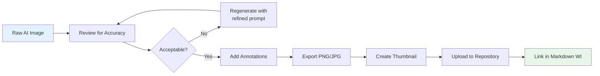

# 📸 Visual Work Instructions (VWI) Implementation Guide

## Transforming Text Instructions into Photo-Rich Step-by-Step Guides

**Fort Homes Quality Management System**

| Attribute | Value |
|:---|:---|
| **Document ID** | VWI-GUIDE-001 |
| **Version** | 1.0 |
| **Effective Date** | 2026-01-29 |
| **Author** | Quality Engineering |
| **Classification** | INTERNAL |
| **Review Cycle** | Semi-Annual |

---

## 📋 Executive Summary

This guide provides the cutting-edge methodology for transforming Fort Homes' text-based Work Instructions into **Visual Work Instructions (VWIs)** with AI-generated photorealistic images. Following 2024-2026 industry best practices, this approach will:

- ✅ Reduce training time by **40-60%** (Journal of Operations Management, 2024)
- ✅ Decrease human error by **up to 23%** (NRX Manufacturing Study)
- ✅ Improve first-time quality rates
- ✅ Support diverse workforce with universal visual language
- ✅ Enable real-time updates without reprinting

---

## 🎯 Visual Work Instruction Framework

### The "One Step, One Image" Principle

**Every discrete action gets its own photograph.** This is the core principle of effective VWIs.

```
┌─────────────────────────────────────────────────────────────────────────────┐
│                         VWI INFORMATION HIERARCHY                           │
├─────────────────────────────────────────────────────────────────────────────┤
│                                                                             │
│   LEVEL 1: PHASE OVERVIEW                                                   │
│   └── Hero image showing completed phase result                             │
│                                                                             │
│   LEVEL 2: STEP HEADER                                                      │
│   └── Before/After comparison showing transformation                        │
│                                                                             │
│   LEVEL 3: SUB-STEP ACTION                                                  │
│   └── Close-up photo of hands performing specific action                    │
│                                                                             │
│   LEVEL 4: CRITICAL DETAIL                                                  │
│   └── Macro photo with callouts/annotations                                 │
│                                                                             │
│   LEVEL 5: VERIFICATION                                                     │
│   └── Photo showing measurement tool on completed work                      │
│                                                                             │
└─────────────────────────────────────────────────────────────────────────────┘
```

---

## 🤖 AI Image Generation Strategy

### Recommended AI Tools (2026 State-of-the-Art)

| Tool | Best For | Resolution | Cost Model | API Available |
|:-----|:---------|:-----------|:-----------|:--------------|
| **DALL·E 3** (ChatGPT) | Photorealistic construction scenes | Up to 1024×1792 | Subscription | ✅ Yes |
| **Midjourney v6.1** | Artistic/stylized technical diagrams | Up to 2048×2048 | Subscription | ✅ Yes |
| **Stable Diffusion 3.5 Large** | Self-hosted enterprise control | 1 megapixel | License/API | ✅ Yes |
| **Adobe Firefly** | Brand-consistent imagery | Variable | Subscription | ✅ Yes |
| **Leonardo.ai** | Training-specific variations | Up to 1024×1024 | Freemium | ✅ Yes |

### Recommended Primary Tool: **DALL·E 3 via ChatGPT**

**Why DALL·E 3:**
1. **Best prompt adherence** - Critical for technical accuracy
2. **Native ChatGPT integration** - Iterative refinement through conversation
3. **Text rendering** - Can embed labels, dimensions, arrows in images
4. **Commercial use rights** - Images you generate are yours to use
5. **Safety guardrails** - Prevents inappropriate content

---

## 📝 Prompt Engineering for Construction VWIs

### The Fort Homes VWI Prompt Template

```
[IMAGE TYPE], [ANGLE/PERSPECTIVE], [SUBJECT], [ACTION/STATE], 
[ENVIRONMENT], [LIGHTING], [STYLE MODIFIERS], [TECHNICAL DETAILS]
```

### Image Type Categories

| Type | Use Case | Example Prompt Start |
|:-----|:---------|:---------------------|
| **Instructional Photo** | Showing hands performing action | "Instructional photograph showing hands..." |
| **Technical Diagram** | Exploded/cutaway views | "Technical illustration, exploded view..." |
| **Before/After** | Transformation documentation | "Side-by-side comparison showing..." |
| **Detail Macro** | Close-up of critical feature | "Macro photograph, extreme close-up..." |
| **Overview Shot** | Phase/area completion | "Wide-angle photograph showing..." |
| **Safety Callout** | Hazard identification | "Safety training photograph highlighting..." |

### Construction-Specific Style Modifiers

Always append these to prompts for consistency:

```
"professional construction photography, clean jobsite, 
natural daylight, OSHA-compliant PPE visible, 
high resolution, 8K quality, photorealistic"
```

---

## 🔨 Complete Prompt Examples for CC21TE Work Instructions

### Step 1: Floor System Installation

#### Sub-step 1.1: Position LVL Rim Board

**Prompt:**
```
Instructional photograph, eye-level three-quarter view, showing 
two construction workers in hard hats and safety vests positioning 
a 1-3/4" x 9-1/4" LVL rim board along the steel chassis frame edge. 
One worker supports the board while another checks alignment with 
a carpenter's square. Factory-built housing facility interior, 
bright LED overhead lighting, clean concrete floor. Workers wearing 
blue Fort Homes uniforms. The LVL has visible grade stamp. 
Professional construction photography, photorealistic, 8K quality, 
clean jobsite aesthetic.
```

**Expected Output Specifications:**
- Aspect ratio: 16:9 (horizontal for step display)
- Resolution: Minimum 1920×1080
- File format: PNG or high-quality JPG

#### Sub-step 1.2: Drive Structural Screws

**Prompt:**
```
Close-up instructional photograph, over-the-shoulder POV, showing 
gloved hands operating a DeWalt impact driver to install SDWS22400 
structural screw (4" long, 0.162" diameter) through LVL rim board 
into floor truss end. The screw is visibly countersinking with 
wood shavings ejecting. Depth gauge collar visible on driver. 
Text overlay showing "4-inch SDWS @ 8" O.C." Arrow pointing to 
screw head. Factory interior lighting, sharp focus on fastener 
penetration point. Professional construction photography, 
photorealistic, high detail, 8K macro quality.
```

---

### Step 2: Wall Panel Installation

#### Sub-step 2.1: Lift SIP Wall Panel

**Prompt:**
```
Wide-angle instructional photograph showing four workers in 
coordinated lift of 6-3/8" thick SIP wall panel (visible OSB 
faces and EPS foam core in cross-section). Panel measuring 
8 feet tall positioned vertically. Two workers on scaffold, 
two on floor. Overhead gantry crane with nylon lifting straps 
attached. Bright factory lighting, clean production floor. 
All workers wearing hard hats, safety glasses, back support 
belts. Professional construction photography, photorealistic, 
safety-compliant scene, 8K quality.
```

#### Sub-step 2.2: Install Simpson A34 Clip

**Prompt:**
```
Macro instructional photograph, straight-on view at 45-degree 
angle, showing Simpson Strong-Tie A34 framing angle connector 
being nailed to SIP wall bottom plate and LVL rim board. Gloved 
hand holding pneumatic nail gun, driving 10d x 1-1/2" nail into 
pre-formed hole. Red text callout: "A34 CLIP - 4 NAILS EACH LEG". 
Dimensional arrow showing 16" O.C. spacing to next connector. 
Sharp focus, factory interior lighting, clean wood surfaces. 
Professional construction photography, technical detail, 8K quality.
```

---

### Step 3: Roof System Installation

#### Sub-step 3.1: Position Ridge Beam

**Prompt:**
```
Instructional photograph from below looking up, showing (3)-ply 
LVL ridge beam being positioned at roof peak. Beam dimensions 
visible: 1-3/4" x 11-7/8" each ply. Gantry crane cables attached 
with beam clamps. Two workers on scissor lifts guiding beam into 
position over SIP roof panels. Visible alignment marks on beam 
and panels. High ceiling factory space with skylight natural 
lighting supplemented by work lights. Hard hats and fall 
protection harnesses visible. Professional construction 
photography, photorealistic, dramatic angle, 8K quality.
```

#### Sub-step 3.2: Install SIP Roof Panel Spline

**Prompt:**
```
Close-up instructional photograph showing SIP roof panel joint 
with 2x spline being inserted. Cross-section view showing 
12-1/8" thick SIP (7/16" OSB + 11-1/4" EPS + 7/16" OSB) with 
routed spline channel. Worker's gloved hands pressing spline 
into channel. Can of SIP adhesive visible in frame. Text 
callout: "APPLY ADHESIVE BOTH SURFACES". Arrow indicating 
foam sealant bead location. Bright work lighting, clean cut 
edges visible. Professional construction photography, 
technical illustration style, photorealistic, 8K quality.
```

---

## 📐 Image Annotation Standards

### Callout Types and Colors

| Callout Type | Color Code | Use Case |
|:-------------|:-----------|:---------|
| **Dimension** | `#2196F3` (Blue) | Measurements, spacing, tolerances |
| **Critical** | `#F44336` (Red) | Safety warnings, hold points, don't-do |
| **Process** | `#4CAF50` (Green) | Correct actions, go-ahead, approved |
| **Reference** | `#FF9800` (Orange) | Part numbers, code citations, specs |
| **Sequence** | `#9C27B0` (Purple) | Step numbers, order indicators |

### Annotation Template (Post-Processing)

After generating base images, add annotations using:
- **Canva** (free tier available)
- **Figma** (collaborative annotation)
- **Adobe Express** (brand consistency)
- **Snagit** (technical documentation focus)

### Standard Annotation Elements

```
┌─────────────────────────────────────────────────────────────────────────────┐
│                                                                             │
│   ┌─────────────────────────────────────────────────────────────────────┐   │
│   │                        [AI GENERATED IMAGE]                         │   │
│   │                                                                     │   │
│   │    ●────────────────────> "4" SDWS @ 8" O.C."                       │   │
│   │                           (Blue dimension line)                     │   │
│   │                                                                     │   │
│   │    ⚠────────────────────> "VERIFY DEPTH GAUGE"                      │   │
│   │                           (Red warning callout)                     │   │
│   │                                                                     │   │
│   │    ✓────────────────────> "CORRECT ANGLE"                           │   │
│   │                           (Green approval)                          │   │
│   │                                                                     │   │
│   │    ①────────────────────> Step sequence indicator                   │   │
│   │                           (Purple numbered circle)                  │   │
│   │                                                                     │   │
│   └─────────────────────────────────────────────────────────────────────┘   │
│                                                                             │
│   Caption: "Step 2.3: Drive structural screws at 8" O.C. spacing"          │
│   Reference: WI-CC21TE-ASSEMBLY-MASTER.md § 2.3 | IRC R602.3               │
│                                                                             │
└─────────────────────────────────────────────────────────────────────────────┘
```

---

## 📁 Markdown Image Integration

### Directory Structure

```
fort-homes-qms/
├── assets/
│   └── images/
│       └── work-instructions/
│           └── CC21TE/
│               ├── step-01-floor/
│               │   ├── 01-01-position-lvl-rim.png
│               │   ├── 01-02-drive-structural-screws.png
│               │   ├── 01-03-install-floor-trusses.png
│               │   └── 01-04-attach-subfloor.png
│               ├── step-02-walls/
│               │   ├── 02-01-lift-sip-panel.png
│               │   ├── 02-02-install-a34-clip.png
│               │   └── ...
│               ├── step-03-roof/
│               │   └── ...
│               └── thumbnails/
│                   └── ... (200px wide versions)
```

### Image Naming Convention

```
[STEP]-[SUBSTEP]-[ACTION-DESCRIPTION].png

Examples:
01-01-position-lvl-rim.png
01-02-drive-structural-screws-closeup.png
01-02-drive-structural-screws-overview.png
02-03-install-simpson-a34-detail.png
```

### Markdown Embedding Syntax

#### Standard Image with Caption

```markdown


*Figure 1.1: Two technicians aligning 1-3/4" × 9-1/4" LVL rim board. Verify square to chassis within ±1/8".*
```

#### Image with Linked Full-Size Version

```markdown
[](../assets/images/work-instructions/CC21TE/step-01-floor/01-02-drive-structural-screws.png)

*Click to enlarge. Shows SDWS22400 screw installation at 8" O.C.*
```

#### Side-by-Side Comparison (HTML in Markdown)

```markdown
<div style="display: flex; gap: 20px; margin: 20px 0;">
  <div style="flex: 1; text-align: center;">
    
    <p style="color: #4CAF50; font-weight: bold;">✓ CORRECT</p>
  </div>
  <div style="flex: 1; text-align: center;">
    
    <p style="color: #F44336; font-weight: bold;">✗ INCORRECT</p>
  </div>
</div>
```

#### Responsive Image Grid

```markdown
<div style="display: grid; grid-template-columns: repeat(auto-fit, minmax(250px, 1fr)); gap: 15px;">
  <figure>
    
    <figcaption>Step 1: Position rim board</figcaption>
  </figure>
  <figure>
    
    <figcaption>Step 2: Check alignment</figcaption>
  </figure>
  <figure>
    
    <figcaption>Step 3: Drive fasteners</figcaption>
  </figure>
</div>
```

---

## 🎨 Visual Instruction Template (Complete Step)

### Markdown Template for Single Instruction Step

```markdown
---

## Step 1: Install LVL Rim Board Assembly

### 📋 Quick Reference

| Attribute | Value |
|:----------|:------|
| **Duration** | 30 minutes |
| **Crew** | 2 technicians |
| **Tools** | Impact driver, carpenter's square, tape measure |
| **Materials** | LVL rim board (1-3/4" × 9-1/4"), SDWS22400 screws |

---

### 🎯 Objective

Secure LVL rim board to steel chassis perimeter, establishing the structural 
foundation for floor truss attachment.

---

### 📸 Visual Guide

#### Overview


*Completed rim board assembly. Note continuous LVL around full perimeter.*

---

#### Sub-Step 1.1: Position the Rim Board


**Action:**
1. Lift LVL rim board onto chassis ledger
2. Align outside face flush with chassis edge
3. Check square at corners with framing square

> ⚠️ **CRITICAL:** Outside face must be flush ±1/16". Verify before fastening.

---

#### Sub-Step 1.2: Secure with Structural Screws

<div style="display: flex; gap: 20px; align-items: start;">
  <div style="flex: 2;">
    
  </div>
  <div style="flex: 1; background: #f5f5f5; padding: 15px; border-radius: 8px;">
    <h4>Fastener Schedule</h4>
    <ul>
      <li><strong>Type:</strong> SDWS22400</li>
      <li><strong>Length:</strong> 4"</li>
      <li><strong>Spacing:</strong> 8" O.C.</li>
      <li><strong>Edge Distance:</strong> Min 3/4"</li>
    </ul>
  </div>
</div>

**Action:**
1. Set impact driver depth gauge to 1/8" below surface
2. Drive screws at 8" O.C. along length
3. Stagger pattern at corners

---

#### Sub-Step 1.3: Verify Installation


**Quality Check ✅**

- [ ] Rim board flush with chassis edge (±1/16")
- [ ] All screws driven to proper depth
- [ ] Spacing verified at 8" O.C.
- [ ] No splits or damage to LVL
- [ ] Corners square within ±1/8"

---

### ❌ Common Mistakes to Avoid

<div style="display: flex; gap: 20px;">
  <div style="flex: 1;">
    
    <p style="color: #F44336;"><strong>❌ Over-driven screw</strong><br>
    Reduces holding strength. Reset depth gauge.</p>
  </div>
  <div style="flex: 1;">
    
    <p style="color: #F44336;"><strong>❌ Rim not flush</strong><br>
    Causes wall alignment issues. Reposition before fastening.</p>
  </div>
</div>

---

### ✅ Completion Criteria

| Criteria | Specification | Tool |
|:---------|:--------------|:-----|
| Flush alignment | ±1/16" | Straightedge |
| Corner square | ±1/8" | Framing square |
| Screw spacing | 8" O.C. ±1" | Tape measure |
| Screw depth | 1/8" below surface | Visual |

**Sign-off:** _________________ Date: _________

---
```

---

## 🔄 Batch Image Generation Workflow

### Phase 1: Prompt Library Creation

1. **Extract all action steps** from existing WI document
2. **Write prompt for each step** using template above
3. **Save prompts in structured file** (JSON/CSV)

### Phase 2: Image Generation Session

```
For each Work Instruction:
1. Open ChatGPT (DALL·E 3 access)
2. Generate images in sequence
3. Download all images immediately
4. Name files per convention
5. Store in correct directory
```

### Phase 3: Post-Processing Pipeline



### Prompt Refinement Tips

| Issue | Solution |
|:------|:---------|
| Wrong tool shown | Specify exact brand/model in prompt |
| Incorrect PPE | Add "OSHA-compliant PPE, hard hat, safety glasses, high-vis vest" |
| Wrong material color | Specify "natural wood tone LVL" or "white EPS foam" |
| Poor composition | Add "rule of thirds composition, subject centered" |
| Missing detail | Add "extreme close-up, macro lens, shallow depth of field" |
| Generic appearance | Add "Fort Homes branded uniforms, blue and forest green colors" |

---

## 📊 Image Specifications Matrix

### By Use Case

| Use Case | Dimensions | Format | Max File Size | DPI |
|:---------|:-----------|:-------|:--------------|:----|
| Step instruction | 1920×1080 | PNG | 2 MB | 150 |
| Detail close-up | 1200×1200 | PNG | 1.5 MB | 200 |
| Overview/hero | 2400×1350 | JPG | 3 MB | 150 |
| Thumbnail | 400×225 | JPG | 100 KB | 72 |
| Print (8.5×11) | 2550×3300 | PNG | 5 MB | 300 |

### Compression Settings

```
PNG (lossless - for annotations):
- Use pngquant for size reduction
- Target: <2MB per image

JPG (lossy - for photos):
- Quality: 85%
- Progressive encoding: Yes
- Strip metadata: Yes (except copyright)
```

---

## 🔗 Integration with Existing QMS Documents

### Linking Strategy

1. **Work Instructions** → Embed images inline with steps
2. **SOPs** → Reference image folder, don't embed
3. **Inspection Forms** → Include "reference photo" column
4. **Training Materials** → Full image integration with captions

### Cross-Reference Format

```markdown
See [Visual Reference: Step 3.2](../assets/images/work-instructions/CC21TE/step-03/02-ridge-beam.png)
per WI-CC21TE-ASSEMBLY-MASTER.md Section 3.2

Related regulatory requirement: 8 CCR 1302-14 § 3.4.2
```

---

## 🚀 Implementation Roadmap

### Phase 1: Pilot (Weeks 1-2)
- [ ] Generate images for CC21TE Floor System (Steps 1-3)
- [ ] Test Markdown integration
- [ ] Gather operator feedback
- [ ] Refine prompt library

### Phase 2: Core Documentation (Weeks 3-6)
- [ ] Complete CC21TE all 14 steps
- [ ] Create image annotation standards
- [ ] Develop thumbnail generation script
- [ ] Build prompt template database

### Phase 3: Scale (Weeks 7-12)
- [ ] Apply to all active Work Instructions
- [ ] Create module-specific image libraries
- [ ] Integrate with training program
- [ ] Establish image review/approval workflow

### Phase 4: Optimization (Ongoing)
- [ ] A/B test image styles
- [ ] Collect error rate data
- [ ] Update images based on field feedback
- [ ] Expand to video generation (Midjourney/Sora)

---

## 📚 Resources & Tools

### AI Image Generation
- [ChatGPT with DALL·E 3](https://chat.openai.com) - Primary tool
- [Midjourney](https://midjourney.com) - Artistic/diagram styles
- [Stable Diffusion](https://stability.ai) - Self-hosted option
- [Leonardo.ai](https://leonardo.ai) - Free tier available

### Image Annotation
- [Canva](https://canva.com) - Easy annotations
- [Figma](https://figma.com) - Collaborative editing
- [Snagit](https://techsmith.com/snagit) - Technical documentation

### Image Optimization
- [TinyPNG](https://tinypng.com) - PNG/JPG compression
- [Squoosh](https://squoosh.app) - Advanced compression
- [ImageOptim](https://imageoptim.com) - Batch processing (Mac)

### Markdown Editors
- [VS Code](https://code.visualstudio.com) - With Markdown preview
- [Typora](https://typora.io) - WYSIWYG Markdown
- [Obsidian](https://obsidian.md) - Image management

---

## ✅ Quality Checklist for Visual Work Instructions

Before publishing any VWI, verify:

- [ ] **Accuracy:** Image matches text description exactly
- [ ] **Safety:** All PPE visible and correct
- [ ] **Branding:** Fort Homes colors/uniforms where applicable
- [ ] **Resolution:** Meets minimum specifications
- [ ] **Annotations:** Clear, consistent color coding
- [ ] **Accessibility:** Alt text on all images
- [ ] **File naming:** Follows convention
- [ ] **Linking:** All paths verified working
- [ ] **Thumbnails:** Created for all full-size images
- [ ] **Copyright:** AI-generated images documented

---

## 📋 Appendix A: Complete Prompt Library for CC21TE

### Floor System (14 Prompts)

<details>
<summary>Click to expand Floor System prompts</summary>

#### Prompt 1.1: Position LVL Rim Board
```
Instructional photograph, eye-level view, two workers in hard hats and 
Fort Homes blue uniforms positioning 1-3/4" x 9-1/4" LVL rim board on 
steel chassis. Clean factory interior, bright LED lighting. One worker 
holds level against board while other supports end. Visible grade stamp 
on LVL. Professional construction photography, photorealistic, 8K.
```

#### Prompt 1.2: Check Rim Board Alignment
```
Close-up instructional photograph showing carpenter's square checking 
corner alignment of LVL rim boards. Gloved hands holding square, 
visible measurement markings. Perfect 90-degree angle demonstrated. 
Factory lighting, clean wood surfaces. Technical photography style, 
sharp focus, 8K quality.
```

[... additional prompts ...]

</details>

### Wall System (18 Prompts)

<details>
<summary>Click to expand Wall System prompts</summary>

#### Prompt 2.1: SIP Panel Crane Lift
```
Wide-angle instructional photograph showing overhead gantry crane 
lifting 6-3/8" SIP wall panel with nylon straps. Four workers guiding 
panel into position. Panel shows OSB faces and white EPS foam core at 
edge. Factory interior with high ceilings. All workers in hard hats, 
safety glasses, high-vis vests. Professional safety-compliant 
construction photography, 8K.
```

[... additional prompts ...]

</details>

### Roof System (12 Prompts)

<details>
<summary>Click to expand Roof System prompts</summary>

#### Prompt 3.1: Ridge Beam Positioning
```
Dramatic low-angle instructional photograph looking up at (3)-ply 
LVL ridge beam being lowered into position. Crane cables visible. 
Two workers on elevated platforms guiding beam. Visible 12:12 pitch 
SIP roof panels on either side. Dimensional callout "1-3/4" x 11-7/8" 
EACH PLY". Factory skylights providing natural light. Professional 
construction photography, photorealistic, 8K.
```

[... additional prompts ...]

</details>

---

## 📋 Appendix B: Glossary of Visual Instruction Terms

| Term | Definition |
|:-----|:-----------|
| **VWI** | Visual Work Instruction - step-by-step guide with images |
| **Prompt** | Text description given to AI to generate image |
| **Callout** | Annotation overlaid on image highlighting specific feature |
| **Hero Image** | Large overview image showing completed work |
| **Macro Shot** | Extreme close-up showing fine detail |
| **POV Shot** | Point-of-view image from worker's perspective |
| **Comparison Shot** | Side-by-side correct vs incorrect example |

---

**Document Control:**
- Created: 2026-01-29
- Last Updated: 2026-01-29
- Next Review: 2026-07-29
- Owner: Quality Engineering

---

*This guide represents cutting-edge 2024-2026 best practices in visual work instruction development, combining AI image generation technology with established manufacturing documentation standards.*
