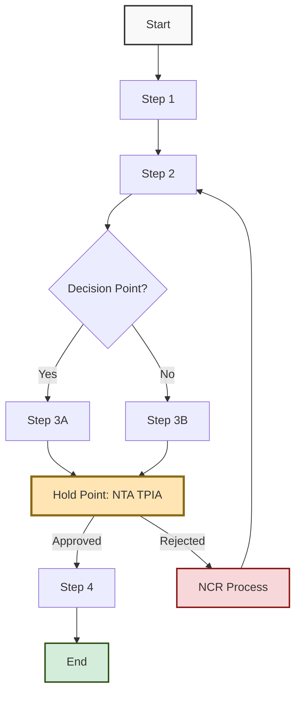

<div class="document-header" style="background: linear-gradient(135deg, #101810 0%, #2D5016 100%); color: white; padding: 40px; text-align: center; border-radius: 8px; margin-bottom: 30px; box-shadow: 0 4px 6px rgba(0,0,0,0.1);">
  <div style="font-size: 48px; font-weight: bold; letter-spacing: 2px; margin-bottom: 10px;">
    🏗️ FORT HOMES
  </div>
  <div style="font-size: 24px; font-weight: 300; letter-spacing: 1px; margin-bottom: 5px;">
    STANDARD OPERATING PROCEDURE
  </div>
  <div style="font-size: 20px; font-weight: bold; margin-top: 20px; padding-top: 20px; border-top: 2px solid rgba(255,255,255,0.3);">
    [SOP TITLE]
  </div>
  <div style="font-size: 16px; margin-top: 10px; opacity: 0.9;">
    Grand Junction, Colorado
  </div>
</div>

# SOP-[NUMBER] [TITLE]
## [Subtitle/Purpose]

---

## 📋 DOCUMENT CONTROL

| **Attribute** | **Details** |
|:---|:---|
| **Document ID** | SOP-[NUMBER]-[SHORT-NAME] |
| **Version** | 1.0 |
| **Effective Date** | [YYYY-MM-DD] |
| **Process Owner** | [Role/Title] |
| **Classification** | CONTROLLED |
| **Review Cycle** | [Annual/Semi-Annual/Quarterly] |
| **Next Review Date** | [YYYY-MM-DD] |
| **Supersedes** | [Previous version or N/A] |

---

## 📑 TABLE OF CONTENTS

1. [Purpose](#1-purpose)
2. [Scope](#2-scope)
3. [Definitions](#3-definitions)
4. [Responsibilities (RACI)](#4-responsibilities-raci)
5. [Procedure](#5-procedure)
6. [Hold Points & Approvals](#6-hold-points--approvals)
7. [Records & Documentation](#7-records--documentation)
8. [References](#8-references)
9. [Regulatory Requirements](#9-regulatory-requirements)

---

## 1. PURPOSE

### 1.1 Objective

[Clear statement of what this SOP achieves and why it exists]

<div style="background: #f8f8f8; padding: 20px; border-left: 4px solid #2D5016; margin: 20px 0;">

**Key Outcomes:**
- [Outcome 1]
- [Outcome 2]
- [Outcome 3]

</div>

### 1.2 Benefits

| Benefit | Description |
|:---|:---|
| **Quality** | [How this improves quality] |
| **Compliance** | [How this ensures compliance] |
| **Efficiency** | [How this improves efficiency] |
| **Safety** | [How this enhances safety] |

---

## 2. SCOPE

### 2.1 Applicability

**Applies To:**
- [Department/Process/Product/Activity]
- [Location/Facility]
- [Time period or conditions]

**Does Not Apply To:**
- [Exclusions]
- [Out of scope items]

### 2.2 Related Processes

| Related Process | Document Reference | Relationship |
|:---|:---|:---|
| [Process Name] | [SOP-XXX or QMS-XXX] | [How they relate] |

---

## 3. DEFINITIONS

<div style="background: white; padding: 20px; border: 2px solid #ddd; border-radius: 8px; margin: 20px 0;">

| Term | Definition |
|:---|:---|
| **[Term 1]** | [Definition] |
| **[Term 2]** | [Definition] |
| **HUD Code** | 24 CFR Parts 3280/3282/3285 - Manufactured Housing Standards |
| **CCR** | Colorado Code of Regulations 8 CCR 1302-14 |
| **NEC** | National Electrical Code 2023 (NFPA 70) |
| **NTA TPIA** | NTA, Inc. Third-Party Inspection Agency |
| **Hold Point** | Mandatory inspection/approval before proceeding |

</div>

---

## 4. RESPONSIBILITIES (RACI)

### 4.1 RACI Matrix

<div style="background: white; padding: 20px; border: 2px solid #ddd; border-radius: 8px; margin: 20px 0;">

| Activity | [Role 1] | [Role 2] | [Role 3] | [Role 4] | NTA TPIA |
|:---|:---:|:---:|:---:|:---:|:---:|
| **[Activity 1]** | R | A | C | I | - |
| **[Activity 2]** | R | A | I | - | - |
| **[Activity 3 - Hold Point]** | R | A | - | - | **A** |
| **[Activity 4]** | R | C | A | I | - |

**Legend:**
- **R** - Responsible (Does the work)
- **A** - Accountable (Final authority/approval)
- **C** - Consulted (Provides input)
- **I** - Informed (Kept updated)

</div>

### 4.2 Role Descriptions

<div style="background: #E7F3FF; padding: 20px; border-left: 4px solid #145B8B; margin: 20px 0;">

#### [Role 1 - e.g., Production Supervisor]
**Responsibilities:**
- [Specific responsibility 1]
- [Specific responsibility 2]
- [Authority level]

**Competency Requirements:**
- [Required training]
- [Required experience]
- [Certifications needed]

#### [Role 2 - e.g., Quality Inspector]
**Responsibilities:**
- [Specific responsibility 1]
- [Specific responsibility 2]

**Competency Requirements:**
- [Required training]

</div>

---

## 5. PROCEDURE

### 5.1 Process Overview



### 5.2 Detailed Steps

<div style="background: white; padding: 20px; border: 2px solid #ddd; border-radius: 8px; margin: 20px 0;">

#### Step 1: [Step Name]

**Responsible:** [Role]  
**Input:** [What's needed to start]  
**Output:** [What's produced]

**Actions:**
1. [Detailed action 1]
2. [Detailed action 2]
3. [Detailed action 3]

**Tools/Equipment:**
- [Tool 1]
- [Tool 2]

**Quality Checks:**
✅ [Check 1]
✅ [Check 2]

**Common Errors to Avoid:**
⚠️ [Error 1]
⚠️ [Error 2]

---

#### Step 2: [Step Name]

**Responsible:** [Role]  
**Input:** [From Step 1]  
**Output:** [What's produced]

**Actions:**
1. [Detailed action 1]
2. [Detailed action 2]

**Acceptance Criteria:**
- [Criteria 1]
- [Criteria 2]

**If Issues Found:**
→ Document in [NCR/System]
→ Notify [Role]
→ Follow [SOP-004 Nonconformance & CAPA]

---

#### Step 3: [Decision Point]

**Responsible:** [Role]  
**Decision Criteria:**

| Condition | Action |
|:---|:---|
| **If [Condition A]** | Proceed to Step 3A |
| **If [Condition B]** | Proceed to Step 3B |
| **If [Condition C]** | Stop and escalate to [Role] |

</div>

### 5.3 Regulatory Compliance Checkpoints

<div style="background: #FFF3CD; padding: 20px; border-left: 4px solid #8B6914; margin: 20px 0;">

#### 🔍 Compliance Verification Points

| Checkpoint | Requirement | Verification Method | Responsible |
|:---|:---|:---|:---|
| **HUD Code Compliance** | 24 CFR [Section] | [Inspection/Test/Review] | [Role] |
| **CCR 8 CCR 1302-14** | [Specific requirement] | [Verification method] | [Role] |
| **NEC 2023** | Article 550.[Section] | [Inspection/Testing] | [Role] |
| **NTA TPIA Hold Point** | [Specific inspection] | NTA Inspector approval | NTA TPIA |

</div>

---

## 6. HOLD POINTS & APPROVALS

### 6.1 Mandatory Hold Points

<div style="background: #F8D7DA; padding: 20px; border-left: 4px solid #8B1414; margin: 20px 0;">

#### ⛔ HOLD POINT #1: [Description]

**Location in Process:** After Step [X], before Step [Y]

**Purpose:** [Why this hold point exists]

**Inspection Requirements:**
- [Requirement 1]
- [Requirement 2]
- [Requirement 3]

**Inspector:** 
- Internal: [Role]
- External: NTA TPIA (if applicable)

**Acceptance Criteria:**
✅ [Criteria 1]
✅ [Criteria 2]

**Documentation Required:**
- [Form/Record 1]
- [Form/Record 2]

**Approval Required Before Proceeding:**
- [Signature/Sign-off required]

**If Hold Point Fails:**
1. Do not proceed
2. Tag product/area with HOLD tag
3. Initiate NCR per SOP-004
4. Notify [Role]
5. Address nonconformance
6. Re-inspect

</div>

### 6.2 Approval Authority Matrix

| Approval Type | Authority | Conditions |
|:---|:---|:---|
| **Routine Operation** | [Role] | Within normal parameters |
| **Deviation/Concession** | [Role] + [Higher Role] | Minor impact, documented |
| **Major Deviation** | Quality Manager + General Manager | Significant impact |
| **NTA TPIA Approval** | NTA Inspector | All HUD Code-related items |

---

## 7. RECORDS & DOCUMENTATION

### 7.1 Required Records

<div style="background: white; padding: 20px; border: 2px solid #ddd; border-radius: 8px; margin: 20px 0;">

| Record | Form/Template | Retention | Storage Location |
|:---|:---|:---|:---|
| [Record 1] | [FORM-XXX] | [Period] | [Location/System] |
| [Record 2] | [FORM-XXX] | [Period] | [Location/System] |
| **Module Traveler** | FORM-TRAVELER | 20 years | Electronic Archive |
| **NTA Inspection Report** | NTA Form | 20 years | Electronic Archive |

</div>

### 7.2 Data Fields for Automation

**Structured Data to Capture:**
```json
{
  "process_id": "SOP-XXX",
  "module_number": "",
  "date_time": "YYYY-MM-DD HH:MM",
  "operator": "",
  "inspector": "",
  "status": "pass/fail/pending",
  "measurements": {},
  "nta_approval": "yes/no/na",
  "comments": ""
}
```

---

## 8. REFERENCES

### 8.1 Internal Documents

- QMS-005 Operations
- QMS-008 Document & Records
- SOP-004 Nonconformance & CAPA
- [Other related SOPs]

### 8.2 External Standards

- **HUD Code:** 24 CFR Part 3280 - [Specific subparts]
- **HUD Code:** 24 CFR Part 3282 - [Specific sections]
- **CCR:** 8 CCR 1302-14 - [Specific sections]
- **NEC 2023:** Article 550 - [Specific sections]
- [Other applicable standards]

---

## 9. REGULATORY REQUIREMENTS

### 9.1 HUD Code Requirements

<div style="background: #E7F3FF; padding: 20px; border-left: 4px solid #145B8B; margin: 20px 0;">

#### 24 CFR 3280 - Construction Standards

| Subpart | Requirement | How This SOP Addresses It |
|:---|:---|:---|
| [Subpart X] | [Specific requirement] | [Implementation in this SOP] |

</div>

### 9.2 Colorado CCR Requirements

| CCR Section | Requirement | Implementation |
|:---|:---|:---|
| 8 CCR 1302-14.[X] | [Requirement] | [How addressed] |

### 9.3 NEC 2023 Requirements (If Applicable)

| NEC Article | Requirement | Implementation |
|:---|:---|:---|
| 550.[X] | [Requirement] | [How addressed] |

---

## 10. TROUBLESHOOTING

<div style="background: #FFF3CD; padding: 20px; border-left: 4px solid #8B6914; margin: 20px 0;">

| Problem | Possible Cause | Solution |
|:---|:---|:---|
| [Problem 1] | [Cause 1] | [Solution 1] |
| [Problem 2] | [Cause 2] | [Solution 2] |
| **NTA TPIA hold point delayed** | Inspector not scheduled | Schedule 48 hours in advance per SOP-015 |

</div>

---

## 🔄 REVISION HISTORY

| Version | Date | Description | Author | Approved By |
|:---|:---|:---|:---|:---|
| 1.0 | [YYYY-MM-DD] | Initial creation | [Name/Role] | [Name/Role] |

---

## ✅ APPROVAL SIGNATURES

| Role | Name | Signature | Date |
|:---|:---|:---|:---|
| **Prepared By** | [Name] | _________________ | [Date] |
| **Reviewed By** | [Name] | _________________ | [Date] |
| **Approved By** | [Name] | _________________ | [Date] |

---

**Document Classification:** CONTROLLED  
**Distribution:** [Target audience]  
**Next Review Date:** [YYYY-MM-DD]

---

## 📝 TEMPLATE USAGE NOTES

**When creating a new SOP using this template:**

1. Replace all [BRACKETED] placeholders with actual content
2. Remove sections not applicable to your procedure
3. Add additional steps/sections as needed
4. Include specific regulatory requirements relevant to the process
5. Define all hold points with clear criteria
6. Create process flowchart appropriate to your process
7. List all forms and records required
8. Ensure RACI matrix covers all activities
9. Include NTA TPIA coordination where HUD Code compliance required
10. Review for CCR, NEC, and NTA compliance before approval

**Automation Hooks:**
- Structured data fields provided for future AI agent integration
- Hold points marked for automated alerts
- Approval workflows defined for digital signature systems

---

*This template follows Fort Homes QMS standards with modern HTML styling, regulatory compliance focus, and automation-ready structure.*
