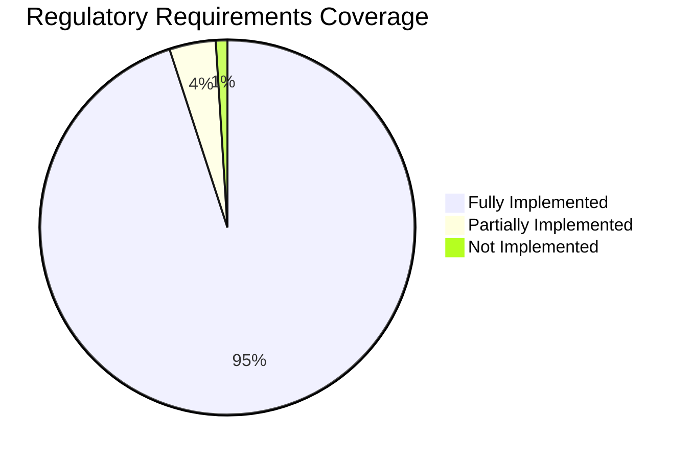
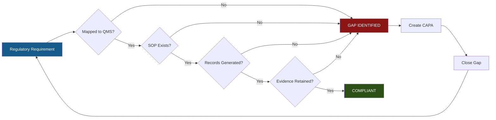

  

    🏗️ FORT HOMES
  

  

    QUALITY MANAGEMENT SYSTEM
  

  

    REGULATORY REQUIREMENTS MATRIX
  

  

    Complete Traceability: Regulation → QMS → Procedure → Evidence
  

# TRACE-001: REGULATORY REQUIREMENTS MATRIX
## Comprehensive Regulatory Compliance Traceability

---

## 📋 DOCUMENT CONTROL

| Attribute | Value |
|:---|:---|
| **Document ID** | TRACE-001 |
| **Title** | Regulatory Requirements Traceability Matrix |
| **Revision** | 1.0 |
| **Effective Date** | 2026-01-29 |
| **Process Owner** | Compliance Officer |
| **Approver** | Quality Manager |
| **Classification** | CONTROLLED |
| **Review Cycle** | Semi-Annual (or upon regulatory change) |
| **Next Review** | 2026-07-29 |
| **Regulatory Basis** | 24 CFR 3280/3282/3285, 8 CCR 1302-14, NEC 2023 |

---

## 📑 TABLE OF CONTENTS

1. [Purpose & Scope](#1-purpose--scope)
2. [HUD Code Requirements (24 CFR 3280)](#2-hud-code-requirements-24-cfr-3280)
3. [HUD Code Requirements (24 CFR 3282/3285)](#3-hud-code-requirements-24-cfr-32823285)
4. [Colorado CCR Requirements (8 CCR 1302-14)](#4-colorado-ccr-requirements-8-ccr-1302-14)
5. [NEC 2023 Requirements (Article 550)](#5-nec-2023-requirements-article-550)
6. [Gap Analysis](#6-gap-analysis)
7. [Compliance Monitoring](#7-compliance-monitoring)

---

## 1. PURPOSE & SCOPE

### 1.1 Purpose

This matrix provides **complete traceability** from external regulatory requirements through implementing QMS procedures to quality records, enabling:

- ✅ **Audit Readiness:** Rapidly demonstrate compliance during CDOH/TPIA inspections
- ✅ **Gap Identification:** Identify requirements without implementing procedures
- ✅ **Change Management:** Understand impact of regulatory updates
- ✅ **Training Planning:** Link requirements to competency needs
- ✅ **Process Improvement:** Identify redundant or missing controls

### 1.2 Scope

Covers all regulatory requirements applicable to Fort Homes LLC offsite modular home manufacturing:

**PRIMARY REGULATIONS (Modular Construction):**
- **8 CCR 1302-14:** Colorado Division of Housing Rules and Regulations for Factory-Built Structures (PRIMARY)
- **IRC 2021:** International Residential Code (Building Code)
- **IBC 2021:** International Building Code
- **NEC 2023:** National Electrical Code (Residential Articles)
- **IPC 2021:** International Plumbing Code
- **IMC 2021:** International Mechanical Code
- **IECC 2021:** International Energy Conservation Code

**REFERENCE ONLY (NOT applicable to Fort Homes LLC modular homes):**
- **24 CFR Part 3280:** HUD Code - Manufactured Housing (trailers) - NOT APPLICABLE
- **24 CFR Part 3282:** Manufactured Home Procedural Regulations - NOT APPLICABLE
- **24 CFR Part 3285:** Manufactured Home Installation Standards - NOT APPLICABLE
- **NEC Article 550:** Mobile/Manufactured Homes - NOT APPLICABLE

### 1.3 Matrix Structure

Each requirement includes:
- **Regulatory Citation:** Full regulation reference
- **Requirement Summary:** Plain English description
- **QMS Section:** Which QMS manual section addresses it
- **Implementing SOP(s):** Procedure(s) that implement the requirement
- **Evidence/Records:** Specific quality records demonstrating compliance
- **Responsible Role:** Who is accountable for compliance
- **Verification Method:** How compliance is verified
- **Compliance Status:** Current compliance state

---

## 2. HUD CODE REQUIREMENTS (24 CFR 3280)

### 2.1 General Requirements (Subpart A)

| Citation | Requirement Summary | QMS Section | Implementing SOP(s) | Evidence/Records | Responsible | Verification | Status |
|:---|:---|:---|:---|:---|:---|:---|:---:|
| 24 CFR § 3280.2 | Definitions and terms | QMS-009 | All SOPs | QMS Manual | Quality Manager | Annual review | ✅ |
| 24 CFR § 3280.4 | Incorporation by reference (codes/standards) | QMS-009 | SOP-006 Design Control | Engineering plans, code references | Design Engineer | Plan review | ✅ |

### 2.2 Planning Considerations (Subpart B)

| Citation | Requirement Summary | QMS Section | Implementing SOP(s) | Evidence/Records | Responsible | Verification | Status |
|:---|:---|:---|:---|:---|:---|:---:|
| 24 CFR § 3280.105 | Wind load resistance | QMS-005, QMS-009 | SOP-006 Design Control, SOP-102 Wall Framing | Engineering calcs, FORM-I-102 | Design Engineer | Plan approval, HP-2 | ✅ |
| 24 CFR § 3280.106 | Snow load resistance | QMS-005, QMS-009 | SOP-006, SOP-103 Roof Framing | Engineering calcs, FORM-I-103 | Design Engineer | Plan approval, HP-3 | ✅ |
| 24 CFR § 3280.107 | Seismic zone requirements | QMS-005, QMS-009 | SOP-006, SOP-101 Chassis/Floor | Engineering calcs, FORM-I-101 | Design Engineer | Plan approval, HP-1 | ✅ |

### 2.3 Body and Frame (Subpart C)

| Citation | Requirement Summary | QMS Section | Implementing SOP(s) | Evidence/Records | Responsible | Verification | Status |
|:---|:---|:---|:---|:---|:---|:---:|
| 24 CFR § 3280.304 | Structural design requirements | QMS-005 | SOP-006, SOP-101 to SOP-103 | Engineering plans (stamped), ITPs | Design Engineer | TPIA plan review | ✅ |
| 24 CFR § 3280.305 | Ventilation | QMS-005, QMS-009 | SOP-104 MEP Rough-In | FORM-I-104, ventilation calcs | QA Inspector | HP-4 inspection | ✅ |
| 24 CFR § 3280.306 | Interior privacy | QMS-005 | SOP-106 Drywall, SOP-107 Interior Trim | FORM-I-106, FORM-I-107 | Production Supervisor | HP-6, HP-7 | ✅ |

### 2.4 Thermal Protection (Subpart D)

| Citation | Requirement Summary | QMS Section | Implementing SOP(s) | Evidence/Records | Responsible | Verification | Status |
|:---|:---|:---|:---|:---|:---|:---:|
| 24 CFR § 3280.403 | Insulation requirements | QMS-005, QMS-009 | SOP-105 Insulation/Air Sealing | FORM-I-105, material certs | QA Inspector | HP-5 inspection | ✅ |
| 24 CFR § 3280.404 | Condensation control | QMS-005 | SOP-105 | FORM-I-105, vapor barrier verification | QA Inspector | HP-5 inspection | ✅ |
| 24 CFR § 3280.405 | Air infiltration | QMS-005, QMS-009 | SOP-105, SOP-108 Final | Blower door test results | QA Inspector | HP-8 (IHIP homes) | ✅ |

### 2.5 Fire Safety (Subpart E)

| Citation | Requirement Summary | QMS Section | Implementing SOP(s) | Evidence/Records | Responsible | Verification | Status |
|:---|:---|:---|:---|:---|:---|:---:|
| 24 CFR § 3280.502 | Flame spread index requirements | QMS-005 | SOP-012 Material Receiving | Material certifications | Materials Manager | Receiving inspection | ✅ |
| 24 CFR § 3280.504 | Smoke detectors required | QMS-005, QMS-009 | SOP-104 MEP Rough-In, SOP-108 Final | FORM-I-104, FORM-I-108 | QA Inspector | HP-4, HP-8 | ✅ |
| 24 CFR § 3280.505 | Fire extinguisher placement | QMS-005 | SOP-108 Final Inspection | FORM-I-108, delivery checklist | QA Inspector | HP-8 | ✅ |

### 2.6 Plumbing Systems (Subpart G)

| Citation | Requirement Summary | QMS Section | Implementing SOP(s) | Evidence/Records | Responsible | Verification | Status |
|:---|:---|:---|:---|:---|:---|:---:|
| 24 CFR § 3280.604 | Materials standards | QMS-005, QMS-009 | SOP-012 Material Receiving | Material certs, supplier ASL | Materials Manager | Receiving inspection | ✅ |
| 24 CFR § 3280.609 | Water distribution system | QMS-005 | SOP-104 MEP Rough-In | FORM-I-104, pressure test | QA Inspector | HP-4, pressure test | ✅ |
| 24 CFR § 3280.610 | Drain, waste, vent (DWV) system | QMS-005 | SOP-104 | FORM-I-104, DWV pressure test | QA Inspector | HP-4, pressure test | ✅ |
| 24 CFR § 3280.611 | Water heater requirements | QMS-005 | SOP-104, SOP-108 | FORM-I-104, FORM-I-108 | QA Inspector | HP-4, HP-8 | ✅ |

### 2.7 Heating, Cooling, & Fuel Burning (Subpart H)

| Citation | Requirement Summary | QMS Section | Implementing SOP(s) | Evidence/Records | Responsible | Verification | Status |
|:---|:---|:---|:---|:---|:---|:---:|
| 24 CFR § 3280.707 | Combustion air requirements | QMS-005, QMS-009 | SOP-104 MEP Rough-In | FORM-I-104, ventilation calcs | QA Inspector | HP-4 inspection | ✅ |
| 24 CFR § 3280.715 | Gas piping systems | QMS-005 | SOP-104 | FORM-I-104, gas pressure test | QA Inspector | HP-4, pressure test | ✅ |

### 2.8 Electrical Systems (Subpart I)

| Citation | Requirement Summary | QMS Section | Implementing SOP(s) | Evidence/Records | Responsible | Verification | Status |
|:---|:---|:---|:---|:---|:---|:---:|
| 24 CFR § 3280.801 | General electrical requirements (references NEC) | QMS-009 | SOP-104 MEP Rough-In | FORM-I-104, electrical plans | QA Inspector | HP-4 inspection | ✅ |
| 24 CFR § 3280.803 | Power supply requirements | QMS-005, QMS-009 | SOP-104 | FORM-I-104, service panel specs | QA Inspector | HP-4 inspection | ✅ |
| 24 CFR § 3280.804 | Branch circuits | QMS-005 | SOP-104 | FORM-I-104, circuit schedule | QA Inspector | HP-4 inspection | ✅ |
| 24 CFR § 3280.806 | Wiring methods | QMS-005 | SOP-104 | FORM-I-104, NM cable inspection | QA Inspector | HP-4 inspection | ✅ |
| 24 CFR § 3280.809 | Grounding | QMS-005, QMS-009 | SOP-104 | FORM-I-104, grounding verification | QA Inspector | HP-4 inspection | ✅ |

### 2.9 Transportation (Subpart J)

| Citation | Requirement Summary | QMS Section | Implementing SOP(s) | Evidence/Records | Responsible | Verification | Status |
|:---|:---|:---|:---|:---|:---|:---:|
| 24 CFR § 3280.903 | Tiedown systems | QMS-005 | SOP-006 Design, SOP-101 Chassis | FORM-I-101, tiedown specs | Design Engineer | HP-1, plan review | ✅ |
| 24 CFR § 3280.904 | Blocking and anchoring | QMS-005 | SOP-101 | FORM-I-101, blocking verification | QA Inspector | HP-1 inspection | ✅ |

---

## 3. HUD CODE REQUIREMENTS (24 CFR 3282/3285)

### 3.1 Manufactured Home Procedural Regulations (24 CFR 3282)

| Citation | Requirement Summary | QMS Section | Implementing SOP(s) | Evidence/Records | Responsible | Verification | Status |
|:---|:---|:---|:---|:---|:---|:---:|
| 24 CFR § 3282.11 | Quality Assurance Manual required | QMS-008 | SOP-001 Document Control | QMS Manual (all sections) | Quality Manager | Annual CDOH review | ✅ |
| 24 CFR § 3282.202 | Design approval process | QMS-005 | SOP-006 Design Control | TPIA-approved plans | Design Engineer | TPIA plan review | ✅ |
| 24 CFR § 3282.203 | In-plant inspections (TPIA) | QMS-005, QMS-006 | SOP-015 TPIA Coordination | TPIA inspection reports | Compliance Officer | TPIA visits | ✅ |
| 24 CFR § 3282.361 | State Administrative Agency (SAA) | QMS-009 | SOP-009 CDOH Compliance | CDOH correspondence, annual submissions | Compliance Officer | CDOH approval | ✅ |
| 24 CFR § 3282.362 | Insignia application | QMS-005, QMS-009 | SOP-010 Module ID, SOP-108 Final | DOH Insignia tracking log | QA Manager | HP-8, CDOH records | ✅ |

### 3.2 Model Installation Standards (24 CFR 3285)

| Citation | Requirement Summary | QMS Section | Implementing SOP(s) | Evidence/Records | Responsible | Verification | Status |
|:---|:---|:---|:---|:---|:---|:---:|
| 24 CFR § 3285.2 | Installation requirements (reference) | QMS-009 | SOP-019 Packaging/Delivery | Installation manual (supplied with unit) | Quality Manager | Module documentation package | ✅ |
| 24 CFR § 3285.303 | Foundation requirements | QMS-009 | SOP-006 Design | Foundation specs in plans | Design Engineer | Plan review | ✅ |
| 24 CFR § 3285.402 | Anchoring requirements | QMS-009 | SOP-006, SOP-101 | Anchoring specs, FORM-I-101 | Design Engineer | HP-1, plan review | ✅ |

---

## 4. COLORADO CCR REQUIREMENTS (8 CCR 1302-14)

### 4.1 General Provisions

| Citation | Requirement Summary | QMS Section | Implementing SOP(s) | Evidence/Records | Responsible | Verification | Status |
|:---|:---|:---|:---|:---|:---|:---:|
| 8 CCR 1302-14 § 2.1 | Definitions | QMS-009 | All SOPs | QMS Manual | Quality Manager | Annual review | ✅ |
| 8 CCR 1302-14 § 2.2 | Manufacturer registration required | QMS-001, QMS-009 | SOP-009 CDOH Compliance | DOH Approval #2526-5434-QA | Compliance Officer | Annual renewal | ✅ |
| 8 CCR 1302-14 § 2.3 | Plant identification number (5434) | QMS-009 | SOP-010 Module ID | Data plates, insignia | QA Manager | Every module | ✅ |

### 4.2 Quality Control Manual

| Citation | Requirement Summary | QMS Section | Implementing SOP(s) | Evidence/Records | Responsible | Verification | Status |
|:---|:---|:---|:---|:---|:---|:---:|
| 8 CCR 1302-14 § 3.5 | QC manual approval required | QMS-000, QMS-008 | SOP-001 Document Control | CDOH-approved QMS Manual | Quality Manager | CDOH approval letter | ✅ |
| 8 CCR 1302-14 § 3.5(a) | Manual must address design approval | QMS-005 | SOP-006 Design Control | TPIA-approved plans | Design Engineer | TPIA stamps | ✅ |
| 8 CCR 1302-14 § 3.5(b) | Production controls required | QMS-005 | SOP-011 Production Planning, SOP-101 to SOP-108 | Module travelers, hold point inspections | Production Supervisor | All modules | ✅ |
| 8 CCR 1302-14 § 3.5(c) | In-plant inspection procedures | QMS-005, QMS-006 | SOP-013 Hold Point Inspections | FORM-I-101 to FORM-I-108 | QA Inspector | HP-1 to HP-8 | ✅ |
| 8 CCR 1302-14 § 3.5(d) | Material identification and control | QMS-005 | SOP-012 Material Receiving | Material certs, lot traceability records | Materials Manager | Receiving inspection | ✅ |
| 8 CCR 1302-14 § 3.5(e) | Nonconforming material procedures | QMS-007 | SOP-004 NCR/CAPA | NCR reports, disposition records | Quality Manager | As needed | ✅ |
| 8 CCR 1302-14 § 3.5(f) | Record retention (20 years for product) | QMS-008 | SOP-001 Document Control | Records retention schedule | Document Controller | Ongoing | ✅ |

### 4.3 Third-Party Inspection

| Citation | Requirement Summary | QMS Section | Implementing SOP(s) | Evidence/Records | Responsible | Verification | Status |
|:---|:---|:---|:---|:---|:---|:---:|
| 8 CCR 1302-14 § 5.2 | TPIA required (NTA) | QMS-009 | SOP-015 TPIA Coordination | TPIA contract, inspection reports | Compliance Officer | TPIA visits | ✅ |
| 8 CCR 1302-14 § 5.2(a) | TPIA plan review required | QMS-005 | SOP-006 Design Control | TPIA-approved plans | Design Engineer | Plan stamps | ✅ |
| 8 CCR 1302-14 § 5.2(b) | TPIA in-plant inspections | QMS-005, QMS-006 | SOP-015 | TPIA reports at HP-4, HP-8 | Compliance Officer | TPIA schedule | ✅ |

### 4.4 Labels and Insignia

| Citation | Requirement Summary | QMS Section | Implementing SOP(s) | Evidence/Records | Responsible | Verification | Status |
|:---|:---|:---|:---|:---|:---|:---:|
| 8 CCR 1302-14 § 6.1 | DOH insignia required | QMS-005, QMS-009 | SOP-010 Module ID, SOP-108 Final | Insignia tracking log | QA Manager | HP-8 | ✅ |
| 8 CCR 1302-14 § 6.1(a) | QA Manager sole authority | QMS-002, QMS-009 | SOP-010 | Insignia application records | QA Manager | HP-8, documented | ✅ |
| 8 CCR 1302-14 § 6.2 | Data plate requirements | QMS-005, QMS-009 | SOP-010 | Data plates (all modules) | QA Manager | Every module | ✅ |

---

## 5. NEC 2023 REQUIREMENTS (ARTICLE 550)

### 5.1 General Requirements

| Citation | Requirement Summary | QMS Section | Implementing SOP(s) | Evidence/Records | Responsible | Verification | Status |
|:---|:---|:---|:---|:---|:---|:---:|
| NEC § 550.1 | Scope (mobile/manufactured homes) | QMS-009 | SOP-104 MEP Rough-In | Electrical plans | Design Engineer | Plan review | ✅ |
| NEC § 550.2 | Definitions | QMS-009 | SOP-104 | QMS Manual | Quality Manager | Annual review | ✅ |

### 5.2 Power Supply

| Citation | Requirement Summary | QMS Section | Implementing SOP(s) | Evidence/Records | Responsible | Verification | Status |
|:---|:---|:---|:---|:---|:---|:---:|
| NEC § 550.10(A) | Power supply rated 50A minimum | QMS-005, QMS-009 | SOP-104 MEP Rough-In | FORM-I-104, service panel specs | QA Inspector | HP-4 inspection | ✅ |
| NEC § 550.10(B) | Service equipment requirements | QMS-005 | SOP-104 | FORM-I-104, panel installation | QA Inspector | HP-4 inspection | ✅ |
| NEC § 550.10(C) | Feeder conductors | QMS-005 | SOP-104 | FORM-I-104, wire gauge verification | QA Inspector | HP-4 inspection | ✅ |

### 5.3 Branch Circuits

| Citation | Requirement Summary | QMS Section | Implementing SOP(s) | Evidence/Records | Responsible | Verification | Status |
|:---|:---|:---|:---|:---|:---|:---:|
| NEC § 550.12 | Branch circuit requirements | QMS-005 | SOP-104 | FORM-I-104, circuit schedule | QA Inspector | HP-4 inspection | ✅ |
| NEC § 550.13 | Receptacle outlets required | QMS-005, QMS-009 | SOP-104 | FORM-I-104, outlet count/spacing | QA Inspector | HP-4 inspection | ✅ |

### 5.4 Wiring Methods

| Citation | Requirement Summary | QMS Section | Implementing SOP(s) | Evidence/Records | Responsible | Verification | Status |
|:---|:---|:---|:---|:---|:---|:---:|
| NEC § 550.15 | Wiring methods and materials | QMS-005, QMS-009 | SOP-104 MEP Rough-In | FORM-I-104, NM cable inspection | QA Inspector | HP-4 inspection | ✅ |
| NEC § 550.15(B) | Cable support/protection | QMS-005 | SOP-104 | FORM-I-104, cable routing verification | QA Inspector | HP-4 inspection | ✅ |
| NEC § 550.15(C) | Boxes and fittings | QMS-005 | SOP-104 | FORM-I-104, box installation | QA Inspector | HP-4 inspection | ✅ |

### 5.5 Grounding

| Citation | Requirement Summary | QMS Section | Implementing SOP(s) | Evidence/Records | Responsible | Verification | Status |
|:---|:---|:---|:---|:---|:---|:---:|
| NEC § 550.16 | Grounding requirements | QMS-005, QMS-009 | SOP-104 MEP Rough-In | FORM-I-104, grounding verification | QA Inspector | HP-4 inspection | ✅ |
| NEC § 550.16(A) | Equipment grounding conductor | QMS-005 | SOP-104 | FORM-I-104, EGC inspection | QA Inspector | HP-4 inspection | ✅ |
| NEC § 550.16(B) | Bonding of noncurrent-carrying metal | QMS-005 | SOP-104 | FORM-I-104, bonding jumpers | QA Inspector | HP-4 inspection | ✅ |

---

## 6. GAP ANALYSIS

### 6.1 Coverage Summary

### 6.2 Identified Gaps

| Gap ID | Regulation | Requirement | Current Status | Action Required | Target Date | Owner |
|:---:|:---|:---|:---|:---|:---|:---|
| GAP-001 | 24 CFR § 3280.307 | Exit door requirements (detailed specs) | Partially covered in SOP-107 | Add detailed exit door checklist to FORM-I-107 | 2026-02-15 | Quality Manager |
| GAP-002 | 8 CCR 1302-14 § 7.3 | Complaint handling procedure | Referenced in QMS-007 but no detailed SOP | Create SOP-017 Customer Service (exists, needs linking) | 2026-02-01 | Quality Manager |
| GAP-003 | NEC § 550.20 | Outdoor outlets and fixtures | Partially covered | Enhance FORM-I-104 with outdoor receptacle section | 2026-02-15 | QA Inspector |
| GAP-004 | 24 CFR § 3285.5 | Installation manual requirements | Installation manual exists but not formally documented in QMS | Add installation manual to SOP-019 checklist | 2026-02-10 | Quality Manager |

### 6.3 Gap Closure Plan

**Priority 1 (Critical):** GAP-004  
**Priority 2 (High):** GAP-001, GAP-002  
**Priority 3 (Medium):** GAP-003  

---

## 7. COMPLIANCE MONITORING

### 7.1 Regulatory Update Monitoring

| Regulation | Monitor Method | Frequency | Responsible | Action on Change |
|:---|:---|:---:|:---|:---|
| 24 CFR 3280/3282/3285 | Federal Register, HUD website | Monthly | Compliance Officer | Update TRACE-001, revise SOPs, train personnel |
| 8 CCR 1302-14 | CDOH bulletins, direct communication | Monthly | Compliance Officer | Update TRACE-001, notify CDOH, revise QMS |
| NEC 2023 | NFPA updates, industry alerts | Quarterly | Compliance Officer | Assess impact, update electrical procedures |

### 7.2 Traceability Matrix Review

| Review Type | Frequency | Trigger | Responsible | Output |
|:---|:---:|:---|:---|:---|
| **Scheduled Review** | Semi-annual | Per document control schedule | Compliance Officer | Updated TRACE-001, gap closure plan |
| **Regulatory Change** | As needed | New regulation published | Compliance Officer | Impact assessment, revision plan |
| **Audit Finding** | As needed | Internal/external audit | Quality Manager | NCR, CAPA, matrix update |
| **Process Change** | As needed | SOP revision, new procedure | Document Controller | Cross-reference update |

### 7.3 Compliance Verification

---

## ✅ APPROVAL SIGNATURES

| Role | Name | Signature | Date |
|:---|:---|:---|:---|
| **Prepared By** | Compliance Officer | _________________ | 2026-01-29 |
| **Technical Review** | Quality Manager | _________________ | 2026-01-29 |
| **Approved By** | General Manager | _________________ | 2026-01-29 |

---

## 📅 REVISION HISTORY

| Revision | Date | Author | Description | Approved By |
|:---:|:---|:---|:---|:---|
| 1.0 | 2026-01-29 | Compliance Officer | Initial comprehensive traceability matrix | Quality Manager |

---

**Document Classification:** CONTROLLED  
**Distribution:** Quality Manager, Compliance Officer, TPIA, CDOH (upon request)  
**Next Review Date:** 2026-07-29  

> ℹ️ **NOTE:** This matrix is a living document. Updates occur upon regulatory changes, process modifications, or audit findings.
