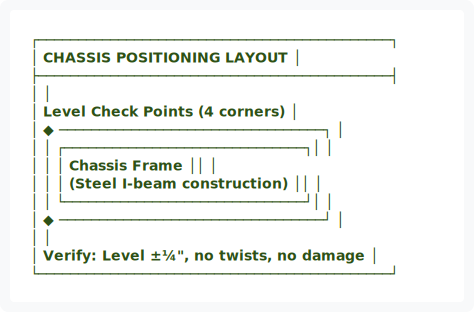
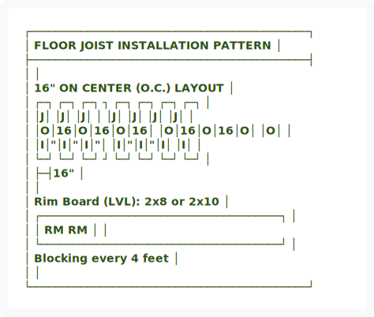
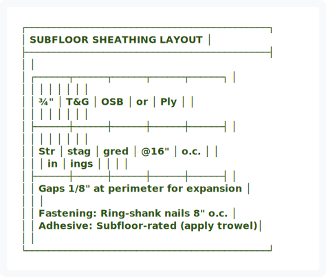
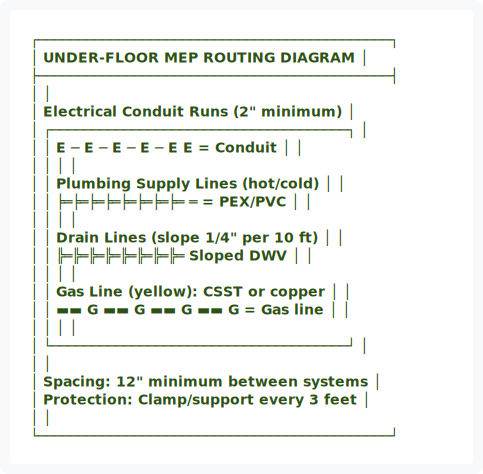
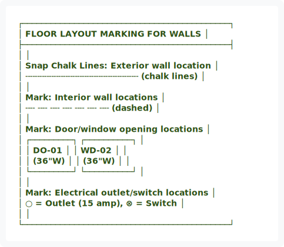
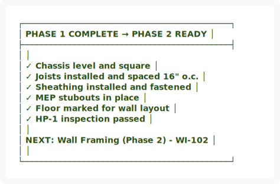

# WI-101: Chassis & Floor Deck Assembly (Phase 1)

---

## Work Instruction Overview

**Phase:** 1 of 8  
**Duration:** 1-2 days per bay  
**Crew:** Structural/Framing team (2-4 technicians)  
**Hold Point:** HP-1 (Third-party inspection required)  
**Related SOP:** SOP-101-Chassis-Floor-Deck.md

---

## Safety Callouts

⚠️ **CRITICAL SAFETY ITEMS:**
- Hard hat and safety glasses REQUIRED at all times
- Work at heights: Use fall protection if above 6 feet
- Nail gun operation: Keep hands clear of discharge path
- Pneumatic tools: Use proper PPE and pressure settings (100-120 psi)
- Adhesive safety: Ensure ventilation, avoid skin contact

---

## Step-by-Step Procedure

### Step 1: Chassis Positioning & Inspection


<div align="center">
  
</div>

<details>
<summary>View ASCII Source</summary>

```
┌────────────────────────────────────────────┐
│         CHASSIS POSITIONING LAYOUT         │
├────────────────────────────────────────────┤
│                                            │
│    Level Check Points (4 corners)          │
│    ◆ ─────────────────────────────────┐   │
│    │  ┌──────────────────────────────┐│   │
│    │  │   Chassis Frame             ││   │
│    │  │  (Steel I-beam construction) ││   │
│    │  └──────────────────────────────┘│   │
│    ◆ ─────────────────────────────────┘   │
│                                            │
│  Verify: Level ±¼", no twists, no damage   │
└────────────────────────────────────────────┘
```
</details>


**Actions:**
1. Receive chassis frame from delivery
2. Inspect for damage (photos if damage found)
3. Position in Bay using forklifts
4. Level frame using adjustable legs
5. Verify squareness (measure diagonals, should be equal)
6. Document baseline condition

**Quality Gate:** Chassis must be level ±¼" and square ±½" before proceeding.

---

### Step 2: Floor Joist Layout & Installation


<div align="center">
  
</div>

<details>
<summary>View ASCII Source</summary>

```
┌────────────────────────────────────────────┐
│    FLOOR JOIST INSTALLATION PATTERN       │
├────────────────────────────────────────────┤
│                                            │
│  16" ON CENTER (O.C.) LAYOUT               │
│  ┌─┐  ┌─┐  ┌─┐  ┐ ┌─┐  ┌─┐  ┌─┐ ┌─┐     │
│  │J│  │J│  │J│  │ │J│  │J│  │J│ │J│     │
│  │O│16│O│16│O│16│ │O│16│O│16│O│ │O│     │
│  │I│"│I│"│I│"│ │I│"│I│"│I│ │I│     │
│  └─┘  └─┘  └─┘  ┘ └─┘  └─┘  └─┘ └─┘     │
│  ├─┤16"                                   │
│                                            │
│  Rim Board (LVL): 2x8 or 2x10             │
│  ┌──────────────────────────────────────┐ │
│  │ RM                                 RM │ │
│  └──────────────────────────────────────┘ │
│  Blocking every 4 feet                    │
│                                            │
└────────────────────────────────────────────┘
```
</details>


**Actions:**
1. Snap chalk lines at 16" intervals
2. Install rim boards (glued + nailed)
3. Position I-joists at 16" o.c.
4. Secure with joist hangers or nails per schedule
5. Install blocking at mid-span and 4-ft intervals
6. Install diagonal bridging if required by plan

**Quality Gate:** All joists level, properly spaced, fully fastened.

---

### Step 3: Subfloor Sheathing Installation


<div align="center">
  
</div>

<details>
<summary>View ASCII Source</summary>

```
┌────────────────────────────────────────────┐
│    SUBFLOOR SHEATHING LAYOUT               │
├────────────────────────────────────────────┤
│                                            │
│  ┌──────┬──────┬──────┬──────┬──────┐     │
│  │      │      │      │      │      │     │
│  │  ¾"  │ T&G  │ OSB  │ or   │ Ply  │     │
│  │      │      │      │      │      │     │
│  ├──────┼──────┼──────┼──────┼──────┤     │
│  │      │      │      │      │      │     │
│  │ Str  │ stag │ gred │ @16" │ o.c. │     │
│  │      │ in   │ ings │      │      │     │
│  ├──────┼──────┼──────┼──────┼──────┤     │
│  │ Gaps 1/8" at perimeter for expansion   │
│  │                                        │
│  │ Fastening: Ring-shank nails 8" o.c.   │
│  │ Adhesive: Subfloor-rated (apply trowel)│
│                                            │
└────────────────────────────────────────────┘
```
</details>


**Actions:**
1. Apply construction adhesive to joists
2. Position sheathing panels (staggered rows)
3. Leave 1/8" gaps at perimeter for expansion
4. Fasten with ring-shank nails: 8" on joists, 16" on edges
5. Inspect for voids or raised areas
6. Mark MEP penetrations per electrical/plumbing plans

**Quality Gate:** Sheathing fully adhered, no voids, gaps correct, fasteners per schedule.

---

### Step 4: Below-Deck MEP Stubout Layout


<div align="center">
  
</div>

<details>
<summary>View ASCII Source</summary>

```
┌────────────────────────────────────────────┐
│    UNDER-FLOOR MEP ROUTING DIAGRAM         │
├────────────────────────────────────────────┤
│                                            │
│  Electrical Conduit Runs (2" minimum)      │
│  ┌─────────────────────────────────────┐   │
│  │ E ─ E ─ E ─ E ─ E    E = Conduit    │   │
│  │                                      │   │
│  │ Plumbing Supply Lines (hot/cold)     │   │
│  │ ╞═╞═╞═╞═╞═╞═╞═╞═     ═ = PEX/PVC   │   │
│  │                                      │   │
│  │ Drain Lines (slope 1/4" per 10 ft)   │   │
│  │ ╠═╠═╠═╠═╠═╠═╠═╠═     Sloped DWV    │   │
│  │                                      │   │
│  │ Gas Line (yellow): CSST or copper    │   │
│  │ ▬▬ G ▬▬ G ▬▬ G ▬▬    G = Gas line   │   │
│  │                                      │   │
│  └─────────────────────────────────────┘   │
│                                            │
│  Spacing: 12" minimum between systems      │
│  Protection: Clamp/support every 3 feet   │
│                                            │
└────────────────────────────────────────────┘
```
</details>


**Actions:**
1. Review electrical/plumbing/HVAC plans for penetrations
2. Mark all penetration locations on subfloor
3. Install conduit for electrical (leave pull string)
4. Stub water supply and drain lines through floor
5. Install gas line (if applicable)
6. Label and protect all penetrations
7. Take photos before proceeding to next phase

**Quality Gate:** All penetrations stubbed, labeled, protected, photos documented.

---

### Step 5: Pre-Wall Framing Preparation


<div align="center">
  
</div>

<details>
<summary>View ASCII Source</summary>

```
┌────────────────────────────────────────────┐
│    FLOOR LAYOUT MARKING FOR WALLS           │
├────────────────────────────────────────────┤
│                                            │
│  Snap Chalk Lines: Exterior wall location  │
│  ╌╌╌╌╌╌╌╌╌╌╌╌╌╌╌╌╌╌╌╌╌╌╌╌  (chalk lines) │
│                                            │
│  Mark: Interior wall locations             │
│  ╌╌  ╌╌  ╌╌  ╌╌  ╌╌  ╌╌  ╌╌  (dashed)     │
│                                            │
│  Mark: Door/window opening locations      │
│  ┌─────────┐         ┌──────────┐         │
│  │  DO-01  │         │  WD-02   │         │
│  │ (36"W)  │         │ (36"W)   │         │
│  └─────────┘         └──────────┘         │
│                                            │
│  Mark: Electrical outlet/switch locations  │
│  ○ = Outlet (15 amp), ⊗ = Switch          │
│                                            │
└────────────────────────────────────────────┘
```
</details>


**Actions:**
1. Snap chalk lines for all exterior walls (using plans)
2. Mark interior wall locations
3. Mark door and window opening locations
4. Mark electrical outlet/switch locations
5. Verify all markings against architectural plans
6. Prepare materials staging area for Phase 2

**Quality Gate:** All layouts marked accurately, verified against plans, Phase 2 materials ready.

---

### Step 6: Documentation & Hold Point HP-1 Prep

**Actions:**
1. Complete floor deck inspection form
2. Document all measurements and photos
3. Verify hold point requirements met (see SOP-101)
4. Schedule third-party inspector (CDOH-approved)
5. Ensure floor is clean and accessible for inspection
6. Have all certifications/documentation available

**Quality Gate:** Ready for third-party HP-1 inspection.

---

### Step 7: Next Phase Transition (Phase 2: Walls)


<div align="center">
  
</div>

<details>
<summary>View ASCII Source</summary>

```
┌────────────────────────────────────────────┐
│    PHASE 1 COMPLETE → PHASE 2 READY        │
├────────────────────────────────────────────┤
│                                            │
│  ✓ Chassis level and square                │
│  ✓ Joists installed and spaced 16" o.c.   │
│  ✓ Sheathing installed and fastened       │
│  ✓ MEP stubouts in place                   │
│  ✓ Floor marked for wall layout            │
│  ✓ HP-1 inspection passed                  │
│                                            │
│  NEXT: Wall Framing (Phase 2) - WI-102    │
│                                            │
└────────────────────────────────────────────┘
```
</details>


**Actions:**
1. Pass HP-1 inspection with zero NCRs
2. Notify Phase 2 team that floor is ready
3. Move equipment and materials to staging
4. Begin wall framing immediately upon approval

---

## Required Tools & Equipment

| Tool | Function | Required |
| :--- | :--- | :--- |
| Circular saw | Cut joists, rim board | Yes |
| Pneumatic nail gun | Install subfloor sheathing | Yes |
| Adhesive application (notched trowel or pneumatic) | Subfloor adhesive | Yes |
| Tape measure (25') | Verify spacing and dimensions | Yes |
| Chalk line | Layout wall locations | Yes |
| Level (4-6 ft) | Verify chassis and joists level | Yes |
| Carpenter's square | Verify right angles | Yes |
| Drill/driver | Pilot holes and fasteners | Yes |
| Safety equipment | Hard hat, glasses, gloves, hearing protection | Yes |

---

## Common Mistakes & How to Avoid

| Mistake | Impact | Prevention |
| :--- | :--- | :--- |
| Joists not level | Walls won't plumb, NCR issued | Use laser level, adjust legs before fastening |
| Wrong joist spacing | Sheathing will sag, structural failure | Measure every 3 joists, verify 16" o.c. |
| Sheathing voids (no adhesive) | Deflection under load, squeaky floor | Apply adhesive to all contact areas |
| Insufficient fasteners | Sheathing may separate, safety hazard | Follow fastener schedule: 8" joists, 16" edges |
| Gaps >1/8" at edges | Moisture infiltration, buckling | Use shims and verify 1/8" uniform gap |
| MEP penetrations unmarked | Damage during wall framing, rework | Mark with paint and install protective collars |

---

## Quality Checkpoints

**Before moving to Phase 2, verify:**
- [ ] Chassis level ±¼", square ±½"
- [ ] All joists installed and secured
- [ ] Joists level and properly spaced (16" o.c. ±½")
- [ ] Sheathing fully adhered (no voids)
- [ ] All fasteners per schedule
- [ ] Perimeter gaps 1/8"
- [ ] All MEP penetrations stubbed, labeled, protected
- [ ] Floor markings accurate and clear
- [ ] HP-1 passed with zero major NCRs
- [ ] Photos documented
- [ ] Module Traveler updated

---

## Next Phase

→ **Phase 2: Wall Framing & Sheathing** (WI-102)

After HP-1 inspection passes, wall framing team begins installation of exterior and interior wall frames on the prepared floor deck.

---

**Document Status:** ✅ ACTIVE  
**Last Updated:** January 14, 2026  
**Review Date:** July 14, 2026
generate-pdf.js
