<div align="center">

# 🏗️ FORT HOMES LLC
## Quality Management System

---

### CHASSIS & FLOOR DECK ASSEMBLY
### Work Instruction WI-101

| Attribute | Value |
|:----------|:------|
| **Document ID** | `WI-101` |
| **Revision** | `2.0` |
| **Effective Date** | January 2026 |
| **Process Owner** | Production Manager |
| **Classification** | CONTROLLED |
| **Review Cycle** | Semi-Annual |
| **Next Review** | July 2026 |
| **Parent SOP** | `SOP-101` - Chassis & Floor Deck Assembly |
| **Skill Level** | Intermediate |
| **Estimated Time** | 8-16 hours (1-2 days) |

---

</div>

## 📋 Document Control

| **Attribute** | **Details** |
|:--------------|:------------|
| **Supersedes** | WI-101 Rev 1.0 |
| **Parent SOP** | SOP-101 - Chassis & Floor Deck Assembly (Phase 1) |
| **Related Documents** | FORM-I101, SOP-006, SOP-013 |
| **Distribution** | Production staff, supervisors, framing crew |
| **Custodian** | Document Controller |

---

## 🎯 Purpose

This work instruction provides comprehensive step-by-step guidance for assembling the chassis and floor deck system in Phase 1 of modular home production, ensuring structural integrity, dimensional accuracy, and compliance with engineered specifications and building codes.

---

## 📖 Scope

**This instruction covers:**
- Receipt and positioning of steel chassis frames
- Floor joist installation (I-joists per engineered plans)
- Blocking, bridging, and rim board installation
- Subfloor sheathing installation (glued and fastened)
- Layout marking for walls and MEP penetrations
- Below-floor MEP stubout preparation
- Quality inspection and Hold Point HP-1 preparation

**This instruction does NOT cover:**
- Chassis manufacturing or engineering design
- Wall framing (see WI-102)
- MEP system installation details (see WI-104)
- Specialized structural repairs requiring engineering approval

**Phase:** 1 of 8
**Duration:** 1-2 days per bay
**Hold Point:** HP-1 (Third-party inspection required)

---

## ⚠️ Safety First

<div style="background: linear-gradient(135deg, #FFEBEE 0%, #FFCDD2 100%); border-left: 4px solid #F44336; padding: 16px; margin: 16px 0; border-radius: 4px;">
  <strong>⚠️ CRITICAL SAFETY</strong><br>
  <strong>Required PPE:</strong>
  <ul>
    <li><strong>Hard hat</strong> - Protection from overhead hazards and falling materials</li>
    <li><strong>Safety glasses/goggles</strong> - Protection from wood chips, dust, and fastener discharge</li>
    <li><strong>Work gloves</strong> - Cut protection when handling lumber and sheathing</li>
    <li><strong>Steel-toed boots</strong> - Protection from dropped materials and puncture hazards</li>
    <li><strong>Hearing protection</strong> - Required when operating pneumatic nail guns (>85 dB)</li>
    <li><strong>Dust mask/respirator</strong> - Required when cutting OSB/plywood (silica exposure)</li>
    <li><strong>Fall protection</strong> - Harness required if working >6 feet above ground</li>
  </ul>
  <strong>Hazards:</strong>
  <ul>
    <li>⚠️ <strong>Crushing hazard</strong> - Heavy chassis and lumber can cause severe injury. Use proper lifting techniques.</li>
    <li>⚠️ <strong>Nail gun discharge</strong> - Keep hands clear of discharge path. Never disable safety mechanisms.</li>
    <li>⚠️ <strong>Chemical exposure</strong> - Construction adhesives contain VOCs. Ensure adequate ventilation.</li>
    <li>⚠️ <strong>Fall hazard</strong> - Work may require standing on floor system. Use fall protection ≥6 feet.</li>
    <li>⚠️ <strong>Pinch points</strong> - Chassis positioning with forklifts creates pinch hazards. Maintain clear zones.</li>
  </ul>
</div>

### Emergency Stop Conditions

🛑 **STOP WORK IMMEDIATELY if:**
- [ ] Chassis frame shows structural cracks, bends, or damage
- [ ] Dimensions are out of tolerance beyond acceptable limits (>½")
- [ ] Material defects discovered (water damage, delamination, splits >12")
- [ ] Pneumatic tool pressure exceeds 120 psi or malfunctions
- [ ] Anyone is injured or near-miss incident occurs
- [ ] Equipment malfunctions (forklifts, nail guns, saws)
- [ ] Floor system shows signs of structural instability

**Notify:** Production Supervisor immediately
**Emergency:** Call 911 for serious injuries
**Document:** Red-tag the area and complete incident report

---

## 🔧 Tools & Materials

### Tools Required

| Tool | Specification | Purpose | Calibration |
|:-----|:-------------|:--------|:------------|
| Pneumatic nail gun | 100-120 psi, ring-shank compatible | Install subfloor sheathing | Yes (pressure gauge) |
| Cordless drill/driver | 18V minimum, variable speed | Pilot holes, fastener installation | No |
| Circular saw | 7¼" blade, carbide-tipped | Cut joists, rim boards, sheathing | No |
| Chalk line | 100 ft minimum | Layout joist spacing and walls | No |
| Tape measure | 25 ft minimum, ¼" increments | All dimensional measurements | Yes (annual) |
| Carpenter's level | 4-6 ft, bubble vials | Verify chassis level and joist alignment | Yes (annual) |
| Laser level (optional) | Rotating laser preferred | Precision chassis leveling | Yes (annual) |
| Speed square | 7" or 12" aluminum | Verify right angles | No |
| Carpenter's square | 24" × 16" | Frame squareness verification | No |
| Adhesive applicator | Notched trowel (¼" × ⅜") or pneumatic | Apply subfloor adhesive | No |
| Caulk gun | Standard 10 oz cartridge | Seal penetrations | No |
| Utility knife | Retractable blade | Trim sheathing, cut membranes | No |
| Hammer | 16-20 oz framing hammer | Manual fastening, adjustments | No |

### Materials Required

| Material | Specification | Quantity | Location |
|:---------|:-------------|:---------|:---------|
| Steel chassis | Model-specific, engineered (certified) | 1 per module | Receiving area |
| I-joists | Size per plan (typical: 11⅞" @ 16" O.C.) | Per plan | Lumber staging |
| Rim boards | LVL or 2x lumber, grade-stamped | Perimeter length | Lumber staging |
| Blocking/Bridging | 2x6 or 2x8 per plan | Per plan | Lumber staging |
| Subfloor sheathing | ¾" T&G OSB or plywood, grade-stamped | Per plan sq ft | Material rack |
| Construction adhesive | Subfloor-rated (Titebond, Loctite) | 1 tube per 4 sheets | Tool crib |
| Ring-shank nails | 8d or 10d, per fastener schedule | Per schedule | Fastener bin |
| Structural screws (optional) | #10 × 3", approved alternative | Per schedule | Fastener bin |
| Shims | Composite or cedar, tapered | As needed | Tool crib |

### Equipment Setup

**Before starting, verify:**
- ✅ All tools are in good condition (inspect blades, cords, triggers)
- ✅ Materials meet specifications (grade stamps visible, no damage)
- ✅ Work area is clean and organized (sweep floor, clear debris)
- ✅ Safety equipment is available (PPE, first aid, fire extinguisher)
- ✅ Adequate lighting (minimum 50 foot-candles)
- ✅ All measurements/drawings available (engineered plans in bay)
- ✅ Pneumatic compressor pressure set to 100-120 psi
- ✅ Forklift certified operator available for chassis positioning

---

## 📐 Specifications & Standards

### Key Specifications

| Dimension/Parameter | Specification | Tolerance | Measurement Method |
|:--------------------|:-------------|:----------|:-------------------|
| Chassis level | Level across length/width | ± ¼" | Laser level or transit |
| Frame squareness | Diagonal measurements equal | ± ½" | Tape measure diagonals |
| Joist spacing | 16" on center (O.C.) | ± ¼" | Tape measure spot-check |
| Joist alignment | Straight across length | ± ¼" over 16 ft | Straightedge or sightline |
| Subfloor flatness | No humps or dips | ± ⅛" over 10 ft | Straightedge test |
| Adhesive coverage | Visible squeeze-out | ≥ 80% of contacts | Visual inspection |
| Fastener pattern - field | 12" on center | ± 1" | Visual count/measure |
| Fastener pattern - edges | 6" on center | ± 1" | Visual count/measure |
| Perimeter expansion gap | 1/8" at all edges | ± 1/16" | Visual/feeler gauge |
| Moisture content | Lumber/sheathing | ≤ 18% | Moisture meter |

### Reference Standards

- **IRC 2021 Chapter 5:** Floors (structural requirements)
- **APA Engineered Wood Construction Guide:** Subfloor installation best practices
- **Engineered Plans:** Model-specific stamped drawings (primary authority)
- **Company Fastener Schedule:** Approved nailing/screwing patterns
- **OSHA 1926 Subpart R:** Fall protection requirements

---

## 📝 Step-by-Step Instructions

<div style="background: linear-gradient(135deg, #E3F2FD 0%, #BBDEFB 100%); border-left: 4px solid #2196F3; padding: 16px; margin: 16px 0; border-radius: 4px;">
  <strong>ℹ️ IMPORTANT</strong><br>
  Follow these steps in order. Do not skip steps. If you have questions, ask your supervisor before proceeding. Each step includes quality checks that must pass before continuing.
</div>

---

### Preparation Phase

#### Step 1: Review Work Order & Engineered Plans

**Time:** 10 minutes

**Objective:** Understand the specific module requirements and verify all documentation

**What to do:**

1. **Obtain and record work order information**
   - Work Order Number: `_______________`
   - Module Serial Number: `_______________`
   - Production Bay: `_______________`
   - Model Type: `_______________`

2. **Review engineered plans**
   - Verify plans are current revision (check stamp date)
   - Review floor system details (joist size, spacing, blocking requirements)
   - Note any special requirements or customer options
   - Identify MEP penetration locations

3. **Verify chassis specifications**
   - Check chassis model number matches work order
   - Review steel certification documents (on file)
   - Confirm dimensions match plan

4. **Check material availability**
   - Verify all I-joists are on-site (count against plan)
   - Confirm rim boards, blocking materials available
   - Check subfloor sheathing quantity and type
   - Verify adhesive and fasteners in stock

**Check before proceeding:**
- ☐ Work order number recorded and understood
- ☐ Engineered plans reviewed (current stamp visible)
- ☐ Chassis specifications confirmed
- ☐ All materials counted and available
- ☐ Any questions clarified with supervisor
- ☐ Special requirements noted on work order

<div style="background: linear-gradient(135deg, #FFF3E0 0%, #FFE0B2 100%); border-left: 4px solid #FF9800; padding: 16px; margin: 16px 0; border-radius: 4px;">
  <strong>💡 PRO TIP</strong><br>
  Take 5 minutes to walk through the engineered plans with your crew before starting. Point out unusual features, critical dimensions, and MEP conflicts. This prevents rework later.
</div>

---

#### Step 2: Prepare Work Area & Position Chassis

**Time:** 30-45 minutes

**Objective:** Set up a safe, organized workspace and position chassis for assembly

**Step 2.1: Prepare bay work area**

**What to do:**

1. **Clear and clean workspace**
   - Remove debris, scrap lumber, and obstacles from bay
   - Sweep floor to remove nails, sawdust, and trip hazards
   - Ensure 3-foot clearance around chassis positioning area
   - Mark forklift travel path with cones or tape

2. **Organize tools and materials**
   - Set up tool staging area within 10 feet of work zone
   - Arrange adhesive, fasteners, and hand tools on cart
   - Position pneumatic nail gun with hose routing clear of walkways
   - Stage I-joists vertically on racks (prevent bowing)
   - Stack subfloor sheathing on pallets (keep dry, elevated)

3. **Set up safety barriers**
   - Post "Work in Progress" signs at bay entrance
   - Establish forklift operation zone (no pedestrians during lifts)
   - Verify fire extinguisher location and access
   - Ensure adequate ventilation (open bay doors if using adhesives)

**Photos:**

*[Photo: Clean bay with marked work zones and staged materials]*

**Check before proceeding:**
- ☐ Work area clean and organized
- ☐ Tools laid out and ready
- ☐ Materials verified and accessible
- ☐ Safety barriers/signs in place
- ☐ Forklift operator certified and briefed

---

**Step 2.2: Chassis receipt and inspection**

**What to do:**

1. **Visual inspection for shipping damage**
   - Walk around entire chassis perimeter
   - Check for cracks, bends, or deformation in steel members
   - Inspect welds for cracks or discontinuities
   - Look for rust scale, corrosion, or coating damage
   - Verify axle condition (if not yet removed)

2. **Verify chassis identification**
   - Confirm chassis model number matches work order
   - Check steel certification tag (if present)
   - Document chassis serial number: `_______________`

3. **Check critical dimensions** (before positioning)
   - Measure overall length: ________ (compare to plan)
   - Measure overall width: ________ (compare to plan)
   - Verify cross-member spacing matches plan

4. **Document condition**
   - If NO damage: Sign off on receiving form
   - If damage found: **STOP** - Red-tag chassis, photograph damage, notify supervisor
   - Complete FORM-REC-001 (Receiving Inspection Form)

**Photos:**

*[Photo: Close-up of chassis identification tag]*
*[Photo: Chassis corner showing steel member condition]*

**Quality Check:**
- [ ] No visible damage, cracks, or significant corrosion
- [ ] Model number matches work order
- [ ] Dimensions within ± ½" of plan
- [ ] Steel certifications on file (verified by supervisor)

<div style="background: linear-gradient(135deg, #FFF3E0 0%, #FFE0B2 100%); border-left: 4px solid #FF9800; padding: 16px; margin: 16px 0; border-radius: 4px;">
  <strong>💡 PRO TIP</strong><br>
  Use your smartphone to photograph the chassis from all four corners and the identification tag. Upload to the module folder immediately. This protects you if damage is discovered later.
</div>

---

**Step 2.3: Position chassis in bay**

**What to do:**

1. **Coordinate with forklift operator**
   - Brief operator on chassis weight and balance points
   - Establish hand signals (stop, up, down, forward, back)
   - Clear all personnel from lift zone
   - Verify fork width matches chassis lift points

2. **Lift and position chassis**
   - Operator: Lift chassis carefully (smooth, controlled movements)
   - Position chassis in bay center (measure from walls to center)
   - Lower onto leveling blocks or shims
   - Leave chassis slightly elevated for shimming/leveling

3. **Center chassis in bay**
   - Measure from each wall to chassis edge
   - Target: Equal spacing on all sides (minimum 36" clearance)
   - Adjust position using forklift or pry bars if needed

**Photos:**

*[Photo: Chassis positioned in bay, showing clearances]*

**Safety Check:**
- [ ] All personnel clear during forklift operation
- [ ] Chassis stable and secure before approaching
- [ ] No pedestrians in forklift travel path

---

**Step 2.4: Level and square chassis**

**What to do:**

1. **Set up leveling equipment**
   - Use laser level or 6 ft carpenter's level
   - Prepare composite shims (various thicknesses)

2. **Level chassis lengthwise**
   - Place level along main chassis beam
   - Check bubble (target: within ¼")
   - Add shims under low corners as needed
   - Re-check after shimming

3. **Level chassis widthwise**
   - Rotate level 90 degrees
   - Check across width at front, middle, rear
   - Adjust shims until level within ¼" across entire chassis

4. **Verify squareness**
   - Measure diagonal A (corner to opposite corner): ________
   - Measure diagonal B (opposite diagonal): ________
   - Calculate difference: ________ (must be ≤ ½")
   - If out of square: Adjust chassis position with forklift and re-level

5. **Lock chassis in position**
   - Insert safety pins or blocks to prevent movement
   - Mark floor with paint or tape (chassis perimeter reference)

**Measurement Table:**

| Point | Specification | Actual | Pass/Fail |
|:------|:-------------|:-------|:---------:|
| Level - Length | ± ¼" | _____ | ☐ |
| Level - Width Front | ± ¼" | _____ | ☐ |
| Level - Width Rear | ± ¼" | _____ | ☐ |
| Diagonal A | Record | _____ | - |
| Diagonal B | Difference ≤ ½" from A | _____ | ☐ |

**Photos:**

*[Photo: Level placed on chassis showing bubble]*
*[Photo: Diagonal measurement in progress]*

**✅ Quality Check:**
- [ ] Chassis level within ± ¼" in both directions
- [ ] Diagonals differ by ≤ ½"
- [ ] Chassis stable and secured in position
- [ ] Floor marked for reference
- [ ] Measurements recorded on work order

**Common Problems & Solutions:**

| Problem | Likely Cause | Solution |
|:--------|:------------|:---------|
| Chassis won't level | Uneven floor | Use thicker shims. If >2" needed, consult supervisor for blocking strategy |
| Diagonals differ >½" | Chassis damaged or twisted | **STOP** - Red-tag chassis, escalate to engineering for evaluation |
| Chassis shifts during shimming | Unstable shim stack | Replace multiple thin shims with single thicker shim. Tap into place firmly |

---

### Execution Phase

#### Step 3: Install Rim Boards

**Time:** 45-60 minutes

**Objective:** Install perimeter rim boards that will support floor joists

**Prerequisites:**
- ✅ Step 2 completed and chassis leveled
- ✅ Rim board material on-site and grade-stamped

**Step 3.1: Cut and fit rim boards**

**What to do:**

1. **Measure perimeter dimensions**
   - Measure each side of chassis (front, rear, left, right)
   - Add ½" to each measurement for cutting allowance
   - Record measurements:
     - Front: ________
     - Rear: ________
     - Left: ________
     - Right: ________

2. **Cut rim boards to length**
   - Use circular saw with sharp blade
   - Measure twice, cut once
   - Cut square ends (90° using speed square)
   - Label each piece (F=Front, R=Rear, L=Left, R=Right)

3. **Check material condition**
   - Verify grade stamp visible on each piece
   - Inspect for splits >12" (reject if found)
   - Check for twists or bows (reject if >¼" over length)
   - Confirm moisture content ≤18% (use moisture meter)

4. **Test fit rim boards**
   - Lay boards in position without fastening
   - Verify corners meet flush (no gaps >⅛")
   - Check that boards sit flush on chassis top flange
   - Adjust cuts if needed

**Photos:**

*[Photo: Rim boards cut and labeled]*
*[Photo: Test fit showing flush corner joint]*

**✅ Quality Check:**
- [ ] All rim boards cut to correct length (± ⅛")
- [ ] Grade stamps visible
- [ ] No defects (splits, twists, water damage)
- [ ] Corners fit flush with no gaps

<div style="background: linear-gradient(135deg, #FFF3E0 0%, #FFE0B2 100%); border-left: 4px solid #FF9800; padding: 16px; margin: 16px 0; border-radius: 4px;">
  <strong>💡 PRO TIP</strong><br>
  Always cut rim boards 1/16" longer than the measured dimension. You can sand or plane them flush, but you can't add length back. A tight fit is better than a gap.
</div>

---

**Step 3.2: Apply adhesive and fasten rim boards**

**What to do:**

1. **Prepare adhesive**
   - Check adhesive expiration date (reject if expired)
   - Verify temperature is above 50°F (adhesive won't bond properly if cold)
   - Load adhesive into applicator or caulk gun
   - Cut nozzle tip at 45° angle (¼" bead diameter)

2. **Apply adhesive to chassis**
   - Run continuous ¼" bead along top of chassis flange
   - Apply to area where rim board will sit
   - Work in sections (apply adhesive for one side at a time)
   - Ensure no gaps or skips in adhesive bead

3. **Position rim board**
   - Set board onto adhesive-covered chassis
   - Press firmly to spread adhesive
   - Verify board is flush with chassis edge
   - Check that board is level (use 4 ft level)

4. **Fasten rim board**
   - Follow fastener schedule: **16d nails @ 12" O.C.** (or per plan)
   - Start at one end and work toward the other
   - Drive nails perpendicular to board (not angled)
   - Verify nails penetrate at least 1½" into chassis or mounting surface
   - Check for adhesive squeeze-out (should be visible along chassis)

5. **Repeat for all four sides**
   - Install front, rear, left, right rim boards
   - Ensure corners overlap properly (butt joint or miter per plan)
   - Verify all boards are level and flush

**Photos - Sequence:**

*Photo 1: Adhesive bead applied to chassis*
*Photo 2: Rim board being pressed into position*
*Photo 3: Fastening with nail gun*
*Photo 4: Completed rim board with visible adhesive squeeze-out*

**✅ Quality Check:**
- [ ] Adhesive applied continuously (no gaps)
- [ ] Adhesive squeeze-out visible at ≥80% of rim board length
- [ ] Fastener pattern matches schedule (12" O.C.)
- [ ] All fasteners driven flush (no overdriven or protruding nails)
- [ ] Rim boards level and flush with chassis
- [ ] Corners fit tight (gaps ≤⅛")

**Common Problems & Solutions:**

| Problem | Likely Cause | Solution |
|:--------|:------------|:---------|
| Adhesive not squeezing out | Insufficient adhesive or uneven board | Remove board, add more adhesive, reinstall. Check for voids. |
| Nail gun jams during fastening | Wrong fastener size or air pressure | Clear jam, verify 16d nails and 100-120 psi pressure. Test on scrap. |
| Rim board twists when fastening | Board has bow or pressure uneven | Pre-drill holes if board resists. Clamp board straight while fastening. |
| Corner joint has gap | Mismeasurement or cut not square | Fill gap ≤⅛" with adhesive. If >⅛", re-cut board to proper length. |

---

#### Step 4: Install Floor Joists

**Time:** 2-4 hours

**Objective:** Install I-joists at proper spacing to support subfloor sheathing

**Prerequisites:**
- ✅ Step 3 completed and rim boards installed
- ✅ I-joists staged and acclimated to bay temperature

**Step 4.1: Layout joist spacing**

**What to do:**

1. **Snap chalk lines for joist layout**
   - Measure and mark joist locations on rim boards
   - Typical spacing: **16" on center (O.C.)** - verify against plan
   - Start layout from one end (usually left side)
   - Mark both front and rear rim boards

2. **Create layout marks**
   - Use square to mark perpendicular line across rim board
   - Mark "X" on the side where joist will sit
   - Number each joist location (1, 2, 3, etc.)
   - Verify spacing: Measure every 5th mark (should be 5 × 16" = 80")

3. **Check layout against plan**
   - Count total number of joists (compare to plan count)
   - Verify spacing at openings or special conditions
   - Note any joists that need to be doubled or reinforced

**Diagram:**

```
┌────────────────────────────────────────────┐
│    FLOOR JOIST INSTALLATION PATTERN        │
├────────────────────────────────────────────┤
│                                            │
│  16" ON CENTER (O.C.) LAYOUT               │
│  ┌─┐  ┌─┐  ┌─┐  ┌─┐  ┌─┐  ┌─┐  ┌─┐       │
│  │1│  │2│  │3│  │4│  │5│  │6│  │7│       │
│  │ │16│ │16│ │16│ │16│ │16│ │16│ │       │
│  └─┘  └─┘  └─┘  └─┘  └─┘  └─┘  └─┘       │
│  ├─┤ 16"                                   │
│                                            │
│  Rim Board (top and bottom):               │
│  ┌──────────────────────────────────────┐  │
│  │ X   X   X   X   X   X   X   X        │  │
│  │ 1   2   3   4   5   6   7   8        │  │
│  └──────────────────────────────────────┘  │
│  Mark "X" where each joist sits            │
│                                            │
└────────────────────────────────────────────┘
```

**Photos:**

*[Photo: Chalk line snapped on rim board]*
*[Photo: Close-up of layout marks with "X" and numbers]*

**✅ Quality Check:**
- [ ] Layout marks at 16" O.C. (± ¼")
- [ ] Marks on both front and rear rim boards align
- [ ] All joists numbered sequentially
- [ ] Layout verified against engineered plan

---

**Step 4.2: Install blocking and joist hangers (if required)**

**What to do:**

1. **Review plan for blocking requirements**
   - Check if plan specifies blocking at mid-span
   - Verify if joist hangers are required (typical for rim board connections)
   - Note any special blocking at openings

2. **Install joist hangers** (if specified)
   - Position hanger at layout mark
   - Align hanger square to rim board
   - Fasten with specified nails (typically 10d or joist hanger nails)
   - Fill all nail holes in hanger (no empty holes allowed)

3. **Cut and prepare blocking** (if specified)
   - Cut blocking material to fit between joists
   - Typical blocking: 2×6 or 2×8, cut to 14½" length (for 16" O.C. spacing)
   - Install at mid-span per plan

**Photos:**

*[Photo: Joist hanger installed and fully nailed]*
*[Photo: Blocking installed at mid-span]*

**✅ Quality Check:**
- [ ] Joist hangers installed at correct locations (if required)
- [ ] All hanger nail holes filled
- [ ] Hangers square to rim board
- [ ] Blocking cut to proper length

<div style="background: linear-gradient(135deg, #FFF3E0 0%, #FFE0B2 100%); border-left: 4px solid #FF9800; padding: 16px; margin: 16px 0; border-radius: 4px;">
  <strong>💡 PRO TIP</strong><br>
  When using joist hangers, use the correct hanger nails - NOT framing nails. Framing nails can split the hanger tabs. Joist hanger nails are shorter and thicker.
</div>

---

**Step 4.3: Install I-joists**

**What to do:**

1. **Prepare I-joists**
   - Inspect each joist for damage (look for flange cracks, web damage)
   - Reject any joist with cracks >2" or damaged flanges
   - Orient joists with crown UP (sight down joist to find crown)
   - Stage joists near installation area (prevent bowing)

2. **Apply adhesive to bearing points**
   - Apply ¼" bead of adhesive on rim board at joist location
   - Apply adhesive to both front and rear bearing points
   - Ensure full contact width (across entire joist flange width)

3. **Set joist in position**
   - Lift joist and position on layout mark
   - Press firmly onto adhesive
   - Verify joist is perpendicular to rim board (90°)
   - Check that joist is sitting flat on chassis or rim board

4. **Fasten joist to rim board**
   - Drive fasteners per schedule (typical: **3 × 16d nails** per bearing point)
   - Nail through rim board into joist end flange
   - Alternate nail locations (don't line up all nails - causes splitting)
   - Or, if using joist hangers: Set joist into hanger, nail through hanger holes

5. **Check joist alignment**
   - Use string line from front to rear
   - Verify joist is plumb (vertical) using level on web
   - Adjust if joist is leaning or twisted

6. **Repeat for all joists**
   - Work systematically from one end to the other
   - Verify spacing as you go (measure every 3rd joist)
   - Install all joists before proceeding to blocking

**Photos - Sequence:**

*Photo 1: I-joist showing crown orientation (label "crown up")*
*Photo 2: Adhesive applied to bearing point*
*Photo 3: Joist positioned and being nailed*
*Photo 4: Completed joists showing proper spacing*

**Measurement:**
- Measure joist spacing at 3 locations (front, middle, rear):
  - Joist 1-2: ________ (target 16" ± ¼")
  - Joist 5-6: ________ (target 16" ± ¼")
  - Joist 10-11: ________ (target 16" ± ¼")

**✅ Quality Check:**
- [ ] All joists have crown facing up
- [ ] Joists spaced 16" O.C. ± ¼"
- [ ] Adhesive applied to all bearing points
- [ ] Fasteners per schedule (3 nails minimum per bearing)
- [ ] Joists plumb (vertical) and perpendicular to rim boards
- [ ] No damaged joists installed

**Common Problems & Solutions:**

| Problem | Likely Cause | Solution |
|:--------|:------------|:---------|
| Joist spacing drifts out of tolerance | Layout marks incorrect or joist shifted | Re-measure from starting point. Adjust remaining joists to compensate. |
| Joist won't sit flush on rim board | Rim board high spot or joist warped | Plane or sand rim board. Replace warped joist if bow >¼". |
| Joist twists after installation | Insufficient bracing or joist defect | Install temporary bracing. Check if joist is defective (flange damage). |
| Adhesive not squeezing out | Insufficient adhesive applied | Add more adhesive before next joist. Check previous joists - may need to remove and reapply. |

---

**Step 4.4: Install bridging or blocking**

**What to do:**

1. **Determine blocking type and location**
   - Review plan for blocking requirements
   - Typical: Solid blocking at mid-span (8 ft from rim board for 16 ft span)
   - Alternative: Diagonal bridging (metal or wood X-bracing)

2. **Install solid blocking** (if specified)
   - Measure distance between joists (typically 14½" for 16" O.C.)
   - Cut 2× material (2×6 or 2×8 per plan) to fit snugly between joists
   - Offset blocking (stagger pattern - easier to nail)
   - Toenail or end-nail blocking to joists (2 nails per end)

3. **Install diagonal bridging** (if specified)
   - Use metal bridging straps or wood cross-bracing
   - Install per manufacturer instructions
   - Nail top end first, pull tight, nail bottom end

4. **Verify blocking alignment**
   - Sight down blocking row - should be straight
   - Check that blocking is tight against joist flanges
   - Confirm blocking doesn't cause joists to twist

**Photos:**

*[Photo: Solid blocking installed between joists]*
*[Photo: Diagonal bridging (if used)]*

**✅ Quality Check:**
- [ ] Blocking installed at mid-span (or per plan)
- [ ] Blocking fits snugly between joists
- [ ] Fasteners secure (2 nails per connection minimum)
- [ ] Blocking doesn't cause joist twisting

---

#### Step 5: Install Subfloor Sheathing

**Time:** 3-5 hours

**Objective:** Install and fasten subfloor sheathing to create solid, structural floor surface

**Prerequisites:**
- ✅ Step 4 completed and all joists installed
- ✅ Subfloor sheathing on-site and acclimated

**Step 5.1: Prepare sheathing material**

**What to do:**

1. **Verify sheathing material**
   - Check thickness: **¾" T&G OSB or plywood** (per plan)
   - Verify grade stamp visible on each sheet
   - Inspect for water damage, delamination, or defects
   - Reject any sheet with damage

2. **Acclimate sheathing** (if needed)
   - If temperature <50°F or humidity >85%: Acclimate 24 hours
   - Stack sheathing with spacers (allow air circulation)
   - Keep sheathing covered and dry until installation

3. **Plan sheathing layout**
   - Arrange panels perpendicular to joists
   - Stagger end joints (don't align end joints between rows)
   - Start with full sheets at one end
   - Mark cut lines for final sheets

**Photos:**

*[Photo: Sheathing stack showing grade stamps]*
*[Photo: Layout sketch showing staggered joints]*

**✅ Quality Check:**
- [ ] Sheathing is correct thickness (¾")
- [ ] Grade stamps visible
- [ ] No water damage or delamination
- [ ] Layout planned to minimize waste

---

**Step 5.2: Snap chalk lines for fastening**

**What to do:**

1. **Mark joist centerlines on sheathing**
   - Use chalk line to snap lines at 16" intervals
   - Snap lines across entire floor system
   - These lines guide nail placement (ensures nails hit joists)

2. **Verify chalk lines align with joists**
   - Measure from edge to first chalk line
   - Should match distance from edge to first joist center
   - Adjust if needed

**Photos:**

*[Photo: Chalk lines snapped showing 16" spacing]*

**✅ Quality Check:**
- [ ] Chalk lines at 16" O.C.
- [ ] Lines align with joist centers

---

**Step 5.3: Apply adhesive and install sheathing**

**What to do:**

1. **Apply construction adhesive**
   - Work in sections (adhesive for 1-2 sheets at a time)
   - Apply continuous ¼" bead on top of each joist
   - Ensure bead is centered on joist (nail will compress adhesive)
   - Apply adhesive to rim boards as well

2. **Position first sheathing panel**
   - Start at corner (typically front-left)
   - Orient panel perpendicular to joists
   - Align panel edge with outside edge of rim board
   - Leave **⅛" gap** at perimeter edges (expansion space)

3. **Verify tongue-and-groove engagement**
   - If T&G sheathing: Ensure grooves fully engage tongues
   - Tap edge with rubber mallet if needed (don't force - can damage tongue)
   - Check that panel is flat (no raised corners)

4. **Fasten sheathing**
   - Follow fastener schedule:
     - **Edges (on rim boards/perimeter joists): 6" O.C.**
     - **Field (interior joists): 12" O.C.**
   - Use pneumatic nail gun (ring-shank nails: 8d or 10d)
   - Drive nails flush (not overdriven - can crush sheathing)
   - Nail along chalk lines (ensures hitting joists - no "shiners")

5. **Verify adhesive squeeze-out**
   - Check between panel edge and joist
   - Should see adhesive squeeze-out at ≥80% of joist contacts
   - If no squeeze-out: May need more adhesive on next panel

6. **Install subsequent panels**
   - Apply adhesive to joists for next panel
   - Position next panel with ⅛" gap from previous panel
   - Stagger end joints (offset by ≥4 ft from previous row)
   - Continue until floor is fully sheated

**Fastener Pattern Diagram:**

```
┌────────────────────────────────────────────┐
│    SUBFLOOR SHEATHING FASTENING PATTERN    │
├────────────────────────────────────────────┤
│                                            │
│  ┌──────┬──────┬──────┬──────┬──────┐     │
│  │ 6"   │ 12"  │ 12"  │ 12"  │ 6"   │     │
│  │ O.C. │ O.C. │ O.C. │ O.C. │ O.C. │     │
│  ├──────┼──────┼──────┼──────┼──────┤     │
│  │ ●────●────●────●────●────●────●  │     │
│  │      │      │      │      │      │     │
│  │ ●────●────●────●────●────●────●  │     │
│  │      │      │      │      │      │     │
│  │ ●────●────●────●────●────●────●  │     │
│  │      │      │      │      │      │     │
│  ├──────┼──────┼──────┼──────┼──────┤     │
│  │                                  │     │
│  │  EDGES: 6" spacing (perimeter)   │     │
│  │  FIELD: 12" spacing (interior)   │     │
│  │  1/8" gap at all panel edges     │     │
│  │                                  │     │
│  └──────────────────────────────────┘     │
│                                            │
└────────────────────────────────────────────┘
```

**Photos - Sequence:**

*Photo 1: Adhesive bead applied to joists*
*Photo 2: First panel positioned with ⅛" gap*
*Photo 3: Nailing pattern showing 6" edge spacing*
*Photo 4: Completed section showing staggered joints*
*Photo 5: Adhesive squeeze-out visible between panel and joist*

**Measurement:**
- Verify expansion gaps:
  - Front perimeter: ________ (target ⅛" ± 1/16")
  - Rear perimeter: ________ (target ⅛" ± 1/16")
  - Left perimeter: ________ (target ⅛" ± 1/16")
  - Right perimeter: ________ (target ⅛" ± 1/16")

**✅ Quality Check:**
- [ ] Adhesive applied to all joists supporting panel
- [ ] Panels perpendicular to joists
- [ ] ⅛" expansion gap at all perimeter edges
- [ ] End joints staggered (offset ≥4 ft)
- [ ] Fastener pattern matches schedule (6" edges, 12" field)
- [ ] All fasteners driven flush (not overdriven)
- [ ] Adhesive squeeze-out visible at ≥80% of joist contacts
- [ ] No "shiners" (missed joists) - check from below if accessible

**Common Problems & Solutions:**

| Problem | Likely Cause | Solution |
|:--------|:------------|:---------|
| Panel won't lay flat (corners raised) | Joist high spot or panel warped | Check joists with straightedge. Plane high spots. Replace warped panels. |
| Fastener "shiners" (missed joists) | Nail gun off chalk line or joist shifted | Pull "shiner" nails immediately. Re-nail 2" away hitting joist. Check all nails. |
| Adhesive not squeezing out | Insufficient adhesive or panel not pressed down | Apply more adhesive on next panel. Walk on panel to press adhesive before nailing. |
| Tongue damaged during panel installation | Forcing panel or misalignment | Ease panel into place. Tap with rubber mallet on scrap block, not directly on tongue. |
| Gap >⅛" at perimeter | Sheathing cut oversize or layout error | If gap <¼": Acceptable. If >¼": Trim panel or adjust subsequent panel positions. |
| Fastener overdriven (dimple in sheathing) | Pneumatic pressure too high | Reduce air pressure to 100-110 psi. Test on scrap. Overdriven nails reduce holding power. |

<div style="background: linear-gradient(135deg, #FFF3E0 0%, #FFE0B2 100%); border-left: 4px solid #FF9800; padding: 16px; margin: 16px 0; border-radius: 4px;">
  <strong>💡 PRO TIP</strong><br>
  After installing each panel, walk across it before nailing. This presses the adhesive and helps you feel for soft spots or high joists. Fix issues immediately - much harder after nailing.
</div>

---

#### Step 6: Mark Wall Layout and MEP Penetrations

**Time:** 30-45 minutes

**Objective:** Transfer wall locations and MEP penetration locations from plans to subfloor

**Prerequisites:**
- ✅ Step 5 completed and subfloor fully installed
- ✅ Floor surface clean and dry

**Step 6.1: Mark exterior wall locations**

**What to do:**

1. **Measure from floor edges to wall centerlines**
   - Review architectural plans for wall locations
   - Measure from subfloor edge to wall centerline
   - Mark multiple points along wall length

2. **Snap chalk lines for walls**
   - Use chalk line to snap wall centerlines
   - Use different color chalk for exterior vs interior walls
   - Snap both sides of wall (wall thickness = plate width)
   - Typical exterior wall: 2×6 (5½" wide)

3. **Mark corner locations**
   - Use square to ensure walls are perpendicular
   - Mark corners with "X" or "CORNER" label

**Diagram:**

```
┌────────────────────────────────────────────┐
│    FLOOR LAYOUT MARKING FOR WALLS         │
├────────────────────────────────────────────┤
│                                            │
│  Snap Chalk Lines: Exterior wall location │
│  ━━━━━━━━━━━━━━━━━━━━━━━━━━━━━━━━━━━━━━  │
│  (double line showing wall thickness)      │
│                                            │
│  Mark: Interior wall locations            │
│  ╌╌╌╌╌╌╌╌╌╌╌╌╌╌╌╌╌╌╌╌╌  (dashed)         │
│                                            │
│  Mark door/window openings:                │
│  ┌─────────┐         ┌──────────┐         │
│  │  DOOR   │         │ WINDOW   │         │
│  │  36"W   │         │ 48"W     │         │
│  └─────────┘         └──────────┘         │
│                                            │
└────────────────────────────────────────────┘
```

**Photos:**

*[Photo: Chalk lines showing wall layout on floor]*
*[Photo: Corner marked with label]*

**✅ Quality Check:**
- [ ] Wall centerlines snapped per plan
- [ ] Exterior and interior walls differentiated (color or label)
- [ ] Corners marked and square (90°)
- [ ] Measurements verified against plan

---

**Step 6.2: Mark MEP penetration locations**

**What to do:**

1. **Review MEP plans**
   - Identify all electrical, plumbing, HVAC penetrations through floor
   - Note penetration sizes and locations
   - Coordinate with MEP crew if questions

2. **Mark penetration locations on floor**
   - Measure from wall lines to penetration centers
   - Mark with paint or marker (chalk may rub off)
   - Label each penetration:
     - "E1", "E2" = Electrical
     - "P1", "P2" = Plumbing
     - "H1", "H2" = HVAC
   - Include size: "P1 - 3" DWV" (drain pipe)

3. **Verify critical spacing**
   - Ensure penetrations don't conflict with joists
   - If penetration interferes with joist: **STOP** - Consult engineer
   - Mark "no-penetration zones" (critical structural areas)

**Photos:**

*[Photo: MEP penetrations marked with labels and dimensions]*

**✅ Quality Check:**
- [ ] All MEP penetrations marked per plans
- [ ] Penetrations labeled with type and size
- [ ] No conflicts with joists or structural members
- [ ] Measurements verified against MEP drawings

---

### Verification Phase

#### Step 7: Final Quality Inspection

**Time:** 30 minutes

**Objective:** Verify all work meets quality standards before HP-1 inspection

**Visual Inspection:**

Walk around the completed floor system and check:

1. **Overall Appearance**
   - [ ] Clean and professional
   - [ ] No visible defects or damage
   - [ ] Subfloor flat and solid (no soft spots)
   - [ ] All edges flush and aligned

2. **Chassis & Rim Boards**
   - [ ] Chassis level (verify with level - spot check)
   - [ ] Rim boards fastened securely (tap test - should not move)
   - [ ] Adhesive squeeze-out visible
   - [ ] No gaps at corners

3. **Floor Joists**
   - [ ] All joists installed at correct spacing
   - [ ] Joists plumb and straight
   - [ ] Blocking installed per plan
   - [ ] No damaged or twisted joists

4. **Subfloor Sheathing**
   - [ ] All panels fastened per schedule
   - [ ] No raised or loose panels
   - [ ] Perimeter expansion gaps visible
   - [ ] T&G joints engaged properly
   - [ ] Wall and MEP layout marked clearly

**Dimensional Verification:**

Re-check critical dimensions:

| Dimension | Spec | Tolerance | Actual | Pass/Fail |
|:----------|:-----|:----------|:-------|:---------:|
| Floor Length | Per Plan | ± ¼" | _____ | ☐ |
| Floor Width | Per Plan | ± ¼" | _____ | ☐ |
| Diagonal A | Equal to B | ± ½" | _____ | ☐ |
| Diagonal B | Equal to A | ± ½" | _____ | ☐ |
| Floor Flatness | ≤¼" / 10 ft | ± ⅛" | _____ | ☐ |
| Joist Spacing (spot check 3 locations) | 16" O.C. | ± ¼" | _____ | ☐ |

**Functional Check:**

1. **Walk test**
   - Walk across entire floor surface
   - Listen for squeaks or movement (indicates inadequate adhesive or fastening)
   - Feel for soft spots (indicates missing joist support)

2. **Tap test fasteners**
   - Tap random fasteners with hammer
   - Should be flush and solid (not loose or proud)

3. **Adhesive verification**
   - If accessible from below: Check for adhesive squeeze-out along joists
   - Target: ≥80% of joist-to-sheathing connections show squeeze-out

**✅ Quality Check:**
- [ ] All visual inspection items passed
- [ ] All dimensional measurements within tolerance
- [ ] Walk test passed (no squeaks, soft spots, movement)
- [ ] Tap test passed (all fasteners secure)
- [ ] Adhesive squeeze-out at ≥80% of connections

---

#### Step 8: Documentation & HP-1 Preparation

**Time:** 20-30 minutes

**Objective:** Complete all documentation and prepare for Hold Point HP-1 inspection

**What to do:**

1. **Complete inspection form**
   - Fill out `FORM-I101` (Floor System Inspection) completely
   - Record all measurements from Step 7
   - Note any deviations or special conditions
   - Include work order number and module serial number

2. **Take required photos**
   - Overview shot showing complete floor system (4 corners)
   - Close-up of chassis leveling (showing shims)
   - Rim board corner joints
   - Joist spacing (showing 3-5 joists)
   - Subfloor fastening pattern (showing edge and field spacing)
   - Adhesive squeeze-out (example location)
   - Wall layout markings
   - MEP penetration markings
   - Any special features or conditions

3. **Organize documentation**
   - Gather engineered plans (stamped)
   - Compile material certifications (steel, lumber, adhesive, fasteners)
   - Include FORM-I101 with all measurements
   - Include photos (digital folder or printed)

4. **Schedule HP-1 inspection**
   - Notify QA Manager or inspector coordinator
   - Provide ≥24 hour notice
   - Confirm inspector availability
   - Reserve bay for inspection (no new work until HP-1 passes)

5. **Prepare bay for inspection**
   - Clean floor surface (sweep debris, remove tools)
   - Ensure adequate lighting
   - Clear access to all areas (remove staging, ladders)
   - Have all documentation ready in bay

6. **Worker sign-off**
   - Worker signature: _________________
   - Date: _________________
   - Time: _________________
   - Bay number: _________________

**Documentation Checklist:**
- ☐ Form `FORM-I101` completed with all measurements
- ☐ Photos taken and labeled (minimum 8 photos)
- ☐ Engineered plans available (stamped)
- ☐ Material certifications compiled
- ☐ Worker signature on form
- ☐ HP-1 inspection scheduled
- ☐ Bay clean and ready for inspection

<div style="background: linear-gradient(135deg, #FFF3E0 0%, #FFE0B2 100%); border-left: 4px solid #FF9800; padding: 16px; margin: 16px 0; border-radius: 4px;">
  <strong>💡 PRO TIP</strong><br>
  Schedule HP-1 inspection for first thing in the morning. Inspectors are fresh, not rushed, and more likely to catch issues early. Avoid end-of-day inspections when everyone wants to go home.
</div>

---

## 🎯 Quality Acceptance Criteria

### Must Pass All:

| Criteria | Specification | Measurement | Accept If | Reject If |
|:---------|:-------------|:------------|:----------|:----------|
| **Chassis Level** | ±¼" across length/width | Laser level or transit | Within ±¼" | Exceeds ±¼" |
| **Frame Squareness** | Diagonals differ ≤½" | Tape measure | Difference ≤½" | Difference >½" |
| **Joist Spacing** | 16" O.C. ±¼" | Spot-check 5 locations | All within tolerance | Any >¼" variance |
| **Joist Alignment** | ±¼" over 16 ft | Straightedge sightline | Deviation ≤¼" | Deviation >¼" |
| **Subfloor Flatness** | ≤¼" over 10 ft | Straightedge test | Within ¼" | Humps/dips >¼" |
| **Adhesive Coverage** | ≥80% squeeze-out visible | Visual inspection | Squeeze-out ≥80% | Squeeze-out <80% |
| **Fastener Pattern** | 6" edges, 12" field | Visual count | Matches schedule ±1" | >3" variance or >5% missing |
| **No Shiners** | 0 missed joists | Tap test, visual from below | No shiners found | Any shiners present |
| **Perimeter Gap** | ⅛" expansion gap | Visual/feeler gauge | Within ⅛" ± 1/16" | No gap or >¼" gap |
| **Material Moisture** | ≤18% lumber/sheathing | Moisture meter | ≤18% | >18% |

### Visual Standards

**Acceptable:**
- Adhesive squeeze-out visible along ≥80% of joist contacts
- All fasteners driven flush (not proud, not overdriven)
- Subfloor edges flush with rim boards (± ⅛")
- T&G joints engaged fully with no gaps
- Layout lines clear and accurate

**NOT Acceptable - Reject:**
- ❌ Cracks or structural damage in chassis
- ❌ Joist spacing variance >¼" from plan
- ❌ Fastener "shiners" (missed joists) - any found requires correction
- ❌ Soft spots in floor (indicates missing fasteners or adhesive voids)
- ❌ Moisture content >18% in lumber or sheathing
- ❌ Missing blocking where specified
- ❌ Gaps >⅛" at corners or rim board joints

---

## 🔍 Good vs. Bad Examples

### Example 1: Chassis Leveling

| ✅ GOOD - Accept | ❌ BAD - Reject |
|:-----------------|:----------------|
| *[Photo: Level on chassis showing bubble centered within ¼" tolerance]* | *[Photo: Level on chassis showing bubble significantly off center]* |
| • Level bubble within marks (±¼") | • Level bubble outside tolerance |
| • Shims properly sized and stable | • Excessive stacking of thin shims (unstable) |
| • Chassis sitting firmly on all supports | • Chassis rocking or unstable |

### Example 2: Adhesive Application

| ✅ GOOD - Accept | ❌ BAD - Reject |
|:-----------------|:----------------|
| *[Photo: Joist with visible adhesive squeeze-out along both sides]* | *[Photo: Joist with little or no adhesive visible]* |
| • Continuous adhesive bead visible | • Gaps or skips in adhesive bead |
| • Squeeze-out on both sides of joist | • No squeeze-out visible |
| • Adhesive fresh and properly mixed | • Dried or skinned-over adhesive |

### Example 3: Fastening Pattern

| ✅ GOOD - Accept | ❌ BAD - Reject |
|:-----------------|:----------------|
| *[Photo: Sheathing edge showing nails at 6" spacing, all flush]* | *[Photo: Sheathing with random nail spacing, some overdriven]* |
| • Nails at 6" O.C. on edges | • Nail spacing irregular (8", 10", varying) |
| • Nails driven flush (not dimpled) | • Nails overdriven (dimples in sheathing) |
| • Nails along chalk line (hitting joists) | • Nails off line ("shiners" missing joists) |

### Example 4: T&G Joint Engagement

| ✅ GOOD - Accept | ❌ BAD - Reject |
|:-----------------|:----------------|
| *[Photo: T&G joint fully engaged, flush panel surface]* | *[Photo: T&G joint partially engaged with visible gap]* |
| • Tongue fully inserted into groove | • Gap visible between panels |
| • Panel surfaces flush | • Panel edge raised or uneven |
| • No damage to tongue or groove | • Tongue broken or groove crushed |

---

## ❗ Troubleshooting Guide

### Problem-Solution Matrix

| Symptom/Problem | Possible Causes | Diagnostic Steps | Solution |
|:----------------|:---------------|:-----------------|:---------|
| **Chassis won't level** | • Uneven floor<br>• Chassis damage<br>• Insufficient shimming | 1. Check floor flatness<br>2. Inspect chassis for twisting<br>3. Verify shim placement | • Use thicker shims or blocking<br>• If >2" shimming needed, consult supervisor<br>• Replace damaged chassis |
| **Diagonals >½" different** | • Chassis twisted<br>• Chassis positioned incorrectly<br>• Manufacturing defect | 1. Re-measure diagonals carefully<br>2. Check chassis for visible damage<br>3. Verify measurement technique | • Reposition chassis with forklift<br>• Adjust shims to correct twist<br>• If still out, red-tag and escalate to engineering |
| **Joist spacing drifts** | • Layout marks incorrect<br>• Joist shifted during fastening<br>• Operator error | 1. Re-measure from starting point<br>2. Check layout marks<br>3. Count joists vs. plan | • Adjust remaining joists to compensate<br>• Re-layout if >3 joists affected<br>• Redistribute spacing across remaining span |
| **Adhesive not squeezing out** | • Insufficient adhesive<br>• Joist not pressed down<br>• Adhesive temperature too low | 1. Check adhesive bead size<br>2. Press on sheathing over joist<br>3. Check adhesive temperature | • Apply more adhesive (thicker bead)<br>• Walk on panel before nailing<br>• Warm adhesive if <50°F |
| **Subfloor has soft spots** | • Missing fasteners (shiners)<br>• Adhesive voids<br>• Joist damage | 1. Walk floor and mark soft areas<br>2. Check from below (if accessible)<br>3. Verify nail hits joist | • Add fasteners in soft areas<br>• Drill inspection holes to check adhesive<br>• Replace damaged joist if found |
| **Fastener "shiners"** | • Nail gun off chalk line<br>• Joist shifted after marking<br>• Operator inattention | 1. Tap test nails (loose = shiner)<br>2. Check from below if accessible<br>3. Verify chalk line alignment | • Pull shiner nails immediately<br>• Re-nail 2" away hitting joist<br>• Check all nails in area |
| **Panel edges raised** | • Joist high spot<br>• Panel warped<br>• Adhesive buildup | 1. Check joist alignment (straightedge)<br>2. Inspect panel for warping<br>3. Look for adhesive chunks | • Plane or sand joist high spots<br>• Replace warped panels<br>• Remove excess adhesive before panel |
| **Tongue damaged during install** | • Forcing panel<br>• Misalignment<br>• Hitting tongue directly | 1. Inspect tongue for cracks<br>2. Check groove alignment<br>3. Verify panel orientation | • Replace panel if tongue broken<br>• Use rubber mallet on scrap block<br>• Ease panel into place, don't force |
| **Moisture reading >18%** | • Material wet from storage<br>• Recent rain exposure<br>• Condensation | 1. Check moisture at multiple spots<br>2. Inspect for visible water damage<br>3. Check storage conditions | • Remove wet material, allow to dry<br>• Cover materials during storage<br>• If >20%, reject material |

### When to Ask for Help

**Call supervisor immediately if:**
- 🚨 Chassis shows structural damage (cracks, bends, broken welds)
- 🚨 Diagonals differ by >½" and cannot be corrected
- 🚨 Material defects discovered (major splits, delamination, water damage)
- 🚨 Dimensions cannot be achieved within tolerance
- 🚨 Plan conflicts or unclear instructions
- 🚨 Equipment malfunction (nail gun, forklift, saw)
- 🚨 Safety hazard identified

**Contact:** Production Supervisor (Bay Supervisor)
**Phone:** [Insert contact number]

---

## 📊 Process Flow

```mermaid
flowchart TD
    A["📦 Start: Receive Work Order"] --> B["📋 Review Plans & Materials"]
    B --> C["🔧 Prepare Work Area"]
    C --> D["🚜 Position & Level Chassis"]
    D --> E{"✅ Chassis Level & Square?"}
    E -->|"No"| F["🔧 Adjust Shims & Re-level"]
    F --> D
    E -->|"Yes"| G["⚙️ Install Rim Boards"]
    G --> H{"✅ Rim Boards Pass Quality Check?"}
    H -->|"No"| I["🔧 Correct Installation"]
    I --> G
    H -->|"Yes"| J["⚙️ Install Floor Joists"]
    J --> K{"✅ Joists Spaced & Aligned?"}
    K -->|"No"| L["🔧 Adjust Joist Spacing"]
    L --> J
    K -->|"Yes"| M["⚙️ Install Subfloor Sheathing"]
    M --> N{"✅ Sheathing Fastened Properly?"}
    N -->|"No"| O["🔧 Add Fasteners/Fix Issues"]
    O --> M
    N -->|"Yes"| P["⚙️ Mark Wall & MEP Layout"]
    P --> Q["🔍 Final Quality Inspection"]
    Q --> R{"🎯 All Criteria Met?"}
    R -->|"No"| S["📋 Create NCR"]
    S --> T["🔧 Corrective Action"]
    T --> Q
    R -->|"Yes"| U["📝 Complete Documentation"]
    U --> V["📸 Take Photos"]
    V --> W["📞 Schedule HP-1 Inspection"]
    W --> X["✅ Ready for HP-1"]

    style A fill:#4CAF50,stroke:#2E7D32,color:#fff
    style X fill:#4CAF50,stroke:#2E7D32,color:#fff
    style S fill:#F44336,stroke:#C62828,color:#fff
```



---

## 📝 Quick Reference Checklist

Use this checklist as a quick reminder during work:

### Pre-Work ✅
- [ ] Work order reviewed and understood
- [ ] Engineered plans available (current stamp)
- [ ] PPE worn (hard hat, glasses, gloves, boots, hearing protection)
- [ ] Tools ready and in good condition
- [ ] Materials verified (grade stamps, quantity)
- [ ] Work area prepared (clean, organized, safe)
- [ ] Pneumatic pressure set (100-120 psi)
- [ ] Forklift operator available and certified

### During Work ✅
- [ ] Following steps in order
- [ ] Checking measurements as you go
- [ ] Recording data on work order
- [ ] Maintaining quality standards
- [ ] Keeping area clean and organized
- [ ] Using proper safety procedures
- [ ] Asking questions when unsure

### Quality Checks ✅
- [ ] Chassis level ± ¼"
- [ ] Diagonals differ ≤ ½"
- [ ] Rim boards fastened with adhesive squeeze-out
- [ ] Joists spaced 16" O.C. ± ¼"
- [ ] Subfloor adhesive applied to all joists
- [ ] Fastener pattern correct (6" edges, 12" field)
- [ ] No fastener "shiners"
- [ ] Perimeter expansion gaps ⅛"
- [ ] Floor flat (no humps/dips >¼" over 10 ft)
- [ ] Wall and MEP layout marked

### Documentation ✅
- [ ] Form `FORM-I101` completed
- [ ] All measurements recorded
- [ ] Photos taken (minimum 8)
- [ ] Worker signature
- [ ] Material certifications compiled
- [ ] HP-1 inspection scheduled
- [ ] Bay clean and ready for inspection

---

## 🎓 Training & Competency

### Training Requirements

**To perform this work instruction, worker must have:**
- [ ] Completed SOP-101 training (Chassis & Floor Deck Assembly)
- [ ] Completed WI-101 training (this document)
- [ ] Demonstrated competency in pneumatic nail gun operation
- [ ] Demonstrated competency in chassis leveling
- [ ] Demonstrated competency in reading engineered plans
- [ ] Received supervisor sign-off
- [ ] Fall protection training (if working >6 ft above ground)

### Competency Verification

**Worker demonstrates competency by:**
1. Explaining the purpose of each step
2. Correctly leveling a chassis within tolerance (± ¼")
3. Installing joists at correct spacing (16" O.C. ± ¼")
4. Applying adhesive and fastening sheathing per schedule
5. Identifying and correcting common defects
6. Completing documentation properly
7. Passing written quiz on safety and quality standards (≥80%)

**Trainer:** _________________
**Date:** _________________
**Worker:** _________________
**Competency Verified:** ☐ Yes

**Refresher Training:** Annual (or as needed after process changes)

---

## 📚 Related Documents

| Document ID | Title | Purpose |
|:------------|:------|:--------|
| SOP-101 | Chassis & Floor Deck Assembly (Phase 1) | Overall process procedure and specifications |
| FORM-I101 | Floor System Inspection Form | Quality documentation for HP-1 |
| WI-102 | Wall Framing & Sheathing | Next phase work instruction |
| SOP-006 | Material Receiving & Inspection | Material verification procedures |
| SOP-013 | Hold Point Inspections & Gate Controls | HP-1 inspection procedures |
| SOP-004 | Nonconformance & CAPA | NCR process if defects found |
| Engineered Plans | Model-specific floor framing plans | Primary technical authority |
| Fastener Schedule | Company-approved fastening patterns | Nail/screw specifications |

---

## 🔄 Continuous Improvement

### Feedback Welcome!

If you have suggestions for improving this work instruction:
- 💡 Clearer photos or diagrams
- 💡 Better explanations of difficult steps
- 💡 Time-saving techniques
- 💡 Safety improvements
- 💡 Common problems not listed

**Submit to:** Production Manager / Quality Manager
**Email:** qm@forthomes.com

Your experience matters! Help us make this better for the next person.

---

## 🔄 Revision History

| Version | Date | Description | Author | Approved By |
|:--------|:-----|:------------|:-------|:------------|
| 1.0 | 2026-01-14 | Initial release | QMS Team | Quality Manager |
| 2.0 | 2026-01-26 | Enhanced with comprehensive detail, photos, troubleshooting, pro tips, updated per template | QMS Team | Quality Manager |

**Summary of Changes (Rev 2.0):**
- Added detailed step-by-step instructions with sub-steps
- Expanded safety section with emergency stop conditions
- Added comprehensive tools & materials list with specifications
- Included quality checks at each step
- Added pro tips and common mistakes sections
- Enhanced troubleshooting guide with diagnostic steps
- Added good vs. bad examples section
- Added process flow diagram (Mermaid)
- Added quick reference checklist
- Enhanced training and competency section
- Updated per WI template format requirements

---

## ✅ Approval Signatures

| Role | Name | Signature | Date |
|:-----|:-----|:----------|:-----|
| **Prepared By** | QMS Team | _________________ | 2026-01-26 |
| **Technical Review** | Production Manager | _________________ | 2026-01-26 |
| **QA Review** | Quality Manager | _________________ | 2026-01-26 |
| **Approved By** | General Manager | _________________ | 2026-01-26 |

---

**Document Classification:** CONTROLLED
**Distribution:** Production Staff, Supervisors, QA Team
**Next Review Date:** 2026-07-26
**Custodian:** Document Controller

---

*Fort Homes LLC - Quality Management System*
*Grand Junction, Colorado*
*Build-in-Place Modular Manufacturing*

---

## 📋 Tear-Out Quick Reference

*[This section can be printed separately as a quick reference card]*

### WI-101 Quick Steps

1. ☐ Review work order & engineered plans (10 min)
2. ☐ Prepare work area & position chassis (45 min)
3. ☐ Level & square chassis (± ¼", diagonals ≤ ½" diff) (30 min)
4. ☐ Install rim boards with adhesive (60 min)
5. ☐ Install floor joists at 16" O.C. ± ¼" (3 hours)
6. ☐ Install subfloor sheathing with adhesive (4 hours)
7. ☐ Mark wall layout and MEP penetrations (45 min)
8. ☐ Final quality inspection (30 min)
9. ☐ Complete documentation & schedule HP-1 (30 min)

**Critical Specs:**
- Chassis level: ± ¼"
- Diagonals: Differ ≤ ½"
- Joist spacing: 16" O.C. ± ¼"
- Fasteners: 6" O.C. edges, 12" O.C. field
- Expansion gap: ⅛" at perimeter
- Adhesive: ≥80% squeeze-out visible

**Safety:** Hard hat, safety glasses, gloves, steel-toed boots, hearing protection

**Questions?** Call: Production Supervisor

**HP-1 Ready?**
- ✅ All measurements within tolerance
- ✅ All quality checks passed
- ✅ Documentation complete
- ✅ Photos taken
- ✅ Bay clean
