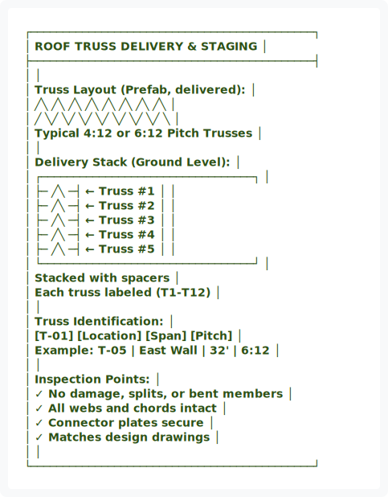
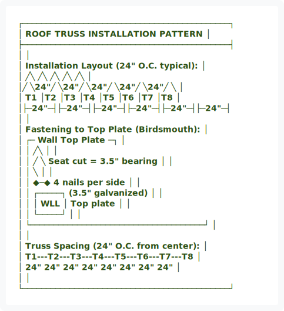
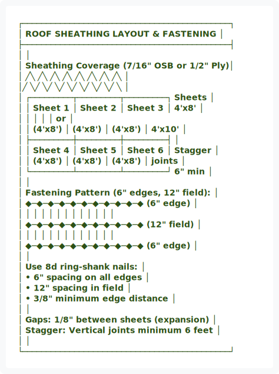
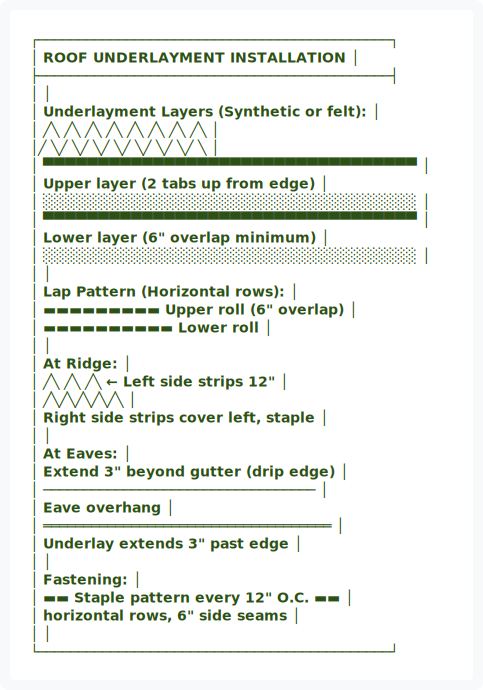
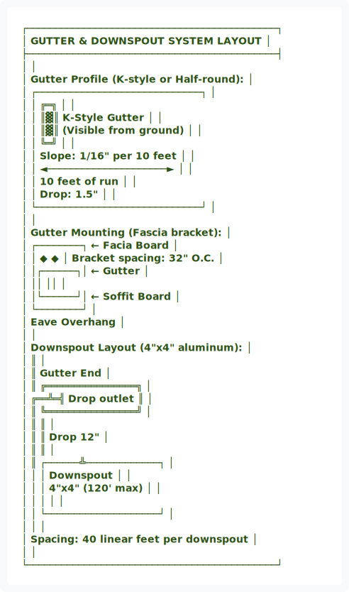
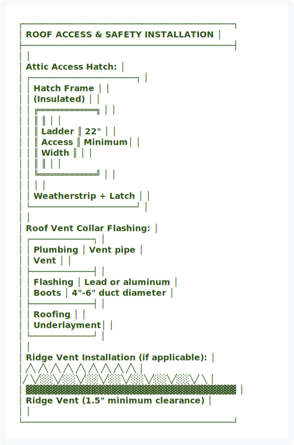
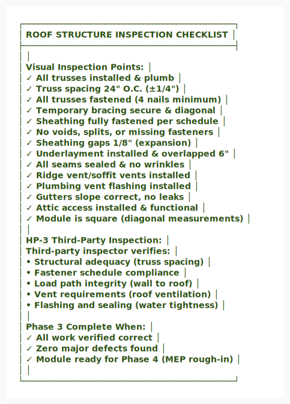

# WI-103: Roof Framing (Phase 3)

---

## Work Instruction Overview

**Phase:** 3 of 8  
**Duration:** 2-3 days per bay  
**Crew:** Roofing/Framing team (4-5 workers)  
**Hold Point:** HP-3 (Roof structure before sheathing)  
**Related SOP:** SOP-103-Roof-Ceiling-Framing.md

---

## Safety Callouts

⚠️ **CRITICAL SAFETY ITEMS:**
- Fall protection harness REQUIRED when working above 6 feet
- Hard hat and safety glasses at all times
- Roof walking: Use non-slip shoes, avoid working in wet conditions
- Steep slope work: Use safety lines and rope anchors
- Nail gun operation: Two-hand operation, keep body clear of discharge path
- Heavy truss handling: Use lifting equipment for spans >24 feet

---

## Step-by-Step Procedure

### Step 1: Roof Truss Delivery & Inspection


<div align="center">
  
</div>

<details>
<summary>View ASCII Source</summary>

```
┌────────────────────────────────────────────┐
│    ROOF TRUSS DELIVERY & STAGING            │
├────────────────────────────────────────────┤
│                                            │
│  Truss Layout (Prefab, delivered):         │
│  ╱╲  ╱╲  ╱╲  ╱╲  ╱╲  ╱╲  ╱╲  ╱╲          │
│ ╱  ╲╱  ╲╱  ╲╱  ╲╱  ╲╱  ╲╱  ╲╱  ╲         │
│ Typical 4:12 or 6:12 Pitch Trusses        │
│                                            │
│  Delivery Stack (Ground Level):            │
│  ┌─────────────────────────────────┐       │
│  ├─ ╱╲ ─┤ ← Truss #1              │       │
│  ├─ ╱╲ ─┤ ← Truss #2              │       │
│  ├─ ╱╲ ─┤ ← Truss #3              │       │
│  ├─ ╱╲ ─┤ ← Truss #4              │       │
│  ├─ ╱╲ ─┤ ← Truss #5              │       │
│  └─────────────────────────────────┘       │
│       Stacked with spacers                 │
│       Each truss labeled (T1-T12)          │
│                                            │
│  Truss Identification:                     │
│  [T-01] [Location] [Span] [Pitch]          │
│  Example: T-05 | East Wall | 32' | 6:12   │
│                                            │
│  Inspection Points:                        │
│  ✓ No damage, splits, or bent members     │
│  ✓ All webs and chords intact              │
│  ✓ Connector plates secure                 │
│  ✓ Matches design drawings                 │
│                                            │
└────────────────────────────────────────────┘
```
</details>


**Actions:**
1. Receive trusses from delivery (sign bill of lading)
2. Inspect all trusses for damage (report immediately if found)
3. Verify truss count matches bill of lading
4. Verify each truss matches design (span, pitch, type)
5. Document delivery condition with photos
6. Store trusses on blocks (not on ground), oriented for installation
7. Identify staging area for equipment and personnel access

**Quality Gate:** All trusses received, inspected, undamaged, staging area prepared, ready for installation.

---

### Step 2: Roof Truss Installation & Spacing


<div align="center">
  
</div>

<details>
<summary>View ASCII Source</summary>

```
┌────────────────────────────────────────────┐
│    ROOF TRUSS INSTALLATION PATTERN          │
├────────────────────────────────────────────┤
│                                            │
│  Installation Layout (24" O.C. typical):   │
│  ╱╲      ╱╲      ╱╲      ╱╲      ╱╲      │
│╱  ╲24"╱  ╲24"╱  ╲24"╱  ╲24"╱  ╲24"╱  ╲  │
│ T1  │T2  │T3  │T4  │T5  │T6  │T7  │T8   │
│├─24"─┤├─24"─┤├─24"─┤├─24"─┤├─24"─┤├─24"─┤
│                                            │
│  Fastening to Top Plate (Birdsmouth):      │
│  ┌─ Wall Top Plate                   ─┐   │
│  │  ╱╲                                 │   │
│  │ ╱  ╲ Seat cut = 3.5" bearing        │   │
│  │      ╲                              │   │
│  │    ◆─◆  4 nails per side            │   │
│  │ ┌─────┐  (3.5" galvanized)          │   │
│  │ │ WLL │  Top plate                  │   │
│  │ └─────┘                             │   │
│  └─────────────────────────────────────┘   │
│                                            │
│  Truss Spacing (24" O.C. from center):     │
│  T1---T2---T3---T4---T5---T6---T7---T8     │
│   24" 24"  24"  24"  24"  24"  24"  24"    │
│                                            │
└────────────────────────────────────────────┘
```
</details>


**Actions:**
1. Position first truss at wall end (check squareness with string)
2. Align top plates birdsmouth cut to bearing surface
3. Fasten truss with 4 galvanized 3.5" nails per side (toe-nail)
4. Position remaining trusses at 24" o.c. (measure from centerline)
5. Install temporary diagonal bracing (1x4 straps) between trusses
6. Verify spacing with tape measure every 3 trusses
7. Check that trusses are plumb in both directions

**Quality Gate:** All trusses installed at 24" o.c. (±1/4"), properly fastened, plumb in both directions, temporary bracing secure.

---

### Step 3: Roof Sheathing Installation


<div align="center">
  
</div>

<details>
<summary>View ASCII Source</summary>

```
┌────────────────────────────────────────────┐
│    ROOF SHEATHING LAYOUT & FASTENING       │
├────────────────────────────────────────────┤
│                                            │
│  Sheathing Coverage (7/16" OSB or 1/2" Ply)│
│  ╱╲  ╱╲  ╱╲  ╱╲  ╱╲  ╱╲  ╱╲  ╱╲          │
│╱  ╲╱  ╲╱  ╲╱  ╲╱  ╲╱  ╲╱  ╲╱  ╲          │
│ ┌─────────┬─────────┬─────────┐  Sheets  │
│ │ Sheet 1 │ Sheet 2 │ Sheet 3 │  4'x8'   │
│ │         │         │         │  or      │
│ │ (4'x8') │ (4'x8') │ (4'x8') │  4'x10'  │
│ ├─────────┼─────────┼─────────┤          │
│ │ Sheet 4 │ Sheet 5 │ Sheet 6 │  Stagger │
│ │ (4'x8') │ (4'x8') │ (4'x8') │  joints  │
│ └─────────┴─────────┴─────────┘  6" min  │
│                                            │
│  Fastening Pattern (6" edges, 12" field):  │
│  ◆─◆─◆─◆─◆─◆─◆─◆─◆─◆─◆ (6" edge)       │
│  │ │ │ │ │ │ │ │ │ │ │                   │
│  ◆─◆─◆─◆─◆─◆─◆─◆─◆─◆─◆ (12" field)     │
│  │ │ │ │ │ │ │ │ │ │ │                   │
│  ◆─◆─◆─◆─◆─◆─◆─◆─◆─◆─◆ (6" edge)       │
│                                            │
│  Use 8d ring-shank nails:                  │
│  • 6" spacing on all edges                 │
│  • 12" spacing in field                    │
│  • 3/8" minimum edge distance              │
│                                            │
│  Gaps: 1/8" between sheets (expansion)     │
│  Stagger: Vertical joints minimum 6 feet   │
│                                            │
└────────────────────────────────────────────┘
```
</details>


**Actions:**
1. Start at eave edge with full width sheet, working up slope
2. Position sheet with 1/8" gap at edges (leave ridge overhang 2")
3. Fasten with 8d ring-shank nails: 6" on edges, 12" in field
4. Continue up roof, staggering vertical joints minimum 6 feet
5. Trim sheathing flush at gable ends (after installation)
6. Install sheathing on all roof surfaces
7. Inspect for missed fasteners or voids

**Quality Gate:** Sheathing fully fastened per schedule, gaps correct (1/8"), vertical joints staggered, no voids or missed fasteners.

---

### Step 4: Roof Underlayment Installation


<div align="center">
  
</div>

<details>
<summary>View ASCII Source</summary>

```
┌────────────────────────────────────────────┐
│    ROOF UNDERLAYMENT INSTALLATION           │
├────────────────────────────────────────────┤
│                                            │
│  Underlayment Layers (Synthetic or felt):   │
│  ╱╲  ╱╲  ╱╲  ╱╲  ╱╲  ╱╲  ╱╲  ╱╲          │
│╱  ╲╱  ╲╱  ╲╱  ╲╱  ╲╱  ╲╱  ╲╱  ╲          │
│ ▀▀▀▀▀▀▀▀▀▀▀▀▀▀▀▀▀▀▀▀▀▀▀▀▀▀▀▀▀▀▀▀▀▀       │
│ Upper layer (2 tabs up from edge)          │
│ ░░░░░░░░░░░░░░░░░░░░░░░░░░░░░░░░░░       │
│ ▀▀▀▀▀▀▀▀▀▀▀▀▀▀▀▀▀▀▀▀▀▀▀▀▀▀▀▀▀▀▀▀▀▀       │
│ Lower layer (6" overlap minimum)           │
│ ░░░░░░░░░░░░░░░░░░░░░░░░░░░░░░░░░░       │
│                                            │
│  Lap Pattern (Horizontal rows):            │
│  ▬▬▬▬▬▬▬▬▬ Upper roll (6" overlap)       │
│   ▬▬▬▬▬▬▬▬▬▬ Lower roll                  │
│                                            │
│  At Ridge:                                 │
│  ╱╲  ╱╲  ╱╲  ← Left side strips 12"       │
│  ╱╲╱╲╱╲╱╲╱╲                              │
│  Right side strips cover left, staple      │
│                                            │
│  At Eaves:                                 │
│  Extend 3" beyond gutter (drip edge)       │
│  ──────────────────────────────────       │
│          Eave overhang                     │
│  ════════════════════════════════════     │
│  Underlay extends 3" past edge             │
│                                            │
│  Fastening:                                │
│  ▬▬ Staple pattern every 12" O.C. ▬▬      │
│  horizontal rows, 6" side seams            │
│                                            │
└────────────────────────────────────────────┘
```
</details>


**Actions:**
1. Start at eave with synthetic/felt underlayment
2. Roll out horizontally, keeping parallel to eave
3. Overlap lower layer 6" minimum (underlap upper sheet)
4. Staple every 12" o.c. in rows (2 staples per line)
5. At ridge, overlap left and right sides 12" minimum
6. Extend underlayment 3" beyond eave (to drip edge)
7. Seal all ridge and eave seams with compatible tape
8. Inspect for wrinkles and secure placement

**Quality Gate:** Underlayment fully installed with 6" laps, sealed at ridge, secured with staples, no wrinkles or gaps.

---

### Step 5: Gutter & Downspout Installation


<div align="center">
  
</div>

<details>
<summary>View ASCII Source</summary>

```
┌────────────────────────────────────────────┐
│    GUTTER & DOWNSPOUT SYSTEM LAYOUT         │
├────────────────────────────────────────────┤
│                                            │
│  Gutter Profile (K-style or Half-round):   │
│  ┌─────────────────────────────┐           │
│  │ ╔═╗                          │           │
│  │ ║▓║  K-Style Gutter          │           │
│  │ ║▓║  (Visible from ground)    │           │
│  │ ╚═╝                          │           │
│  │    Slope: 1/16" per 10 feet  │           │
│  │    ◄─────────────────────►   │           │
│  │    10 feet of run            │           │
│  │    Drop: 1.5"                │           │
│  └─────────────────────────────┘           │
│                                            │
│  Gutter Mounting (Fascia bracket):         │
│  ┌────────┐ ← Facia Board                  │
│  │ ◆  ◆   │ Bracket spacing: 32" O.C.      │
│  │┌──────┐│ ← Gutter                       │
│  ││      ││                                │
│  │└──────┘│ ← Soffit Board                 │
│  └────────┘                                │
│     Eave Overhang                          │
│                                            │
│  Downspout Layout (4"x4" aluminum):        │
│     ║                                      │
│     ║  Gutter End                          │
│     ║ ╔════════════════╗                   │
│  ╔══╩═╣ Drop outlet    ║                   │
│  ║   ╚════════════════╝                    │
│  ║         ║                               │
│  ║         ║  Drop 12"                     │
│  ║         ║                               │
│  ║  ┌──────╩─────────────┐                 │
│  │  │   Downspout        │                 │
│  │  │   4"x4" (120' max)  │                 │
│  │  │                    │                 │
│  │  └────────────────────┘                 │
│  │                                         │
│  Spacing: 40 linear feet per downspout     │
│                                            │
└────────────────────────────────────────────┘
```
</details>


**Actions:**
1. Install gutter brackets at 32" o.c. (start at high point)
2. Install gutter with 1/16" per 10-ft slope toward outlet
3. Install end caps and outlet (drop) pieces
4. Install downspout drop (below gutter level)
5. Install vertical downspout sections (minimum 4"x4" aluminum)
6. Install elbow at ground level (divert 4+ feet away from foundation)
7. Install guards/screens to prevent leaf clogging
8. Verify all connections are tight and no leaks

**Quality Gate:** Gutters sloped correctly (1/16" per 10 ft), downspouts properly sized, all connections sealed, water diverts away from foundation.

---

### Step 6: Roof Access & Safety Features


<div align="center">
  
</div>

<details>
<summary>View ASCII Source</summary>

```
┌────────────────────────────────────────────┐
│    ROOF ACCESS & SAFETY INSTALLATION        │
├────────────────────────────────────────────┤
│                                            │
│  Attic Access Hatch:                       │
│  ┌──────────────────────┐                  │
│  │  Hatch Frame          │                  │
│  │  (Insulated)          │                  │
│  │  ╔════════════╗        │                  │
│  │  ║            ║        │                  │
│  │  ║  Ladder    ║ 22"    │                  │
│  │  ║  Access    ║ Minimum│                  │
│  │  ║   Width    ║        │                  │
│  │  ║            ║        │                  │
│  │  ╚════════════╝        │                  │
│  │                        │                  │
│  │  Weatherstrip + Latch  │                  │
│  └──────────────────────┘                  │
│                                            │
│  Roof Vent Collar Flashing:                │
│     ┌─────────────┐                        │
│     │  Plumbing   │ Vent pipe              │
│     │   Vent      │                        │
│     ├─────────────┤                        │
│     │  Flashing   │ Lead or aluminum       │
│     │   Boots     │ 4"-6" duct diameter    │
│     ├─────────────┤                        │
│     │  Roofing    │                        │
│     │ Underlayment│                        │
│     └─────────────┘                        │
│                                            │
│  Ridge Vent Installation (if applicable):   │
│  ╱╲ ╱╲ ╱╲ ╱╲ ╱╲ ╱╲ ╱╲ ╱╲ ╱╲              │
│╱  ╲╱░░╲╱░░╲╱░░╲╱░░╲╱░░╲╱░░╲╱░░╲╱  ╲    │
│     ▓▓▓▓▓▓▓▓▓▓▓▓▓▓▓▓▓▓▓▓▓▓▓▓▓▓▓▓▓▓▓▓  │
│     Ridge Vent (1.5" minimum clearance)    │
│                                            │
└────────────────────────────────────────────┘
```
</details>


**Actions:**
1. Install attic access hatch opening (minimum 22" wide)
2. Install folding attic ladder with insulated hatch
3. Mark attic access location on module traveler
4. Install roof vent collar flashing for plumbing vents
5. Install ridge vent (if passive ventilation required)
6. Install soffit vents for air intake (match ridge vents)
7. Install safety railing (if OSHA required for slope >4:12)

**Quality Gate:** Attic access installed and functional, vent flashing sealed, ventilation strategy verified, ready for MEP rough-in (Phase 4).

---

### Step 7: Roof Inspection & HP-3 Completion


<div align="center">
  
</div>

<details>
<summary>View ASCII Source</summary>

```
┌────────────────────────────────────────────┐
│    ROOF STRUCTURE INSPECTION CHECKLIST      │
├────────────────────────────────────────────┤
│                                            │
│  Visual Inspection Points:                  │
│  ✓ All trusses installed & plumb            │
│  ✓ Truss spacing 24" O.C. (±1/4")           │
│  ✓ All trusses fastened (4 nails minimum)   │
│  ✓ Temporary bracing secure & diagonal      │
│  ✓ Sheathing fully fastened per schedule    │
│  ✓ No voids, splits, or missing fasteners   │
│  ✓ Sheathing gaps 1/8" (expansion)          │
│  ✓ Underlayment installed & overlapped 6"   │
│  ✓ All seams sealed & no wrinkles           │
│  ✓ Ridge vent/soffit vents installed        │
│  ✓ Plumbing vent flashing installed         │
│  ✓ Gutters slope correct, no leaks          │
│  ✓ Attic access installed & functional      │
│  ✓ Module is square (diagonal measurements) │
│                                            │
│  HP-3 Third-Party Inspection:               │
│  Third-party inspector verifies:            │
│  • Structural adequacy (truss spacing)      │
│  • Fastener schedule compliance             │
│  • Load path integrity (wall to roof)       │
│  • Vent requirements (roof ventilation)     │
│  • Flashing and sealing (water tightness)   │
│                                            │
│  Phase 3 Complete When:                     │
│  ✓ All work verified correct                │
│  ✓ Zero major defects found                 │
│  ✓ Module ready for Phase 4 (MEP rough-in)  │
│                                            │
└────────────────────────────────────────────┘
```
</details>


**Actions:**
1. Complete interior roof inspection (attic space)
2. Complete exterior roof inspection (from ladder)
3. Document all measurements with photos
4. Verify truss spacing with tape measure (every 3 trusses)
5. Verify sheathing fastener schedule (random sampling)
6. Verify underlayment laps and seals
7. Schedule third-party HP-3 inspection (CDOH-approved)
8. Ensure roof is clean and accessible for inspection

**Quality Gate:** All roof systems verified correct, HP-3 inspection scheduled, ready for MEP rough-in phase.

---

## Required Tools & Equipment

| Tool | Function | Required |
| :--- | :--- | :--- |
| Circular saw | Trim sheathing and gutters | Yes |
| Pneumatic nail gun | Install sheathing and brackets | Yes |
| Pneumatic stapler | Install underlayment | Yes |
| Tape measure (25-30') | Verify truss spacing and sheathing | Yes |
| Level (4-6 ft) | Check truss plumb | Yes |
| Chalk line | Mark sheathing and gutter slope | Yes |
| Roof brackets | Safety equipment for work above 6 ft | Yes |
| Caulk gun | Seal flashing and seams | Yes |
| Drill/driver | Install fasteners and brackets | Yes |
| Fall protection harness | Required for all roof work | Yes |

---

## Common Mistakes & How to Avoid

| Mistake | Impact | Prevention |
| :--- | :--- | :--- |
| Trusses not spaced 24" o.c. | Sheathing buckles, structural issue | Measure and verify every 3 trusses, snap lines |
| Insufficient sheathing fasteners | Sheathing separates in wind or load | Use fastener schedule: 6" edges, 12" field |
| Underlayment not overlapped 6" | Water infiltration, mold damage | Mark overlap lines on underlayment, check laps |
| Gutters sloped wrong | Water pools, ice damming in winter | Use 1/16" per 10 ft slope, use laser level |
| Vent flashing not sealed | Roof leaks, structural damage | Use compatible sealant and caulk all seams |
| Truss spacing not verified | Roof deflection, customer complaint | Measure spacing at multiple points, use laser |
| Temporary bracing not diagonal | Roof lateral instability, racking | Install at 45° angles, secure at both ends |

---

## Quality Checkpoints

**Before moving to Phase 4, verify:**
- [ ] All trusses installed at 24" o.c. (±1/4")
- [ ] All trusses plumb in both directions
- [ ] All trusses fastened with 4 nails minimum
- [ ] Temporary diagonal bracing installed (45° angles)
- [ ] Roof sheathing fully fastened per schedule (6" edges, 12" field)
- [ ] Sheathing gaps 1/8" for expansion
- [ ] Vertical sheathing joints staggered 6+ feet
- [ ] Underlayment fully installed with 6" laps
- [ ] All ridge and eave seams sealed
- [ ] Gutter slope correct (1/16" per 10 ft)
- [ ] All downspouts functional
- [ ] Plumbing/electrical vent flashing installed
- [ ] Ridge and soffit vents installed
- [ ] Attic access ladder installed
- [ ] HP-3 inspection passed with zero major NCRs
- [ ] All photos documented

---

## Next Phase

→ **Phase 4: MEP Rough-In** (WI-104)

After HP-3 inspection passes, MEP teams install electrical conduit, plumbing supply/drain, HVAC ducting, and gas lines in walls, attic, and crawl spaces.

---

**Document Status:** ✅ ACTIVE  
**Last Updated:** January 14, 2026  
**Review Date:** July 14, 2026
