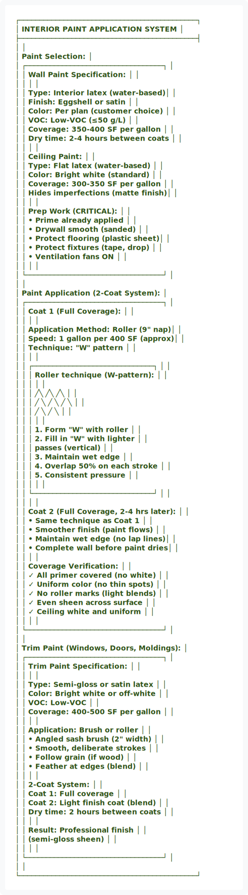
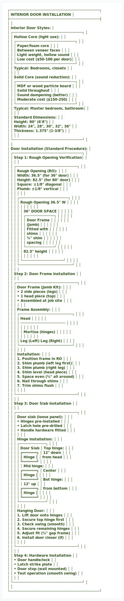
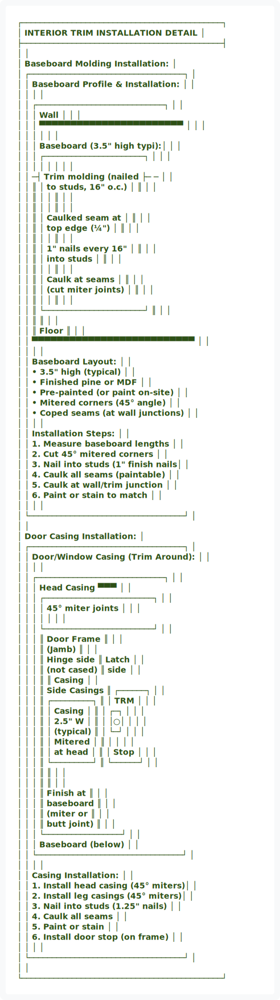
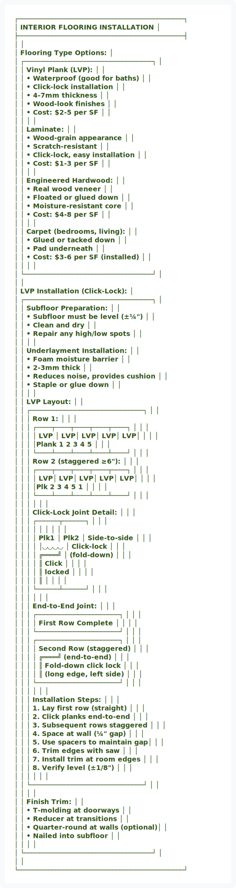
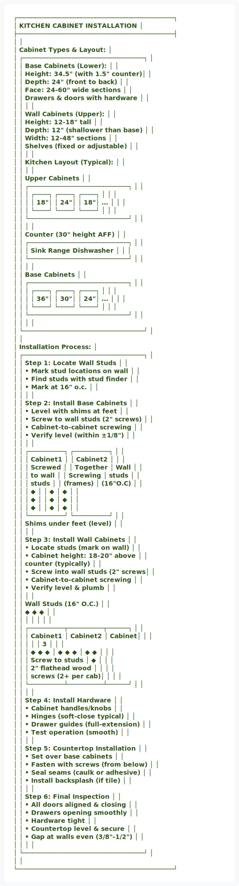
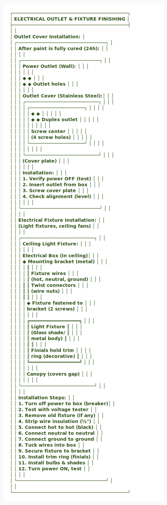

# WI-107: Interior Trim & Finish (Phase 7)

---

## Work Instruction Overview

**Phase:** 7 of 8  
**Duration:** 4-5 days per bay  
**Crew:** Finish carpentry team (3-4 carpenters, painters)  
**Hold Point:** HP-7 (Final interior fit-up before testing)  
**Related SOP:** SOP-017-Customer-Service-Support.md (finish standards)

---

## Safety Callouts

⚠️ **CRITICAL SAFETY ITEMS:**
- Paint/stain fumes: Ensure ventilation (open windows, fans)
- Chemical hazards: Wear gloves, safety glasses, respiratory protection if needed
- Tool safety: Nail guns, power saws, sanders require two-hand operation
- Ladder safety: Secure ladder on uneven surfaces (floor carpeting)
- Dust control: Mask required for sanding and nail gun dust
- Chemical sensitivity: Check paint VOC ratings (low-VOC preferred)
- Electrical outlets: De-energize before installing outlet covers

---

## Step-by-Step Procedure

### Step 1: Interior Paint Preparation & Application


<div align="center">
  
</div>

<details>
<summary>View ASCII Source</summary>

```
┌────────────────────────────────────────────┐
│    INTERIOR PAINT APPLICATION SYSTEM        │
├────────────────────────────────────────────┤
│                                            │
│  Paint Selection:                           │
│  ┌──────────────────────────────────┐      │
│  │ Wall Paint Specification:         │      │
│  │                                   │      │
│  │ Type: Interior latex (water-based)│      │
│  │ Finish: Eggshell or satin         │      │
│  │ Color: Per plan (customer choice) │      │
│  │ VOC: Low-VOC (≤50 g/L)            │      │
│  │ Coverage: 350-400 SF per gallon   │      │
│  │ Dry time: 2-4 hours between coats │      │
│  │                                   │      │
│  │ Ceiling Paint:                    │      │
│  │ Type: Flat latex (water-based)    │      │
│  │ Color: Bright white (standard)    │      │
│  │ Coverage: 300-350 SF per gallon   │      │
│  │ Hides imperfections (matte finish)│      │
│  │                                   │      │
│  │ Prep Work (CRITICAL):             │      │
│  │ • Prime already applied           │      │
│  │ • Drywall smooth (sanded)         │      │
│  │ • Protect flooring (plastic sheet)│      │
│  │ • Protect fixtures (tape, drop)   │      │
│  │ • Ventilation fans ON             │      │
│  │                                   │      │
│  └──────────────────────────────────┘      │
│                                            │
│  Paint Application (2-Coat System):         │
│  ┌──────────────────────────────────┐      │
│  │ Coat 1 (Full Coverage):            │      │
│  │                                   │      │
│  │ Application Method: Roller (9" nap)│     │
│  │ Speed: 1 gallon per 400 SF (approx)│     │
│  │ Technique: "W" pattern             │      │
│  │                                   │      │
│  │ ┌──────────────────────────────┐  │      │
│  │ │  Roller technique (W-pattern):   │      │
│  │ │                                 │      │
│  │ │        ╱╲   ╱╲   ╱╲             │      │
│  │ │       ╱  ╲ ╱  ╲ ╱  ╲            │      │
│  │ │      ╱    ╲    ╱    ╲           │      │
│  │ │                                 │      │
│  │ │  1. Form "W" with roller       │      │
│  │ │  2. Fill in "W" with lighter   │      │
│  │ │     passes (vertical)           │      │
│  │ │  3. Maintain wet edge           │      │
│  │ │  4. Overlap 50% on each stroke  │      │
│  │ │  5. Consistent pressure         │      │
│  │ │                                 │      │
│  │ └──────────────────────────────┘  │      │
│  │                                   │      │
│  │ Coat 2 (Full Coverage, 2-4 hrs later): │  │
│  │ • Same technique as Coat 1        │      │
│  │ • Smoother finish (paint flows)   │      │
│  │ • Maintain wet edge (no lap lines)│      │
│  │ • Complete wall before paint dries│      │
│  │                                   │      │
│  │ Coverage Verification:            │      │
│  │ ✓ All primer covered (no white)   │      │
│  │ ✓ Uniform color (no thin spots)   │      │
│  │ ✓ No roller marks (light blends)  │      │
│  │ ✓ Even sheen across surface       │      │
│  │ ✓ Ceiling white and uniform       │      │
│  │                                   │      │
│  └──────────────────────────────────┘      │
│                                            │
│  Trim Paint (Windows, Doors, Moldings):     │
│  ┌──────────────────────────────────┐      │
│  │ Trim Paint Specification:         │      │
│  │                                   │      │
│  │ Type: Semi-gloss or satin latex   │      │
│  │ Color: Bright white or off-white  │      │
│  │ VOC: Low-VOC                      │      │
│  │ Coverage: 400-500 SF per gallon   │      │
│  │                                   │      │
│  │ Application: Brush or roller      │      │
│  │ • Angled sash brush (2" width)    │      │
│  │ • Smooth, deliberate strokes      │      │
│  │ • Follow grain (if wood)          │      │
│  │ • Feather at edges (blend)        │      │
│  │                                   │      │
│  │ 2-Coat System:                    │      │
│  │ Coat 1: Full coverage             │      │
│  │ Coat 2: Light finish coat (blend) │      │
│  │ Dry time: 2 hours between coats   │      │
│  │                                   │      │
│  │ Result: Professional finish       │      │
│  │         (semi-gloss sheen)        │      │
│  │                                   │      │
│  └──────────────────────────────────┘      │
│                                            │
└────────────────────────────────────────────┘
```
</details>


**Actions:**
1. Verify all drywall is primed and ready for paint
2. Protect flooring with plastic sheeting
3. Protect fixtures with painter's tape and drop cloths
4. Ventilate space (open windows, run fans)
5. Select interior paint per specification (low-VOC latex)
6. Pour paint into tray with grid roller insert
7. Load roller (9" nap) and apply Coat 1 using "W" pattern
8. Maintain wet edge, overlap passes, complete wall before drying
9. Allow 2-4 hours drying, then apply Coat 2
10. Use 2-4" angled brush for trim (windows, doors)
11. Apply 2 coats of trim paint (semi-gloss or satin)
12. Inspect for uniform coverage and color match
13. Allow 24 hours curing before installing outlet covers

**Quality Gate:** Paint applied uniformly (2 coats), all primer covered, no roller marks, trim paint glossy and smooth, ready for trim installation.

---

### Step 2: Interior Door Installation


<div align="center">
  
</div>

<details>
<summary>View ASCII Source</summary>

```
┌────────────────────────────────────────────┐
│    INTERIOR DOOR INSTALLATION               │
├────────────────────────────────────────────┤
│                                            │
│  Interior Door Styles:                      │
│  ┌──────────────────────────────────┐      │
│  │ Hollow Core (light use):          │      │
│  │ ┌─────────────────────────────┐   │      │
│  │ │  Paper/foam core            │   │      │
│  │ │  Between veneer faces       │   │      │
│  │ │  Light weight, hollow sound │   │      │
│  │ │  Low cost ($50-100 per door)│   │      │
│  │ └─────────────────────────────┘   │      │
│  │  Typical: Bedrooms, closets      │      │
│  │                                   │      │
│  │ Solid Core (sound reduction):     │      │
│  │ ┌─────────────────────────────┐   │      │
│  │ │  MDF or wood particle board │   │      │
│  │ │  Solid throughout           │   │      │
│  │ │  Sound dampening (better)   │   │      │
│  │ │  Moderate cost ($150-250)   │   │      │
│  │ └─────────────────────────────┘   │      │
│  │  Typical: Master bedroom, bathroom│      │
│  │                                   │      │
│  │ Standard Dimensions:              │      │
│  │ Height: 80" (6'8")               │      │
│  │ Width: 24", 28", 30", 32", 36"   │      │
│  │ Thickness: 1.375" (1-3/8")       │      │
│  │                                   │      │
│  └──────────────────────────────────┘      │
│                                            │
│  Door Installation (Standard Procedure):    │
│  ┌──────────────────────────────────┐      │
│  │ Step 1: Rough Opening Verification│      │
│  │                                   │      │
│  │ ┌──────────────────────────────┐  │      │
│  │ │  Rough Opening (RO):          │  │      │
│  │ │  Width: 36.5" (for 36" door)  │  │      │
│  │ │  Height: 82.5" (for 80" door) │  │      │
│  │ │  Square: ±1/8" diagonal       │  │      │
│  │ │  Plumb: ±1/8" vertical        │  │      │
│  │ │                               │  │      │
│  │ │  ┌────────────────────────┐   │  │      │
│  │ │  │ Rough Opening 36.5" W  │   │  │      │
│  │ │  │ │                    │ │   │  │      │
│  │ │  │ │    36" DOOR SPACE  │ │   │  │      │
│  │ │  │ │  ┌──────────────┐  │ │   │  │      │
│  │ │  │ │  │  Door Frame  │  │ │   │  │      │
│  │ │  │ │  │  (Jamb)      │  │ │   │  │      │
│  │ │  │ │  │  Fitted with │  │ │   │  │      │
│  │ │  │ │  │  shims       │  │ │   │  │      │
│  │ │  │ │  │  ¼" shim     │  │ │   │  │      │
│  │ │  │ │  │  spacing     │  │ │   │  │      │
│  │ │  │ │  └──────────────┘  │ │   │  │      │
│  │ │  │ │    82.5" height    │ │   │  │      │
│  │ │  │ │                    │ │   │  │      │
│  │ │  │ └────────────────────┘ │   │  │      │
│  │ │  └──────────────────────────┘   │      │
│  │                                   │      │
│  │ Step 2: Door Frame Installation    │      │
│  │                                   │      │
│  │ ┌──────────────────────────────┐  │      │
│  │ │ Door Frame (Jamb Kit):        │  │      │
│  │ │  • 2 side pieces (legs)       │  │      │
│  │ │  • 1 head piece (top)         │  │      │
│  │ │  • Assembled at job site      │  │      │
│  │ │                               │  │      │
│  │ │ Frame Assembly:               │  │      │
│  │ │  ┌──────────────────────────┐ │  │      │
│  │ │  │ Head                  │   │ │  │      │
│  │ │  │ ──────────────────────    │ │  │      │
│  │ │  │ │                      │  │ │  │      │
│  │ │  │ │ Mortise (hinges)     │  │ │  │      │
│  │ │  │ │                      │  │ │  │      │
│  │ │  │ Leg (Left)  Leg (Right) │ │  │      │
│  │ │  └──────────────────────────┘ │  │      │
│  │ │                               │  │      │
│  │ │ Installation:                 │  │      │
│  │ │ 1. Position frame in RO       │  │      │
│  │ │ 2. Shim plumb (left leg first)│  │      │
│  │ │ 3. Shim plumb (right leg)     │  │      │
│  │ │ 4. Shim level (head piece)    │  │      │
│  │ │ 5. Space even (¼" all around) │  │      │
│  │ │ 6. Nail through shims         │  │      │
│  │ │ 7. Trim shims flush           │  │      │
│  │ │                               │  │      │
│  │ └──────────────────────────────┘  │      │
│  │                                   │      │
│  │ Step 3: Door Slab Installation     │      │
│  │                                   │      │
│  │ ┌──────────────────────────────┐  │      │
│  │ │ Door slab (loose panel):      │  │      │
│  │ │ • Hinges pre-installed        │  │      │
│  │ │ • Latch hole pre-drilled      │  │      │
│  │ │ • Handle hardware fitted      │  │      │
│  │ │                               │  │      │
│  │ │ Hinge Installation:           │  │      │
│  │ │   ┌─────────────┐             │  │      │
│  │ │   │ Door Slab   │ Top hinge:  │  │      │
│  │ │   │ ╔═══════╗   │ 12" down    │  │      │
│  │ │   │ ║ Hinge ║   │ from head   │  │      │
│  │ │   │ ╚═══════╝   │             │  │      │
│  │ │   │             │ Mid hinge:  │  │      │
│  │ │   │ ╔═══════╗   │ Center      │  │      │
│  │ │   │ ║ Hinge ║   │             │  │      │
│  │ │   │ ╚═══════╝   │ Bot hinge:  │  │      │
│  │ │   │             │ 12" up      │  │      │
│  │ │   │ ╔═══════╗   │ from bottom │  │      │
│  │ │   │ ║ Hinge ║   │             │  │      │
│  │ │   │ ╚═══════╝   │             │  │      │
│  │ │   └─────────────┘             │  │      │
│  │ │                               │  │      │
│  │ │ Hanging Door:                 │  │      │
│  │ │ 1. Lift door onto hinges      │  │      │
│  │ │ 2. Secure top hinge first     │  │      │
│  │ │ 3. Check swing (smooth)       │  │      │
│  │ │ 4. Secure remaining hinges    │  │      │
│  │ │ 5. Adjust fit (¼" gap frame)  │  │      │
│  │ │ 6. Install door closer (if)   │  │      │
│  │ │                               │  │      │
│  │ └──────────────────────────────┘  │      │
│  │                                   │      │
│  │ Step 4: Hardware Installation      │      │
│  │ • Door handle/lock               │      │
│  │ • Latch strike plate             │      │
│  │ • Door stop (wall mounted)        │      │
│  │ • Test operation (smooth swing)   │      │
│  │                                   │      │
│  └──────────────────────────────────┘      │
│                                            │
└────────────────────────────────────────────┘
```
</details>


**Actions:**
1. Verify rough opening is correct (per schedule ±1/8")
2. Measure and confirm door frame (jamb kit) is square
3. Position door frame in rough opening
4. Shim left leg plumb (3 shims: top, middle, bottom)
5. Shim right leg plumb (same positioning)
6. Shim head level (verify with level)
7. Verify even ¼" spacing all around (use spacers)
8. Nail through shims to studs (2 per shim location)
9. Trim shims flush with frame
10. Set door slab (hinges pre-installed, pre-drilled)
11. Hang door on hinges, test swing (smooth operation)
12. Adjust hinges for proper fit (¼" gap frame on all sides)
13. Install door handle, lock, latch plate
14. Test lock operation

**Quality Gate:** All doors hung plumb, level, square (±1/8"), smooth swing operation, all hardware functional, ready for finishing.

---

### Step 3: Interior Trim Installation (Baseboards, Casing)


<div align="center">
  
</div>

<details>
<summary>View ASCII Source</summary>

```
┌────────────────────────────────────────────┐
│    INTERIOR TRIM INSTALLATION DETAIL        │
├────────────────────────────────────────────┤
│                                            │
│  Baseboard Molding Installation:            │
│  ┌──────────────────────────────────┐      │
│  │ Baseboard Profile & Installation:  │      │
│  │                                   │      │
│  │ ┌────────────────────────────┐    │      │
│  │ │ Wall                        │    │      │
│  │ │ ▀▀▀▀▀▀▀▀▀▀▀▀▀▀▀▀▀▀▀▀▀▀▀  │    │      │
│  │ │                            │    │      │
│  │ │ Baseboard (3.5" high typi):│    │      │
│  │ │  ┌──────────────────────┐  │    │      │
│  │ │  │                      │  │    │      │
│  │  ─┤ Trim molding (nailed  ├─ ─    │      │
│  │  ║ │ to studs, 16" o.c.)  │ ║    │      │
│  │  ║ │                      │ ║    │      │
│  │  ║ │                      │ ║    │      │
│  │  ║ │   Caulked seam at    │ ║    │      │
│  │  ║ │   top edge (¼")      │ ║    │      │
│  │  ║ │                      │ ║    │      │
│  │  ║ │ 1" nails every 16"   │ ║    │      │
│  │  ║ │ into studs           │ ║    │      │
│  │  ║ │                      │ ║    │      │
│  │  ║ │ Caulk at seams       │ ║    │      │
│  │  ║ │ (cut miter joints)   │ ║    │      │
│  │  ║ │                      │ ║    │      │
│  │  ║ └──────────────────────┘ ║    │      │
│  │  ║                          ║    │      │
│  │  ║ Floor                    ║    │      │
│  │  ▀▀▀▀▀▀▀▀▀▀▀▀▀▀▀▀▀▀▀▀▀▀▀▀▀▀    │      │
│  │                                   │      │
│  │ Baseboard Layout:                 │      │
│  │ • 3.5" high (typical)             │      │
│  │ • Finished pine or MDF            │      │
│  │ • Pre-painted (or paint on-site)  │      │
│  │ • Mitered corners (45° angle)     │      │
│  │ • Coped seams (at wall junctions) │      │
│  │                                   │      │
│  │ Installation Steps:               │      │
│  │ 1. Measure baseboard lengths      │      │
│  │ 2. Cut 45° mitered corners        │      │
│  │ 3. Nail into studs (1" finish nails│     │
│  │ 4. Caulk all seams (paintable)    │      │
│  │ 5. Caulk at wall/trim junction    │      │
│  │ 6. Paint or stain to match        │      │
│  │                                   │      │
│  └──────────────────────────────────┘      │
│                                            │
│  Door Casing Installation:                  │
│  ┌──────────────────────────────────┐      │
│  │ Door/Window Casing (Trim Around):  │      │
│  │                                   │      │
│  │  ┌────────────────────────────┐   │      │
│  │  │ Head Casing              ▀▀▀  │      │
│  │  │ ┌────────────────────────┐    │      │
│  │  │ │  45° miter joints      │    │      │
│  │  │ │                        │    │      │
│  │  │ └────────────────────────┘    │      │
│  │  │ ║    Door Frame    ║           │      │
│  │  │ ║    (Jamb)        ║           │      │
│  │  │ ║    Hinge side    ║ Latch    │      │
│  │  │ ║    (not cased)   ║ side     │      │
│  │  │ ║                  ║ Casing   │      │
│  │  │ ║ Side Casings     ║ ┌──────┐ │      │
│  │  │ ║ ┌─────────┐      ║ │  TRM │ │      │
│  │  │ ║ │ Casing  │      ║ │  ┌─┐ │ │      │
│  │  │ ║ │ 2.5" W  │      ║ │  │○│ │ │      │
│  │  │ ║ │ (typical)       ║ │  └─┘ │ │      │
│  │  │ ║ │ Mitered │      ║ │      │ │      │
│  │  │ ║ │ at head │      ║ │ Stop │ │      │
│  │  │ ║ └─────────┘      ║ └──────┘ │      │
│  │  │ ║                  ║           │      │
│  │  │ ║                  ║           │      │
│  │  │ ║    Finish at     ║           │      │
│  │  │ ║    baseboard     ║           │      │
│  │  │ ║    (miter or     ║           │      │
│  │  │ ║    butt joint)   ║           │      │
│  │  │ └─────────────────┘           │      │
│  │  │ Baseboard (below)              │      │
│  │  └────────────────────────────────┘      │
│  │                                   │      │
│  │ Casing Installation:              │      │
│  │ 1. Install head casing (45° miters)│     │
│  │ 2. Install leg casings (45° miters)│     │
│  │ 3. Nail into studs (1.25" nails)  │      │
│  │ 4. Caulk all seams                │      │
│  │ 5. Paint or stain                 │      │
│  │ 6. Install door stop (on frame)   │      │
│  │                                   │      │
│  └──────────────────────────────────┘      │
│                                            │
└────────────────────────────────────────────┘
```
</details>


**Actions:**
1. Measure and cut baseboard lengths (mitered corners 45°)
2. Install baseboard along all walls (nail into studs, 16" o.c.)
3. Caulk seams and wall junction (paintable caulk)
4. Measure and cut door/window casing (mitered head & legs)
5. Install head casing above door frame
6. Install leg casings on each side of door frame
7. Nail all casing into studs (1.25" finish nails)
8. Caulk all miter joints and exterior edges
9. Install door stops on frame (magnetic or catch)
10. Paint or stain all trim per color scheme
11. Inspect all joints are flush and caulked

**Quality Gate:** All baseboards and casings installed, mitered joints tight, caulked and painted, ready for floor installation.

---

### Step 4: Flooring Installation (if applicable)


<div align="center">
  
</div>

<details>
<summary>View ASCII Source</summary>

```
┌────────────────────────────────────────────┐
│    INTERIOR FLOORING INSTALLATION           │
├────────────────────────────────────────────┤
│                                            │
│  Flooring Type Options:                     │
│  ┌──────────────────────────────────┐      │
│  │ Vinyl Plank (LVP):                │      │
│  │ • Waterproof (good for baths)     │      │
│  │ • Click-lock installation         │      │
│  │ • 4-7mm thickness                │      │
│  │ • Wood-look finishes              │      │
│  │ • Cost: $2-5 per SF               │      │
│  │                                   │      │
│  │ Laminate:                         │      │
│  │ • Wood-grain appearance           │      │
│  │ • Scratch-resistant               │      │
│  │ • Click-lock, easy installation   │      │
│  │ • Cost: $1-3 per SF               │      │
│  │                                   │      │
│  │ Engineered Hardwood:              │      │
│  │ • Real wood veneer                │      │
│  │ • Floated or glued down           │      │
│  │ • Moisture-resistant core         │      │
│  │ • Cost: $4-8 per SF               │      │
│  │                                   │      │
│  │ Carpet (bedrooms, living):        │      │
│  │ • Glued or tacked down            │      │
│  │ • Pad underneath                  │      │
│  │ • Cost: $3-6 per SF (installed)   │      │
│  │                                   │      │
│  └──────────────────────────────────┘      │
│                                            │
│  LVP Installation (Click-Lock):             │
│  ┌──────────────────────────────────┐      │
│  │ Subfloor Preparation:             │      │
│  │ • Subfloor must be level (±¼")    │      │
│  │ • Clean and dry                   │      │
│  │ • Repair any high/low spots       │      │
│  │                                   │      │
│  │ Underlayment Installation:        │      │
│  │ • Foam moisture barrier           │      │
│  │ • 2-3mm thick                     │      │
│  │ • Reduces noise, provides cushion │      │
│  │ • Staple or glue down             │      │
│  │                                   │      │
│  │ LVP Layout:                       │      │
│  │ ┌──────────────────────────────┐  │      │
│  │ │ Row 1:                        │  │      │
│  │ │ ┌────┬────┬────┬────┬────┐   │  │      │
│  │ │ │ LVP │ LVP│ LVP│ LVP│ LVP│   │  │      │
│  │ │ │Plank 1    2    3    4    5   │  │      │
│  │ │ └────┴────┴────┴────┴────┘   │  │      │
│  │ │ Row 2 (staggered ≥6"):        │  │      │
│  │ │ ┌────┬────┬────┬────┬────┐   │  │      │
│  │ │ │ LVP│ LVP│ LVP│ LVP│ LVP│   │  │      │
│  │ │ │Plk 2 3    4    5    1   │  │  │      │
│  │ │ └────┴────┴────┴────┴────┘   │  │      │
│  │ │                               │  │      │
│  │ │ Click-Lock Joint Detail:       │  │      │
│  │ │ ┌──────┬──────┐               │  │      │
│  │ │ │      │      │               │  │      │
│  │ │ │ Plk1 │ Plk2 │ Side-to-side  │  │      │
│  │ │ │      │◡◡◡◡ │ Click-lock    │  │      │
│  │ │ │ ╔════╝      │ (fold-down)   │  │      │
│  │ │ │ ║   Click   │               │  │      │
│  │ │ │ ║   locked  │               │  │      │
│  │ │ │ ║           │               │  │      │
│  │ │ └──────┴──────┘               │  │      │
│  │ │                               │  │      │
│  │ │ End-to-End Joint:             │  │      │
│  │ │ ┌──────────────────────┐      │  │      │
│  │ │ │ First Row Complete   │      │  │      │
│  │ │ └──────────────────────┘      │  │      │
│  │ │  ┌──────────────────────┐     │  │      │
│  │ │  │ Second Row (staggered)      │  │      │
│  │ │  │ ╔════╝ (end-to-end)        │  │      │
│  │ │  │ ║ Fold-down click lock     │  │      │
│  │ │  │ ║ (long edge, left side)   │  │      │
│  │ │  └──────────────────────┘     │  │      │
│  │ │                               │  │      │
│  │ │ Installation Steps:           │  │      │
│  │ │ 1. Lay first row (straight)   │  │      │
│  │ │ 2. Click planks end-to-end    │  │      │
│  │ │ 3. Subsequent rows staggered  │  │      │
│  │ │ 4. Space at wall (¼" gap)     │  │      │
│  │ │ 5. Use spacers to maintain gap│  │      │
│  │ │ 6. Trim edges with saw        │  │      │
│  │ │ 7. Install trim at room edges │  │      │
│  │ │ 8. Verify level (±1/8")       │  │      │
│  │ │                               │  │      │
│  │ └──────────────────────────────┘  │      │
│  │                                   │      │
│  │ Finish Trim:                      │      │
│  │ • T-molding at doorways           │      │
│  │ • Reducer at transitions          │      │
│  │ • Quarter-round at walls (optional)│     │
│  │ • Nailed into subfloor            │      │
│  │                                   │      │
│  └──────────────────────────────────┘      │
│                                            │
└────────────────────────────────────────────┘
```
</details>


**Actions:**
1. Prepare subfloor (clean, level ±¼", dry)
2. Install underlayment (foam moisture barrier, stapled or glued)
3. Layout flooring plan (stagger joints 6"+ minimum)
4. Install first row straight along long wall
5. Click planks end-to-end with fold-down lock
6. Maintain ¼" gap from wall (use spacers)
7. Install subsequent rows staggered (offset ≥6")
8. Continue until all interior areas floored
9. Trim final row to fit (rip-cut if needed)
10. Install finish trim (T-molding, reducers, quarter-round)
11. Verify level and even transitions

**Quality Gate:** All flooring installed, planks clicked together securely, level (±1/8"), ¼" wall gap maintained, finish trim installed.

---

### Step 5: Cabinetry Installation (if applicable)


<div align="center">
  
</div>

<details>
<summary>View ASCII Source</summary>

```
┌────────────────────────────────────────────┐
│    KITCHEN CABINET INSTALLATION             │
├────────────────────────────────────────────┤
│                                            │
│  Cabinet Types & Layout:                    │
│  ┌──────────────────────────────────┐      │
│  │ Base Cabinets (Lower):            │      │
│  │ Height: 34.5" (with 1.5" counter)│      │
│  │ Depth: 24" (front to back)        │      │
│  │ Face: 24-60" wide sections        │      │
│  │ Drawers & doors with hardware     │      │
│  │                                   │      │
│  │ Wall Cabinets (Upper):            │      │
│  │ Height: 12-18" tall               │      │
│  │ Depth: 12" (shallower than base)  │      │
│  │ Width: 12-48" sections            │      │
│  │ Shelves (fixed or adjustable)     │      │
│  │                                   │      │
│  │ Kitchen Layout (Typical):         │      │
│  │                                   │      │
│  │    Upper Cabinets                 │      │
│  │   ┌────────────────────────────┐  │      │
│  │   │  ┌────┐ ┌────┐ ┌────┐     │  │      │
│  │   │  │ 18"│ │ 24"│ │ 18"│ ... │  │      │
│  │   │  └────┘ └────┘ └────┘     │  │      │
│  │   └────────────────────────────┘  │      │
│  │                                   │      │
│  │    Counter (30" height AFF)       │      │
│  │   ┌────────────────────────────┐  │      │
│  │   │  Sink   Range   Dishwasher │  │      │
│  │   └────────────────────────────┘  │      │
│  │                                   │      │
│  │   Base Cabinets                   │      │
│  │   ┌────────────────────────────┐  │      │
│  │   │  ┌────┐ ┌────┐ ┌────┐     │  │      │
│  │   │  │ 36"│ │ 30"│ │ 24"│ ... │  │      │
│  │   │  └────┘ └────┘ └────┘     │  │      │
│  │   └────────────────────────────┘  │      │
│  │                                   │      │
│  └──────────────────────────────────┘      │
│                                            │
│  Installation Process:                      │
│  ┌──────────────────────────────────┐      │
│  │ Step 1: Locate Wall Studs         │      │
│  │ • Mark stud locations on wall     │      │
│  │ • Find studs with stud finder     │      │
│  │ • Mark at 16" o.c.               │      │
│  │                                   │      │
│  │ Step 2: Install Base Cabinets     │      │
│  │ • Level with shims at feet        │      │
│  │ • Screw to wall studs (2" screws) │      │
│  │ • Cabinet-to-cabinet screwing     │      │
│  │ • Verify level (within ±1/8")     │      │
│  │                                   │      │
│  │  ┌──────────┐ ┌──────────┐        │      │
│  │  │ Cabinet1 │ │ Cabinet2 │        │      │
│  │  │ Screwed  │ │ Together │ Wall   │      │
│  │  │ to wall  │ │ Screwing │ studs  │      │
│  │  │ studs    │ │ (frames) │ (16"O.C)     │      │
│  │  │ ◆        │ │ ◆        │ ◆      │      │
│  │  │ ◆        │ │ ◆        │ ◆      │      │
│  │  │ ◆        │ │ ◆        │ ◆      │      │
│  │  └──────────┘ └──────────┘        │      │
│  │  Shims under feet (level)         │      │
│  │                                   │      │
│  │ Step 3: Install Wall Cabinets     │      │
│  │ • Locate studs (mark on wall)     │      │
│  │ • Cabinet height: 18-20" above    │      │
│  │   counter (typically)             │      │
│  │ • Screw into wall studs (2" screws│      │
│  │ • Cabinet-to-cabinet screwing     │      │
│  │ • Verify level & plumb            │      │
│  │                                   │      │
│  │  Wall Studs (16" O.C.)            │      │
│  │  ◆          ◆          ◆          │      │
│  │  │          │          │          │      │
│  │  ┌──────────┬──────────┬──────┐   │      │
│  │  │ Cabinet1 │ Cabinet2 │ Cabinet│  │      │
│  │  │          │          │    3  │  │      │
│  │  │ ◆  ◆  ◆ │ ◆  ◆  ◆ │ ◆ ◆   │  │      │
│  │  │ Screw to studs     │ ◆     │  │      │
│  │  │ 2" flathead wood   │       │  │      │
│  │  │ screws (2+ per cab)│       │  │      │
│  │  └──────────┴──────────┴──────┘   │      │
│  │                                   │      │
│  │ Step 4: Install Hardware           │      │
│  │ • Cabinet handles/knobs            │      │
│  │ • Hinges (soft-close typical)      │      │
│  │ • Drawer guides (full-extension)   │      │
│  │ • Test operation (smooth)          │      │
│  │                                   │      │
│  │ Step 5: Countertop Installation    │      │
│  │ • Set over base cabinets           │      │
│  │ • Fasten with screws (from below)  │      │
│  │ • Seal seams (caulk or adhesive)   │      │
│  │ • Install backsplash (if tile)     │      │
│  │                                   │      │
│  │ Step 6: Final Inspection           │      │
│  │ • All doors aligned & closing      │      │
│  │ • Drawers opening smoothly         │      │
│  │ • Hardware tight                   │      │
│  │ • Countertop level & secure        │      │
│  │ • Gap at walls even (3/8"-1/2")    │      │
│  │                                   │      │
│  └──────────────────────────────────┘      │
│                                            │
└────────────────────────────────────────────┘
```
</details>


**Actions:**
1. Locate wall studs with stud finder (mark at 16" o.c.)
2. Install base cabinets first (shim level, screw to studs)
3. Screw base cabinets together (frames)
4. Verify level (within ±1/8") and square
5. Install wall cabinets (18-20" above counter typical)
6. Screw wall cabinets to studs (multiple fasteners per cabinet)
7. Screw wall cabinets together (frames)
8. Install cabinet hardware (handles, hinges, guides)
9. Test all drawers and doors (smooth operation)
10. Install countertop over base cabinets
11. Install backsplash (if tile or similar)
12. Final inspection (all aligned, level, functional)

**Quality Gate:** All cabinetry installed level and plumb (±1/8"), all hardware functional, doors/drawers aligned and smooth, countertops secure.

---

### Step 6: Outlet Covers & Electrical Fixture Installation


<div align="center">
  
</div>

<details>
<summary>View ASCII Source</summary>

```
┌────────────────────────────────────────────┐
│    ELECTRICAL OUTLET & FIXTURE FINISHING    │
├────────────────────────────────────────────┤
│                                            │
│  Outlet Cover Installation:                 │
│  ┌──────────────────────────────────┐      │
│  │ After paint is fully cured (24h):  │      │
│  │                                   │      │
│  │ ┌──────────────────────────────┐  │      │
│  │ │ Power Outlet (Wall):           │  │      │
│  │ │                                │  │      │
│  │ │   ◆ ◆                          │  │      │
│  │ │   ◆ ◆  Outlet holes            │  │      │
│  │ │                                │  │      │
│  │ │ Outlet Cover (Stainless Steel):│  │      │
│  │ │ ┌────────────────────────────┐ │  │      │
│  │ │ │  ┌─────────────────────┐   │ │  │      │
│  │ │ │  │ ◆  ◆               │   │ │  │      │
│  │ │ │  │ ◆  ◆ Duplex outlet │   │ │  │      │
│  │ │ │  │                   │   │ │  │      │
│  │ │ │  │ Screw center      │   │ │  │      │
│  │ │ │  │ (4 screw holes)   │   │ │  │      │
│  │ │ │  └─────────────────────┘   │ │  │      │
│  │ │ │                            │ │  │      │
│  │ │ └────────────────────────────┘ │  │      │
│  │ │  (Cover plate)                  │  │      │
│  │ │                                │  │      │
│  │ │ Installation:                  │  │      │
│  │ │ 1. Verify power OFF (test)     │  │      │
│  │ │ 2. Insert outlet from box      │  │      │
│  │ │ 3. Screw cover plate           │  │      │
│  │ │ 4. Check alignment (level)     │  │      │
│  │ │                                │  │      │
│  │ └──────────────────────────────┘  │      │
│  │                                   │      │
│  │ Electrical Fixture Installation:   │      │
│  │ (Light fixtures, ceiling fans)     │      │
│  │                                   │      │
│  │ ┌────────────────────────────┐    │      │
│  │ │ Ceiling Light Fixture:      │    │      │
│  │ │                             │    │      │
│  │ │  Electrical Box (in ceiling)│    │      │
│  │ │  ◆ Mounting bracket (metal) │    │      │
│  │ │  │ ║                        │    │      │
│  │ │  │ ║ Fixture wires          │    │      │
│  │ │  │ ║ (hot, neutral, ground) │    │      │
│  │ │  ║ ║ Twist connectors       │    │      │
│  │ │  ║ ║ (wire nuts)            │    │      │
│  │ │  ║ ║                        │    │      │
│  │ │  │ ◆ Fixture fastened to    │    │      │
│  │ │  │   bracket (2 screws)     │    │      │
│  │ │  │                          │    │      │
│  │ │  │  ╔═══════════════════╗  │    │      │
│  │ │  │  ║  Light Fixture    ║  │    │      │
│  │ │  │  ║  (Glass shade/     ║  │    │      │
│  │ │  │  ║   metal body)      ║  │    │      │
│  │ │  │  ║                    ║  │    │      │
│  │ │  │  ║  Finials hold trim │  │    │      │
│  │ │  │  ║  ring (decorative) ║  │    │      │
│  │ │  │  ╚═══════════════════╝  │    │      │
│  │ │  │                          │    │      │
│  │ │  │ Canopy (covers gap)      │    │      │
│  │ │  │                          │    │      │
│  │ └────────────────────────────┘    │      │
│  │                                   │      │
│  │ Installation Steps:               │      │
│  │ 1. Turn off power to box (breaker)│      │
│  │ 2. Test with voltage tester       │      │
│  │ 3. Remove old fixture (if any)    │      │
│  │ 4. Strip wire insulation (½")     │      │
│  │ 5. Connect hot to hot (black)     │      │
│  │ 6. Connect neutral to neutral     │      │
│  │ 7. Connect ground to ground       │      │
│  │ 8. Tuck wires into box            │      │
│  │ 9. Secure fixture to bracket      │      │
│  │ 10. Install trim ring (finials)   │      │
│  │ 11. Install bulbs & shades        │      │
│  │ 12. Turn power ON, test           │      │
│  │                                   │      │
│  └──────────────────────────────────┘      │
│                                            │
└────────────────────────────────────────────┘
```
</details>


**Actions:**
1. Wait 24+ hours for paint to fully cure
2. Verify all electrical systems are functional (no outstanding issues)
3. Turn off power to each outlet circuit (verify with voltage tester)
4. Install outlet covers on all outlets (duplex, singles, switches)
5. Verify outlet covers are level and aligned
6. Install light fixtures (ceiling, wall sconces)
7. Connect fixture wires (hot, neutral, ground) with twist connectors
8. Secure fixture to mounting bracket
9. Install trim ring and decorative canopy
10. Install light bulbs and shades
11. Turn power ON and test all fixtures (lights, fans, outlets)

**Quality Gate:** All outlet covers installed level and aligned, all light fixtures functional, all electrical systems operational.

---

### Step 7: Final Interior Walkthrough & Phase 7 Completion


<div align="center">
  
</div>

<details>
<summary>View ASCII Source</summary>

```
┌────────────────────────────────────────────┐
│    PHASE 7 FINAL WALKTHROUGH CHECKLIST      │
├────────────────────────────────────────────┤
│                                            │
│  Paint & Trim Work (Verified):              │
│  ✓ All walls painted (2 coats uniform)      │
│  ✓ All ceilings painted (white, uniform)    │
│  ✓ All trim painted (semi-gloss, clean)     │
│  ✓ All outlet covers installed (level)      │
│  ✓ All light fixtures installed (functional)│
│  ✓ No paint drips or splatters              │
│  ✓ No visible seams or tape residue         │
│                                            │
│  Doors & Hardware (Verified):               │
│  ✓ All interior doors hung (plumb, level)   │
│  ✓ All doors swing smoothly (no binding)    │
│  ✓ All door handles functional              │
│  ✓ All door locks functional                │
│  ✓ Door gaps even (¼" all sides)            │
│  ✓ All hinges tight                         │
│  ✓ All door stops in place                  │
│                                            │
│  Baseboards & Casing (Verified):            │
│  ✓ All baseboards installed (nailed down)   │
│  ✓ All baseboards caulked (seams tight)     │
│  ✓ All door casings installed (mitered)     │
│  ✓ All casings caulked (joints tight)       │
│  ✓ All trim painted (matching color)        │
│  ✓ No gaps or separations                   │
│                                            │
│  Flooring (Verified):                       │
│  ✓ All flooring installed (level ±1/8")     │
│  ✓ All planks clicked together securely     │
│  ✓ ¼" gap maintained at walls               │
│  ✓ Transitions smooth (T-molding installed) │
│  ✓ Finish trim installed (reducers, etc.)   │
│  ✓ No gaps, squeaks, or lifting             │
│                                            │
│  Cabinetry (Verified):                      │
│  ✓ All cabinets level & plumb (±1/8")       │
│  ✓ All doors aligned & closing smoothly     │
│  ✓ All drawers opening smoothly             │
│  ✓ All hardware tight (handles, hinges)     │
│  ✓ Countertop level & secure                │
│  ✓ Backsplash installed (if applicable)     │
│                                            │
│  Electrical & Lighting (Verified):          │
│  ✓ All outlets functional (tested)          │
│  ✓ All switches functional (lights on/off)  │
│  ✓ All light fixtures functional (brightness)│
│  ✓ All outlet covers installed (level)      │
│  ✓ All switch plates installed (level)      │
│  ✓ No loose covers or exposed wiring        │
│                                            │
│  Overall Cleanliness (Verified):            │
│  ✓ All floors vacuumed/swept (clean)        │
│  ✓ No paint drips or marks on flooring      │
│  ✓ No dust on surfaces (baseboards, trim)   │
│  ✓ Windows/doors clean (no smudges)         │
│  ✓ No construction debris remaining         │
│  ✓ Module ready for customer inspection     │
│                                            │
│  HP-7 Third-Party Inspection:               │
│  Inspector verifies:                         │
│  • All interior finishes per plan            │
│  • All doors/trim/hardware functional        │
│  • All electrical systems operational        │
│  • Flooring level and secure                 │
│  • Overall cleanliness and readiness         │
│  • Module ready for Phase 8 final testing    │
│                                            │
│  Phase 7 Complete When:                     │
│  ✓ All interior finishes complete           │
│  ✓ All systems operational                  │
│  ✓ HP-7 inspection PASSED                   │
│  ✓ Module clean & ready for Phase 8         │
│                                            │
└────────────────────────────────────────────┘
```
</details>


**Actions:**
1. Complete visual walkthrough of all interior work
2. Check all paint coverage (walls, ceilings, trim)
3. Verify all doors swing smoothly and lock securely
4. Verify all baseboards and casing are tight (no gaps)
5. Verify flooring is level and transitions smooth
6. Verify all cabinet doors/drawers operate smoothly
7. Verify all electrical outlets and switches functional
8. Verify all light fixtures operational (brightness, dimming)
9. Vacuum and clean all surfaces
10. Remove any construction debris or protective coverings
11. Schedule HP-7 third-party inspection
12. Correct any defects before HP-7 inspection

**Quality Gate:** All interior work complete, HP-7 inspection scheduled, module clean and ready for Phase 8 final testing.

---

## Required Tools & Equipment

| Tool | Function | Required |
| :--- | :--- | :--- |
| Paint roller (9" nap) | Apply wall/ceiling paint | Yes |
| Paint brush (4-6" wide) | Apply trim paint | Yes |
| Paint tray | Hold paint during application | Yes |
| Drywall stilts | Reach ceiling (7-11' height) | Yes |
| Circular saw or miter saw | Cut trim and baseboards | Yes |
| Nail gun (finish) | Install trim and baseboards | Yes |
| Caulk gun | Apply paintable caulk | Yes |
| Level (4-6 ft) | Verify doors, baseboards level | Yes |
| Tape measure (25') | Measure for cuts and spacing | Yes |
| Stud finder | Locate studs for cabinet fastening | Yes |
| Drill/driver | Install cabinet screws | Yes |
| Voltage tester | Test electrical circuits | Yes |
| Safety equipment | Glasses, gloves, respirator | Yes |

---

## Common Mistakes & How to Avoid

| Mistake | Impact | Prevention |
| :--- | :--- | :--- |
| Paint applied over uncured primer | Adhesion failure, peeling | Wait 24+ hours after primer before paint |
| Trim not caulked | Visible gaps, unprofessional look | Caulk all seams before painting |
| Doors not plumb | Will not close/lock properly, NCR | Use level, shim carefully, verify ±1/8" |
| Flooring not level | Visible settling, floor appears sloped | Level subfloor before installation, check with level |
| Cabinet screws into drywall | Unstable cabinetry, safety hazard | Always locate studs, use 2" fasteners into studs |
| Electrical outlets not grounded | Shock hazard, code violation | Verify ground wire connected before covering |
| Paint applied in cold temps | Poor adhesion, blistering | Paint only when temp 50-85°F, proper humidity |
| Baseboards not nailed into studs | Will loosen over time | Locate studs, nail at stud locations minimum |

---

## Quality Checkpoints

**Before moving to Phase 8, verify:**
- [ ] All walls painted (2 coats, uniform color)
- [ ] All ceilings painted white (2 coats, uniform)
- [ ] All trim painted (semi-gloss or satin, clean finish)
- [ ] All interior doors hung (plumb, level, square)
- [ ] All doors swing smoothly (no binding)
- [ ] All door hardware functional (locks, handles)
- [ ] All baseboards installed and caulked
- [ ] All door casings installed and caulked
- [ ] All baseboards and casings painted
- [ ] All flooring installed level (±1/8")
- [ ] All flooring planks secured (clicked together)
- [ ] Finish trim installed (T-molding, reducers)
- [ ] All cabinets level and plumb (±1/8")
- [ ] All cabinet doors/drawers aligned
- [ ] All cabinet hardware tight and functional
- [ ] Countertops level and secure
- [ ] All electrical outlets functional (tested)
- [ ] All light switches functional
- [ ] All light fixtures operational
- [ ] All outlet/switch covers installed
- [ ] HP-7 inspection passed with zero major NCRs
- [ ] Module clean and ready for Phase 8

---

## Next Phase

→ **Phase 8: Final Inspection & Testing** (WI-108)

After HP-7 inspection passes, QA team performs final inspection, system testing, cleaning, and delivery readiness verification.

---

**Document Status:** ✅ ACTIVE  
**Last Updated:** January 14, 2026  
**Review Date:** July 14, 2026
