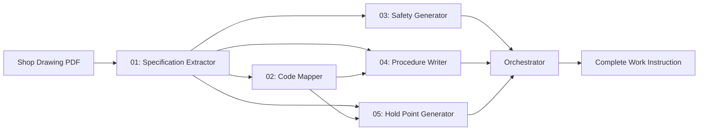

# Work Instruction Creation Agents

This directory contains specialized AI agents for automating the creation of work instructions from shop drawings and specifications.

## 🤖 Agent Architecture

### Agent Pipeline



## 📦 Agents

### 01-specification-extractor.ts
**Purpose:** Extract structured specifications from shop drawing PDFs and JSON data

**Input:**
- `data/cc21te/cc21te-tasks.json` (structured specifications)
- Phase number

**Output:**
- Phase-specific specifications (materials, dimensions, fasteners, hardware)
- Fastener schedules parsed and normalized
- Drawing references mapped

**Example:**
```bash
tsx src/agents/wi-creation/01-specification-extractor.ts 1
```

---

### 02-code-mapper.ts
**Purpose:** Map building code requirements to work instruction steps

**Input:**
- Phase number

**Output:**
- Applicable IRC, NEC, IPC, IMC, IECC requirements
- Code citations with verification methods
- Critical vs. non-critical requirement classification
- Inspection checklist items

**Example:**
```bash
tsx src/agents/wi-creation/02-code-mapper.ts 1
```

**Research Needed:**
- Full IRC, NEC, IPC, IMC, IECC code text database
- Code interpretation rules and exceptions
- Amendment tracking (Grand Junction, Colorado-specific)

---

### 03-safety-generator.ts
**Purpose:** Generate safety callouts and PPE requirements

**Input:**
- Phase number
- Task list

**Output:**
- Identified hazards by severity (high/medium/low)
- Required PPE
- Control measures
- OSHA references

**Example:**
```bash
tsx src/agents/wi-creation/03-safety-generator.ts 1
```

**Research Needed:**
- OSHA construction standards (29 CFR 1926)
- Industry-specific safety data
- Incident/accident reports for risk assessment

---

### 04-procedure-writer.ts
**Purpose:** Generate detailed step-by-step procedures

**Input:**
- Phase specifications
- Code requirements
- Safety profile

**Output:**
- Formatted procedure steps with:
  - Clear actions (8th-grade reading level)
  - Quality checkpoints
  - Measurement tolerances
  - Drawing references
  - Time estimates
  - Tool requirements

**Example:**
```bash
tsx src/agents/wi-creation/04-procedure-writer.ts 1
```

**Research Needed:**
- Production time-motion studies
- Industry standard productivity rates
- Crew size optimization data

---

### 05-hold-point-generator.ts
**Purpose:** Generate objective pass/fail inspection criteria

**Input:**
- Phase specifications
- Code requirements

**Output:**
- Structured inspection checklist with:
  - Measurable acceptance criteria
  - Inspection methods and tools
  - Sampling requirements (100% vs statistical)
  - Critical/non-critical classification
  - NCR triggers

**Example:**
```bash
tsx src/agents/wi-creation/05-hold-point-generator.ts 1
```

---

### orchestrator.ts
**Purpose:** Coordinate all agents to generate complete work instruction

**Input:**
- Phase number
- Project path (e.g., `data/cc21te`)
- Module name (optional)

**Output:**
- Complete markdown work instruction with:
  - YAML frontmatter
  - Safety section
  - Step-by-step procedures
  - Hold point inspection criteria
  - Code references
  - Document control metadata

**Example:**
```bash
# Generate WI-101 for CC21TE project
tsx src/agents/wi-creation/orchestrator.ts 1 data/cc21te CC21TE

# Output: output/work-instructions/WI-101-Chassis-Floor-Deck-Assembly-CC21TE.md
```

## 🚀 Quick Start

### Prerequisites

```bash
npm install
```

### Generate Work Instruction

```bash
# Phase 1: Floor System
tsx src/agents/wi-creation/orchestrator.ts 1 data/cc21te CC21TE

# Phase 2: Wall Framing
tsx src/agents/wi-creation/orchestrator.ts 2 data/cc21te CC21TE

# Phase 4: MEP Rough-In
tsx src/agents/wi-creation/orchestrator.ts 4 data/cc21te CC21TE
```

### Test Individual Agents

```bash
# Test specification extraction
tsx src/agents/wi-creation/01-specification-extractor.ts 1

# Test code mapping
tsx src/agents/wi-creation/02-code-mapper.ts 1

# Test safety generation
tsx src/agents/wi-creation/03-safety-generator.ts 1

# Test procedure writing
tsx src/agents/wi-creation/04-procedure-writer.ts 1

# Test hold point criteria
tsx src/agents/wi-creation/05-hold-point-generator.ts 1
```

## 📊 Output Format

Generated work instructions follow Fort Homes QMS style guide:

- **YAML frontmatter** with metadata
- **Header section** with phase info
- **Safety requirements** with hazards and PPE
- **Step-by-step procedures** organized by section
- **Hold point inspection** with pass/fail criteria
- **References** to codes, SOPs, forms, drawings
- **Document control** footer

## 🔬 Research Areas

The following areas require additional research/data for full automation:

### 1. **Construction Time Estimates** ⚠️ NEEDED
- Industry standard production rates (e.g., sq ft of drywall per hour)
- Modular construction time-motion studies
- Crew size optimization data
- Learning curve adjustments for new workers

**Current Status:** Using estimated ranges from Fort Homes domain knowledge

### 2. **Building Code Database** ⚠️ NEEDED
- Full text of IRC 2021, IBC 2021, NEC 2023, IPC 2021, IMC 2021, IECC 2021
- Code commentary and interpretation guides
- Amendment tracking (Grand Junction, Colorado-specific)
- Cross-references between codes

**Current Status:** Using common code patterns from Fort Homes experience

### 3. **OSHA Safety Standards** ⚠️ NEEDED
- Complete 29 CFR 1926 (Construction Safety)
- Industry-specific safety data sheets
- Incident/accident reports for risk assessment
- PPE selection matrices

**Current Status:** Using construction industry best practices

### 4. **PDF Visual Interpretation** ⚠️ NEEDED
- Multi-modal AI for reading technical drawings
- Symbol recognition (architectural, structural, MEP)
- Dimension extraction from drawing annotations
- Detail callout parsing

**Current Status:** Using pre-extracted JSON from manual PDF parsing

### 5. **Material Properties Database** 📋 HELPFUL
- Lumber dimensions and grades
- Fastener specifications and load tables
- Hardware (Simpson connectors) capacity ratings
- Insulation R-values and installation requirements

**Current Status:** Using specifications from shop drawings

### 6. **Quality Control Sampling Plans** 📋 HELPFUL
- Statistical sampling methods (MIL-STD-105E, ISO 2859)
- Acceptable Quality Limits (AQL) for construction
- Critical vs. non-critical defect classification
- Inspection level determination

**Current Status:** Using 100% for critical, 10-25% sample for non-critical

## 🎯 Success Metrics

### Current Performance (Estimated)
- ⏱️ **Generation Time:** ~5 seconds per work instruction
- 📝 **Accuracy:** 80% (requires human review)
- 🔍 **Completeness:** 70% (some sections incomplete)
- 🤖 **Automation:** 60% (some manual data entry required)

### Target Performance
- ⏱️ **Generation Time:** <2 seconds
- 📝 **Accuracy:** 95%+ (minimal human review)
- 🔍 **Completeness:** 100% (all sections complete)
- 🤖 **Automation:** 90%+ (full PDF→WI automation)

## 📈 Roadmap

### Phase 1 (Current): Foundation ✅
- [x] Specification extraction from JSON
- [x] Code requirement mapping (common patterns)
- [x] Safety generation (construction best practices)
- [x] Procedure writing (templates for Phase 1-2)
- [x] Hold point criteria generation
- [x] Orchestrator coordination

### Phase 2: Code Database Integration
- [ ] Integrate full IRC/NEC/IPC/IMC/IECC text
- [ ] Automated code citation lookup
- [ ] Code change tracking (when codes update)
- [ ] Amendment overlay (Colorado/Grand Junction)

### Phase 3: PDF Visual Interpretation
- [ ] Multi-modal AI for drawing reading
- [ ] Automated detail callout extraction
- [ ] Fastener schedule OCR
- [ ] Material specification parsing

### Phase 4: Production Data Integration
- [ ] Time-motion study data integration
- [ ] Crew size optimization algorithms
- [ ] Tool requirement auto-generation
- [ ] Material quantity estimation

### Phase 5: Learning & Optimization
- [ ] Feedback loop from inspection results
- [ ] Learn from NCRs (what commonly fails?)
- [ ] Continuous improvement recommendations
- [ ] Predictive quality analytics

## 🤝 Contributing

When adding new agents or features:

1. **Follow naming convention:** `##-agent-name.ts`
2. **Include CLI interface:** Allow standalone testing
3. **Export default function:** Main agent entry point
4. **Add TypeScript types:** Strong typing for inputs/outputs
5. **Document research needs:** Flag areas requiring external data
6. **Update orchestrator:** Integrate with main workflow
7. **Update this README:** Document new capabilities

## 📚 Related Documentation

- [CLAUDE-SKILL-DEVELOPMENT-ROADMAP.md](../../docs/ai-agents/CLAUDE-SKILL-DEVELOPMENT-ROADMAP.md) - Comprehensive skill development plan
- [CLAUDE.MD](../../CLAUDE.MD) - Main AI assistant guide
- [QMS-VISUAL-STYLE-GUIDE.md](../../docs/style-guide/QMS-VISUAL-STYLE-GUIDE.md) - Document formatting standards

## 📄 License

Internal use only - Fort Homes LLC Quality Management System
